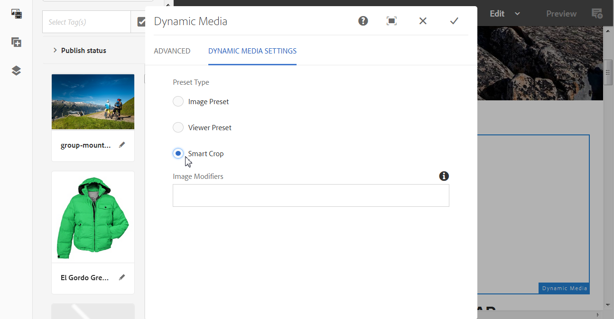
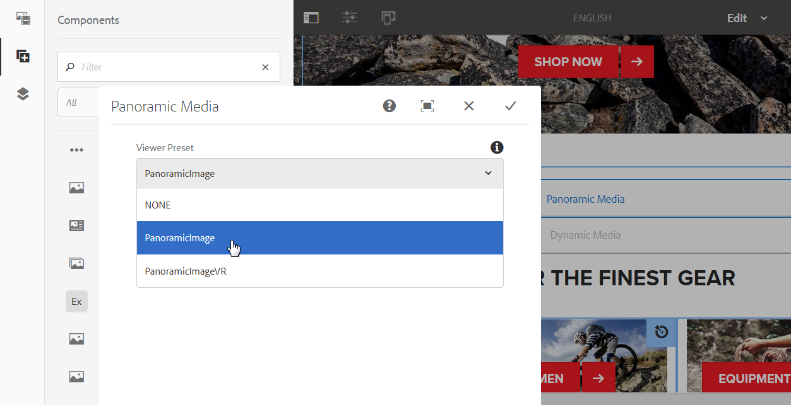
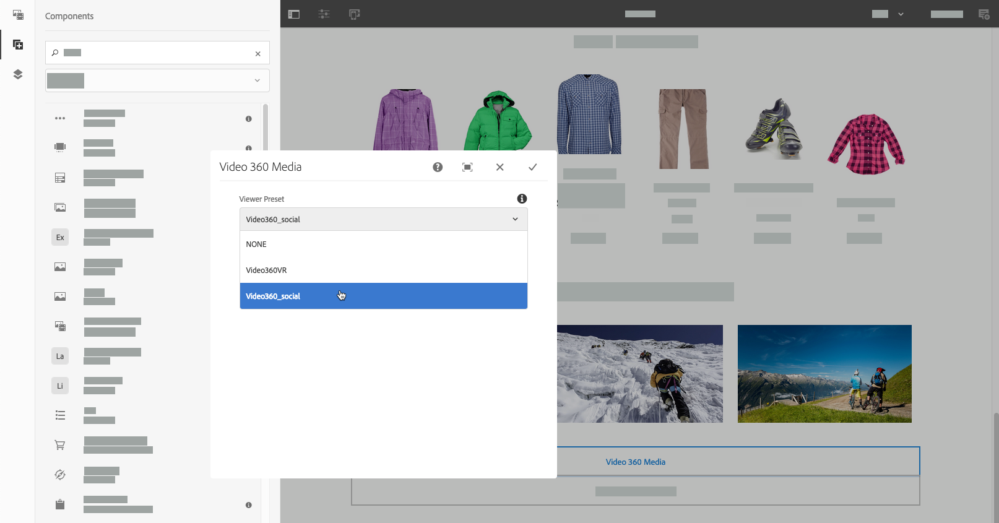

# Aggiunta di risorse Dynamic Media alle pagine{#adding-dynamic-media-assets-to-pages}

Per aggiungere la funzionalità Dynamic Media alle risorse utilizzate sui siti web, puoi inserire direttamente nella pagina il componente **Dynamic Media**, **File multimediali interattivi**, **Elemento multimediale panoramico** o **File multimediali video 360**. Per aggiungere i componenti, entra in modalità Layout e abilita i componenti Dynamic Media. Quindi, potrai aggiungere questi componenti alla pagina e fornire così risorse al componente. I componenti Dynamic Media sono intelligenti: rilevano l’aggiunta di un’immagine o di un video, dunque le opzioni di configurazione disponibili cambiano di conseguenza.

Puoi aggiungere risorse Dynamic Media direttamente alla pagina se utilizzi Adobe Experience Manager come WCM. Se utilizzi una terza parte per WCM, [collegamento](/help/assets/linking-urls-to-yourwebapplication.md) o [incorporare](/help/assets/embed-code.md) le risorse. Per un sito web dinamico di terze parti, consulta la sezione [Distribuzione di immagini ottimizzate in un sito dinamico](/help/assets/responsive-site.md).

>[!NOTE]
>
>Accertati di pubblicare le risorse prima di aggiungerle alle pagine di Experience Manager. Vedi [Pubblicare risorse Dynamic Media](/help/assets/publishing-dynamicmedia-assets.md).

## Aggiungere un componente Dynamic Media a una pagina {#adding-a-dynamic-media-component-to-a-page}

L’aggiunta a una pagina di un componente Media 3D, Dynamic Media, File multimediali interattivi, File multimediali panoramici, Video Ritaglio avanzato o File multimediali video 360 equivale all’aggiunta di un componente a qualsiasi pagina. I componenti Dynamic Media sono descritti nelle sezioni seguenti.

**Per aggiungere un componente Dynamic Media a una pagina:**

1. Ad Experience Manager, apri la pagina in cui desideri aggiungere il componente Dynamic Media.
1. Nel pannello a sinistra della pagina (se necessario, attiva o disattiva la visualizzazione del pannello laterale), seleziona la **[!UICONTROL Componenti]** icona.
1. Sotto la **[!UICONTROL Componenti]** nell’elenco a discesa, seleziona **[!UICONTROL Dynamic Media]**.

   Se non è disponibile alcun elenco di componenti Dynamic Media, è necessario abilitare i componenti Dynamic Media che si desidera utilizzare. Vedi [Abilita componenti Dynamic Media](#enabling-dynamic-media-components).

   

1. Trascina un **[!UICONTROL Dynamic Media]** e rilasciarlo nella posizione desiderata sulla pagina.

1. Passa il puntatore del mouse direttamente sul componente. Quando un componente è circondato da una casella blu, seleziona una volta per visualizzare la barra degli strumenti del componente. Seleziona la **[!UICONTROL Configurazione (chiave inglese)]** icona.

   

1. A seconda del componente Dynamic Media rilasciato sulla pagina, viene visualizzata una finestra di dialogo di configurazione. [Impostare le opzioni del componente](/help/assets/adding-dynamic-media-assets-to-pages.md#dynamic-media-components) se necessario.

   L&#39;esempio seguente mostra Dynamic Media **[!UICONTROL Video 360]** e le opzioni disponibili nell’elenco a discesa Predefinito visualizzatore .

   

   Componente Dynamic Media Video 360 Media.

1. Al termine, nell’angolo superiore destro della finestra di dialogo, seleziona il segno di spunta per salvare le modifiche.

### Abilita componenti Dynamic Media {#enabling-dynamic-media-components}

Se non è disponibile alcun componente Dynamic Media da aggiungere a una pagina, è probabile che sia necessario prima abilitare i componenti da utilizzare.

**Per abilitare i componenti Dynamic Media:**

1. Ad Experience Manager, apri la pagina in cui desideri aggiungere il componente Dynamic Media.
1. Sul lato sinistro della barra degli strumenti vicino alla parte superiore della pagina, seleziona l’icona Informazioni pagina , quindi seleziona **[!UICONTROL Modifica modello]** dall’elenco a discesa.

   

1. Sul lato destro della barra degli strumenti vicino alla parte superiore della pagina, seleziona dall’elenco a discesa **[!UICONTROL Struttura]**.

   

1. Nella parte inferiore della pagina, seleziona **[!UICONTROL Contenitore di layout]** per aprire la relativa barra degli strumenti, seleziona l’icona Criterio .
1. Sulla **[!UICONTROL Contenitore di layout]** sotto **[!UICONTROL Proprietà]** assicurati che **[!UICONTROL Componenti consentiti]** è selezionata.

   

1. Scorri fino a visualizzare **[!UICONTROL Dynamic Media]**.
1. Seleziona l’icona > a sinistra di **[!UICONTROL Dynamic Media]** per espandere l’elenco, quindi selezionare i componenti Dynamic Media che si desidera abilitare.

   

1. Vicino all&#39;angolo superiore destro del **[!UICONTROL Contenitore di layout]** selezionate l’icona Fine (segno di spunta).

1. Sul lato destro della barra degli strumenti vicino alla parte superiore della pagina, seleziona dall’elenco a discesa **[!UICONTROL Contenuto iniziale]**, quindi [aggiungere un componente Dynamic Media a una pagina](#adding-a-dynamic-media-component-to-a-page) come al solito.

## Localizzare i componenti Dynamic Media {#localizing-dynamic-media-components}

Puoi localizzare i componenti Dynamic Media in uno dei due modi seguenti:

* In una pagina web di Sites, apri **[!UICONTROL Proprietà]** e seleziona la scheda **[!UICONTROL Avanzate]**. Scegli la lingua desiderata per la localizzazione.

   

* Dal selettore del sito, seleziona la pagina o il gruppo di pagine desiderato. Seleziona **[!UICONTROL Proprietà]** e seleziona la **[!UICONTROL Avanzate]** scheda . Scegli la lingua desiderata per la localizzazione.

   >[!NOTE]
   >
   >Si prega di notare che non tutte le lingue disponibili nella **[!UICONTROL Lingua]** al momento sono assegnati token.

## Componente elementi multimediali dinamici {#dynamic-media-components}

I componenti di Dynamic Media sono disponibili quando selezioni **[!UICONTROL Componenti]** , quindi filtra **[!UICONTROL Dynamic Media]**.

I componenti Dynamic Media disponibili includono:

* **[!UICONTROL Dynamic Media]**: da utilizzare per risorse quali immagini, video, eCatalog e set 360 gradi.
* **[!UICONTROL File multimediali interattivi]** : da utilizzare per qualsiasi risorsa interattiva, ad esempio video interattivo, immagini interattive o set carosello.
* **[!UICONTROL Supporti panoramici]** - Utilizzare per immagini panoramiche o risorse di immagini VR panoramiche.
* **[!UICONTROL Video 360]** - Da utilizzare per 360 video e 360 risorse video VR.

>[!NOTE]
>
>Questi componenti non sono disponibili per impostazione predefinita; devono essere resi disponibili tramite l’editor modelli prima di utilizzarli. [Una volta resi disponibili i](/help/sites-authoring/templates.md#editing-templates-template-authors)Nell’editor modelli, puoi aggiungere i componenti alla pagina come qualsiasi altro componente di Experience Manager.

### Componente elementi multimediali dinamici {#dynamic-media-component}

Il componente Dynamic Media è intelligente. Sia che si aggiunga un’immagine o un video, sono disponibili varie opzioni. Il componente supporta i predefiniti per immagini e i visualizzatori basati su immagini, come set di immagini, set di rotazione, set di file multimediali diversi e video. Inoltre, il visualizzatore è reattivo: le dimensioni dello schermo cambiano automaticamente in base alle dimensioni dello schermo. Tutti i visualizzatori sono visualizzatori HTML5.

>[!NOTE]
>
>Se la pagina web ha i seguenti elementi:
>
>* istanze multiple del componente Dynamic Media in uso sulla stessa pagina.
>* Ogni istanza utilizza lo stesso tipo di risorsa.
>
>L’assegnazione di un predefinito visualizzatore diverso a ciascun componente Dynamic Media in quella pagina non è supportata.
>
>Tuttavia, puoi utilizzare lo stesso predefinito visualizzatore per tutti i componenti di Dynamic Media che utilizzano risorse dello stesso tipo, all’interno della pagina.

Quando aggiungi il Componente elementi multimediali dinamici e le **[!UICONTROL Impostazioni elemento multimediale dinamico]** sono vuote o non è possibile aggiungere correttamente una risorsa, controlla quanto segue:

* È stato [abilitato Elemento multimediale dinamico](/help/assets/config-dynamic.md). Dynamic Media è disattivato per impostazione predefinita.
* L&#39;immagine è in formato TIFF piramidale. Le immagini importate prima di abilitare Dynamic Media non dispongono di un file TIFF piramidale.

#### Quando si lavora con le immagini {#when-working-with-images}

Il componente elementi multimediali dinamici consente di aggiungere immagini dinamiche, compresi set di immagini, set di rotazione e set di file multimediali diversi. È possibile ingrandire, ridurre e, se applicabile, ruotare un&#39;immagine all&#39;interno di un set 360 gradi, o selezionare un&#39;immagine da un altro tipo di set.

È possibile anche configurare il predefinito visualizzatore, il predefinito immagine o il formato immagine direttamente nel componente. Per rendere un’immagine reattiva, puoi impostare i punti di interruzione o applicare un predefinito per immagini reattive.

Modifica le seguenti impostazioni di Dynamic Media selezionando la **[!UICONTROL Modifica]** nel componente e quindi **[!UICONTROL Impostazioni Dynamic Media]**.

>[!NOTE]
>
>Per impostazione predefinita, il componente immagine Dynamic Media è adattivo. Se vuoi impostarne una dimensione fissa, lo puoi fare nella scheda **[!UICONTROL Avanzate]** del componente, alle voci **[!UICONTROL Larghezza]** e **[!UICONTROL Altezza]**.

* **[!UICONTROL Predefinito visualizzatore]** - Seleziona un predefinito per visualizzatori esistente dal menu a discesa. Se il predefinito per visualizzatori che stai cercando non è visibile, devi renderlo visibile. Vedi [Gestire i predefiniti per visualizzatori](/help/assets/managing-viewer-presets.md). Non puoi selezionare un predefinito visualizzatore se utilizzi un predefinito immagine e viceversa.

   Questa opzione è l’unica disponibile se visualizzi set di immagini, set 360 gradi o set di file multimediali diversi. I predefiniti visualizzatore visualizzati sono intelligenti: vengono visualizzati solo i predefiniti visualizzatore pertinenti.

* **[!UICONTROL Modificatori visualizzatore]** - I modificatori del visualizzatore assumono la forma di coppia nome=valore con un delimitatore &amp; e consentono di modificare i visualizzatori come descritto nella Guida di riferimento visualizzatori. Un esempio di modificatore visualizzatore è `posterimage=img.jpg&caption=text.vtt,1` imposta un’immagine diversa per la miniatura del video e associa un file di sottotitoli/sottotitoli codificati al video.

* **[!UICONTROL Predefinito immagine]** - Seleziona un predefinito per immagini dal menu a discesa. Se il predefinito immagine che cerchi non è visibile, devi renderlo visibile. Consulta Gestione dei predefiniti per immagini. Non puoi selezionare un predefinito visualizzatore se utilizzi un predefinito immagine e viceversa.

   Questa è l&#39;unica opzione disponibile se stai visualizzando set di immagini, set di rotazione o set di file multimediali diversi.

* **[!UICONTROL Modificatori immagine]** - È possibile applicare effetti immagine fornendo ulteriori comandi immagine. Questi effetti sono descritti in Predefiniti immagini e nella documentazione di riferimento Image Serving Command.

   Questa è l&#39;unica opzione disponibile se stai visualizzando set di immagini, set di rotazione o set di file multimediali diversi.

* **[!UICONTROL Punti di interruzione]** - Se utilizzi questa risorsa su un sito reattivo, devi aggiungere i punti di interruzione immagine. I punti di interruzione dell’immagine sono separati da virgole (,). Questa opzione funziona quando non è stata definita alcuna altezza o larghezza in un predefinito immagine.

   Questa è l&#39;unica opzione disponibile se stai visualizzando set di immagini, set di rotazione o set di file multimediali diversi.

   È possibile modificare le seguenti impostazioni avanzate selezionando **[!UICONTROL Modifica]** nel componente.

* **[!UICONTROL Ottimizzazione per dispositivi ad alta risoluzione]** - Seleziona (impostazione predefinita) la casella di controllo per consentire l’ottimizzazione DPR (Device Pixel Ratio).

   La **[!UICONTROL Ottimizzazione per dispositivi ad alta risoluzione]** viene visualizzata solo quando quanto segue è vero:

   * In Tipo di predefinito, **[!UICONTROL Predefinito immagine]** è selezionato e **[!UICONTROL RESS_IP]** è selezionato tra i **[!UICONTROL Predefinito immagine]** elenco a discesa.

   

   Vedi anche [Informazioni sull’ottimizzazione del rapporto pixel del dispositivo](/help/assets/imaging-faq.md#dpr). Tutti i valori DPR di Adobe Experience Manager Dynamic Media Smart imaging vengono ignorati.

* **[!UICONTROL Titolo]** - Modificare il titolo dell&#39;immagine.

* **[!UICONTROL Testo Alt]** - Aggiungi un titolo all’immagine per gli utenti che hanno disattivato la grafica.

   Questa è l&#39;unica opzione disponibile se stai visualizzando set di immagini, set di rotazione o set di file multimediali diversi.

* **[!UICONTROL URL, Apri in]** - Puoi impostare una risorsa per aprire un collegamento. Imposta l’URL e in Apri in indica se desideri aprirlo nella stessa finestra o in una nuova finestra.

   Questa è l&#39;unica opzione disponibile se stai visualizzando set di immagini, set di rotazione o set di file multimediali diversi.

* **[!UICONTROL Larghezza]** - Immetti il valore in pixel se vuoi che l&#39;immagine sia di dimensioni fisse. Lasciando vuoto questo valore, la risorsa diventa adattiva.

* **[!UICONTROL Altezza]** - Immetti il valore in pixel se vuoi che l&#39;immagine sia di dimensioni fisse. Lasciando vuoto questo valore, la risorsa diventa adattiva.

#### Quando esegui operazioni con i Video {#when-working-with-video}

Utilizza il componente Dynamic Media per aggiungere video dinamici alle pagine web. Quando modifichi il componente, puoi scegliere di utilizzare un predefinito visualizzatore video per la riproduzione del video sulla pagina.

Modifica le seguenti impostazioni di Dynamic Media selezionando **[!UICONTROL Modifica]** nel componente.

>[!NOTE]
>
>Per impostazione predefinita, il componente video elementi multimediali dinamici è adattivo. Se vuoi impostarne una dimensione fissa, impostala nel componente con la **[!UICONTROL Larghezza]** e **[!UICONTROL Altezza]** in **[!UICONTROL Avanzate]** scheda .

* **[!UICONTROL Predefinito visualizzatore]** - Seleziona un predefinito per visualizzatori video dal menu a discesa. Se il predefinito per visualizzatori che stai cercando non è visibile, devi renderlo visibile. Vedi [Gestire i predefiniti per visualizzatori](/help/assets/managing-viewer-presets.md).

* **[!UICONTROL Modificatori visualizzatore]** - I modificatori del visualizzatore assumono la forma di coppia nome=valore con un delimitatore &amp; e consentono di modificare i visualizzatori come descritto nella Guida di riferimento visualizzatori di Adobe. Un esempio di modificatore visualizzatore è `posterimage=img.jpg&caption=text.vtt,1`

   Con i modificatori visualizzatore, ad esempio, puoi effettuare le seguenti operazioni:

   * Associare un file di didascalia a un video: [didascalia][https://experienceleague.adobe.com/docs/dynamic-media-developer-resources/library/viewers-aem-assets-dmc/video/command-reference-url-video/r-html5-video-viewer-url-caption.html](https://experienceleague.adobe.com/docs/dynamic-media-developer-resources/library/viewers-aem-assets-dmc/video/command-reference-url-video/r-html5-video-viewer-url-caption.html)
   * Associare un file di navigazione a un video: [navigazione][https://experienceleague.adobe.com/docs/dynamic-media-developer-resources/library/viewers-aem-assets-dmc/video/command-reference-url-video/r-html5-video-viewer-url-navigation.html](https://experienceleague.adobe.com/docs/dynamic-media-developer-resources/library/viewers-aem-assets-dmc/video/command-reference-url-video/r-html5-video-viewer-url-navigation.html)

      È possibile modificare le seguenti impostazioni avanzate selezionando **[!UICONTROL Modifica]** nel componente.

* **[!UICONTROL Titolo]** - Modifica il titolo del video.

* **[!UICONTROL Larghezza]** - Immetti il valore in pixel se vuoi che l&#39;immagine sia di dimensioni fisse. Lasciando vuoto questo valore, la risorsa diventa adattiva.

* **[!UICONTROL Altezza]** - Immetti il valore in pixel se vuoi che l&#39;immagine sia di dimensioni fisse. Lasciando vuoto questo valore, la risorsa diventa adattiva.

#### Quando si lavora con Smart Crop {#when-working-with-smart-crop}

Utilizza il componente Dynamic Media per aggiungere le risorse immagine ritaglio avanzato alle pagine web. Quando modifichi il componente, puoi scegliere di utilizzare un predefinito visualizzatore video per la riproduzione del video sulla pagina.

Vedi anche [Profili immagine](/help/assets/image-profiles.md).

Modifica le seguenti impostazioni di Dynamic Media selezionando **[!UICONTROL Modifica]** nel componente.

>[!NOTE]
>
>Per impostazione predefinita, il componente immagine Dynamic Media è adattivo. Se vuoi impostarne una dimensione fissa, lo puoi fare nella scheda **[!UICONTROL Avanzate]** del componente, alle voci **[!UICONTROL Larghezza]** e **[!UICONTROL Altezza]**.

* **[!UICONTROL Modificatori immagine]** - È possibile applicare effetti immagine fornendo ulteriori comandi immagine. Questi effetti sono descritti in Predefiniti immagini e nella documentazione di riferimento Image Serving Command.

   Questa è l&#39;unica opzione disponibile se stai visualizzando set di immagini, set di rotazione o set di file multimediali diversi.

   È possibile modificare le seguenti impostazioni avanzate selezionando **[!UICONTROL Modifica]** nel componente.

* **[!UICONTROL Abilita corrispondenza proporzioni]** - Per consentire a Dynamic Media di scegliere un rendering di ritaglio avanzato con proporzioni che corrispondano al meglio alle proporzioni dell’immagine originale, seleziona questa opzione.

* **[!UICONTROL Ottimizzazione per dispositivi ad alta risoluzione]** - Seleziona (impostazione predefinita) la casella di controllo per consentire l’ottimizzazione DPR (Device Pixel Ratio).

   La **[!UICONTROL Ottimizzazione per dispositivi ad alta risoluzione]** viene visualizzata solo quando quanto segue è vero:

   * In Tipo di predefinito, **[!UICONTROL Ritaglio avanzato]** è selezionata.

   

   Vedi anche [Informazioni sull’ottimizzazione del rapporto pixel del dispositivo](/help/assets/imaging-faq.md#dpr). Tutti i valori DPR di Adobe Experience Manager Dynamic Media Smart imaging vengono ignorati.

* **[!UICONTROL Titolo]** - Modifica il titolo dell’immagine Ritaglio avanzato.

* **[!UICONTROL Testo Alt]** - Aggiungi un titolo all’immagine di ritaglio avanzato per gli utenti che hanno disattivato la grafica.

   Questa è l&#39;unica opzione disponibile se stai visualizzando set di immagini, set di rotazione o set di file multimediali diversi.

* **[!UICONTROL URL, Apri in]** - Puoi impostare una risorsa per aprire un collegamento. Imposta l’URL e in Apri in indica se desideri aprirlo nella stessa finestra o in una nuova finestra.

   Questa è l&#39;unica opzione disponibile se stai visualizzando set di immagini, set di rotazione o set di file multimediali diversi.

* **[!UICONTROL Larghezza]** - Immetti il valore in pixel se vuoi che l&#39;immagine sia di dimensioni fisse. Lasciando vuoto questo valore, la risorsa diventa adattiva.

* **[!UICONTROL Altezza]** - Immetti il valore in pixel se vuoi che l&#39;immagine sia di dimensioni fisse. Lasciando vuoto questo valore, la risorsa diventa adattiva.

### Componente File multimediali interattivi {#interactive-media-component}

Il Componente File multimediali interattivi è adatto per le risorse che dispongono di interattività, come punti attivi o mappe immagine. Se disponi di un&#39;immagine, un video interattivo o un banner carosello, utilizza il componente **[!UICONTROL File multimediali interattivi]**.

Il componente File multimediali interattivi è intelligente. Sia che si aggiunga un’immagine o un video, sono disponibili varie opzioni. Inoltre, il visualizzatore è reattivo: le dimensioni dello schermo cambiano automaticamente in base alle dimensioni dello schermo. Tutti i visualizzatori sono visualizzatori HTML5.

>[!NOTE]
>
>Se la pagina web ha i seguenti elementi:
>
>* Nella stessa pagina vengono utilizzate più istanze del componente File multimediali interattivi.
>* Ogni istanza utilizza lo stesso tipo di risorsa.
>
>L’assegnazione di un predefinito visualizzatore diverso a ciascun componente File multimediali interattivi in quella pagina non è supportata.
>
>Tuttavia, puoi utilizzare lo stesso predefinito visualizzatore per tutti i componenti File multimediali interattivi che utilizzano risorse dello stesso tipo, all’interno della pagina.

È possibile modificare quanto segue **[!UICONTROL Generale]** selezionando **[!UICONTROL Modifica]** nel componente.

* **[!UICONTROL Predefinito visualizzatore]** - Seleziona un predefinito per visualizzatori esistente dal menu a discesa. Se il predefinito per visualizzatori che stai cercando non è visibile, devi renderlo visibile. I predefiniti per visualizzatori devono essere pubblicati prima di poter essere utilizzati. Consulta Gestione dei predefiniti per visualizzatori. 

* **[!UICONTROL Titolo]** - Modifica il titolo del video.

* **[!UICONTROL Larghezza]** - Immetti il valore in pixel se vuoi che l&#39;immagine sia di dimensioni fisse. Lasciando vuoto questo valore, la risorsa diventa adattiva.

* **[!UICONTROL Altezza]** - Immetti il valore in pixel se vuoi che l&#39;immagine sia di dimensioni fisse. Lasciando vuoto questo valore, la risorsa diventa adattiva.

   È possibile modificare quanto segue **[!UICONTROL Aggiungi al carrello]** selezionando **[!UICONTROL Modifica]** nel componente.

* **[!UICONTROL Mostra risorsa prodotto]** - Per impostazione predefinita, questo valore è selezionato. La risorsa di prodotto mostra un&#39;immagine del prodotto in base a quanto definito nel modulo Commerce. Rimuovi il segno di spunta per non visualizzare la risorsa di prodotto.

* **[!UICONTROL Mostra prezzo prodotto]** - Per impostazione predefinita, questo valore è selezionato. Prezzo del prodotto mostra il prezzo dell&#39;elemento in base a quanto definito nel modulo Commerce. Rimuovi il segno di spunta per non visualizzare il prezzo del prodotto.

* **[!UICONTROL Mostra modulo di prodotto]** - Per impostazione predefinita, questo valore non è selezionato. Il Modulo del prodotto include tutte le varianti del prodotto, come la dimensione e il colore. Rimuovi il segno di spunta per non visualizzare le varianti prodotto.

### Componente elementi multimediali panoramici {#panoramic-media-component}

Il componente Elemento multimediale panoramico è per le risorse che sono immagini panoramiche sferiche. Tali immagini offrono un&#39;esperienza di visualizzazione a 360° di una stanza, proprietà, posizione o paesaggio. Affinché un&#39;immagine si qualifichi come panorama sferico, deve avere uno O entrambi i seguenti elementi:

* Rapporto di formato 2:1.
* Etichettate con le parole chiave `equirectangular` o`spherical` + `panorama`) o (`spherical` + `panoramic`). Vedi [Utilizzo dei tag](/help/sites-authoring/tags.md).

Sia le proporzioni che i criteri delle parole chiave si applicano alle risorse panoramiche della pagina dettagli risorsa e al componente WCM per **[!UICONTROL elementi multimediali panoramici]**.

>[!NOTE]
>
>Se la pagina web ha i seguenti elementi:
>
>* Più istanze del **[!UICONTROL Supporti panoramici]** componente utilizzato sulla stessa pagina.
>* Ogni istanza utilizza lo stesso tipo di risorsa.
>
>Assegnazione di un predefinito visualizzatore diverso a ogni **[!UICONTROL Supporti panoramici]** il componente in quella pagina non è supportato.
>
>Tuttavia, puoi utilizzare lo stesso predefinito visualizzatore per tutti i componenti Elemento multimediale panoramico che utilizzano risorse dello stesso tipo, all’interno della pagina.

Puoi modificare le seguenti impostazioni selezionando **[!UICONTROL Configura]** nel componente.

* **[!UICONTROL Predefinito visualizzatore]** - Seleziona un visualizzatore esistente dal menu a discesa Predefinito visualizzatore .

Se il predefinito per visualizzatori che stai cercando non è visibile, assicurati che sia pubblicato. Pubblica i predefiniti visualizzatore prima di utilizzarli. Consulta [Gestione dei predefiniti per visualizzatori](/help/assets/managing-viewer-presets.md). 

### Componente video 360 {#video-media-component}

Utilizza la **[!UICONTROL Video 360]** per riprodurre video equirettangolari sulla pagina web per un’esperienza di visualizzazione coinvolgente di una stanza, una proprietà, una posizione, un paesaggio o una procedura medica.

Durante la riproduzione su un display piatto, l&#39;utente ha il controllo dell&#39;angolo di visione; la riproduzione su dispositivi mobili utilizza solitamente i controlli giroscopici incorporati.

Il visualizzatore include il supporto nativo per la distribuzione di 360 risorse video. Per impostazione predefinita, non è necessaria alcuna configurazione aggiuntiva per la visualizzazione o la riproduzione. È possibile distribuire video 360 utilizzando estensioni video standard come .mp4, .mkv e .mov. Il codec più comune è H.264.

Puoi modificare le seguenti impostazioni selezionando **[!UICONTROL Configura]** nel componente.

* **[!UICONTROL Predefinito visualizzatore]** - Seleziona un visualizzatore esistente dal menu a discesa Predefinito visualizzatore . Usa Video360VR per gli utenti finali che usano occhiali di realtà virtuale. Include controlli di base sulla riproduzione video e funzioni per social media. Utilizza Video360_social che include controlli di riproduzione video di base. Il rendering video viene eseguito in modalità stereo. Il controllo manuale del punto di vista è disattivato ma il controllo giroscopico è attivato. Non esistono funzioni per social media.

Se il predefinito per visualizzatori che stai cercando non è visibile, assicurati che sia pubblicato. Assicurati di pubblicare i predefiniti visualizzatore prima di utilizzarli. Consulta [Gestione dei predefiniti per visualizzatori](/help/assets/managing-viewer-presets.md). 

### Utilizzo di HTTP/2 per la distribuzione delle risorse Dynamic Media {#using-http-to-delivery-dynamic-media-assets}

HTTP/2 è il nuovo protocollo web aggiornato che migliora il modo in cui i browser e i server comunicano. Fornisce un trasferimento più rapido delle informazioni e riduce la quantità di potenza di elaborazione necessaria. La distribuzione delle risorse Dynamic Media può ora avvenire tramite HTTP/2, garantendo tempi di risposta e caricamento migliori.

Vedi [Distribuzione di contenuti HTTP2](/help/assets/http2.md) per informazioni complete su come iniziare a utilizzare HTTP/2 con il tuo account Dynamic Media.

>[!MORELIKETHIS]
>
>* [Utilizzare il lettore video in Experience Manager Dynamic Media](https://experienceleague.adobe.com/docs/experience-manager-learn/assets/dynamic-media/dynamic-media-video-player-feature-video-use.html)
>* [Utilizzare video interattivi con Experience Manager Dynamic Media](https://experienceleague.adobe.com/docs/experience-manager-learn/assets/dynamic-media/dynamic-media-interactive-video-feature-video-use.html)
>* [Comprendere il Visualizzatore risorse con Experience Manager Dynamic Media](https://experienceleague.adobe.com/docs/experience-manager-learn/assets/dynamic-media/dynamic-media-viewer-feature-video-understand.html)
>* [Usa miniatura video personalizzata con Experience Manager Dynamic Media](https://experienceleague.adobe.com/docs/experience-manager-learn/assets/dynamic-media/dynamic-media-video-thumbnails-feature-video-use.html)
>* [Comprendere la gestione del colore con Experience Manager Dynamic Media](https://experienceleague.adobe.com/docs/experience-manager-learn/assets/dynamic-media/dynamic-media-color-management-technical-video-setup.html)
>* [Utilizzo della nitidezza delle immagini con Experience Manager Dynamic Media](https://experienceleague.adobe.com/docs/experience-manager-learn/assets/dynamic-media/dynamic-media-image-sharpening-feature-video-use.html)

