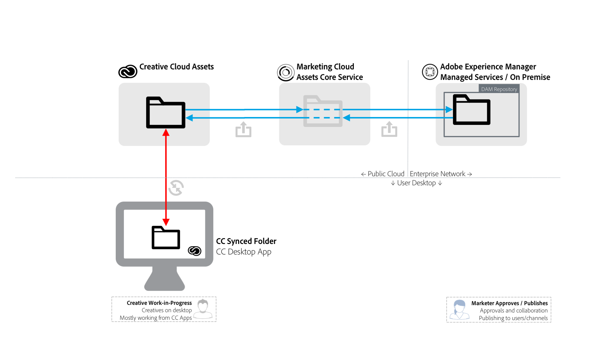

# Condivisione cartella da [!DNL Adobe Experience Manager] a [!DNL Adobe Creative Cloud] {#aem-to-creative-cloud-folder-sharing-best-practices}

>[!CAUTION]
>
>La funzionalità di condivisione cartelle da [!DNL Experience Manager] a [!DNL Creative Cloud] è obsoleta. L&#39;Adobe consiglia di utilizzare funzionalità più recenti, ad esempio [Adobe Asset Link](https://helpx.adobe.com/it/enterprise/using/adobe-asset-link.html) o [Experience Manager Desktop App](https://experienceleague.adobe.com/docs/experience-manager-desktop-app/using/using.html). Ulteriori informazioni sono disponibili in [Best practice per l&#39;integrazione di Experience Manager e Creative Cloud](/help/assets/aem-cc-integration-best-practices.md).

È possibile configurare [!DNL Adobe Experience Manager] per consentire agli utenti di [!DNL Assets] di condividere cartelle con gli utenti di [!DNL Adobe Creative Cloud] app, in modo che siano disponibili come cartelle condivise nel servizio risorse [!DNL Adobe Creative Cloud]. La funzionalità può essere utilizzata per scambiare file tra team creativi e utenti [!DNL Assets], in particolare quando gli utenti creativi non hanno accesso alla distribuzione di [!DNL Assets] (non si trovano nella rete aziendale).

Questo tipo di integrazione può essere utilizzato nei seguenti casi d&#39;uso, in particolare quando si lavora con utenti che non hanno accesso diretto a [!DNL Assets]:

* [!DNL Assets] utenti condividono un set di risorse digitali specifiche con gli utenti di [!DNL Adobe Creative Cloud] file (ad esempio, un resoconto creativo e un set di risorse approvate per il lavoro di progettazione per una nuova attività di marketing).
* [!DNL Assets] utenti ricevono i nuovi file creati da [!DNL Adobe Creative Cloud] utenti dell&#39;app.

>[!NOTE]
>
>Prima di leggere questo documento, puoi esaminare le [best practice per l&#39;integrazione di Experience Manager e Creative Cloud](/help/assets/aem-cc-integration-best-practices.md) per una panoramica dell&#39;integrazione.

## Panoramica {#overview}

La condivisione delle cartelle da [!DNL Experience Manager] a [!DNL Creative Cloud] si basa sulla condivisione lato server di cartelle e file tra gli account [!DNL Assets] e [!DNL Creative Cloud]. I creativi professionisti, che utilizzano l&#39;app desktop [!DNL Creative Cloud] sui propri desktop, possono anche rendere le cartelle condivise disponibili direttamente sui propri dischi utilizzando la tecnologia [!DNL Adobe CreativeSync].

Il diagramma seguente fornisce una panoramica dell’integrazione.

L’integrazione include i seguenti elementi:

* **[!DNL Experience Manager Assets]** distribuito nella rete aziendale (Managed Services o on-premise): la condivisione delle cartelle viene avviata qui.
* Servizio di base **[!DNL Adobe Experience Cloud Assets]**: funge da intermediario tra [!DNL Experience Manager] e [!DNL Creative Cloud] servizi di archiviazione. Un amministratore di un&#39;organizzazione che utilizza l&#39;integrazione deve stabilire una relazione di trust tra l&#39;organizzazione Experience Cloud e la distribuzione [!DNL Assets]. Inoltre, [definiscono un elenco di collaboratori Creative Cloud approvati](https://experienceleague.adobe.com/docs/core-services/interface/services/assets/t-admin-add-cc-user.html), che [!DNL Assets] utenti possono condividere cartelle per una maggiore sicurezza.

* **[!DNL Creative Cloud]Assets Web Services** (archiviazione e interfaccia Web di [!DNL Creative Cloud] file): è qui che specifici utenti dell&#39;app Creative Cloud, con cui è stata condivisa una cartella [!DNL Assets], potrebbero accettare l&#39;invito e visualizzare la cartella nell&#39;archivio dell&#39;account Creative Cloud.
* **Creative Cloud app desktop**: (facoltativo) consente l&#39;accesso diretto alle cartelle o ai file condivisi dal desktop dell&#39;utente creativo tramite la sincronizzazione con l&#39;archivio Assets [!DNL Creative Cloud].

## Caratteristiche e limitazioni {#characteristics-and-limitations}

* **Propagazione unidirezionale delle modifiche:** Le modifiche al file vengono propagate in una sola direzione, dal sistema ([!DNL Experience Manager] o [!DNL Creative Cloud Assets]), in cui la risorsa è stata originariamente creata (caricata). L&#39;integrazione non fornisce una sincronizzazione bidirezionale completamente automatizzata tra i due sistemi.
* **Controllo versioni:**

   * [!DNL Experience Manager] crea le versioni di una risorsa agli aggiornamenti solo se il file ha avuto origine in [!DNL Experience Manager] e viene aggiornato lì.
   * [!DNL Creative Cloud] Assets fornisce la propria [funzione di controllo delle versioni](https://helpx.adobe.com/creative-cloud/help/versioning-faq.html) destinata agli aggiornamenti in corso di lavorazione (in pratica, archivia gli aggiornamenti per un massimo di dieci giorni)

* **Limitazioni di spazio:** Le dimensioni e i volumi dei file scambiati sono limitati dalla specifica [quota Assets di Creative Cloud](https://helpx.adobe.com/creative-cloud/kb/file-storage-quota.html) per gli utenti creativi (dipende dal livello di abbonamento) e da una limitazione di 5 GB di dimensione massima dei file. Lo spazio è inoltre limitato dalla quota di risorse di cui dispone l’organizzazione nel servizio di base Adobe Experience Cloud Assets.

* **Requisiti di spazio:** I file nelle cartelle condivise devono inoltre essere fisicamente archiviati in [!DNL Experience Manager] e quindi nell&#39;account [!DNL Creative Cloud], con una copia memorizzata nella cache nel servizio di base [!DNL Experience Cloud Assets].
* **Rete e larghezza di banda:** I file nelle cartelle condivise e tutti gli aggiornamenti devono essere trasportati in rete tra i sistemi. Assicurati che solo i file e gli aggiornamenti pertinenti siano condivisi.
* **Tipo di cartella**: la condivisione di una cartella [!DNL Assets] di tipo `sling:OrderedFolder` non è supportata nel contesto della condivisione in [!DNL Adobe Experience Cloud]. Se si desidera condividere una cartella, durante la creazione in [!DNL Assets] non selezionare l&#39;opzione [!UICONTROL Ordinata].

## Best practice {#best-practices}

Le best practice per l&#39;utilizzo della condivisione cartelle da [!DNL Experience Manager] a [!DNL Creative Cloud] includono:

* **Considerazioni sul volume:** [!DNL Experience Manager] e [!DNL Creative Cloud] Condivisione cartella devono essere utilizzati per condividere un numero inferiore di file, ad esempio relativi a una campagna o attività specifica. Per condividere set di risorse più grandi, come tutte le risorse approvate nell&#39;organizzazione, utilizzare altri metodi di distribuzione (ad esempio, [!DNL Assets Brand Portal]) o [!DNL Experience Manager] app desktop.
* **Evita la condivisione di gerarchie profonde:** La condivisione funziona in modo ricorsivo e non consente l&#39;annullamento selettivo della condivisione. In genere, solo le cartelle senza sottocartelle o con una gerarchia superficiale, come un livello di sottocartelle, devono essere considerate per la condivisione.
* **Cartelle separate per la condivisione unidirezionale:** Utilizzare cartelle separate per la condivisione delle risorse finali da [!DNL Assets] a [!DNL Creative Cloud] file e per la condivisione delle risorse pronte per la creazione da [!DNL Creative Cloud] file a [!DNL Assets]. Insieme a una buona convenzione di denominazione per queste cartelle, crea un ambiente di lavoro più semplice da comprendere per [!DNL Assets] e [!DNL Creative Cloud] utenti.
* **Evitare WIP nella cartella condivisa:** Non utilizzare una cartella condivisa per Work in Progress. Utilizzare una cartella separata in File di Creative Cloud per eseguire operazioni che richiedono frequenti modifiche al file.
* **Avvia nuovo lavoro all&#39;esterno della cartella condivisa:** Le nuove progettazioni (file creativi) devono essere avviate nella cartella WIP separata in File di Creative Cloud e quando sono pronte per essere condivise con [!DNL Assets] utenti, devono essere spostate o salvate nella cartella condivisa.
* **Semplifica la struttura di condivisione:** Per una configurazione operativa più gestibile, prova a semplificare la struttura di condivisione. Invece di condividere con tutti gli utenti creativi, le cartelle [!DNL Assets] devono essere condivise solo con i rappresentanti del team, come un direttore creativo o un manager del team. Il manager dal lato creativo riceverà i cespiti finali, deciderà le assegnazioni di lavoro e quindi lascerà che i designer lavorino sui cespiti WIP nel proprio account di Creative Cloud. Possono utilizzare le funzioni di collaborazione Creative Cloud per coordinare il lavoro e infine selezionare e inserire le risorse pronte per la condivisione su [!DNL Assets] nella propria cartella condivisa pronta per la creazione.

Il diagramma seguente illustra un esempio di configurazione per la creazione di progettazioni basate su risorse finali esistenti da [!DNL Assets].

