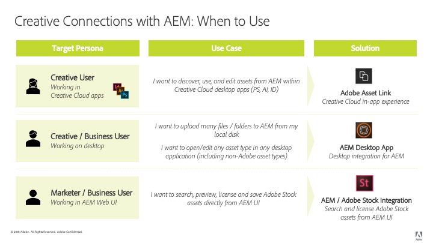

# [!DNL Adobe Experience Manager] e [!DNL Creative Cloud] best practice per l’integrazione {#aem-and-creative-cloud-integration-best-practices}

| Versione | Collegamento articolo |
| -------- | ---------------------------- |
| AEM as a Cloud Service | [Fai clic qui](https://experienceleague.adobe.com/docs/experience-manager-cloud-service/content/assets/manage/aem-cc-integration-best-practices.html?lang=en) |
| AEM 6.5 | Questo articolo |

[!DNL Adobe Experience Manager Assets] è una soluzione di gestione delle risorse digitali (DAM) che può essere integrata con [!DNL Adobe Creative Cloud] aiutare gli utenti DAM a collaborare con i team creativi, semplificando la collaborazione nel processo di creazione dei contenuti.

[!DNL Adobe Creative Cloud] fornisce ai team creativi un ecosistema di soluzioni e servizi per aiutarli a creare risorse digitali. Include applicazioni desktop e mobili, servizi cloud come l’archiviazione con sincronizzazione desktop o esperienza web e marketplace come [!DNL Adobe Stock].

Continua a leggere per scoprire quali integrazioni scegliere tra desktop e DAM di livello Enterprise in base al tuo caso d’uso e quali sono le best practice associate per i flussi di lavoro di connessione.

>[!NOTE]
>
>[!DNL Experience Manager] a [!DNL Creative Cloud] La condivisione delle cartelle è obsoleta e non è più trattata in questa guida. L’Adobe consiglia di utilizzare funzionalità più recenti, come [Adobe collegamento risorsa](https://helpx.adobe.com/it/enterprise/using/adobe-asset-link.html) o [app desktop Experience Manager](https://experienceleague.adobe.com/docs/experience-manager-desktop-app/using/troubleshoot.html) per consentire ai creativi di accedere alle risorse gestite in [!DNL Experience Manager].

## Esigenze di collaborazione di creativi, addetti al marketing e utenti DAM {#collaboration-needs-of-creatives-marketers-and-dam-users}

| Requisiti | Caso d’uso | Superfici interessate |
|---|---|---|
| Esperienza semplificata per i creativi sul desktop | Accesso semplificato alle risorse da un DAM ([!DNL Experience Manager Assets]) per i creativi o, più in generale, per gli utenti che lavorano in applicazioni per la creazione di risorse native dal desktop. Hanno bisogno di un modo semplice per scoprire, utilizzare (aprire), modificare e salvare le modifiche su [!DNL Experience Manager]e caricare nuovi file. | Windows o Mac desktop; [!DNL Creative Cloud] app |
| Risorse pronte all&#39;uso di alta qualità da [!DNL Adobe Stock] | Gli addetti al marketing contribuiscono ad accelerare il processo di creazione dei contenuti fornendo assistenza per l’origine e il rilevamento delle risorse. I creativi utilizzano le risorse approvate direttamente nei loro strumenti creativi. | [!DNL Experience Manager Assets]; [!DNL Adobe Stock] marketplace; campi metadati |
| Distribuire e condividere le risorse per organizzazioni | Reparti interni/filiali locali e partner esterni, distributori e agenzie utilizzano le risorse approvate condivise dall’organizzazione principale. L’organizzazione desidera condividere in modo sicuro e fluido le risorse create per un riutilizzo più ampio. | Brand Portal, Asset Share Commons |

## Adobi di offerte per supportare le esigenze di collaborazione {#adobe-offerings-to-support-the-collaboration-need}

| Proposta di valore per gli utenti tipo interessati | offerta Adobe | Superfici interessate |
|---|---|---|
| Gli utenti creativi scoprono le risorse da [!DNL Experience Manager], aprirle e utilizzarle, modificarle e caricarle [!DNL Experience Manager], e caricare nuovi file in [!DNL Experience Manager], senza uscire [!DNL Creative Cloud] app. | [Adobe Asset Link](https://helpx.adobe.com/it/enterprise/using/adobe-asset-link.html) | .[!DNL Adobe Photoshop], [!DNL Adobe Illustrator] e [!DNL Adobe InDesign]. |
| Gli utenti aziendali semplificano l’apertura e l’utilizzo delle risorse, la modifica e il caricamento delle modifiche in [!DNL Experience Manager], e caricamento di nuovi file in [!DNL Experience Manager] dall&#39;ambiente desktop. Utilizzano un’integrazione generica per aprire qualsiasi tipo di risorsa nell’applicazione desktop nativa, incluse quelle non di Adobe. | [app desktop Experience Manager](https://experienceleague.adobe.com/docs/experience-manager-desktop-app/using/using.html) | [!DNL Experience Manager] app desktop su desktop Win e Mac |
| Gli addetti al marketing e gli utenti aziendali possono scoprire, visualizzare in anteprima, concedere in licenza e salvare le [!DNL Adobe Stock] risorse da [!DNL Experience Manager]. Le risorse concesse in licenza e salvate forniscono una selezione [!DNL Adobe Stock] metadati per una migliore governance. | [Integrazione di Experience Manager e Adobe Stock](aem-assets-adobe-stock.md) | [!DNL Experience Manager] interfaccia web |

Questo articolo si concentra principalmente sui primi due aspetti delle esigenze di collaborazione. La distribuzione e l’approvvigionamento delle risorse su scala viene brevemente citata come caso d’uso. Per tali esigenze, valuta prodotti come Adobe Brand Portal o Asset Share Commons. Soluzioni alternative come [Brand Portal](https://experienceleague.adobe.com/docs/experience-manager-brand-portal/using/home.html), soluzioni che possono essere create in base [Asset Share Commons](https://adobe-marketing-cloud.github.io/asset-share-commons/) componenti, [Condivisione collegamenti](/help/assets/link-sharing.md), utilizzando [Experience Manager Assets](/help/assets/manage-assets.md) devono essere riesaminati in base a requisiti specifici.

### Mappatura dei casi d’uso e soluzioni di Adobe {#mapping-of-use-cases-and-adobe-solutions}

<!-- TBD: Add some info about XD integration and possibly info about DA v2.0.
-->

| Caso d’uso | [!DNL Adobe Asset Link] | App desktop [!DNL Experience Manager] | Osservazioni / Altre soluzioni |
|---|---|---|---|
| Individuare: sfogliare le cartelle DAM | Sì | [!DNL Experience Manager] Interfaccia web e azioni desktop | |
| Individuare: accedere alle raccolte DAM | Sì | [!DNL Experience Manager] Interfaccia web e azioni desktop | |
| Individuazione: ricerca di risorse da DAM | Sì | [!DNL Experience Manager] Interfaccia web e azioni desktop | |
| Usa: apri risorsa | Sì | Sì | [Apri da interfaccia Web](manage-assets.md#previewing-assets) o dal Finder |
| Utilizza: inserisci risorsa da DAM in un documento | Sì - incorporamento | Sì - Collegamento o incorporamento | [!DNL Experience Manager] l’app desktop consente di accedere alle risorse come file sul file system locale. Questi collegamenti nelle app native sono rappresentati da percorsi locali. |
| Modifica: apri per la modifica | Sì - Estrai | Sì - Azione aperta nella condivisione di rete | [Check-out in AAL](https://helpx.adobe.com/it/enterprise/using/manage-assets-using-adobe-asset-link.html) salva la risorsa nell’account di archiviazione di creative cloud dell’utente (sincronizzato dall’app Creative Cloud) per impostazione predefinita. |
| Modifica: lavoro in corso al di fuori di DAM | Sì - Risorsa disponibile nell’account di archiviazione Creative Cloud dell’utente sincronizzato con il desktop. | Sì | |
| Modifica - Carica modifiche | Sì - [Azione di archiviazione](https://helpx.adobe.com/it/enterprise/using/manage-assets-using-adobe-asset-link.html) con commento facoltativo | Sì | |
| Caricamento - file singolo | Sì - carica il documento attivo corrente | Sì | [Carica tramite interfaccia web](manage-assets.md#uploading-assets) |
| Caricamento: più file/strutture di cartelle gerarchiche | No | Sì | [Carica tramite interfaccia web](manage-assets.md#uploading-assets) o tramite script o strumento personalizzato. |
| Varie - utente e accesso | Riconoscimento SSO (Creative Cloud User logged in Creative Cloud Desktop app) | [!DNL Experience Manager] utente e credenziali | Gli utenti di entrambe le soluzioni contano per [!DNL Experience Manager] quota utente. |
| Varie - Rete e accesso | Richiede l&#39;accesso dal desktop dell&#39;utente a [!DNL Experience Manager] distribuzione in rete | Richiede l&#39;accesso dal desktop dell&#39;utente a [!DNL Experience Manager] distribuzione in rete | [!DNL Adobe Asset Link] non condivide l&#39;ambiente proxy di rete. |
| Varie - Migrazione di un numero elevato di risorse | No | No | [Guida alla migrazione di Assets](assets-migration-guide.md) |

Per supportare i casi di utilizzo della distribuzione delle risorse, è necessario prendere in considerazione altre soluzioni:

* [Brand Portal](https://experienceleague.adobe.com/docs/experience-manager-brand-portal/using/home.html) per un componente aggiuntivo SaaS configurabile per [!DNL Experience Manager Assets] per pubblicare le risorse.
* Le soluzioni personalizzate vengono create in base a [Asset Share Commons](https://adobe-marketing-cloud.github.io/asset-share-commons/) base di codice.
* [!DNL Experience Manager] [condivisione collegamenti](/help/assets/link-sharing.md) per condividere le risorse su richiesta tramite collegamenti.
* [Interfaccia web di Experience Manager Assets](/help/assets/manage-assets.md) con aree per parti esterne protette da [!DNL Experience Manager] configurazione del controllo di accesso e con le necessarie regolazioni della configurazione IT/di rete, consentendo a questi utenti esterni di accedere a [!DNL Experience Manager].

## Concetti chiave e casi d’uso {#key-concepts-and-use-cases}

### Glossario dei termini più comuni {#glossary-of-common-terms}

* **Work-in-progress o creative work-in-progress (WIP):** una fase del ciclo di vita delle risorse in cui una risorsa subisce più modifiche e, in genere, non è ancora pronta per essere condivisa con team più grandi.
* **Risorse pronte per i creativi:** [!DNL Assets] pronti per essere condivisi con un team più ampio oppure selezionati o approvati dal team creativo per la condivisione con i team di marketing o LOB.
* **Asset approvals (Approvazioni risorse):** il processo di approvazione che viene eseguito per le risorse già caricate in DAM, che, in genere, include approvazioni del marchio, approvazioni legali e così via.
* **Risorsa finale:** Una risorsa che ha superato tutte le approvazioni/assegnazione tag dei metadati ed è pronta per essere utilizzata dal team più ampio. Tale risorsa viene memorizzata in DAM, per poi essere resa disponibile a tutti gli utenti (o a tutti gli interessati). Può essere utilizzata nei canali di marketing o dai team creativi per la creazione di design.
* **Aggiornamento/modifica risorsa secondaria:** Una modifica rapida e piccola a una risorsa digitale. Spesso viene effettuata in risposta a una richiesta di ritocco o di modifica minore, a una revisione delle risorse o all’approvazione (ad esempio: riposizionamento, modifica dimensioni del testo, regolazione di saturazione/luminosità, colore e così via).
* **Aggiornamento/modifica risorsa principale :** Un passaggio a una risorsa digitale che richiede un lavoro considerevole e che a volte deve essere effettuato in un periodo di tempo più lungo. Generalmente include più modifiche. La risorsa deve essere salvata più volte durante l’aggiornamento. In genere, gli aggiornamenti principali delle risorse fanno sì che la risorsa entri in una fase WIP.
* **DAM:** gestione delle risorse digitali. In questo documento, è sinonimo di [!DNL Experience Manager Assets], salvo indicazione contraria.
* **Creative user (Utente creativo):** un professionista che crea risorse digitali utilizzando le app e i servizi Creative Cloud. In alcuni casi, è possibile che un utente creativo sia membro di un team creativo che utilizza Creative Cloud, ma che non crea risorse digitali, ad esempio un direttore creativo o un manager del team creativo.
* **DAM user (Utente DAM)**: utente tipico di un sistema DAM. A seconda dell’organizzazione, un utente DAM può essere di marketing o non, ad esempio un utente Line-of-Business (LOB), un bibliotecario, un venditore e così via.

### Considerazioni durante l’utilizzo di [!DNL Experience Manager] e [!DNL Creative Cloud] integrazione {#considerations-when-using-aem-and-creative-cloud-integration}

* Consulta [best practice per le app desktop](https://experienceleague.adobe.com/docs/experience-manager-desktop-app/using/troubleshoot.html#best-practices-to-prevent-troubles)
* Consulta [Integrazione con Adobe Stock](aem-assets-adobe-stock.md)
* Consulta [Adobe collegamento risorsa](https://helpx.adobe.com/it/enterprise/using/adobe-asset-link.html)

Questo è un breve riepilogo delle best practice per [!DNL Experience Manager] e [!DNL Creative Cloud] integrazione. Leggi il resto del documento per informazioni dettagliate su questi.

* **Per gli utenti creativi che lavorano in Photoshop, InDesign o Illustrator:** Adobe Asset Link offre la migliore esperienza utente possibile, inclusa la gestione del Work-in-progress sulle risorse estratte da [!DNL Experience Manager].
* **Per semplificare l’accesso alle risorse dal desktop per qualsiasi formato di file o applicazione generica:** utilizzare [!DNL Experience Manager] app desktop.
* **Scopri perché e quando archiviare le risorse in DAM:** Aggiornamenti da rendere disponibili al team più ampio della tua organizzazione.
* **Mind the volume of assets shared (Considera il volume di risorse condivise):** se il caso d’uso è la distribuzione delle risorse, la governance e la sicurezza potrebbero diventare gli aspetti più importanti. Valuta l’utilizzo di strumenti creati per il lavoro in scala, come Brand Portal.
* **Understand asset lifecycle (Informazioni sul ciclo di vita delle risorse):** scopri come le risorse vengono gestite dai diversi team all’interno dell’organizzazione
* **Handle frequent saves to assets with care (Gestisci con attenzione i salvataggi frequenti nelle risorse):** Adobe Asset Link si occupa di questo aspetto con PS, AI, ID. Per altre applicazioni, non eseguire le attività WIP in una cartella condivisa/mappata a meno che non siano necessarie tutte le modifiche in DAM

### Accesso a [!DNL Adobe Stock] risorse da [!DNL Assets] {#access-to-adobe-stock-assets-from-aem-assets}

[Integrazione di Experience Manager e Adobe Stock](/help/assets/aem-assets-adobe-stock.md) fornisce [!DNL Experience Manager] utenti con la possibilità di cercare, visualizzare in anteprima, concedere in licenza e salvare le risorse da [!DNL Adobe Stock] in [!DNL Experience Manager]. Concesso in licenza e salvato [!DNL Stock] risorse selezionate [!DNL Stock] metadati, che possono essere utilizzati per cercarli con filtri aggiuntivi.

Alcuni punti importanti su questa integrazione:

* Quando le risorse da scorte in Adobe vengono salvate in [!DNL Experience Manager], diventano regolari [!DNL Assets], con file binario salvato in [!DNL Experience Manager] archivio. Alcuni metadati relativi a [!DNL Adobe Stock] sono salvati per la risorsa in [!DNL Experience Manager], altrimenti il processo di acquisizione avrà lo stesso aspetto di qualsiasi altro file. Ad esempio, se sono attivi i tag avanzati, questi vengono aggiunti a queste risorse al momento del salvataggio.
* Risorsa salvata in [!DNL Experience Manager] è una copia, non un collegamento di nuovo in [!DNL Adobe Stock].

**Utilizzo delle risorse salvate da [!DNL Adobe Stock] in [!DNL Experience Manager] in[!DNL Creative Cloud]**. Questa integrazione è indipendente da [!DNL Adobe Asset Link], ma [!DNL Adobe Asset Link] riconosce le risorse salvate da [!DNL Stock] in questo modo e visualizza metadati aggiuntivi e un [!DNL Adobe Stock] su queste risorse in [!DNL Adobe Asset Link] Interfaccia utente dell’estensione in [!DNL Photoshop], [!DNL Illustrator], o [!DNL InDesign]. I file sono disponibili per la navigazione, l’apertura e così via, in quanto si tratta di risorse normali quando vengono salvati in [!DNL Experience Manager].
Utenti creativi che lavorano in [!DNL Creative Cloud] app con [!DNL Adobe Asset Link] presente, oltre ad avere accesso alle risorse già concesse in licenza da [!DNL Adobe Stock] in [!DNL Experience Manager], può anche utilizzare [!DNL Creative Cloud] Pannello Librerie per cercare, visualizzare in anteprima e concedere licenze [!DNL Adobe Stock] risorse.
[!DNL Assets] da [!DNL Adobe Stock] concesso in licenza e salvato in [!DNL Experience Manager] diventano disponibili per i team più ampi che accedono [!DNL Experience Manager Assets] , mentre i creativi concedono licenze a risorse provenienti [!DNL Adobe Stock] tramite [!DNL Creative Cloud] Il pannello Librerie li rende disponibili a se stessi solo per impostazione predefinita nei [!DNL Creative Cloud] account.

<!-- 
TBD: A condensed version of the below content is better placed in the Adobe DAM introduction article.
-->

## Informazioni sulla memorizzazione delle risorse in un DAM {#about-storing-assets-in-a-dam}

Per progettare un flusso di lavoro efficiente tra i team creativi e di marketing/line-of-business (LOB) e scegliere le migliori funzionalità di supporto, è importante capire quando e perché le risorse vengono memorizzate in DAM.

### Perché le risorse vengono memorizzate in DAM {#why-assets-are-stored-in-dam}

L’archiviazione delle risorse in DAM ne semplifica l’accesso e la ricerca. In questo modo le risorse possono essere utilizzate da numerosi utenti nell’organizzazione o nell’ecosistema, inclusi partner, clienti e così via.

La maggior parte delle organizzazioni sceglie di memorizzare solo le risorse rilevanti per i processi di marketing/LOB a valle (pubblicazione su canali come il canale web tramite [!DNL Experience Manager Sites] o altri canali gestiti da Adobe Experience Cloud (Marketing Cloud, Advertising Cloud e misurati da Analytics Cloud, che forniscono a utenti/partner e così via). Inoltre, le organizzazioni memorizzano in DAM le risorse che possono essere soggette a un processo di revisione/approvazione. In questo modo, DAM archivia principalmente le risorse che hanno elevate probabilità di essere utilizzate ed evita di archiviare le risorse inattive.

L’archiviazione delle risorse è inoltre soggetta a considerazioni tecniche e sull’utilizzo delle risorse. DAM offre servizi aggiuntivi sulle risorse memorizzate, tra cui estrazione di metadati, controllo delle versioni, generazione di anteprime/transcodifica, gestione dei riferimenti e aggiunta di informazioni di controllo degli accessi. Questi servizi richiedono più tempo e risorse infrastrutturali.

Spesso non è consigliabile archiviare tutte le risorse e gli aggiornamenti. Ad esempio, se gli aggiornamenti a risorse specifiche sono di qualità scadente e consumano risorse eccessive, le risorse potrebbero non essere memorizzate in DAM.

#### Quando le risorse vengono memorizzate in DAM {#when-assets-are-stored-in-dam}

I team creativi (e le organizzazioni) solitamente non sono interessati a memorizzare le risorse in ogni fase del loro ciclo di vita. Ad esempio, evitano di memorizzare le risorse nei seguenti casi:

* Risorse non ancora finalizzate o soggette a sperimentazione.
* Risorse che non superano il ciclo di revisione del team creativo/interno.
* Rispetto alla risorsa in questione, il team ha candidati migliori per rappresentare il proprio lavoro in team esterni.

In genere, le risorse delle classi seguenti sono memorizzate in DAM:

* Risorse che hanno raggiunto una certa maturità e che sono considerate pronte per essere condivise.
* Risorse preselezionate dal team creativo.
* Formati di risorse specifici utilizzabili o richiesti dal marketing, a seconda di un contratto o accordo specifico (ad esempio, file JPG convertiti da file RAW, TIFF/immagini da originali PSD).

#### Quando gli aggiornamenti alle risorse vengono memorizzati in DAM {#when-updates-to-assets-are-stored-in-dam}

Di regola, in DAM devono essere memorizzati solo gli aggiornamenti delle risorse rilevanti per il set più ampio di utenti DAM. In questo modo gli utenti (funzioni di marketing e simili) potranno visualizzare solo le versioni rilevanti nella timeline delle risorse DAM.

In genere, le modifiche sono correlate alle principali attività cardine del ciclo di vita delle risorse. Ad esempio, la risorsa pronta per il marketing iniziale o un aggiornamento ufficiale basato su richiesta/revisione fornito dal team creativo deve essere archiviato e la versione deve essere in DAM.

L’aggiornamento del team creativo, che dovrà essere rivisto dal team marketing dopo una richiesta di modifica della risorsa esistente in DAM, è un esempio di aggiornamento rilevante. Deve essere archiviato e sottoposto a controllo delle versioni in DAM per ulteriore riferimento o per il ripristino della versione precedente.

Di seguito sono riportati alcuni esempi di aggiornamenti che in genere non sono rilevanti:

* Versioni precedenti delle risorse caricate prima che sia pronto per la revisione marketing
* Frequenti modifiche creative alla risorsa nella fase work-in-progress prima che i team creativi e di marketing decidano che la risorsa è pronta

### Accesso utente a DAM {#user-access-to-dam}

[!DNL Assets] supporta due tipi di utenti in base al loro accesso al [!DNL Assets] distribuzione. In genere, gli utenti all’interno della rete aziendale (firewall) hanno accesso diretto a DAM. Gli altri utenti esterni alla rete aziendale non avrebbero accesso diretto. Il tipo di utente determina quali integrazioni possono essere utilizzate dal punto di vista tecnico.

#### Utenti creativi con accesso diretto a DAM {#creative-users-with-direct-access-to-dam}

In genere, i team creativi interni o le agenzie/i professionisti creativi integrati nella rete interna hanno accesso all’implementazione DAM, tra cui [!DNL Experience Manager] accesso. [!DNL Experience Manager] e l&#39;infrastruttura di rete possono essere configurate per consentire l&#39;accesso diretto a parti esterne, solitamente organizzazioni affidabili come le agenzie che lavorano per un cliente, per avere accesso a [!DNL Experience Manager] in rete, ad esempio tramite elenco Consentiti VPN o IP.

In questi casi, Adobe Asset Link o [!DNL Experience Manager] L’app desktop consente di accedere facilmente alle risorse finali/approvate e di salvare in DAM le risorse pronte per la creazione.

#### Utenti creativi senza accesso a DAM {#creative-users-without-access-to-dam}

Le agenzie esterne e i freelance che non dispongono di un accesso diretto all’implementazione DAM potrebbero richiedere l’accesso alle risorse approvate o voler aggiungere le nuove progettazioni al DAM.

Utilizza le seguenti strategie per fornire accesso alle risorse finali/approvate:

* Se Asset Link non funziona, utilizza l’app desktop.
* Utilizzare [Experience Manager Assets Brand Portal](https://experienceleague.adobe.com/docs/experience-manager-brand-portal/using/home.html) per la distribuzione sicura delle risorse ai partner esterni
* Utilizza un’implementazione personalizzata di un portale di distribuzione e sourcing basato su [Asset Share Commons](https://adobe-marketing-cloud.github.io/asset-share-commons/)
* Utilizzare il controllo di accesso configurato in [!DNL Experience Manager] e l&#39;infrastruttura di rete necessaria (ad esempio, VPN e elenchi Consentiti IP) per consentire a soggetti esterni di accedere a un&#39;area dedicata di contenuti nel proprio DAM. Possono utilizzare [!DNL Experience Manager] Interfaccia web per ottenere risorse e caricare nuovi contenuti in DAM.

#### Lavori in corso su risorse da [!DNL Experience Manager] {#work-in-progress-on-assets-from-aem}

Come descritto in questo documento, si consiglia di eseguire importanti aggiornamenti sulle risorse, talvolta denominati work in progress, senza dover caricare tutte le modifiche anche nel file locale in [!DNL Experience Manager] come cambia. Ciò consente di velocizzare il lavoro di un utente desktop, limitare la larghezza di banda della rete utilizzata, mantenere pulita la timeline delle risorse e concentrarsi su aggiornamenti controllati e importanti.

Adobe Asset Link offre un buon supporto per questo caso d’uso:

* Quando gli utenti [!DNL Photoshop], [!DNL InDesign], o [!DNL Illustrator] per modificare un file, eseguono un&#39;operazione di Check-Out sulla risorsa
* La risorsa viene scaricata in background, inserita nell&#39;account di Creative Cloud degli utenti sincronizzato su disco dall&#39;app desktop Creative Cloud e il contrassegno di estrazione viene attivato [!DNL Experience Manager] sulla risorsa per ridurre al minimo i conflitti di modifica
* Da lì in poi, l’utente lavora in un file memorizzato localmente nella posizione sincronizzata e può continuare a lavorare e salvare le modifiche necessarie a qualsiasi frequenza richiesta
* Inoltre, poiché la risorsa si trova nell’account di Creative Cloud, è disponibile anche su altri dispositivi di cui l’utente potrebbe disporre (ad esempio, può essere aperta o modificata in un’app mobile Creative Cloud dedicata) e può essere condivisa con altri utenti Creative Cloud a scopo di collaborazione.
* Una volta apportate le modifiche, l&#39;utente creativo può eseguire un&#39;operazione di check-in su tale file nell&#39;applicazione Creative Cloud, con un commento facoltativo. La risorsa corrispondente in [!DNL Experience Manager] vengono sottoposti a controllo delle versioni e aggiornati a con il nuovo file binario. [!DNL Experience Manager] utenti come addetti al marketing o utenti LOB possono accedere a modifiche o milestone di risorse importanti tramite [!DNL Experience Manager] Interfaccia utente timeline risorse.

[!DNL Experience Manager] l&#39;app desktop fornisce una condivisione di rete per le risorse aperte nell&#39;app nativa. Per impostazione predefinita, tutte le modifiche eseguite localmente vengono caricate in [!DNL Experience Manager] automaticamente dopo un breve periodo. Con questa configurazione, i salvataggi frequenti durante la fase di work-in-progress verrebbero tutti caricati in [!DNL Experience Manager] e con gestione delle versioni, creando un traffico di rete elevato e potenziali problemi di scalabilità, per non parlare delle versioni non necessarie [!DNL Experience Manager].

L’approccio consigliato consiste nell’utilizzare un’opzione in [!DNL Experience Manager] app desktop per disattivare gli aggiornamenti automatizzati e caricare le modifiche apportate alle risorse in [!DNL Experience Manager] manualmente, utilizzando l’azione carica modifiche nell’interfaccia utente di Stato risorsa dell’app.

#### Caricamento in blocco in DAM {#bulk-upload-to-dam}

In alcuni casi potrebbe essere necessario caricare simultaneamente un numero maggiore di file in DAM, ad esempio:

* Caricamento dei risultati di servizio fotografico o di progetti più grandi
* Caricamento delle risorse fornite dalle agenzie creative
* Caricamento delle risorse selezionate da un set più grande se la selezione viene eseguita al di fuori di DAM

La descrizione si riferisce al caricamento operativo dei file (ad esempio, ogni settimana o con ogni servizio fotografico), come parte normale del flusso di lavoro dell’utente desktop. Le migrazioni di risorse di grandi dimensioni non sono trattate qui.

Puoi utilizzare le seguenti funzionalità di caricamento:

* Per caricare in blocco cartelle di grandi dimensioni o gerarchiche, utilizza [!DNL Experience Manager] app desktop che fornisce [caricamento cartella](https://experienceleague.adobe.com/docs/experience-manager-desktop-app/using/using.html#upload-and-add-new-assets-to-aem) funzionalità. Puoi anche caricare strutture di cartelle gerarchiche. [!DNL Assets] vengono caricati in background e, pertanto, non sono associati a una sessione del browser web
* Per caricare alcuni file da una singola cartella, trascina i file direttamente nell’interfaccia web o utilizza l’opzione Crea in [!DNL Assets] interfaccia web.
* A seconda dei requisiti aziendali, puoi anche utilizzare un caricatore personalizzato.

#### Gestire le risorse digitali direttamente dal desktop {#managing-digital-assets-directly-from-desktop}

Se utilizzi Condivisioni file di rete per gestire le risorse digitali, utilizza solo la condivisione di rete mappata da [!DNL Experience Manager] L’app desktop potrebbe essere considerata un comodo sostituto. Durante la transizione da condivisioni di file di rete, [!DNL Experience Manager] l&#39;interfaccia Web offre un set completo di funzionalità di gestione delle risorse digitali che vanno ben oltre quanto è possibile su una condivisione di rete (ricerca, raccolte, metadati, collaborazione, anteprime e così via) e [!DNL Experience Manager] L’app desktop fornisce un comodo collegamento per collegare l’archivio DAM lato server con il lavoro sul desktop.

Evita di utilizzare [!DNL Experience Manager] app desktop per gestire le risorse direttamente nella condivisione di rete di [!DNL Assets]. Ad esempio, evita di utilizzare [!DNL Experience Manager] per spostare/copiare più file. Invece, utilizza [!DNL Assets] per trascinare le cartelle da Finder/Explorer alla condivisione di rete o utilizzare [!DNL Assets] Funzione di caricamento cartella.

#### Migrazione risorse {#asset-migration}

Per pianificare ed eseguire le migrazioni delle risorse da un sistema esistente a un nuovo o la migrazione di grandi volumi di risorse archiviate sui server, vedere [Guida alla migrazione](/help/assets/assets-migration-guide.md). [!DNL Experience Manager] app desktop e [!DNL Experience Manager] a [!DNL Creative Cloud] Le integrazioni di non supportano tali migrazioni. A causa dei grandi volumi di risorse da acquisire e dei requisiti aggiuntivi relativi alla mappatura, alla trasformazione e all’acquisizione dei metadati, le migrazioni devono essere gestite utilizzando strumenti e approcci diversi.

>[!MORELIKETHIS]
>
>* [Adobe Asset Link](https://helpx.adobe.com/it/enterprise/using/adobe-asset-link.html)
>* [Experience Manager di best practice per le app desktop](https://experienceleague.adobe.com/docs/experience-manager-desktop-app/using/archive/best-practices-for-v1.html)
>* [Experience Manager Brand Portal](https://experienceleague.adobe.com/docs/experience-manager-brand-portal/using/introduction/brand-portal.html)
>* [Integrazione di Experience Manager e Adobe Stock](aem-assets-adobe-stock.md)
