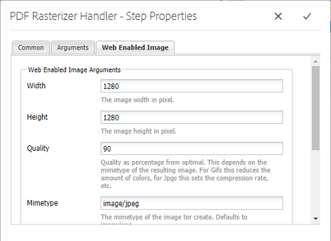

# Usa PDF Rasterizer {#using-pdf-rasterizer}

Quando carichi file PDF o AI di grandi dimensioni e ad alta intensità di contenuto in [!DNL Adobe Experience Manager Assets], la libreria predefinita potrebbe non generare un output accurato. La libreria PDF Rasterizer di Adobe può generare un output più affidabile e preciso rispetto all&#39;output di una libreria predefinita. Adobe consiglia di utilizzare la libreria PDF Rasterizer per i seguenti scenari:

L&#39;Adobe consiglia di utilizzare la libreria PDF Rasterizer per le seguenti operazioni:

* File AI o file PDF pesanti e ad alta intensità di contenuto.
* File AI e file PDF con miniature non generate per impostazione predefinita.
* File AI con colori Pantone Matching System (PMS).

Miniature e anteprime generate con PDF Rasterizer sono di qualità migliore rispetto all’output preconfigurato e, pertanto, forniscono un’esperienza di visualizzazione coerente tra i dispositivi. La libreria Adobe PDF Rasterizer non supporta la conversione dello spazio colore. Emette sempre in RGB indipendentemente dallo spazio colore del file sorgente.

1. Installa il pacchetto PDF Rasterizer sulla distribuzione [!DNL Adobe Experience Manager] da [Distribuzione di software]
(https://experience.adobe.com/#/downloads/content/software-distribution/en/aem.html?package=/content/software-distribution/en/details.html/content/dam/aem/public/adobe/packages/cq650/product/assets/aem-assets-pdf-rasterizer-pkg-4.4.zip).

   >[!NOTE]
   >
   >La libreria PDF Rasterizer è disponibile solo per Windows e Linux.

1. Accedi alla console del flusso di lavoro [!DNL Assets] in `https://[aem_server]:[port]/workflow`. Apri il flusso di lavoro [!UICONTROL Aggiorna risorsa DAM] .

1. Per evitare la generazione di miniature e rappresentazioni web per i file PDF e AI utilizzando i metodi predefiniti, procedi come segue:

   * Apri il passaggio **[!UICONTROL Elabora miniature]** e aggiungi `application/pdf` o `application/postscript` nel campo **[!UICONTROL Ignora tipi MIME]** sotto la scheda **[!UICONTROL Miniature]** , a seconda delle necessità.

   

   * Nella scheda **[!UICONTROL Immagine abilitata per il web]** , aggiungi `application/pdf` o `application/postscript` in **[!UICONTROL Salta elenco]** a seconda delle tue esigenze.

   

1. Apri il passaggio **[!UICONTROL Rasterizza rappresentazione anteprima immagine PDF/AI]** e rimuovi il tipo MIME per il quale desideri saltare la generazione predefinita di rappresentazioni immagine di anteprima. Ad esempio, rimuovi il tipo MIME `application/pdf`, `application/postscript` o `application/illustrator` dall&#39;elenco **[!UICONTROL Tipi MIME]** .

   

1. Trascina il passaggio **[!UICONTROL PDF Rasterizer Handler]** dal pannello laterale al di sotto del passaggio **[!UICONTROL Elabora miniature]** .
1. Configura i seguenti argomenti per il passaggio **[!UICONTROL PDF Rasterizer Handler]** :

   * Tipi MIME: `application/pdf` o `application/postscript`
   * Comandi: `PDFRasterizer -d -s 1280 -t PNG -i ${file}`
   * Aggiungi le dimensioni delle miniature: 319:319, 140:100, 48:48. Aggiungi la configurazione personalizzata delle miniature, se necessario.

   Gli argomenti della riga di comando per il comando `PDFRasterizer` possono includere quanto segue:

   * `-d`: Contrassegno per consentire il rendering uniforme di testo, immagini vettoriali e immagini. Crea immagini di qualità migliore. Tuttavia, l&#39;inclusione di questo parametro causa l&#39;esecuzione lenta del comando e l&#39;aumento delle dimensioni delle immagini.

   * `-s`: Dimensione massima dell’immagine (altezza o larghezza). Questa viene convertita in DPI per ogni pagina. Se le pagine hanno dimensioni diverse, ogni pagina può essere ridimensionata in base a quantità diverse. Il valore predefinito è la dimensione effettiva della pagina.

   * `-t`: Tipo di immagine di output. I tipi validi sono JPEG, PNG, GIF e BMP. Il valore predefinito è JPEG.

   * `-i`: Percorso del PDF di input. È un parametro obbligatorio.

   * `-h`: Aiuto

1. Per eliminare le rappresentazioni intermedie, selezionare **[!UICONTROL Elimina rappresentazioni generate]**.
1. Per consentire a PDF Rasterizer di generare rappresentazioni web, selezionare **[!UICONTROL Genera rappresentazione web]**.

   

1. Specifica le impostazioni nella scheda **[!UICONTROL Immagine abilitata per il Web]** .

   

1. Salva il flusso di lavoro.
1. Per consentire a PDF Rasterizer di elaborare le pagine PDF con le librerie PDF, apri il modello **[!UICONTROL DAM Process Subasset]** dalla console [!UICONTROL Flusso di lavoro].
1. Dal pannello laterale, trascina il passaggio PDF Rasterizer Handler sotto il passaggio **[!UICONTROL Crea rappresentazione immagine abilitata per il web]** .
1. Configura i seguenti argomenti per il passaggio **[!UICONTROL PDF Rasterizer Handler]** :

   * Tipi MIME: `application/pdf` o `application/postscript`
   * Comandi: `PDFRasterizer -d -s 1280 -t PNG -i ${file}`
   * Aggiungi dimensioni miniature: `319:319`, `140:100`, `48:48`. Aggiungi la configurazione personalizzata delle miniature in base alle esigenze.

   Gli argomenti della riga di comando per il comando `PDFRasterizer` possono includere quanto segue:

   * `-d`: Contrassegno per consentire il rendering uniforme di testo, immagini vettoriali e immagini. Crea immagini di qualità migliore. Tuttavia, l&#39;inclusione di questo parametro causa l&#39;esecuzione lenta del comando e l&#39;aumento delle dimensioni delle immagini.

   * `-s`: Dimensione massima dell’immagine (altezza o larghezza). Questa viene convertita in DPI per ogni pagina. Se le pagine hanno dimensioni diverse, ogni pagina può essere ridimensionata in base a quantità diverse. Il valore predefinito è la dimensione effettiva della pagina.

   * `-t`: Tipo di immagine di output. I tipi validi sono JPEG, PNG, GIF e BMP. Il valore predefinito è JPEG.

   * `-i`: Percorso del PDF di input. È un parametro obbligatorio.

   * `-h`: Aiuto

1. Per eliminare le rappresentazioni intermedie, selezionare **[!UICONTROL Elimina rappresentazioni generate]**.
1. Per consentire a PDF Rasterizer di generare rappresentazioni web, selezionare **[!UICONTROL Genera rappresentazione web]**.

   

1. Specifica le impostazioni nella scheda **[!UICONTROL Immagine abilitata per il Web]** .

   

1. Salva il flusso di lavoro.
1. Carica un file PDF o un file AI in [!DNL Experience Manager Assets]. PDF Rasterizer genera le miniature e le rappresentazioni web del file.
