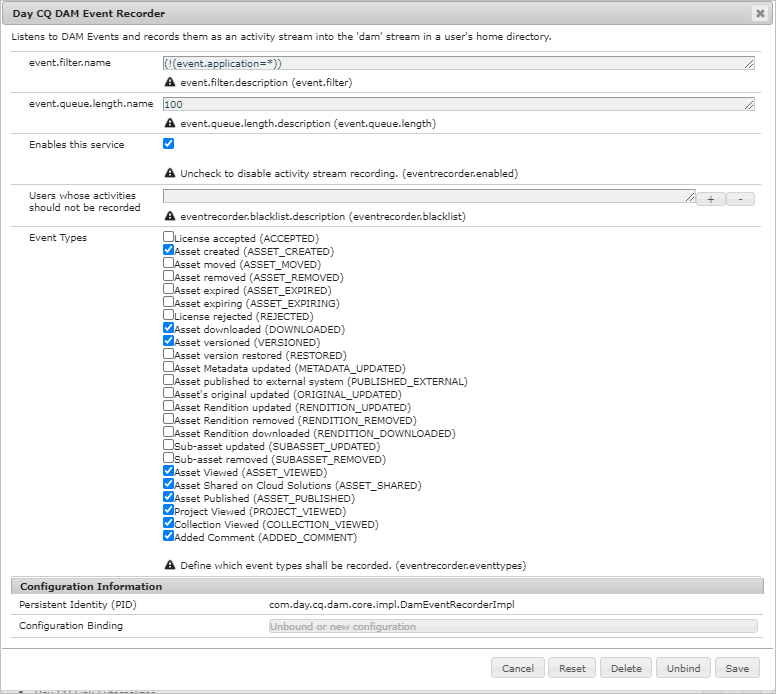

# Rapporti sulle risorse {#asset-reports}

| Versione | Collegamento articolo |
| -------- | ---------------------------- |
| AEM as a Cloud Service | [Fai clic qui](https://experienceleague.adobe.com/docs/experience-manager-cloud-service/content/assets/admin/asset-reports.html?lang=en) |
| AEM 6.5 | Questo articolo |

Il reporting delle risorse consente di valutare l&#39;utilità della distribuzione di [!DNL Adobe Experience Manager Assets]. Con [!DNL Assets] puoi generare diversi rapporti per le risorse digitali. I rapporti forniscono informazioni utili sull’utilizzo del sistema, sul modo in cui gli utenti interagiscono con le risorse e sulle risorse scaricate e condivise.

Utilizza le informazioni contenute nei rapporti per derivare le metriche di successo chiave con cui misurare il livello di adozione di [!DNL Assets] all&#39;interno della tua azienda e da parte dei clienti.

Il framework di reporting [!DNL Assets] utilizza [!DNL Sling] processi per elaborare in modo asincrono le richieste di report in modo ordinato. È scalabile per archivi di grandi dimensioni. L’elaborazione asincrona dei rapporti aumenta l’efficienza e la velocità con cui vengono generati.

L’interfaccia di gestione dei rapporti è intuitiva e include opzioni e controlli dettagliati per accedere ai rapporti archiviati e visualizzare gli stati di esecuzione dei rapporti (operazione riuscita, non riuscita e in coda).

Quando viene generato un rapporto, l’utente riceve una notifica tramite e-mail (facoltativa) e una notifica nella casella in entrata. Puoi visualizzare, scaricare o eliminare un rapporto dalla pagina dell’elenco dei rapporti, in cui vengono visualizzati tutti i rapporti generati in precedenza.

## Prerequisito {#prerequisite-for-reporting}

Per generare i rapporti, effettuare le seguenti operazioni:

* Abilita il servizio [!UICONTROL Day CQ DAM Event Recorder] da **[!UICONTROL Tools]** > **[!UICONTROL Operations]** > **[!UICONTROL Web Console]**.
* Seleziona le attività o gli eventi per i quali desideri generare rapporti. Ad esempio, per generare un rapporto sulle risorse scaricate, seleziona [!UICONTROL Risorsa scaricata (SCARICATA)].

## Generare rapporti {#generate-reports}

[!DNL Experience Manager Assets] genera i seguenti rapporti standard:

* Carica
* Scarica
* Scadenza
* Modifiche
* Pubblicazione
* [!DNL Brand Portal] pubblicazione
* Utilizzo disco
* File
* Condivisione collegamenti

Gli amministratori di [!DNL Adobe Experience Manager] possono generare e personalizzare facilmente questi rapporti per la tua implementazione. Per generare un rapporto, l’amministratore può effettuare le seguenti operazioni:

1. Nell&#39;interfaccia [!DNL Experience Manager], fare clic su **[!UICONTROL Strumenti]** > **[!UICONTROL Assets]** > **[!UICONTROL Rapporti]**.

   

1. Nella pagina [!UICONTROL Rapporti risorse], fai clic su **[!UICONTROL Crea]** nella barra degli strumenti.
1. Dalla pagina **[!UICONTROL Crea report]**, scegli il report che desideri creare e fai clic su **[!UICONTROL Avanti]**.

   

   >[!NOTE]
   >
   >Per impostazione predefinita, i frammenti di contenuto e le condivisioni di collegamenti sono inclusi nel report [!UICONTROL Scarica] della risorsa. Seleziona l’opzione appropriata per creare un rapporto sulle condivisioni di collegamenti o per escludere Frammenti di contenuto dal rapporto di download.

   >[!NOTE]
   >
   >Il report [!UICONTROL Scarica] visualizza i dettagli solo delle risorse scaricate dopo la selezione individuale o scaricate tramite l&#39;azione rapida. Tuttavia, non include i dettagli delle risorse all’interno di una cartella scaricata.

1. Configura i dettagli del rapporto come titolo, descrizione, miniatura e percorso della cartella nell’archivio di CRX in cui è memorizzato il rapporto. Per impostazione predefinita, il percorso della cartella è `/content/dam`. È possibile specificare un percorso diverso.

   

   Scegli l’intervallo di date per il rapporto.

   Puoi scegliere di generare il rapporto ora o in una data e un’ora future.

   >[!NOTE]
   >
   >Se si sceglie di pianificare il rapporto in un secondo momento, assicurarsi di specificare la data e l&#39;ora nei campi Data e ora. Se non specifichi alcun valore, il motore di report lo tratta come un report che deve essere generato immediatamente.

   I campi di configurazione possono variare in base al tipo di rapporto creato. Ad esempio, il report **[!UICONTROL Utilizzo disco]** fornisce opzioni per includere le rappresentazioni delle risorse durante il calcolo dello spazio su disco utilizzato dalle risorse. Puoi scegliere di includere o escludere le risorse nelle sottocartelle per il calcolo dell’utilizzo del disco.

   >[!NOTE]
   >
   >Il rapporto **[!UICONTROL Utilizzo spazio su disco]** non include campi intervallo di date, poiché indica solo l’utilizzo attuale dello spazio.

   

   Quando crei il report **[!UICONTROL File]**, puoi includere/escludere sottocartelle. Tuttavia, per questo rapporto non puoi includere rappresentazioni di risorse.

   

   Il report **[!UICONTROL Condivisione collegamenti]** visualizza gli URL delle risorse condivise con utenti esterni da [!DNL Assets]. Include gli ID e-mail dell’utente che ha condiviso le risorse, gli ID e-mail degli utenti con cui le risorse sono condivise, la data di condivisione e la data di scadenza del collegamento. Le colonne non sono personalizzabili.

   Il report **[!UICONTROL Condivisione collegamenti]** non include opzioni per sottocartelle e rendering, in quanto pubblica semplicemente gli URL condivisi visualizzati in `/var/dam/share`.

   

1. Fai clic su **[!UICONTROL Avanti]** nella barra degli strumenti.

1. Nella pagina **[!UICONTROL Configura colonne]**, alcune colonne sono selezionate per essere visualizzate nel report per impostazione predefinita. Puoi selezionare più colonne. Annulla la selezione di una colonna per escluderla nel rapporto.

   

   Per visualizzare un nome di colonna o un percorso di proprietà personalizzato, configura le proprietà per il binario della risorsa nel nodo `jcr:content` in CRX. In alternativa, aggiungilo tramite il selettore del percorso delle proprietà.

   

1. Fai clic su **[!UICONTROL Crea]** nella barra degli strumenti. Un messaggio notifica che la generazione del rapporto è stata avviata.
1. Nella pagina [!UICONTROL Report risorse], lo stato di generazione del report si basa sullo stato corrente del processo di report, ad esempio [!UICONTROL Operazione riuscita], [!UICONTROL Non riuscita], [!UICONTROL In coda] o [!UICONTROL Pianificato]. Lo stesso stato viene visualizzato nella casella in entrata delle notifiche.Per visualizzare la pagina del report, fare clic sul collegamento al report. In alternativa, selezionare il report e fare clic su **[!UICONTROL Visualizza]** nella barra degli strumenti.

   <!---->
   [Stato report](assets/report-status.JPG)

   Fai clic su **[!UICONTROL Scarica]** nella barra degli strumenti per scaricare il rapporto in formato CSV.

## Aggiungi colonne personalizzate {#add-custom-columns}

Puoi aggiungere colonne personalizzate ai seguenti rapporti per visualizzare più dati in base ai tuoi requisiti personalizzati:

* Carica
* Scarica
* Scadenza
* Modifiche
* Pubblicazione
* [!DNL Brand Portal] pubblicazione
* File

Per aggiungere colonne personalizzate a questi rapporti, effettua le seguenti operazioni:

1. In [!DNL Manager interface], fai clic su **[!UICONTROL Strumenti]** > **[!UICONTROL Assets]** > **[!UICONTROL Rapporti]**.
1. Nella pagina [!UICONTROL Rapporti risorse], fai clic su **[!UICONTROL Crea]** nella barra degli strumenti.

1. Dalla pagina **[!UICONTROL Crea report]**, scegli il report che desideri creare e fai clic su **[!UICONTROL Avanti]**.
1. Configura i dettagli del rapporto come titolo, descrizione, miniatura, percorso della cartella e intervallo di date, a seconda dei casi.

1. Per visualizzare una colonna personalizzata, specificane il nome in **[!UICONTROL Colonne personalizzate]**.

   

1. Aggiungi il percorso proprietà nel nodo `jcr:content` in CRXDE utilizzando il selettore del percorso proprietà. In alternativa, digita il percorso nel campo percorso proprietà.

   

   Per aggiungere altre colonne personalizzate, fare clic su **[!UICONTROL Aggiungi]** e ripetere i passaggi 5 e 6.

1. Fai clic su **[!UICONTROL Crea]** nella barra degli strumenti. Un messaggio notifica che la generazione del rapporto è stata avviata.

## Configura servizio di eliminazione {#configure-purging-service}

Per rimuovere i rapporti che non sono più necessari, configura il servizio Rimozione rapporti DAM dalla console web per rimuovere i rapporti esistenti in base alla quantità e all’età.

1. Accedere alla console Web (gestione configurazione) da `https://[aem_server]:[port]/system/console/configMgr`.
1. Aprire la configurazione del servizio **[!UICONTROL Rimozione report DAM]**.
1. Specificare la frequenza (intervallo di tempo) per il servizio di eliminazione nel campo `scheduler.expression.name`. Puoi anche configurare la soglia di età e di quantità per i rapporti.
1. Salva le modifiche.

## Informazioni, suggerimenti e limitazioni per la risoluzione dei problemi {#best-practices-and-limitations}

* Se alcuni rapporti o numeri nei rapporti non sono disponibili o come previsto, assicurati che il servizio Registrazione eventi DAM CQ  di giorno sia abilitato.

* Rimuovi i rapporti che non sono più necessari. Utilizza le opzioni di configurazione nel servizio Rimozione report DAM per configurare i criteri per l’eliminazione dei report.

* Se il Report sull&#39;utilizzo del disco non viene generato e si sta utilizzando [!DNL Dynamic Media], verificare che tutte le risorse procedano correttamente. Per risolvere il problema, rielabora le risorse e quindi genera di nuovo il rapporto.
