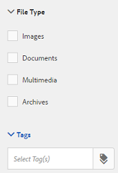

# Asset templates {#asset-templates}

I modelli di risorse sono una classe speciale di risorse che semplificano la ridefinizione rapida dei contenuti visivamente avanzati per i supporti digitali e di stampa. Un modello di risorsa include due parti: la sezione relativa ai messaggi fissi e la sezione modificabile.

La sezione relativa ai messaggi fissi può contenere contenuti proprietari, ad esempio il logo del marchio e le informazioni sul copyright, che sono disattivati per la modifica. La sezione modificabile può contenere contenuti visivi e testuali in campi che possono essere modificati per personalizzare i messaggi.

La flessibilità di apportare modifiche limitate e la protezione del digital signage rende i modelli di risorse ideali per l’adattamento e la distribuzione rapida dei contenuti come artefatti di contenuto per varie funzioni. La ridefinizione dei contenuti consente di ridurre i costi per la gestione dei canali digitali e per la stampa e di offrire esperienze complete e coerenti su questi canali.

Gli esperti di marketing possono archiviare e gestire i modelli in AEM Assets e utilizzare un singolo modello di base per creare più esperienze di stampa personalizzate con facilità. Puoi creare diversi tipi di materiale collaterale di marketing, inclusi brochure, volantini, cartoline, biglietti da visita e così via, per trasmettere in modo chiaro il messaggio di marketing ai clienti. È inoltre possibile assemblare output di stampa di più pagine da uscite di stampa esistenti o nuove. Soprattutto, è possibile distribuire simultaneamente esperienze digitali e di stampa con facilità, offrendo agli utenti un&#39;esperienza coerente e integrata.

Anche se i modelli di risorse sono per lo più file Adobe InDesign, l&#39;esperienza di Adobe InDesign non è un ostacolo alla creazione di artefatti stellari. Non è necessario mappare i campi del modello Adobe InDesign con i campi del prodotto che altrimenti sarebbero necessari per la creazione dei cataloghi. Potete modificare i modelli in modalità WYSIWYG direttamente sull&#39;interfaccia Web. Tuttavia, affinché Adobe InDesign possa elaborare le modifiche, è innanzitutto necessario configurare Risorse AEM per l&#39;integrazione con Adobe InDesign Server.

La possibilità di modificare i modelli Adobe InDesign dall&#39;interfaccia Web consente di promuovere una maggiore collaborazione tra il personale Creative e Marketing, riducendo al contempo il tempo necessario per immettere sul mercato le iniziative di promozione locali.

Con i modelli di risorse potete effettuare le seguenti operazioni:

* Modificare i campi dei modelli modificabili dall&#39;interfaccia Web
* Controllare lo stile di base del testo, ad esempio dimensione del font, stile e tipo a livello di tag
* Modificare le immagini all’interno del modello utilizzando il selettore dei contenuti
* Anteprima delle modifiche apportate al modello
* Unire più file modello per creare un artefatto con più pagine

Quando scegli un modello per le tue risorse, Risorse AEM crea una copia del modello che puoi modificare. Il modello originale viene mantenuto, in modo da mantenere intatta la segnaletica globale e da poterlo riutilizzare per garantire la coerenza del marchio.

Potete esportare il file aggiornato nella cartella principale nei seguenti formati:

* INDD
* PDF
* JPG

È inoltre possibile scaricare l&#39;output in questi formati nel sistema locale.

## Creare una garanzia {#creating-a-collateral}

Considerate uno scenario in cui desiderate creare materiale collaterale stampabile digitale, come brochure, volantini e annunci pubblicitari per una campagna imminente e condividetelo con gli outlet store a livello globale. La creazione di materiale collaterale basato su un modello consente di offrire un&#39;esperienza cliente unificata tra i canali. I designer possono creare i modelli delle campagne (pagina singola o pagina multipla) utilizzando una soluzione creativa, come InDesign, e caricare i modelli su Risorse AEM. Prima di creare una garanzia collaterale, è necessario che uno o più modelli INDD siano caricati e disponibili in Experience Manager in anticipo.

1. Tocca o fai clic sul logo AEM, quindi tocca o fai clic su Risorse.

1. Tra le opzioni, scegliete **[!UICONTROL Modelli]**.

   

1. Tocca o fai clic su **[!UICONTROL Crea]**, quindi dal menu scegli il materiale collaterale da creare. Ad esempio, scegliete **[!UICONTROL Brochure]**.

   

1. Accertatevi che uno o più modelli INDD siano caricati e disponibili in Experience Manager in anticipo. Scegliete un modello per la brochure e toccate o fate clic su **[!UICONTROL Avanti]**.

   

1. Specificate un nome e una descrizione facoltativa per la brochure.

   

1. (Facoltativo) Toccate **[!UICONTROL Tag]** e selezionate uno o più tag per la brochure. Toccate **[!UICONTROL Conferma]** per confermare la selezione.

   

1. Fai clic su **[!UICONTROL Crea]**. Una finestra di dialogo conferma la creazione di una nuova brochure. Tocca o fai clic su **[!UICONTROL Apri]** per aprire la brochure in modalità di modifica.

   <!-- -->

   In alternativa, chiudete la finestra di dialogo e individuate la cartella nella pagina Modelli con cui avete iniziato a visualizzare la brochure creata. Il tipo di materiale collaterale viene visualizzato sulla relativa miniatura nella vista a schede. Ad esempio, in questo caso, la brochure viene visualizzata sulla miniatura.

   

## Modificare un materiale collaterale {#editing-a-collateral}

È possibile modificare un materiale collaterale immediatamente dopo averlo creato. In alternativa, potete aprirlo dalla pagina Modelli o dalla pagina della risorsa.

1. Per aprire il materiale collaterale per la modifica, effettuate una delle seguenti operazioni:

   * Aprire il materiale collaterale (in questo caso la brochure) creato nel passaggio 7 di [Creare un materiale collaterale](/help/assets/asset-templates.md#creating-a-collateral).
   * Dalla pagina Modelli, andate a una cartella in cui avete creato il materiale collaterale e toccate o fate clic sull&#39;azione rapida Modifica sulla miniatura di un materiale collaterale.
   * Nella pagina della risorsa per il materiale collaterale, toccate **[!UICONTROL Modifica]** dalla barra degli strumenti.
   * Selezionate il materiale collaterale e toccate **[!UICONTROL Modifica]** dalla barra degli strumenti.
   <!-- -->

   A sinistra della pagina vengono visualizzati il cercatore di risorse e l’editor di testo. L&#39;editor di testo è aperto per impostazione predefinita.

   È possibile utilizzare l&#39;editor di testo per modificare il testo che si desidera visualizzare nel campo di testo. Potete modificare la dimensione del font, lo stile, il colore e il tipo a livello di tag.

   Utilizzando lo strumento di ricerca risorse, puoi cercare o sfogliare immagini in Risorse AEM e sostituire le immagini modificabili nel modello con immagini di tua scelta.

   

   I modificabili sono visualizzati a destra. Affinché un campo possa essere modificato in Risorse AEM, i campi corrispondenti nel modello devono essere contrassegnati in InDesign. In altre parole, devono essere contrassegnati come modificabili in InDesign.

   

   >[!NOTE]
   >
   >Assicurati che l’istanza AEM sia integrata con un server InDesign per consentire a Risorse AEM di estrarre dati dal modello InDesign e renderlo disponibile per la modifica. Per informazioni dettagliate, consultate [Integrazione di AEM Assets con InDesign Server](/help/assets/indesign.md).

1. Per modificare il testo in un campo modificabile, toccate o fate clic sul campo di testo nell’elenco dei campi modificabili e modificate il testo nel campo.

   

   È possibile modificare le proprietà del testo, ad esempio stile del font, colore e dimensione utilizzando le opzioni disponibili.

1. Toccate **[!UICONTROL Anteprima]** per visualizzare l’anteprima delle modifiche di testo.

   

1. Per sostituire un’immagine, toccate **[!UICONTROL Asset Finder]**.

   

1. Selezionate il campo immagine dall’elenco dei campi modificabili, quindi trascinate l’immagine desiderata dal selettore delle risorse al campo modificabile.

   

   Potete anche cercare le immagini usando parole chiave, tag e in base al loro stato di pubblicazione. Puoi esplorare l’archivio di Risorse AEM e individuare la posizione dell’immagine desiderata.

   

1. Toccate **[!UICONTROL Anteprima]** per visualizzare l’anteprima dell’immagine.

   

1. Per modificare una pagina specifica in un materiale collaterale composto da più pagine, utilizzate il navigatore pagina nella parte inferiore.

   

1. Toccate **[!UICONTROL Anteprima]** sulla barra degli strumenti per visualizzare in anteprima tutte le modifiche. Tocca o fai clic su **[!UICONTROL Fine]** per salvare le modifiche apportate al materiale collaterale.

   >[!NOTE]
   >
   >Le icone Anteprima e Fine sono abilitate solo quando i campi immagine modificabili all’interno della risorsa collaterale non presentano icone mancanti. Se mancano delle icone nelle risorse collaterali, è perché AEM non è in grado di risolvere le immagini nel modello InDesign. In genere, AEM non è in grado di risolvere le immagini nei seguenti casi:
   >
   >    * Le immagini non sono incorporate nel modello InDesign sottostante
   >    * Le immagini sono collegate dal file system locale
   >
   >Per consentire ad AEM di risolvere le immagini, effettuate le seguenti operazioni:
   >
   >    * Incorporare le immagini durante la creazione di modelli InDesign (consultate [I collegamenti e gli elementi grafici](https://helpx.adobe.com/indesign/using/graphics-links.html)incorporati).
   >    * Scaricate AEM nel file system locale, quindi mappate le icone mancanti con le risorse AEM esistenti.
   >
   >Per ulteriori informazioni sull&#39;utilizzo dei documenti InDesign, consultate [Best practice for Working with InDesign Documents in AEM](https://helpx.adobe.com/experience-manager/kb/best-practices-idd-docs-aem.html)(Tecniche consigliate per l&#39;utilizzo dei documenti InDesign in AEM).

1. Per generare una rappresentazione PDF per la brochure, selezionate l’opzione Acrobat nella finestra di dialogo, quindi fate clic su **[!UICONTROL Continua]**.
1. Il materiale collaterale viene creato nella cartella con cui avete iniziato. Per visualizzare i rendering, aprite il materiale collaterale e scegliete **[!UICONTROL Rendering]** dall’elenco di navigazione globale.

   

1. Tocca o fai clic sulla rappresentazione PDF dall’elenco delle rappresentazioni per scaricare il file PDF. Aprire il file PDF per esaminare le risorse.

   

## Unisci materiale collaterale {#merge-collateral}

1. Tocca o fai clic sul logo AEM, quindi tocca o fai clic su Risorse nella pagina di navigazione.
1. Tra le opzioni, scegliete **[!UICONTROL Modelli]**.
1. Toccate o fate clic su **[!UICONTROL Crea]** e scegliete **[!UICONTROL Unisci]** dal menu.

   

1. Dalla pagina Unione  modelli, toccate **[!UICONTROL Unisci]**.

   

1. Passate alla posizione del materiale collaterale da unire e toccate le miniature del materiale collaterale da unire per selezionarlo.

   

   Potete anche cercare i modelli dalla casella di ricerca Omnice.

   

   Puoi esplorare l&#39;archivio o le raccolte di Risorse AEM, individuare la posizione dei modelli desiderati e selezionarli per l&#39;unione.

   

   Potete applicare vari filtri per cercare nei modelli desiderati. Ad esempio, potete cercare i modelli in base al tipo di file o ai tag.

   

1. Tocca o fai clic su **[!UICONTROL Avanti]** dalla barra degli strumenti.
1. Nella schermata **[!UICONTROL Anteprima e riordina]** , se necessario ridisponete i modelli e visualizzate l’anteprima della selezione di modelli da unire. Quindi, fate clic o toccate **[!UICONTROL Avanti]** dalla barra degli strumenti.

   

1. Nella schermata Configura modello, specificate un nome per il materiale collaterale. Facoltativamente, potete specificare i tag desiderati. Se si desidera esportare l&#39;output in formato PDF, selezionare l&#39;opzione **Acrobat (.PDF)** . Per impostazione predefinita, il materiale collaterale viene esportato in formato JPG e InDesign. Per modificare la miniatura di visualizzazione per le risorse di più pagine collaterali, toccate o fate clic su **[!UICONTROL Cambia miniatura]**.

   

1. Tocca o fai clic su **[!UICONTROL Salva]** , quindi su **[!UICONTROL OK]** nella finestra di dialogo per chiudere la finestra di dialogo. Il materiale collaterale a più pagine viene creato nella cartella con cui avete iniziato.

   >[!NOTE]
   >
   >Non è possibile modificare un materiale collaterale unito in un secondo momento o utilizzarlo per creare altre risorse.
