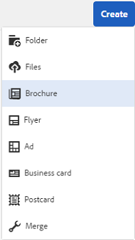

# Modelli di risorse {#asset-templates}

I modelli di risorse sono una classe speciale di risorse che facilita la ridefinizione rapida dei contenuti ricchi di immagini per i supporti digitali e di stampa. Un modello di risorsa include due parti: la sezione relativa ai messaggi fissi e la sezione modificabile. La sezione per la messaggistica fissa può contenere contenuti proprietari, ad esempio il logo del marchio e informazioni sul copyright, che vengono disattivate per la modifica. La sezione modificabile può contenere contenuti visivi e testuali in campi che possono essere modificati per personalizzare la messaggistica.

La flessibilità di apportare modifiche limitate e al tempo stesso la sicurezza del digital signage rende i modelli di risorse gli elementi di base ideali per l’adattamento e la distribuzione rapida dei contenuti, in quanto artefatti di contenuti per varie funzioni. Il riutilizzo dei contenuti consente di ridurre i costi di gestione dei canali digitali e di stampa e di fornire esperienze olistiche e coerenti su questi canali.

In qualità di addetto al marketing, puoi archiviare e gestire i modelli all’interno di [!DNL Experience Manager Assets] e utilizzare un singolo modello di base per creare più esperienze di stampa personalizzate con facilità. Puoi creare diversi tipi di materiale collaterale di marketing, inclusi opuscoli, volantini, cartoline, biglietti da visita e così via, per trasmettere in modo lucido il messaggio di marketing ai clienti. È inoltre possibile assemblare uscite di stampa multipagina da uscite di stampa nuove o esistenti. Soprattutto, è possibile fornire simultaneamente esperienze digitali e di stampa con facilità, per offrire agli utenti un&#39;esperienza coerente e integrata.

Anche se i modelli di risorse sono per lo più file [!DNL Adobe InDesign], la competenza in [!DNL Adobe InDesign] non è un ostacolo alla creazione di artefatti stellari. Non è necessario mappare i campi del modello [!DNL Adobe InDesign] con i campi di prodotto che in caso contrario saranno necessari per la creazione dei cataloghi. È possibile modificare i modelli in modalità WYSIWYG direttamente nell’interfaccia web. Tuttavia, affinché [!DNL Adobe InDesign] possa elaborare le modifiche, devi prima configurare [!DNL Experience Manager Assets] per l&#39;integrazione con [!DNL Adobe InDesign Server].

La possibilità di modificare i modelli [!DNL Adobe InDesign] dall’interfaccia web consente di promuovere una maggiore collaborazione tra personale creativo e di marketing. L&#39;aumento della velocità dei contenuti riduce il time-to-market dei materiali di marketing.

Con i modelli di risorse è possibile ottenere quanto segue:

* Modifica i campi del modello modificabili dall’interfaccia Web.
* Controllare lo stile di base del testo, ad esempio le dimensioni del font, lo stile e il testo a livello di tag.
* Modifica le immagini all’interno del modello utilizzando Selezione contenuto.
* Visualizza anteprima delle modifiche apportate al modello.
* Unisci più file modello per creare un artefatto a più pagine.

Quando scegli un modello per il tuo materiale collaterale, [!DNL Experience Manager Assets] crea una copia del modello che puoi modificare. Il modello originale viene mantenuto, in modo che il digital signage rimanga intatto e possa essere riutilizzato per garantire la coerenza del marchio.

È possibile esportare il file aggiornato all’interno della cartella principale nei formati INDD, PDF o JPG. È inoltre possibile scaricare l&#39;output in questi formati nel file system locale.

## Creare un materiale collaterale {#creating-a-collateral}

Considera uno scenario in cui desideri creare materiale collaterale stampabile digitale, come opuscoli, volantini e annunci per una prossima campagna e condividerlo con outlet store a livello globale. La creazione di materiale collaterale basato su un modello consente di offrire un&#39;esperienza cliente unificata su tutti i canali. I designer possono creare i modelli delle campagne (a pagina singola o a più pagine) utilizzando una soluzione creativa, ad esempio [!DNL InDesign] e caricare i modelli su [!DNL Experience Manager Assets]. Prima di creare una garanzia, fai caricare e rendere disponibili in [!DNL Experience Manager] uno o più modelli INDD.

1. Nell&#39;interfaccia [!DNL Experience Manager] fai clic su [!UICONTROL Risorse].

1. Dalle opzioni, scegli **[!UICONTROL Modelli]**.

   

1. Fare clic su **[!UICONTROL Crea]**, quindi scegliere dal menu il materiale collaterale da creare. Ad esempio, scegli **[!UICONTROL Brochure]**.

   

1. Avere uno o più modelli INDD caricati e disponibili in [!DNL Experience Manager] in anticipo. Scegli un modello per la tua brochure e fai clic su **[!UICONTROL Avanti]**.
1. Specifica un nome e una descrizione facoltativa per la brochure.

   

1. (Facoltativo) Fai clic su **[!UICONTROL Tag]** e seleziona uno o più tag per la brochure. Fai clic su **[!UICONTROL Conferma]** per confermare la selezione.
1. Fai clic su **[!UICONTROL Crea]**. Un dialogo conferma la creazione di una nuova brochure. Fai clic su **[!UICONTROL Apri]** per aprire la brochure in modalità di modifica.

   <!-- -->

   In alternativa, chiudi la finestra di dialogo e passa alla cartella nella pagina Modelli con cui hai iniziato per visualizzare la brochure creata. Il tipo di materiale collaterale viene visualizzato sulla sua miniatura nella vista a schede. Ad esempio, in questo caso, la parola [!UICONTROL Brochure] viene visualizzata sulla miniatura.

   

## Modificare un materiale collaterale {#editing-a-collateral}

È possibile modificare un materiale collaterale immediatamente dopo averlo creato. In alternativa, puoi aprirlo dalla pagina [!UICONTROL Modelli] o dalla pagina della risorsa.

1. Per aprire il materiale collaterale per l&#39;editing, effettuare una delle seguenti operazioni:

   * Apri la garanzia (in questo caso brochure) creata nel passaggio 7 di [Crea una garanzia](/help/assets/asset-templates.md#creating-a-collateral).
   * Dalla pagina Modelli, accedi alla cartella in cui hai creato il materiale collaterale e fai clic sull&#39;azione rapida [!UICONTROL Modifica] sulla miniatura di un materiale collaterale.
   * Nella pagina delle risorse per il materiale collaterale, fai clic su **[!UICONTROL Modifica]** nella barra degli strumenti.
   * Seleziona il materiale collaterale e fai clic su **[!UICONTROL Modifica]** nella barra degli strumenti.

   <!-- -->

   Il cercatore di risorse e l’editor di testo vengono visualizzati a sinistra della pagina. L’editor di testo è aperto per impostazione predefinita.

   È possibile utilizzare l’editor di testo per modificare il testo che si desidera visualizzare nel campo di testo. Puoi modificare le dimensioni, lo stile, il colore del font e il testo a livello di tag.

   Utilizzando il Cercatore di risorse, puoi sfogliare o cercare immagini all’interno di [!DNL Experience Manager Assets] e sostituire le immagini modificabili nel modello con immagini di tua scelta.

   

   I modificabili vengono visualizzati a destra. Affinché un campo sia modificabile in [!DNL Experience Manager Assets], il campo corrispondente nel modello deve essere contrassegnato in [!DNL InDesign]. In altre parole, devono essere contrassegnati come modificabili in [!DNL InDesign].

   >[!NOTE]
   >
   >Assicurati che la distribuzione [!DNL Experience Manager] sia integrata con un [!DNL InDesign Server] per consentire a [!DNL Experience Manager Assets] di estrarre i dati dal modello [!DNL InDesign] e renderli disponibili per la modifica. Per informazioni dettagliate, consulta [integrare risorse di Experience Manager con InDesign Server](/help/assets/indesign.md).

1. Per modificare il testo in un campo modificabile, fare clic sul campo di testo nell’elenco dei campi modificabili e modificare il testo nel campo.

   

   È possibile modificare le proprietà del testo, ad esempio lo stile del font, il colore e le dimensioni utilizzando le opzioni disponibili.

1. Fai clic su **[!UICONTROL Anteprima]** per visualizzare in anteprima le modifiche al testo.

1. Per scambiare un&#39;immagine, fai clic su **[!UICONTROL Asset Finder]** .

1. Seleziona il campo immagine dall’elenco dei campi modificabili, quindi trascina l’immagine desiderata dal selettore delle risorse al campo modificabile.

   

   Puoi anche cercare le immagini utilizzando parole chiave, tag e in base al loro stato di pubblicazione. Puoi sfogliare l’archivio [!DNL Experience Manager Assets] e passare alla posizione dell’immagine desiderata.

   

1. Fai clic su **[!UICONTROL Anteprima]** per visualizzare l&#39;anteprima dell&#39;immagine.
1. Per modificare una pagina specifica in un materiale collaterale a più pagine, utilizza il navigatore pagina in basso.

1. Fai clic su **[!UICONTROL Anteprima]** sulla barra degli strumenti per visualizzare in anteprima tutte le modifiche. Fai clic su **[!UICONTROL Fine]** per salvare le modifiche apportate al materiale collaterale.

   >[!NOTE]
   >
   >Le opzioni Anteprima e Fine sono abilitate solo quando i campi immagine modificabili all’interno del materiale collaterale non presentano icone mancanti. Se mancano icone nel materiale collaterale, è perché [!DNL Experience Manager] non è in grado di risolvere le immagini nel modello [!DNL InDesign]. Di solito, [!DNL Experience Manager] non è in grado di risolvere le immagini nei seguenti casi:
   >
   >* Le immagini non sono incorporate nel modello [!DNL InDesign] sottostante.
   >* Le immagini sono collegate dal file system locale.

   >
   >Per abilitare [!DNL Experience Manager] alla risoluzione delle immagini, procedi come segue:
   >
   >* Incorpora le immagini durante la creazione di modelli [!DNL InDesign] (consulta [Informazioni sui collegamenti e sugli elementi grafici incorporati](https://helpx.adobe.com/indesign/using/graphics-links.html)).
   >* Monta [!DNL Experience Manager] nel file system locale, quindi mappa le icone mancanti con le risorse esistenti in [!DNL Experience Manager].

   >
   >Per ulteriori informazioni sull&#39;utilizzo dei documenti [!DNL InDesign], vedere [best practice per l&#39;utilizzo dei documenti InDesign in Experience Manager](https://helpx.adobe.com/experience-manager/kb/best-practices-idd-docs-aem.html).

1. Per generare un rendering PDF per la brochure, seleziona l’opzione Acrobat nella finestra di dialogo, quindi fai clic su **[!UICONTROL Continua]**.
1. Il materiale collaterale viene creato nella cartella con cui hai iniziato. Per visualizzare le rappresentazioni, apri le risorse e scegli **[!UICONTROL Rappresentazioni]** dall&#39;elenco di Navigazione globale.

   

1. Fai clic sul rendering PDF dall’elenco delle rappresentazioni per scaricare il file PDF. Apri il file PDF per esaminare il materiale collaterale.

   

## Unisci materiale collaterale {#merge-collateral}

1. Nell&#39;interfaccia [!DNL Experience Manager] fare clic su [!UICONTROL Risorse] nella pagina Navigazione.

1. Dalle opzioni, scegli **[!UICONTROL Modelli]**.

1. Fai clic su **[!UICONTROL Crea]** e scegli **[!UICONTROL Unisci]** dal menu.

   

1. Dalla pagina [!UICONTROL Unione modelli], fai clic su **[!UICONTROL Unisci]** .

1. Passare alla posizione del materiale collaterale da unire, fare clic sulle miniature del materiale collaterale da unire per selezionarlo.

   

   È inoltre possibile cercare i modelli dalla casella Omnisearch.

   È possibile sfogliare l&#39;archivio [!DNL Experience Manager Assets] o le raccolte, passare alla posizione dei modelli desiderati e quindi selezionarli per l&#39;unione.

   Puoi applicare vari filtri per cercare i modelli desiderati. Ad esempio, è possibile cercare modelli in base al tipo di file o ai tag.

1. Fare clic su **[!UICONTROL Avanti]** nella barra degli strumenti.
1. Nella schermata **[!UICONTROL Anteprima e riordino]**, ridisponi i modelli, se necessario, e visualizza in anteprima la selezione dei modelli da unire. Quindi, fai clic su **[!UICONTROL Avanti]** nella barra degli strumenti.

   

1. Nella schermata [!UICONTROL Configura modello], specifica un nome per il materiale collaterale. Facoltativamente, specifica i tag che ritieni appropriati. Se si desidera esportare l&#39;output in formato PDF, selezionare **[!UICONTROL Acrobat (.PDF)]**. Per impostazione predefinita, il materiale collaterale viene esportato in formato JPG e [!DNL InDesign]. Per modificare la miniatura di visualizzazione del materiale collaterale a più pagine, fare clic su **[!UICONTROL Cambia miniatura]**.

   

1. Fai clic su **[!UICONTROL Salva]**, quindi fai clic su **[!UICONTROL OK]** nella finestra di dialogo per chiudere la finestra di dialogo. Il materiale collaterale a più pagine viene creato nella cartella con cui hai iniziato.

   >[!NOTE]
   >
   >Non è possibile modificare un materiale collaterale unito in un secondo momento o utilizzarlo per creare altro materiale collaterale.

## Best practice e limitazioni {#best-practices-limitations-tips}

* L’ editor [!DNL InDesign] in [!DNL Experience Manager] funziona a livello di tag e tutto il testo sotto un singolo tag viene considerato come una singola entità. Per mantenere la formattazione e gli stili del testo durante la modifica, assegnare tag separati a ciascun paragrafo (o testo con stili diversi).
