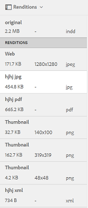

# Modelli di risorse {#asset-templates}

I modelli di risorse sono una classe speciale di risorse che facilita la ridefinizione rapida dei contenuti ricchi di immagini per i supporti digitali e di stampa. Un modello di risorsa include due parti: la sezione relativa ai messaggi fissi e la sezione modificabile. La sezione per la messaggistica fissa può contenere contenuti proprietari, ad esempio il logo del marchio e informazioni sul copyright, che vengono disattivate per la modifica. La sezione modificabile può contenere contenuti visivi e testuali in campi che possono essere modificati per personalizzare la messaggistica.

La flessibilità di apportare modifiche limitate e al tempo stesso la sicurezza del digital signage rende i modelli di risorse gli elementi di base ideali per l’adattamento e la distribuzione rapida dei contenuti, in quanto artefatti di contenuti per varie funzioni. Il riutilizzo dei contenuti consente di ridurre i costi di gestione dei canali digitali e di stampa e di fornire esperienze olistiche e coerenti su questi canali.

In qualità di addetto al marketing, puoi archiviare e gestire i modelli all’interno di [!DNL Experience Manager Assets] e utilizza un modello di base singolo per creare più esperienze di stampa personalizzate con facilità. Puoi creare diversi tipi di materiale collaterale di marketing, inclusi opuscoli, volantini, cartoline, biglietti da visita e così via, per trasmettere in modo lucido il messaggio di marketing ai clienti. È inoltre possibile assemblare uscite di stampa multipagina da uscite di stampa nuove o esistenti. Soprattutto, è possibile fornire simultaneamente esperienze digitali e di stampa con facilità, per offrire agli utenti un&#39;esperienza coerente e integrata.

Mentre i modelli di risorse sono principalmente [!DNL Adobe InDesign] file, competenza [!DNL Adobe InDesign] non è una barriera alla creazione di artefatti stellari. Non è necessario mappare i campi [!DNL Adobe InDesign] modello con i campi di prodotto che altrimenti saranno necessari per la creazione dei cataloghi. È possibile modificare i modelli in modalità WYSIWYG direttamente nell’interfaccia web. Tuttavia, per [!DNL Adobe InDesign] per elaborare le modifiche, devi prima configurare [!DNL Experience Manager Assets] per integrare con [!DNL Adobe InDesign Server].

La possibilità di modificare [!DNL Adobe InDesign] i modelli dell’interfaccia web contribuiscono a promuovere una maggiore collaborazione tra personale creativo e di marketing. L&#39;aumento della velocità dei contenuti riduce il time-to-market dei materiali di marketing.

Con i modelli di risorse è possibile ottenere quanto segue:

* Modifica i campi del modello modificabili dall’interfaccia Web.
* Controllare lo stile di base del testo, ad esempio le dimensioni del font, lo stile e il testo a livello di tag.
* Modifica le immagini all’interno del modello utilizzando Selezione contenuto.
* Visualizza anteprima delle modifiche apportate al modello.
* Unisci più file modello per creare un artefatto a più pagine.

Quando scegli un modello per il tuo materiale collaterale, [!DNL Experience Manager Assets] crea una copia del modello che è possibile modificare. Il modello originale viene mantenuto, in modo che il digital signage rimanga intatto e possa essere riutilizzato per garantire la coerenza del marchio.

È possibile esportare il file aggiornato all’interno della cartella principale nei formati INDD, PDF o JPG. È inoltre possibile scaricare l&#39;output in questi formati nel file system locale.

## Creare un materiale collaterale {#creating-a-collateral}

Considera uno scenario in cui desideri creare materiale collaterale stampabile digitale, come opuscoli, volantini e annunci per una prossima campagna e condividerlo con outlet store a livello globale. La creazione di materiale collaterale basato su un modello consente di offrire un&#39;esperienza cliente unificata su tutti i canali. I designer possono creare i modelli delle campagne (a pagina singola o a più pagine) utilizzando una soluzione creativa, ad esempio [!DNL InDesign] e carica i modelli in [!DNL Experience Manager Assets] per te. Prima di creare un materiale collaterale, usa uno o più modelli INDD caricati e disponibili in [!DNL Experience Manager] in anticipo.

1. In [!DNL Experience Manager] clic interfaccia [!UICONTROL Risorse].

1. Dalle opzioni, scegli **[!UICONTROL Modelli]**.

   

1. Fai clic su **[!UICONTROL Crea]**, quindi scegliere il materiale collaterale da creare dal menu. Ad esempio, scegli **[!UICONTROL Brochure]**.

   

1. Avere uno o più modelli INDD caricati e disponibili in [!DNL Experience Manager] in anticipo. Scegli un modello per la tua brochure e fai clic su **[!UICONTROL Successivo]**.
1. Specifica un nome e una descrizione facoltativa per la brochure.

   

1. (Facoltativo) Fai clic su **[!UICONTROL Tag]** e selezionare uno o più tag per la brochure. Fai clic su **[!UICONTROL Conferma]** per confermare la selezione.
1. Fai clic su **[!UICONTROL Crea]**. Un dialogo conferma la creazione di una nuova brochure. Fai clic su **[!UICONTROL Apri]** per aprire la brochure in modalità di modifica.

   <!-- -->

   In alternativa, chiudi la finestra di dialogo e passa alla cartella nella pagina Modelli con cui hai iniziato per visualizzare la brochure creata. Il tipo di materiale collaterale viene visualizzato sulla sua miniatura nella vista a schede. Ad esempio, in questo caso, la parola [!UICONTROL Brochure] viene visualizzato sulla miniatura.

   

## Modificare un materiale collaterale {#editing-a-collateral}

È possibile modificare un materiale collaterale immediatamente dopo averlo creato. In alternativa, puoi aprirlo dal [!UICONTROL Modelli] o la pagina della risorsa.

1. Per aprire il materiale collaterale per l&#39;editing, effettuare una delle seguenti operazioni:

   * Apri la garanzia (in questo caso brochure) creata al passaggio 7 di [Creare un materiale collaterale](/help/assets/asset-templates.md#creating-a-collateral).
   * Dalla pagina Modelli , accedi alla cartella in cui hai creato il materiale collaterale e fai clic sul pulsante [!UICONTROL Modifica] azioni rapide sulla miniatura di un materiale collaterale.
   * Nella pagina della risorsa del materiale collaterale, fai clic su **[!UICONTROL Modifica]** dalla barra degli strumenti.
   * Seleziona il materiale collaterale e fai clic su **[!UICONTROL Modifica]** dalla barra degli strumenti.

   <!-- -->

   Il cercatore di risorse e l’editor di testo vengono visualizzati a sinistra della pagina. L’editor di testo è aperto per impostazione predefinita.

   È possibile utilizzare l’editor di testo per modificare il testo che si desidera visualizzare nel campo di testo. Puoi modificare le dimensioni, lo stile, il colore del font e il testo a livello di tag.

   Utilizzando il ricerca risorse, puoi sfogliare o cercare immagini all’interno di [!DNL Experience Manager Assets] e sostituisci le immagini modificabili nel modello con le immagini che preferisci.

   

   I modificabili vengono visualizzati a destra. Per poter modificare un campo in [!DNL Experience Manager Assets], il campo corrispondente nel modello deve essere taggato in [!DNL InDesign]. In altre parole, devono essere contrassegnati come modificabili in [!DNL InDesign].

   >[!NOTE]
   >
   >Assicurati che il tuo [!DNL Experience Manager] l&#39;implementazione è integrata con un [!DNL InDesign Server] per abilitare [!DNL Experience Manager Assets] per estrarre dati dal [!DNL InDesign] e renderlo disponibile per la modifica. Per maggiori dettagli, vedi [integrare Experience Manager Assets con InDesign Server](/help/assets/indesign.md).

1. Per modificare il testo in un campo modificabile, fare clic sul campo di testo nell’elenco dei campi modificabili e modificare il testo nel campo.

   

   È possibile modificare le proprietà del testo, ad esempio lo stile del font, il colore e le dimensioni utilizzando le opzioni disponibili.

1. Fai clic su **[!UICONTROL Anteprima]** per visualizzare in anteprima le modifiche al testo.

1. Per scambiare un&#39;immagine, fai clic sul pulsante **[!UICONTROL Ricerca risorse]** .

1. Seleziona il campo immagine dall’elenco dei campi modificabili, quindi trascina l’immagine desiderata dal selettore delle risorse al campo modificabile.

   

   Puoi anche cercare le immagini utilizzando parole chiave, tag e in base al loro stato di pubblicazione. È possibile sfogliare le [!DNL Experience Manager Assets] e passa alla posizione dell&#39;immagine desiderata.

   

1. Fai clic su **[!UICONTROL Anteprima]** per visualizzare in anteprima l&#39;immagine.
1. Per modificare una pagina specifica in un materiale collaterale a più pagine, utilizza il navigatore pagina in basso.

1. Fai clic su **[!UICONTROL Anteprima]** sulla barra degli strumenti per visualizzare in anteprima tutte le modifiche. Fai clic su **[!UICONTROL Fine]** per salvare le modifiche apportate al materiale collaterale.

   >[!NOTE]
   >
   >Le opzioni Anteprima e Fine sono abilitate solo quando i campi immagine modificabili all’interno del materiale collaterale non presentano icone mancanti. Se ci sono icone mancanti nel tuo materiale collaterale, è perché [!DNL Experience Manager] non è in grado di risolvere le immagini nel [!DNL InDesign] modello. Di solito, [!DNL Experience Manager] non è in grado di risolvere le immagini nei seguenti casi:
   >
   >* Le immagini non sono incorporate nella parte sottostante [!DNL InDesign] modello.
   >* Le immagini sono collegate dal file system locale.

   >
   >Per abilitare [!DNL Experience Manager] per risolvere le immagini, procedi come segue:
   >
   >* Incorpora immagini durante la creazione [!DNL InDesign] modelli (consulta [Informazioni sui collegamenti e sugli elementi grafici incorporati](https://helpx.adobe.com/indesign/using/graphics-links.html)).
   >* Montaggio [!DNL Experience Manager] nel file system locale, quindi mappare le icone mancanti con le risorse esistenti in [!DNL Experience Manager].

   >
   >Per ulteriori informazioni sull’utilizzo di [!DNL InDesign] documenti, vedi [best practice per l’utilizzo dei documenti InDesign in Experience Manager](https://helpx.adobe.com/experience-manager/kb/best-practices-idd-docs-aem.html).

1. Per generare un rendering PDF per la brochure, seleziona l’opzione Acrobat nella finestra di dialogo, quindi fai clic su **[!UICONTROL Continua]**.
1. Il materiale collaterale viene creato nella cartella con cui hai iniziato. Per visualizzare le rappresentazioni, aprire il materiale collaterale e scegliere **[!UICONTROL Rendering]** dalla lista GlobalNav.

   

1. Fai clic sul rendering di PDF dall’elenco delle rappresentazioni per scaricare il file PDF. Apri il file PDF per esaminare il materiale collaterale.

   

## Unisci materiale collaterale {#merge-collateral}

1. In [!DNL Experience Manager] clic interfaccia [!UICONTROL Risorse] nella pagina Navigazione.

1. Dalle opzioni, scegli **[!UICONTROL Modelli]**.

1. Fai clic su **[!UICONTROL Crea]** e la scelta **[!UICONTROL Unisci]** dal menu.

   

1. Da [!UICONTROL Unione dei modelli] pagina, fai clic su **[!UICONTROL Unisci]** .

1. Passare alla posizione del materiale collaterale da unire, fare clic sulle miniature del materiale collaterale da unire per selezionarlo.

   

   È inoltre possibile cercare i modelli dalla casella Omnisearch.

   È possibile sfogliare le [!DNL Experience Manager Assets] archivio o raccolte, passare alla posizione dei modelli desiderati, quindi selezionarli per l&#39;unione.

   Puoi applicare vari filtri per cercare i modelli desiderati. Ad esempio, è possibile cercare modelli in base al tipo di file o ai tag.

1. Fai clic su **[!UICONTROL Successivo]** dalla barra degli strumenti.
1. In **[!UICONTROL Anteprima e riordino]** ridisporre i modelli, se necessario, e visualizzare in anteprima la selezione dei modelli da unire. Quindi, fai clic su **[!UICONTROL Successivo]** dalla barra degli strumenti.

   

1. In [!UICONTROL Configura modello] specificare un nome per la garanzia. Facoltativamente, specifica i tag che ritieni appropriati. Se si desidera esportare l&#39;output in formato PDF, selezionare **[!UICONTROL Acrobat (.PDF)]**. Per impostazione predefinita, la garanzia reale viene esportata in JPG e [!DNL InDesign] formato. Per modificare la miniatura di visualizzazione del materiale collaterale a più pagine, fai clic su **[!UICONTROL Modifica miniatura]**.

   

1. Fai clic su **[!UICONTROL Salva]** quindi fai clic su **[!UICONTROL OK]** nella finestra di dialogo per chiudere la finestra di dialogo. Il materiale collaterale a più pagine viene creato nella cartella con cui hai iniziato.

   >[!NOTE]
   >
   >Non è possibile modificare un materiale collaterale unito in un secondo momento o utilizzarlo per creare altro materiale collaterale.

## Best practice e limitazioni {#best-practices-limitations-tips}

* La [!DNL InDesign] editor in [!DNL Experience Manager] funziona a livello di tag e tutto il testo sotto un singolo tag viene considerato come una singola entità. Per mantenere la formattazione e gli stili del testo durante la modifica, assegnare tag separati a ciascun paragrafo (o testo con stili diversi).
