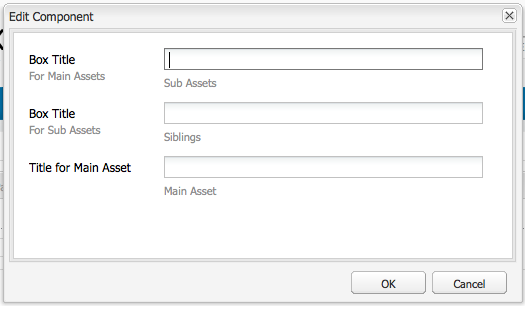

# Creare e configurare le pagine Editor risorse {#creating-and-configuring-asset-editor-pages}

Il presente documento descrive quanto segue:

* Creare pagine Editor risorse personalizzate.
* Come creare e personalizzare le pagine Editor risorse, ovvero pagine WCM che consentono di visualizzare e modificare i metadati ed eseguire azioni sulla risorsa.
* Come modificare più risorse contemporaneamente.

<!-- TBD: Add UICONTROL tags. Need PM review. Flatten the structure a bit. Re-write to remove Geometrixx mentions and to adhere to 6.5 OOTB samples. -->

>[!NOTE]
>
>Condivisione risorse è disponibile come implementazione di riferimento open source. Consultate [Contenuti comuni](https://adobe-marketing-cloud.github.io/asset-share-commons/)per la condivisione di risorse. Non è supportato ufficialmente.

## Perché creare e configurare le pagine Editor risorse? {#why-create-and-configure-asset-editor-pages}

Gestione delle risorse digitali viene utilizzata in sempre più scenari. Per passare da una soluzione su piccola scala per un piccolo gruppo di utenti con una formazione professionale, ad esempio fotografi o tassonomisti, a gruppi di utenti più grandi e diversificati, ad esempio utenti aziendali, autori WCM, giornalisti e così via, la potente interfaccia utente di Adobe Experience Manager (AEM) Assets per gli utenti professionali può fornire troppe informazioni e le parti interessate iniziano a richiedere interfacce utente o applicazioni specifiche per accedere alle risorse digitali che sono rilevanti per loro.

Queste applicazioni incentrate sulle risorse possono essere semplici gallerie fotografiche in una rete Intranet dove i dipendenti possono caricare foto da visite a fiere o da un centro stampa in un sito Web rivolto al pubblico, ad esempio l’esempio fornito con Geometrixx. Le applicazioni incentrate sulle risorse possono anche estendersi alle soluzioni complete, inclusi carrelli commerciali, checkout e processi di verifica.

La creazione di un’applicazione incentrata sulle risorse diventa in larga misura un processo di configurazione che non richiede la codifica, ma solo la conoscenza dei gruppi di utenti e delle loro esigenze, nonché la conoscenza dei metadati utilizzati. Le applicazioni incentrate sulle risorse create con AEM Assets sono estensibili: con un lavoro di codifica moderato è possibile creare componenti riutilizzabili per la ricerca, la visualizzazione e la modifica delle risorse.

Un’applicazione incentrata sulle risorse in AEM consiste in una pagina Editor risorse, che può essere utilizzata per ottenere una visualizzazione dettagliata di una risorsa specifica. Una pagina Editor risorse consente anche di modificare i metadati, a condizione che l’utente che accede alla risorsa disponga delle autorizzazioni necessarie.

## Creare e configurare una pagina Condivisione risorse {#creating-and-configuring-an-asset-share-page}

Potete personalizzare la funzionalità del Finder di DAM e creare pagine con tutte le funzionalità necessarie, denominate pagine di condivisione risorse. Per creare una nuova pagina Condivisione risorse, aggiungete la pagina utilizzando il modello Condivisione risorse di Geometrixx, quindi personalizzate le azioni che gli utenti possono eseguire su tale pagina, stabilite in che modo gli utenti vedranno le risorse e decideranno in che modo gli utenti possono creare le loro query.

Di seguito sono riportati alcuni esempi di utilizzo per la creazione di una pagina Condivisione risorse personalizzata:

* Centro Stampa per i Giornalisti
* Motore di ricerca immagini per utenti interni
* Database immagini per gli utenti del sito Web
* Interfaccia per tag multimediali per editor di metadati

### Creare una pagina Condivisione risorse {#creating-an-asset-share-page}

Per creare una nuova pagina Condivisione risorse, potete crearla quando lavorate su siti Web o da Gestione risorse digitali.

>[!NOTE]
>
>Per impostazione predefinita, quando create una pagina Condivisione risorse da **Nuovo** in Gestione risorse digitali, vengono automaticamente creati un visualizzatore di risorse e un editor risorse.

Per creare una nuova pagina Condivisione risorse nella console Siti **Web** :

1. Nella scheda **Siti** Web individuate il punto in cui desiderate creare una pagina di condivisione delle risorse e fate clic su **Nuovo**.

1. Selezionate la pagina Condivisione **** risorse e fate clic su **Crea**. La nuova pagina viene creata e la pagina di condivisione delle risorse è elencata nella scheda **Siti** Web.

La pagina di base creata con il modello Geometrixx DAM Asset Share si presenta come segue:

Per personalizzare la pagina Condivisione risorse, potete usare elementi dalla barra laterale e modificare le proprietà del generatore di query. La pagina **Geometrixx Press Center** è una versione personalizzata di una pagina basata su questo modello:

Per creare una nuova pagina di condivisione delle risorse tramite Gestione risorse digitali:

1. In Gestione risorse digitali, in **Nuovo**, selezionate **Nuova condivisione** risorse.
1. Nel **Titolo**, immettete il nome della pagina di condivisione delle risorse. Se necessario, inserite un nome per l’URL.

   

1. Fate doppio clic sulla pagina di condivisione delle risorse per aprirla e configurarla.

   

   Per impostazione predefinita, quando create una pagina Condivisione risorse da **Nuovo**, vengono automaticamente creati un visualizzatore e un editor risorse.

#### Personalizzare le azioni {#customizing-actions}

Potete determinare quali azioni possono essere eseguite dagli utenti sulle risorse digitali selezionate in base a una selezione di azioni predefinite.

Per aggiungere azioni alla pagina Condivisione risorse:

1. Nella pagina Condivisione risorse che desiderate personalizzare, fate clic su **Azioni** nella barra laterale.

Sono disponibili le azioni seguenti:

| Azione | Descrizione |
|---|---|
| [!UICONTROL Azione Elimina] | Gli utenti possono eliminare le risorse selezionate. |
| [!UICONTROL Azione di download] | Consente agli utenti di scaricare le risorse selezionate sul computer. |
| [!UICONTROL Azione Lightbox] | Salva le risorse in una &quot;scatola luminosa&quot; in cui è possibile eseguire altre azioni. Questa funzione è utile quando si lavora con risorse su più pagine. La lightbox può essere utilizzata anche come carrello per le risorse. |
| [!UICONTROL Azione spostamento] | Gli utenti possono spostare la risorsa in un&#39;altra posizione |
| [!UICONTROL Azione tag] | Consente agli utenti di aggiungere tag alle risorse selezionate |
| [!UICONTROL Azione visualizza risorsa] | Consente di aprire la risorsa nell’editor delle risorse per la manipolazione degli utenti. |

1. Trascinare l’azione appropriata nell’area **Azioni** della pagina. In questo modo viene creato un pulsante utilizzato per eseguire l&#39;azione.

#### Determinare come vengono presentati i risultati della ricerca {#determining-how-search-results-are-presented}

È possibile determinare in che modo i risultati vengono visualizzati da un elenco predefinito di obiettivi.

Per modificare la modalità di visualizzazione dei risultati della ricerca:

1. Nella pagina Condivisione risorse che desiderate personalizzare, fate clic su Cerca.

1. Trascinare l’obiettivo appropriato al centro superiore della pagina. Nel Centro Stampa, le ottiche sono già disponibili. Gli utenti premono l&#39;icona dell&#39;obiettivo appropriata per visualizzare i risultati della ricerca come desiderato.

Sono disponibili le seguenti ottiche:

| Obiettivo | Descrizione |
|---|---|
| **[!UICONTROL Vista elenco]** | Presenta le risorse in un elenco con i relativi dettagli. |
| **[!UICONTROL Vista mosaico]** | Presenta le risorse in modo mosaico. |

#### Vista mosaico {#mosaic-lens}

#### Vista elenco {#list-lens}

#### Personalizzazione di Query Builder {#customizing-the-query-builder}

Il generatore di query consente di inserire i termini di ricerca e creare il contenuto per la pagina Condivisione risorse. Quando modificate il generatore di query, potete anche determinare quanti risultati di ricerca vengono visualizzati per pagina, quale editor di risorse si apre quando fate doppio clic su una risorsa, il percorso di ricerca e personalizzate i tipi di nodi.

Per personalizzare il generatore di query:

1. Nella pagina Condivisione risorse da personalizzare, fate clic su **Modifica** in Query Builder. Per impostazione predefinita, viene visualizzata la scheda **Generale** .
1. Selezionate il numero di risultati per pagina, il percorso dell’editor risorse (se disponete di un editor risorse personalizzato) e il titolo Azioni.

1. Click the **Paths** tab. Inserite uno o più percorsi che verranno eseguiti dalla ricerca. Questi percorsi vengono sovrascritti se l&#39;utente utilizza il predicato Percorsi.

1. Se necessario, inserire un altro tipo di nodo.

1. Nel campo URL **di** Query Builder, potete ignorare o mandare a capo il generatore di query e immettere i nuovi URL servlet con il componente esistente di Query Builder. Nel campo URL **** feed potete anche ignorare l&#39;URL feed.

1. Nel campo **Testo** , inserite il testo da visualizzare per i risultati e i numeri di pagina dei risultati. Al termine, fate clic su **OK** .

#### Aggiunta di predicati {#adding-predicates}

Risorse AEM include diversi predicati che puoi aggiungere alla pagina Condivisione risorse. che consentono agli utenti di limitare ulteriormente le ricerche. In alcuni casi, possono ignorare un parametro del generatore di query (ad esempio, il parametro Path).

Per aggiungere i predicati:

1. Nella pagina Condivisione risorse da personalizzare, fate clic su **Cerca**.

1. Trascinate i predicati appropriati nella pagina Condivisione risorse sotto il generatore di query. In questo modo vengono creati i campi appropriati.

Sono disponibili i seguenti predicati:

| Predicato | Descrizione |
|---|---|
| **[!UICONTROL Predicato data]** | Consente agli utenti di cercare le risorse modificate prima e dopo determinate date. |
| **[!UICONTROL Predicato opzioni]** | Il proprietario del sito può specificare una proprietà da cercare (come nel predicato delle proprietà, ad esempio cq:tags) e una struttura del contenuto per popolare le opzioni da (ad esempio la struttura ad albero tag). In questo modo si genera un elenco di opzioni in cui gli utenti possono selezionare i valori (tag) che la proprietà selezionata (proprietà tag) deve avere. Questo predicato consente di creare controlli elenco come l&#39;elenco di tag, tipi di file, orientamenti immagine e così via. È ideale per un set fisso di opzioni. |
| **[!UICONTROL Predicato percorso]** | Consente agli utenti di definire il percorso e le sottocartelle, se necessario. |
| **[!UICONTROL Predicato proprietà]** | Il proprietario del sito specifica una proprietà da cercare, ad esempio tiff:ImageLength e l’utente può quindi immettere un valore, ad esempio 800. Questo restituisce tutte le immagini con un&#39;altezza di 800 pixel. Predefinito utile se la proprietà può avere valori arbitrari. |

Per ulteriori informazioni, consultate il [predicate Javadocs](https://helpx.adobe.com/experience-manager/6-5/sites/developing/using/reference-materials/javadoc/com/day/cq/search/eval/package-summary.html).

1. Per configurare ulteriormente il predicato, fate doppio clic su di esso. Ad esempio, quando si apre il predicato percorso, è necessario assegnare il percorso principale.

## Creare e configurare una pagina Editor risorse {#creating-and-configuring-an-asset-editor-page}

Potete personalizzare l’editor delle risorse per determinare in che modo gli utenti possono visualizzare e modificare le risorse digitali. A questo scopo, potete creare una nuova pagina Editor risorse e personalizzare le viste e le azioni che gli utenti possono eseguire sulla pagina.

>[!NOTE]
>
>Per aggiungere campi personalizzati all’editor delle risorse DAM, aggiungi nuovi nodi cq:Widget a `/apps/dam/content/asseteditors.`

### Creare una pagina Editor risorse {#creating-the-asset-editor-page}

Quando create la pagina Editor risorse, è buona norma creare la pagina direttamente sotto la pagina Condivisione risorse.

Per creare una pagina Editor risorse:

1. Nella scheda **Siti** Web individuate il punto in cui desiderate creare la pagina dell’editor risorse e fate clic su **Nuovo**.
1. Selezionate Editor **risorse** Geometrixx e fate clic su **Crea**. La nuova pagina viene creata e la pagina viene elencata nella scheda **Siti Web** .

La pagina di base creata con il modello Geometrixx Asset Editor si presenta come segue:

Per personalizzare la pagina Editor risorse, usate gli elementi della barra laterale. La pagina Editor risorse a cui si accede da **Geometrixx Press Center** è una versione personalizzata di una pagina basata su questo modello:

#### Aprire un Editor risorse da una pagina Condivisione risorse {#setting-which-asset-editor-opens-from-an-asset-share-page}

Dopo aver creato la pagina Editor risorse personalizzata, dovete fare in modo che quando fate doppio clic sulle risorse, la condivisione risorse personalizzata creata apra le risorse nella pagina Editor personalizzata.

Per impostare la pagina Editor risorse:

1. Nella pagina Condivisione risorse, fate clic su **Modifica** accanto a Query Builder.

1. Fare clic sulla scheda **Generale** se non è già selezionata.

1. Nel campo **Percorso editor** risorse, inserite il percorso dell’editor risorse in cui desiderate aprire la pagina Condivisione risorse e fate clic su **OK**.

#### Aggiunta di componenti dell’Editor risorse {#adding-asset-editor-components}

Per determinare le funzionalità di un editor di risorse, aggiungete componenti alla pagina.

Per aggiungere componenti dell’editor di risorse:

1. Nella pagina Editor risorse che desiderate personalizzare, selezionate Editor **** risorse nella barra laterale. Vengono visualizzati tutti i componenti dell’editor risorse disponibili.

>[!NOTE]
>
>I componenti che potete personalizzare dipendono dai componenti disponibili. Per abilitare i componenti, passate alla modalità Progettazione e selezionate i componenti da abilitare.

1. Trascinate i componenti dalla barra laterale all’editor delle risorse e apportate eventuali modifiche nelle finestre di dialogo dei componenti. I componenti sono descritti nella tabella seguente e descritti nelle istruzioni dettagliate che seguono.

>[!NOTE]
>
>Durante la progettazione della pagina dell’editor risorse, potete creare componenti in sola lettura o modificabili. Se nel componente è presente un’immagine di matita, gli utenti possono modificare un campo. Per impostazione predefinita, la maggior parte dei componenti è impostata come sola lettura.

| Componente | Descrizione |
|---|---|
| **[!UICONTROL Campo di testo Modulo]metadati e[!UICONTROL Metadati]** | Consente di aggiungere ulteriori metadati a una risorsa ed eseguire un’azione, ad esempio l’invio, sulla risorsa. |
| **[!UICONTROL Risorse secondarie]** | Consente di personalizzare le risorse secondarie. |
| **Tag** | Consente agli utenti di selezionare e aggiungere tag a una risorsa. |
| **[!UICONTROL Miniatura]** | Mostra una miniatura della risorsa, il suo nome file e consente di aggiungere un testo alternativo. Puoi anche aggiungere azioni per l’editor di risorse qui. |
| **[!UICONTROL Titolo]** | Visualizza il titolo della risorsa, che può essere personalizzato. |

#### Modulo metadati e campo di testo - Configurazione del componente Visualizza metadati {#metadata-form-and-text-field-configuring-the-view-metadata-component}

Il Modulo metadati è un modulo che include un’azione iniziale e finale. Tra questi due campi è possibile immettere i campi **Testo** . Per ulteriori informazioni sull&#39;uso dei moduli, vedere [Moduli](/help/sites-authoring/default-components-foundation.md#form-component) .

1. Per creare un&#39;azione iniziale, fare clic su **Modifica** nell&#39;area Inizio del modulo. Se necessario, potete immettere un titolo Casella. Per impostazione predefinita, il titolo Casella è **Metadati**. Selezionare la casella di controllo Convalida client se si desidera generare il codice client Java-script per la convalida.

1. Per creare un&#39;azione Fine, fare clic su **Modifica** nell&#39;area Fine del modulo. Ad esempio, potete creare un pulsante **Invia** per consentire agli utenti di inviare le modifiche ai metadati. Facoltativamente, potete aggiungere un pulsante **Ripristina** per ripristinare lo stato originale dei metadati.

1. Tra l’inizio **del** modulo e la fine **del** modulo, trascinare i campi di testo dei metadati nel modulo. Gli utenti compilano i metadati in questi campi di testo e possono quindi inviare o completare un’altra azione.

1. Fate doppio clic sul nome del campo, ad esempio **Titolo** per aprire il campo di metadati e apportare modifiche. Nella scheda **Generale** della finestra **Modifica componente** è possibile definire lo spazio dei nomi, l&#39;etichetta del campo e il tipo, ad esempio `dc:title`.

Consulta [Personalizzazione ed estensione di Risorse](/help/assets/extending-assets.md) AEM per informazioni sulla modifica degli spazi dei nomi disponibili nel modulo di metadati.

1. Click the **Constraints** tab. Qui è possibile selezionare se un campo è obbligatorio e, se necessario, aggiungere eventuali vincoli.

1. Click the **Display** tab. Qui potete immettere una nuova larghezza e un nuovo numero di righe per il campo di metadati. Selezionate la casella di controllo **Campo è di sola** lettura per consentire agli utenti di modificare i metadati.

Di seguito è riportato un esempio di modulo Metadati con vari campi:

Nella pagina Editor risorse, gli utenti possono quindi immettere valori nei campi di metadati (se modificabili) ed eseguire l’azione finale (ad esempio, inviare le modifiche).

#### Risorse secondarie {#sub-assets}

Il componente Risorse secondarie consente di visualizzare e selezionare le risorse secondarie. Potete determinare i nomi visualizzati sotto le risorse [e le risorse secondarie](/help/assets/assets.md#what-are-digital-assets) principali.

Fate doppio clic sul componente Risorse secondarie per aprire la finestra di dialogo delle risorse secondarie, in cui potete modificare i titoli per la risorsa principale e le risorse secondarie. I valori predefiniti vengono visualizzati sotto il campo corrispondente.

Esempio di un componente Risorse secondarie compilato:

Ad esempio, se selezionate una risorsa secondaria, tenete conto di come il componente visualizza la pagina appropriata e il titolo Casella cambia da Risorse secondarie a Limiti.

#### Tag {#tags}

Il componente Tag è un componente che consente agli utenti di assegnare tag esistenti a una risorsa, in modo da facilitarne l’organizzazione e il recupero in un secondo momento. Potete rendere il componente di sola lettura, in modo che gli utenti non possano aggiungere tag, ma solo visualizzarli.

Fate doppio clic sul componente Tag per aprire la finestra di dialogo dei tag in cui potete cambiare il titolo dai tag, se necessario, e in cui potete selezionare gli spazi dei nomi assegnati. Per rendere il campo modificabile, deselezionare la casella di controllo **[!UICONTROL Nascondi modifica]** . Per impostazione predefinita, i tag sono modificabili.

Se gli utenti possono modificare i tag, possono fare clic sulla matita per aggiungere i tag selezionandoli dal menu a discesa Tag.

Di seguito è riportato un componente Tag popolato:

#### Miniatura {#thumbnail}

Il componente Miniatura è il punto in cui la risorsa visualizza la miniatura selezionata (per molti formati la miniatura viene estratta automaticamente). Inoltre, il componente visualizza il nome del file e [le azioni che è possibile modificare](/help/assets/assets-finder-editor.md#adding-asset-editor-actions).

Fate doppio clic sul componente della miniatura per aprire la finestra di dialogo della miniatura in cui potete modificare il testo alternativo. Per impostazione predefinita, il testo alt della miniatura è impostato su **Clic per scaricare** la risorsa.

Esempio di un componente Miniatura con popolamento:

#### Titolo {#title}

Il componente Titolo visualizza il titolo della risorsa e una descrizione.

Per impostazione predefinita, è in modalità di sola lettura e gli utenti non possono modificarla. Per renderlo modificabile, fate doppio clic sul componente e deselezionate la casella di controllo **Nascondi pulsante** modifica. Inoltre, immettete un titolo per più risorse.

Se il Titolo può essere modificato, potete aggiungere un titolo e una descrizione facendo clic sulla matita per aprire la finestra Proprietà **** risorsa. Inoltre, potete attivare e disattivare la risorsa selezionando la data e l’ora.

Quando gli utenti modificano il Titolo facendo clic sull’icona Matita, possono modificare il **Titolo**, la **Descrizione** e immettere **Attivato** e **Disattiva tempo** per attivare e disattivare la risorsa.

Esempio di un componente Titolo popolato:

#### Aggiunta di azioni Editor risorse {#adding-asset-editor-actions}

Potete determinare quali azioni possono essere eseguite dagli utenti sulle risorse digitali selezionate in base a una selezione di azioni predefinite.

Per aggiungere azioni alla pagina Editor risorse:

1. Nella pagina Editor risorse che desiderate personalizzare, fate clic su Editor **** risorse nella barra laterale.

Sono disponibili le azioni seguenti:

| Azione | Descrizione |
|---|---|
| [!UICONTROL Scarica] | Consente agli utenti di scaricare le risorse selezionate sul computer. |
| [!UICONTROL Editor] | Consente agli utenti di modificare un’immagine (modifica interattiva) |
| [!UICONTROL Lightbox] | Salva le risorse in una &quot;scatola luminosa&quot; in cui è possibile eseguire altre azioni. Questa funzione è utile quando si lavora con risorse su più pagine. |
| [!UICONTROL Blocco] | Consente agli utenti di bloccare una risorsa. Questa funzionalità non è abilitata per impostazione predefinita e deve essere abilitata nell’elenco dei componenti. |
| [!UICONTROL Riferimenti] | Fate clic qui per visualizzare le pagine in cui viene utilizzata la risorsa. |
| [!UICONTROL Gestione versioni] | Consente di creare e ripristinare versioni di una risorsa. |

1. Trascinare l’azione appropriata nell’area **Azioni** della pagina. In questo modo viene creato un pulsante utilizzato per eseguire l&#39;azione.

## Risorse con più modifiche nella pagina Editor risorse {#multi-editing-assets-with-the-asset-editor-page}

Risorse AEM consente di apportare modifiche a più risorse alla volta. Dopo aver selezionato le risorse, potete modificarle simultaneamente:

* Tag
* Metadati

Per modificare più risorse con la pagina Editor risorse:

1. Aprite la pagina Geometrixx **Press Center** :
   `https://localhost:4502/content/geometrixx/en/company/press.html`

1. Selezionate le risorse:

   * in Windows: `Ctrl + click` ciascuna risorsa.
   * in Mac: `Cmd + click` ciascuna risorsa.
   Per selezionare un intervallo di risorse: fate clic sulla prima risorsa e quindi `Shift + click` sull’ultima.

1. Fate clic su **Modifica metadati** nel campo **Azioni** (parte sinistra della pagina).
1. La pagina Editor **risorse** per centro stampa Geometrixx si apre in una nuova scheda. I metadati delle risorse vengono visualizzati come segue:

   * Un tag, che non si applica a tutte le risorse ma solo ad alcune, viene visualizzato in corsivo.
   * Un tag applicato a tutte le risorse viene visualizzato con un font normale.
   * Metadati diversi dai tag: il valore del campo viene visualizzato solo se è lo stesso per tutte le risorse selezionate.

1. Fate clic su **Scarica** per scaricare un file zip contenente le risorse rappresentate originali.
1. Fate clic sull’icona matita accanto al campo **Tag** per modificare i tag:

   * Un tag che non si applica a tutte le risorse, ma solo ad alcune ha uno sfondo grigio.
   * Un tag applicato a tutte le risorse ha uno sfondo bianco.
   Tieni presente quanto segue:

   * Fate clic sull’icona **x** per rimuovere il tag per tutte le risorse.
   * Fate clic sull’icona **+** per aggiungere il tag a tutte le risorse.
   * Fate clic sulla **freccia** e selezionate un tag per aggiungere un nuovo tag a tutte le risorse.
   Fare clic su **OK** per scrivere le modifiche al modulo. La casella accanto al campo **Tag** viene selezionata automaticamente.

1. Modificare il campo Descrizione. Ad esempio, impostatelo su:

   `This is a common description`

   Quando un campo viene modificato, il relativo valore sovrascrive i valori esistenti delle risorse selezionate quando il modulo viene inviato.

   Nota: la casella accanto al campo viene selezionata automaticamente quando il campo viene modificato.

1. Fate clic su **Aggiorna metadati** per inviare il modulo e salvare le modifiche per tutte le risorse.

   Nota: vengono modificati solo i metadati selezionati.
