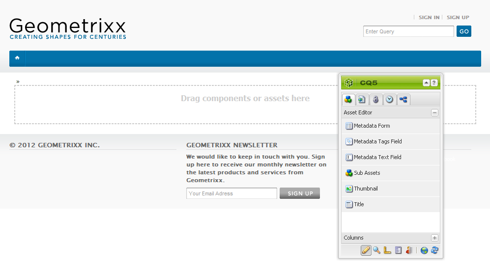

# Creare e configurare le pagine dell’Editor risorse {#creating-and-configuring-asset-editor-pages}

Il presente documento descrive quanto segue:

* Perché creare pagine Asset Editor personalizzate.
* Creazione e personalizzazione di pagine Asset Editor , ovvero pagine WCM che consentono di visualizzare e modificare i metadati ed eseguire azioni sulla risorsa.
* Come modificare più risorse contemporaneamente.

<!-- TBD: Add UICONTROL tags. Need PM review. Flatten the structure a bit. Re-write to remove Geometrixx mentions and to adhere to 6.5 default samples. -->

>[!NOTE]
>
>Condivisione risorse è disponibile come implementazione di riferimento open source. Vedi [Asset Share Commons](https://adobe-marketing-cloud.github.io/asset-share-commons/). Non è ufficialmente supportato.

## Perché creare e configurare le pagine dell’Editor risorse? {#why-create-and-configure-asset-editor-pages}

La gestione delle risorse digitali viene utilizzata in sempre più scenari. Quando si passa da una soluzione su piccola scala per un piccolo gruppo di utenti con una formazione professionale, ad esempio fotografi o tassonomisti, a gruppi di utenti più grandi e diversificati, ad esempio utenti aziendali, autori WCM, giornalisti e così via, la potente interfaccia utente di [!DNL Adobe Experience Manager Assets] gli utenti professionali possono fornire troppe informazioni e le parti interessate iniziano a richiedere specifiche interfacce utente o applicazioni per accedere alle risorse digitali rilevanti per loro.

Queste applicazioni incentrate sulle risorse possono essere semplici gallerie di foto in una Intranet dove i dipendenti possono caricare foto da visite di fiere o da un centro stampa in un sito web rivolto al pubblico. Le applicazioni incentrate sulle risorse possono anche estendersi a soluzioni complete, inclusi carrelli, checkout e processi di verifica.

La creazione di un’applicazione incentrata sulle risorse diventa in larga misura un processo di configurazione che non richiede la codifica, che include solo la conoscenza dei gruppi di utenti e delle loro esigenze, nonché la conoscenza dei metadati utilizzati. Applicazioni incentrate sulle risorse create con [!DNL Assets] sono estensibili: con un lavoro di codifica moderato è possibile creare componenti riutilizzabili per la ricerca, la visualizzazione e la modifica delle risorse.

Applicazione incentrata sulle risorse in [!DNL Experience Manager] è costituito da una pagina Asset Editor che può essere utilizzata per ottenere una visualizzazione dettagliata di una risorsa specifica. Una pagina Asset Editor consente anche di modificare i metadati, purché l’utente che accede alla risorsa disponga delle autorizzazioni necessarie.

<!--
## Create and configure an Asset Share page {#creating-and-configuring-an-asset-share-page}

You customize the DAM Finder functionality and create pages that have all the functionality you require, which are called Asset Share pages. To create a new Asset Share page, you add the page using the Geometrixx Asset Share template and then you customize the actions users can perform on that page, determine how viewers see the assets, and decide how users can build their queries.

Here are some use cases for creating a customized Asset Share page:

* Press Center for Journalists.
* Image Search Engine for internal business users.
* Image Database for website users.
* Media Tagging Interface for metadata editors.

### Create an Asset Share page {#creating-an-asset-share-page}

To create a new Asset Share page, you can either create it when you are working on web sites or from the digital asset manager.

>[!NOTE]
>
>By default, when you create an Asset Share page from **New** in the digital asset manager, an Asset viewer and Asset editor are automatically created for you.

To create an new Asset Share page in the **Websites** console:

1. In the **Websites** tab, navigate to the place where you want to create an asset share page and click **New**.

1. Select the **Asset Share** page and click **Create**. The new page is created and the asset share page is listed in the **Websites** tab.

The basic page created using the Geometrixx DAM Asset Share template looks as follows:

To customize your Asset Share page, you use elements from the sidekick and you also edit query builder properties. The page **Geometrixx Press Center** is a customized version of a page based on this template:

To create a new asset share page via the digital asset manager:

1. In the digital asset manager, in **New**, select **New Asset Share**.
1. In the **Title**, enter the name of the asset share page. If desired, enter a name for the URL.

   

1. Double-click the asset share page to open it and configure the page.

   

   By default, when you create an Asset Share page from **New**, an Asset viewer and Asset editor are automatically created for you.

#### Customize actions {#customizing-actions}

You can determine what actions users can perform on selected digital assets from a selection of predefined actions.

To add actions to the Asset Share page:

1. In the Asset Share page that you want to customize, click **Actions** in the sidekick.

The following actions are available:

 | Action | Description |
 |---|---|
 | [!UICONTROL Delete Action] | Users can delete the selected assets. |
 | [!UICONTROL Download Action] | Lets users download selected assets to their computers. |
 | [!UICONTROL Lightbox Action] | Saves assets to a "lightbox"   where you can perform other actions on them. This comes in handy when working   with assets across multiple pages. The lightbox can also be used as a   shopping cart for assets. |
 | [!UICONTROL Move Action] | Users can move the asset to another   location |
 | [!UICONTROL Tags Action] | Lets users add tags to selected assets |
 | [!UICONTROL View Asset Action] | Opens the asset in the Asset editor for   user manipulation. |

1. Drag the appropriate action to the **Actions** area on the page. Doing so creates a button that is used to execute that action.

#### Determine how search results are presented {#determining-how-search-results-are-presented}

You determine how results are displayed from a predefined list of lenses.

To change how search results are viewed:

1. In the Asset Share page that you want to customize, click Search.

1. Drag the appropriate lens to the top center of the page. In the Press Center, the lenses are already available. Users press the appropriate lens icon to display search results as desired.

The following lenses are available:

| Lens | Description |
|---|---|
| **[!UICONTROL List Lens]** |Presents the assets in a list fashion with details. |
| **[!UICONTROL Mosaic Lens]** |Presents assets in a mosaic fashion. |

#### Mosaic Lens {#mosaic-lens}

#### List Lens {#list-lens}

#### Customize the Query Builder {#customizing-the-query-builder}

The query builder lets you enter search terms and create content for the Asset Share page. When you edit the query builder, you also get to determine how many search results are displayed per page, which asset editor opens when you double-click an asset, the path the query searches, and customizes nodetypes.

To customize the query builder:

1. In the Asset Share page that you want to customize, click **Edit** in the Query Builder. By default, the **General** tab opens.
1. Select the number of results per page, the path of the asset editor (if you have a customized asset editor) and the Actions title.

1. Click the **Paths** tab. Enter a path or multiple paths that the search will run. These paths are overwritten if the user uses the Paths predicate.

1. Enter another node type, if desired.

1. In the **Query Builder URL** field, you can override or wrap the query builder and enter the new servlet URLs with the existing query builder component. In the **Feed URL** field, you can override the Feed URL as well.

1. In the **Text** field, enter the text you want to appear for results and page numbers of results. Click **OK** when finished making changes.

#### Add predicates {#adding-predicates}

Experience Manager Assets includes a number of predicates that you can add to the Asset Share page. These let your users further narrow searches. In some cases, they may override a query builder parameter (for example, the Path parameter).

To add predicates:

1. In the Asset Share page that you want to customize, click **Search**.

1. Drag the appropriate predicates to the Asset Share page underneath the query builder. Doing so creates the appropriate fields.

The following predicates are available:

| Predicate | Description |
|---|---|
| **[!UICONTROL Date Predicate]** |Lets users search for assets that were modified before and after certain dates. |
| **[!UICONTROL Options Predicate]** |The site owner can specify a property to search for (as in the property predicate, for example cq:tags) and a content tree to populate the options from (for example the tag tree). Doing so generates a list of options where the users can select the values (tags) that the selected property (tag property) should have. This predicate lets you build list controls like the list of tags, file types, image orientations, and so on. It is great for a fixed set of options. |
| **[!UICONTROL Path Predicate]** |Lets users define the path and subfolders, if desired. |
| **[!UICONTROL Property Predicate]** |The site owner specifies a property to search for, e.g. tiff:ImageLength and the user can then enter a value, e.g. 800. This returns all images that are 800 pixels high. Useful predicate if your property can have arbitrary values. |

For more information, see the [predicate Javadocs](https://helpx.adobe.com/experience-manager/6-5/sites/developing/using/reference-materials/javadoc/com/day/cq/search/eval/package-summary.html).

1. To configure the predicate further, double-click it. For example, when you open the Path Predicate, you need to assign the root path.

-->

## Creare e configurare una pagina Asset Editor {#creating-and-configuring-an-asset-editor-page}

Puoi personalizzare l’editor delle risorse per determinare come gli utenti possono visualizzare e modificare le risorse digitali. A questo scopo, crea una nuova pagina Asset Editor e personalizza le visualizzazioni e le azioni che gli utenti possono eseguire su tale pagina.

>[!NOTE]
>
>Se desideri aggiungere campi personalizzati all’editor risorse DAM, aggiungi nuovo `cq:Widget` nodi a `/apps/dam/content/asseteditors.`

### Creare una pagina Editor risorse {#creating-the-asset-editor-page}

Durante la creazione della pagina Editor risorse, è buona norma creare la pagina direttamente sotto la pagina Condivisione risorse.

Per creare una pagina Editor risorse:

1. In **[!UICONTROL Siti Web]** , passa al punto in cui desideri creare una pagina dell’editor risorse e fai clic su **Nuovo**.
1. Seleziona **Editor risorse di Geometrixx** e fai clic su **Crea**. La nuova pagina viene creata e la pagina viene elencata nel **Siti Web** scheda .

La pagina di base creata utilizzando il modello Editor risorse di Geometrixx si presenta così:

Per personalizzare la pagina Editor risorse, utilizza gli elementi della barra laterale. La pagina Editor risorse a cui si accede dal **Geometrixx Press Centre** è una versione personalizzata di una pagina basata su questo modello:

#### Impostare un editor risorse da aprire da una pagina Condivisione risorse {#setting-which-asset-editor-opens-from-an-asset-share-page}

Dopo aver creato la pagina Asset Editor personalizzata, è necessario assicurarsi che quando si fa doppio clic sulle risorse, la Condivisione risorse personalizzata creata apra le risorse nella pagina Editor personalizzata.

Per impostare la pagina Editor risorse:

1. Nella pagina Condivisione risorse, fai clic su **Modifica** accanto a Query Builder.

1. Fai clic sul pulsante **Generale** se non è già selezionata.

1. In **Percorso di Asset Editor** , immetti il percorso dell’editor risorse in cui desideri aprire le risorse nella pagina Condivisione risorse e fai clic su **OK**.

#### Aggiungere componenti dell’Editor risorse {#adding-asset-editor-components}

Puoi determinare le funzionalità di un editor risorse aggiungendo componenti alla pagina.

Per aggiungere componenti dell’editor risorse:

1. Nella pagina Editor risorse da personalizzare, seleziona **Editor risorse** nella barra laterale. Vengono visualizzati tutti i componenti dell’editor risorse disponibili.

>[!NOTE]
>
>Ciò che è possibile personalizzare dipende dai componenti disponibili. Per abilitare i componenti, passa alla modalità Progettazione e seleziona i componenti necessari.

1. Trascina i componenti dalla barra laterale all’editor risorse e apporta eventuali modifiche nelle finestre di dialogo dei componenti. I componenti sono descritti nella tabella seguente e descritti nelle istruzioni dettagliate che seguono.

>[!NOTE]
>
>Durante la progettazione della pagina dell’editor risorse, puoi creare componenti che sono di sola lettura o modificabili. Gli utenti sanno che è possibile modificare un campo se nel componente è presente un’immagine di una matita. Per impostazione predefinita, la maggior parte dei componenti è impostata come di sola lettura.

| Componente | Descrizione |
|---|---|
| **[!UICONTROL Modulo metadati] e [!UICONTROL Campo di testo metadati]** | Consente di aggiungere metadati aggiuntivi a una risorsa ed eseguire un’azione, ad esempio l’invio, sulla risorsa. |
| **[!UICONTROL Risorse secondarie]** | Consente di personalizzare le risorse secondarie. |
| **Tag** | Consente agli utenti di selezionare e aggiungere tag a una risorsa. |
| **[!UICONTROL Miniatura]** | Mostra una miniatura della risorsa, il suo nome file e consente di aggiungere un testo alternativo. Puoi aggiungere anche le azioni dell’editor risorse qui. |
| **[!UICONTROL Titolo]** | Visualizza il titolo della risorsa, che può essere personalizzato. |

#### Modulo metadati e campo di testo - Configurazione del componente Visualizza metadati {#metadata-form-and-text-field-configuring-the-view-metadata-component}

Il modulo metadati è un modulo che include un’azione iniziale e finale. Nel mezzo, immetti **Testo** campi. Vedi [Forms](/help/sites-authoring/default-components-foundation.md#form-component) per ulteriori informazioni sull’utilizzo dei moduli.

1. Crea un’azione iniziale facendo clic su **Modifica** nell’area Inizio del modulo. Se necessario, è possibile immettere un titolo Casella. Per impostazione predefinita, il titolo Casella è **Metadati**. Selezionare la casella di controllo Convalida client se si desidera generare il codice client java-script per la convalida.

1. Crea un&#39;azione Fine facendo clic su **Modifica** nell’area Fine del modulo. Ad esempio, puoi creare un **[!UICONTROL Invia]** per consentire agli utenti di inviare le modifiche ai metadati. Facoltativamente, puoi aggiungere un **Reimposta** che ripristina lo stato originale dei metadati.

1. Tra **Inizio modulo** e **Fine modulo**, trascinare i campi di testo metadati sul modulo. Gli utenti compilano i metadati in questi campi di testo, sui quali possono inviare o completare un’altra azione.

1. Fare doppio clic sul nome del campo, ad esempio **Titolo** per aprire il campo metadati e apportare modifiche. In **Generale** della scheda **Modifica componente** finestra, è possibile definire lo spazio dei nomi e l’etichetta del campo, nonché il tipo, ad esempio, `dc:title`.

Vedi [Personalizzazione ed estensione delle risorse](/help/assets/extending-assets.md) per informazioni sulla modifica dei namespace disponibili nel modulo metadati.

1. Fai clic sul pulsante **Vincoli** scheda . Qui è possibile selezionare se un campo è obbligatorio e, se necessario, aggiungere eventuali vincoli.

1. Fai clic sul pulsante **Visualizzazione** scheda . In questo caso, puoi immettere una nuova larghezza e un nuovo numero di righe per il campo metadati. Seleziona la **Campo di sola lettura** per consentire agli utenti di modificare i metadati.

Esempio di modulo metadati con vari campi:

Nella pagina Asset Editor , gli utenti possono quindi immettere i valori nei campi di metadati (se modificabili) ed eseguire l’azione finale (ad esempio, l’invio delle modifiche).

#### Risorse secondarie {#sub-assets}

Il componente Risorse secondarie permette di visualizzare e selezionare le risorse secondarie. È possibile determinare quali nomi vengono visualizzati sotto la [risorsa principale](/help/assets/assets.md#what-are-digital-assets) e risorse secondarie.

Fai doppio clic sul componente Risorse secondarie per aprire la finestra di dialogo delle risorse secondarie, in cui puoi modificare i titoli della risorsa principale e di tutte le risorse secondarie. I valori predefiniti vengono visualizzati sotto il campo corrispondente.

Di seguito è riportato un esempio di un componente Sub Assets popolato:

Ad esempio, se selezioni una risorsa secondaria, tieni presente che il componente visualizza la pagina appropriata e che il titolo della casella cambia da Risorse secondarie a Limitazioni.

#### Tag {#tags}

Il componente Tag è un componente che consente agli utenti di assegnare tag esistenti a una risorsa, in modo da facilitarne l’organizzazione e il recupero in un secondo momento. Puoi rendere il componente di sola lettura, in modo che gli utenti non possano aggiungere tag, ma solo visualizzarli.

Fai doppio clic sul componente Tag per aprire la finestra di dialogo dei tag in cui puoi modificare il titolo da Tag, se desiderato, e in cui puoi selezionare i namespace allocati. Per rendere modificabile questo campo, cancella la **[!UICONTROL Nascondi modifica]** casella di controllo. Per impostazione predefinita, i tag sono modificabili.

Se gli utenti possono modificare i tag, possono fare clic sulla matita per aggiungere tag selezionandoli dal menu a discesa Tag .

Di seguito è riportato un componente Tag compilato:

#### Miniatura  {#thumbnail}

Il componente Miniatura è il punto in cui la risorsa visualizza la miniatura selezionata (per molti dei formati in cui la miniatura viene estratta automaticamente). Inoltre, il componente visualizza il nome del file e [azioni modificabili](/help/assets/assets-finder-editor.md#adding-asset-editor-actions).

Fai doppio clic sul componente miniatura per aprire la finestra di dialogo miniatura in cui puoi modificare il testo alt. Per impostazione predefinita, il testo alternativo della miniatura è impostato su **Fai clic per scaricare** risorsa.

Esempio di un componente Miniatura popolato:

#### Titolo {#title}

Il componente Titolo visualizza il titolo della risorsa e una descrizione.

Per impostazione predefinita è in modalità di sola lettura e gli utenti non possono modificarla. Per renderlo modificabile, fai doppio clic sul componente e cancella il **Pulsante Nascondi modifica** casella di controllo. Inoltre, immetti un titolo per più risorse.

Se è possibile modificare il Titolo, è possibile aggiungere un titolo e una descrizione facendo clic sulla matita per aprire la **Proprietà risorsa** finestra. Inoltre, puoi attivare e disattivare la risorsa selezionando la data e l’ora.

Durante la modifica del [!UICONTROL Titolo], gli utenti possono modificare **Titolo**, **Descrizione** e immetti **On** e **Tempi di disattivazione** per attivare e disattivare la risorsa.

Di seguito è riportato un esempio di componente Titolo popolato:

#### Aggiungere azioni Editor risorse {#adding-asset-editor-actions}

È possibile determinare le azioni che gli utenti possono eseguire sulle risorse digitali selezionate in base a una selezione di azioni predefinite.

Per aggiungere azioni alla pagina Editor risorse:

1. Nella pagina Editor risorse da personalizzare, fai clic su **Editor risorse** nella barra laterale.

Sono disponibili le seguenti azioni:

| Azione | Descrizione |
|---|---|
| [!UICONTROL Download] | Consente agli utenti di scaricare le risorse selezionate sui propri computer. |
| [!UICONTROL Editor] | Consente agli utenti di modificare un’immagine (modifica interattiva) |
| [!UICONTROL Lightbox] | Salva le risorse in una &quot;Lightbox&quot; in cui puoi eseguire altre azioni. Questa funzione è utile quando si lavora con risorse su più pagine. |
| [!UICONTROL Blocco] | Consente agli utenti di bloccare una risorsa. Questa funzionalità non è abilitata per impostazione predefinita e deve essere abilitata nell’elenco dei componenti. |
| [!UICONTROL Riferimenti] | Fai clic su questo pulsante per visualizzare le pagine in cui viene utilizzata la risorsa. |
| [!UICONTROL Controllo delle versioni] | Consente di creare e ripristinare le versioni di una risorsa. |

1. Trascina l’azione appropriata nella **Azioni** nella pagina. Crea un’opzione utilizzata per eseguire l’azione trascinata sulla pagina.

## Risorse con più modifiche nella pagina Editor risorse {#multi-editing-assets-with-the-asset-editor-page}

Con [!DNL Experience Manager Assets] puoi apportare modifiche a più risorse contemporaneamente. Dopo aver selezionato le risorse, puoi modificarle simultaneamente:

* Tag
* Metadati

Per modificare più risorse con la pagina Editor risorse:

1. Apri la Geometrixx **Press Centre** pagina:
   `https://localhost:4502/content/geometrixx/en/company/press.html`

1. Seleziona le risorse:

   * su Windows: `Ctrl + click` ciascuna risorsa.
   * su Mac: `Cmd + click` ciascuna risorsa.

   Per selezionare un intervallo di risorse: fai clic sulla prima risorsa, quindi `Shift + click` l’ultima risorsa.

1. Fai clic su **Modifica metadati** in **Azioni** (parte sinistra della pagina).
1. Il Geometrixx **Editor risorse del centro stampa** viene aperta in una nuova scheda. I metadati delle risorse vengono visualizzati come segue:

   * Un tag , che non si applica a tutte le risorse, ma solo a alcune, viene visualizzato in corsivo.
   * Un tag applicato a tutte le risorse viene visualizzato con un font normale.
   * Metadati diversi dai tag: il valore del campo viene visualizzato solo se è lo stesso per tutte le risorse selezionate.

1. Fai clic su **Scarica** per scaricare un file ZIP contenente i rendering originali delle risorse.
1. Fai clic su modifica l’opzione tag accanto a **Tag** campo .

   * Un tag che non si applica a tutte le risorse, ma solo a alcune ha uno sfondo grigio.
   * Un tag applicato a tutte le risorse ha uno sfondo bianco.

   Operazioni disponibili:

   * Fai clic su `x` per rimuovere il tag di tutte le risorse.
   * Fai clic su `+` per aggiungere il tag a tutte le risorse.
   * Fai clic sul pulsante **freccia** e seleziona un tag per aggiungere un nuovo tag a tutte le risorse.

   Fai clic su **OK** per scrivere le modifiche al modulo. La scatola accanto alla **Tag** viene selezionato automaticamente.

1. Modificare il campo Descrizione . Ad esempio, impostalo su:

   `This is a common description`

   Quando un campo viene modificato, il relativo valore sovrascrive i valori esistenti delle risorse selezionate al momento dell’invio del modulo.

   Nota: la casella accanto al campo viene selezionata automaticamente quando il campo viene modificato.

1. Fai clic su **Aggiorna metadati** per inviare il modulo e salvare le modifiche per tutte le risorse.

   Nota: vengono modificati solo i metadati controllati.
