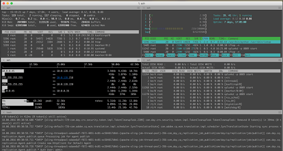

# Best practice da monitorare [!DNL Adobe Experience Manager Assets] distribuzione {#assets-monitoring-best-practices}

Dalla sezione [!DNL Experience Manager Assets] punto di vista, il monitoraggio dovrebbe comprendere l&#39;osservazione e la rendicontazione dei seguenti processi e tecnologie:

* CPU di sistema
* Utilizzo della memoria di sistema
* Tempo di attesa I/O del disco di sistema
* I/O di rete del sistema
* MBean JMX per l’utilizzo dell’heap e i processi asincroni, come i flussi di lavoro
* Controlli di integrità della console OSGi

In genere, [!DNL Experience Manager Assets] possono essere monitorati in due modi: in tempo reale e a lungo termine.

## Monitoraggio live {#live-monitoring}

È necessario eseguire il monitoraggio in tempo reale durante la fase di test delle prestazioni dello sviluppo o durante situazioni di carico elevato per comprendere le caratteristiche delle prestazioni dell’ambiente. In genere, il monitoraggio in tempo reale deve essere eseguito utilizzando una suite di strumenti. Di seguito sono riportati alcuni consigli:

* [VM visiva](https://visualvm.github.io/): Visual VM consente di visualizzare informazioni dettagliate sulla Java VM, tra cui l’utilizzo della CPU e della memoria Java. Inoltre, ti consente di campionare e valutare il codice in esecuzione su una distribuzione.
* [In alto](https://man7.org/linux/man-pages/man1/top.1.html): superiore è un comando Linux che apre un dashboard che visualizza le statistiche di utilizzo, inclusi l&#39;utilizzo di CPU, memoria e I/O. Offre una panoramica di alto livello di ciò che accade in un’istanza.
* [Htop](https://hisham.hm/htop/): Htop è un visualizzatore di processi interattivo. Fornisce informazioni dettagliate sull’utilizzo della CPU e della memoria, oltre a ciò che Top può fornire. Htop può essere installato sulla maggior parte dei sistemi Linux utilizzando `yum install htop` o `apt-get install htop`.

* Iotop: Iotop è un dashboard dettagliato per l&#39;utilizzo di I/O su disco. Vengono visualizzate barre e contatori che illustrano i processi che utilizzano operazioni di I/O su disco e la quantità utilizzata. Iotop può essere installato sulla maggior parte dei sistemi Linux utilizzando `yum install iotop` o `apt-get install iotop`.

* [Inizio](https://www.ex-parrot.com/pdw/iftop/): iftop visualizza informazioni dettagliate sull&#39;utilizzo di Ethernet/rete. Inftop visualizza le statistiche per canale di comunicazione sulle entità che utilizzano Ethernet e la quantità di larghezza di banda che utilizzano. Iftop può essere installato sulla maggior parte dei sistemi Linux utilizzando `yum install iftop` o `apt-get install iftop`.

* Java Flight Recorder (JFR): uno strumento commerciale di Oracle che puoi utilizzare liberamente in ambienti non di produzione. Per ulteriori dettagli, consulta [Come utilizzare Java Flight Recorder per diagnosticare i problemi di runtime CQ](https://cq-ops.tumblr.com/post/73865704329/how-to-use-java-flight-recorder-to-diagnose-cq).
* [!DNL Experience Manager] `error.log` file: puoi analizzare [!DNL Experience Manager] `error.log` per i dettagli degli errori registrati nel sistema. Usa il comando `tail -F quickstart/logs/error.log` per identificare gli errori da esaminare.
* [Console del flusso di lavoro](/help/sites-administering/workflows.md): sfrutta la console del flusso di lavoro per monitorare i flussi di lavoro in ritardo o che si bloccano.

In genere, questi strumenti vengono utilizzati insieme per ottenere un’idea completa delle prestazioni del [!DNL Experience Manager] distribuzione.

>[!NOTE]
>
>Questi strumenti sono standard e non sono direttamente supportati da Adobe. Non richiedono licenze aggiuntive.

*Figura: Monitoraggio in tempo reale con Visual VM Tool.*

## Monitoraggio a lungo termine {#long-term-monitoring}

Monitoraggio a lungo termine di un [!DNL Experience Manager] l’implementazione comporta il monitoraggio per una durata più lunga delle stesse parti monitorate in tempo reale. Include inoltre la definizione di avvisi specifici per l’ambiente.

### Aggregazione dei registri e reporting {#log-aggregation-and-reporting}

Sono disponibili diversi strumenti per aggregare i registri, ad esempio Splunk(TM) e Elastic Search, Logstash e Kabana (ELK). Per valutare il tempo di attività del [!DNL Experience Manager] distribuzione, è importante comprendere gli eventi di registro specifici del sistema e creare avvisi basati su di essi. Una buona conoscenza delle procedure di sviluppo e operative consente di comprendere meglio come ottimizzare il processo di aggregazione dei registri per generare avvisi critici.

### Monitoraggio dell’ambiente {#environment-monitoring}

Il monitoraggio dell’ambiente include il monitoraggio di quanto segue:

* Velocità effettiva di rete
* I/O disco
* Memoria
* Utilizzo della CPU
* MBean JMX
* Siti Web esterni

Per monitorare ogni elemento sono necessari strumenti esterni, come NewRelic(TM) e AppDynamics(TM). Utilizzando questi strumenti, puoi definire avvisi specifici per il tuo sistema, ad esempio un elevato utilizzo del sistema, il backup del flusso di lavoro, gli errori del controllo di integrità o l’accesso non autenticato al tuo sito web. L’Adobe non consiglia strumenti particolari rispetto ad altri. Trova lo strumento che funziona per te e utilizzalo per monitorare gli elementi discussi.

#### Monitoraggio interno delle applicazioni {#internal-application-monitoring}

Il monitoraggio interno delle applicazioni include il monitoraggio dei componenti delle applicazioni che compongono [!DNL Experience Manager] stack, tra cui JVM, l’archivio dei contenuti e il monitoraggio tramite il codice dell’applicazione personalizzato basato sulla piattaforma. In generale, viene eseguito tramite Mbeans JMX che possono essere monitorati direttamente da molte soluzioni di monitoraggio popolari, come SolarWinds (TM), HP OpenView(TM), Hyperic(TM), Zabbix(TM) e altri. Per i sistemi che non supportano una connessione diretta a JMX, puoi scrivere script di shell per estrarre i dati JMX ed esporli a questi sistemi in un formato che sono in grado di comprendere in modo nativo.

Per impostazione predefinita, l’accesso remoto ai JMX Mbeans non è abilitato. Per ulteriori informazioni sul monitoraggio tramite JMX, consulta [Monitoraggio e gestione con la tecnologia JMX](https://docs.oracle.com/javase/7/docs/technotes/guides/management/agent.html).

In molti casi, è necessaria una linea di base per monitorare efficacemente una statistica. Per creare una baseline, osservare il sistema in condizioni di lavoro normali per un periodo predeterminato e quindi identificare la metrica normale.

**Monitoraggio JVM**

Come per qualsiasi stack di applicazioni basato su Java, [!DNL Experience Manager] dipende dalle risorse fornite tramite la Java Virtual Machine sottostante. È possibile monitorare lo stato di molte di queste risorse tramite Platform MXBean esposti da JVM. Per ulteriori informazioni su MXBean, consulta [Utilizzo di Platform MBean Server e Platform MXBean](https://docs.oracle.com/javase/7/docs/technotes/guides/management/mxbeans.html).

Di seguito sono riportati alcuni parametri di base che è possibile monitorare per JVM:

Memoria

* `MBean: lava.lang:type=Memory`
* URL: `/system/console/jmx/java.lang:type=Memory`
* Istanze: tutti i server
* Soglia di allarme: quando l’utilizzo della memoria heap o non-heap supera il 75% della memoria massima corrispondente.
* Definizione allarme: memoria di sistema insufficiente o perdita di memoria nel codice. Analizza un’immagine thread per ottenere una definizione.

>[!NOTE]
>
>Le informazioni fornite da questo bean sono espresse in byte.

Thread

* MBean: `java.lang:type=Threading`
* URL: `/system/console/jmx/java.lang:type=Threading`
* Istanze: tutti i server
* Soglia di allarme: quando il numero di thread è maggiore del 150% della linea di base.
* Definizione allarme: è in corso un processo di runaway attivo oppure un&#39;operazione inefficiente consuma una grande quantità di risorse. Analizza un’immagine thread per ottenere una definizione.

**Monitora[!DNL Experience Manager]**

[!DNL Experience Manager] espone inoltre un set di statistiche e operazioni tramite JMX. Queste funzionalità consentono di valutare lo stato del sistema e identificare i potenziali problemi prima che abbiano un impatto sugli utenti. Per ulteriori informazioni, consulta [documentazione](/help/sites-administering/jmx-console.md) il [!DNL Experience Manager] Media JMX.

Di seguito sono riportati alcuni parametri di base che è possibile monitorare per [!DNL Experience Manager]:

Agenti di replica

* MBean: `com.adobe.granite.replication:type=agent,id="<AGENT_NAME>"`
* URL: `/system/console/jmx/com.adobe.granite.replication:type=agent,id="<AGENT_NAME>"`
* Istanze: un autore e tutte le istanze di pubblicazione (per gli agenti di svuotamento)
* Soglia di allarme: quando il valore di `QueueBlocked` è `true` o il valore di `QueueNumEntries` è maggiore del 150% del valore basale.

* Definizione allarme: presenza di una coda bloccata nel sistema che indica che la destinazione di replica è inattiva o non raggiungibile. Spesso, problemi di rete o di infrastruttura causano l&#39;inserimento in coda di voci eccessive, che possono influire negativamente sulle prestazioni del sistema.

>[!NOTE]
>
>Per i parametri MBean e URL, sostituisci `<AGENT_NAME>` con il nome dell’agente di replica che desideri monitorare.

Contatore sessioni

* MBean: `org.apache.jackrabbit.oak:id=7,name="OakRepository Statistics",type="RepositoryStats"`
* URL: */system/console/jmx/org.apache.jackrabbit.oak:id=7,name=&quot;Statistiche archivio Oak&quot;,tipo*=&quot;RepositoryStats&quot;
* Istanze: tutti i server
* Soglia di allarme: quando le sessioni aperte superano la linea di base di oltre il 50%.
* Definizione dell’allarme: le sessioni possono essere aperte tramite codice e non chiudono mai. Questo può avvenire lentamente nel tempo e causare perdite di memoria nel sistema. Il numero di sessioni dovrebbe variare su un sistema, ma non dovrebbe aumentare continuamente.

Verifiche stato

Controlli di integrità disponibili in [dashboard operazioni](/help/sites-administering/operations-dashboard.md#health-reports) dispone dei corrispondenti MBean JMX per il monitoraggio. Tuttavia, è possibile scrivere controlli di integrità personalizzati per esporre statistiche di sistema aggiuntive.

Di seguito sono riportati alcuni controlli di integrità pronti all’uso che sono utili per monitorare:

* Verifiche di sistema
   * MBean: `org.apache.sling.healthcheck:name=systemchecks,type=HealthCheck`
   * URL: `/system/console/jmx/org.apache.sling.healthcheck:name=systemchecks,type=HealthCheck`
   * Istanze: un unico autore, tutti i server di pubblicazione
   * Soglia di allarme: quando lo stato non è OK
   * Definizione allarme: lo stato di una delle metriche è WARN o CRITICAL. Per ulteriori informazioni sulla causa del problema, controlla l’attributo del registro.

* Coda di replica

   * MBean: `org.apache.sling.healthcheck:name=replicationQueue,type=HealthCheck`
   * URL: `/system/console/jmx/org.apache.sling.healthcheck:name=replicationQueue,type=HealthCheck`
   * Istanze: un unico autore, tutti i server di pubblicazione
   * Soglia di allarme: quando lo stato non è OK
   * Definizione allarme: lo stato di una delle metriche è WARN o CRITICAL. Per ulteriori informazioni sulla coda che ha causato il problema, controlla l’attributo del registro.

* Prestazioni delle risposte

   * MBean: `org.apache.sling.healthcheck:name=requestsStatus,type=HealthCheck`
   * URL: `/system/console/jmx/org.apache.sling.healthcheck:name=requestsStatus,type=HealthCheck`
   * Istanze: tutti i server
   * Durata allarme: quando lo stato non è OK
   * Definizione allarme: lo stato di una delle metriche è WARN o CRITICAL. Per ulteriori informazioni sulla coda che ha causato il problema, controlla l’attributo del registro.

* Prestazioni delle query

   * MBean: `org.apache.sling.healthcheck:name=queriesStatus,type=HealthCheck`
   * URL: `/system/console/jmx/org.apache.sling.healthcheck:name= queriesStatus,type=HealthCheck`
   * Istanze: un unico autore, tutti i server di pubblicazione
   * Soglia di allarme: quando lo stato non è OK
   * Definizione allarme: una o più query eseguite lentamente nel sistema. Per ulteriori informazioni sulle query che hanno causato il problema, controlla l’attributo del registro.

* Bundle attivi

   * MBean: `org.apache.sling.healthcheck:name=inactiveBundles,type=HealthCheck`
   * URL: `/system/console/jmx/org.apache.sling.healthcheck:name=inactiveBundles,type=HealthCheck`
   * Istanze: tutti i server
   * Soglia di allarme: quando lo stato non è OK
   * Definizione allarme: presenza di bundle OSGi inattivi o non risolti sul sistema. Per ulteriori informazioni sui bundle che hanno causato il problema, controlla l’attributo del registro.

* Errori registro

   * MBean: `org.apache.sling.healthcheck:name=logErrorHealthCheck,type=HealthCheck`
   * URL: `/system/console/jmx/org.apache.sling.healthcheck:name=logErrorHealthCheck,type=HealthCheck`
   * Istanze: tutti i server
   * Soglia di allarme: quando lo stato non è OK
   * Definizione allarme: nei file di registro sono presenti errori. Per ulteriori informazioni sulla causa del problema, controlla l’attributo del registro.

## Problemi comuni e risoluzioni  {#common-issues-and-resolutions}

Nel processo di monitoraggio, in caso di problemi, ecco alcune attività di risoluzione dei problemi che puoi eseguire per risolvere i problemi comuni con [!DNL Experience Manager] distribuzioni:

* Se si utilizza TarMK, eseguire spesso la compattazione Tar. Per ulteriori dettagli, consulta [Gestisci l’archivio](/help/sites-deploying/storage-elements-in-aem-6.md#maintaining-the-repository).
* Verifica `OutOfMemoryError` log. Per ulteriori informazioni, consulta [Analizzare i problemi di memoria](https://experienceleague.adobe.com/docs/experience-cloud-kcs/kbarticles/KA-17482.html?lang=it).

* Controlla i registri per eventuali riferimenti a query non indicizzate, attraversamenti struttura o attraversamenti indice. Ciò indica query non indicizzate o query indicizzate in modo inadeguato. Per le best practice sull’ottimizzazione delle prestazioni di query e indicizzazione, consulta [Best practice per query e indicizzazione](/help/sites-deploying/best-practices-for-queries-and-indexing.md).
* Utilizza la console Flusso di lavoro per verificare che i flussi di lavoro funzionino come previsto. Se possibile, condensa più flussi di lavoro in un unico flusso di lavoro.
* Rivedi il monitoraggio live e cerca ulteriori colli di bottiglia o utenti elevati di risorse specifiche.
* Esaminare i punti di uscita dalla rete client e i punti di ingresso alla [!DNL Experience Manager] rete di distribuzione, incluso Dispatcher. Spesso si tratta di aree con colli di bottiglia. Per ulteriori informazioni, consulta [Considerazioni sulla rete delle risorse](/help/assets/assets-network-considerations.md).
* Aumenta le dimensioni [!DNL Experience Manager] server. È possibile che le dimensioni del [!DNL Experience Manager] distribuzione. L’Assistenza clienti Adobe può aiutarti a identificare se il tuo server è di dimensioni insufficienti.
* Esamina la `access.log` e `error.log` file per le voci nel momento in cui si è verificato un errore. Cerca i pattern che possono potenzialmente indicare anomalie nel codice personalizzato. Aggiungili all’elenco degli eventi monitorati.
