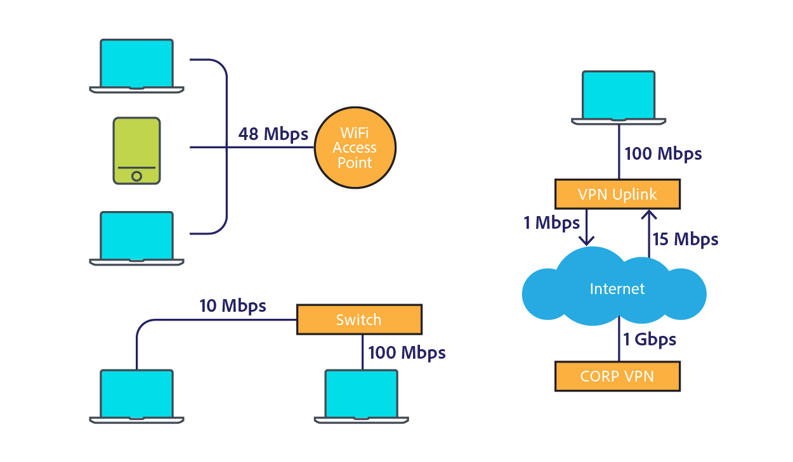

# [!DNL Assets] considerazioni sulla rete {#assets-network-considerations}

Comprendere la rete è importante quanto comprendere [!DNL Adobe Experience Manager Assets]. La rete può influenzare le esperienze di caricamento, download e utilizzo. La creazione di diagrammi della topologia di rete consente di identificare i punti di interruzione e le aree sottoottimizzate della rete che è necessario correggere per migliorare le prestazioni della rete e l&#39;esperienza utente.

Assicurarsi di includere quanto segue nel diagramma di rete:

* Connettività dal dispositivo client (ad esempio computer, dispositivi mobili e tablet) alla rete.
* Topologia della rete aziendale.
* Collegamento a Internet dalla rete aziendale e dall&#39;ambiente [!DNL Experience Manager].
* Topologia dell&#39;ambiente [!DNL Experience Manager].
* Definire i consumer simultanei dell&#39;interfaccia di rete [!DNL Experience Manager].
* Flussi di lavoro definiti della distribuzione [!DNL Experience Manager].

## Connettività dal dispositivo client alla rete aziendale {#connectivity-from-the-client-device-to-the-corporate-network}

Iniziare creando un diagramma della connettività tra i singoli dispositivi client e la rete aziendale. In questa fase, identifica le risorse condivise, come le connessioni WiFi, in cui più utenti accedono allo stesso punto o switch Ethernet per caricare e scaricare le risorse.

I dispositivi client si connettono alla rete aziendale in vari modi, ad esempio WiFi condiviso, Ethernet a uno switch condiviso e VPN. Identificare e comprendere i punti di scelta in questa rete è importante per la pianificazione di [!DNL Assets] e per modificare la rete.

Nella parte superiore sinistra del diagramma, tre dispositivi sono rappresentati come se condividessero un punto di accesso WiFi a 48 Mbps. Se tutti i dispositivi vengono caricati contemporaneamente, la larghezza di banda della rete WiFi viene condivisa tra i dispositivi. Rispetto al sistema nel suo complesso, un utente può incontrare un punto di soffocamento diverso per i tre clienti su questo canale diviso.

È difficile misurare la velocità effettiva di una rete WiFi perché un dispositivo lento può influire su altri client nel punto di accesso. Se prevedi di utilizzare WiFi per le interazioni tra risorse, esegui un test di velocità da più client simultaneamente per valutare la velocità effettiva.

In basso a sinistra nel diagramma sono illustrati due dispositivi collegati alla rete aziendale attraverso canali indipendenti. Pertanto, ogni dispositivo può disporre di una velocità minima di 10 Mbps e 100 Mbps.

Il computer visualizzato a destra ha un limite a monte rispetto alla rete aziendale su una VPN con una velocità di 1 Mbps. L&#39;esperienza utente per la connessione a 1 Mbps è molto diversa da quella per la connessione a 1 Gbps. A seconda delle dimensioni delle risorse con cui gli utenti interagiscono, il collegamento uplink VPN potrebbe non essere adeguato per l’attività.

## Topologia della rete aziendale {#topology-of-the-corporate-network}

Il diagramma mostra una velocità di uplink più elevata all&#39;interno della rete aziendale rispetto a quella generalmente utilizzata. Queste pipe sono risorse condivise. Se si prevede che lo switch condiviso gestisca 50 client, è possibile che si tratti di un punto di blocco. Nel diagramma iniziale solo due computer condividono la connessione specifica.

## Collegamento a Internet dalla rete aziendale e dall&#39;ambiente [!DNL Experience Manager] {#uplink-to-the-internet-from-the-corporate-network-and-aem-environment}

È importante considerare fattori sconosciuti su Internet e sulla connessione VPC perché la larghezza di banda su Internet può essere compromessa a causa di picchi di carico o interruzioni su larga scala del provider. In generale, la connettività Internet è affidabile. Tuttavia, a volte può introdurre punti di soffocamento.

Nell&#39;uplink da una rete aziendale a Internet, ci possono essere altri servizi che utilizzano la larghezza di banda. È importante comprendere la quantità di larghezza di banda che può essere dedicata o assegnata a Assets. Ad esempio, se un collegamento a 1 Gb/s è già utilizzato all&#39;80%, è possibile allocare solo un massimo del 20% della larghezza di banda per [!DNL Experience Manager Assets].

Anche i firewall e i proxy aziendali possono modellare la larghezza di banda in molti modi diversi. Questo tipo di dispositivo può assegnare la priorità alla larghezza di banda utilizzando la qualità del servizio, le limitazioni della larghezza di banda per utente o le limitazioni del bitrate per host. Questi sono punti di scelta importanti da esaminare in quanto possono avere un impatto significativo sull&#39;esperienza utente di [!DNL Assets].

In questo esempio, l’azienda dispone di un uplink a 10 Gb/s. Dovrebbe essere abbastanza grande per diversi clienti. Inoltre, il firewall impone un limite di frequenza host di 10 Mbps. Questa limitazione può potenzialmente limitare il traffico a un singolo host a 10 Mbps, anche se l&#39;uplink a Internet è a 10 Gbps.

Questo è il più piccolo punto di soffocamento orientato al cliente. Tuttavia, è possibile valutare una modifica o configurare un elenco Consentiti con il gruppo di operazioni di rete responsabile di questo firewall.

Dai diagrammi di esempio si può concludere che sei dispositivi condividono un canale concettuale di 10 Mbps. A seconda delle dimensioni delle risorse utilizzate, questo valore potrebbe non essere adeguato a soddisfare le aspettative degli utenti.

## Topologia dell&#39;ambiente [!DNL Experience Manager] {#topology-of-the-aem-environment}

La progettazione della topologia dell&#39;ambiente [!DNL Experience Manager] richiede una conoscenza dettagliata della configurazione del sistema e del modo in cui la rete è connessa all&#39;interno dell&#39;ambiente utente.

Lo scenario di esempio include una farm di pubblicazione con cinque server, un archivio binario S3 e Dynamic Medie configurato.

Dispatcher condivide la connessione a 100 Mbps con due entità, il mondo esterno e la distribuzione [!DNL Experience Manager]. Per operazioni di caricamento e download simultanee, è necessario dividere questo numero per due. Lo storage esterno collegato utilizza una connessione separata.

La distribuzione di [!DNL Experience Manager] condivide la connessione a 1 Gb/s con più servizi. Dal punto di vista della topologia di rete, è equivalente alla condivisione di un singolo canale con servizi diversi.

Esaminando la rete dal dispositivo client alla distribuzione [!DNL Experience Manager], il punto di interruzione più piccolo sembra essere la limitazione del firewall aziendale a 10 Mbit. È possibile utilizzare questi valori nel calcolatore di dimensionamento nella [Guida al dimensionamento di Assets](assets-sizing-guide.md) per determinare l&#39;esperienza utente.

## Flussi di lavoro definiti della distribuzione [!DNL Experience Manager] {#defined-workflows-of-the-aem-deployment}

Quando si considerano le prestazioni di rete, può essere importante considerare i flussi di lavoro e la pubblicazione che si verificheranno nel sistema. Inoltre, S3 o altri sistemi di storage collegati alla rete utilizzati e richieste di I/O utilizzano la larghezza di banda della rete. Pertanto, anche in una rete completamente ottimizzata, le prestazioni possono essere limitate dall&#39;I/O del disco.

Per semplificare i processi relativi all’acquisizione delle risorse (in particolare quando si caricano numerose risorse), esplora i flussi di lavoro delle risorse e scopri di più sulla loro configurazione.

Durante la valutazione della topologia del flusso di lavoro interno, è necessario analizzare quanto segue:

* Procedure per la scrittura di una risorsa
* Flussi di lavoro/eventi che si attivano quando la risorsa o i metadati vengono modificati
* Procedure per la lettura di una risorsa

Di seguito sono riportati alcuni elementi da considerare:

* Lettura/scrittura di metadati XMP
* Attivazione e replica automatiche
* Filigrana
* Acquisizione di risorse secondarie/estrazione di pagina
* Sovrapposizione dei flussi di lavoro.

Di seguito è riportato un esempio di cliente per la definizione di un flusso di lavoro per risorse.

