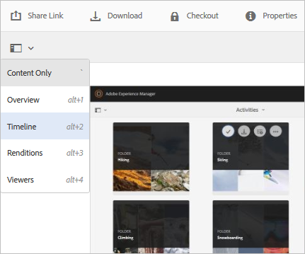

# Elaborare risorse digitali {#process-assets}

[!DNL Adobe Experience Manager Assets] consente di lavorare sulle risorse digitali in molti modi per consentire un’elaborazione affidabile delle risorse. Puoi utilizzare i metodi di elaborazione predefiniti o personalizzati per garantire il completamento completo dei processi aziendali, i controlli e la conformità, l’individuazione e la distribuzione e la sanità di base delle risorse digitali. Puoi eseguire le attività di gestione delle risorse ottenendo la scalabilità e la personalizzazione richieste.

## Comprendere i flussi di lavoro {#understand-workflows}

Per l’elaborazione delle risorse, [!DNL Experience Manager] utilizza i flussi di lavoro. I flussi di lavoro consentono di automatizzare la logica o le attività di business. I passaggi granulari per eseguire attività specifiche sono forniti per impostazione predefinita e gli sviluppatori possono creare i propri passaggi personalizzati. Questi passaggi possono essere combinati in un ordine logico per creare flussi di lavoro. Ad esempio, un flusso di lavoro può applicare una filigrana alle immagini caricate in base a criteri specifici, come la cartella in cui vengono caricate, la risoluzione dell’immagine e così via. Un altro esempio è un flusso di lavoro configurato per applicare una filigrana e aggiungere contemporaneamente metadati, creare rappresentazioni, aggiungere tag intelligenti e pubblicare in un archivio dati.

## Flussi di lavoro predefiniti disponibili in [!DNL Experience Manager] {#default-workflows}

Per impostazione predefinita, tutte le risorse caricate vengono elaborate utilizzando [!UICONTROL Aggiorna risorsa DAM] flusso di lavoro. Il flusso di lavoro viene eseguito per ogni risorsa caricata ed esegue attività di base per la gestione delle risorse, come la generazione di rendering, il writeback dei metadati, l’estrazione della pagina, l’estrazione dei contenuti multimediali e la transcodifica.

Per visualizzare i vari modelli di flusso di lavoro disponibili per impostazione predefinita, consulta **[!UICONTROL Strumenti > Workflow > Modelli]** in [!DNL Experience Manager].

*Figura: Alcuni dei flussi di lavoro predefiniti disponibili in [!DNL Experience Manager].*

## Applicare i flussi di lavoro alle risorse di processo {#applying-workflows-to-assets}

L’applicazione dei flussi di lavoro alle risorse digitali è la stessa delle pagine del sito web. Per una guida completa sulla creazione e l’utilizzo dei flussi di lavoro, consulta [avviare i flussi di lavoro](/help/sites-authoring/workflows-participating.md).

Utilizza i flussi di lavoro nelle risorse digitali per attivare la risorsa o creare filigrane. Molti dei flussi di lavoro per le risorse vengono attivati automaticamente. Ad esempio, il flusso di lavoro che crea automaticamente una rappresentazione dopo la modifica di un’immagine viene automaticamente attivato.

>[!NOTE]
>
>Se un flusso di lavoro disponibile nell’interfaccia classica non è disponibile nell’interfaccia touch, ad esempio [!UICONTROL Richiesta di attivazione] e [!UICONTROL Richiesta di disattivazione], vedi [creare modelli di flusso di lavoro](/help/sites-developing/workflows-models.md#classic2touchui).

## Applicare un flusso di lavoro a una risorsa {#apply-a-workflow-to-an-asset}

<!-- 
TBD: Add animated GIF for these steps instead of all these screenshots.
-->
Per applicare un flusso di lavoro a una risorsa, effettua le seguenti operazioni:

1. Passa alla posizione della risorsa per la quale vuoi avviare un flusso di lavoro, quindi fai clic sulla risorsa per aprire la pagina della risorsa. Seleziona **[!UICONTROL Timeline]** per visualizzare la timeline.

   

1. Clic **[!UICONTROL Azioni]** in basso per aprire l’elenco delle azioni disponibili per la risorsa.

1. Clic **[!UICONTROL Avvia flusso di lavoro]** dall&#39;elenco.

1. In **[!UICONTROL Avvia flusso di lavoro]** , seleziona un modello di flusso di lavoro dall’elenco.

1. (Facoltativo) Specifica un titolo per il flusso di lavoro che possa essere utilizzato per fare riferimento all’istanza del flusso di lavoro.

   

1. Clic **[!UICONTROL Inizio]** e quindi fare clic su **[!UICONTROL Procedi]**. Ciascun passaggio del flusso di lavoro viene visualizzato nella timeline come un evento.

   

## Applicare un flusso di lavoro a più risorse {#applying-a-workflow-to-multiple-assets}

1. Dalla sezione [!DNL Assets] , passa alla posizione delle risorse per le quali vuoi avviare un flusso di lavoro e seleziona le risorse. Seleziona **[!UICONTROL Timeline]** per visualizzare la timeline.

   

1. Clic **[!UICONTROL Azioni]**  in basso.
1. Clic **[!UICONTROL Avvia flusso di lavoro]**. In **[!UICONTROL Avvia flusso di lavoro]** , seleziona un modello di flusso di lavoro dall’elenco.

   

1. (Facoltativo) Specifica un titolo per il flusso di lavoro, che può essere utilizzato per fare riferimento all’istanza del flusso di lavoro.
1. Nella finestra di dialogo, fai clic su **[!UICONTROL Avvia]**, quindi su **[!UICONTROL Conferma]**. Il flusso di lavoro viene eseguito su tutte le risorse selezionate.

## Applicare un flusso di lavoro a più cartelle {#applying-a-workflow-to-multiple-folders}

La procedura per applicare un flusso di lavoro a più cartelle è simile alla procedura per applicare un flusso di lavoro a più risorse. Seleziona le cartelle in [!DNL Assets] ed eseguire i passaggi da 2 a 7 della procedura [applicare un flusso di lavoro a più risorse](/help/assets/assets-workflow.md#applying-a-workflow-to-multiple-assets).

## Applicare un flusso di lavoro a una raccolta {#applying-a-workflow-to-a-collection}

Consulta [applicare un flusso di lavoro a una raccolta](/help/assets/manage-collections.md#running-a-workflow-on-a-collection).

## Avvia automaticamente un flusso di lavoro per elaborare le risorse in modo condizionale {#auto-execute-workflow-on-some-assets}

Gli amministratori possono configurare il flusso di lavoro per eseguire ed elaborare automaticamente le risorse in base a condizioni predefinite. Questa funzionalità è utile, ad esempio, per gli utenti e gli addetti al marketing della linea di business per creare un flusso di lavoro personalizzato su cartelle specifiche. Dì che tutte le risorse del servizio fotografico di un&#39;agenzia possono essere filigranate oppure tutte le risorse caricate da un freelance possono essere elaborate per creare rappresentazioni specifiche.

Per un modello di flusso di lavoro, gli utenti possono creare un modulo di avvio del flusso di lavoro che lo esegue. Un modulo di avvio dei flussi di lavoro monitora le modifiche nell’archivio dei contenuti ed esegue il flusso di lavoro quando vengono soddisfatte le condizioni predefinite. Gli amministratori possono fornire l’accesso agli addetti al marketing per creare i flussi di lavoro e configurare il modulo di avvio. Gli utenti possono modificare il valore predefinito [!UICONTROL Aggiorna risorsa DAM] per aggiungere i passaggi aggiuntivi necessari per elaborare risorse specifiche. Il flusso di lavoro viene eseguito su tutte le nuove risorse caricate. Per limitare l’esecuzione dei passaggi aggiuntivi su risorse specifiche, utilizza uno dei seguenti approcci:

* Crea una copia di [!UICONTROL Aggiorna risorsa DAM] e modificarlo per eseguirlo su una gerarchia di cartelle specifica. Questo approccio è utile per alcune cartelle.
* I passaggi di elaborazione aggiuntivi possono essere aggiunti utilizzando un’ [Divisione OR](/help/sites-developing/workflows-step-ref.md#or-split) come applicabile in modo condizionale a tutte le cartelle necessarie.

## Best practice e limitazioni {#best-practices-limitations-tips}

* Durante la progettazione dei flussi di lavoro, considera le tue esigenze per tutti i tipi di rendering. Se non prevedi la necessità di una rappresentazione in futuro, rimuovi il relativo passaggio di creazione dal flusso di lavoro. Non è possibile eliminare le rappresentazioni in blocco in un secondo momento. Le rappresentazioni indesiderate possono occupare molto spazio di archiviazione dopo un uso prolungato di [!DNL Experience Manager]. Per le singole risorse, puoi rimuovere manualmente le rappresentazioni dall’interfaccia utente. Per più risorse, puoi personalizzare [!DNL Experience Manager] per eliminare rappresentazioni specifiche o eliminare le risorse e caricarle nuovamente.
* Per impostazione predefinita, [!UICONTROL Aggiorna risorsa DAM] il flusso di lavoro include alcuni passaggi per creare miniature e rappresentazioni web. Se vengono rimosse dal flusso di lavoro le rappresentazioni predefinite, l’interfaccia utente di [!DNL Assets] non esegue correttamente il rendering.

>[!MORELIKETHIS]
>
>* [Applicare e partecipare ai flussi di lavoro](/help/sites-authoring/workflows.md)
>* [Creare modelli di flusso di lavoro ed estendere le funzionalità del flusso di lavoro](/help/sites-developing/workflows.md)
>* [Metodi per eseguire i flussi di lavoro](/help/sites-administering/workflows-starting.md)
>* [Best practice per i flussi di lavoro](/help/sites-developing/workflows-best-practices.md)
