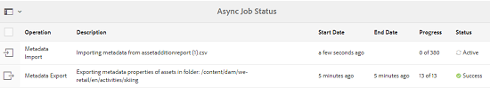
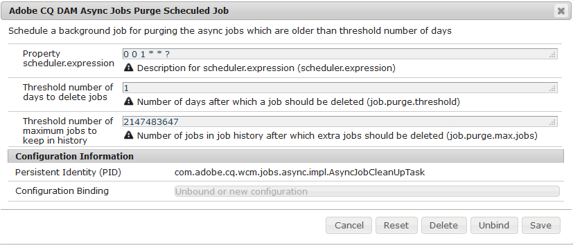

# Operazioni asincrone {#asynchronous-operations}

Per ridurre l’impatto negativo sulle prestazioni, [!DNL Adobe Experience Manger Assets] elabora in modo asincrono alcune operazioni di risorse a lungo termine e che richiedono risorse. L&#39;elaborazione asincrona comporta l&#39;accodamento di più attività e la loro esecuzione in modo seriale, in base alla disponibilità di risorse di sistema. Tali operazioni comprendono:

* Eliminazione di molte risorse.
* Spostamento di molte risorse o risorse con molti riferimenti.
* Esportazione e importazione in massa dei metadati delle risorse.
* Recupero di risorse da una [!DNL Experience Manager] distribuzione remota, che superano un limite di soglia impostato. Il limite riguarda il numero di risorse.

Potete visualizzare lo stato delle attività asincrone dalla pagina Stato **[!UICONTROL processo]** asincrono.

>[!NOTE]
>
>Per impostazione predefinita, le [!DNL Assets] attività vengono eseguite in parallelo. Se `N` è il numero di core CPU, per impostazione predefinita `N/2` le attività possono essere eseguite in parallelo. Per utilizzare le impostazioni personalizzate per la coda delle attività, modificare la configurazione della coda **[!UICONTROL predefinita dell&#39;operazione]** Async dalla console Web. Per ulteriori informazioni, consultate [Configurazione](https://sling.apache.org/documentation/bundles/apache-sling-eventing-and-job-handling.html#queue-configurations)della coda.

## Monitorare lo stato delle operazioni asincrone {#monitoring-the-status-of-asynchronous-operations}

Ogni volta che [!DNL Assets] elabora un&#39;operazione in modo asincrono, riceverete una notifica nella [!DNL Experience Manager] Casella in entrata  e tramite e-mail. Per visualizzare nel dettaglio lo stato delle operazioni asincrone, andate alla pagina Stato **[!UICONTROL processo]** asincrono.

1. Nell’ [!DNL Experience Manager] interfaccia fate clic su **[!UICONTROL Operazioni]** > **[!UICONTROL Processi]**.

1. Nella pagina Stato **[!UICONTROL processo]** asincrono, controllate i dettagli delle operazioni.

   

   Per verificare l&#39;avanzamento di un&#39;operazione, vedere la colonna **[!UICONTROL Stato]** . A seconda dell’avanzamento, viene visualizzato uno dei seguenti stati:

   * **[!UICONTROL Attivo]**: Elaborazione dell&#39;operazione in corso.
   * **[!UICONTROL Successo]**: Operazione completata.
   * **[!UICONTROL Fail]** or **[!UICONTROL Error]** (Non riuscito o errore): impossibile elaborare l’operazione.
   * **[!UICONTROL Pianificato]**: L&#39;elaborazione dell&#39;operazione è pianificata per un momento successivo.

1. Per interrompere un&#39;operazione attiva, selezionatela dall&#39;elenco e fate clic sull&#39;icona **[!UICONTROL Interrompi]**  nella barra degli strumenti.

1. Per visualizzare ulteriori dettagli, ad esempio la descrizione e i registri, selezionate l’operazione e fate clic su **[!UICONTROL Open]**  nella barra degli strumenti. Viene visualizzata la pagina dei dettagli dell’attività.

   

1. Per eliminare l&#39;operazione dall&#39;elenco, selezionare **[!UICONTROL Elimina]** dalla barra degli strumenti. Per scaricare i dettagli in un file CSV, fate clic su **[!UICONTROL Scarica]**.

   >[!NOTE]
   >
   >Non è possibile eliminare un&#39;attività se il suo stato è attivo o in coda.

## Rimozione delle attività completate {#purge-completed-tasks}

[!DNL Experience Manager Assets] esegue un&#39;attività di eliminazione ogni giorno alle 0100 ore per eliminare le attività asincrone completate di oltre un giorno.

<!-- TBD: Find out from the engineering team and mention the time zone of this 1:00 am task.
-->

È possibile modificare la pianificazione per l&#39;attività di eliminazione e la durata per la quale i dettagli delle attività completate vengono conservati prima di essere eliminati. È inoltre possibile configurare il numero massimo di attività completate per le quali i dettagli vengono conservati in qualsiasi momento.

1. Nell&#39; [!DNL Experience Manager] interfaccia fare clic su **[!UICONTROL Strumenti]** > **[!UICONTROL Operazioni]** > Console **** Web.
1. Aprite l’attività **[!UICONTROL Adobe CQ DAM Async Jobs Purge Scheduled]** (Rimozione processi asincrono Adobe CQ DAM).
1. Specificare la soglia del numero di giorni dopo i quali le attività completate vengono eliminate e il numero massimo di attività per le quali i dettagli vengono conservati nella cronologia. Salva le modifiche.

   

## Configurare la soglia per le operazioni di eliminazione asincrone {#configure-thresholds-for-asynchronous-delete-operations}

Se il numero di risorse o cartelle da eliminare supera la soglia impostata, l’operazione di eliminazione viene eseguita in modo asincrono.

1. Nell&#39; [!DNL Experience Manager] interfaccia fare clic su **[!UICONTROL Strumenti]** > **[!UICONTROL Operazioni]** > Console **** Web.
1. Dalla console Web, aprite la configurazione **[!UICONTROL Async Delete Operation Processing]** .
1. Nella casella **[!UICONTROL Soglia numero di risorse]** , specificate i numeri di soglia per eliminare in modo asincrono risorse, cartelle o riferimenti. Salva le modifiche.

   

## Configurare la soglia per le operazioni di spostamento asincrone {#configure-thresholds-for-asynchronous-move-operations}

Se il numero di risorse, cartelle o riferimenti da spostare supera il numero di soglia impostato, l&#39;operazione di spostamento viene eseguita in modo asincrono.

1. Nell&#39; [!DNL Experience Manager] interfaccia, fare clic su **[!UICONTROL Strumenti]** > **[!UICONTROL Operazioni]** > Console **** Web.
1. Dalla console Web, aprite la configurazione **[!UICONTROL Async Move Operation Processing]** .
1. Nella casella **[!UICONTROL Soglia numero di risorse/riferimenti]** , specificate i numeri di soglia per spostare in modo asincrono risorse, cartelle o riferimenti. Salva le modifiche.

   

>[!MORELIKETHIS]
>
>* [Configurare l’e-mail in  Experience Manager](/help/sites-administering/notification.md).
>* [Importare ed esportare i metadati delle risorse in blocco](/help/assets/metadata-import-export.md).
>* [Utilizza le risorse collegate per condividere le risorse DAM da distribuzioni](/help/assets/use-assets-across-connected-assets-instances.md)remote.

