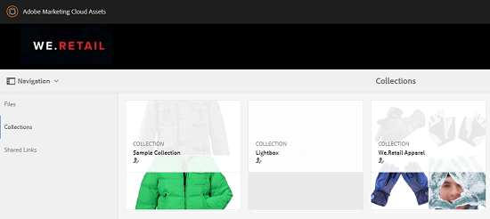

# Pubblicare raccolte su Brand Portal {#publish-collections-to-brand-portal}

In qualità di amministratore di Adobe Experience Manager (AEM) Assets, puoi pubblicare le raccolte nell’istanza di AEM Assets Brand Portal per la tua organizzazione. Tuttavia, devi prima integrare AEM Assets con Brand Portal. Per ulteriori dettagli, consulta [Configurare AEM Assets con Brand Portal](/help/assets/configure-aem-assets-with-brand-portal.md).

Se apporti successive modifiche alla raccolta originale in AEM Assets, tali modifiche non verranno applicate in Brand Portal fino a quando non pubblichi nuovamente la raccolta. Questa caratteristica assicura che le modifiche in corso d’opera non siano disponibili in Brand Portal. Solo le modifiche approvate pubblicate da un amministratore sono infatti disponibili in Brand Portal.

>[!NOTE]
>
>I frammenti di contenuto non possono essere pubblicati su Brand Portal. Pertanto, se selezioni frammenti di contenuto in AEM Author, **Pubblica su Brand Portal** azione non disponibile.
>
>Se le raccolte contenenti frammenti di contenuto vengono pubblicate da AEM Author in Brand Portal, tutti i contenuti della cartella, ad eccezione dei frammenti di contenuto, vengono replicati nell’interfaccia di Brand Portal.

## Pubblicare una raccolta in Brand Portal {#publish-a-collection-to-brand-portal}

1. Nell’interfaccia utente di AEM Assets, fai clic sul logo AEM.
1. Dalla pagina **Navigazione**, passa a **Risorse > Raccolte**.
1. Dalla console Raccolte, seleziona la raccolta da pubblicare su Brand Portal.

   

1. Dalla barra degli strumenti, fai clic su **Pubblica su Brand Portal**.
1. Nella finestra di dialogo di conferma, fai clic su **Pubblica**.
1. Chiudi il messaggio di conferma.
1. Accedi a Brand Portal come amministratore. La raccolta pubblicata è disponibile nella console Raccolte.

   

## Annullare la pubblicazione delle raccolte {#unpublish-collections}

Puoi annullare la pubblicazione delle raccolte pubblicate da AEM Assets in Brand Portal. Dopo l’annullamento della pubblicazione della raccolta originale, la relativa copia non è più disponibile per gli utenti di Brand Portal.

1. Dalla console Raccolte dell’istanza di AEM Assets, seleziona la raccolta di cui vuoi annullare la pubblicazione.

   

1. Dalla barra degli strumenti, fai clic sull’icona **Rimuovi da Brand Portal**.
1. Nella finestra di dialogo, fai clic su **Annulla pubblicazione**.
1. Chiudi il messaggio di conferma. La raccolta viene rimossa dall’interfaccia di Brand Portal.
