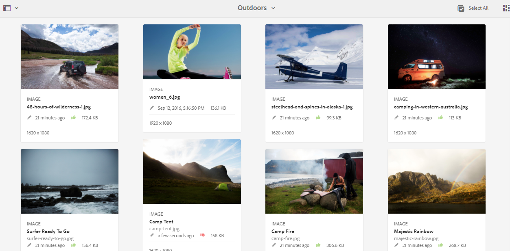

# Esaminare raccolte e risorse delle cartelle {#review-folder-assets-and-collections}

| Versione | Collegamento articolo |
| -------- | ---------------------------- |
| AEM as a Cloud Service | [Fai clic qui](https://experienceleague.adobe.com/docs/experience-manager-cloud-service/content/assets/manage/bulk-approval.html?lang=it) |
| AEM 6.5 | Questo articolo |

Imposta i flussi di lavoro di revisione per le risorse all’interno di una cartella o di una raccolta e condividili con i revisori o i partner creativi per ottenere un feedback.

[!DNL Adobe Experience Manager Assets] consente di impostare un flusso di lavoro di revisione ad hoc per le risorse all&#39;interno di una cartella o raccolta e di condividerlo con revisori o partner creativi per richiedere un feedback.

È possibile associare il flusso di lavoro di revisione a un progetto o creare un&#39;attività di revisione indipendente.

Dopo aver condiviso le risorse, i revisori possono approvarle o rifiutarle. Le notifiche vengono inviate in varie fasi del flusso di lavoro per notificare ai destinatari interessati il completamento di varie attività. Ad esempio, quando si condivide una cartella o una raccolta, il revisore riceve una notifica che indica che una cartella o una raccolta è stata condivisa per la revisione.

Al termine della revisione (approvazione o rifiuto delle risorse), il revisore riceve una notifica di completamento della revisione.

## Creare un&#39;attività di revisione per le cartelle {#creating-a-review-task-for-folders}

1. Dall&#39;interfaccia utente [!DNL Assets], selezionare la cartella per la quale si desidera creare un&#39;attività di revisione.
1. Dalla barra degli strumenti, fare clic su **[!UICONTROL Crea attività di revisione]**  per aprire la pagina **[!UICONTROL Attività di revisione]**. Se l&#39;opzione non è visibile nella barra degli strumenti, fare clic su **[!UICONTROL Altro]** e quindi selezionare l&#39;opzione.

1. (Facoltativo) Dall&#39;elenco **[!UICONTROL Progetto]**, selezionare il progetto a cui si desidera associare l&#39;attività di revisione. Per impostazione predefinita, l&#39;opzione **[!UICONTROL Nessuno]** è selezionata. Se non si desidera associare alcun progetto all&#39;attività di revisione, mantenere questa selezione.

   >[!NOTE]
   >
   >Nell&#39;elenco **[!UICONTROL Progetti]** sono visibili solo i progetti per i quali si dispone di autorizzazioni a livello di editor o superiori.

1. Immettere un nome per l&#39;attività di revisione e selezionare un approvatore dall&#39;elenco **[!UICONTROL Assegna a]**.

   >[!NOTE]
   >
   >I membri/gruppi del progetto selezionato sono disponibili come approvatori nell&#39;elenco **[!UICONTROL Assegna a]**.

1. Immettere una descrizione, la priorità del task e la data di scadenza del task di revisione.

   

1. Nella scheda Avanzate, immetti un’etichetta da utilizzare per creare l’URI.

   

1. Fai clic su **[!UICONTROL Invia]**, quindi fai clic su **[!UICONTROL Fine]** per chiudere il messaggio di conferma. Una notifica per la nuova attività viene inviata al responsabile approvazione.
1. Accedere a [!DNL Assets] come Approvatore e passare all&#39;interfaccia utente [!DNL Assets]. Per approvare le risorse, fai clic su **[!UICONTROL Notifiche]**, quindi seleziona l&#39;attività di revisione dall&#39;elenco.

   

1. Nella pagina **[!UICONTROL Rivedi attività]**, esamina i dettagli dell&#39;attività di revisione, quindi fai clic su **[!UICONTROL Rivedi]**.
1. Nella pagina **[!UICONTROL Rivedi attività]**, seleziona le risorse e fai clic su **[!UICONTROL Approva/Rifiuta]** per approvare o rifiutare, a seconda delle necessità.

   

1. Fai clic su **[!UICONTROL Completa]** nella barra degli strumenti. Nella finestra di dialogo, immetti un commento e fai clic su **[!UICONTROL Completa]** per confermare.
1. Passare all&#39;interfaccia utente [!DNL Assets] e aprire la cartella. Le icone dello stato di approvazione per le risorse vengono visualizzate nella vista a schede e nella vista a elenco.

   **Vista a schede**

   

   **Vista a elenco**

   

## Creare un’attività di revisione per le raccolte {#creating-a-review-task-for-collections}

1. Nella pagina Raccolte selezionare la raccolta per la quale si desidera creare un task di revisione.
1. Dalla barra degli strumenti, fare clic su **[!UICONTROL Crea attività di revisione]**  per aprire la pagina **[!UICONTROL Attività di revisione]**. Se l&#39;opzione non è visibile sulla barra degli strumenti, fare clic su **[!UICONTROL Altro]** e quindi selezionare l&#39;opzione.

1. (Facoltativo) Dall&#39;elenco **[!UICONTROL Progetto]**, selezionare il progetto a cui si desidera associare l&#39;attività di revisione. Per impostazione predefinita, l&#39;opzione **[!UICONTROL Nessuno]** è selezionata. Se non si desidera associare alcun progetto all&#39;attività di revisione, mantenere questa selezione.

   >[!NOTE]
   >
   >Nell&#39;elenco **[!UICONTROL Progetti]** sono visibili solo i progetti per i quali si dispone di autorizzazioni a livello di editor o superiori.

1. Immettere un nome per l&#39;attività di revisione e selezionare un approvatore dall&#39;elenco **[!UICONTROL Assegna a]**.

   >[!NOTE]
   >
   >I membri/gruppi del progetto selezionato sono disponibili come approvatori nell&#39;elenco **[!UICONTROL Assegna a]**.

1. Immettere una descrizione, la priorità del task e la data di scadenza del task di revisione.

   

1. Fai clic su **[!UICONTROL Invia]**, quindi fai clic su **[!UICONTROL Fine]** per chiudere il messaggio di conferma. Una notifica per la nuova attività viene inviata al responsabile approvazione.
1. Accedere a [!DNL Assets] come Approvatore e passare alla console [!DNL Assets]. Per approvare le risorse, fai clic su **[!UICONTROL Notifiche]**, quindi seleziona l&#39;attività di revisione dall&#39;elenco.
1. Nella pagina **[!UICONTROL Rivedi attività]**, esamina i dettagli dell&#39;attività di revisione, quindi fai clic su **[!UICONTROL Rivedi]**.
1. Tutte le risorse della raccolta sono visibili nella pagina di revisione. Seleziona le risorse e fai clic su **[!UICONTROL Approva/Rifiuta]** per approvare o rifiutare le risorse, a seconda delle necessità.

   

1. Fai clic su **[!UICONTROL Completa]** nella barra degli strumenti. Nella finestra di dialogo, immetti un commento e fai clic su **[!UICONTROL Completa]** per confermare.
1. Passa alla console Raccolte e apri la raccolta. Le icone dello stato di approvazione per le risorse vengono visualizzate sia nella vista a schede che in quella a elenco.

   

   *Figura: vista a schede.*

   

   *Figura: Vista a elenco.*
