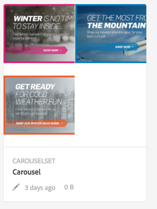

# Banner a carosello{#carousel-banners}

I banner a carosello consentono agli addetti al marketing di guidare la conversione creando facilmente contenuti promozionali interattivi rotanti e consegnandoli a qualsiasi schermo.

La creazione e la modifica dei contenuti contenuti contenuti nei banner promozionali può richiedere molto tempo, limitando la possibilità di pubblicare rapidamente nuovi contenuti o renderli più mirati. I banner a carosello consentono di creare o modificare rapidamente i banner rotanti, aggiungere interattività quali punti attivi collegati ai dettagli del prodotto o alle risorse correlate e consegnarli a qualsiasi schermo, consentendo di introdurre nuovi contenuti promozionali sul mercato più rapidamente.

I banner a carosello sono contrassegnati da un banner con la parola **[!UICONTROL CAROUSELSET]**:

Sul sito web, un banner a carosello può essere visualizzato come segue:

Qui puoi navigare tra le immagini (facendo clic sui numeri). Inoltre, le diapositive ruotano automaticamente in base a un intervallo di tempo personalizzabile. Le immagini aggiunte nel banner carosello supportano sia punti attivi che mappe immagine, dove gli utenti possono toccare o passare a un collegamento ipertestuale o accedere a una finestra di visualizzazione rapida.

In questo esempio, un utente ha toccato o fatto clic su una mappa immagine per accedere alla finestra di visualizzazione rapida dei guanti:

## Guarda come vengono creati i banner a carosello {#watch-how-carousel-banners-are-created}

Guarda una procedura dettagliata di 10 minuti e 33 secondi su [come vengono creati i banner a carosello](https://s7d5.scene7.com/s7viewers/html5/VideoViewer.html?videoserverurl=https://s7d5.scene7.com/is/content/&amp;emailurl=https://s7d5.scene7.com/s7/emailFriend&amp;serverUrl=https://s7d5.scene7.com/is/image/&amp;config=Scene7SharedAssets/Universal_HTML5_Video_social&amp;contenturl=https://s7d5.scene7.com/skins/&amp;asset=S7tutorials/InteractiveCarouselBanner). Scoprirai anche come visualizzare in anteprima, modificare e distribuire banner a carosello.

>[!NOTE]
>
>Per poter creare o modificare i banner carosello, è necessario aggiungere utenti non amministratori al gruppo **[!UICONTROL dam-users]** . In caso di problemi durante la creazione o la modifica, rivolgiti all&#39;amministratore di sistema che può aggiungerti al gruppo **[!UICONTROL dam-users]** .

## Avvio rapido: Banner a carosello {#quick-start-carousel-banners}

Per farti iniziare a lavorare velocemente:

1. [Identificare le variabili di punti attivi e mappe immagine](#identifying-hotspot-and-image-map-variables)  (solo per i clienti che utilizzano AEM Assets + Dynamic Media)

   Per iniziare, identifica le variabili dinamiche utilizzate dall’implementazione della visualizzazione rapida esistente in modo da poter inserire correttamente i punti attivi e i dati della mappa immagine durante il processo di creazione del banner carosello in AEM Assets.

   >[!NOTE]
   >
   >Se sei un cliente AEM Sites o Ecommerce, puoi utilizzare la funzione integrata per passare alle pagine dei prodotti e cercare lo SKU esistente nel catalogo dei prodotti. Non è necessario immettere manualmente le variabili punto attivo o mappa immagine. Consulta le informazioni sulla [configurazione di eCommerce](/help/sites-administering/generic.md).
   >
   >
   >Se sei un cliente di AEM Assets e Dynamic Media, immetti manualmente i dati per gli hotspot e le mappe immagine, e quindi integra l’URL pubblicato o il codice da incorporare con il tuo sistema di gestione dei contenuti di terze parti.

1. Facoltativo: se necessario, [crea un predefinito visualizzatore per set carosello](/help/assets/managing-viewer-presets.md).

   Gli amministratori possono personalizzare il comportamento e l’aspetto del carosello creando un proprio predefinito per visualizzatori Carosello. Il vantaggio principale è che puoi riutilizzare questo predefinito visualizzatore personalizzato per più caroselli. Tuttavia, gli utenti possono anche personalizzare direttamente il comportamento e l’aspetto del carosello durante la creazione del carosello. Questo è l’approccio preferito quando si desidera una progettazione molto specifica per un determinato carosello.

1. [Carica un banner immagine](#uploading-image-banners).

   Carica i banner immagine che desideri rendere interattivi.

1. [Crea un set carosello](#creating-carousel-sets).

   In Set caroselli, gli utenti navigano tra le immagini dei banner e toccano punti attivi o mappe immagine per accedere ai contenuti pertinenti.

   Per creare un set carosello all’interno di Assets, tocca **[!UICONTROL Crea]**, quindi seleziona **[!UICONTROL Set carosello.]** Aggiungi le risorse alle diapositive e tocca **[!UICONTROL Salva.]** Inoltre, puoi modificare l’aspetto e il comportamento del carosello direttamente nell’editor.

1. [Aggiungi punti attivi o mappe immagine a un banner immagine.](#adding-hotspots-or-image-maps-to-an-image-banner)

   Aggiungi uno o più punti attivi o mappe immagine a un banner immagine e associali ciascuno di essi a un&#39;azione come un collegamento, una visualizzazione rapida o un frammento esperienza. Dopo aver aggiunto punti attivi o mappe immagine, finisci questa attività pubblicando il set carosello. La pubblicazione crea il codice di incorporamento che puoi utilizzare per copiare e applicare alla pagina di destinazione del tuo sito web.

   Consulta [(Facoltativo) Anteprima dei banner carosello](#optional-previewing-carousel-banners) - Facoltativo. Se lo desideri, puoi visualizzare una rappresentazione del set carosello e verificarne l’interattività.

1. [Pubblicare Banner Carosello.](#publishing-carousel-banners)

   Puoi pubblicare un set carosello come faresti con una risorsa. In Assets, passa al set carosello e selezionalo, quindi tocca **[!UICONTROL Pubblica.]** La pubblicazione di un set carosello attiva l’URL e la stringa di incorporamento.

1. Effettua una delle operazioni seguenti:

   * [Aggiungi un banner carosello alla ](#adding-a-carousel-banner-to-your-website-page) pagina del sito webPuoi aggiungere l’URL del banner carosello o il codice da incorporare copiato nella pagina del sito web.

      * [Integra il banner carosello con una Quickview](#integrating-the-carousel-banner-with-an-existing-quickview) esistente. Se utilizzi un sistema di gestione dei contenuti web di terze parti, dovrai integrare il nuovo banner carosello con l’implementazione Quickview esistente sul sito web.
   * [Aggiungi un banner carosello al tuo sito web in ](/help/assets/adding-dynamic-media-assets-to-pages.md) AEMIse sei un cliente AEM Sites puoi aggiungere il set carosello direttamente alla pagina in AEM, utilizzando il componente File multimediali interattivi .

Per modificare i set carosello, consulta [modifica di set carosello .](#editing-carousel-sets) Inoltre, puoi visualizzare e modificare le proprietà del set  [carosello](manage-assets.md#editing-properties).

## Identificazione delle variabili dei punti attivi e delle mappe immagine {#identifying-hotspot-and-image-map-variables}

Per iniziare, identifica le variabili dinamiche utilizzate dall’implementazione della visualizzazione rapida esistente in modo da poter inserire correttamente i punti attivi o i dati della mappa immagine durante il processo di creazione del set carosello in AEM Assets.

Quando aggiungi punti attivi o mappe immagine a un&#39;immagine banner in AEM Assets, devi assegnare un SKU e variabili aggiuntive facoltative a ogni punto attivo o mappa immagine. Tali variabili vengono utilizzate in seguito per far corrispondere hotspot o mappe immagine con contenuto di visualizzazione rapida.

>[!NOTE]
>
>Se sei un cliente AEM Sites e/o AEM e-commerce, salta questo passaggio. Non è necessario identificare manualmente le variabili dei punti attivi o delle mappe immagine; puoi utilizzare l’integrazione con e-commerce per l’integrazione dei prodotti. Consulta le informazioni sulla [configurazione di eCommerce](/help/sites-administering/generic.md). Inoltre, puoi utilizzare il componente interattivo e aggiungerlo alla pagina web.
>
>Se sei un cliente AEM Assets o Media, pubblica l’URL o il codice da incorporare e poi ti integra con il tuo sistema di gestione dei contenuti di terze parti e individua manualmente gli hotspot e le mappe immagine.

È importante identificare in modo appropriato il numero e il tipo di variabili da associare ai dati del punto attivo o della mappa immagine. Ogni punto attivo o mappa immagine aggiunta a un&#39;immagine del banner deve contenere informazioni sufficienti per identificare in modo non ambiguo il prodotto nel sistema di back-end esistente. Allo stesso tempo, ogni punto attivo o mappa immagine non deve includere più dati del necessario. Questo perché renderebbe il processo di immissione dei dati eccessivamente complesso e la gestione continua dei punti attivi o delle mappe immagine più soggetta a errori.

Esistono diversi modi per identificare un set di variabili da utilizzare per i dati dei punti attivi o delle mappe immagine.

A volte può essere sufficiente consultare gli specialisti IT responsabili dell&#39;implementazione della visualizzazione rapida esistente, in quanto è probabile che sappiano quale sia il set minimo di dati necessari per identificare la visualizzazione rapida nel sistema. Tuttavia, nella maggior parte dei casi è anche possibile analizzare semplicemente il comportamento esistente del codice front-end.

La maggior parte delle implementazioni di visualizzazioni rapide utilizza il seguente paradigma:

* L’utente attiva un elemento dell’interfaccia utente sul sito web. Ad esempio, questo accade quando tocca un pulsante **[!UICONTROL Quick View (Visualizzazione rapida)]**.
* Il sito web invia una richiesta Ajax al backend per caricare i dati o il contenuto della visualizzazione rapida, se necessario.
* I dati di visualizzazione rapida vengono tradotti nel contenuto in preparazione al rendering sulla pagina web.
* Infine, il codice front-end esegue il rendering visivo di tali contenuti sullo schermo.

L’approccio consiste quindi nel visitare diverse aree del sito web esistente in cui è implementata la funzione di visualizzazione rapida, attivare la visualizzazione rapida e acquisire l’URL Ajax inviato dalla pagina web per caricare i dati o il contenuto della visualizzazione rapida.

Normalmente non è necessario utilizzare strumenti di debug specializzati. I browser web moderni dispongono di ispettori web che svolgono un lavoro adeguato. Di seguito sono riportati alcuni esempi di browser web che includono ispettori web:

* Per visualizzare tutte le richieste HTTP in uscita in Google Chrome, premi F12 (Windows) o Comando-Opzione-I (Mac) per aprire il pannello Strumenti per sviluppatori, quindi tocca la scheda Rete.
* In Firefox, è possibile attivare il plug-in Firebug premendo F12 (Windows) o Comando-Opzione-I (Mac) e utilizzando la relativa scheda Net, oppure è possibile utilizzare lo strumento integrato Inspector e la relativa scheda Rete.

Quando il monitoraggio di rete è attivato nel browser, attiva la visualizzazione rapida sulla pagina.

Ora trova l&#39;URL Ajax della visualizzazione rapida nel registro di rete e copia l&#39;URL registrato per analisi future. Nella maggior parte dei casi, quando si attiva la visualizzazione rapida sono presenti numerose richieste inviate al server. In genere, l&#39;URL Ajax della visualizzazione rapida è uno dei primi dell&#39;elenco. Dispone di una porzione o di un percorso complesso della stringa di query e il relativo tipo MIME di risposta è `text/html`, `text/xml` o `text/javascript`.

Durante questo processo è importante visitare diverse aree del sito web, con diverse categorie di prodotti e tipi. Il motivo è che gli URL di visualizzazione rapida possono avere parti comuni per una determinata categoria di siti web, ma possono essere modificati solo se visiti un’area diversa del sito web.

Nel caso più semplice, l’unica parte variabile nell’URL della visualizzazione rapida è lo SKU del prodotto. In questo caso, il valore SKU è l’unico elemento dati necessario per aggiungere punti attivi o mappe immagine all’immagine del banner.

Tuttavia, in casi complessi, l’URL di visualizzazione rapida presenta diversi elementi diversi oltre all’SKU, come ID categoria, codice colore, codice dimensione e così via. In questi casi, ogni elemento è una variabile separata nella definizione dei dati del punto attivo o della mappa immagine nella funzione del banner carosello.

Prendi in considerazione i seguenti esempi di URL di visualizzazione rapida e le relative variabili di punti attivi o mappe immagine risultanti:

<table>
 <tbody>
  <tr>
   <td>SKU singolo, trovato nella stringa query.</td>
   <td>
Gli URL di visualizzazione rapida registrati includono quanto segue:

    <ul>
     <li>
<code>https://server/json?productId=866558&amp;source=100</code>
 </li>
     <li>
<code>https://server/json?productId=1196184&amp;source=100</code>
 </li>
     <li>
<code>https://server/json?productId=1081492&amp;source=100</code>
 </li>
     <li>
<code>https://server/json?productId=1898294&amp;source=100</code>
 </li>
    </ul> 
L’unica parte variabile nell’URL è il valore del parametro della stringa di query <code>productId=</code> ed è chiaramente un valore SKU. Pertanto, i nostri hotspot o mappe immagine richiedono solo campi SKU popolati con valori come <code>866558,</code> <code>1196184,</code> <code>1081492,</code> <code>1898294.</code>
 </td>
  </tr>
  <tr>
   <td>SKU singolo, trovato nel percorso URL.</td>
   <td>
Gli URL di visualizzazione rapida registrati includono quanto segue:

    <ul>
     <li>
<code>https://server/product/6422350843</code>
 </li>
     <li>
<code>https://server/product/1607745002</code>
 </li>
     <li>
<code>https://server/product/0086724882</code>
 </li>
    </ul> 
La parte variabile si trova nell'ultima parte del percorso e diventa il valore SKU degli hotspot/mappe immagine:<strong><code>6422350843</code>, <code>1607745002,</code> </strong><code>0086724882.</code>
 </td>
  </tr>
  <tr>
   <td>SKU e ID categoria nella stringa query.</td>
   <td>
Gli URL di visualizzazione rapida registrati includono quanto segue:

    <ul>
     <li>
<code>https://server/quickView/product/?category=1100004&amp;prodId=305466</code>
 </li>
     <li>
<code>https://server/quickView/product/?category=1100004&amp;prodId=310181</code>
 </li>
     <li>
<code>https://server/quickView/product/?category=1740148&amp;prodId=308706</code>
 </li>
    </ul> 
In questo caso, l’URL contiene due parti diverse. Lo SKU viene memorizzato nel parametro <code>prodId</code> e l’ID categoria nel parametro <code>category=</code>.
 
Di conseguenza, le definizioni dei punti attivi e delle mappe immagine sono coppie. In altre parole, un valore SKU e una variabile aggiuntiva denominata <code>categoryId</code>. Le coppie risultanti sono le seguenti:

    <ul>
     <li>
SKU è <strong><code>305466</code></strong> e <code>categoryId</code> è <code>1100004</code>.
 </li>
     <li>
SKU è <strong><code>310181</code></strong> e <code>categoryId</code> è <strong><code>1100004</code></strong>.
 </li>
     <li>
SKU è <strong><code>308706</code></strong> e <code>categoryId</code> è <strong><code>1740148</code></strong>.
 </li>
    </ul> </td>
  </tr>
 </tbody>
</table>

## Caricamento dei banner immagine {#uploading-image-banners}

Se hai già caricato le immagini da utilizzare, passa al passaggio successivo, [Creazione di set carosello](#creating-carousel-sets). Le immagini utilizzate nel carosello devono essere caricate dopo l’abilitazione di Dynamic Media.

Per caricare i banner immagine, consulta [Caricamento delle risorse](/help/assets/manage-assets.md).

## Creazione di set carosello {#creating-carousel-sets}

>[!NOTE]
>
>Per poter creare o modificare i banner carosello, è necessario aggiungere utenti non amministratori al gruppo **[!UICONTROL dam-users]** . In caso di problemi durante la creazione o la modifica, rivolgiti all&#39;amministratore di sistema che può aggiungerti al gruppo **[!UICONTROL dam-users]** .

**Per creare un set carosello**

1. In Assets, individua la cartella in cui vuoi creare il set carosello e tocca **[!UICONTROL Crea > Set carosello.]**
1. Nella pagina Editor banner carosello, tocca **[!UICONTROL Tocca per aprire Selettore risorse]** per selezionare l’immagine per la prima diapositiva.

   Nella pagina Editor banner carosello, effettuare una delle seguenti operazioni:

   * Nell’angolo in alto a sinistra della pagina, tocca l’icona **[!UICONTROL Aggiungi diapositiva]** .

   * Vicino al centro della pagina, tocca **[!UICONTROL Tocca per aprire Selettore risorse.]**
   Tocca per selezionare le risorse da includere nel Set carosello. Le risorse selezionate dispongono di un’icona a forma di segno di spunta. Al termine, vicino all’angolo superiore destro della pagina, tocca **[!UICONTROL Seleziona]**.

   Con il Selettore risorse, puoi cercare le risorse digitando una parola chiave e toccando o facendo clic su **[!UICONTROL Invio.]** Per perfezionare i risultati della ricerca, puoi anche applicare i filtri. Puoi filtrare in base a percorso, raccolta, tipo di file e tag. Seleziona il filtro e tocca l’icona **[!UICONTROL Filtro]** nella barra degli strumenti. Per modificare la visualizzazione, tocca l’icona Visualizza e fai clic su **[!UICONTROL Vista a colonne]**, **[!UICONTROL Vista a schede]** o **[!UICONTROL Vista a elenco.]**

   Per ulteriori informazioni, consulta [Utilizzo dei selettori](/help/assets/working-with-selectors.md) .

1. Continua ad aggiungere diapositive finché non avrai aggiunto tutte le immagini da ruotare nel set carosello.
1. (Facoltativo) Effettua una delle seguenti operazioni:

   * Se necessario, trascinate le diapositive per riordinare le immagini nell’elenco del set.
   * Per eliminare un’immagine, selezionala, quindi tocca **[!UICONTROL Elimina diapositiva]** sulla barra degli strumenti.

   * Per applicare un predefinito, tocca l’elenco a discesa dei predefiniti nell’angolo in alto a destra della pagina, quindi seleziona un predefinito da applicare al set contemporaneamente.
   Per eliminare una diapositiva, tocca o fai clic sulla diapositiva e tocca o fai clic su **[!UICONTROL Elimina diapositiva]** nella barra degli strumenti. Per spostare una diapositiva, toccate l&#39;icona del repository e tenete premuto e spostatevi nella posizione desiderata.

1. Dopo aver aggiunto le immagini nelle diapositive, puoi aggiungere un punto attivo, una mappa immagine o entrambi all’immagine. Consulta [aggiunta di punti attivi o mappe immagine](#adding-hotspots-or-image-maps-to-an-image-banner).
1. Per modificare la struttura e il comportamento visivi dei set carosello, tocca o fai clic sulle schede Comportamento e aspetto e apporta le modifiche necessarie per modificare l’aspetto del banner carosello o il comportamento di componenti specifici. Consulta [Gestione dei predefiniti visualizzatore](/help/assets/viewer-presets.md) per ulteriori informazioni su come utilizzare l’editor per visualizzatori.

   >[!NOTE]
   >
   >Per i banner a carosello, è possibile che si desideri regolare quanto segue:
   >    * Durata visualizzata da un’immagine. Per impostazione predefinita, ogni immagine viene visualizzata per 9 secondi.
   >    * Animazione. Per impostazione predefinita, ogni transizione di diapositiva è una dissolvenza. È possibile passare a una transizione diapositiva.
   >    * Stile dei pulsanti. Gli utenti possono ruotare attraverso i banner toccando ogni punto o numero. È possibile modificare la posizione in cui vengono visualizzati i pulsanti degli indicatori impostati (e se si tratta di uno stile numerico o punteggiato) e la loro dimensione.
   >    * Modifica lo stile di evidenziazione di una mappa immagine o dell’icona utilizzata per gli hotspot.
   >    * Prima di modificare un predefinito visualizzatore, scegli lo stile su cui desideri basare il predefinito. In caso contrario, quando si inizia a modificare il predefinito visualizzatore, tutte le modifiche andranno perse se si decide di passare a un predefinito diverso.

   >
   >Per istruzioni dettagliate e ulteriori informazioni sull’editor visualizzatore, consulta [Considerazioni speciali per i banner carosello](/help/assets/managing-viewer-presets.md#special-considerations-for-creating-a-carousel-banner-viewer-preset) .

   Puoi anche visualizzare in anteprima l’aspetto del banner carosello. Consulta [(Facoltativo) Anteprima dei banner carosello](#optional-previewing-carousel-banners).

1. Al termine, tocca **[!UICONTROL Salva]** .

## Aggiunta di punti attivi o mappe immagine a un banner immagine {#adding-hotspots-or-image-maps-to-an-image-banner}

Puoi aggiungere punti attivi o mappe immagine a un banner utilizzando l’editor per set carosello.

Quando aggiungi punti attivi o mappe immagine, puoi definirli come una visualizzazione a comparsa Quickview, come un collegamento ipertestuale o un frammento esperienza.

Consulta [Frammento esperienza](/help/sites-authoring/experience-fragments.md).

>[!NOTE]
>
>Gli strumenti di condivisione social media in Banner carosello non sono supportati quando incorpori il visualizzatore in un frammento esperienza.
>
>Per ovviare a questo problema, puoi utilizzare o creare predefiniti visualizzatore privi di strumenti per la condivisione dei social media. Questi predefiniti per visualizzatori consentono di incorporarli correttamente nei Frammenti esperienza.

Quando aggiungi punti attivi o mappe immagine a un&#39;immagine, ricorda di salvare il tuo lavoro. Le opzioni Annulla e Ripristina, situate nell’angolo superiore destro della pagina, sono supportate durante la sessione di creazione/modifica corrente.

Al termine della creazione del banner carosello, potete facoltativamente utilizzare Anteprima per visualizzare una rappresentazione dell’aspetto del banner carosello per i clienti.

Consulta [(Facoltativo) Anteprima dei banner carosello.](#optional-previewing-carousel-banners)

>[!NOTE]
>
>Quando aggiungi punti attivi a un&#39;immagine in un [Immagine interattiva](/help/assets/interactive-images.md) o in un banner carosello, le informazioni relative al punto attivo vengono memorizzate nella stessa posizione di metadati, relativa alla posizione e alla modalità dell&#39;immagine, indipendentemente dal fatto che si tratti di un&#39;immagine interattiva o di un banner carosello. Questa funzionalità consente di riutilizzare facilmente la stessa immagine, insieme ai dati del relativo punto attivo definito, in entrambi i visualizzatori.
Tenere tuttavia presente che i caroselli banner supportano mappe immagine su immagini che possono contenere anche punti attivi; un&#39;immagine interattiva non lo è. Tieni presente questo se desideri creare un’immagine interattiva o un banner carosello che utilizza la stessa immagine. È possibile creare immagini interattive e banner carosello utilizzando copie separate della stessa immagine.

>[!NOTE]
Se modifichi immagini interattive con punti attivi e ritagli l’immagine, questi vengono rimossi.

Consulta anche [Aggiunta di mappe immagine](/help/assets/image-maps.md).

**Per aggiungere punti attivi o mappe immagine a un banner immagine**

1. Da Risorse, accedi al set carosello che desideri rendere interattivo.
1. Seleziona il set carosello e tocca **[!UICONTROL Modifica.]** Viene aperto l’Editor visualizzatore carosello.
1. Selezionare la diapositiva da rendere interattiva.
1. Nell’angolo in alto a sinistra della pagina, tocca **[!UICONTROL Punto attivo]** o **[!UICONTROL Mappa immagine.]**
1. Effettua una delle seguenti operazioni:

   * Per gli hotspot: Sull’immagine, tocca la posizione in cui vuoi visualizzare il punto attivo.
   * Per le mappe immagine: Nell’immagine, fai clic su , quindi trascina dall’alto a sinistra verso il basso a destra per creare l’area della mappa immagine. È possibile regolare le dimensioni della mappa immagine trascinando gli angoli.

   Se necessario, trascina il punto attivo o la mappa immagine in una nuova posizione. Aggiungi altri punti attivi o mappe immagine se necessario.

   Per eliminare un punto attivo o una mappa immagine, tocca la scheda **[!UICONTROL Azioni]**. Seleziona il nome del punto attivo o della mappa immagine da rimuovere dall’intestazione **[!UICONTROL Mappe e punti attivi]** del menu a discesa **[!UICONTROL Tipo selezionato]**. Tocca l’icona **[!UICONTROL Cestino]** accanto al menu, quindi seleziona **[!UICONTROL Elimina.]**

1. Nel campo di testo Nome , digita il nome del punto attivo o della mappa immagine. Questo nome viene visualizzato anche nell&#39;elenco a discesa **[!UICONTROL Mappe e punti attivi]** . Specificando un nome è facile identificare il punto attivo o la mappa immagine se si decide di apportarvi modifiche in futuro.
1. Effettua una delle seguenti operazioni nella scheda **[!UICONTROL Azioni]** :

   * Tocca **[!UICONTROL Quickview.]**

      * Se sei un cliente AEM Sites ed e-commerce, tocca l’icona Selettore prodotto (lente di ingrandimento) per aprire la pagina Seleziona prodotto . Tocca il prodotto da utilizzare, quindi tocca il segno di spunta nell’angolo in alto a destra della pagina per tornare all’Editor banner carosello.
      * Se non sei un cliente AEM Sites o Ecommerce

         * Consulta [Identificazione di variabili di punti attivi](#identifying-hotspot-and-image-map-variables) come desideri definire queste variabili.
         * Quindi, inserisci manualmente il valore SKU. Nel campo di testo Valore SKU digitare la SKU (Stock Keeping Unit) del prodotto, che è un identificatore univoco per ogni prodotto o servizio distinto offerto. Il valore SKU inserito popola automaticamente la parte variabile del modello di visualizzazione rapida in modo che il sistema sappia associare il punto attivo toccato a una particolare visualizzazione rapida dello SKU.
         * (Facoltativo) Se nella visualizzazione rapida sono presenti altre variabili da utilizzare per identificare ulteriormente un prodotto, tocca **[!UICONTROL Aggiungi variabile generica.]** Nel campo di testo, specifica una variabile aggiuntiva. Ad esempio, category=Mens è una variabile aggiunta.

         * Per ulteriori informazioni, consulta [Utilizzo dei selettori](/help/assets/working-with-selectors.md) .
   * Toccare **[!UICONTROL Collegamento ipertestuale.]**

      * Se sei un cliente AEM Sites, tocca l’icona Selettore sito (cartella) per passare a un URL.
         >[!NOTE]
         Il metodo di collegamento basato su URL non è possibile se il contenuto interattivo include collegamenti con URL relativi, in particolare con le pagine AEM Sites.

      * Se si è un cliente autonomo, nel campo di testo HREF specificare il percorso completo dell&#39;URL di una pagina Web collegata.

   Assicurati di specificare se aprire il collegamento in una nuova scheda del browser (impostazione predefinita consigliata) o nella stessa scheda.

   Per ulteriori informazioni, consulta [Utilizzo dei selettori](/help/assets/working-with-selectors.md) .

   * Tocca **[!UICONTROL Frammento esperienza.]**

      * Se sei un cliente AEM Sites, tocca l’icona Ricerca (lente di ingrandimento) per aprire la pagina Frammento esperienza . Tocca o fai clic sul frammento esperienza da utilizzare, quindi tocca Seleziona nell’angolo in alto a destra della pagina per tornare alla pagina Gestione punti attivi.
Consulta [Frammenti esperienza](/help/sites-authoring/experience-fragments.md).

      * Specifica la larghezza e l’altezza del frammento esperienza così come apparirà sul banner.

         >[!NOTE]
         Gli strumenti di condivisione social media in Banner carosello non sono supportati quando incorpori il visualizzatore in un frammento esperienza.
         Per ovviare a questo problema, puoi utilizzare o creare predefiniti visualizzatore privi di strumenti per la condivisione dei social media. Questi predefiniti per visualizzatori consentono di incorporarli correttamente nei Frammenti esperienza.
   

   Puoi anche visualizzare in anteprima l’aspetto del banner carosello. Consulta [(Facoltativo) Anteprima dei banner carosello](#optional-previewing-carousel-banners).

1. Tocca **[!UICONTROL Salva.]**
1. Pubblica il set carosello. La pubblicazione crea il codice di incorporamento o l’URL che puoi utilizzare sulla pagina del tuo sito web. Se sei un cliente AEM Sites, puoi aggiungere il set carosello direttamente alla tua pagina web.

   Consulta [Pubblicazione di risorse](/help/assets/publishing-dynamicmedia-assets.md).

   Consulta [Aggiunta di un set carosello alla pagina di destinazione del sito web](#adding-a-carousel-banner-to-your-website-page)

## Modifica dei set carosello {#editing-carousel-sets}

>[!NOTE]
Per poter creare o modificare i banner carosello, è necessario aggiungere utenti non amministratori al gruppo **[!UICONTROL dam-users]** . In caso di problemi durante la creazione o la modifica, rivolgiti all&#39;amministratore di sistema che può aggiungerti al gruppo **[!UICONTROL dam-users]** .

È possibile eseguire diverse attività di modifica sui set carosello, ad esempio:

* Aggiungi le diapositive a un set carosello. Vedere anche [Utilizzo dei selettori](/help/assets/working-with-selectors.md).
* Riordinare le diapositive nel set carosello.
* Elimina le risorse nel set carosello.
* Applica un predefinito visualizzatore.
* Elimina il set carosello.
* Aggiungi o modifica punti attivi e mappe immagine. Vedere anche [Utilizzo dei selettori](/help/assets/working-with-selectors.md).

**Per modificare un set carosello**

1. Effettua una delle seguenti operazioni:

   * Passa il puntatore del mouse su una risorsa Set carosello, quindi tocca **[!UICONTROL Modifica]** (icona a forma di matita).
   * Passa il puntatore del mouse su una risorsa Set carosello, tocca **[!UICONTROL Seleziona]** (icona a forma di segno di spunta), quindi tocca **[!UICONTROL Modifica]** sulla barra degli strumenti.

   * Tocca una risorsa Set carosello, quindi nell’angolo in alto a sinistra della pagina tocca **[!UICONTROL Modifica]** (icona a forma di matita).

1. Per modificare il set carosello, effettuate una delle seguenti operazioni:

   * Per aggiungere una diapositiva, tocca l’icona **[!UICONTROL Aggiungi diapositiva]** , quindi individua la risorsa da aggiungere alla diapositiva e tocca o fai clic sul segno di spunta.
   * Per riordinare le diapositive, trascinate una diapositiva in una nuova posizione (selezionate l&#39;icona di riordino per spostare gli elementi).
   * Per aggiungere un punto attivo o una mappa immagine, fai clic sulle icone del punto attivo o della mappa immagine e consulta [aggiunta di punti attivi e mappe immagine](#adding-hotspots-or-image-maps-to-an-image-banner).
   * Per modificare l’aspetto o il comportamento del set carosello, tocca la scheda **[!UICONTROL Aspetto]** o **[!UICONTROL Comportamento]** , quindi imposta le opzioni desiderate.
   * Per modificare punti attivi o mappe immagine, nella diapositiva appropriata seleziona un punto attivo o una mappa immagine e apporta le modifiche necessarie nella scheda **[!UICONTROL Azioni]** .
   * Per eliminare una diapositiva, selezionala, quindi tocca **[!UICONTROL Elimina diapositiva]** sulla barra degli strumenti.
   * Per applicare un predefinito, tocca l’elenco a discesa **[!UICONTROL Predefinito]** nell’angolo in alto a destra della pagina, quindi seleziona un predefinito visualizzatore.
   * Per eliminare un intero set carosello, accedi al set carosello, selezionalo, quindi tocca **[!UICONTROL Elimina.]**

   >[!NOTE]
   Se modifichi immagini interattive con punti attivi e ritagli l’immagine, questi vengono rimossi.

## (Facoltativo) Anteprima dei banner carosello {#optional-previewing-carousel-banners}

Puoi utilizzare Anteprima per vedere come apparirà il banner carosello ai clienti e per testare gli hotspot e le mappe immagine dei banner carosello per assicurarti che si comportino come previsto.

Quando sei soddisfatto del banner carosello, puoi pubblicarlo.
Consulta [Incorporamento del visualizzatore di video o immagini in una pagina Web](/help/assets/embed-code.md).
Consulta [Collegamento di URL all&#39;applicazione Web](/help/assets/linking-urls-to-yourwebapplication.md). Il metodo di collegamento basato su URL non è possibile se il contenuto interattivo include collegamenti con URL relativi, in particolare con le pagine AEM Sites.
Consulta [Aggiunta di risorse Dynamic Media alle pagine.](/help/assets/adding-dynamic-media-assets-to-pages.md)

Puoi visualizzare in anteprima i banner carosello dall’Editor carosello (metodo preferito) o dall’elenco **[!UICONTROL Visualizzatori]**.

**Per visualizzare in anteprima i banner a carosello**

1. In **[!UICONTROL Risorse]**, individua il banner carosello esistente creato e tocca per aprirlo.
1. Tocca **[!UICONTROL Modifica.]**
1. Nell’elenco dei predefiniti visualizzatore nell’angolo a destra della barra degli strumenti, seleziona un visualizzatore per visualizzare l’anteprima del banner carosello.

   

1. Tocca **[Anteprima.]**
1. Tocca i punti attivi o le mappe immagine sull’immagine per testare le azioni associate.

**Per visualizzare in anteprima i banner a carosello dall’elenco Visualizzatori**

1. In **[!UICONTROL Risorse]**, individua il banner carosello esistente creato e tocca per aprirlo.
1. Fai clic sull’icona Contenuto nell’angolo in alto a sinistra della pagina Anteprima .
1. Nell’elenco **[!UICONTROL Visualizzatori]** nel pannello sul lato sinistro della pagina, tocca il nome del predefinito visualizzatore per banner carosello che desideri usare.
1. Tocca i punti attivi o le mappe immagine sull’immagine per testare le azioni associate.

## Pubblicazione dei banner carosello {#publishing-carousel-banners}

Per utilizzarlo, devi pubblicare il carosello. La pubblicazione di un set carosello attiva l’URL e il codice di incorporamento. Pubblica anche il carosello su Dynamic Media cloud, integrato con una rete CDN per una distribuzione scalabile e performante.

>[!NOTE]
Se utilizzi un’immagine interattiva esistente con punti attivi per il banner carosello, devi pubblicare separatamente l’immagine interattiva dopo aver pubblicato il banner carosello.
Inoltre, se modifichi un’immagine interattiva pubblicata precedentemente che utilizzi in un banner carosello, devi pubblicare l’immagine interattiva prima che tali modifiche si riflettano nel banner carosello.

Per informazioni su come pubblicare i banner carosello, consulta [Pubblicazione di risorse Dynamic Media](/help/assets/publishing-dynamicmedia-assets.md) .

## Aggiunta di un banner carosello alla pagina del sito Web {#adding-a-carousel-banner-to-your-website-page}

Dopo aver caricato le immagini del banner per creare un carosello, aggiunto gli hotspot e/o le mappe immagine al banner e pubblicato il set carosello, ora puoi aggiungerlo alla pagina del sito web esistente.

>[!NOTE]
Se sei un cliente di AEM Sites, puoi aggiungere il banner carosello direttamente alla pagina trascinando il componente File multimediali interattivi nella pagina. Consulta [Aggiunta di risorse Dynamic Media alle pagine.](/help/assets/adding-dynamic-media-assets-to-pages.md)

Tuttavia, se sei un cliente di risorse AEM autonomo puoi aggiungere manualmente il banner carosello alla pagina di destinazione del sito web come descritto in questa sezione.

1. Copia il codice di incorporamento del set carosello pubblicato.
Consulta [Incorporamento del visualizzatore di video o immagini in una pagina Web](/help/assets/embed-code.md).

1. Aggiungi il codice di incorporamento copiato da AEM Assets alla pagina web.
Il codice di incorporamento copiato è reattivo e dovrebbe quindi adattarsi automaticamente all’area di incorporamento della pagina.

## Integrazione del banner carosello con una visualizzazione rapida esistente {#integrating-the-carousel-banner-with-an-existing-quickview}

Nota: questo passaggio si applica solo se sei un cliente AEM Assets autonomo.

L’ultimo passaggio di questo processo consiste nell’integrare il banner carosello con un’implementazione della visualizzazione rapida esistente sul sito web. L&#39;implementazione rapida è unica ed è necessario un approccio specifico che molto probabilmente coinvolga l&#39;assistenza di una persona IT front-end.

L’implementazione della visualizzazione rapida esistente rappresenta normalmente una catena di azioni intercorrelate che avvengono sulla pagina web nel seguente ordine:

1. Un utente attiva un elemento nell’interfaccia utente del sito web.
1. Il codice front-end ottiene un URL di visualizzazione rapida basato sull’elemento dell’interfaccia utente attivato nel passaggio 1.
1. Il codice front-end invia una richiesta Ajax utilizzando l’URL ottenuto al passaggio 2.
1. La logica di back-end restituisce i dati di visualizzazione rapida corrispondenti o il contenuto al codice front-end.
1. Il codice front-end carica i dati o il contenuto della visualizzazione rapida.
1. Facoltativamente, il codice front-end converte i dati di visualizzazione rapida caricati in una rappresentazione HTML.
1. Il codice front-end visualizza una finestra di dialogo o un pannello modale ed esegue il rendering del contenuto HTML sullo schermo per l’utente finale.

Queste chiamate potrebbero non rappresentare chiamate API pubbliche indipendenti che possono essere richiamate dalla logica della pagina web da un passaggio arbitrario. Si tratta invece di una chiamata concatenata in cui ogni passaggio successivo viene nascosto nell’ultima fase (callback) del passaggio precedente.

Contemporaneamente alla sostituzione del passaggio 1 e in parte del passaggio 2 da parte del banner carosello, quando un utente fa clic su un punto attivo o una mappa immagine all’interno del banner carosello, l’interazione dell’utente viene gestita dal visualizzatore. Il visualizzatore restituisce un evento alla pagina web che contiene tutti i dati del punto attivo o della mappa immagine precedentemente aggiunti.

In un tale gestore di eventi, il codice front-end effettua le seguenti operazioni:

* Ascolta un evento emesso dal banner carosello.
* Crea un URL di visualizzazione rapida basato sui dati del punto attivo o della mappa immagine.
* Attiva il processo di caricamento della visualizzazione rapida dal backend e di rendering sullo schermo per la visualizzazione.

Il codice di incorporamento restituito da AEM Assets dispone già di un gestore eventi ready-to-use in posizione, che viene aggiunto un commento.

Pertanto, è solo necessario rimuovere il commento dal codice e sostituire il corpo del gestore fittizio con il codice specifico per la pagina web specifica.

Il processo di costruzione dell’URL di visualizzazione rapida è sostanzialmente opposto al processo utilizzato per identificare le variabili dei punti attivi e delle mappe immagine trattate in precedenza.

Consulta [Identificazione delle variabili di punti attivi e mappe immagine](#identifying-hotspot-and-image-map-variables).

L&#39;ultimo passaggio per attivare l&#39;URL di visualizzazione rapida e attivare il pannello di visualizzazione rapida richiede molto probabilmente l&#39;assistenza di una persona IT front-end dal reparto IT. Essi hanno la conoscenza di sapere come attivare con precisione l&#39;implementazione della visualizzazione rapida dal passaggio appropriato, avendo un URL di visualizzazione rapida pronto all&#39;uso.

## Utilizzo delle visualizzazioni rapide per creare finestre a comparsa personalizzate {#using-quickviews-to-create-custom-pop-ups}

Consulta [Utilizzo di Quickview per creare pop-up personalizzati](/help/assets/custom-pop-ups.md).
