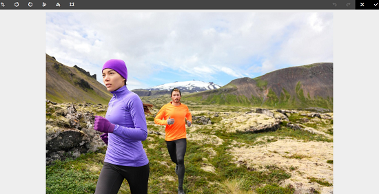

# Archivia ed estrai file in [!DNL Experience Manager] DAM {#check-in-and-check-out-files-in-assets}

| Versione | Collegamento articolo |
| -------- | ---------------------------- |
| AEM as a Cloud Service | [Fai clic qui](https://experienceleague.adobe.com/docs/experience-manager-cloud-service/content/assets/manage/check-out-and-submit-assets.html?lang=en) |
| AEM 6.5 | Questo articolo |

[!DNL Adobe Experience Manager Assets] consente di estrarre le risorse per la modifica e archiviarle nuovamente dopo aver completato le modifiche. Dopo aver estratto una risorsa, solo tu puoi modificarla, annotarla, pubblicarla, spostarla o eliminarla. Il Check-Out di una risorsa blocca la risorsa. Gli altri utenti non possono eseguire nessuna di queste operazioni sulla risorsa finché non la sottoponi nuovamente a check-in in [!DNL Assets]. Tuttavia, possono comunque modificare i metadati della risorsa bloccata.

Per poter estrarre/archiviare le risorse, è necessario disporre dell&#39;accesso in scrittura.

Questa funzione impedisce ad altri utenti di ignorare le modifiche apportate da un autore, qualora più utenti collaborino alla modifica dei flussi di lavoro tra i team.

## Estrarre le risorse {#checking-out-assets}

1. Dall&#39;interfaccia utente [!DNL Assets], selezionare la risorsa da estrarre. È inoltre possibile selezionare più risorse da estrarre.
1. Dalla barra degli strumenti, fare clic su **[!UICONTROL Estrai]**. L&#39;opzione **[!UICONTROL Estrai]** attiva **[!UICONTROL Archivia]**.
Per verificare se altri utenti possono modificare la risorsa estratta, accedere come un altro utente. Sulla miniatura della risorsa estratta viene visualizzato un simbolo di blocco.

   

   Seleziona la risorsa. Nella barra degli strumenti non sono visualizzate opzioni che consentono di modificare, annotare, pubblicare o eliminare la risorsa.

   

   Per modificare i metadati della risorsa bloccata, fai clic su **[!UICONTROL Visualizza proprietà]**.

1. Fai clic su **[!UICONTROL Modifica]** per aprire la risorsa in modalità di modifica.

   

1. Modifica la risorsa e salva le modifiche. Ad esempio, ritaglia l’immagine e salva.

   

   Puoi anche scegliere di annotare o pubblicare la risorsa.

1. Seleziona la risorsa modificata dall&#39;interfaccia [!DNL Assets] e fai clic su **[!UICONTROL Archivia]** nella barra degli strumenti. La risorsa modificata è archiviata in [!DNL Assets] ed è disponibile per la modifica per altri utenti.

## Check-in forzato {#forced-check-in}

Gli amministratori possono archiviare le risorse estratte da altri utenti.

1. Accedere a [!DNL Assets] come amministratore.
1. Dall&#39;interfaccia utente di [!DNL Assets], selezionare una o più risorse estratte da altri utenti.

   

1. Dalla barra degli strumenti, fare clic su **[!UICONTROL Blocco versione]**. La risorsa viene archiviata nuovamente e può essere modificata da altri utenti.

## Best practice e limitazioni {#tips-limitations}

* È possibile eliminare una *cartella* contenente file di risorse estratti. Prima di eliminare una cartella, accertati che gli utenti non estraggano risorse digitali.

>[!MORELIKETHIS]
>
>* [Informazioni su archiviazione ed estrazione nell&#39;app desktop](https://experienceleague.adobe.com/docs/experience-manager-desktop-app/using/using.html#how-app-works2) [!DNL Experience Manager] 
>* [Esercitazione video per comprendere l&#39;archiviazione e l&#39;estrazione in [!DNL Assets]](https://experienceleague.adobe.com/docs/experience-manager-learn/assets/collaboration/check-in-and-check-out.html)
