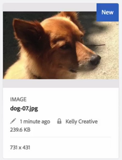

# Check-in e check-out dei file in [!DNL Experience Manager] DAM {#check-in-and-check-out-files-in-assets}

[!DNL Adobe Experience Manager Assets] consente di estrarre le risorse per la modifica e archiviarle nuovamente dopo aver completato le modifiche. Dopo aver estratto una risorsa, potete solo modificare, annotare, pubblicare, spostare o eliminare la risorsa. Il check-out di una risorsa blocca la risorsa. Gli altri utenti non possono eseguire nessuna di queste operazioni sulla risorsa finché la risorsa non viene nuovamente archiviata in [!DNL Assets]. Tuttavia, possono comunque modificare i metadati della risorsa bloccata.

Per poter estrarre/archiviare le risorse, è necessario disporre dell&#39;accesso in scrittura.

Questa funzione consente di impedire ad altri utenti di ignorare le modifiche apportate da un autore, in cui più utenti collaborano ai flussi di lavoro di modifica tra più team.

## Estrarre risorse {#checking-out-assets}

1. Dall&#39;interfaccia utente di [!DNL Assets], selezionate la risorsa da estrarre. Potete anche selezionare più risorse da estrarre.
1. Dalla barra degli strumenti, fare clic su **[!UICONTROL Checkout]**.
L&#39;opzione **[!UICONTROL Checkout]** consente di passare a **[!UICONTROL Checkin]**.
Per verificare se altri utenti possono modificare la risorsa estratta, effettuate l’accesso come un altro utente. Sulla miniatura della risorsa estratta viene visualizzato un simbolo di blocco.

   

   Selezionate la risorsa. Nella barra degli strumenti non sono visualizzate opzioni che consentono di modificare, annotare, pubblicare o eliminare la risorsa.

   

   Potete fare clic su **[!UICONTROL Visualizza proprietà]** per modificare i metadati per la risorsa bloccata.

1. Fate clic su **[!UICONTROL Modifica]** per aprire la risorsa in modalità di modifica.

   

1. Modificate la risorsa e salvate le modifiche. Ad esempio, ritagliate l’immagine e salvate.

   

   Potete anche scegliere di inserire delle annotazioni o pubblicare la risorsa.

1. Selezionate la risorsa modificata dall&#39;interfaccia [!DNL Assets], quindi fate clic su **[!UICONTROL Controllo]** nella barra degli strumenti. La risorsa modificata viene archiviata in [!DNL Assets] ed è disponibile per la modifica da parte di altri utenti.

## Check-in forzato {#forced-check-in}

Gli amministratori possono archiviare le risorse sottoposte a Check-Out da altri utenti.

1. Accedete a [!DNL Assets] come amministratore.
1. Dall&#39;interfaccia utente di [!DNL Assets], selezionate una o più risorse che sono state sottoposte a check-out da parte di altri utenti.

   

1. Dalla barra degli strumenti, fare clic su **[!UICONTROL Rilascia blocco]**. La risorsa viene archiviata e può essere modificata da altri utenti.

## Best practice e limitazioni {#tips-limitations}

* È possibile eliminare una *cartella* contenente i file di risorse estratti. Prima di eliminare una cartella, accertatevi che gli utenti non dispongano di risorse digitali.

>[!MORELIKETHIS]
>
>* [Informazioni sull&#39;archiviazione e il check-out &#39;app desktop Experience Manager](https://experienceleague.adobe.com/docs/experience-manager-desktop-app/using/using.html?lang=en#how-app-works2)
>* [Esercitazione video per comprendere il check-in e il check-out delle risorse](https://experienceleague.adobe.com/docs/experience-manager-learn/assets/collaboration/check-in-and-check-out.html)

