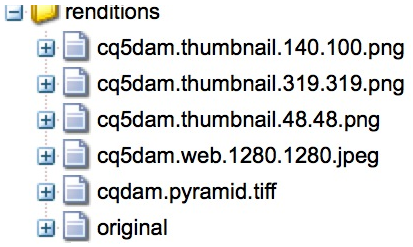

# Configurazione di Dynamic Media - Modalità Scene7{#configuring-dynamic-media-scene-mode}

Se utilizzate la configurazione di Adobe Experience Manager per ambienti diversi, ad esempio per lo sviluppo, la gestione temporanea e la produzione, configurate Cloud Services Dynamic Media per ciascuno di questi ambienti.

## Diagramma dell&#39;architettura di Dynamic Media - Modalità Scene7 {#architecture-diagram-of-dynamic-media-scene-mode}

Nel diagramma di architettura seguente viene descritto il funzionamento della modalità Dynamic Media - Scene7.

Con la nuova architettura,  Experience Manager è responsabile delle risorse di origine primaria e delle sincronizzazioni con Dynamic Media per l’elaborazione e la pubblicazione delle risorse:

1. Quando la risorsa di origine principale viene caricata  Experience Manager, viene replicata in Dynamic Media. A questo punto, Dynamic Media gestisce l’elaborazione delle risorse e la generazione di rappresentazioni, come la codifica video e le varianti dinamiche di un’immagine. <!-- (In Dynamic Media - Scene7 mode, be aware that you can only upload assets whose file sizes are 2 GB or less.) Jira ticket CQ-4286561 fixed this issue. DM-S7 NOW SUPPORTS THE UPLOAD OF ASSETS LARGER THAN 2 GB. -->
1. Dopo la generazione delle rappresentazioni,  Experience Manager può accedere e visualizzare in anteprima in modo protetto le rappresentazioni Dynamic Media remote (nessun file binario viene inviato nuovamente all&#39;istanza di  Experience Manager).
1. Quando il contenuto è pronto per essere pubblicato e approvato, attiva il servizio Dynamic Media per inviare contenuti ai server di distribuzione e memorizzare nella cache il contenuto nella rete CDN (Content Delivery Network).


>[!NOTE]
>
>Il seguente elenco di funzioni richiede l’utilizzo del CDN predefinito fornito con Adobe Experience Manager - Dynamic Media. Qualsiasi altra CDN personalizzata non è supportata con queste funzioni.
>
>* [Imaging avanzato](/help/assets/imaging-faq.md)
>* [Annullamento cache](/help/assets/invalidate-cdn-cache-dynamic-media.md)
>* [Protezione collegamento ipertestuale](/help/assets/hotlink-protection.md)
>* [Distribuzione di contenuti HTTP/2](/help/assets/http2.md)
>* Reindirizzamento URL a livello CDN
>* Akamai ChinaCDN (per una consegna ottimale in Cina)


## Abilitazione di Dynamic Media in modalità Scene7 {#enabling-dynamic-media-in-scene-mode}

[Dynamic Media è disattivato per impostazione predefinita. ](https://www.adobe.com/solutions/web-experience-management/dynamic-media.html) Per sfruttare le funzionalità di Dynamic Media, è necessario abilitarle.

>[!NOTE]
>
>Dynamic Media - La modalità Scene7 è destinata solo all&#39;istanza  Experience Manager Autore. Di conseguenza, è necessario configurare `runmode=dynamicmedia_scene7` nell&#39;istanza Author del Experience Manager , *non* l&#39;istanza Pubblica del Experience Manager .

Per abilitare Dynamic Media, è necessario avviare  Experience Manager utilizzando la modalità di esecuzione `dynamicmedia_scene7` dalla riga di comando immettendo quanto segue in una finestra terminale (ad esempio, la porta utilizzata è 4502):

```shell
java -Xms4096m -Xmx4096m -Doak.queryLimitInMemory=500000 -Doak.queryLimitReads=500000 -jar cq-quickstart-6.5.0.jar -gui -r author,dynamicmedia_scene7 -p 4502
```

## (Facoltativo) Migrazione di predefiniti e configurazioni Dynamic Media da 6.3 a 6.5 Zero Downtime {#optional-migrating-dynamic-media-presets-and-configurations-from-to-zero-downtime}

L&#39;aggiornamento  Dynamic Media di Experience Manager da 6.3 a 6.4 o 6.5 ora include la possibilità di eseguire installazioni senza tempi di inattività. Per migrare tutti i predefiniti e le configurazioni da `/etc` a `/conf` in CRXDE Lite, eseguire il seguente comando curl.

>[!NOTE]
>
>Se si esegue l&#39;istanza  Experience Manager in modalità di compatibilità, ovvero se è installata la compatibilità, non è necessario eseguire questi comandi.

Per tutti gli aggiornamenti, con o senza il pacchetto di compatibilità, potete copiare i predefiniti per visualizzatori predefiniti forniti originariamente con Dynamic Media eseguendo il seguente comando curl Linux:

`curl -u admin:admin -X POST https://<server_address>:<server_port>/libs/settings/dam/dm/presets/viewer.pushviewerpresets.json`

Per migrare eventuali predefiniti e configurazioni di visualizzatore personalizzati creati da `/etc` a `/conf`, eseguite il seguente comando curl Linux:

`curl -u admin:admin -X POST https://<server_address>:<server_port>/libs/settings/dam/dm/presets.migratedmcontent.json`

## Installazione del feature pack 18912 per la migrazione di massa delle risorse {#installing-feature-pack-for-bulk-asset-migration}

L&#39;installazione del feature pack 18912 è *opzionale*.

Il Feature Pack 18912 consente di caricare le risorse in blocco tramite FTP, oppure di migrare le risorse dalla modalità Dynamic Media - Hybrid o Dynamic Media Classic alla modalità Dynamic Media - Scene7  Experience Manager. È disponibile da [Adobe Professional Services](https://www.adobe.com/experience-cloud/consulting-services.html).

Per ulteriori informazioni, consultate [Installazione del feature pack 18912 per la migrazione di massa delle risorse](/help/assets/bulk-ingest-migrate.md).

## Creazione di una configurazione Dynamic Media negli Cloud Services {#configuring-dynamic-media-cloud-services}

**Prima di configurare Dynamic Media**  - Dopo aver ricevuto l&#39;e-mail di provisioning con le credenziali di Dynamic Media, è necessario aprire l&#39;applicazione [ desktop ](https://experienceleague.adobe.com/docs/dynamic-media-classic/using/getting-started/signing-out.html#getting-started)Dynamic Media Classic, quindi accedere all&#39;account per cambiare la password. La password fornita nel messaggio e-mail di provisioning è generata dal sistema e deve essere solo una password temporanea. È importante aggiornare la password in modo che il Cloud Service Dynamic Media sia configurato con le credenziali corrette.


**Per creare una configurazione Dynamic Media negli Cloud Services**

1. In  Experience Manager, toccate il logo del Experience Manager  per accedere alla console di navigazione globale e toccate l&#39;icona Strumenti, quindi toccate **[!UICONTROL Cloud Services > Configurazione Dynamic Media.]**
1. Nella pagina del Browser configurazioni Dynamic Media, seleziona il riquadro a sinistra e tocca **[!UICONTROL global (globale)]** (non toccare o selezionare l’icona della cartella a sinistra di **[!UICONTROL global]**), quindi tocca **[!UICONTROL Crea.]**
1. Nella pagina **[!UICONTROL Crea configurazione Dynamic Media]**, immettete un titolo, l&#39;indirizzo e-mail dell&#39;account Dynamic Media, la password, quindi selezionate la vostra area geografica. Queste informazioni vengono fornite  Adobe nel messaggio e-mail di provisioning. Contatta  Assistenza clienti di Adobe se non hai ricevuto l’e-mail.

   Toccare **[!UICONTROL Connetti ad Dynamic Media.]**

   >[!NOTE]
   Dopo aver ricevuto l&#39;e-mail di provisioning con le credenziali Dynamic Media, aprite l&#39; [applicazione desktop Dynamic Media Classic](https://experienceleague.adobe.com/docs/dynamic-media-classic/using/getting-started/signing-out.html#getting-started), quindi accedete al vostro account per cambiare la password. La password fornita nel messaggio e-mail di provisioning è generata dal sistema e deve essere solo una password temporanea. È importante aggiornare la password in modo che il Cloud Service Dynamic Media sia configurato con le credenziali corrette.

1. Quando la connessione ha esito positivo, impostate quanto segue. Le intestazioni con un asterisco (*) sono obbligatorie:

   * **[!UICONTROL Società]** : il nome dell&#39;account Dynamic Media. Avete più account Dynamic Media. Ad esempio, potete avere diversi marchi secondari, divisioni, staging o ambienti di produzione.

   * **[!UICONTROL Percorso cartella principale della società]**

   * **[!UICONTROL Risorse]**  di pubblicazione: potete scegliere tra le tre opzioni seguenti:
      * **[!UICONTROL In]** modo immediato, quando le risorse vengono caricate, il sistema le acquisisce e fornisce l’URL/incorpora immediatamente. Non è necessario alcun intervento da parte degli utenti per pubblicare le risorse.
      * **[!UICONTROL Al momento dell’]** attivazione, è necessario pubblicare esplicitamente la risorsa prima di fornire un collegamento URL/Incorpora.
      * **[!UICONTROL Pubblicazione selettivaQuesta opzione consente di controllare le cartelle pubblicate in Dynamic Media.]** Consente di utilizzare funzioni quali Ritaglio avanzato o rappresentazioni dinamiche, oppure di determinare quali cartelle pubblicare esclusivamente in  Experience Manager per la visualizzazione dell&#39;anteprima. Le stesse risorse sono *not* pubblicate in Dynamic Media per la distribuzione nel dominio pubblico.<br>Puoi impostare questa opzione in  **[!UICONTROL Dynamic Media Cloud]** Configurationo, se preferisci, puoi scegliere di impostare questa opzione a livello di cartella, in  **[!UICONTROL Proprietà]** di una cartella.<br>Consultate  [Utilizzo della pubblicazione selettiva in Dynamic Media.](/help/assets/selective-publishing.md)<br>Se successivamente modificate questa configurazione o la modificate a livello di cartella, tali modifiche interesseranno solo le nuove risorse caricate da quel momento in poi. Lo stato di pubblicazione delle risorse esistenti nella cartella rimane invariato finché non vengono modificate manualmente dalla finestra di dialogo **[!UICONTROL Pubblicazione rapida]** o **[!UICONTROL Gestisci pubblicazione]**.
   * **[!UICONTROL Secure Preview Server]** : consente di specificare il percorso URL del server di anteprima delle rappresentazioni protette. In altre parole, dopo la generazione delle rappresentazioni,  Experience Manager può accedere in modo sicuro e visualizzare in anteprima le rappresentazioni Dynamic Media remote (nessun file binario viene inviato nuovamente all&#39;istanza di  Experience Manager).
A meno che non disponiate di una disposizione speciale per utilizzare il server della vostra società o un server speciale,  Adobe consiglia di lasciare questa impostazione come specificato.

   * **[!UICONTROL Sincronizza tutto il contenuto]**  -  <!-- NEW OPTION, CQDOC-15371, Added March 4, 2020-->Selezionato per impostazione predefinita. Deselezionate questa opzione se desiderate includere o escludere selettivamente le risorse dalla sincronizzazione ad Dynamic Media. Deselezionando questa opzione potete scegliere tra le due seguenti modalità di sincronizzazione Dynamic Media:

   * **[!UICONTROL Modalità di sincronizzazione elementi Dynamic Media]**
      * **[!UICONTROL Abilitata per impostazione predefinita]** : la configurazione viene applicata a tutte le cartelle per impostazione predefinita, a meno che non venga contrassegnata una cartella specifica per l&#39;esclusione.  <!-- you can then deselect the folders that you do not want the configuration applied to.-->
      * **[!UICONTROL Disabilitata per impostazione predefinita]** : la configurazione non viene applicata ad alcuna cartella finché non si contrassegna esplicitamente una cartella selezionata per la sincronizzazione ad Dynamic Media.
Per contrassegnare una cartella selezionata per la sincronizzazione con Dynamic Media, selezionate una cartella di risorse, quindi toccate **[!UICONTROL Proprietà]** sulla barra degli strumenti. Nella scheda **[!UICONTROL Dettagli]**, nell&#39;elenco a discesa **[!UICONTROL Modalità di sincronizzazione Dynamic Media]**, scegliere tra le tre opzioni seguenti. Al termine, toccare **[!UICONTROL Salva.]** *Ricorda: queste tre opzioni non sono disponibili se avete selezionato **Sincronizza tutto il**contenuto in precedenza.* Consultate anche  [Utilizzo della pubblicazione selettiva a livello di cartella in Dynamic Media.](/help/assets/selective-publishing.md)
         * **[!UICONTROL Ereditato]** : nessun valore di sincronizzazione esplicito sulla cartella; al contrario, la cartella eredita il valore di sincronizzazione da una delle cartelle antenate o dalla modalità predefinita nella configurazione cloud. Lo stato dettagliato per le presentazioni ereditate viene visualizzato tramite una descrizione comandi.
         * **[!UICONTROL Abilita per le sottocartelle]**  - Includi tutto ciò che si trova in questa sottostruttura per la sincronizzazione con Dynamic Media. Le impostazioni specifiche per la cartella sostituiscono la modalità predefinita nella configurazione cloud.
         * **[!UICONTROL Disattivato per le sottocartelle]**  - Escludete tutti gli elementi presenti in questa sottostruttura dalla sincronizzazione ad Dynamic Media.

   >[!NOTE]
   Non è supportato il controllo delle versioni in DMS7. Inoltre, l’attivazione ritardata si applica solo se l’opzione **[!UICONTROL Pubblica risorse]** della pagina Modifica configurazione Dynamic Media è impostata su **[!UICONTROL All’attivazione]** e soltanto fino alla prima attivazione della risorsa.
   Dopo l’attivazione di una risorsa, tutti gli aggiornamenti vengono immediatamente pubblicati in diretta su S7 Delivery.

1. Toccate **[!UICONTROL Salva.]**
1. Per visualizzare in modo sicuro l&#39;anteprima del contenuto Dynamic Media prima della pubblicazione, è necessario &quot; inserire nell&#39;elenco Consentiti&quot; l&#39;istanza Experience Manager dell&#39;autore   per collegarsi ad Dynamic Media:

   * Apri l&#39; [applicazione desktop Dynamic Media Classic](https://experienceleague.adobe.com/docs/dynamic-media-classic/using/getting-started/signing-out.html#getting-started), quindi accedi al tuo account. Le credenziali e i dettagli di accesso sono stati forniti  Adobe al momento del provisioning. Se non disponete di tali informazioni, contattate il supporto tecnico.

   * Nella barra di navigazione in alto a destra della pagina, toccate **[!UICONTROL Configurazione > Impostazione applicazione > Impostazione pubblicazione > Server immagini]**.

   * Nella pagina Pubblica su Image Server, nell’elenco a discesa Contesto pubblicazione, selezionate **[!UICONTROL Test Image Server.]**
   * Per Filtro indirizzi client, toccare **[!UICONTROL Aggiungi.]**
   * Per attivare l’indirizzo, selezionate la casella di controllo. Immettete l&#39;indirizzo IP dell&#39;istanza Author del Experience Manager  (non dell&#39;IP del dispatcher).
   * Toccate **[!UICONTROL Salva.]**

Ora hai finito con la configurazione di base; è possibile utilizzare la modalità Dynamic Media - Scene7.

Se desiderate personalizzare ulteriormente la configurazione, potete eventualmente completare una qualsiasi delle attività in [(Facoltativo) Configurazione delle impostazioni avanzate in Dynamic Media - modalità Scene7](#optional-configuring-advanced-settings-in-dynamic-media-scene-mode).

## (Facoltativo) Configurazione delle impostazioni avanzate in Dynamic Media - Modalità Scene7 {#optional-configuring-advanced-settings-in-dynamic-media-scene-mode}

Per personalizzare ulteriormente la configurazione e l&#39;impostazione della modalità Dynamic Media - Scene7 o ottimizzarne le prestazioni, è possibile completare una o più delle seguenti *attività facoltative*:

* [(Facoltativo) Configurazione e configurazione di Dynamic Media - Impostazioni modalità Scene7](#optional-setup-and-configuration-of-dynamic-media-scene7-mode-settings)

* [(Facoltativo) Ottimizzazione delle prestazioni della modalità Dynamic Media - Scene7](#optional-tuning-the-performance-of-dynamic-media-scene-mode)

* [(Facoltativo) Filtrare le risorse per la replica](#optional-filtering-assets-for-replication)

### (Facoltativo) Configurazione e configurazione di Dynamic Media - Impostazioni modalità Scene7 {#optional-setup-and-configuration-of-dynamic-media-scene7-mode-settings}

Quando si è in modalità di esecuzione `dynamicmedia_scene7`, utilizzare l&#39;interfaccia utente di Dynamic Media Classic per modificare le impostazioni di Dynamic Media.

Per alcune delle attività di cui sopra è necessario aprire l&#39; [applicazione desktop Dynamic Media Classic](https://experienceleague.adobe.com/docs/dynamic-media-classic/using/getting-started/signing-out.html#getting-started), quindi accedere al proprio account.

Le attività di configurazione e configurazione includono:

* [Configurazione pubblicazione per Image Server](#publishing-setup-for-image-server)
* [Configurazione delle impostazioni generali dell’applicazione](#configuring-application-general-settings)
* [Configurazione della gestione del colore](#configuring-color-management)
* [Modifica dei tipi MIME per i formati supportati](#editing-mime-types-for-supported-formats)
* [Aggiunta di tipi MIME per i formati non supportati](#adding-mime-types-for-unsupported-formats)
* [Creazione di predefiniti per set di batch per generare automaticamente set di immagini e set 360 gradi](#creating-batch-set-presets-to-auto-generate-image-sets-and-spin-sets)

#### Configurazione pubblicazione per Image Server {#publishing-setup-for-image-server}

Le impostazioni Impostazione pubblicazione specificano il modo in cui le risorse vengono distribuite per impostazione predefinita da Dynamic Media. Se non viene specificata alcuna impostazione, Dynamic Media distribuisce una risorsa in base alle impostazioni predefinite definite in Impostazione pubblicazione. Ad esempio, una richiesta di invio di un&#39;immagine che non include un attributo di risoluzione produce un&#39;immagine con l&#39;impostazione Risoluzione oggetto predefinita.

Per configurare Impostazione pubblicazione: in Dynamic Media Classic, toccate **[!UICONTROL Configurazione > Impostazione applicazione > Impostazione pubblicazione > Server immagini]**.

La schermata Server immagini stabilisce le impostazioni predefinite per la distribuzione delle immagini. Consultate la schermata dell’interfaccia utente per una descrizione di ciascuna impostazione.

* **[!UICONTROL Attributi]**  richiesta - Queste impostazioni impongono limiti alle immagini che possono essere distribuite dal server.
* **[!UICONTROL Attributi]**  richiesta predefiniti: queste impostazioni interessano l&#39;aspetto predefinito delle immagini.
* **[!UICONTROL Attributi]**  comuni delle miniature: queste impostazioni interessano l’aspetto predefinito delle miniature.
* **[!UICONTROL Valori predefiniti per i campi]** catalogo: queste impostazioni interessano la risoluzione e il tipo predefinito di miniatura delle immagini.
* **[!UICONTROL Attributi]**  di gestione del colore: queste impostazioni determinano quali profili colore ICC vengono utilizzati.
* **[!UICONTROL Attributi]**  di compatibilità: questa impostazione consente ai paragrafi iniziali e finali nei livelli di testo di essere trattati come nella versione 3.6 per garantire la compatibilità con le versioni precedenti.
* **[!UICONTROL Supporto]**  per la localizzazione: queste impostazioni consentono di gestire più attributi della lingua. Consente inoltre di specificare una stringa di mappa lingua in modo da definire le lingue da supportare per le varie descrizioni comandi nei visualizzatori. Per ulteriori informazioni sull&#39;impostazione di **[Supporto per la localizzazione]**, vedere [Considerazioni per l&#39;impostazione della localizzazione delle risorse](https://help.adobe.com/en_US/scene7/using/WS997f1dc4cb0179f034e07dc31412799d19a-8000.html).

#### Configurazione delle impostazioni generali dell&#39;applicazione {#configuring-application-general-settings}

Per aprire la pagina Impostazioni generali applicazione, nella barra di navigazione globale di Dynamic Media Classic toccate **[!UICONTROL Configurazione > Impostazione applicazione > Impostazioni generali.]**

**Server - **Al provisioning dell&#39;account, Dynamic Media fornisce automaticamente i server assegnati alla società. Questi server vengono utilizzati per creare stringhe URL per il sito Web e le applicazioni. Queste chiamate URL sono specifiche per il vostro account. Non modificate i nomi dei server, a meno che non sia espressamente richiesto dall&#39;Assistenza clienti  Adobe.

**[!UICONTROL Sovrascrivi immagini]**  - Dynamic Media non consente a due file di avere lo stesso nome. L’ID URL di ogni elemento (il nome del file senza l’estensione) deve essere univoco. Queste opzioni specificano la modalità di caricamento delle risorse sostitutive: se sostituiscono l’originale o diventano duplicati. Le risorse duplicate vengono rinominate con il suffisso &quot;-1&quot; (ad esempio, sedia.tif viene rinominato sedia-1.tif). Queste opzioni interessano le risorse caricate in una cartella diversa dall’originale o le risorse con un’estensione file diversa dall’originale (ad esempio, JPG, TIF o PNG).

* **[!UICONTROL Sovrascrivi in cartella corrente, nome/estensione]**  stessa immagine base: questa opzione rappresenta la regola di sostituzione più restrittiva. Richiede che l’immagine sostitutiva venga caricata nella stessa cartella dell’originale e che abbia la stessa estensione del nome file dell’originale. Se questi requisiti non sono soddisfatti, viene creato un duplicato.

>[!NOTE]
Per mantenere la coerenza con  Experience Manager, scegliete sempre questa impostazione: **Sovrascrivi nella cartella corrente, nome/estensione della stessa immagine base**

* **[!UICONTROL Sovrascrivi in qualsiasi cartella, nome/estensione]**  della risorsa base - Richiede che l’immagine sostitutiva abbia la stessa estensione del nome file dell’immagine originale (ad esempio, sedia.jpg deve sostituire sedia.jpg, non sedia.tif). Tuttavia, potete caricare l’immagine sostitutiva in una cartella diversa da quella dell’originale. L’immagine aggiornata si trova nella nuova cartella; il file non può più essere trovato nella posizione originale
* **[!UICONTROL Sovrascrivi in qualsiasi cartella, nome della stessa risorsa di base, indipendentemente dall’estensione]** . Questa opzione è la regola di sostituzione più inclusiva. Potete caricare un’immagine sostitutiva in una cartella diversa da quella dell’originale, caricare un file con un’estensione diversa e sostituire il file originale. Se il file originale si trova in un’altra cartella, l’immagine sostitutiva si trova nella nuova cartella in cui è stata caricata.

**[!UICONTROL Profili]**  colore predefiniti - Per ulteriori informazioni, consultate  [Configurazione della ](#configuring-color-management) gestione del colore.

>[!NOTE]
Per impostazione predefinita, il sistema mostra 15 rappresentazioni quando selezioni **[!UICONTROL Rappresentazioni]** e 15 predefiniti visualizzatore quando fai clic su **[!UICONTROL Visualizzatori]** nella vista Dettaglio della risorsa. Puoi aumentare questo limite. Consultate [Incremento del numero di predefiniti per immagini che visualizzano](/help/assets/managing-image-presets.md#increasing-or-decreasing-the-number-of-image-presets-that-display) o [Aumento del numero di predefiniti per visualizzatori che vengono visualizzati](/help/assets/managing-viewer-presets.md#increasing-the-number-of-viewer-presets-that-display).


#### Configurazione della gestione del colore {#configuring-color-management}

La gestione dinamica del colore dei contenuti multimediali consente di colorare le risorse corrette. Con la correzione del colore, le risorse inserite mantengono lo spazio colore (RGB, CMYK, Grigio) e il profilo colore incorporato. Quando si richiede una rappresentazione dinamica, il colore dell&#39;immagine viene corretto nello spazio colore di destinazione utilizzando l&#39;output CMYK, RGB o Grigio. Consultate [Configurazione dei predefiniti per immagini](/help/assets/managing-image-presets.md).

Per configurare le proprietà colore predefinite in modo che la correzione colore sia abilitata quando vengono richieste le immagini:

1. Aprite l&#39; [applicazione desktop Dynamic Media Classic](https://experienceleague.adobe.com/docs/dynamic-media-classic/using/getting-started/signing-out.html#getting-started), quindi accedete al vostro account utilizzando le credenziali fornite durante il provisioning.
1. Passare a **[!UICONTROL Configurazione > Impostazione applicazione.]**
1. Espandi l’area **[!UICONTROL Publish Setup (Impostazione pubblicazione)]** e seleziona **[!UICONTROL Image Server.]** Per le istanze di pubblicazione, imposta **[!UICONTROL Contesto di pubblicazione]** su **[!UICONTROL Image Server]**.
1. Scorrete fino alla proprietà da modificare. Ad esempio, una proprietà nell&#39;area **[!UICONTROL Attributi di gestione del colore]**.

   Potete impostare le seguenti proprietà di correzione del colore:

   * **[!UICONTROL Spazio]**  colore predefinito CMYK - Nome del profilo colore CMYK predefinito
   * **[!UICONTROL Scala di grigio Spazio]**  colore predefinito - Nome del profilo colore grigio predefinito
   * **[!UICONTROL Spazio]**  colore predefinito RGB - Nome del profilo colore RGB predefinito
   * **[!UICONTROL Intento]**  di rendering conversione colore - Specifica l&#39;intento di rendering. I valori accettabili sono: **[!UICONTROL percettivo]**, **[!UICONTROL colometrico relativo]**, **[!UICONTROL saturazione]**, **[!UICONTROL colometrico assoluto.]**  Adobe consiglia  **** i parenti come impostazione predefinita.

1. Toccate **[!UICONTROL Salva.]**

Ad esempio, puoi impostare **[!UICONTROL Spazio colore predefinito RGB]** su *sRGB* e **[!UICONTROL Spazio colore predefinito CMYK]** su *WebCoated*.

In questo modo si effettua quanto segue:

* Attiva la correzione del colore per le immagini RGB e CMYK.
* Si presume che le immagini RGB che non hanno un profilo colore siano nello spazio colore *sRGB*.
* Si presume che le immagini CMYK che non hanno un profilo colore siano nello spazio colore *WebCoated*.
* Rappresentazioni dinamiche che restituiscono l&#39;output RGB, restituitelo nello spazio colore *sRGB*.
* Rappresentazioni dinamiche che restituiscono l&#39;output CMYK, restituitelo nello spazio colore *WebCoated*.

#### Modifica dei tipi MIME per i formati supportati {#editing-mime-types-for-supported-formats}

Potete definire quali tipi di risorse vengono elaborati da Dynamic Media e personalizzare i parametri di elaborazione avanzata delle risorse. Ad esempio, potete specificare i parametri di elaborazione delle risorse per effettuare le seguenti operazioni:

* Convertite un Adobe PDF  in una risorsa eCatalog.
* Convertite un documento Adobe Photoshop  (.PSD) in una risorsa modello banner per la personalizzazione.
* Rasterizzare un file Adobe Illustrator  (.AI) o un file PostScript® incapsulato  Adobe Photoshop (.EPS).
* [I ](/help/assets/video-profiles.md) profili video e i  [profili ](/help/assets/image-profiles.md) immagine possono essere utilizzati rispettivamente per definire l’elaborazione di video e immagini.

Consulta [Caricamento delle risorse](/help/assets/manage-assets.md#uploading-assets).

**Per modificare i tipi MIME per i formati supportati**

1. In  Experience Manager, toccate il logo del Experience Manager  per accedere alla console di navigazione globale, quindi toccate **[!UICONTROL Strumenti > Generale > CRXDE Lite.]**
1. Nella barra a sinistra, andate a:

   `/conf/global/settings/cloudconfigs/dmscene7/jcr:content/mimeTypes`

   

1. Sotto la cartella mimeTypes, selezionate un tipo mime.
1. Sul lato destro della pagina CRXDE Lite, nella parte inferiore:

   * fare doppio clic sul campo **[!UICONTROL enabled]**. Per impostazione predefinita, tutti i tipi di mime delle risorse sono attivati (impostati su **[!UICONTROL true]**), il che significa che le risorse vengono sincronizzate in Dynamic Media per l&#39;elaborazione. Se desiderate escludere l&#39;elaborazione di questo tipo di mime della risorsa, modificate questa impostazione in **[!UICONTROL false.]**

   * toccare due volte **[!UICONTROL jobParam]** per aprire il campo di testo associato. Consultate [Tipi mime supportati](/help/assets/assets-formats.md#supported-mime-types) per un elenco dei valori di parametro di elaborazione consentiti che potete utilizzare per un determinato tipo mime.

1. Effettua una delle operazioni seguenti:

   * Ripetere i passaggi da 3 a 4 per modificare altri tipi MIME.
   * Nella barra dei menu della pagina dei CRXDE Lite, toccare **[!UICONTROL Salva tutto.]**

1. Nell&#39;angolo superiore sinistro della pagina, toccare **[!UICONTROL CRXDE Lite]** per tornare  Experience Manager.

#### Aggiunta di tipi MIME per i formati non supportati {#adding-mime-types-for-unsupported-formats}

Puoi aggiungere tipi MIME personalizzati per i formati non supportati in  risorse di Experience Manager. Assicurarsi che i nuovi nodi aggiunti nel CRXDE Lite non vengano eliminati dal Experience Manager  spostando il tipo MIME prima di `image_`. Inoltre, accertatevi che il valore abilitato sia impostato su **[!UICONTROL false.]**

**Aggiunta di tipi MIME per i formati non supportati**

1. Dal  Experience Manager, toccare **[!UICONTROL Strumenti > Operazioni > Console Web.]**

   

1. Viene visualizzata una nuova scheda del browser nella pagina **[!UICONTROL Configurazione della console Web Adobe Experience Manager]**.

   

1. Nella pagina, scorri verso il basso fino al nome *Adobe CQ Scene7 Asset MIME type Service*, come illustrato nella schermata successiva. A destra del nome, tocca **[!UICONTROL Modifica i valori di configurazione]** (icona a forma di matita).

   

1. Nella pagina **Adobe CQ Scene7 Asset MIME type Service**, toccate l&#39;icona con il segno più &lt;+>. La posizione nella tabella in cui toccate il segno più per aggiungere il nuovo tipo mime è insignificante.

   

1. Digitare `DWG=image/vnd.dwg` nel campo di testo vuoto appena aggiunto.

   L&#39;esempio `DWG=image/vnd.dwg` è solo a scopo illustrativo. Il tipo MIME aggiunto qui può essere qualsiasi altro formato non supportato.

   

1. Nell&#39;angolo inferiore destro della pagina, toccare **[!UICONTROL Salva.]**

   A questo punto, è possibile chiudere la scheda del browser con la pagina di configurazione della console Web di Adobe Experience Manager aperta.

1. Tornate alla scheda del browser con la console  Experience Manager aperta.
1. Dal  Experience Manager, toccare **[!UICONTROL Strumenti > Generale > CRXDE Lite.]**

   

1. Nella barra a sinistra, andate a:

   `conf/global/settings/cloudconfigs/dmscene7/jcr:content/mimeTypes`

1. Trascinate il tipo mime `image_vnd.dwg` e rilasciatelo direttamente sopra `image_` nella struttura ad albero, come mostrato nella schermata seguente.

   

1. Con il tipo mime `image_vnd.dwg` ancora selezionato, dalla scheda **[!UICONTROL Properties]**, nella riga **[!UICONTROL enabled]**, nell&#39;intestazione della colonna **[!UICONTROL Value]**, toccare due volte il valore per aprire l&#39;elenco a discesa **[!UICONTROL Value]**.
1. Digitare `false` nel campo (oppure selezionare **[!UICONTROL false]** dall&#39;elenco a discesa).

   

1. Vicino all&#39;angolo superiore sinistro della pagina CRXDE Lite, toccare **[!UICONTROL Salva tutto.]**

#### Creazione di predefiniti per set di batch per generare automaticamente set di immagini e set 360 gradi {#creating-batch-set-presets-to-auto-generate-image-sets-and-spin-sets}

Usate i predefiniti per set di batch per automatizzare la creazione di set di immagini o set 360 gradi durante il caricamento delle risorse in Dynamic Media.

In primo luogo, definite la convenzione di denominazione in base alla quale le risorse vengono raggruppate in un set. Quindi create un predefinito per set di batch con un nome univoco e con istruzioni autonome. Deve definire come creare il set utilizzando immagini che corrispondono alle convenzioni di denominazione definite nella definizione del predefinito.

Quando caricate dei file, Dynamic Media crea automaticamente un set con tutti i file che corrispondono alla convenzione di denominazione definita nei predefiniti attivi.

**Configurazione della denominazione predefinita**

Create una convenzione di denominazione predefinita da usare in qualsiasi predefinito per set di batch. La convenzione di denominazione predefinita selezionata nella definizione del predefinito per set di batch è probabilmente tutto ciò che la società deve per generare i set in batch. Per usare la convenzione di denominazione predefinita, viene creato un predefinito per set di batch. Potete creare tutti i predefiniti per set di batch con convenzioni di denominazione alternative e personalizzate necessarie per un particolare set di contenuti, nei casi in cui esiste un’eccezione alla denominazione predefinita definita dalla società.

Sebbene l’impostazione di una convenzione di denominazione predefinita non sia necessaria per utilizzare le funzionalità dei predefiniti per set di batch, è comunque consigliabile utilizzare la convenzione di denominazione predefinita. Consente di definire tutti gli elementi della convenzione di denominazione da raggruppare in un set, semplificando così la creazione di set di batch.

In alternativa, è possibile utilizzare **[!UICONTROL Visualizza codice]** senza campi modulo. In questa visualizzazione potete creare definizioni complete delle convenzioni di denominazione utilizzando espressioni regolari.

Sono disponibili due elementi per la definizione, Corrispondenza e Nome base. Questi campi consentono di definire tutti gli elementi di una convenzione di denominazione e identificare la parte della convenzione utilizzata per denominare il set in cui sono contenuti. La convenzione di denominazione individuale di una società utilizza spesso una o più righe di definizione per ciascuno di questi elementi. Potete usare tutte le righe necessarie per creare una definizione univoca e raggrupparle in elementi distinti, ad esempio per l’immagine principale, l’elemento colore, l’elemento visualizzazione alternativa e l’elemento campione.

**Per configurare la denominazione predefinita**

1. Apri l&#39; [applicazione desktop Dynamic Media Classic](https://experienceleague.adobe.com/docs/dynamic-media-classic/using/getting-started/signing-out.html#getting-started), quindi accedi al tuo account.

   Le credenziali e i dettagli di accesso sono stati forniti  Adobe al momento del provisioning. Se non disponete di tali informazioni, contattate il supporto tecnico.

1. Nella barra di navigazione accanto alla parte superiore della pagina, toccate **[!UICONTROL Configurazione > Impostazione applicazione > Predefiniti set di batch > Denominazione predefinita.]**
1. Per specificare come visualizzare e immettere le informazioni di ciascun elemento, seleziona **[!UICONTROL Visualizza modulo]** o **[!UICONTROL Visualizza codice]**.

   È possibile selezionare la casella di controllo **[!UICONTROL Visualizza codice]** per visualizzare il valore dell&#39;espressione regolare creato accanto alle selezioni del modulo. Potete immettere o modificare questi valori per definire meglio gli elementi della convenzione di denominazione, se la visualizzazione modulo vi limita per qualsiasi motivo. Se i valori non possono essere analizzati nella visualizzazione modulo, i campi del modulo diventano inattivi.

   >[!NOTE]
   I campi del modulo disattivati non eseguono alcuna convalida relativa alla correttezza delle espressioni regolari. Vengono visualizzati i risultati dell&#39;espressione regolare che si sta creando per ogni elemento dopo la riga Risultato. L&#39;espressione regolare completa è visibile nella parte inferiore della pagina.

1. Espandete ciascun elemento come necessario e inserite le convenzioni di denominazione da utilizzare.
1. Se necessario, effettuate una delle seguenti operazioni:

   * Toccate **[!UICONTROL Aggiungi]** per aggiungere un&#39;altra convenzione di denominazione a un elemento.
   * Toccate **[!UICONTROL Remove]** per eliminare una convenzione di denominazione per un elemento.

1. Effettua una delle operazioni seguenti:

   * Toccate **[!UICONTROL Salva con nome]** e digitate un nome per il predefinito.
   * Toccate **[!UICONTROL Salva]** se state modificando un predefinito esistente.

**Creazione di un predefinito per set di batch**

Dynamic Media utilizza i predefiniti per set di batch per organizzare le risorse in set di immagini (immagini alternative, opzioni colore, 360 rotazioni) da visualizzare nei visualizzatori. I predefiniti per set di batch vengono eseguiti automaticamente insieme ai processi di caricamento delle risorse in Dynamic Media.

Potete creare, modificare e gestire i predefiniti per set di batch. Esistono due moduli per le definizioni dei predefiniti per set di batch: uno per una convenzione di denominazione predefinita che è possibile impostare, e uno per convenzioni di denominazione personalizzate create al volo.

Potete definire un predefinito per set di batch con i campi modulo o con il metodo del codice, che consente di usare espressioni regolari. Come in Denominazione predefinita, potete scegliere Visualizza codice nello stesso momento che state definendo nella vista Modulo e utilizzare espressioni regolari per creare le vostre definizioni. In alternativa, è possibile deselezionare una delle due visualizzazioni per utilizzare esclusivamente l&#39;una o l&#39;altra.

**Per creare un predefinito per set di batch**

1. Apri l&#39; [applicazione desktop Dynamic Media Classic](https://experienceleague.adobe.com/docs/dynamic-media-classic/using/getting-started/signing-out.html#getting-started), quindi accedi al tuo account.

   Le credenziali e i dettagli di accesso sono stati forniti  Adobe al momento del provisioning. Se non disponete di tali informazioni, contattate il supporto tecnico.

1. Nella barra di navigazione accanto alla parte superiore della pagina, toccate **[!UICONTROL Configurazione > Impostazione applicazione > Predefiniti set di batch > Predefinito set di batch.]**

   **[!UICONTROL Visualizza modulo]**, come impostato nell’angolo superiore destro della pagina Dettagli, è la visualizzazione predefinita.

1. Nel pannello Elenco predefiniti, toccate **[!UICONTROL Aggiungi]** per attivare i campi delle definizioni nel pannello Dettagli sul lato destro della schermata.
1. Nel pannello Dettagli, nel campo Nome predefinito, digitate un nome per il predefinito.
1. Nel menu a discesa Tipo set di batch, selezionate un tipo di predefinito.
1. Effettua una delle operazioni seguenti:

   * Se utilizzate una convenzione di denominazione predefinita precedentemente impostata in **[!UICONTROL Impostazione applicazione > Predefiniti set di batch > Denominazione predefinita]**, espandete **[!UICONTROL Convenzioni di denominazione delle risorse]**, quindi nell&#39;elenco a discesa Denominazione file toccate **[!UICONTROL Predefinito.]**

   * Per definire una nuova convenzione di denominazione durante la configurazione del predefinito, espandete **[!UICONTROL Convenzioni di denominazione delle risorse]**, quindi toccate **[!UICONTROL Personalizzato nell&#39;elenco a discesa Denominazione file.]**

1. Per l’ordine della sequenza, definite l’ordine in cui le immagini vengono visualizzate dopo che il set è stato raggruppato in Dynamic Media.

   Per impostazione predefinita, le risorse sono ordinate in ordine alfabetico. Tuttavia, potete definire l’ordine utilizzando un elenco separato da virgole di espressioni regolari.

1. Per Imposta convenzione di denominazione e creazione, specificate il suffisso o il prefisso per il nome di base definito nella convenzione di denominazione delle risorse. Inoltre, definite la posizione in cui il set viene creato all’interno della struttura di cartelle di Dynamic Media.

   Se definite un numero elevato di set, tenete i set separati dalle cartelle contenenti le risorse. Ad esempio, create una cartella per i set di immagini e inserite qui i set generati.

1. Nel pannello Dettagli, toccate **[!UICONTROL Salva.]**
1. Toccate **[!UICONTROL Active]** accanto al nuovo nome del predefinito.

   Attivando il predefinito si garantisce che quando caricate le risorse su Dynamic Media, il predefinito per set di batch venga applicato per generare il set.

**Creazione di un predefinito per set di batch per la generazione automatica di un set 360 gradi 2D**

Potete usare il tipo di set di batch **[!UICONTROL Set 360 gradi con asse multiplo]** per creare una ricetta che automatizza la generazione di set 360 gradi 2D. Il raggruppamento di immagini utilizza espressioni regolari Riga e Colonna per allineare correttamente le risorse di immagine nella posizione corrispondente nell’array multidimensionale. Non esiste un numero minimo o massimo di righe o colonne da includere in un set 360 gradi con più assi.

Ad esempio, se desiderate creare un set 360 gradi con più assi denominato `spin-2dspin`, Sono disponibili una serie di immagini per set 360 gradi contenenti tre righe, con 12 immagini per riga. Le immagini sono denominate come segue:

```
spin-01-01
 spin-01-02
 …
 spin-01-12
 spin-02-01
 …
 spin-03-12
```

Con queste informazioni, la ricetta Tipo set di batch può essere creata come segue:


Il raggruppamento per la parte del nome della risorsa condivisa del set 360 gradi viene aggiunto al campo **Corrispondenza** (come evidenziato). La parte variabile del nome della risorsa, contenente la riga e la colonna, viene aggiunta rispettivamente ai campi **Riga** e **Colonna**.

Quando il set 360 gradi viene caricato e pubblicato, puoi attivare il nome della definizione del set 360 gradi 2D che è riportato in **Predefiniti set di batch**, nella finestra di dialogo **Opzioni processo di caricamento**.

**Per creare un predefinito per set di batch per la generazione automatica di un set 360 gradi 2D**

1. Apri l&#39; [applicazione desktop Dynamic Media Classic](https://experienceleague.adobe.com/docs/dynamic-media-classic/using/getting-started/signing-out.html#getting-started), quindi accedi al tuo account.

   Le credenziali e i dettagli di accesso sono stati forniti  Adobe al momento del provisioning. Se non disponete di tali informazioni, contattate il supporto tecnico.

1. Nella barra di navigazione accanto alla parte superiore della pagina, toccate **[!UICONTROL Configurazione] > [!UICONTROL Impostazione applicazione] > [!UICONTROL Predefiniti set di batch] > [!UICONTROL Predefinito set di batch]**.

   **[!UICONTROL Visualizza modulo]**, come impostato nell’angolo superiore destro della pagina Dettagli, è la visualizzazione predefinita.

1. Nel pannello Elenco predefiniti, toccate **[!UICONTROL Aggiungi]** per attivare i campi delle definizioni nel pannello Dettagli sul lato destro della schermata.
1. Nel pannello Dettagli, nel campo Nome predefinito, digitate un nome per il predefinito.
1. Nel menu a discesa Tipo set di batch, seleziona **[!UICONTROL Set risorse.]**
1. Nell&#39;elenco a discesa Sottotipo, selezionare **[!UICONTROL Set 360 gradi con asse multiplo.]**
1. Espandete **[!UICONTROL Convenzioni di denominazione delle risorse]**, quindi toccate **[!UICONTROL Personalizzato nell&#39;elenco a discesa Denominazione file.]**
1. Utilizza gli attributi **[!UICONTROL Match (Corrispondenza)]** e, facoltativamente, **[!UICONTROL Nome base]** per definire un’espressione regolare per la denominazione delle risorse dell’immagine che compongono il raggruppamento.

   Ad esempio, l&#39;espressione regolare Corrispondenza letterale può avere l&#39;aspetto seguente:

   `(w+)-w+-w+`

1. Espandete **[!UICONTROL Posizione colonna riga]**, quindi definite il formato del nome per la posizione della risorsa immagine nell’array di set 360 gradi 2D.

   Utilizzare le parentesi per racchiudere la posizione di riga o colonna nel nome del file.

   Ad esempio, per l&#39;espressione regolare riga, può avere l&#39;aspetto seguente:

   `\w+-R([0-9]+)-\w+`

   o

   `\w+-(\d+)-\w+`

   Per l&#39;espressione regolare della colonna, può avere il seguente aspetto:

   `\w+-\w+-C([0-9]+)`

   o

   `\w+-\w+-C(\d+)`

   Gli esempi di cui sopra sono solo a scopo illustrativo. Potete creare le espressioni regolari in base alle vostre esigenze.

   >[!NOTE]
   Se la combinazione di espressioni regolari per righe e colonne non è in grado di determinare la posizione della risorsa all’interno dell’array di set 360 gradi multidimensionale, la risorsa non viene aggiunta al set. Viene registrato anche un errore.

1. Per Imposta convenzione di denominazione e creazione, specificate il suffisso o il prefisso per il nome di base definito nella convenzione di denominazione delle risorse.

   Inoltre, definite la posizione in cui viene creato il set 360 gradi nella struttura di cartelle di Dynamic Media Classic.

   Se definite un numero elevato di set, tenete i set separati dalle cartelle contenenti le risorse. Ad esempio, create una cartella Set 360 gradi in cui inserire i set generati.

1. Nel pannello Dettagli, toccate **[!UICONTROL Salva.]**
1. Toccate **[!UICONTROL Active]** accanto al nuovo nome del predefinito.

   Attivando il predefinito si garantisce che quando caricate le risorse su Dynamic Media, il predefinito per set di batch venga applicato per generare il set.

### (Facoltativo) Ottimizzazione delle prestazioni di Dynamic Media - Modalità Scene7 {#optional-tuning-the-performance-of-dynamic-media-scene-mode}

Per mantenere la modalità Dynamic Media - Scene7 in esecuzione senza problemi,   consiglia di impostare le prestazioni di sincronizzazione/ottimizzare la scalabilità come segue:

* Aggiornamento dei parametri di processo predefiniti per l’elaborazione di diversi formati di file.
* Aggiornamento dei thread di lavoro predefiniti per il flusso di lavoro Granite (risorse video) in coda.
* Aggiornamento dei thread di lavoro transitori Granite (immagini e risorse non video) predefiniti per il flusso di lavoro in coda.
* Aggiornamento delle connessioni di caricamento massime nel server Dynamic Media Classic.

#### Aggiornamento dei parametri di processo predefiniti per l’elaborazione di diversi formati di file

Potete ottimizzare i parametri di processo per velocizzare l’elaborazione quando caricate i file. Ad esempio, se caricate file PSD ma non desiderate elaborarli come modelli, potete impostare l’estrazione dei livelli su false (disattivato). In tal caso, il parametro del processo sintonizzato apparirebbe come `process=None&createTemplate=false`.

 Adobe consiglia di utilizzare i seguenti parametri di processo &quot;sintonizzati&quot; per i file PDF, PostScript® e PSD:

<!-- OLD PDF JOB PARAMETERS `pdfprocess=Rasterize&resolution=150&colorspace=Auto&pdfbrochure=false&keywords=false&links=false` -->

<!-- OLD POSTSCRIPT JOB PARAMETERS `psprocess=Rasterize&psresolution=150&pscolorspace=Auto&psalpha=false&psextractsearchwords=false&aiprocess=Rasterize&airesolution=150&aicolorspace=Auto&aialpha=false` -->

| Tipo di file | Parametri di processo consigliati |
| ---| ---|
| PDF | `pdfprocess=Thumbnail&resolution=150&colorspace=Auto&pdfbrochure=false&keywords=false&links=false` |
| PostScript® | `psprocess=Rasterize&psresolution=150&pscolorspace=Auto&psalpha=false&psextractsearchwords=false&aiprocess=Thumbnail&airesolution=150&aicolorspace=Auto&aialpha=false` |
| PSD | `process=None&layerNaming=Layername&anchor=Center&createTemplate=false&extractText=false&extendLayers=false` |

Per aggiornare uno di questi parametri, segui i passaggi descritti in [Abilitazione dei parametri di caricamento di risorse/Dynamic Media Classic basati su tipi MIME supporto dei parametri di caricamento di ](#enabling-mime-type-based-assets-scene-upload-job-parameter-support).

#### Aggiornamento della coda del flusso di lavoro transitorio Granite {#updating-the-granite-transient-workflow-queue}

La coda del flusso di lavoro di transito Granite viene utilizzata per il flusso di lavoro **[!UICONTROL DAM Update Asset]**. In Dynamic Media, viene utilizzata per l’assimilazione e l’elaborazione delle immagini.

**Per aggiornare la coda del flusso di lavoro transitorio Granite**

1. Andate su [https://&lt;server>/system/console/configMgr](https://localhost:4502/system/console/configMgr) e cercate **Coda: Granite Transient Workflow Queue**.

   >[!NOTE]
   È necessaria una ricerca di testo invece di un URL diretto, perché il PID OSGi viene generato in modo dinamico.

1. Nel campo **[!UICONTROL Processi paralleli massimi]**, impostate il numero sul valore desiderato.

   È possibile aumentare il numero massimo di **[!UICONTROL processi paralleli]** per supportare in modo adeguato il caricamento di file in Dynamic Media. Il valore esatto dipende dalla capacità hardware. In alcuni scenari, ad esempio una migrazione iniziale o un caricamento in blocco una tantum, potete utilizzare un valore elevato. Tenete presente, tuttavia, che l&#39;utilizzo di un valore elevato (ad esempio, due volte il numero di core) può avere effetti negativi su altre attività simultanee. Di conseguenza, potete testare e regolare il valore in base al caso di utilizzo specifico.

<!--    By default, the maximum number of parallel jobs depends on the number of available CPU cores. For example, on a 4-core server, it assigns 2 worker threads. (A value between 0.0 and 1.0 is ratio based, or any numbers greater than 1 will assign the number of worker threads.)

   Adobe recommends that 32 **[!UICONTROL Maximum Parallel Jobs]** be configured to adequately support heavy upload of files to Dynamic Media Classic (Scene7). -->


1. Toccate **[!UICONTROL Salva.]**

#### Aggiornamento della coda del flusso di lavoro Granite {#updating-the-granite-workflow-queue}

La coda Flusso di lavoro Granite viene utilizzata per i flussi di lavoro non transitori. In Dynamic Media, veniva utilizzato per elaborare i video con il flusso di lavoro **[!UICONTROL Dynamic Media Encode Video]**.

**Per aggiornare la coda del flusso di lavoro Granite**

1. Andate su `https://<server>/system/console/configMgr` e cercate **Coda: Granite Workflow Queue**.

   >[!NOTE]
   È necessaria una ricerca di testo invece di un URL diretto, perché il PID OSGi viene generato in modo dinamico.

1. Nel campo **[!UICONTROL Processi paralleli massimi]**, impostate il numero sul valore desiderato.

   Potete aumentare il numero massimo di processi paralleli per supportare in modo adeguato il caricamento di file su Dynamic Media. Il valore esatto dipende dalla capacità hardware. In alcuni scenari, ad esempio una migrazione iniziale o un caricamento in blocco una tantum, potete utilizzare un valore elevato. Tenete presente, tuttavia, che l&#39;utilizzo di un valore elevato (ad esempio, due volte il numero di core) può avere effetti negativi su altre attività simultanee. Di conseguenza, potete testare e regolare il valore in base al caso di utilizzo specifico.

   

1. Toccate **[!UICONTROL Salva.]**

#### Aggiornamento della connessione di caricamento Dynamic Media Classic {#updating-the-scene-upload-connection}

L&#39;impostazione di Scene7 Upload Connection sincronizza  risorse di Experience Manager sui server Dynamic Media Classic.

**Per aggiornare la connessione di caricamento di Dynamic Media Classic**

1. Accedi a `https://<server>/system/console/configMgr/com.day.cq.dam.scene7.impl.Scene7UploadServiceImpl`
1. Nel campo **[!UICONTROL Numero di connessioni]** e/o nel campo **[!UICONTROL Timeout processo attivo]**, modificare il numero come desiderato.

   L&#39;impostazione **[!UICONTROL Numero di connessioni]** controlla il numero massimo di connessioni HTTP consentite per  Experience Manager al caricamento Dynamic Media; in genere, il valore predefinito di dieci connessioni è sufficiente.

   L&#39;impostazione **[!UICONTROL Timeout processo attivo]** determina il tempo di attesa per la pubblicazione delle risorse Dynamic Media caricate nel server di consegna. Per impostazione predefinita, questo valore è di 2100 secondi o 35 minuti.

   Per la maggior parte dei casi di utilizzo, è sufficiente impostare 2100.

   

1. Toccate **[!UICONTROL Salva.]**

### (Facoltativo) Filtrare le risorse per la replica {#optional-filtering-assets-for-replication}

Nelle distribuzioni non Dynamic Media, potete replicare tutte le risorse *tutte* (sia immagini che video) dall’ambiente di authoring del Experience Manager  al nodo di pubblicazione del Experience Manager di . Questo flusso di lavoro è necessario perché i server di pubblicazione  Experience Manager forniscono anche le risorse.

Tuttavia, nelle distribuzioni Dynamic Media, poiché le risorse vengono distribuite tramite il Cloud Service, non è necessario replicare le stesse risorse  nodi di pubblicazione Experience Manager. Tale flusso di lavoro &quot;ibrido per la pubblicazione&quot; evita costi di archiviazione aggiuntivi e tempi di elaborazione più lunghi per la replica delle risorse. Altri contenuti, come le pagine Sito, continuano a essere gestiti dai nodi di pubblicazione  Experience Manager.

I filtri forniscono un modo per escludere le risorse *escludendo* dalla replica nel nodo di pubblicazione  Experience Manager.

#### Utilizzo dei filtri risorse predefiniti per la replica {#using-default-asset-filters-for-replication}

Se utilizzate Dynamic Media per l&#39;imaging, il video o entrambi, potete utilizzare i filtri predefiniti forniti  Adobe così com&#39;è. Per impostazione predefinita, sono attivi i seguenti filtri:

<table>
 <tbody>
  <tr>
   <td> </td>
   <td><strong>Filtro</strong></td>
   <td><strong>Tipo mime</strong></td>
   <td><strong>Rappresentazioni</strong></td>
  </tr>
  <tr>
   <td>Distribuzione delle immagini Dynamic Media</td>
   <td><p>filter-images</p> <p>set di filtri</p> <p> </p> </td>
   <td><p>Inizia con <strong>image/</strong></p> <p>Contiene <strong>application/</strong> e termina con <strong>set</strong>.</p> </td>
   <td>Le "immagini filtro" predefinite (applicabili a singole risorse di immagini, comprese le immagini interattive) e i "set di filtri" (applicabili a set 360 gradi, set di immagini, set di file multimediali diversi e set di caroselli) consentono di:
    <ul>
     <li>Escludete dalla replica le rappresentazioni originali dell’immagine e dell’immagine statica.</li>
    </ul> </td>
  </tr>
  <tr>
   <td>Distribuzione video Dynamic Media</td>
   <td>filter-video</td>
   <td>Inizia con <strong>video/</strong></td>
   <td>Il "filtro-video" fornito con la soluzione predefinita prevede:
    <ul>
     <li>Escludere dalla replica le rappresentazioni video e thumbnail statiche originali.<br /> <br /> </li>
    </ul> </td>
  </tr>
 </tbody>
</table>

>[!NOTE]
I filtri si applicano ai tipi MIME e non possono essere specifici del percorso.

#### Personalizzazione dei filtri risorse per la replica {#customizing-asset-filters-for-replication}

1. In  Experience Manager, toccate il logo del Experience Manager  per accedere alla console di navigazione globale e toccate **[!UICONTROL Strumenti > Generale > CRXDE Lite.]**
1. Nella struttura delle cartelle a sinistra, andate a `/etc/replication/agents.author/publish/jcr:content/damRenditionFilters` per esaminare i filtri.

   

1. Per definire il tipo di mime per il filtro, potete individuare il tipo mime nel modo seguente:

   Nella barra a sinistra, espandere `content > dam > <locate_your_asset> > jcr:content > metadata`, quindi nella tabella individuare `dc:format`.

   L&#39;elemento grafico seguente è un esempio del percorso di una risorsa in `dc:format`.

   

   Tenere presente che la `dc:format` della risorsa `Fiji Red.jpg` è `image/jpeg`.

   Affinché questo filtro possa essere applicato a tutte le immagini, indipendentemente dal loro formato, impostate il valore su `image/*` dove `*` è un&#39;espressione regolare applicata a tutte le immagini di qualsiasi formato.

   Affinché il filtro possa essere applicato solo alle immagini di tipo JPEG, immettete un valore di `image/jpeg`.

1. Definite le rappresentazioni da includere o escludere dalla replica.

   I caratteri utilizzabili per filtrare la replica includono quanto segue:

<table>
 <tbody>
  <tr>
   <td><strong>Carattere da usare</strong></td>
   <td><strong>Filtrare le risorse per la replica</strong></td>
  </tr>
  <tr>
   <td>*</td>
   <td>Carattere jolly<br /> </td>
  </tr>
  <tr>
   <td>+</td>
   <td>Include le risorse per la replica.</td>
  </tr>
  <tr>
   <td>-</td>
   <td>Esclude le risorse dalla replica.</td>
  </tr>
 </tbody>
</table>

Accedi a `content/dam/<locate your asset>/jcr:content/renditions`.

L’elemento grafico seguente è un esempio delle rappresentazioni di una risorsa.



Se si desidera replicare solo l&#39;originale, è necessario inserire `+original`.

