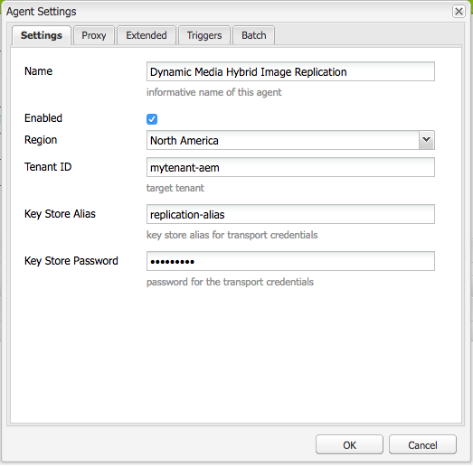
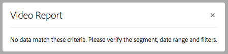

# Configurare Dynamic Media - Modalità ibrida {#configuring-dynamic-media-hybrid-mode}

Dynamic Media-Hybrid deve essere abilitato e configurato per l’uso. A seconda del caso d’uso, Dynamic Media offre diversi [configurazioni supportate](#supported-dynamic-media-configurations).

>[!NOTE]
>
>Se desideri configurare ed eseguire Dynamic Media in modalità di esecuzione Scene7, consulta [Configurare Dynamic Media - Modalità Scene7](/help/assets/config-dms7.md).
>
>Se si desidera configurare ed eseguire Dynamic Media in modalità di esecuzione ibrida, seguire le istruzioni riportate in questa pagina.

Ulteriori informazioni sull&#39;utilizzo di [video](/help/assets/video.md) in Dynamic Media.

>[!NOTE]
>
>Se utilizzi Adobe Experience Manager configurato per ambienti diversi, ad esempio uno per lo sviluppo, la gestione temporanea e la produzione live, configura i Cloud Services Dynamic Media per ciascun ambiente.

>[!NOTE]
>
>In caso di problemi con la configurazione di Dynamic Media, consulta i file di registro specifici di Dynamic Media. Questi file vengono installati automaticamente quando si attiva Dynamic Media:
>
>* `s7access.log`
>* `ImageServing.log`
>
>Sono documentati in [Monitorare e gestire l’istanza Experience Manager](/help/sites-deploying/monitoring-and-maintaining.md).

La pubblicazione e la distribuzione ibride sono una funzionalità fondamentale dell’aggiunta di Dynamic Media ad Adobe Experience Manager. La pubblicazione ibrida consente di distribuire le risorse Dynamic Media, come immagini, set e video, dal cloud anziché dai nodi di pubblicazione Experienci Manager.

Altri contenuti, come i visualizzatori Dynamic Media, le pagine del sito e il contenuto statico continuano a essere trasmessi dai nodi di pubblicazione dell’Experience Manager.

I clienti di Dynamic Media devono utilizzare la distribuzione ibrida come meccanismo di distribuzione per tutti i contenuti Dynamic Media.

## Architettura di pubblicazione ibrida per video {#hybrid-publishing-architecture-for-videos}


## Architettura di pubblicazione ibrida per le immagini {#hybrid-publishing-architecture-for-images}


## Configurazioni Dynamic Media supportate {#supported-dynamic-media-configurations}

Le attività di configurazione seguenti fanno riferimento ai seguenti termini:

| **Termine** | **Dynamic Media abilitato** | **Descrizione** |
|---|---|---|
| Nodo Autore Experience Manager | Segno di spunta bianco in un cerchio verde | Il nodo di authoring che distribuisci in locale o tramite Managed Services. |
| Nodo pubblicazione Experience Manager | &quot;X&quot; bianca in un quadrato rosso. | Il nodo di pubblicazione che distribuisci in locale o tramite Managed Services. |
| Nodo di pubblicazione servizio immagini | Segno di spunta bianco in un cerchio verde. | Il nodo di pubblicazione eseguito sui centri dati gestiti da Adobe. Fa riferimento all’URL del servizio per le immagini. |

È possibile scegliere di implementare Dynamic Media solo per l&#39;imaging, solo per il video o per l&#39;imaging e il video. Per determinare i passaggi per la configurazione di Dynamic Media per lo scenario specifico, consulta la tabella seguente.

<table>
 <tbody>
  <tr>
   <td><strong>Scenario</strong></td>
   <td ><strong>Come funziona</strong></td>
   <td><strong>Passaggi di configurazione</strong></td>
  </tr>
  <tr>
   <td>Distribuisci SOLO immagini in produzione</td>
   <td>Le immagini vengono distribuite tramite server nei data center Adobe di tutto il mondo e quindi memorizzate nella cache da una rete CDN per ottenere prestazioni scalabili e portata globale.</td>
   <td>
    <ol>
     <li>Sull’Experience Manager <strong>autore</strong> nodo, <a href="#enabling-dynamic-media">abilita Dynamic Media</a>.</li>
     <li>Configurare l’imaging in <a href="#configuring-dynamic-media-cloud-services">Cloud Services Dynamic Media</a>.</li>
     <li><a href="#configuring-image-replication">Configurare la replica delle immagini</a>.</li>
     <li><a href="#replicating-catalog-settings">Replica impostazioni catalogo</a>.</li>
     <li><a href="#replicating-viewer-presets">Replica predefiniti visualizzatore</a>.</li>
     <li><a href="#using-default-asset-filters-for-replication">Utilizzare i filtri delle risorse predefiniti per la replica</a>.</li>
     <li><a href="#configuring-dynamic-media-image-server-settings">Configura impostazioni server immagini Dynamic Media</a>.</li>
     <li><a href="#delivering-assets">Consegna risorse</a>.</li>
    </ol> </td>
  </tr>
  <tr>
   <td>Distribuisci SOLO immagini in pre-produzione (Dev, QE, Stage e così via).</td>
   <td>Le immagini vengono distribuite tramite il nodo di pubblicazione Experience Manager. In questo scenario, poiché il traffico è minimo, non è necessario fornire immagini al data center di Adobe. Inoltre, consente di visualizzare in anteprima i contenuti prima del lancio ufficiale.</td>
   <td>
    <ol>
     <li>Sull’Experience Manager <strong>autore</strong> nodo, <a href="#enabling-dynamic-media">abilita Dynamic Media</a>.</li>
     <li>Su Experience Manager <strong>pubblicare</strong> nodo, <a href="#enabling-dynamic-media">abilita Dynamic Media</a>.</li>
     <li><a href="#replicating-viewer-presets">Replica predefiniti visualizzatore</a>.</li>
     <li>Configurazione <a href="#setting-up-asset-filters-for-imaging-in-non-production-deployments">filtro risorse per immagini non di produzione</a>.</li>
     <li><a href="#configuring-dynamic-media-image-server-settings">Configurare le impostazioni del server immagini di Dynamic Media.</a></li>
     <li><a href="#delivering-assets">Distribuire le risorse.</a></li>
    </ol> </td>
  </tr>
  <tr>
   <td>Distribuisci SOLO video in qualsiasi ambiente (produzione, sviluppo, QE, stage e così via)</td>
   <td>I video vengono consegnati e memorizzati nella cache da una rete CDN per garantire prestazioni scalabili e una portata globale. L’immagine del poster video (miniatura del video che compare prima dell’inizio della riproduzione) viene consegnata dall’istanza Publish di Experience Manager.</td>
   <td>
    <ol>
     <li>Sull’Experience Manager <strong>autore</strong> nodo, <a href="#enabling-dynamic-media">abilita Dynamic Media</a>.</li>
     <li>Sull’Experience Manager <strong>pubblicare</strong> nodo, <a href="#enabling-dynamic-media">abilita Dynamic Media</a> (l'istanza Publish fornisce l'immagine del poster video e fornisce i metadati per la riproduzione del video).</li>
     <li>Configurare i video in <a href="#configuring-dynamic-media-cloud-services">Cloud Services Dynamic Media.</a></li>
     <li><a href="#replicating-viewer-presets">Replica predefiniti visualizzatore</a>.</li>
     <li>Configurazione <a href="#setting-up-asset-filters-for-video-only-deployments">filtro risorse solo per video</a>.</li>
     <li><a href="#delivering-assets">Distribuire le risorse.</a></li>
    </ol> </td>
  </tr>
  <tr>
   <td>Distribuisci sia immagini che video in produzione</td>
   <td><p>I video vengono consegnati e memorizzati nella cache da una rete CDN per garantire prestazioni scalabili e una portata globale. Le immagini e le immagini dei poster video vengono distribuite tramite server nei data center Adobe di tutto il mondo e quindi memorizzate nella cache da una rete CDN per ottenere prestazioni scalabili e una portata globale.</p> <p>Consulta le sezioni precedenti per configurare l’immagine o il video in pre-produzione. </p> </td>
   <td>
    <ol>
     <li>Sull’Experience Manager <strong>autore</strong> nodo, <a href="#enabling-dynamic-media">abilita Dynamic Media</a>.</li>
     <li>Configurare i video in <a href="#configuring-dynamic-media-cloud-services">Cloud Services Dynamic Media.</a></li>
     <li>Configurare l’imaging in <a href="#configuring-dynamic-media-cloud-services">Cloud Services Dynamic Media.</a></li>
     <li><a href="#configuring-image-replication">Configurare la replica delle immagini</a>.</li>
     <li><a href="#replicating-catalog-settings">Replica impostazioni catalogo</a>.</li>
     <li><a href="#replicating-viewer-presets">Replica predefiniti visualizzatore</a>.</li>
     <li><a href="#using-default-asset-filters-for-replication">Utilizza i filtri delle risorse predefiniti per la replica.</a></li>
     <li><a href="#configuring-dynamic-media-image-server-settings">Configurare le impostazioni del server immagini di Dynamic Media.</a></li>
     <li><a href="#delivering-assets">Distribuire le risorse.</a></li>
    </ol> </td>
  </tr>
 </tbody>
</table>

## Abilita Dynamic Media {#enabling-dynamic-media}

[Dynamic Media](https://business.adobe.com/products/experience-manager/assets/dynamic-media.html) è disattivato per impostazione predefinita. Per sfruttare le funzioni di Dynamic Media, è necessario abilitare Dynamic Media utilizzando `dynamicmedia` modalità di esecuzione come, ad esempio, `publish` modalità di esecuzione. Prima di abilitare, assicurati di rivedere [requisiti tecnici](/help/sites-deploying/technical-requirements.md#requirements-for-aem-dynamic-media-add-on).

>[!NOTE]
>
>L&#39;abilitazione di Dynamic Media tramite la modalità di esecuzione sostituisce le funzionalità di cui agli Experience Manager Experienci Manager 6.1 e 6.0, in cui è stato abilitato Dynamic Media impostando `dynamicMediaEnabled` contrassegna per **[!UICONTROL true]**. Questo flag non ha alcuna funzionalità nell’Experience Manager 6.2 e versioni successive. Inoltre, non è necessario riavviare l&#39;avvio rapido per abilitare Dynamic Media.

Attivando Dynamic Media, le funzioni di Dynamic Media sono disponibili nell’interfaccia utente e ogni risorsa di immagine caricata riceve un *cqdam.pyramid.tiff* rendering utilizzato per la consegna rapida di rappresentazioni di immagini dinamiche. Tali PTIFF presentano vantaggi significativi quali i seguenti:

* Possibilità di gestire una sola immagine di origine primaria e generare al volo infinite rappresentazioni senza ulteriore spazio di archiviazione.
* Possibilità di utilizzare la visualizzazione interattiva come zoom, panoramica e rotazione.

Se desideri utilizzare Dynamic Media Classic in Experience Manager, non abilitare Dynamic Media a meno che non utilizzi una [scenario specifico](/help/sites-administering/scene7.md#aem-scene-integration-versus-dynamic-media). Dynamic Media è disabilitato a meno che Dynamic Media non venga abilitato tramite la modalità di esecuzione.

Per attivare Dynamic Media, è necessario attivare la modalità di esecuzione di Dynamic Media dalla riga di comando o dal nome del file quickstart.

**Per abilitare Dynamic Media:**

1. Nella riga di comando, quando si avvia l&#39;avvio rapido, eseguire le operazioni seguenti:

   * Aggiungi `-r dynamicmedia` alla fine della riga di comando all’avvio del file jar.

   ```shellsession {.line-numbers}
   java -Xmx4096m -Doak.queryLimitInMemory=500000 -Doak.queryLimitReads=500000 -jar cq-quickstart-6.5.0.jar -r dynamicmedia
   ```

   Se si pubblica in s7delivery, è necessario includere anche i seguenti argomenti trustStore:

   ```shellsession {.line-numbers}
   -Djavax.net.ssl.trustStore=<absoluteFilePath>/customerTrustStoreFileName>
   
    -Djavax.net.ssl.trustStorePassword=<passwordForTrustStoreFile>
   ```

1. Richiesta `https://localhost:4502/is/image` e accertarsi che Image Server sia in esecuzione.

   >[!NOTE]
   >
   >Per risolvere i problemi relativi a Dynamic Media, vedi i seguenti registri in `crx-quickstart/logs/` directory:
   >
   >* ImageServer&lt;portid>-&lt;yyyy>&lt;mm>&lt;dd>.log: il registro ImageServer fornisce statistiche e informazioni analitiche utilizzate per analizzare il comportamento del processo interno ImageServer.

   Esempio di nome di file di registro di Image Server: `ImageServer-57346-2020-07-25.log`
   * s7access-&lt;yyyy>&lt;mm>&lt;dd>.log: il registro s7access registra ogni richiesta effettuata a Dynamic Media tramite `/is/image` e `/is/content`.

   Questi registri vengono utilizzati solo quando Dynamic Media è abilitato. Non sono inclusi nella **Download completo** pacchetto generato da `system/console/status-Bundlelist` pagina; quando si chiama l&#39;Assistenza clienti in caso di problemi con Dynamic Media, aggiungere entrambi questi registri al problema.

### Se hai installato Experience Manager su una porta o un percorso contestuale diverso ... {#if-you-installed-aem-to-a-different-port-or-context-path}

Se distribuisci [Experience Manager a un server applicazioni](/help/sites-deploying/application-server-install.md) e se Dynamic Media è abilitato, è necessario configurare **dominio autonomo** in Externalizer. In caso contrario, la generazione delle miniature per le risorse non funziona correttamente per le risorse Dynamic Media.

Inoltre, se esegui quickstart su una porta o un percorso contestuale diverso, devi modificare anche il **dominio autonomo**.

Quando Dynamic Media è abilitato, le rappresentazioni delle miniature statiche per le risorse immagine vengono generate utilizzando Dynamic Media. Affinché la generazione delle miniature funzioni correttamente per Dynamic Media, l’Experience Manager deve eseguire una richiesta URL a se stesso e deve conoscere sia il numero di porta che il percorso contestuale.

Ad Experience Manager:

* Il **dominio autonomo** nel [Esternalizzatore](/help/sites-developing/externalizer.md) viene utilizzato per recuperare sia il numero di porta che il percorso contestuale.
* In caso negativo **dominio autonomo** è configurato, il numero di porta e il percorso contestuale vengono recuperati dal servizio HTTP Jetty.

In un Experience Manager di distribuzione QuickStart WAR, non è possibile derivare il numero di porta e il percorso contestuale, pertanto è necessario configurare un **dominio autonomo**. Consulta [Documentazione di Externalizer](/help/sites-developing/externalizer.md) su come configurare **dominio autonomo**.

>[!NOTE]
In un [Experience Manager di implementazione autonoma di Quickstart](/help/sites-deploying/deploy.md), a **dominio autonomo** in genere non è necessario configurarlo perché il numero di porta e il percorso contestuale possono essere configurati automaticamente. Tuttavia, se tutte le interfacce di rete sono disattivate, è necessario configurare **dominio autonomo**.

## Disattiva Dynamic Media  {#disabling-dynamic-media}

Dynamic Media non è attivato per impostazione predefinita. Tuttavia, se Dynamic Media è stato abilitato in precedenza, è possibile disattivarlo in un secondo momento.

Per disattivare Dynamic Media dopo averlo abilitato, rimuovere `-r dynamicmedia` flag di modalità di esecuzione.

**Per disattivare Dynamic Media:**

1. Nella riga di comando, quando si avvia l&#39;avvio rapido, è possibile effettuare una delle seguenti operazioni:

   * Non aggiungere `-r dynamicmedia` alla riga di comando all’avvio del file jar.

   ```shellsession {.line-numbers}
   java -Xmx4096m -Doak.queryLimitInMemory=500000 -Doak.queryLimitReads=500000 -jar cq-quickstart-6.5.0.jar
   ```

1. Richiesta `https://localhost:4502/is/image`. Viene visualizzato un messaggio che informa che Dynamic Media è disabilitato.

   >[!NOTE]
   Dopo aver disabilitato la modalità di esecuzione di Dynamic Media, il passaggio del flusso di lavoro che genera `cqdam.pyramid.tiff` la rappresentazione viene ignorata automaticamente. Disattiva inoltre il supporto della rappresentazione dinamica e altre funzioni di Dynamic Media.
   Inoltre, quando la modalità di esecuzione di Dynamic Media è disabilitata dopo la configurazione del server Experience Manager, tutte le risorse caricate in tale modalità di esecuzione non sono più valide.

## (Facoltativo) Migrazione di predefiniti e configurazioni Dynamic Media da 6.3 a 6.5 Senza downtime {#optional-migrating-dynamic-media-presets-and-configurations-from-to-zero-downtime}

Se aggiorni Experience Manager - Dynamic Media dalla versione 6.3 alla versione 6.5 (che ora include la possibilità di zero implementazioni con tempi di inattività), devi eseguire il seguente comando curl. Il comando migra tutti i predefiniti e le configurazioni da `/etc` a `/conf` in CRXDE Lite.

>[!NOTE]
Se esegui l’istanza Experience Manager in modalità di compatibilità, ovvero se hai installato il pacchetto di compatibilità, non è necessario eseguire questi comandi.

Per tutti gli aggiornamenti, con o senza il pacchetto di compatibilità, puoi copiare i predefiniti predefiniti visualizzatore forniti originariamente con Dynamic Media eseguendo il seguente comando curl Linux®:

`curl -u admin:admin -X POST https://<server_address>:<server_port>/libs/settings/dam/dm/presets/viewer.pushviewerpresets.json`

Per migrare le configurazioni e i predefiniti visualizzatore personalizzati creati da `/etc` a `/conf`, esegui il seguente comando curl Linux®:

`curl -u admin:admin -X POST https://<server_address>:<server_port>/libs/settings/dam/dm/presets.migratedmcontent.json`

## Configurare la replica delle immagini {#configuring-image-replication}

La distribuzione delle immagini Dynamic Media funziona pubblicando le risorse immagine, incluse le miniature video, da Experience Manager Author e replicandole nel servizio di replica on-demand di Adobe (URL del servizio di replica). Le risorse vengono quindi consegnate tramite il servizio di consegna delle immagini on-demand (URL del servizio per le immagini).

Effettua le seguenti operazioni:

1. [Configurare l’autenticazione](#setting-up-authentication).
1. [Configurare l’agente di replica](#configuring-the-replication-agent).

L’agente di replica pubblica le risorse Dynamic Media, ad esempio immagini, metadati video e imposta il servizio immagini ospitato dagli Adobi. L&#39;agente di replica non è abilitato per impostazione predefinita.

Dopo aver configurato l’agente di replica, devi [verifica e verifica che sia stato configurato correttamente](#validating-the-replication-agent-for-dynamic-media). In questa sezione vengono descritte queste procedure.

>[!NOTE]
Il limite di memoria predefinito per la creazione di file PTIFF è di 3 GB per tutti i flussi di lavoro. Ad esempio, è possibile elaborare un&#39;immagine che richiede 3 GB di memoria mentre gli altri flussi di lavoro sono in pausa, oppure 10 immagini in parallelo che richiedono 300 MB di memoria ciascuna.
Il limite di memoria è configurabile e si adatta alla disponibilità delle risorse di sistema e al tipo di contenuto dell’immagine in fase di elaborazione. Se disponi di numerose risorse di grandi dimensioni e di memoria sufficiente sul sistema, puoi aumentare questo limite per garantire che le immagini vengano elaborate in parallelo.
Un&#39;immagine che richiede più del limite massimo di memoria viene rifiutata.
Per modificare il limite di memoria per la creazione di file PTIFF, passare a **[!UICONTROL Strumenti]** > **[!UICONTROL Operazioni]** > **[!UICONTROL Console web]** > **[!UICONTROL Adobe CQ Scene7 PTiffManager]** e modificare la **[!UICONTROL maxMemory]** valore.

### Configurare l’autenticazione {#setting-up-authentication}

Imposta l’autenticazione di replica sull’istanza di authoring per replicare le immagini nel servizio di consegna delle immagini di Dynamic Media. Ottieni prima un KeyStore e poi salvalo in **[!UICONTROL dynamic-media-replication]** e configurarlo. L’amministratore della società ha ricevuto un’e-mail di benvenuto con il file KeyStore e le credenziali necessarie durante il processo di provisioning. Se non hai ricevuto queste informazioni, contatta l’Assistenza clienti Adobe.

**Per impostare l&#39;autenticazione:**

1. Se non disponi già del file e della password, contatta l’Assistenza clienti Adobe per il file KeyStore e la password. Queste informazioni sono una parte necessaria del provisioning. Associa le chiavi al tuo account.

1. In Experience Manager, seleziona il logo dell’Experience Manager per accedere alla console di navigazione globale, quindi passa a **[!UICONTROL Strumenti]** > **[!UICONTROL Sicurezza]** > **[!UICONTROL Utenti]**.

1. Nella pagina Gestione utente, passa a **[!UICONTROL dynamic-media-replication]** , quindi seleziona per aprire.

   

1. Nella pagina Modifica impostazioni utente per la replica di elementi multimediali dinamici, seleziona la **[!UICONTROL Registro chiavi]** , quindi seleziona **[!UICONTROL Crea registro chiavi]**.

   

1. Immettere una password e confermarla in **[!UICONTROL Imposta password di accesso al registro chiavi]** .

   >[!NOTE]
   Memorizzare la password perché è necessario immetterla nuovamente quando si configura l&#39;agente di replica in un secondo momento.

   

1. Il giorno **[!UICONTROL Modifica impostazioni utente per la replica di elementi multimediali dinamici]** , espandere **Aggiungi chiave privata da file registro chiavi** e aggiungere quanto segue (vedere le immagini che seguono):

   * In **[!UICONTROL Nuovo alias]** immettere il nome di un alias che si desidera utilizzare successivamente nella configurazione di replica. Ad esempio, puoi utilizzare `replication` come alias.
   * Seleziona **[!UICONTROL File registro chiavi]**. Passa al file KeyStore fornito da Adobe, selezionalo, quindi seleziona **[!UICONTROL Apri]**.
   * In **[!UICONTROL Password file registro chiavi]** , immettere la password del file registro chiavi. La password è **non** La password del registro chiavi creata nel passaggio 5, ma che è l&#39;Adobe di password del file registro chiavi, è riportata nell&#39;e-mail di benvenuto inviata durante il provisioning. Contatta l’Assistenza clienti di Adobe se non hai ricevuto una password per il file KeyStore.
   * In **[!UICONTROL Password chiave privata]** immettere la password della chiave privata (può essere la stessa password della chiave privata fornita nel passaggio precedente). L’Adobe fornisce la password della chiave privata nell’e-mail di benvenuto inviata durante il provisioning. Se non hai ricevuto una password di chiave privata, contatta l’Assistenza clienti Adobe.
   * In **[!UICONTROL Alias chiave privata]** , immettere l&#39;alias della chiave privata. Ad esempio, `*companyname*-alias`. L’Adobe fornisce l’alias della chiave privata nell’e-mail di benvenuto inviata durante il provisioning. Se non hai ricevuto un alias chiave privata, contatta l’Assistenza clienti Adobe.

   

1. Seleziona **[!UICONTROL Salva e chiudi]** per salvare le modifiche apportate a questo utente.

   Quindi, devi [configurare l’agente di replica](#configuring-the-replication-agent).

### Configurare l’agente di replica {#configuring-the-replication-agent}

1. In Experience Manager, seleziona il logo dell’Experience Manager per accedere alla console di navigazione globale, quindi passa a **[!UICONTROL Strumenti]** > **[!UICONTROL Distribuzione]** > **[!UICONTROL Replica]** > **[!UICONTROL Agenti per creazione]**.
1. Nella pagina Agenti per l’authoring, seleziona **[!UICONTROL Replica immagine ibrida di Dynamic Media (s7delivery)]**.
1. Seleziona **[!UICONTROL Modifica]**.
1. Seleziona la **[!UICONTROL Impostazioni]** , quindi immetti quanto segue:

   * **[!UICONTROL Abilitato]** - Selezionare questa casella di controllo per abilitare l&#39;agente di replica.
   * **[!UICONTROL Regione]** - Imposta sulla regione appropriata: Nord America, Europa o Asia
   * **[!UICONTROL ID tenant]** - Questo valore è il nome dell’azienda/tenant che pubblica nel servizio di replica. Questo valore è l’ID tenant fornito da Adobe nell’e-mail di benvenuto inviata durante il provisioning. Se non hai ricevuto queste informazioni, contatta l’Assistenza clienti Adobe.
   * **[!UICONTROL Alias archivio chiavi]** - Questo valore è uguale al valore **Nuovo alias** valore impostato durante la generazione della chiave in [Impostazione dell&#39;autenticazione](#setting-up-authentication)ad esempio, `replication`. (Vedere il punto 7 in [Impostazione dell&#39;autenticazione](#setting-up-authentication).)
   * **[!UICONTROL Password archivio chiavi]** : password del registro chiavi creata al momento del tocco **[!UICONTROL Crea registro chiavi]**. L&#39;Adobe non fornisce questa password. Vedere il passaggio 5 di [Impostazione dell’autenticazione](#setting-up-authentication).

   L’immagine seguente mostra l’agente di replica con dati di esempio:

   

1. Seleziona **[!UICONTROL OK]**.

### Convalidare l’agente di replica per Dynamic Media {#validating-the-replication-agent-for-dynamic-media}

Per convalidare l’agente di replica per Dynamic Media, effettua le seguenti operazioni:

Seleziona **[!UICONTROL Verifica connessione]**. L’output di esempio è il seguente:

```shell
11.03.2016 10:57:55 - Transferring content for ReplicationAction{type=TEST, path[0]='/content/dam', time=1457722675402, userId='admin', revision='null'}
11.03.2016 10:57:55 - * Auth User: replication-receiver
11.03.2016 10:57:55 - * HTTP Version: 1.1
11.03.2016 10:57:55 - * Using OAuth 2.0 Authorization Grants
11.03.2016 10:57:55 - * OAuth 2.0 User: dynamic-media-replication
11.03.2016 10:57:55 - * OAuth 2.0 Token: '*****' initialized
11.03.2016 10:57:55 - Publishing: POST[https://replicate-na.assetsadobe.com:8580/is-publish/publish-receiver?Cmd=Test&RootId=xfpuu-6613]
11.03.2016 10:57:55 - Publish response: OK[]
11.03.2016 10:57:55 - Transfer succeeded in 141 ms for ReplicationAction{type=TEST, path[0]='/content/dam', time=1457722675402, userId='admin', revision='null'}
-------------------------------------------------------------------------------------------------------------------------------
Replication test succeeded
```

>[!NOTE]
È inoltre possibile eseguire una delle operazioni seguenti:
* Controlla i registri di replica per assicurarti che la risorsa sia replicata.
* Pubblica un’immagine. Seleziona l’immagine e seleziona **[!UICONTROL Visualizzatori]** nel menu a discesa, seleziona un predefinito visualizzatore. Seleziona **[!UICONTROL URL]**. Per verificare di poter visualizzare l’immagine, copia e incolla il percorso URL nel browser.
>


### Risoluzione dei problemi di autenticazione {#troubleshooting-authentication}

Di seguito sono riportati alcuni problemi che puoi riscontrare durante la configurazione dell’autenticazione con le relative soluzioni. Prima di verificare questi problemi, assicurati di aver configurato la replica.

#### Problema: codice di stato HTTP 401 con messaggio - autorizzazione richiesta {#problem-http-status-code-with-message-authorization-required}

Questo problema può essere causato da una mancata configurazione dell’archivio chiavi per `dynamic-media-replication` utente.

```shell
Replication test to s7delivery:https://s7bern.macromedia.com:8580/is-publish/
17.06.2016 18:54:43 - Transferring content for ReplicationAction{type=TEST, path[0]='/content/dam', time=1466214883309, userId='admin', revision='null'}
17.06.2016 18:54:43 - * Auth User: replication-receiver
17.06.2016 18:54:43 - * HTTP Version: 1.1
17.06.2016 18:54:43 - * Using OAuth 2.0 Authorization Grants
17.06.2016 18:54:43 - * OAuth 2.0 User: dynamic-media-replication
17.06.2016 18:54:43 - No OAuth token available. OAuth not initialized
17.06.2016 18:54:43 - * Using Client Auth SSL alias - replication-alias *
17.06.2016 18:54:43 - Publishing: POST[https://<localhost>:8580/is-publish//publish-receiver?Cmd=Test&RootId=brough]
17.06.2016 18:54:43 - Transfer failed for ReplicationAction{type=TEST, path[0]='/content/dam', time=1466214883309, userId='admin', revision='null'}. java.io.IOException: Failed to execute request
'https://<localhost>:8580/is-publish//publish-receiver?Cmd=Test&RootId=brough':
 Server returned status code 401 with message: Authorization required.
17.06.2016 18:54:43 - Error while replicating: com.day.cq.replication.ReplicationException: Transfer failed for ReplicationAction{type=TEST, path[0]='/content/dam', time=1466214883309,
 userId='admin', revision='null'}. java.io.IOException: Failed to execute request
'https://<localhost>:8580/is-publish//publish-receiver?Cmd=Test&RootId=brough':
 Server returned status code 401 with message: Authorization required.
```

**Soluzione:**
Verifica che la `KeyStore` viene salvato in **dynamic-media-replication** e viene fornita con la password corretta.

#### Problema: Impossibile Decrittografare La Chiave. Impossibile Decrittografare I Dati {#problem-could-not-decrypt-key-could-not-decrypt-data}

```xml
Replication test to s7delivery:https://<localhost>:8580/is-publish/
17.06.2016 19:00:16 - Transferring content for ReplicationAction{type=TEST, path[0]='/content/dam', time=1466215216662, userId='admin', revision='null'}
17.06.2016 19:00:16 - * Auth User: replication-receiver
17.06.2016 19:00:16 - * HTTP Version: 1.1
17.06.2016 19:00:16 - * Using OAuth 2.0 Authorization Grants
17.06.2016 19:00:16 - * OAuth 2.0 User: dynamic-media-replication
17.06.2016 19:00:16 - No OAuth token available. OAuth not initialized
17.06.2016 19:00:16 - * Using Client Auth SSL alias - replication-alias *
17.06.2016 19:00:16 - Transfer failed for ReplicationAction{type=TEST, path[0]='/content/dam', time=1466215216662, userId='admin', revision='null'}. java.lang.SecurityException: java.security.UnrecoverableKeyException: Could not decrypt key: Could not decrypt data.
```

**Soluzione:**
Controlla la password. La password salvata nell’agente di replica non è la stessa utilizzata per creare il keystore.

#### Problema: InvalidAlgorithmParameterException {#problem-invalidalgorithmparameterexception}

Questo problema è causato da un errore di configurazione nell’istanza Autore dell’Experience Manager. Il processo Java™ nell’istanza di authoring non sta ottenendo il corretto `javax.net.ssl.trustStore`. Questo errore viene visualizzato nel registro di replica:

```shell
14.04.2016 09:37:43 - Transfer failed for ReplicationAction{type=TEST, path[0]='/content/dam', time=1460651862089, userId='admin', revision='null'}. java.io.IOException: Failed to execute request 'https://<localhost>:8580/is-publish/publish-receiver?Cmd=Test&RootId=rbrough-osx2': java.lang.RuntimeException: Unexpected error: java.security.InvalidAlgorithmParameterException: the trustAnchors parameter must be non-empty
14.04.2016 09:37:43 - Error while replicating: com.day.cq.replication.ReplicationException: Transfer failed for ReplicationAction{type=TEST, path[0]='/content/dam', time=1460651862089, userId='admin', revision='null'}. java.io.IOException: Failed to execute request 'https://<localhost>:8580/is-publish/publish-receiver?Cmd=Test&RootId=rbrough-osx2': java.lang.RuntimeException: Unexpected error: java.security.InvalidAlgorithmParameterException: the trustAnchors parameter must be non-empty
```

Oppure il registro degli errori:

```shell
07.25.2019 12:00:59.893 *ERROR* [sling-threadpool-db2763bb-bc50-4bb5-bb64-10a09f432712-(apache-sling-job-thread-pool)-90-com_day_cq_replication_job_s7delivery(com/day/cq/replication/job/s7delivery)] com.day.cq.replication.Agent.s7delivery.queue Error during processing of replication.

java.io.IOException: Failed to execute request 'https://replicate-na.assetsadobe.com:8580/is-publish/publish-receiver?Cmd=Test&RootId=rbrough-osx': java.lang.RuntimeException: Unexpected error: java.security.InvalidAlgorithmParameterException: the trustAnchors parameter must be non-empty
        at com.scene7.is.catalog.service.publish.atomic.PublishingServiceHttp.executePost(PublishingServiceHttp.scala:195)
```

**Soluzione:**
Assicurati che il processo Java™ nell’istanza di authoring Experience Manager abbia la proprietà system `-Djavax.net.ssl.trustStore=` impostato su un truststore valido.

#### Problema: KeyStore non configurato o non inizializzato {#problem-keystore-is-either-not-set-up-or-it-is-not-initialized}

Questo problema è probabilmente causato da un hotfix o da un feature pack che sovrascrive il nodo utente di elementi multimediali dinamici o del keystore.

Esempio di registro di replica:

```shell
Replication test to s7delivery:https://replicate-na.assetsadobe.com/is-publish
02.08.2016 14:37:44 - Transferring content for ReplicationAction{type=TEST, path[0]='/content/dam', time=1470173864834, userId='admin', revision='null'}
02.08.2016 14:37:44 - * Auth User: replication-receiver
02.08.2016 14:37:44 - * HTTP Version: 1.1
02.08.2016 14:37:44 - * Using OAuth 2.0 Authorization Grants
02.08.2016 14:37:44 - * OAuth 2.0 User: dynamic-media-replication
02.08.2016 14:37:44 - Transfer failed for ReplicationAction{type=TEST, path[0]='/content/dam', time=1470173864834, userId='admin', revision='null'}. com.adobe.granite.keystore.KeyStoreNotInitialisedException: Uninitialised key store for user dynamic-media-replication
```

**Soluzione:**

1. Passare alla pagina Gestione utente:
   `localhost:4502/libs/granite/security/content/useradmin.html`
1. Nella pagina Gestione utente, passa a `dynamic-media-replication` , quindi seleziona per aprire.
1. Seleziona la **[!UICONTROL KeyStore]** scheda. Se il **[!UICONTROL Crea registro chiavi]** , è necessario ripetere i passaggi descritti in [Impostazione dell’autenticazione](#setting-up-authentication) prima.
1. Se è necessario ripristinare la configurazione di KeyStore, è necessario eseguire [Configurazione dell’agente di replica](/help/assets/config-dynamic.md#configuring-the-replication-agent) anche qui.

   Riconfigura l’agente di replica s7delivery.
   `localhost:4502/etc/replication/agents.author/s7delivery.html`

1. Seleziona **[!UICONTROL Verifica connessione]** in modo da poter verificare che la configurazione sia valida.

#### Problema: l’agente di pubblicazione utilizza SSL invece di OAuth {#problem-publish-agent-is-using-ssl-instead-of-oauth}

Questo problema è probabilmente causato da un hotfix o da un feature pack che non è stato installato correttamente o che ha sovrascritto le impostazioni.

Esempio di registro di replica:

```shell
01.08.2016 18:42:59 - Transferring content for ReplicationAction{type=TEST, path[0]='/content/dam', time=1470073379634, userId='admin', revision='null'}
01.08.2016 18:42:59 - * Auth User: replication-receiver
01.08.2016 18:42:59 - * HTTP Version: 1.1
01.08.2016 18:42:59 - * Using Client Auth SSL alias - replication-receiver *
01.08.2016 18:42:59 - Publishing: POST[https://replicate-eu.assetsadobe2.com:443/is-publish/publish-receiver?Cmd=Test&RootId=altayerstaging]
01.08.2016 18:42:59 - Transfer failed for ReplicationAction{type=TEST, path[0]='/content/dam', time=1470073379634, userId='admin', revision='null'}. java.io.IOException: Failed to execute request 'https://replicate-eu.assetsadobe2.com:443/is-publish/publish-receiver?Cmd=Test&RootId=rbroughstaging': Server returned status code 401 with message: Authorization required.
01.08.2016 18:42:59 - Error while replicating: com.day.cq.replication.ReplicationException: Transfer failed for ReplicationAction{type=TEST, path[0]='/content/dam', time=1470073379634, userId='admin', revision='null'}. java.io.IOException: Failed to execute request 'https://replicate-eu.assetsadobe2.com:443/is-publish/publish-receiver?Cmd=Test&RootId=rbroughstaging': Server returned status code 401 with message: Authorization required.
```

**Soluzione:**

1. Ad Experience Manager, passa a **[!UICONTROL Strumenti]** > **[!UICONTROL Generale]** > **[!UICONTROL CRXDE Lite]**.

   `localhost:4502/crx/de/index.jsp`

1. Passa al nodo dell’agente di replica s7delivery.
   `localhost:4502/crx/de/index.jsp#/etc/replication/agents.author/s7delivery/jcr:content`

1. Aggiungi questa impostazione all’agente di replica (booleano con valore impostato su **[!UICONTROL Vero]**):

   `enableOauth=true`

1. Nell’angolo in alto a sinistra della pagina, seleziona **[!UICONTROL Salva tutto]**.

### Verifica la configurazione {#testing-your-configuration}

L’Adobe consiglia di eseguire un test end-to-end della configurazione.

Prima di iniziare il test, assicurati di aver già eseguito le seguenti operazioni:

* Sono Stati Aggiunti Predefiniti Immagine.
* Configura **[!UICONTROL Configurazione Dynamic Media (Pre 6.3)]** in Cloud Services. Per questo test è necessario specificare l’URL del servizio immagini

**Per verificare la configurazione:**

1. Carica una risorsa immagine. In Assets, passa a **[!UICONTROL Crea]** > **[!UICONTROL File]** e selezionare il file.)
1. Attendi il completamento del flusso di lavoro.
1. Pubblica la risorsa immagine. (Seleziona la risorsa e fai clic su **[!UICONTROL Pubblicazione rapida]**.)
1. Per passare alle rappresentazioni dell’immagine, apri l’immagine e tocca **[!UICONTROL Rappresentazioni]**.

   

1. Seleziona una rappresentazione dinamica.
1. Per ottenere l’URL per questa risorsa, seleziona **[!UICONTROL URL]**.
1. Passa all’URL selezionato e controlla se l’immagine si comporta come previsto.

Un altro modo per verificare che le risorse siano state consegnate è aggiungere req=exists all’URL.

## Configurare Cloud Services Dynamic Media {#configuring-dynamic-media-cloud-services}

Il Cloud Service Dynamic Media supporta, tra le altre cose, la pubblicazione e la distribuzione ibride di immagini e video, l’analisi dei video e la codifica video.

Come parte della configurazione, devi immettere un ID di registrazione, un URL del servizio video, un URL del servizio immagini, un URL del servizio di replica e configurare l’autenticazione. Queste informazioni ti sono state inviate tramite e-mail nell’ambito del processo di provisioning dell’account. Se non hai ricevuto queste informazioni, contatta l’amministratore di Adobe Experience Manager o l’Assistenza clienti Adobe per ottenere le informazioni.

>[!NOTE]
Prima di configurare i Cloud Services Dynamic Media, assicurati di aver configurato l’istanza Publish. Prima di configurare i Cloud Services Dynamic Media è inoltre necessario impostare la replica.

**Per configurare i Cloud Services Dynamic Media:**

1. In Experience Manager, seleziona il logo dell’Experience Manager per accedere alla console di navigazione globale, quindi passa a **[!UICONTROL Strumenti]** > **[!UICONTROL Cloud Services]** > **[!UICONTROL Configurazione Dynamic Media (Pre-6.3)]**.
1. Nella pagina Browser configurazioni Dynamic Media, nel riquadro a sinistra, selezionare **[!UICONTROL globale]**, quindi seleziona **[!UICONTROL Crea]**.
1. In **[!UICONTROL Crea configurazione Dynamic Media]** digitare un titolo nel campo Titolo della finestra di dialogo.
1. Se stai configurando Dynamic Media per video,

   * In **[!UICONTROL ID registrazione]** digitare l&#39;ID di registrazione.
   * In **[!UICONTROL URL servizio video]** , immettere l&#39;URL del servizio video per Dynamic Media Gateway.

1. Se si sta configurando Dynamic Media per l&#39;imaging, nella **[!UICONTROL URL servizio immagini]** , immettere l&#39;URL del servizio immagini per Dynamic Media Gateway.
1. Seleziona **[!UICONTROL Salva]** per tornare alla pagina Browser configurazioni Dynamic Media.
1. Per accedere alla console di navigazione globale, seleziona il logo dell’Experience Manager.

## Configurare la generazione di rapporti video {#configuring-video-reporting}

Con Dynamic Media Hybrid è possibile configurare la generazione di rapporti video per più installazioni di Experience Manager.

**Quando utilizzare:** Al momento della configurazione di Dynamic Media Configuration (Pre 6.3), vengono avviate numerose funzioni, tra cui il reporting video. La configurazione crea una suite di rapporti in una società Analytics regionale. Se configuri più nodi di authoring, puoi creare una suite di rapporti separata per ciascuno di essi. Di conseguenza, i dati di reporting non sono coerenti tra le installazioni. Inoltre, se ogni nodo Author fa riferimento allo stesso server di pubblicazione ibrida, l’ultima installazione di Author modifica la suite di rapporti di destinazione per tutti i rapporti video. Questo problema sovraccarica il sistema Analytics con troppe suite di rapporti.

**Introduzione:** Configura i rapporti video completando le tre attività seguenti.

1. Crea un pacchetto di predefiniti per Video Analytics dopo aver configurato Configurazione Dynamic Media (Pre 6.3) sul primo nodo di authoring. Questa attività iniziale è importante perché consente a una nuova configurazione di continuare a utilizzare la stessa suite di rapporti.
1. Installare il pacchetto di predefiniti di analisi video in qualsiasi ***nuovo*** Nodo Author ***prima di*** configuri Configurazione Dynamic Media (Pre 6.3).
1. Verificare ed eseguire il debug dell&#39;installazione del pacchetto.

### Crea un pacchetto di predefiniti per Video Analytics dopo aver configurato il primo nodo Author {#creating-a-video-analytics-preset-package-after-configuring-the-first-author-node}

Al termine di questa attività, si disporrà di un file pacchetto contenente i predefiniti di Video Analytics. Questi predefiniti contengono una suite di rapporti, il server di tracciamento, lo spazio dei nomi di tracciamento e l’ID organizzazione di Experience Cloud, se disponibile.

1. Se non lo hai già fatto, configura Configurazione Dynamic Media (Pre 6.3).
1. (Facoltativo) Visualizza e copia l’ID suite di rapporti (devi avere accesso a JCR). Anche se non è necessario disporre dell’ID suite di rapporti, la convalida è più semplice.
1. Crea un pacchetto utilizzando Gestione pacchetti.
1. Modifica il pacchetto per includere un filtro.

   Ad Experience Manager: `/conf/global/settings/dam/dm/presets/analytics/jcr:content/userdata`

1. Crea il pacchetto.
1. Scarica o condividi il pacchetto di predefiniti di Analisi video in modo che possa essere condiviso con i nuovi nodi di authoring successivi.

### Installa il pacchetto di predefiniti per Video Analytics prima di configurare altri nodi di authoring {#installing-the-video-analytics-preset-package-before-you-configure-additional-author-nodes}

Assicurati di completare questa attività ***prima di*** configuri Configurazione Dynamic Media (Pre 6.3). In caso contrario, verrà creata un’altra suite di rapporti non utilizzata. Inoltre, anche se il reporting video continua a funzionare correttamente, la raccolta dei dati non è ottimizzata.

Assicurati che il pacchetto di predefiniti di Analytics video dal primo nodo Author sia accessibile sul nuovo nodo Author.

1. Carica in Gestione pacchetti il pacchetto di predefiniti di analisi video creato in precedenza.
1. Installa il pacchetto di predefiniti per Video Analytics.
1. Configurare La Configurazione Di Dynamic Media (Pre 6.3).

### Verificare ed eseguire il debug dell&#39;installazione del pacchetto {#verifying-and-debugging-the-package-installation}

1. Eseguire una delle operazioni seguenti per verificare e, se necessario, eseguire il debug dell&#39;installazione del pacchetto:

   * **Controlla il predefinito per Video Analytics tramite JCR.**
Per verificare il predefinito per Video Analytics tramite JCR, devi avere accesso a CRXDE Lite.

      Experience Manager: in CRXDE Lite, passa a `/conf/global/settings/dam/dm/presets/analytics/jcr:content/userdata`

      Come in `https://localhost:4502/crx/de/index.jsp#/conf/global/settings/dam/dm/presets/analytics/jcr%3Acontent/userdata`

      Se non hai accesso a CRXDE Lite sul nodo Author, puoi controllare il predefinito tramite il server di pubblicazione.

   * **Controlla il predefinito per analisi video tramite il server immagini**

      Per convalidare direttamente il predefinito per analisi video, effettua una richiesta Image Server req=userdata.
Ad esempio, per visualizzare il predefinito di Analytics sul nodo Author, puoi effettuare la seguente richiesta:

      `https://localhost:4502/is/image/conf/global/settings/dam/dm/presets/analytics?req=userdata`

      Per convalidare il predefinito sui server di pubblicazione, puoi effettuare una richiesta diretta simile al server di pubblicazione. Le risposte sono le stesse nei nodi Author e Publish. La risposta è simile alla seguente:

      ```
      marketingCloudOrgId=0FC4E86B573F99CC7F000101
       reportSuite=aemaem6397618-2018-05-23
       trackingNamespace=aemvideodal
       trackingServer=aemvideodal.d2.sc.omtrdc.net
      ```

   * **Controlla il predefinito per Video Analytics tramite lo strumento Video Reporting in Experience Manager**
Accedi a **[!UICONTROL Strumenti]** > **[!UICONTROL Risorse]** > **[!UICONTROL Generazione rapporti video]**

      `https://localhost:4502/mnt/overlay/dam/gui/content/s7dam/videoreports/videoreport.html`

      Se ricevi il seguente messaggio di errore, la suite di rapporti è disponibile ma non compilata. Questo errore è corretto e desiderato in una nuova installazione prima che il sistema raccolga i dati.
   

   Per generare i dati di reporting, carica e pubblica un video. Utilizzare **[!UICONTROL Copia URL]** ed esegui il video almeno una volta.

   Possono essere necessarie fino a 12 ore prima che i dati di reporting vengano compilati dall’utilizzo del Visualizzatore video.

   Se si verifica un errore e la suite di rapporti non è impostata correttamente, viene visualizzato il seguente avviso.

   

   Questo errore viene visualizzato anche se il reporting video viene eseguito prima di configurare i servizi di configurazione Dynamic Media (pre 6.3).

### Risolvere i problemi relativi alla configurazione di reporting per video {#troubleshooting-the-video-reporting-configuration}

* Durante l’installazione, a volte le connessioni al server API di Analytics subiscono un timeout. L&#39;installazione riprova la connessione 20 volte, ma non riesce. Quando si verifica questa situazione, il file di registro registra più errori. Cerca `SiteCatalystReportService`.
* Se non installi prima il pacchetto del predefinito di Analytics, potrebbe essere creata una nuova suite di rapporti.
* L’aggiornamento dall’Experience Manager 6.3 all’Experience Manager 6.4 o all’Experience Manager 6.4.1 e la successiva configurazione di Dynamic Media (precedente alla 6.3) generano comunque una suite di rapporti. Questo problema è noto e dovrebbe essere risolto per l&#39;Experience Manager 6.4.2.

### Informazioni sul predefinito di Video Analytics {#about-the-video-analytics-preset}

Il predefinito di Video Analytics, noto anche semplicemente come predefinito di analisi, viene memorizzato accanto ai predefiniti visualizzatore in Dynamic Media. È fondamentalmente lo stesso di un predefinito per visualizzatori, ma con informazioni utilizzate per configurare il reporting di AppMeasurement e Video Heartbeat.

Le proprietà del predefinito sono le seguenti:

* `reportSuite`
* `trackingServer`
* `trackingNamespace`
* `marketingCloudOrgId` (non presente nelle versioni di Experienci Manager precedenti)

Experience Manager 6.4 e versioni successive salvate questo predefinito in `/conf/global/settings/dam/dm/presets/analytics/jcr:content/userdata`

## Replica impostazioni catalogo {#replicating-catalog-settings}

Pubblica le tue impostazioni predefinite del catalogo come parte del processo di configurazione tramite JCR. Per replicare le impostazioni del catalogo:

1. In una finestra di Terminal, eseguire le operazioni seguenti:

   `curl -u admin:admin localhost:4502/libs/settings/dam/dm/presets/viewer.pushviewerpresets`

1. Ad Experience Manager, passa alla seguente posizione in CRXDE Lite (richiede privilegi di amministratore):

   `https://<*server*>:<*port*>/crx/de/index.jsp#/conf/global/settings/dam/dm/imageserver/`

1. Seleziona la **[!UICONTROL Replica]** scheda.
1. Seleziona **[!UICONTROL Replica]**.

## Replica predefiniti visualizzatore {#replicating-viewer-presets}

Da consegnare *una risorsa con un predefinito visualizzatore, devi replicare/pubblicare* il predefinito visualizzatore. (Tutti i predefiniti visualizzatore devono essere attivati *e* replicato per ottenere l’URL o il codice di incorporamento di una risorsa.
Consulta [Pubblica predefiniti visualizzatore](/help/assets/managing-viewer-presets.md#publishing-viewer-presets) per ulteriori informazioni.

>[!NOTE]
Per impostazione predefinita, il sistema visualizza diverse rappresentazioni quando selezionate **[!UICONTROL Rappresentazioni]** e vari predefiniti visualizzatore quando selezioni **[!UICONTROL Visualizzatori]** nella visualizzazione dei dettagli della risorsa. Può aumentare o diminuire il numero di visite. Consulta [Aumenta il numero di predefiniti immagine visualizzati](/help/assets/managing-image-presets.md#increasing-or-decreasing-the-number-of-image-presets-that-display) o [Aumenta il numero di predefiniti visualizzatore visualizzati](/help/assets/managing-viewer-presets.md#increasing-the-number-of-viewer-presets-that-display).

## Filtrare le risorse per la replica {#filtering-assets-for-replication}

Nelle implementazioni non Dynamic Media, puoi replicare *tutto* risorse (sia immagini che video) dall’ambiente di authoring Experience Manager al nodo di pubblicazione Experience Manager. Questo flusso di lavoro è necessario perché anche i server di pubblicazione Experience Manager distribuiscono le risorse.

Tuttavia, nelle implementazioni di Dynamic Media, poiché le risorse vengono distribuite tramite il cloud, non è necessario replicarle sui nodi Experience Manager Publish. Questo flusso di lavoro di &quot;pubblicazione ibrida&quot; evita costi di storage aggiuntivi e tempi di elaborazione più lunghi per la replica delle risorse. Altri contenuti, come i visualizzatori Dynamic Media, le pagine del sito e il contenuto statico continuano a essere trasmessi dai nodi di pubblicazione dell’Experience Manager.

Oltre a replicare le risorse, vengono replicate anche le seguenti non risorse:

* Configurazione di Dynamic Media Delivery: `/conf/global/settings/dam/dm/imageserver/jcr:content`
* Predefiniti immagini: `/conf/global/settings/dam/dm/presets/macros`
* Predefiniti visualizzatore: `/conf/global/settings/dam/dm/presets/viewer`

I filtri consentono di: *escludi* le risorse vengano replicate nel nodo di pubblicazione Experience Manager.

### Utilizzare i filtri delle risorse predefiniti per la replica {#using-default-asset-filters-for-replication}

Se si utilizza Dynamic Media per (1) l&#39;imaging in produzione *o* (2) per immagini e video, puoi utilizzare i filtri predefiniti che Adobe fornisce così come sono. I seguenti filtri sono attivi per impostazione predefinita:

<table>
 <tbody>
  <tr>
   <td> </td>
   <td><strong>Filtro</strong></td>
   <td><strong>Tipo MIME</strong></td>
   <td><strong>Rappresentazioni</strong></td>
  </tr>
  <tr>
   <td>Consegna immagini Dynamic Media</td>
   <td><p>filter-images</p> <p>set-filtri</p> <p> </p> </td>
   <td><p>Inizia con <strong>image/</strong></p> <p>Contiene <strong>application/</strong> e termina con <strong>set</strong>.</p> </td>
   <td>I "filter-images" predefiniti (applicabili alle risorse di immagini singole, comprese le immagini interattive) e i "filter-sets" (applicabili ai set 360 gradi, ai set di immagini, ai set di file multimediali diversi e ai set carosello) consentiranno di:
    <ul>
     <li>Includi immagini PTIFF e metadati per la replica (qualsiasi rappresentazione che inizia con <strong>cqdam</strong>).</li>
     <li>Escludi dalla replica le rappresentazioni dell’immagine originale e dell’immagine statica.</li>
    </ul> </td>
  </tr>
  <tr>
   <td>Consegna video Dynamic Media</td>
   <td>filter-video</td>
   <td>Inizia con <strong>video/</strong></td>
   <td>Il "filter-video" preconfigurato:
    <ul>
     <li>Includi rappresentazioni video proxy, miniature video/immagini poster, metadati (sia nella rappresentazione video principale che in quella video) per la replica (qualsiasi rappresentazione che inizia con <strong>cqdam</strong>).</li>
     <li>Escludi dalla replica il video originale e le rappresentazioni di miniature statiche.<br /> <br /> <strong>Nota:</strong> Le rappresentazioni dei video proxy non contengono dati binari, ma sono solo proprietà dei nodi. Pertanto, non vi è alcun impatto sulla dimensione dell’archivio del publisher.</li>
    </ul> </td>
  </tr>
  <tr>
   <td>Integrazione con Dynamic Media Classic (Scene7)</td>
   <td><p>filter-images</p> <p>set-filtri</p> <p>filter-video</p> </td>
   <td><p>Inizia con <strong>image/</strong></p> <p>Contiene <strong>application/</strong> e termina con <strong>set</strong>.</p> <p>Inizia con <strong>video/</strong></p> </td>
   <td><p>L’URI di trasporto deve puntare al server di pubblicazione di Experience Manager invece dell’URL del servizio di replica cloud di Dynamic Media Adobe. Impostate questo filtro per consentire a Dynamic Media Classic di consegnare le risorse al posto dell’istanza Publish di Experience Manager.</p> <p>I filtri predefiniti "filter-images", "filter-sets" e "filter-video" consentono di:</p>
    <ul>
     <li>Include immagini PTIFF, rappresentazioni di video proxy e metadati per la replica. Tuttavia, poiché non esistono in JCR-per coloro che eseguono Experience Manager - Integrazione Dynamic Media Classic-non fa effettivamente nulla.</li>
     <li>Escludi dalla replica l’immagine originale, le rappresentazioni di immagini statiche, il video originale e le rappresentazioni di miniature statiche. Al contrario, Dynamic Media Classic offre risorse video e di immagini.</li>
    </ul> </td>
  </tr>
 </tbody>
</table>

>[!NOTE]
I filtri si applicano ai tipi MIME e non possono essere specifici del percorso.

### Impostare filtri per le risorse per le distribuzioni di solo video {#setting-up-asset-filters-for-video-only-deployments}

Se utilizzi Dynamic Media solo per video, effettua le seguenti operazioni per impostare i filtri delle risorse per la replica:

1. In Experience Manager, seleziona il logo dell’Experience Manager per accedere alla console di navigazione globale, quindi passa a **[!UICONTROL Strumenti]** > **[!UICONTROL Distribuzione]** > **[!UICONTROL Replica]** > **[!UICONTROL Agenti per creazione]**.
1. Nella pagina Agenti per l’authoring, seleziona **[!UICONTROL Agente predefinito (pubblicazione)]**.
1. Seleziona **[!UICONTROL Modifica]**.
1. In **[!UICONTROL Impostazioni agente]** nella finestra di dialogo **[!UICONTROL Impostazioni]** scheda, spunta **[!UICONTROL Abilitato]** per attivare l&#39;agente.
1. Seleziona **[!UICONTROL OK]**.
1. Ad Experience Manager, passa a **[!UICONTROL Strumenti]** > **[!UICONTROL Generale]** > **[!UICONTROL CRXDE Lite]**.
1. Nella struttura di cartelle a sinistra, passa a `/etc/replication/agents.author/dynamic_media_replication/jcr:content/damRenditionFilters`
1. Individua **[!UICONTROL filter-video]**, fai clic con il pulsante destro del mouse su di esso, quindi seleziona **[!UICONTROL Copia]**.
1. Nella struttura di cartelle a sinistra, passa a `/etc/replication/agents.author/publish`
1. Individua `jcr:content`, fai clic con il pulsante destro del mouse su di esso, quindi seleziona **[!UICONTROL Incolla]**.

Questi passaggi configurano l’istanza Publish di Experience Manager per fornire l’immagine del poster video e i metadati video necessari per la riproduzione, mentre il video stesso viene distribuito dal Cloud Service Dynamic Media. Il filtro esclude inoltre dalla replica il video originale e le rappresentazioni statiche delle miniature, che non sono necessarie nell’istanza Publish.

### Impostare filtri risorse per l’imaging in implementazioni non di produzione {#setting-up-asset-filters-for-imaging-in-non-production-deployments}

Se utilizzi Dynamic Media per l’imaging in implementazioni non di produzione, segui la procedura riportata di seguito per impostare i filtri delle risorse per la replica:

1. In Experience Manager, seleziona il logo dell’Experience Manager per accedere alla console di navigazione globale, quindi passa a **[!UICONTROL Strumenti]** > **[!UICONTROL Distribuzione]** > **[!UICONTROL Replica]** > **[!UICONTROL Agenti per creazione]**.
1. Nella pagina Agenti per l’authoring, seleziona **[!UICONTROL Agente predefinito (pubblicazione)]**.
1. Seleziona **[!UICONTROL Modifica]**.
1. In **[!UICONTROL Impostazioni agente]** nella finestra di dialogo **[!UICONTROL Impostazioni]** scheda, spunta **[!UICONTROL Abilitato]** per attivare l&#39;agente.
1. Seleziona **[!UICONTROL OK]**.
1. Ad Experience Manager, passa a **[!UICONTROL Strumenti]** > **[!UICONTROL Generale]** > **[!UICONTROL CRXDE Lite]**.
1. Nella struttura di cartelle a sinistra, passa a `/etc/replication/agents.author/dynamic_media_replication/jcr:content/damRenditionFilters`

   

1. Individua **[!UICONTROL filter-images]**, fai clic con il pulsante destro del mouse su di esso, quindi seleziona **[!UICONTROL Copia]**.
1. Nella struttura di cartelle a sinistra, passa a `/etc/replication/agents.author/publish`
1. Individua `jcr:content`, fare clic con il pulsante destro del mouse su di esso, quindi passare a **[!UICONTROL Crea]** > **[!UICONTROL Crea nodo]**. Inserisci il nome `damRenditionFilters` di tipo `nt:unstructured`.
1. Individua `damRenditionFilters`, fai clic con il pulsante destro del mouse su di esso, quindi seleziona **[!UICONTROL Incolla]**.

Questi passaggi configurano l’istanza Publish di Experience Manager per distribuire le immagini all’ambiente non di produzione. Il filtro esclude inoltre dalla replica l’immagine originale e le rappresentazioni statiche, che non sono necessarie nell’istanza Publish.

>[!NOTE]
Se un autore dispone di molti filtri diversi, ogni agente deve essere assegnato a un utente diverso. Il codice granite applica un modello a filtro per utente. Avere sempre un utente diverso per ogni impostazione del filtro.
Si utilizzano più filtri in un server? Ad esempio, un filtro per la replica da pubblicare e un secondo filtro per s7delivery. In tal caso, assicurati che questi due filtri abbiano un **userId** loro assegnati nel `jcr:content` nodo. Vedi l’immagine seguente:


### Personalizzare i filtri delle risorse per la replica (facoltativo) {#customizing-asset-filters-for-replication}

1. In Experience Manager, seleziona il logo dell’Experience Manager per accedere alla console di navigazione globale, quindi passa a **[!UICONTROL Strumenti]** > **[!UICONTROL Generale]** > **[!UICONTROL CRXDE Lite]**.
1. Nella struttura di cartelle a sinistra, passa a `/etc/replication/agents.author/dynamic_media_replication/jcr:content/damRenditionFilters` per rivedere i filtri.

   

1. Per definire il tipo MIME per il filtro, puoi individuare il tipo MIME nel modo seguente:

   Nella barra a sinistra, espandi `content > dam > <locate_your_asset> >  jcr:content > metadata` quindi, nella tabella, individua `dc:format`.

   L’immagine seguente è un esempio del percorso di una risorsa per `dc:format`.

   

   Tieni presente che `dc:format` per la risorsa `Fiji Red.jpg` è `image/jpeg`.

   Per applicare questo filtro a tutte le immagini, indipendentemente dal formato, imposta il valore su `image/*` dove `*` è un’espressione regolare applicata a tutte le immagini di qualsiasi formato.

   Affinché il filtro venga applicato solo alle immagini di tipo JPEG, immettere il valore `image/jpeg`.

1. Definisci quali rappresentazioni includere o escludere dalla replica.

   I caratteri che puoi utilizzare per filtrare la replica includono:

   | Carattere da utilizzare | Filtrare le risorse per la replica |
   | --- | --- |
   | `*` | Carattere jolly |
   | `+` | Include le risorse per la replica |
   | `-` | Esclusione di risorse dalla replica |

   Accedi a `content/dam/<locate your asset>/jcr:content/renditions`.

   L’immagine seguente è un esempio delle rappresentazioni di una risorsa.

   

   Utilizzando l&#39;esempio precedente, se si desidera replicare solo il file PTIFF (Pyramid TIFF), immettere: `+cqdam,*` che include tutte le rappresentazioni che iniziano con `cqdam`. Nell’esempio, tale rappresentazione è `cqdam.pyramid.tiff`.

   Se desideri solo replicare l’originale, immetti `+original`.

## Configurazione delle impostazioni del server immagini di Dynamic Media {#configuring-dynamic-media-image-server-settings}

La configurazione di Dynamic Media Image Server comporta la modifica del bundle Adobe CQ Scene7 ImageServer e del bundle Adobe CQ Scene7 PlatformServer.

>[!NOTE]
Dynamic Media è pronto all’uso [dopo l&#39;attivazione](#enabling-dynamic-media). Tuttavia, è possibile scegliere di ottimizzare l&#39;installazione configurando Dynamic Media Image Server per soddisfare specifiche o requisiti specifici.

**Prerequisito** - *Prima di* Se si configura Dynamic Media Image Server, assicurarsi che la macchina virtuale di Windows® includa l&#39;installazione delle librerie Microsoft® Visual C++. Le librerie sono necessarie per eseguire Dynamic Media Image Server. È possibile [scaricare Microsoft® Visual C++ 2010 Redistributable Package (x64) qui](https://www.microsoft.com/en-us/download/details.aspx?id=26999).

Per configurare le impostazioni del server immagini di Dynamic Media:

1. Nell’angolo superiore sinistro dell’Experience Manager, seleziona **[!UICONTROL Adobe Experience Manager]** per accedere alla console di navigazione globale, passa a **[!UICONTROL Strumenti]** > **[!UICONTROL Operazioni]** > **[!UICONTROL Console web]**.
1. Nella pagina Configurazione della console web Adobe Experience Manager, vai a **[!UICONTROL OSGi]** > **[!UICONTROL Configurazione]** per elencare tutti i bundle attualmente in esecuzione in Experience Manager.

   I server di consegna Dynamic Media si trovano sotto i seguenti nomi nell’elenco:

   * `Adobe CQ Scene7 ImageServer`
   * `Adobe CQ Scene7 PlatformServer`

1. Nell’elenco dei bundle, a destra di Adobe CQ Scene7 ImageServer, seleziona **[!UICONTROL Modifica]** icona.
1. Nella finestra di dialogo Adobe CQ Scene7 ImageServer impostare i seguenti valori di configurazione:

   >[!NOTE]
   In genere, non è necessario modificare i valori predefiniti. Tuttavia, se modificate i valori predefiniti, dovete riavviare il bundle affinché le modifiche abbiano effetto.

   | Proprietà | Valore predefinito | Descrizione |
   | --- | --- | --- |
   | `TcpPort.name` | *`empty`* | Numero di porta da utilizzare per la comunicazione con il processo ImageServer. Per impostazione predefinita, la porta libera viene rilevata automaticamente. |
   | `AllowRemoteAccess.name` | *`empty`* | Consente o non consente l&#39;accesso remoto al processo ImageServer. Se false, il server immagini ascolta solo su localhost.<br> Le impostazioni predefinite di Externalizer che puntano a localhost devono specificare il dominio o l&#39;indirizzo IP effettivo dell&#39;istanza VM specifica. Il motivo è che localhost punta al sistema padre della VM.<br>I domini o gli indirizzi IP per la VM devono disporre di una voce di file host in modo che possa risolversi da sola. |
   | `MaxRenderRgnPixels` | 16 MP | Dimensione massima in megapixel sottoposta a rendering. |
   | `MaxMessageSize` | 16 MB | Dimensione massima del messaggio consegnato, in megabyte. |
   | `RandomAccessUrlTimeout` | 20 | Valore di timeout per il tempo in secondi in cui il server immagini attende che JCR risponda a una richiesta di riquadro con intervallo. |
   | `WorkerThreads` | 10 | Numero di thread di lavoro. |

1. Seleziona **[!UICONTROL Salva]**.
1. Nell’elenco dei bundle, a destra di Adobe CQ Scene7 Platform Server, seleziona **[!UICONTROL Modifica]** icona.
1. Nella finestra di dialogo Adobe CQ Scene7 Platform Server, imposta le seguenti opzioni di valore predefinite:

   >[!NOTE]
   Dynamic Media Image Server utilizza la propria cache del disco per memorizzare nella cache le risposte. La cache HTTP di Experience Manager e il Dispatcher non possono essere utilizzati per memorizzare nella cache le risposte dal server immagini Dynamic Media.

   | Proprietà | Valore predefinito | Descrizione |
   |---|---|---|
   | Cache abilitata | Selezionato | Indica se la cache di risposta è abilitata |
   | Directory principali cache | cache | Uno o più percorsi per le cartelle della cache di risposta. I percorsi relativi vengono risolti in base alla cartella interna del bundle s7imaging. |
   | Cache Max Size | 200000000 | Dimensione massima della cache di risposta in byte. |
   | Max voci cache | 100000 | Numero massimo di voci consentite nella cache. |

### Impostazioni predefinite manifesto {#default-manifest-settings}

Il manifesto predefinito consente di configurare le impostazioni predefinite utilizzate per generare le risposte di consegna Dynamic Media. Puoi ottimizzare la qualità (qualità JPEG, risoluzione, modalità di ricampionamento), il caching (scadenza) e impedire il rendering di immagini troppo grandi (defaultpix, defaultthumbpix, maxpix).

La posizione della configurazione del manifesto predefinita viene presa dal **[!UICONTROL Directory principale catalogo]** valore predefinito del **[!UICONTROL Adobe CQ Scene7 Platform Server]** pacchetto. Per impostazione predefinita, questo valore si trova nel seguente percorso in **[!UICONTROL Strumenti]** > **[!UICONTROL Generale]** > **[!UICONTROL CRXDE Lite]**

`/conf/global/settings/dam/dm/imageserver/`


È possibile modificare i valori delle proprietà, come descritto nella tabella seguente, immettendo nuovi valori.

Dopo aver modificato il manifesto predefinito, nell&#39;angolo superiore sinistro della pagina seleziona **[!UICONTROL Salva tutto]**.

Accertati di selezionare **[!UICONTROL Controllo dell’accesso]** a destra della scheda Proprietà, quindi impostare i privilegi di controllo dell&#39;accesso su `jcr:read` per tutti gli utenti di replica di elementi multimediali dinamici.


Impostazioni del manifesto e relativi valori predefiniti:

| Proprietà | Valore predefinito | Descrizione |
| --- | --- | --- |
| `bkgcolor` | `FFFFFF` | Colore di sfondo predefinito. Valore RGB utilizzato per riempire qualsiasi area di un’immagine di risposta che non contiene dati immagine effettivi. Vedi anche [ColoreBkg](https://experienceleague.adobe.com/docs/dynamic-media-developer-resources/image-serving-api/image-serving-api/attributes/r-bkgcolor.html#image-serving-api) nell’API Image Server. |
| `defaultpix` | `300,300` | Dimensioni vista predefinite. Se nella richiesta non sono specificate esplicitamente le dimensioni di visualizzazione mediante wid=, hei= o scl=, il server vincola le dimensioni delle immagini di risposta ai valori di larghezza e altezza specificati.<br>Specificati come due numeri interi, 0 o maggiori, separati da una virgola. Larghezza e altezza in pixel. Uno o entrambi i valori possono essere impostati su 0 per mantenerli liberi. Non si applica alle richieste nidificate/incorporate.<br>Vedi anche [DefaultPix](https://experienceleague.adobe.com/docs/dynamic-media-developer-resources/image-serving-api/image-serving-api/attributes/r-defaultpix.html#image-serving-api) nell’API Image Server.<br>Tuttavia, in genere si utilizza un predefinito visualizzatore o un predefinito immagine per distribuire la risorsa. L’impostazione predefinita è applicabile solo a una risorsa che non utilizza un predefinito visualizzatore o un predefinito immagine. |
| `defaultthumbpix` | `100,100` | Dimensioni miniatura predefinite. Utilizzato al posto dell&#39;attributo::DefaultPix per le richieste di miniature (`req=tmb`).<br>Il server vincola le dimensioni delle immagini di risposta ai valori di larghezza e altezza specificati. Questa azione è true se una richiesta di miniature (`req=tmb`) non specifica la dimensione in modo esplicito e non specifica la dimensione di visualizzazione in modo esplicito utilizzando `wid=`, `hei=`, o `scl=`.<br>Specificati come due numeri interi, 0 o maggiori, separati da una virgola. Larghezza e altezza in pixel. Uno o entrambi i valori possono essere impostati su 0 per mantenerli liberi.<br>Non si applica alle richieste nidificate/incorporate.<br>Vedi anche [DefaultThumbPix](https://experienceleague.adobe.com/docs/dynamic-media-developer-resources/image-serving-api/image-serving-api/attributes/r-defaultthumbpix.html#image-serving-api) nell’API Image Server. |
| `expiration` | `36000000` | Durata predefinita cache client. Specifica un intervallo di scadenza predefinito nel caso in cui un record catalogo non contenga un valore catalog::Expiration valido.<br>Numero reale, 0 o superiore. Numero di millisecondi mancanti alla scadenza dalla generazione dei dati di risposta. Impostate questo valore su 0 per far scadere immediatamente l&#39;immagine di risposta, disattivando di fatto la memorizzazione in cache del client. Per impostazione predefinita, questo valore è impostato su 10 ore, il che significa che se viene pubblicata una nuova immagine, sono necessarie 10 ore affinché la vecchia immagine lasci la cache dell’utente. Se la cache deve essere cancellata prima, contatta l’Assistenza clienti.<br>Vedi anche [Scade](https://experienceleague.adobe.com/docs/dynamic-media-developer-resources/image-serving-api/image-serving-api/attributes/r-expiration.html) nell’API Image Server. |
| `jpegquality` | `80` | Attributi di codifica predefiniti di JPEG. Specifica gli attributi predefiniti per le immagini di risposta di JPEG.<br>Numero intero e flag, separati da una virgola. Il primo valore è compreso nell&#39;intervallo 1..100 e definisce la qualità. Il secondo valore può essere 0 per il comportamento normale o 1 per disattivare il downsampling della cromaticità RGB utilizzato dai codificatori JPEG.<br>Vedi anche [JpegQuality](https://experienceleague.adobe.com/docs/dynamic-media-developer-resources/image-serving-api/image-serving-api/attributes/r-jpegquality.html#image-serving-api) nell’API Image Server. |
| `maxpix` | `2000,2000` | Limite dimensioni immagine di risposta. Larghezza e altezza massime per l’immagine di risposta restituite al client.<br>Il server restituisce un errore se una richiesta causa un&#39;immagine di risposta con larghezza o altezza maggiore dell&#39;attributo::MaxPix.<br>Vedi anche [MaxPix](https://experienceleague.adobe.com/docs/dynamic-media-developer-resources/image-serving-api/image-serving-api/attributes/r-maxpix.html#image-serving-api) nell’API Image Server. |
| `resmode` | `SHARP2` | Metodo di ricampionamento predefinito. Specifica gli attributi di ricampionamento e interpolazione predefiniti da utilizzare per il ridimensionamento dei dati immagine.<br>Utilizzato quando `resMode=` non è specificato in una richiesta.<br>I valori consentiti includono `BILIN`, `BICUB`, o `SHARP2`.<br>Enum. Imposta su 2 per `bilin`, 3 per `bicub`, o 4 per `sharp2` modalità di interpolazione. Utilizzare `sharp2` per ottenere risultati ottimali.<br>Vedi anche [ResMode](https://experienceleague.adobe.com/docs/dynamic-media-developer-resources/image-serving-api/image-serving-api/attributes/r-is-cat-resmode.html#image-serving-api) nell’API Image Server. |
| `resolution` | `72` | Risoluzione oggetto predefinita. Specifica una risoluzione predefinita dell&#39;oggetto nel caso in cui un record catalogo non contenga un valore catalog::Resolution valido.<br>Numero reale, maggiore di 0. Generalmente espresso come pixel per pollice, ma può anche essere espresso in altre unità, ad esempio pixel per metro.<br>Vedi anche [Risoluzione](https://experienceleague.adobe.com/docs/dynamic-media-developer-resources/image-serving-api/image-serving-api/attributes/r-resolution.html#image-serving-api) nell’API Image Server. |
| `thumbnailtime` | `1%,11%,21%,31%,41%,51%,61%,71%,81%,91%` | Questi valori rappresentano un’istantanea del tempo di riproduzione video e vengono trasmessi a [encoding.com](https://www.encoding.com/). Consulta [Informazioni sulla miniatura video](/help/assets/video.md#about-video-thumbnails-in-dynamic-media-hybrid-mode) per ulteriori informazioni. |

## Configurazione della gestione colore di Dynamic Media {#configuring-dynamic-media-color-management}

La gestione del colore di Dynamic Media consente di correggere il colore delle risorse da visualizzare in anteprima.

Con la correzione del colore, le risorse acquisite mantengono lo spazio colore (RGB, CMYK, Grigio) e il profilo colore incorporato nella rappresentazione piramidale TIFF generata. Quando si richiede una rappresentazione dinamica, il colore dell&#39;immagine viene corretto nello spazio colore di destinazione. Puoi configurare il profilo colore di output nelle impostazioni di pubblicazione di Dynamic Media in JCR.

La gestione del colore di Adobe utilizza i profili ICC (International Color Consortium), un formato definito dall&#39;ICC.

Potete configurare la gestione del colore di Dynamic Media e i predefiniti immagine utilizzando l&#39;output CMYK, RGB o Grigio. Consulta [Configurazione dei predefiniti immagine](/help/assets/managing-image-presets.md).

Nei casi di utilizzo avanzati potrebbe essere necessaria una configurazione manuale `icc=` modificatore per selezionare esplicitamente un profilo colore di output:

* `icc` - [https://experienceleague.adobe.com/docs/dynamic-media-developer-resources/image-serving-api/image-serving-api/http-protocol-reference/command-reference/r-icc.html](https://experienceleague.adobe.com/docs/dynamic-media-developer-resources/image-serving-api/image-serving-api/http-protocol-reference/command-reference/r-icc.html)

* `iccEmbed` - [https://experienceleague.adobe.com/docs/dynamic-media-developer-resources/image-serving-api/image-serving-api/http-protocol-reference/command-reference/r-iccembed.html](https://experienceleague.adobe.com/docs/dynamic-media-developer-resources/image-serving-api/image-serving-api/http-protocol-reference/command-reference/r-iccembed.html)

>[!NOTE]
Il set standard di profili colore di Adobe è disponibile solo se [Feature Pack 12445 da Software Distribution](https://experience.adobe.com/#/downloads/content/software-distribution/en/aem.html?package=/content/software-distribution/en/details.html/content/dam/aem/public/adobe/packages/cq630/featurepack/cq-6.3.0-featurepack-12445) installato. Tutti i feature pack e i service pack sono disponibili all&#39;indirizzo [Distribuzione di software](https://experience.adobe.com/#/downloads/content/software-distribution/it/aem.html). Feature Pack 12445 fornisce i profili colore di Adobe.


### Installazione di Feature Pack 12445 {#installing-feature-pack}

Per utilizzare le funzionalità di gestione del colore di Dynamic Media, installare feature pack 12445.

**Per installare il 12445 del feature pack:**

1. Accedi a [Distribuzione di software](https://experience.adobe.com/#/downloads/content/software-distribution/it/aem.html) e scaricare `cq-6.3.0-featurepack-12445`.

   Consulta [Come lavorare con i pacchetti](/help/sites-administering/package-manager.md) per ulteriori informazioni sull’utilizzo dei pacchetti in [!DNL Adobe Experience Manager].

1. Installare il feature pack.

### Configurazione dei profili colore predefiniti {#configuring-the-default-color-profiles}

Dopo aver installato il feature pack, configurare i profili colore predefiniti appropriati per abilitare la correzione del colore quando si richiedono i dati immagine RGB o CMYK.

**Per configurare i profili colore predefiniti:**

1. In entrata **[!UICONTROL Strumenti]** > **[!UICONTROL Generale]** > **[!UICONTROL CRXDE Lite]**, passa a `/conf/global/settings/dam/dm/imageserver/jcr:content` che contiene i profili predefiniti di Adobe Color.

   

1. Aggiungere una proprietà di correzione del colore scorrendo verso il basso del **[!UICONTROL Proprietà]** scheda. Immettere manualmente il nome, il tipo e il valore della proprietà, descritti nelle tabelle seguenti. Dopo aver immesso i valori, selezionare **[!UICONTROL Aggiungi]** e poi **[!UICONTROL Salva tutto]** per salvare i valori.

   Le proprietà di correzione del colore sono descritte nella **Proprietà correzioni colore** tabella. I valori che è possibile assegnare alle proprietà di correzione del colore si trovano nel **Profilo colore** tabella.

   Ad esempio, in **[!UICONTROL Nome]**, aggiungi `iccprofilecmyk`, seleziona **[!UICONTROL Tipo]** `String`, e aggiungi `WebCoated` as a **[!UICONTROL Valore]**. Quindi seleziona **[!UICONTROL Aggiungi]** e poi **[!UICONTROL Salva tutto]** per salvare i valori.

   

   **Tabella delle proprietà di correzione colore**

<table>
 <tbody>
  <tr>
   <td><strong>Proprietà</strong></td>
   <td><strong>Tipo</strong></td>
   <td><strong>Predefiniti</strong></td>
   <td><strong>Descrizione</strong></td>
  </tr>
  <tr>
   <td><a href="https://experienceleague.adobe.com/docs/dynamic-media-developer-resources/image-serving-api/image-serving-api/attributes/r-iccprofilergb.html">iccprofilergb</a></td>
   <td>Stringa</td>
   <td>&lt;empty&gt;</td>
   <td>Nome del profilo colore RGB predefinito.</td>
  </tr>
  <tr>
   <td><a href="https://experienceleague.adobe.com/docs/dynamic-media-developer-resources/image-serving-api/image-serving-api/attributes/r-iccprofilecmyk.html">iccprofilecmyk</a></td>
   <td>Stringa</td>
   <td>&lt;empty&gt;</td>
   <td>Nome del profilo colore CMYK predefinito.</td>
  </tr>
  <tr>
   <td><a href="https://experienceleague.adobe.com/docs/dynamic-media-developer-resources/image-serving-api/image-serving-api/attributes/r-iccprofilegray.html">iccprofilegray</a></td>
   <td>Stringa</td>
   <td>&lt;empty&gt;</td>
   <td>Nome del profilo colore grigio predefinito.</td>
  </tr>
  <tr>
   <td><a href="https://experienceleague.adobe.com/docs/dynamic-media-developer-resources/image-serving-api/image-serving-api/attributes/r-iccprofilesrcrgb.html">iccprofilesrcrgb</a></td>
   <td>Stringa</td>
   <td>&lt;empty&gt;</td>
   <td>Nome del profilo colore RGB predefinito utilizzato per le immagini RGB che non hanno un profilo colore incorporato</td>
  </tr>
  <tr>
   <td><a href="https://experienceleague.adobe.com/docs/dynamic-media-developer-resources/image-serving-api/image-serving-api/attributes/r-iccprofilesrccmyk.html">iccprofilesrccmyk</a></td>
   <td>Stringa</td>
   <td>&lt;empty&gt;</td>
   <td>Nome del profilo colore CMYK predefinito utilizzato per le immagini CMYK che non hanno un profilo colore incorporato.</td>
  </tr>
  <tr>
   <td><a href="https://experienceleague.adobe.com/docs/dynamic-media-developer-resources/image-serving-api/image-serving-api/attributes/r-iccprofilesrcgray.html">iccprofilesrcgray</a></td>
   <td>Stringa</td>
   <td>&lt;empty&gt;</td>
   <td>Nome del profilo colore grigio predefinito utilizzato per le immagini CMYK che non hanno un profilo colore incorporato.</td>
  </tr>
  <tr>
   <td><a href="https://experienceleague.adobe.com/docs/dynamic-media-developer-resources/image-serving-api/image-serving-api/attributes/r-iccblackpointcompensation.html">iccblackpointCOMPENSATION</a></td>
   <td>Booleano</td>
   <td>Vero</td>
   <td>Specifica se la compensazione del punto nero viene eseguita durante la correzione del colore. L’Adobe consiglia di attivare questa impostazione.</td>
  </tr>
  <tr>
   <td><a href="https://experienceleague.adobe.com/docs/dynamic-media-developer-resources/image-serving-api/image-serving-api/attributes/r-iccdither.html">iccdither</a></td>
   <td>Booleano</td>
   <td>False</td>
   <td>Specifica se il dithering viene eseguito durante la correzione del colore.</td>
  </tr>
  <tr>
   <td><a href="https://experienceleague.adobe.com/docs/dynamic-media-developer-resources/image-serving-api/image-serving-api/attributes/r-iccrenderintent.html">iccrenderintent</a></td>
   <td>Stringa</td>
   <td>relativo</td>
   <td><p>Specifica l'intento di rendering. I valori accettabili sono: <strong>percettivo, relativo, saturazione, assoluto. </strong><i></i>Adobe di consigli <strong>relativo </strong><i></i>come impostazione predefinita.</p> </td>
  </tr>
 </tbody>
</table>

>[!NOTE]
I nomi delle proprietà fanno distinzione tra maiuscole e minuscole e devono essere tutti minuscoli.

**Tabella profilo colore**

Sono installati i seguenti profili colore:

<table>
 <tbody>
  <tr>
   <th><p>Nome</p> </th>
   <th><p>Spazio colori</p> </th>
   <th><p>Descrizione</p> </th>
  </tr>
  <tr>
   <td>Adobe RGB</td>
   <td>RGB</td>
   <td>Adobe RGB (1998)</td>
  </tr>
  <tr>
   <td>AppleRGB</td>
   <td>RGB</td>
   <td>Apple RGB</td>
  </tr>
  <tr>
   <td>CIERGB</td>
   <td>RGB</td>
   <td>CIE RGB</td>
  </tr>
  <tr>
   <td>CoatedFogra27</td>
   <td>CMYK</td>
   <td>FOGRA27 rivestito (ISO 12647-2:2004)</td>
  </tr>
  <tr>
   <td>CoatedFogra39</td>
   <td>CMYK</td>
   <td>FOGRA39 rivestita (ISO 12647-2:2004)</td>
  </tr>
  <tr>
   <td>GraCol rivestito</td>
   <td>CMYK</td>
   <td>GracoL 2006 rivestito (ISO 12647-2:2004)</td>
  </tr>
  <tr>
   <td>ColorMatchRGB</td>
   <td>RGB</td>
   <td>ColorMatch RGB</td>
  </tr>
  <tr>
   <td>EuropaISOCoato</td>
   <td>CMYK</td>
   <td>Europa FOGRA27 con rivestimento ISO</td>
  </tr>
  <tr>
   <td>EuroscaleCoated</td>
   <td>CMYK</td>
   <td>Euro scale Coated v2</td>
  </tr>
  <tr>
   <td>EuroscaleNon rivestite</td>
   <td>CMYK</td>
   <td>Euro scale senza rivestimento v2</td>
  </tr>
  <tr>
   <td>JapanColorCoated</td>
   <td>CMYK</td>
   <td>Rivestito colore Giappone 2001</td>
  </tr>
  <tr>
   <td>JapanColorNewspaper</td>
   <td>CMYK</td>
   <td>Giornale Japan Color 2002</td>
  </tr>
  <tr>
   <td>JapanColorUncoated</td>
   <td>CMYK</td>
   <td>Japan Color 2001 non patinata</td>
  </tr>
  <tr>
   <td>JapanColorWebCoated</td>
   <td>CMYK</td>
   <td>Rivestimento Web Japan Color 2003</td>
  </tr>
  <tr>
   <td>JapanWebCoated</td>
   <td>CMYK</td>
   <td>Rivestito Web Giappone (Ad)</td>
  </tr>
  <tr>
   <td>NewsprintSNAP2007</td>
   <td>CMYK</td>
   <td>US Newsprint (SNAP 2007)</td>
  </tr>
  <tr>
   <td>NTSC</td>
   <td>RGB</td>
   <td>NTSC, 1953</td>
  </tr>
  <tr>
   <td>PAL</td>
   <td>RGB</td>
   <td>PAL/SECAM</td>
  </tr>
  <tr>
   <td>ProPhoto</td>
   <td>RGB</td>
   <td>ProPhoto RGB</td>
  </tr>
  <tr>
   <td>PS4Default</td>
   <td>CMYK</td>
   <td>CMYK predefinito di Photoshop 4</td>
  </tr>
  <tr>
   <td>PS5Default</td>
   <td>CMYK</td>
   <td>CMYK predefinito di Photoshop 5</td>
  </tr>
  <tr>
   <td>SheetfedCoated</td>
   <td>CMYK</td>
   <td>U.S. Sheetfed Coated v2</td>
  </tr>
  <tr>
   <td>SheetfedUncoated</td>
   <td>CMYK</td>
   <td>U.S. Sheetfed non rivestito v2</td>
  </tr>
  <tr>
   <td>SMPTE</td>
   <td>RGB</td>
   <td>SMPTE-C</td>
  </tr>
  <tr>
   <td>sRGB</td>
   <td>RGB</td>
   <td>sRGB IEC61966-2.1</td>
  </tr>
  <tr>
   <td>UncoatedFogra29</td>
   <td>CMYK</td>
   <td>FOGRA29 non rivestito (ISO 12647-2:2004)</td>
  </tr>
  <tr>
   <td>WebCoated</td>
   <td>CMYK</td>
   <td>SWOP (U.S. Web Coated) v2</td>
  </tr>
  <tr>
   <td>WebCoatedFogra28</td>
   <td>CMYK</td>
   <td>FOGRA28 rivestito con web (ISO 12647-2:2004)</td>
  </tr>
  <tr>
   <td>WebCoatedGrade3</td>
   <td>CMYK</td>
   <td>Carta rivestita SWOP 2006 Grado 3</td>
  </tr>
  <tr>
   <td>WebCoatedGrade5</td>
   <td>CMYK</td>
   <td>Carta rivestita SWOP 2006 Grado 5</td>
  </tr>
  <tr>
   <td>WebUncoated</td>
   <td>CMYK</td>
   <td>Web statunitense non rivestito v2</td>
  </tr>
  <tr>
   <td>WideGamutRGB</td>
   <td>RGB</td>
   <td>Wide Gamut RGB</td>
  </tr>
 </tbody>
</table>

1. Seleziona **[!UICONTROL Salva tutto]**.

Ad esempio, puoi impostare **[!UICONTROL iccprofilergb]** a `sRGB`, e **[!UICONTROL iccprofilecmyk]** a **[!UICONTROL WebCoated]**.

In questo modo:

* Abilita la correzione del colore per le immagini RGB e CMYK.
* Le immagini RGB che non hanno un profilo colore sono considerate nel *sRGB* spazio colore.
* Le immagini CMYK che non hanno un profilo colore sono considerate *WebCoated* spazio colore.
* Le rappresentazioni dinamiche che restituiscono l&#39;output RGB, lo riportano nello spazio colore *sRGB*.
* Le rappresentazioni dinamiche che restituiscono l’output CMYK, lo restituiscono nella *WebCoated* spazio colore.

## Consegna delle risorse {#delivering-assets}

Dopo aver completato tutte le attività precedenti, le risorse Dynamic Media attivate vengono servite dal servizio immagini o video. Ad Experience Manager, questa funzionalità viene visualizzata in **[!UICONTROL Copia URL immagine]**, **[!UICONTROL Copia URL visualizzatore]**, **[!UICONTROL Incorpora codice visualizzatore]** e in WCM.

Consulta [Distribuzione di risorse Dynamic Media](/help/assets/delivering-dynamic-media-assets.md).

<table>
 <tbody>
  <tr>
   <td><strong>Quando...</strong></td>
   <td><strong>Risultato</strong></td>
  </tr>
  <tr>
   <td>Copiare un URL immagine</td>
   <td><p>La finestra di dialogo Copia URL visualizza un URL simile al seguente (l'URL è solo a scopo dimostrativo):</p> <p><code>https://IMAGESERVICEPUBLISHNODE/is/image/content/dam/path/to/Image.jpg?$preset$</code></p> <p>Dove <code>IMAGESERVICEPUBLISHNODE</code> fa riferimento all’URL del servizio immagini.</p> <p>Vedi anche <a href="/help/assets/delivering-dynamic-media-assets.md">Distribuzione di risorse Dynamic Media</a>.</p> </td>
  </tr>
  <tr>
   <td>Copiare un URL visualizzatore</td>
   <td><p>La finestra di dialogo Copia URL visualizza un URL simile al seguente (l'URL è solo a scopo dimostrativo):</p> <p><code>https://PUBLISHNODE/etc/dam/viewers/s7viewers/html5/BasicZoomViewer.html?asset=/content/dam/path/to/Image.jpg&amp;config=/conf/global/settings/dam/dm/presets/viewer/Zoom_dark&amp;serverUrl=https://IMAGESERVICEPUBLISHNODE/is/image/&amp;contentRoot=%2F</code></p> <p>Dove <code>PUBLISHNODE</code> fa riferimento al normale nodo di pubblicazione di Experienci Manager e <code>IMAGESERVICEPUBLISHNODE</code> fa riferimento all’URL del servizio immagini.</p> <p>Vedi anche <a href="/help/assets/delivering-dynamic-media-assets.md">Distribuzione di risorse Dynamic Media</a>.</p> </td>
  </tr>
  <tr>
   <td>Copiare il codice di incorporamento di un visualizzatore</td>
   <td><p>La finestra di dialogo Copia codice di incorporamento visualizza uno snippet di codice simile al seguente (il codice di esempio è solo a scopo dimostrativo):</p> <p><code class="code">&lt;style type="text/css"&gt;
       #s7basiczoom_div.s7basiczoomviewer{
       width:100%;
       height:auto;
       }
       &lt;/style&gt;
       &lt;script
       type="text/javascript" src="https://PUBLISHNODE/etc/dam/viewers/s7viewers/html5/js/BasicZoomViewer.js"&gt;&lt;/script&gt;
       &lt;div id="s7basiczoom_div"&gt;&lt;/div&gt;
       &lt;script type="text/javascript"&gt;
       var s7basiczoomviewer = new s7viewers.BasicZoomViewer({
       "containerId" : "s7basiczoom_div",
       "params" : {
       "serverurl" : "https://IMAGESERVICEPUBLISHNODE/is/image/",
       "contenturl" : "https://PUBLISHNODE/",
       "config" : "/conf/global/settings/dam/dm/presets/viewer/Zoom_dark",
       "asset" : "/content/dam/path/to/Image.jpg" }
       }).init();
       &lt;/script&gt;</code></p> <p>Dove <code>PUBLISHNODE</code> fa riferimento al normale nodo di pubblicazione di Experienci Manager e <code>IMAGESERVICEPUBLISHNODE</code> fa riferimento all’URL del servizio immagini.</p> <p>Vedi anche <a href="/help/assets/delivering-dynamic-media-assets.md">Distribuzione di risorse Dynamic Media</a>.</p> </td>
  </tr>
 </tbody>
</table>

### WCM Dynamic Media e componenti per contenuti multimediali interattivi {#wcm-dynamic-media-and-interactive-media-components}

Le pagine WCM che fanno riferimento a componenti Dynamic Media e Interactive Media fanno riferimento al servizio di consegna.
