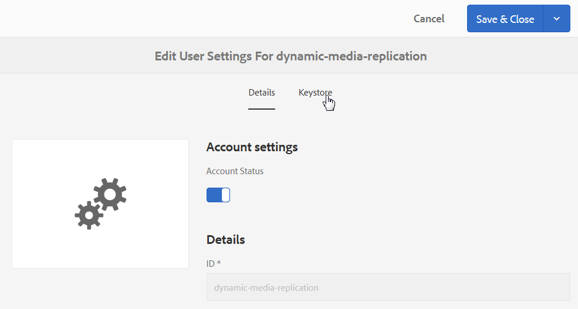

# Configurazione di Dynamic Media - Modalità ibrida {#configuring-dynamic-media-hybrid-mode}

Dynamic Media-Hybrid deve essere abilitato e configurato per l’uso. A seconda del caso d’uso, Dynamic Media dispone di diverse configurazioni [](#supported-dynamic-media-configurations)supportate.

>[!NOTE]
>
>Se intendete configurare ed eseguire Dynamic Media in modalità di esecuzione Scene7, consultate [Configurazione di Dynamic Media - Modalità](/help/assets/config-dms7.md)Scene7.
>
>Se intendete configurare ed eseguire Dynamic Media in modalità di esecuzione ibrida, seguite le istruzioni riportate in questa pagina.

Scopri di più sull’utilizzo dei [video](/help/assets/video.md) in Contenuti multimediali dinamici.

>[!NOTE]
>
>Se utilizzate la configurazione di Adobe Experience Manager per ambienti diversi, ad esempio uno per lo sviluppo, uno per l’area di visualizzazione e uno per la produzione live, è necessario configurare Cloud Services di contenuti multimediali dinamici per ciascuno di questi ambienti.

>[!NOTE]
>
>In caso di problemi con la configurazione di Dynamic Media, è importante esaminare i file di registro specifici per i contenuti multimediali dinamici. Questi vengono installati automaticamente quando si abilita il supporto dinamico:
>
>* `s7access.log`
>* `ImageServing.log`

>
>
Sono documentati in [Monitoraggio e manutenzione dell&#39;istanza](/help/sites-deploying/monitoring-and-maintaining.md)AEM.

La pubblicazione e la distribuzione ibrida è una funzione fondamentale del supporto dinamico aggiunto ad Adobe Experience Manager. La pubblicazione ibrida consente di distribuire risorse per contenuti multimediali dinamici, come immagini, set e video, dal cloud anziché dai nodi di pubblicazione AEM.

Altri contenuti, come visualizzatori per contenuti multimediali dinamici, pagine del sito e contenuti statici, continueranno a essere distribuiti dai nodi di pubblicazione AEM.

Se siete clienti di Dynamic Media, dovete usare la distribuzione ibrida come meccanismo di distribuzione per tutti i contenuti Dynamic Media.

## Architettura di pubblicazione ibrida per i video {#hybrid-publishing-architecture-for-videos}


## Architettura di pubblicazione ibrida per le immagini {#hybrid-publishing-architecture-for-images}


## Configurazioni per contenuti multimediali dinamici supportate {#supported-dynamic-media-configurations}

Le attività di configurazione che seguono fanno riferimento ai seguenti termini:

| **Termine** | **Elemento multimediale dinamico abilitato** | **Descrizione** |
|---|---|---|
| nodo autore AEM | Simbolo di spunta bianco in un cerchio verde | Il nodo di authoring distribuito in locale o tramite Managed Services. |
| AEM, nodo di pubblicazione | &quot;X&quot; bianco in un quadrato rosso. | Il nodo di pubblicazione da distribuire in locale o tramite Managed Services. |
| Nodo pubblicazione Servizio immagini | Segno di spunta bianco in un cerchio verde. | Il nodo di pubblicazione eseguito sui centri dati gestiti da  Adobe. Si riferisce all’URL del servizio immagini. |

Potete scegliere di implementare i contenuti multimediali dinamici solo per l’imaging, solo per i video o per l’imaging e il video. Per determinare i passaggi per la configurazione di Dynamic Media per lo scenario specifico, fare riferimento alla tabella seguente.

<table>
 <tbody>
  <tr>
   <td><strong>Scenario</strong></td>
   <td ><strong>Come funziona</strong></td>
   <td><strong>Passaggi di configurazione</strong></td>
  </tr>
  <tr>
   <td>Distribuire SOLO immagini in produzione</td>
   <td>Le immagini vengono distribuite tramite server nei centri dati mondiali  Adobe e quindi memorizzate nella cache da una rete CDN per prestazioni scalabili e portata globale.</td>
   <td>
    <ol>
     <li>Nel nodo <strong>di creazione</strong> AEM, <a href="#enabling-dynamic-media">attivate i contenuti multimediali</a>dinamici.</li>
     <li>Configurare l'imaging negli Cloud Services <a href="#configuring-dynamic-media-cloud-services"></a>Dynamic Media.</li>
     <li><a href="#configuring-image-replication">Configurare la replica</a>delle immagini.</li>
     <li><a href="#replicating-catalog-settings">Replicare le impostazioni</a>del catalogo.</li>
     <li><a href="#replicating-viewer-presets">Replicare i predefiniti</a>per visualizzatori.</li>
     <li><a href="#using-default-asset-filters-for-replication">Utilizzate i filtri risorse predefiniti per la replica</a>.</li>
     <li><a href="#configuring-dynamic-media-image-server-settings">Configurare le impostazioni</a>di Dynamic Media Image Server.</li>
     <li><a href="#delivering-assets">Distribuite le risorse</a>.</li>
    </ol> </td>
  </tr>
  <tr>
   <td>Distribuite SOLO immagini in fase di pre-produzione (sviluppatori, QE, stage e così via).</td>
   <td>Le immagini vengono distribuite tramite il nodo di pubblicazione AEM. In questo scenario, poiché il traffico è minimo, non è necessario distribuire le immagini al centro dati  Adobe. Un ulteriore vantaggio è rappresentato dal fatto che questo consente un'anteprima sicura dei contenuti prima del lancio della produzione</td>
   <td>
    <ol>
     <li>Nel nodo <strong>di creazione</strong> AEM, <a href="#enabling-dynamic-media">attivate i contenuti multimediali</a>dinamici.</li>
     <li>AEM nodo <strong>di pubblicazione</strong> , <a href="#enabling-dynamic-media">abilitare i contenuti multimediali</a>dinamici.</li>
     <li><a href="#replicating-viewer-presets">Replicare i predefiniti</a>per visualizzatori.</li>
     <li>Impostate il filtro <a href="#setting-up-asset-filters-for-imaging-in-non-production-deployments">risorse per le immagini</a>non di produzione.</li>
     <li><a href="#configuring-dynamic-media-image-server-settings">Configurare le impostazioni di Dynamic Media Image Server.</a></li>
     <li><a href="#delivering-assets">Distribuite le risorse.</a></li>
    </ol> </td>
  </tr>
  <tr>
   <td>Distribuire SOLO video in qualsiasi ambiente (Produzione, Sviluppo, QE, Stage e così via)</td>
   <td>I video vengono distribuiti e memorizzati nella cache da un CDN per garantire prestazioni scalabili e raggiungere un livello globale. L’immagine poster del video (miniatura del video che viene visualizzata prima dell’avvio della riproduzione) verrà trasmessa dall’istanza di pubblicazione AEM.</td>
   <td>
    <ol>
     <li>Nel nodo <strong>di creazione</strong> AEM, <a href="#enabling-dynamic-media">attivate i contenuti multimediali</a>dinamici.</li>
     <li>Nel nodo di <strong>pubblicazione</strong> AEM, <a href="#enabling-dynamic-media">attivate il supporto</a> dinamico (l’istanza di pubblicazione serve l’immagine poster del video e fornisce i metadati per la riproduzione del video).</li>
     <li>Configurare i video negli Cloud Services <a href="#configuring-dynamic-media-cloud-services">Contenuti multimediali dinamici.</a></li>
     <li><a href="#replicating-viewer-presets">Replicare i predefiniti</a>per visualizzatori.</li>
     <li>Impostate il filtro <a href="#setting-up-asset-filters-for-video-only-deployments">delle risorse solo</a>per il video.</li>
     <li><a href="#delivering-assets">Distribuite le risorse.</a></li>
    </ol> </td>
  </tr>
  <tr>
   <td>Trasmissione di immagini e video in produzione</td>
   <td><p>I video vengono distribuiti e memorizzati nella cache da un CDN per garantire prestazioni scalabili e raggiungere un livello globale. Le immagini e le immagini poster video vengono trasmesse attraverso i server  centri dati mondiali del Adobe e quindi memorizzate nella cache da una rete CDN per prestazioni scalabili e portata globale.</p> <p>Consultate le sezioni precedenti per impostare l'immagine o il video nella fase di pre-produzione. </p> </td>
   <td>
    <ol>
     <li>Nel nodo <strong>di creazione</strong> AEM, <a href="#enabling-dynamic-media">attivate i contenuti multimediali</a>dinamici.</li>
     <li>Configurare i video negli Cloud Services <a href="#configuring-dynamic-media-cloud-services">Contenuti multimediali dinamici.</a></li>
     <li>Configurare l'imaging negli Cloud Services <a href="#configuring-dynamic-media-cloud-services">Dynamic Media.</a></li>
     <li><a href="#configuring-image-replication">Configurare la replica</a>delle immagini.</li>
     <li><a href="#replicating-catalog-settings">Replicare le impostazioni</a>del catalogo.</li>
     <li><a href="#replicating-viewer-presets">Replicare i predefiniti</a>per visualizzatori.</li>
     <li><a href="#using-default-asset-filters-for-replication">Utilizzate i filtri risorse predefiniti per la replica.</a></li>
     <li><a href="#configuring-dynamic-media-image-server-settings">Configurare le impostazioni di Dynamic Media Image Server.</a></li>
     <li><a href="#delivering-assets">Distribuite le risorse.</a></li>
    </ol> </td>
  </tr>
 </tbody>
</table>

## Abilitazione di elementi multimediali dinamici {#enabling-dynamic-media}

[Per impostazione predefinita, i contenuti multimediali](https://www.adobe.com/solutions/web-experience-management/dynamic-media.html) dinamici sono disattivati. Per sfruttare le funzioni per i contenuti multimediali dinamici, è necessario abilitare i contenuti multimediali dinamici utilizzando la modalità di `dynamicmedia` esecuzione, come avviene ad esempio per la modalità di `publish` esecuzione. Prima di attivare l&#39;opzione, verificare i requisiti [tecnici.](/help/sites-deploying/technical-requirements.md#requirements-for-aem-dynamic-media-add-on)

>[!NOTE]
>
>L’attivazione di contenuti multimediali dinamici tramite la modalità di esecuzione sostituisce le funzionalità delle AEM 6.1 e AEM 6.0 in cui erano stati abilitati i contenuti multimediali dinamici impostando il `dynamicMediaEnabled` flag su **[!UICONTROL true.]** Questo flag non ha funzionalità in AEM 6.2 e versioni successive. Inoltre, non è necessario riavviare il servizio QuickStart per abilitare i contenuti multimediali dinamici.

Attivando Dynamic Media, le funzioni per i contenuti multimediali dinamici saranno disponibili nell’interfaccia utente e ogni risorsa immagine caricata riceverà una rappresentazione *cqdam.piramid.tiff* utilizzata per distribuire rapidamente rappresentazioni dinamiche delle immagini. Tali PTIFF presentano notevoli vantaggi, tra cui (1) la possibilità di gestire una sola immagine sorgente primaria e generare al volo rappresentazioni infinite senza ulteriore spazio di archiviazione e (2) la possibilità di utilizzare visualizzazioni interattive quali zoom, scorrimento, rotazione e così via.

Se desiderate utilizzare Dynamic Media Classic (Scene7) in AEM, non è necessario abilitare Dynamic Media a meno che non si utilizzi uno scenario [](/help/sites-administering/scene7.md#aem-scene-integration-versus-dynamic-media)specifico. Gli elementi multimediali dinamici sono disattivati a meno che non sia possibile attivare gli elementi multimediali dinamici in modalità di esecuzione.

Per abilitare il supporto dinamico, è necessario abilitare la modalità di esecuzione del supporto dinamico dalla riga di comando o dal nome del file quickstart.

**Per abilitare i contenuti multimediali dinamici**

1. Nella riga di comando, all’avvio dell’avvio rapido, effettuate le seguenti operazioni:

   * Aggiungete `-r dynamicmedia` alla fine della riga di comando quando si avvia il file jar.

   ```shell
   java -Xmx4096m -Doak.queryLimitInMemory=500000 -Doak.queryLimitReads=500000 -jar cq-quickstart-6.5.0.jar -r dynamicmedia
   ```

   Se state pubblicando su s7delivery, dovete includere anche i seguenti argomenti di trustStore:

   ```
   -Djavax.net.ssl.trustStore=<absoluteFilePath>/customerTrustStoreFileName>
   
    -Djavax.net.ssl.trustStorePassword=<passwordForTrustStoreFile>
   ```

1. Richiedete `https://localhost:4502/is/image` e accertatevi che Image Server sia in esecuzione.

   >[!NOTE]
   >
   >Per risolvere i problemi relativi ai file multimediali dinamici, consulta i seguenti file di registro nella `crx-quickstart/logs/` directory:
   >
   >* ImageServer-&lt;PortId>-&lt;yyyy>&lt;mm>&lt;dd>.log - Il registro ImageServer fornisce informazioni statistiche e analitiche utilizzate per analizzare il comportamento del processo ImageServer interno.

   Esempio di nome file di registro di Image Server: `ImageServer-57346-2020-07-25.log`
   * s7access-&lt;yyyy>&lt;mm>&lt;dd>.log - Il registro di accesso s7access registra ogni richiesta effettuata a Contenuti multimediali dinamici attraverso `/is/image` e `/is/content`.

   Questi file di registro vengono utilizzati solo quando è abilitato l’elemento multimediale dinamico. non sono inclusi nel pacchetto **Scarica completo** generato dalla `system/console/status-Bundlelist` pagina; quando chiamate l&#39;Assistenza clienti in caso di problemi relativi ai contenuti multimediali dinamici, aggiungete entrambi i registri al problema.

### Se AEM installato su una porta o un percorso contestuale diverso ... {#if-you-installed-aem-to-a-different-port-or-context-path}

Se state distribuendo [AEM a un server](/help/sites-deploying/application-server-install.md) applicazione e avete l’elemento multimediale dinamico abilitato, dovete configurare il dominio **autonomo** nell’esternalizzatore. In caso contrario, la generazione di miniature per le risorse non funzionerà correttamente per le risorse multimediali dinamiche.

Inoltre, se si esegue QuickStart su una porta o un percorso contestuale diverso, è necessario modificare anche il dominio **autonomo** .

Quando l’opzione Contenuti multimediali dinamici è attivata, le rappresentazioni delle miniature statiche per le risorse di immagini vengono generate tramite l’uso di Contenuti multimediali dinamici. Affinché la generazione delle miniature funzioni correttamente per i contenuti multimediali dinamici, AEM deve eseguire una richiesta URL a se stessa e deve conoscere sia il numero di porta che il percorso contestuale.

In AEM:

* Il dominio **autonomo** nell&#39; [esternalizzatore](/help/sites-developing/externalizer.md) viene utilizzato per recuperare sia il numero di porta che il percorso contestuale.
* Se non è configurato alcun dominio **autonomo** , il numero di porta e il percorso del contesto vengono recuperati dal servizio Jetty HTTP.

In una distribuzione AEM QuickStart WAR, non è possibile derivare il numero di porta e il percorso del contesto, pertanto è necessario configurare un dominio **autonomo** . Consulta la documentazione [di](/help/sites-developing/externalizer.md) esternalizer su come configurare il dominio **autonomo** .

>[!NOTE]
In una distribuzione [autonoma](/help/sites-deploying/deploy.md)AEM Quickstart, non è necessario configurare un dominio **autonomo** perché il numero di porta e il percorso contestuale possono essere configurati automaticamente. Tuttavia, se tutte le interfacce di rete sono disattivate, è necessario configurare il dominio **autonomo** .

## Disattivazione degli elementi multimediali dinamici  {#disabling-dynamic-media}

I contenuti multimediali dinamici non sono attivati per impostazione predefinita. Tuttavia, se in precedenza avete attivato i contenuti multimediali dinamici, potrebbe essere necessario disattivarli in un secondo momento.

Per disattivare il supporto dinamico dopo averlo attivato, rimuovete il flag di `-r dynamicmedia` modalità di esecuzione.

**Per disattivare l&#39;elemento multimediale dinamico dopo che è stato abilitato**

1. Nella riga di comando, quando si avvia l&#39;avvio rapido, è possibile effettuare una delle seguenti operazioni:

   * Non aggiungere `-r dynamicmedia` alla riga di comando quando si avvia il file jar.

   ```shell
   java -Xmx4096m -Doak.queryLimitInMemory=500000 -Doak.queryLimitReads=500000 -jar cq-quickstart-6.5.0.jar
   ```

1. Richiesta `https://localhost:4502/is/image`. Viene visualizzato un messaggio che informa che l’elemento multimediale dinamico è disabilitato.

   >[!NOTE]
   Quando la modalità di esecuzione Dynamic Media è disattivata, il passaggio del flusso di lavoro che genera la `cqdam.pyramid.tiff` rappresentazione viene ignorato automaticamente. In questo modo viene disattivato anche il supporto delle rappresentazioni dinamiche e altre funzioni per contenuti multimediali dinamici.
   Inoltre, se la modalità di esecuzione di Dynamic Media è disattivata dopo la configurazione del server di AEM, tutte le risorse caricate in tale modalità di esecuzione non sono più valide.

## (Facoltativo) Migrazione di predefiniti e configurazioni per contenuti multimediali dinamici da 6.3 a 6.5 Zero Downtime {#optional-migrating-dynamic-media-presets-and-configurations-from-to-zero-downtime}

Se state effettuando l’aggiornamento AEM Dynamic Media da 6.3 a 6.5 (che ora include la possibilità di eseguire senza interruzioni di installazione), dovete eseguire il seguente comando curl per migrare tutti i predefiniti e le configurazioni da `/etc` a `/conf` in CRXDE Lite.

**Nota**: Se eseguite l&#39;istanza AEM in modalità di compatibilità, ovvero avete installato il pacchetto di compatibilità, non è necessario eseguire questi comandi.

Per tutti gli aggiornamenti, con o senza il pacchetto di compatibilità, potete copiare i predefiniti per visualizzatori predefiniti forniti originariamente con Dynamic Media, eseguendo il seguente comando curl di Linux:

`curl -u admin:admin -X POST https://<server_address>:<server_port>/libs/settings/dam/dm/presets/viewer.pushviewerpresets.json`

Per migrare eventuali predefiniti e configurazioni di visualizzatore personalizzati creati da `/etc` a `/conf`, eseguite il seguente comando curl Linux:

`curl -u admin:admin -X POST https://<server_address>:<server_port>/libs/settings/dam/dm/presets.migratedmcontent.json`

## Configurazione della replica delle immagini {#configuring-image-replication}

La distribuzione di immagini per file multimediali dinamici funziona pubblicando risorse di immagini, comprese miniature video, da AEM Author e replicandole  servizio di replica su richiesta  Adobe (l&#39;URL del servizio di replica). Le risorse vengono quindi distribuite tramite il servizio di distribuzione delle immagini su richiesta (l’URL del servizio immagini).

È necessario effettuare le seguenti operazioni:

1. [Configurare l&#39;autenticazione](#setting-up-authentication).
1. [Configurare l&#39;agente](#configuring-the-replication-agent)di replica.

Replication Agent pubblica le risorse per file multimediali dinamici come immagini, metadati video e set nel servizio immagini ospitato dal Adobe . L&#39;agente di replica non è abilitato per impostazione predefinita.

Dopo aver configurato l&#39;agente di replica, è necessario [convalidare e verificare che sia stato configurato](#validating-the-replication-agent-for-dynamic-media)correttamente. In questa sezione vengono descritte le seguenti procedure.

>[!NOTE]
Il limite di memoria predefinito per la creazione PTIFF è di 3 GB per tutti i flussi di lavoro. Ad esempio, potete elaborare un’immagine che richiede 3 GB di memoria mentre altri flussi di lavoro vengono messi in pausa oppure potete elaborare 10 immagini in parallelo che richiedono 300 MB di memoria ciascuno.
Il limite di memoria è configurabile e deve essere adattato alla disponibilità delle risorse di sistema e al tipo di contenuto immagine in elaborazione. Se disponete di risorse molto grandi e di memoria sufficiente sul sistema, potete aumentare questo limite per garantire che le immagini vengano elaborate in parallelo.
Un&#39;immagine che richiede più del limite massimo di memoria verrà rifiutata.
Per modificare il limite di memoria per la creazione PTIFF, accedete a **[!UICONTROL Strumenti > Operazioni > Console Web >  Adobe CQ Scene7 PTiffManager]** e modificate il valore **[!UICONTROL maxMemory]** .

### Impostazione dell&#39;autenticazione {#setting-up-authentication}

Per replicare le immagini al servizio di distribuzione delle immagini per elementi multimediali dinamici, è necessario impostare l’autenticazione di replica per l’autore. A tal fine, è possibile ottenere un KeyStore e salvarlo nell&#39;utente di replica **[!UICONTROL multimediale]** dinamica e configurarlo. L&#39;amministratore della società avrebbe dovuto ricevere un&#39;e-mail di benvenuto con il file KeyStore e le credenziali necessarie durante il processo di provisioning. In caso contrario, contatta l&#39;Assistenza clienti.

**Per impostare l&#39;autenticazione**

1. Se non disponi già di questo tipo, contatta l’Assistenza clienti per il tuo file e la password KeyStore. Fa parte del provisioning e associa le chiavi al tuo account.
1. In AEM, tap the AEM logo to access the global navigation console, then tap **[!UICONTROL Tools > Security > Users.]**
1. Nella pagina Gestione utente, accedete all’utente di replica **[!UICONTROL per contenuti multimediali]** dinamici e toccate per aprirlo.

   

1. Nella pagina Modifica impostazioni utente per la replica di contenuti multimediali dinamici, toccate la scheda **[!UICONTROL Keystore]** , quindi fate clic su **[!UICONTROL Crea archivio chiavi.]**

   

1. Immettete una password e confermate la password nella finestra di dialogo **[!UICONTROL Imposta password]** accesso archivio chiavi.

   >[!NOTE]
   Ricordate la password immessa. Sarà necessario immetterlo di nuovo quando si configura l&#39;agente di replica in un secondo momento.

   

1. Nella pagina **[!UICONTROL Modifica impostazioni utente per la replica]** dinamica dei contenuti multimediali, espandete l’area file **** Aggiungi chiave privata da KeyStore e aggiungete quanto segue (consultate le immagini seguenti):

   * Nel campo **[!UICONTROL Nuovo alias]** , immettere il nome di un alias che verrà utilizzato successivamente nella configurazione di replica; ad esempio, `replication`.
   * Toccare il file **[!UICONTROL KeyStore.]** Andate al file KeyStore fornito per  Adobe, selezionatelo, quindi toccate **[!UICONTROL Apri.]**
   * Nel campo Password **[!UICONTROL file]** KeyStore, immettere la password del file KeyStore. Questa **non** è la password KeyStore creata al passaggio 5, ma è l&#39;Adobe  password del file KeyStore fornito nel messaggio e-mail di benvenuto inviato durante il provisioning. Contatta  Assistenza clienti di Adobe se non hai ricevuto una password per il file KeyStore.
   * Nel campo Password **[!UICONTROL chiave]** privata, immettete la password della chiave privata (potrebbe essere la stessa password della chiave privata fornita nel passaggio precedente).  Adobe fornisce la password della chiave privata nel messaggio e-mail di benvenuto inviato durante il provisioning. Contatta  Assistenza clienti di Adobe se non hai ricevuto una password per la chiave privata.
   * Nel campo Alias **[!UICONTROL chiave]** privata, immettere l&#39;alias della chiave privata. Esempio, `*companyname*-alias`.  Adobe fornisce l’alias della chiave privata nel messaggio e-mail di benvenuto che vi è stato inviato durante il provisioning. Contatta  Assistenza clienti di Adobe se non hai ricevuto un alias di chiave privata.

   

1. Toccate **[!UICONTROL Salva e chiudi]** per salvare le modifiche a questo utente.

   Quindi, è necessario [configurare l&#39;agente di replica.](#configuring-the-replication-agent)

### Configurazione dell&#39;agente di replica {#configuring-the-replication-agent}

1. In AEM, toccate il logo AEM per accedere alla console di navigazione globale, quindi toccate **[!UICONTROL Strumenti > Distribuzione > Replica > Agenti all’autore.]**
1. Nella pagina Agenti dell’autore, toccate Replica immagine ibrida **[!UICONTROL multimediale dinamica (s7delivery).]**
1. Toccate **[!UICONTROL Modifica.]**
1. Toccate la scheda **[!UICONTROL Impostazioni]** , quindi immettete quanto segue:

   * **[!UICONTROL Abilitato]** - Selezionare questa casella di controllo per abilitare l&#39;agente di replica.
   * **[!UICONTROL Regione]** - Impostare sulla regione appropriata: Nord America, Europa o Asia
   * **[!UICONTROL ID]** tenant: questo valore è il nome della società/tenant che viene pubblicato nel servizio di replica. Questo valore è l&#39;ID tenant che  Adobe fornisce nel messaggio e-mail di benvenuto che vi è stato inviato durante il provisioning. Contatta  Assistenza clienti di Adobe se non hai ricevuto questa notifica.
   * **[!UICONTROL Alias]** archivio chiavi - Questo valore è uguale al valore** Nuovo alias** impostato durante la generazione della chiave in [Impostazione autenticazione](#setting-up-authentication); ad esempio, `replication`. (vedere il passaggio 7 in [Impostazione dell&#39;autenticazione](#setting-up-authentication).)
   * **[!UICONTROL Password]** archivio chiavi - Si tratta della password KeyStore creata quando hai toccato **[!UICONTROL Create KeyStore.]**  Adobe non fornisce questa password. Vedere il passaggio 5 della [configurazione dell&#39;autenticazione](#setting-up-authentication).

   L&#39;immagine seguente mostra l&#39;agente di replica con dati di esempio:

   

1. Toccate **[!UICONTROL OK.]**

### Convalida dell&#39;agente di replica per gli elementi multimediali dinamici {#validating-the-replication-agent-for-dynamic-media}

Per convalidare l&#39;agente di replica per i supporti dinamici, eseguire le operazioni seguenti:

Toccate **[!UICONTROL Test della connessione.]** Esempio di output:

```shell
11.03.2016 10:57:55 - Transferring content for ReplicationAction{type=TEST, path[0]='/content/dam', time=1457722675402, userId='admin', revision='null'}
11.03.2016 10:57:55 - * Auth User: replication-receiver
11.03.2016 10:57:55 - * HTTP Version: 1.1
11.03.2016 10:57:55 - * Using OAuth 2.0 Authorization Grants
11.03.2016 10:57:55 - * OAuth 2.0 User: dynamic-media-replication
11.03.2016 10:57:55 - * OAuth 2.0 Token: '*****' initialized
11.03.2016 10:57:55 - Publishing: POST[https://replicate-na.assetsadobe.com:8580/is-publish/publish-receiver?Cmd=Test&RootId=xfpuu-6613]
11.03.2016 10:57:55 - Publish response: OK[]
11.03.2016 10:57:55 - Transfer succeeded in 141 ms for ReplicationAction{type=TEST, path[0]='/content/dam', time=1457722675402, userId='admin', revision='null'}
-------------------------------------------------------------------------------------------------------------------------------
Replication test succeeded
```

>[!NOTE]
È inoltre possibile eseguire una delle seguenti operazioni:
* Controllate i registri di replica per essere certi che la risorsa sia replicata.
* Pubblicate un’immagine. Toccate l’immagine e selezionate **[!UICONTROL Visualizzatori]** nel menu a discesa. Selezionate un predefinito per visualizzatori, quindi fate clic su URL e copiate/incollate l’URL nel browser per verificare che sia visibile l’immagine.


### Autenticazione risoluzione dei problemi {#troubleshooting-authentication}

Durante la configurazione dell&#39;autenticazione, si possono verificare alcuni problemi con le relative soluzioni. Prima di eseguire il controllo, assicurarsi di aver configurato la replica.

#### Problema: Codice di stato HTTP 401 con messaggio - Autorizzazione richiesta {#problem-http-status-code-with-message-authorization-required}

Questo problema può essere causato da un errore durante la configurazione di KeyStore per `dynamic-media-replication` l&#39;utente.

```shell
Replication test to s7delivery:https://s7bern.macromedia.com:8580/is-publish/
17.06.2016 18:54:43 - Transferring content for ReplicationAction{type=TEST, path[0]='/content/dam', time=1466214883309, userId='admin', revision='null'}
17.06.2016 18:54:43 - * Auth User: replication-receiver
17.06.2016 18:54:43 - * HTTP Version: 1.1
17.06.2016 18:54:43 - * Using OAuth 2.0 Authorization Grants
17.06.2016 18:54:43 - * OAuth 2.0 User: dynamic-media-replication
17.06.2016 18:54:43 - No OAuth token available. OAuth not initialized
17.06.2016 18:54:43 - * Using Client Auth SSL alias - replication-alias *
17.06.2016 18:54:43 - Publishing: POST[https://<localhost>:8580/is-publish//publish-receiver?Cmd=Test&RootId=brough]
17.06.2016 18:54:43 - Transfer failed for ReplicationAction{type=TEST, path[0]='/content/dam', time=1466214883309, userId='admin', revision='null'}. java.io.IOException: Failed to execute request
'https://<localhost>:8580/is-publish//publish-receiver?Cmd=Test&RootId=brough':
 Server returned status code 401 with message: Authorization required.
17.06.2016 18:54:43 - Error while replicating: com.day.cq.replication.ReplicationException: Transfer failed for ReplicationAction{type=TEST, path[0]='/content/dam', time=1466214883309,
 userId='admin', revision='null'}. java.io.IOException: Failed to execute request
'https://<localhost>:8580/is-publish//publish-receiver?Cmd=Test&RootId=brough':
 Server returned status code 401 with message: Authorization required.
```

**Soluzione**: Verificate che il file `KeyStore` venga salvato nell’utente di replica **multimediale** dinamica e sia fornito con la password corretta.

#### Problema: Impossibile Decrittografare La Chiave. Impossibile Decrittografare I Dati {#problem-could-not-decrypt-key-could-not-decrypt-data}

```xml
Replication test to s7delivery:https://<localhost>:8580/is-publish/
17.06.2016 19:00:16 - Transferring content for ReplicationAction{type=TEST, path[0]='/content/dam', time=1466215216662, userId='admin', revision='null'}
17.06.2016 19:00:16 - * Auth User: replication-receiver
17.06.2016 19:00:16 - * HTTP Version: 1.1
17.06.2016 19:00:16 - * Using OAuth 2.0 Authorization Grants
17.06.2016 19:00:16 - * OAuth 2.0 User: dynamic-media-replication
17.06.2016 19:00:16 - No OAuth token available. OAuth not initialized
17.06.2016 19:00:16 - * Using Client Auth SSL alias - replication-alias *
17.06.2016 19:00:16 - Transfer failed for ReplicationAction{type=TEST, path[0]='/content/dam', time=1466215216662, userId='admin', revision='null'}. java.lang.SecurityException: java.security.UnrecoverableKeyException: Could not decrypt key: Could not decrypt data.
```

**Soluzione**: Controllare la password. La password salvata nell&#39;agente di replica non è la stessa utilizzata per creare l&#39;archivio chiavi.

#### Problema: InvalidAlgorithmParameterException {#problem-invalidalgorithmparameterexception}

Questo problema è causato da un errore di configurazione nell&#39;istanza di AEM Author. Il processo Java sull&#39;Autore non ottiene il risultato corretto `javax.net.ssl.trustStore`. Questo errore viene visualizzato nel registro di replica:

```shell
14.04.2016 09:37:43 - Transfer failed for ReplicationAction{type=TEST, path[0]='/content/dam', time=1460651862089, userId='admin', revision='null'}. java.io.IOException: Failed to execute request 'https://<localhost>:8580/is-publish/publish-receiver?Cmd=Test&RootId=rbrough-osx2': java.lang.RuntimeException: Unexpected error: java.security.InvalidAlgorithmParameterException: the trustAnchors parameter must be non-empty
14.04.2016 09:37:43 - Error while replicating: com.day.cq.replication.ReplicationException: Transfer failed for ReplicationAction{type=TEST, path[0]='/content/dam', time=1460651862089, userId='admin', revision='null'}. java.io.IOException: Failed to execute request 'https://<localhost>:8580/is-publish/publish-receiver?Cmd=Test&RootId=rbrough-osx2': java.lang.RuntimeException: Unexpected error: java.security.InvalidAlgorithmParameterException: the trustAnchors parameter must be non-empty
```

Oppure nel registro degli errori:

```shell
07.25.2019 12:00:59.893 *ERROR* [sling-threadpool-db2763bb-bc50-4bb5-bb64-10a09f432712-(apache-sling-job-thread-pool)-90-com_day_cq_replication_job_s7delivery(com/day/cq/replication/job/s7delivery)] com.day.cq.replication.Agent.s7delivery.queue Error during processing of replication.

java.io.IOException: Failed to execute request 'https://replicate-na.assetsadobe.com:8580/is-publish/publish-receiver?Cmd=Test&RootId=rbrough-osx': java.lang.RuntimeException: Unexpected error: java.security.InvalidAlgorithmParameterException: the trustAnchors parameter must be non-empty
        at com.scene7.is.catalog.service.publish.atomic.PublishingServiceHttp.executePost(PublishingServiceHttp.scala:195)
```

**Soluzione**: Accertatevi che la proprietà di sistema `-Djavax.net.ssl.trustStore=` sia impostata su un archivio attendibili valido per il processo Java in AEM Author.

#### Problema: KeyStore non è configurato o non è inizializzato {#problem-keystore-is-either-not-set-up-or-it-is-not-initialized}

Questo problema può essere causato da una correzione, o da un pacchetto di funzioni che sovrascrive il nodo utente o keystore di contenuti multimediali dinamici.

Esempio di registro della replica:

```shell
Replication test to s7delivery:https://replicate-na.assetsadobe.com/is-publish
02.08.2016 14:37:44 - Transferring content for ReplicationAction{type=TEST, path[0]='/content/dam', time=1470173864834, userId='admin', revision='null'}
02.08.2016 14:37:44 - * Auth User: replication-receiver
02.08.2016 14:37:44 - * HTTP Version: 1.1
02.08.2016 14:37:44 - * Using OAuth 2.0 Authorization Grants
02.08.2016 14:37:44 - * OAuth 2.0 User: dynamic-media-replication
02.08.2016 14:37:44 - Transfer failed for ReplicationAction{type=TEST, path[0]='/content/dam', time=1470173864834, userId='admin', revision='null'}. com.adobe.granite.keystore.KeyStoreNotInitialisedException: Uninitialised key store for user dynamic-media-replication
```

**Soluzione**:

1. Passate alla pagina Gestione utente:
   `localhost:4502/libs/granite/security/content/useradmin.html`
1. Nella pagina Gestione utente, andate all’ `dynamic-media-replication` utente, quindi toccate per aprirlo.
1. Click the **[!UICONTROL KeyStore]** tab. Se viene visualizzato il pulsante **[!UICONTROL Crea archivio]** chiavi, è necessario ripristinare i passaggi in [Impostazione autenticazione](#setting-up-authentication) precedente.
1. Se è stato necessario ripristinare la configurazione di KeyStore, potrebbe essere necessario eseguire di nuovo la [configurazione di Replication Agent](/help/assets/config-dynamic.md#configuring-the-replication-agent) .

   Riconfigurare l&#39;agente di replica s7delivery.
   `localhost:4502/etc/replication/agents.author/s7delivery.html`

1. Toccate **[!UICONTROL Test connessione]** per verificare la validità della configurazione.

#### Problema: L&#39;agente di pubblicazione utilizza SSL invece di OAuth {#problem-publish-agent-is-using-ssl-instead-of-oauth}

Questo problema può essere causato da una correzione rapida o da un pacchetto di funzioni che non è stato installato correttamente o ha sovrascritto le impostazioni.

Esempio di registro replicato:

```shell
01.08.2016 18:42:59 - Transferring content for ReplicationAction{type=TEST, path[0]='/content/dam', time=1470073379634, userId='admin', revision='null'}
01.08.2016 18:42:59 - * Auth User: replication-receiver
01.08.2016 18:42:59 - * HTTP Version: 1.1
01.08.2016 18:42:59 - * Using Client Auth SSL alias - replication-receiver *
01.08.2016 18:42:59 - Publishing: POST[https://replicate-eu.assetsadobe2.com:443/is-publish/publish-receiver?Cmd=Test&RootId=altayerstaging]
01.08.2016 18:42:59 - Transfer failed for ReplicationAction{type=TEST, path[0]='/content/dam', time=1470073379634, userId='admin', revision='null'}. java.io.IOException: Failed to execute request 'https://replicate-eu.assetsadobe2.com:443/is-publish/publish-receiver?Cmd=Test&RootId=rbroughstaging': Server returned status code 401 with message: Authorization required.
01.08.2016 18:42:59 - Error while replicating: com.day.cq.replication.ReplicationException: Transfer failed for ReplicationAction{type=TEST, path[0]='/content/dam', time=1470073379634, userId='admin', revision='null'}. java.io.IOException: Failed to execute request 'https://replicate-eu.assetsadobe2.com:443/is-publish/publish-receiver?Cmd=Test&RootId=rbroughstaging': Server returned status code 401 with message: Authorization required.
```

**Soluzione:**

1. In AEM, click **[!UICONTROL Tools > General > CRXDE Lite.]**

   `localhost:4502/crx/de/index.jsp`

1. Passare al nodo s7delivery Replication Agent.
   `localhost:4502/crx/de/index.jsp#/etc/replication/agents.author/s7delivery/jcr:content`

1. Aggiungete questa impostazione all&#39;agente di replica (booleano con valore impostato su **[!UICONTROL True]**):

   `enableOauth=true`

1. Nell’angolo in alto a sinistra della pagina, toccate **[!UICONTROL Salva tutto.]**

### Verifica della configurazione {#testing-your-configuration}

 Adobe consiglia di eseguire un test end-to-end della configurazione.

Prima di iniziare il test, accertatevi di aver già eseguito le operazioni seguenti:

* Sono Stati Aggiunti Predefiniti Per Immagini.
* Configura configurazione **[!UICONTROL elemento multimediale dinamico (pre 6.3)]** in Cloud Services. L’URL del servizio immagini è richiesto per questo test

**Per verificare la configurazione**

1. Caricate una risorsa immagine. (In Risorse, tocca **[!UICONTROL Crea > File]** e seleziona il file.)
1. Attendere il completamento del flusso di lavoro.
1. Pubblicate la risorsa immagine. (Selezionate la risorsa e toccate Pubblicazione **[!UICONTROL rapida.]**)
1. Per passare alle rappresentazioni dell’immagine, aprite l’immagine e toccate **[!UICONTROL Rappresentazioni.]**

   

1. Selezionare una rappresentazione dinamica.
1. Fate clic su **[!UICONTROL URL]** per ottenere l’URL per la risorsa.
1. Passate all’URL selezionato e verificate se l’immagine si comporta come previsto.

Un altro modo per verificare che le risorse siano state distribuite è aggiungere all’URL req=exists.

## Configuring Dynamic Media Cloud Services {#configuring-dynamic-media-cloud-services}

Il servizio Dynamic Media Cloud supporta i servizi cloud come la pubblicazione ibrida e la distribuzione di immagini e video, l&#39;analisi video e la codifica video, tra le altre cose.

Come parte della configurazione, è necessario immettere un ID registrazione, un URL del servizio video, un URL del servizio immagini, un URL del servizio di replica e impostare l&#39;autenticazione. Avreste dovuto ricevere tutte queste informazioni come parte del processo di provisioning dell&#39;account. Se non avete ricevuto queste informazioni, contattate l&#39;amministratore di Adobe Experience Manager o il supporto tecnico  Adobe per ottenere le informazioni.

>[!NOTE]
Prima di configurare i servizi Dynamic Media Cloud, accertatevi che l’istanza di pubblicazione sia impostata. Prima di configurare i servizi Dynamic Media Cloud è inoltre necessario disporre della replica impostata.

Per configurare i servizi cloud per contenuti multimediali dinamici:

1. In AEM, toccate il logo AEM per accedere alla console di navigazione globale e toccate **[!UICONTROL Strumenti > Cloud Services > Configurazione elemento multimediale dinamico (Pre-6.3).]**
1. Nella pagina del browser di configurazione per elementi multimediali dinamici, nel riquadro a sinistra, selezionate **[!UICONTROL globale]**, quindi toccate **[!UICONTROL Crea.]**
1. Nella finestra di dialogo **[!UICONTROL Crea configurazione]** elemento multimediale dinamico, digitare un titolo nel campo Titolo.
1. Se state configurando Dynamic Media per il video,

   * Nel campo ID **** registrazione, digitate il vostro ID registrazione.
   * Nel campo URL **[!UICONTROL del servizio]** video, immettete l’URL del servizio video per Dynamic Media Gateway.

1. Se state configurando gli elementi multimediali dinamici per l’imaging, nel campo URL **[!UICONTROL del servizio]** immagini immettete l’URL del servizio immagini per Dynamic Media Gateway.
1. Toccate **[!UICONTROL Salva]** per tornare alla pagina del browser Configurazione file multimediali dinamici.
1. Toccate il logo AEM per accedere alla console di navigazione globale.

## Configurazione di Video Reporting {#configuring-video-reporting}

Potete configurare il reporting video per più installazioni di AEM utilizzando Dynamic Media Hybrid.

**Quando utilizzare:** Al momento della configurazione della configurazione di Dynamic Media Configuration (Pre 6.3), vengono avviate numerose funzioni, tra cui la generazione di rapporti video. La configurazione crea una suite di rapporti in una società Analytics regionale. Se configurate più nodi Autore, create una suite di rapporti separata per ciascuno di essi. Di conseguenza, i dati di reporting non sono coerenti tra le installazioni. Inoltre, se ogni nodo Autore fa riferimento allo stesso server di pubblicazione ibrida, l’ultima installazione di Author modifica la suite di rapporti di destinazione per tutti i rapporti video. Questo problema sovraccarica il sistema Analytics con troppe suite di rapporti.

**Guida introduttiva:** Configurate il reporting video completando le tre attività seguenti.

1. Create un pacchetto di predefiniti di analisi video dopo aver configurato la configurazione Dynamic Media Configuration (Pre 6.3) sul primo nodo Autore. Questa attività iniziale è importante perché consente a una nuova configurazione di continuare a utilizzare la stessa suite di rapporti.
1. Installate il pacchetto di predefiniti di analisi video su qualsiasi ***nuovo*** nodo Autore ***prima*** di configurare la configurazione di elementi multimediali dinamici (pre 6.3).
1. Verificate ed eseguite il debug dell&#39;installazione del pacchetto.

### Creazione di un pacchetto di predefiniti di analisi video dopo la configurazione del primo nodo Autore {#creating-a-video-analytics-preset-package-after-configuring-the-first-author-node}

Al termine di questa attività, sarà disponibile un file di pacchetto contenente i predefiniti di Video Analytics. Questi predefiniti contengono una suite di rapporti, il server di tracciamento, lo spazio dei nomi di tracciamento e l’ID organizzazione Marketing Cloud, se disponibile.

1. Se non lo avete ancora fatto, configurate la configurazione di Dynamic Media (Pre 6.3).
1. (Facoltativo) Visualizzare e copiare l’ID della suite di rapporti (è necessario avere accesso al JCR). Anche se l&#39;ID della suite di rapporti non è obbligatorio, la convalida risulta più semplice.
1. Create un pacchetto utilizzando Gestione pacchetti.
1. Modificate il pacchetto per includere un filtro.

   In AEM: `/conf/global/settings/dam/dm/presets/analytics/jcr:content/userdata`

1. Create il pacchetto.
1. Scaricate o condividete il pacchetto di predefiniti di Video Analytics in modo che possa essere condiviso con i nuovi nodi Autore successivi.

### Installazione del pacchetto di predefiniti di Video Analytics prima di configurare altri nodi Author {#installing-the-video-analytics-preset-package-before-you-configure-additional-author-nodes}

Accertatevi di completare questa attività ***prima*** di configurare la configurazione di Dynamic Media Configuration (Pre 6.3). In caso contrario, verrà creata un&#39;altra suite di rapporti inutilizzata. Inoltre, anche se il reporting video continuerà a funzionare correttamente, la raccolta di dati non è ottimizzata.

Accertatevi che il pacchetto di predefiniti di analisi video dal primo nodo Autore sia accessibile sul nuovo nodo Autore.

1. Caricate il pacchetto di predefiniti di analisi video creato in precedenza in Gestione pacchetti.
1. Installate il pacchetto di predefiniti di Video Analytics.
1. Configurare la configurazione di elementi multimediali dinamici (pre 6.3).

### Verifica e debug dell&#39;installazione del pacchetto {#verifying-and-debugging-the-package-installation}

1. Per verificare e, se necessario, eseguire il debug dell&#39;installazione del pacchetto, effettuate una delle seguenti operazioni:

   * **Controllate il predefinito Video Analytics tramite JCR** Per controllare il predefinito Video Analytics tramite JCR, dovete avere accesso al CRXDE Lite.

      AEM - In CRXDE Lite, passare a `/conf/global/settings/
dam/dm/presets/analytics/jcr:content/userdata`

      È `https://localhost:4502/crx/de/index.jsp#/conf/global/settings/dam/dm/presets/analytics/jcr%3Acontent/userdata`

      Se non disponete dell&#39;accesso ai CRXDE Lite nel nodo Autore, potete controllare il predefinito tramite il server di pubblicazione.

   * **Controllare il predefinito Video Analytics tramite il server immagini**

      Potete convalidare il predefinito Video Analytics direttamente effettuando una richiesta req=userdata del server immagini.
Ad esempio, per visualizzare il predefinito Analytics sul nodo Autore, potete effettuare la seguente richiesta:

      `https://localhost:4502/is/image/conf/global/settings/dam/dm/presets/analytics?req=userdata`

      Per convalidare il predefinito sui server di pubblicazione, potete effettuare una richiesta diretta simile al server di pubblicazione. Le risposte sono le stesse sui nodi Autore e Pubblica. La risposta è simile a quella riportata di seguito:**

      ```
      marketingCloudOrgId=0FC4E86B573F99CC7F000101
       reportSuite=aemaem6397618-2018-05-23
       trackingNamespace=aemvideodal
       trackingServer=aemvideodal.d2.sc.omtrdc.net
      ```

   * **Controllate il predefinito di analisi video tramite lo strumento di reporting video in AEM** Toccate **[!UICONTROL Strumenti > Risorse > Video Reporting (Reporting video)]**

      `https://localhost:4502/mnt/overlay/dam/gui/content/s7dam/videoreports/videoreport.html`

      Se viene visualizzato il seguente messaggio di errore, la suite di rapporti è disponibile ma non viene compilata. Questo errore è corretto, e lo si desidera, in una nuova installazione prima che il sistema raccolga i dati.
   

   Per generare i dati di reporting, caricate e pubblicate un video. Usate **[!UICONTROL Copia URL]** ed eseguite il video almeno una volta.

   Tenete presente che potrebbero essere necessarie fino a 12 ore prima che i dati di reporting vengano compilati a partire dall’utilizzo del visualizzatore video.

   Se si verifica un errore e la suite di rapporti non è impostata correttamente, viene visualizzato il seguente avviso.

   

   Questo errore viene visualizzato anche se Video Reporting (Generazione rapporti video) viene eseguito prima della configurazione dei servizi di configurazione di elementi multimediali dinamici (Pre 6.3).

### Risoluzione dei problemi relativi alla configurazione di reporting video {#troubleshooting-the-video-reporting-configuration}

* Durante l&#39;installazione, talvolta le connessioni al server API di Analytics si disattivano. L&#39;installazione ripete la connessione 20 volte, ma non riesce. Quando si verifica questa situazione, il file di registro registra più errori. Cerca `SiteCatalystReportService`.
* Se prima non installi il pacchetto di predefiniti di Analytics puoi creare una nuova suite di rapporti.
* L&#39;aggiornamento da AEM 6.3 a AEM 6.4 o AEM 6.4.1, quindi la configurazione della configurazione di elementi multimediali dinamici (Pre 6.3), crea comunque una suite di rapporti. Questo problema è noto e dovrebbe essere risolto per AEM 6.4.2.

### Informazioni sul predefinito Analisi video {#about-the-video-analytics-preset}

Il predefinito per l’analisi dei video, talvolta noto semplicemente come predefinito di analisi, viene memorizzato accanto ai predefiniti per visualizzatori in elementi multimediali dinamici. È sostanzialmente lo stesso di un predefinito per visualizzatori, ma con le informazioni utilizzate per configurare il reporting AppMeasurement e Video Heartbeat.

Le proprietà del predefinito sono le seguenti:

* `reportSuite`
* `trackingServer`
* `trackingNamespace`
* `marketingCloudOrgId` (non presente nelle versioni precedenti di AEM)

AEM 6.4 e versioni successive salvano questo predefinito in `/conf/global/settings/dam/dm/presets/analytics/jcr:content/userdata`

## Replica delle impostazioni del catalogo {#replicating-catalog-settings}

È necessario pubblicare le impostazioni predefinite del catalogo come parte del processo di configurazione tramite JCR. Per replicare le impostazioni del catalogo:

1. In una finestra Terminal, eseguire le operazioni seguenti:

   `curl -u admin:admin localhost:4502/libs/settings/dam/dm/presets/viewer.pushviewerpresets`

1. In AEM, andate al seguente percorso in CRXDE Lite (richiede privilegi di amministratore):

   `https://<*server*>:<*port*>/crx/de/index.jsp#/conf/global/settings/dam/dm/imageserver/`

1. Toccate la scheda **[!UICONTROL Replica]** .
1. Toccate **[!UICONTROL Replica.]**

## Replica dei predefiniti per visualizzatori {#replicating-viewer-presets}

Per distribuire *una risorsa con un predefinito per visualizzatori, dovete replicare/pubblicare* il predefinito per visualizzatori. (All viewer presets must be activated *and* replicated to obtain the URL or embed code for an asset.
Per ulteriori informazioni, consultate Predefiniti [per visualizzatori di](/help/assets/managing-viewer-presets.md#publishing-viewer-presets) pubblicazione.

>[!NOTE]
By default, the system shows a variety of renditions when you select **[!UICONTROL Renditions]** and a variety of viewer presets when you select **[!UICONTROL Viewers]** in the asset&#39;s detail view. È possibile aumentare o diminuire il numero visualizzato. See [Increasing the number of image presets that display](/help/assets/managing-image-presets.md#increasing-or-decreasing-the-number-of-image-presets-that-display) or [Increasing the number of viewer presets that display](/help/assets/managing-viewer-presets.md#increasing-the-number-of-viewer-presets-that-display).

## Filtrare le risorse per la replica {#filtering-assets-for-replication}

Nelle distribuzioni di contenuti multimediali non dinamici, potete replicare *tutte* le risorse (immagini e video) dall’ambiente di authoring AEM al nodo di pubblicazione AEM. Questo flusso di lavoro è necessario perché i server di pubblicazione AEM forniscono anche le risorse.

Tuttavia, nelle distribuzioni di contenuti multimediali dinamici, poiché le risorse vengono distribuite nel cloud, non è necessario replicare le stesse risorse AEM nodi di pubblicazione. Tale flusso di lavoro &quot;ibrido per la pubblicazione&quot; evita costi di archiviazione aggiuntivi e tempi di elaborazione più lunghi per la replica delle risorse. Altri contenuti, come visualizzatori per contenuti multimediali dinamici, pagine del sito e contenuti statici, continuano a essere distribuiti dai nodi di pubblicazione AEM.

Oltre a replicare le risorse, vengono anche replicate le seguenti risorse non disponibili:

* Configurazione Dynamic Media Delivery: `/conf/global/settings/dam/dm/imageserver/jcr:content`
* Predefiniti immagini: `/conf/global/settings/dam/dm/presets/macros`
* Predefiniti visualizzatore: `/conf/global/settings/dam/dm/presets/viewer`

I filtri consentono di *escludere* la replica delle risorse nel nodo di pubblicazione AEM.

### Utilizzo dei filtri risorse predefiniti per la replica {#using-default-asset-filters-for-replication}

Se si utilizza l&#39;oggetto multimediale dinamico per l&#39;imaging (1) in produzione **o (2) per** l&#39;imaging e il video, è possibile utilizzare i filtri predefiniti forniti così come sono. Per impostazione predefinita, sono attivi i seguenti filtri:

<table>
 <tbody>
  <tr>
   <td> </td>
   <td><strong>Filtro</strong></td>
   <td><strong>Tipo mime</strong></td>
   <td><strong>Rappresentazioni</strong></td>
  </tr>
  <tr>
   <td>Consegna immagine multimediale dinamica</td>
   <td><p>filter-images</p> <p>set di filtri</p> <p> </p> </td>
   <td><p>Inizia con <strong>image/</strong></p> <p>Contiene <strong>applicazione/</strong> e termina con <strong>set</strong>.</p> </td>
   <td>Le "immagini filtro" predefinite (applicabili a singole risorse di immagini, comprese le immagini interattive) e i "set di filtri" (applicabili a set 360 gradi, set di immagini, set di file multimediali diversi e set di caroselli) consentono di:
    <ul>
     <li>Includete immagini PTIFF e metadati per la replica (qualsiasi rappresentazione che inizia con <strong>cqdam</strong>).</li>
     <li>Escludete dalla replica le rappresentazioni originali dell’immagine e dell’immagine statica.</li>
    </ul> </td>
  </tr>
  <tr>
   <td>Consegna video per contenuti multimediali dinamici</td>
   <td>filter-video</td>
   <td>Inizia con <strong>video/</strong></td>
   <td>Il "filtro-video" preimpostato:
    <ul>
     <li>Includete rappresentazioni video proxy, miniature video/immagini poster, metadati (sia nel video principale che nelle rappresentazioni video) per la replica (qualsiasi rappresentazione che inizia con <strong>cqdam</strong>).</li>
     <li>Escludete dalla replica le rappresentazioni video e le miniature statiche originali.<br /> <br /> <strong>Nota:</strong> Le rappresentazioni video proxy non contengono file binari, ma sono solo proprietà dei nodi. Pertanto, non vi è alcun impatto sulle dimensioni del repository dell'editore.</li>
    </ul> </td>
  </tr>
  <tr>
   <td>Integrazione Dynamic Media Classic (Scene7)</td>
   <td><p>filter-images</p> <p>set di filtri</p> <p>filter-video</p> </td>
   <td><p>Inizia con <strong>image/</strong></p> <p>Contiene <strong>applicazione/</strong> e termina con <strong>set</strong>.</p> <p>Inizia con <strong>video/</strong></p> </td>
   <td><p>Puoi configurare l’URI di trasporto in modo che punti al server di pubblicazione AEM invece dell’URL  Adobe del servizio di replica Dynamic Media Cloud. Impostando questo filtro, Dynamic Media Classic potrà distribuire le risorse invece dell’istanza di pubblicazione AEM.</p> <p>I "filtri-immagini" integrati, i "set-filtri" e i "filtri-video" consentiranno di:</p>
    <ul>
     <li>Includete immagini PTIFF, rappresentazioni video proxy e metadati per la replica. Tuttavia, poiché non esistono nel JCR-per chi esegue AEM - Integrazione di Dynamic Media Classic - non fa nulla.</li>
     <li>Escludete dalla replica l’immagine originale, le rappresentazioni statiche delle immagini, il video originale e le rappresentazioni statiche delle miniature. Dynamic Media Classic, invece, distribuirà le risorse immagine e video.</li>
    </ul> </td>
  </tr>
 </tbody>
</table>

>[!NOTE]
I filtri si applicano ai tipi mime e non possono essere specifici per un percorso.

### Impostazione dei filtri delle risorse per le installazioni solo video {#setting-up-asset-filters-for-video-only-deployments}

Se utilizzate Contenuti multimediali dinamici solo per i video, effettuate le seguenti operazioni per impostare i filtri delle risorse per la replica:

1. In AEM, toccate il logo AEM per accedere alla console di navigazione globale e toccate **[!UICONTROL Strumenti > Distribuzione > Replica > Agenti all’autore.]**
1. Nella pagina Agenti della pagina di creazione, toccate Agente **[!UICONTROL predefinito (pubblicazione).]**
1. Toccate **[!UICONTROL Modifica.]**
1. Nella finestra di dialogo Impostazioni **** agente, nella scheda **[!UICONTROL Impostazioni]** , selezionare **[!UICONTROL Abilitato]** per attivare l&#39;agente.
1. Toccate **[!UICONTROL OK.]**
1. In AEM, tocca **[!UICONTROL Strumenti > Generale > CRXDE Lite.]**
1. Nella struttura di cartelle a sinistra, individuate `/etc/replication/agents.author/dynamic_media_replication/jcr:content/damRenditionFilters`
1. Individuate **[!UICONTROL filter-video]**, fate clic con il pulsante destro del mouse su di esso e selezionate **[!UICONTROL Copia.]**
1. Nella struttura di cartelle a sinistra, individuate `/etc/replication/agents.author/publish`
1. Individuate **[!UICONTROL jcr:content]**, fate clic con il pulsante destro del mouse su di esso e selezionate **[!UICONTROL Incolla.]**

Questa opzione consente di impostare l’istanza di pubblicazione AEM per distribuire l’immagine poster video e i metadati video richiesti per la riproduzione, mentre il video stesso viene distribuito dal servizio Dynamic Media Cloud. Il filtro escluderà dalla replica anche le rappresentazioni video e le miniature statiche originali, che non sono necessarie nell’istanza di pubblicazione.

### Impostazione di filtri risorse per l’imaging nelle installazioni non di produzione {#setting-up-asset-filters-for-imaging-in-non-production-deployments}

Se utilizzate Dynamic Media per l&#39;imaging nelle distribuzioni non di produzione, eseguite i seguenti passaggi per configurare i filtri delle risorse per la replica:

1. In AEM, toccate il logo AEM per accedere alla console di navigazione globale e toccate **[!UICONTROL Strumenti > Distribuzione > Replica > Agenti all’autore.]**
1. Nella pagina Agenti della pagina di creazione, toccate Agente **[!UICONTROL predefinito (pubblicazione).]**
1. Toccate **[!UICONTROL Modifica.]**
1. Nella finestra di dialogo Impostazioni **** agente, nella scheda **[!UICONTROL Impostazioni]** , selezionare **[!UICONTROL Abilitato]** per attivare l&#39;agente.
1. Toccate **[!UICONTROL OK.]**
1. In AEM, tocca **[!UICONTROL Strumenti > Generale > CRXDE Lite.]**
1. Nella struttura di cartelle a sinistra, individuate `/etc/replication/agents.author/dynamic_media_replication/jcr:content/damRenditionFilters`

   

1. Individuate **[!UICONTROL le immagini]** del filtro, fate clic con il pulsante destro del mouse e selezionate **[!UICONTROL Copia.]**
1. Nella struttura di cartelle a sinistra, individuate `/etc/replication/agents.author/publish`
1. Individua **[!UICONTROL jcr:content]**, fai clic con il pulsante destro del mouse su di esso e seleziona **[!UICONTROL Crea > Crea nodo.]** Immettere il nome `damRenditionFilters` del tipo `nt:unstructured`.
1. Individuare `damRenditionFilters`, fare clic con il pulsante destro del mouse e selezionare **[!UICONTROL Incolla.]**

Questa opzione consente di impostare l’istanza di pubblicazione AEM per distribuire le immagini all’ambiente non di produzione. Il filtro escluderà dalla replica anche le rappresentazioni statiche e dell’immagine originale, che non sono necessarie nell’istanza di pubblicazione.

>[!NOTE]
Se in un autore sono presenti molti filtri diversi, a ogni agente deve essere assegnato un utente diverso. Il codice granito applica un solo filtro per utente. Per ogni configurazione del filtro, dovete sempre avere un utente diverso.
Se utilizzate più filtri su un server, ad esempio un filtro per la pubblicazione della replica e un secondo filtro per la distribuzione s7delivery, dovete verificare che a questi due filtri sia assegnato un ID **utente** diverso nel nodo **jcr:content** . Guardate l’immagine che segue:


### Personalizzazione dei filtri delle risorse per la replica {#customizing-asset-filters-for-replication}

Per personalizzare facoltativamente i filtri delle risorse per la replica:

1. In AEM, toccate il logo AEM per accedere alla console di navigazione globale e toccate **[!UICONTROL Strumenti > Generale > CRXDE Lite.]**
1. Nella struttura delle cartelle a sinistra, individuate `/etc/replication/agents.author/dynamic_media_replication/jcr:content/damRenditionFilters` i filtri.

   

1. Per definire il tipo di mime per il filtro, potete individuare il tipo mime nel modo seguente:

   Nella barra a sinistra, espandete `content > dam > <locate_your_asset> >  jcr:content > metadata` e quindi nella tabella, individuate **[!UICONTROL dc:format.]**

   L’elemento grafico seguente è un esempio del percorso di una risorsa a dc:format.

   

   Tenere presente che `dc:format` la risorsa `Fiji Red.jpg` è `image/jpeg`.

   Affinché questo filtro possa essere applicato a tutte le immagini, indipendentemente dal loro formato, impostate il valore su `image/*` dove `*` è un&#39;espressione regolare applicata a tutte le immagini di qualsiasi formato.

   Per applicare il filtro solo alle immagini di tipo JPEG, specificate un valore di `image/jpeg`.

1. Definite le rappresentazioni da includere o escludere dalla replica.

   I caratteri utilizzabili per filtrare la replica includono quanto segue:

<table>
 <tbody>
  <tr>
   <td><strong>Carattere da usare</strong></td>
   <td><strong>Filtrare le risorse per la replica</strong></td>
  </tr>
  <tr>
   <td>*</td>
   <td>Carattere jolly<br /> </td>
  </tr>
  <tr>
   <td>+</td>
   <td>Include le risorse per la replica.</td>
  </tr>
  <tr>
   <td>-</td>
   <td>Esclude le risorse dalla replica.</td>
  </tr>
 </tbody>
</table>

Accedi a `content/dam/<locate your asset>/jcr:content/renditions`.

L’elemento grafico seguente è un esempio delle rappresentazioni di una risorsa.


Utilizzando l&#39;esempio precedente, se si desidera solo replicare il PTIFF (TIFF piramidale), è possibile immettere `+cqdam,*` che include tutte le rappresentazioni con cui iniziare `cqdam`. Nell&#39;esempio, la rappresentazione è `cqdam.pyramid.tiff`.

Se si voleva solo replicare l&#39;originale, allora si entrava `+original`.

## Configurazione delle impostazioni di Dynamic Media Image Server {#configuring-dynamic-media-image-server-settings}

La configurazione di Dynamic Media Image Server implica la modifica del bundle  Adobe CQ Scene7 ImageServer e del bundle  Adobe CQ Scene7 PlatformServer.

>[!NOTE]
Dynamic Media funziona out-of-the-box [dopo che è attivato](#enabling-dynamic-media). Tuttavia, potete scegliere di perfezionare l’installazione configurando Dynamic Media Image Server in base a specifiche o requisiti specifici.

**Prerequisito**: *Prima* di configurare Dynamic Media Image Server, verificare che la VM di Windows includa un&#39;installazione delle librerie Microsoft Visual C++. Le librerie sono necessarie per eseguire Dynamic Media Image Server. È possibile [scaricare Microsoft Visual C++ 2010 Redistributable Package (x64) qui](https://www.microsoft.com/en-us/download/details.aspx?id=14632).

Per configurare le impostazioni di Dynamic Media Image Server:

1. Nell’angolo in alto a sinistra di AEM, toccate **[!UICONTROL Adobe Experience Manager]** per accedere alla console di navigazione globale, quindi toccate **[!UICONTROL Strumenti > Operazioni > Console Web.]**
1. Nella pagina Configurazione console Web di Adobe Experience Manager, toccate **[!UICONTROL OSGi > Configurazione]** per elencare tutti i bundle attualmente in esecuzione in AEM.

   I server di distribuzione di contenuti multimediali dinamici si trovano sotto i seguenti nomi nell’elenco:

   * `Adobe CQ Scene7 ImageServer`
   * `Adobe CQ Scene7 PlatformServer`

1. Nell’elenco dei bundle, a destra di  Adobe CQ Scene7 Image Server, toccate l’icona Modifica.
1. Nella finestra di dialogo  Adobe CQ Scene7 Image Server, impostate i seguenti valori di configurazione:

   >[!NOTE]
   Nella maggior parte dei casi, non è necessario modificare i valori predefiniti. Tuttavia, se modificate i valori predefiniti, è necessario riavviare il bundle per rendere effettive le modifiche.

<table>
 <tbody>
  <tr>
   <td><strong>Proprietà</strong></td>
   <td><strong>Valore predefinito</strong></td>
   <td><strong>Descrizione</strong></td>
  </tr>
  <tr>
   <td>TcpPort.name</td>
   <td><code><em>empty</em></code></td>
   <td>Numero di porta da utilizzare per la comunicazione con il processo ImageServer. Per impostazione predefinita, la porta libera viene rilevata automaticamente.</td>
  </tr>
  <tr>
   <td>AllowRemoteAccess.name</td>
   <td><code><em>empty</em></code></td>
   <td><p>Consenti o disabilita l'accesso remoto al processo ImageServer. Se è false, il server immagini ascolta solo localhost.</p> <p>Le impostazioni esterne predefinite che puntano all'host locale devono specificare il dominio o l'indirizzo IP effettivi dell'istanza VM specifica. Il motivo è che il localhost potrebbe puntare al sistema padre della VM.</p> <p>I domini o gli indirizzi IP per la VM possono avere bisogno di una voce di file host in modo che possa risolvere se stessa.</p> </td>
  </tr>
  <tr>
   <td>MaxRenderRongPixels</td>
   <td>16 MPixel</td>
   <td>Dimensione massima in megapixel rappresentata.</td>
  </tr>
  <tr>
   <td>MaxMessageSize</td>
   <td>16 MByte</td>
   <td>Dimensione massima del messaggio in megabyte consegnato.</td>
  </tr>
  <tr>
   <td>RandomAccessUrlTimeout</td>
   <td>20</td>
   <td>Valore di timeout per quanto tempo in secondi ImageServer attenderà che il JCR risponda a una richiesta di sezione intervallo.</td>
  </tr>
  <tr>
   <td>WorkerThread</td>
   <td>10</td>
   <td>Numero di thread di lavoro.</td>
  </tr>
 </tbody>
</table>

1. Toccate **[!UICONTROL Salva.]**
1. Nell&#39;elenco dei bundle, a destra di  Adobe CQ Scene7 PlatformServer, toccate l&#39;icona **[!UICONTROL Modifica]** .
1. Nella finestra di dialogo  Adobe CQ Scene7 PlatformServer, impostate le seguenti opzioni predefinite:

   >[!NOTE]
   Dynamic Media Image Server utilizza una propria cache del disco per memorizzare le risposte nella cache. La cache HTTP AEM e il dispatcher non possono essere utilizzati per memorizzare nella cache le risposte dal server immagini per elementi multimediali dinamici.

   | **Proprietà** | **Valore predefinito** | **Descrizione** |
   |---|---|---|
   | Cache abilitata | Selezionato | Indica se la cache delle risposte è abilitata o meno. |
   | Radici cache | cache | Uno o più percorsi alle cartelle della cache delle risposte. I percorsi relativi vengono risolti rispetto alla cartella interna del bundle di imaging s7imaging. |
   | Dimensione massima cache | 200000000 | Dimensione massima della cache della risposta in byte. |
   | N. max cache | 100000 | Numero massimo di voci consentite nella cache. |

### Impostazioni Manifest predefinite {#default-manifest-settings}

Il manifesto predefinito consente di configurare i valori predefiniti utilizzati per generare le risposte di Consegna file multimediali dinamici. Potete ottimizzare la qualità (qualità JPEG, risoluzione, modalità di ricampionamento), la memorizzazione nella cache (scadenza) e impedire il rendering di immagini troppo grandi (valori predefiniti, puntini predefiniti, maxpix).

La posizione della configurazione del manifesto predefinito viene presa dal valore predefinito **[!UICONTROL Catalog root]** del pacchetto **[!UICONTROL Scene7 PlatformServer]** di Adobe CQ. Per impostazione predefinita, questo valore si trova nel percorso seguente in **[!UICONTROL Strumenti > Generale > CRXDE Lite]**:

`/conf/global/settings/dam/dm/imageserver/`


È possibile modificare i valori delle proprietà, come descritto nella tabella seguente, immettendo nuovi valori.

Dopo aver modificato il manifesto predefinito, toccate **[!UICONTROL Salva tutto nell’angolo in alto a sinistra della pagina.]**

Toccate la scheda Controllo **** accesso (a destra della scheda Proprietà), quindi impostate i privilegi di controllo di accesso per `jcr:read` tutti gli utenti e per gli utenti di replica dinamica dei supporti.


Tabella delle impostazioni Manifest e dei relativi valori predefiniti:

<table>
 <tbody>
  <tr>
   <td><strong>Proprietà</strong></td>
   <td><strong>Valore predefinito</strong></td>
   <td><strong>Descrizione</strong></td>
  </tr>
  <tr>
   <td>bkgcolor</td>
   <td>FFFFFF</td>
   <td><p>Colore di sfondo predefinito. Valore RGB utilizzato per riempire un’area dell’immagine di risposta che non contiene dati immagine effettivi.</p> <p>Consultate anche <a href="https://microsite.omniture.com/t2/help/en_US/s7/is_ir_api/is_api/image_catalog/r_bkgcolor.html">BkgColor</a> nell’API Image Serving.</p> </td>
  </tr>
  <tr>
   <td>defaultpix</td>
   <td>300,300</td>
   <td><p>Dimensione predefinita della visualizzazione. Il server vincola le immagini di risposta a valori non superiori a tali valori di larghezza e altezza, se la richiesta non specifica esplicitamente la dimensione della visualizzazione utilizzando wid=, hei= o scl=.</p> <p>Specificati come due numeri interi, pari a 0 o superiori, separati da una virgola. Larghezza e altezza in pixel. Uno o entrambi i valori possono essere impostati su 0 per mantenerli non vincolati. Non si applica alle richieste nidificate/incorporate.</p> <p>Consultate anche <a href="https://microsite.omniture.com/t2/help/en_US/s7/is_ir_api/is_api/image_catalog/r_defaultpix.html">DefaultPix</a> nell’API di Image Server.</p> <p>In genere, tuttavia, per distribuire la risorsa si utilizza un predefinito per visualizzatori o immagini. Il valore predefinito è applicabile solo a una risorsa che non utilizza un predefinito per visualizzatori o immagini.</p> </td>
  </tr>
  <tr>
   <td>defaultthumbnail pix</td>
   <td>100,100</td>
   <td><p>Dimensione predefinita miniatura. Utilizzato al posto di attribute::DefaultPix per le richieste di miniature (req=tmb).</p> <p>Il server vincola le immagini di risposta a valori non superiori a tali valori di larghezza e altezza, se una richiesta di miniatura (req=tmb) non specifica in modo esplicito la dimensione della visualizzazione utilizzando esplicitamente wid=, hei= o scl=.</p> <p>Specificati come due numeri interi, pari a 0 o superiori, separati da una virgola. Larghezza e altezza in pixel. Uno o entrambi i valori possono essere impostati su 0 per mantenerli non vincolati. </p> <p>Non si applica alle richieste nidificate/incorporate.</p> <p>Consultate anche <a href="https://microsite.omniture.com/t2/help/en_US/s7/is_ir_api/is_api/image_catalog/r_defaultthumbpix.html">DefaultThumbPix</a> nell’API di Image Server. </p> </td>
  </tr>
  <tr>
   <td>exit</td>
   <td>36000000</td>
   <td><p>Durata predefinita cache client. Fornisce un intervallo di scadenza predefinito nel caso in cui un determinato record di catalogo non contenga un valore di catalogo valido::Expiration.</p> <p>Numero reale, 0 o superiore. Numero di millisecondi fino alla scadenza dalla generazione dei dati di risposta. Impostate su 0 per scadere sempre l'immagine di risposta immediatamente, il che disabilita in modo efficace il caching del client. Per impostazione predefinita, questo valore è impostato su 10 ore, il che significa che se viene pubblicata una nuova immagine, occorrono 10 ore prima che la vecchia immagine lasci la cache dell'utente. Contatta l’Assistenza clienti se hai bisogno di cancellare la cache prima possibile.</p> <p>Consultate anche <a href="https://docs.adobe.com/content/help/en/dynamic-media-developer-resources/image-serving-api/image-serving-api/attributes/r-expiration.html">Scadenza</a> nell’API di Image Server.</p> </td>
  </tr>
  <tr>
   <td>jpegquality</td>
   <td>80</td>
   <td><p>Attributi di codifica JPEG predefiniti. Specifica gli attributi predefiniti per le immagini di risposta JPEG.</p> <p>Numero intero e flag, separati da virgola. Il primo valore è compreso nell’intervallo 1.100 e definisce la qualità. Il secondo valore può essere 0 per il comportamento normale, o 1 per disattivare il downsampling della cromaticità RGB generalmente utilizzato dagli encoder JPEG.</p> <p>Consultate anche <a href="https://microsite.omniture.com/t2/help/en_US/s7/is_ir_api/is_api/image_catalog/r_jpegquality.html">JpegQuality</a> nell’API Image Serving.</p> </td>
  </tr>
  <tr>
   <td>maxpix</td>
   <td>2000,2000</td>
   <td><p>Rispondi al limite delle dimensioni dell’immagine. Larghezza e altezza massime dell'immagine di risposta restituite al client.</p> <p>Il server restituisce un errore se una richiesta causa un'immagine di risposta la cui larghezza o altezza è maggiore dell'attributo::MaxPix.</p> <p>Consultate anche <a href="https://microsite.omniture.com/t2/help/en_US/s7/is_ir_api/is_api/image_catalog/r_maxpix.html">MaxPix</a> nell’API di Image Server.</p> </td>
  </tr>
  <tr>
   <td>resmode</td>
   <td>SHARP2</td>
   <td><p>Modalità di ricampionamento predefinita. Specifica gli attributi di ricampionamento e interpolazione predefiniti da usare per il ridimensionamento dei dati immagine.</p> <p>Utilizzato quando resMode= non è specificato in una richiesta.</p> <p>I valori consentiti sono BILIN, BICUB o SHARP2.</p> <p>Enum. Impostare su 2 per bilin, 3 per bicub o 4 per la modalità di interpolazione sharp2. Utilizzate sharp2 per ottenere risultati ottimali.</p> <p>Consultate anche <a href="https://microsite.omniture.com/t2/help/en_US/s7/is_ir_api/is_api/image_catalog/r_is_cat_resmode.html">ResMode</a> nell’API di Image Serving.</p> </td>
  </tr>
  <tr>
   <td>risoluzione</td>
   <td>72</td>
   <td><p>Risoluzione predefinita dell'oggetto. Fornisce una risoluzione predefinita dell'oggetto nel caso in cui un determinato record di catalogo non contenga un valore valido per il catalogo::Resolution.</p> <p>Numero reale, maggiore di 0. Generalmente espresso come pixel per pollice, ma può anche essere espresso in altre unità, come i pixel per metro.</p> <p>Consultate anche <a href="https://microsite.omniture.com/t2/help/en_US/s7/is_ir_api/is_api/image_catalog/r_resolution.html">Risoluzione</a> nell’API di Image Server.</p> </td>
  </tr>
  <tr>
   <td>thumbnailTime</td>
   <td>1%,11%,21%,31%,41%,51%,61%,71%,81%,91%</td>
   <td>Questi valori rappresentano un’istantanea del tempo di riproduzione video e vengono passati a <a href="https://encoding.com/">encoding.com</a>. Per ulteriori informazioni, consultate <a href="/help/assets/video.md#about-video-thumbnails-in-dynamic-media-hybrid-mode">Le miniature</a> video.</td>
  </tr>
 </tbody>
</table>

## Configurazione della gestione del colore per elementi multimediali dinamici {#configuring-dynamic-media-color-management}

La gestione del colore per i contenuti multimediali dinamici consente di colorare le risorse corrette per la visualizzazione dell’anteprima.

Con la correzione del colore, le risorse assimilate mantengono lo spazio colore (RGB, CMYK, Grigio) e il profilo colore incorporato nella rappresentazione TIFF piramidale generata. Quando si richiede una rappresentazione dinamica, il colore dell&#39;immagine viene corretto nello spazio colore di destinazione. Potete configurare il profilo colore di output nelle impostazioni di pubblicazione per contenuti multimediali dinamici in JCR.

 gestione del colore dei Adobi utilizza i profili ICC, un formato definito dall’International Color Consortium (ICC).

Potete configurare la gestione del colore per i contenuti multimediali dinamici e i predefiniti per immagini mediante l’output CMYK, RGB o Grigio. See [Configuring Image Presets](/help/assets/managing-image-presets.md).

Casi di utilizzo avanzati possono utilizzare un modificatore di configurazione manuale per selezionare esplicitamente un profilo colore di output: `icc=`

* `icc` - [https://docs.adobe.com/content/help/en/dynamic-media-developer-resources/image-serving-api/image-serving-api/http-protocol-reference/command-reference/r-icc.html](https://docs.adobe.com/content/help/en/dynamic-media-developer-resources/image-serving-api/image-serving-api/http-protocol-reference/command-reference/r-icc.html)

* `iccEmbed` - [https://docs.adobe.com/content/help/en/dynamic-media-developer-resources/image-serving-api/image-serving-api/http-protocol-reference/command-reference/r-iccembed.html](https://docs.adobe.com/content/help/en/dynamic-media-developer-resources/image-serving-api/image-serving-api/http-protocol-reference/command-reference/r-iccembed.html)

>[!NOTE]
Il set standard di profili colore  Adobe è disponibile solo se è stato installato [Feature Pack 12445 da Distribuzione](https://experience.adobe.com/#/downloads/content/software-distribution/en/aem.html?package=/content/software-distribution/en/details.html/content/dam/aem/public/adobe/packages/cq630/featurepack/cq-6.3.0-featurepack-12445) software. Tutti i pacchetti di funzioni e i service pack sono disponibili in Distribuzione [](https://experience.adobe.com/#/downloads/content/software-distribution/en/aem.html)software. Il Feature Pack 12445 offre i profili colore per i Adobi .

### Installazione di Feature Pack 12445 {#installing-feature-pack}

Per utilizzare le funzioni di gestione del colore per i supporti dinamici, è necessario installare il feature pack 12445.

**Per installare feature pack 12445**

1. Andate a Distribuzione [](https://experience.adobe.com/#/downloads/content/software-distribution/en/aem.html) software e scaricate `cq-6.3.0-featurepack-12445`.

   Per ulteriori informazioni sull&#39;utilizzo dei pacchetti, vedere [Come utilizzare i pacchetti](/help/sites-administering/package-manager.md) in [!DNL Adobe Experience Manager].

1. Installare il feature pack.

### Configurazione dei profili colore predefiniti {#configuring-the-default-color-profiles}

Dopo aver installato il feature pack, è necessario configurare i profili colore predefiniti appropriati per attivare la correzione colore quando si richiedono dati immagine RGB o CMYK.

**Per configurare i profili colore predefiniti**

1. In **[!UICONTROL Strumenti > Generale > CRXDE Lite]**, passare al `/conf/global/settings/dam/dm/imageserver/jcr:content` quale sono contenuti i profili Adobe Color  predefiniti.

   

1. Aggiungete una proprietà di correzione colore scorrendo nella parte inferiore della scheda **[!UICONTROL Proprietà]** e immettendo manualmente il nome, il tipo e il valore della proprietà, descritti nelle tabelle seguenti. Dopo aver immesso i valori, toccate **[!UICONTROL Aggiungi]** e quindi **[!UICONTROL Salva tutto]** per salvare i valori.

   Le proprietà di correzione del colore sono descritte nella tabella Proprietà **** correzione colore. I valori che potete assegnare alle proprietà di correzione colore sono riportati nella tabella Profilo **** colore.

   Ad esempio, in **[!UICONTROL Nome]**, aggiungere `iccprofilecmyk`, selezionare **[!UICONTROL Tipo]** `String`, quindi aggiungere `WebCoated` come **[!UICONTROL Valore.]** Toccate **[!UICONTROL Aggiungi]** e quindi **[!UICONTROL Salva tutto]** per salvare i valori.

   

   **Tabella proprietà correzione colore**

<table>
 <tbody>
  <tr>
   <td><strong>Proprietà</strong></td>
   <td><strong>Tipo</strong></td>
   <td><strong>Predefiniti</strong></td>
   <td><strong>Descrizione</strong></td>
  </tr>
  <tr>
   <td><a href="https://docs.adobe.com/content/help/en/dynamic-media-developer-resources/image-serving-api/image-serving-api/attributes/r-iccprofilergb.html">iccprofilergb</a></td>
   <td>Stringa</td>
   <td>&lt;empty&gt;</td>
   <td>Nome del profilo colore RGB predefinito.</td>
  </tr>
  <tr>
   <td><a href="https://docs.adobe.com/content/help/en/dynamic-media-developer-resources/image-serving-api/image-serving-api/attributes/r-iccprofilecmyk.html">iccprofilecmyk</a></td>
   <td>Stringa</td>
   <td>&lt;empty&gt;</td>
   <td>Nome del profilo colore CMYK predefinito.</td>
  </tr>
  <tr>
   <td><a href="https://docs.adobe.com/content/help/en/dynamic-media-developer-resources/image-serving-api/image-serving-api/attributes/r-iccprofilegray.html">iccprofilegray</a></td>
   <td>Stringa</td>
   <td>&lt;empty&gt;</td>
   <td>Nome del profilo colore grigio predefinito.</td>
  </tr>
  <tr>
   <td><a href="https://docs.adobe.com/content/help/en/dynamic-media-developer-resources/image-serving-api/image-serving-api/attributes/r-iccprofilesrcrgb.html">iccprofilesrcrgb</a></td>
   <td>Stringa</td>
   <td>&lt;empty&gt;</td>
   <td>Nome del profilo colore RGB predefinito usato per le immagini RGB che non dispongono di un profilo colore incorporato</td>
  </tr>
  <tr>
   <td><a href="https://docs.adobe.com/content/help/en/dynamic-media-developer-resources/image-serving-api/image-serving-api/attributes/r-iccprofilesrccmyk.html">iccprofilesrccmyk</a></td>
   <td>Stringa</td>
   <td>&lt;empty&gt;</td>
   <td>Nome del profilo colore CMYK predefinito utilizzato per le immagini CMYK che non dispongono di un profilo colore incorporato.</td>
  </tr>
  <tr>
   <td><a href="https://docs.adobe.com/content/help/en/dynamic-media-developer-resources/image-serving-api/image-serving-api/attributes/r-iccprofilesrcgray.html">iccprofilesrcgrigio</a></td>
   <td>Stringa</td>
   <td>&lt;empty&gt;</td>
   <td>Nome del profilo colore grigio predefinito utilizzato per le immagini CMYK che non hanno un profilo colore incorporato.</td>
  </tr>
  <tr>
   <td><a href="https://docs.adobe.com/content/help/en/dynamic-media-developer-resources/image-serving-api/image-serving-api/attributes/r-iccblackpointcompensation.html">compensazione punto-nero</a></td>
   <td>Booleano</td>
   <td>Vero</td>
   <td>Specifica se la compensazione del punto nero deve essere effettuata durante la correzione del colore.  Adobe raccomanda che ciò avvenga.</td>
  </tr>
  <tr>
   <td><a href="https://docs.adobe.com/content/help/en/dynamic-media-developer-resources/image-serving-api/image-serving-api/attributes/r-iccdither.html">icdithering</a></td>
   <td>Booleano</td>
   <td>False</td>
   <td>Specifica se il dithering deve essere eseguito durante la correzione del colore.</td>
  </tr>
  <tr>
   <td><a href="https://docs.adobe.com/content/help/en/dynamic-media-developer-resources/image-serving-api/image-serving-api/attributes/r-iccrenderintent.html">iccrenderintento</a></td>
   <td>Stringa</td>
   <td>relativo</td>
   <td><p>Specifica l’intento di rendering. I valori accettabili sono: <strong>percettivo, relativo, saturazione, assoluto. </strong><i></i>Adobe consiglia <strong>relativa </strong><i></i>come impostazione predefinita.</p> </td>
  </tr>
 </tbody>
</table>

>[!NOTE]
I nomi delle proprietà sono con distinzione tra maiuscole e minuscole e devono essere tutti in lettere minuscole.

**Tabella profilo colore**

Sono installati i seguenti profili colore:

<table>
 <tbody>
  <tr>
   <th><p>Nome</p> </th>
   <th><p>Spazio colore</p> </th>
   <th><p>Descrizione</p> </th>
  </tr>
  <tr>
   <td>AdobeRGB</td>
   <td>RGB</td>
   <td> Adobe RGB (1998)</td>
  </tr>
  <tr>
   <td>AppleRGB</td>
   <td>RGB</td>
   <td>Apple RGB</td>
  </tr>
  <tr>
   <td>CIERGB</td>
   <td>RGB</td>
   <td>CIE RGB</td>
  </tr>
  <tr>
   <td>CoatedFogra27</td>
   <td>CMYK</td>
   <td>Coated FOGRA27 (ISO 12647-2:2004)</td>
  </tr>
  <tr>
   <td>CoatedFogra39</td>
   <td>CMYK</td>
   <td>Coated FOGRA39 (ISO 12647-2:2004)</td>
  </tr>
  <tr>
   <td>CoatedGraCol</td>
   <td>CMYK</td>
   <td>GRACoL 2006 rivestito (ISO 12647-2:2004)</td>
  </tr>
  <tr>
   <td>ColorMatchRGB</td>
   <td>RGB</td>
   <td>ColorMatch RGB</td>
  </tr>
  <tr>
   <td>EuropeISOCoated</td>
   <td>CMYK</td>
   <td>Europe ISO Coated FOGRA27</td>
  </tr>
  <tr>
   <td>EuroscaleCoated</td>
   <td>CMYK</td>
   <td>Euroscale Coated v2</td>
  </tr>
  <tr>
   <td>EuroscaleUnprotected</td>
   <td>CMYK</td>
   <td>Euroscale non patinata v2</td>
  </tr>
  <tr>
   <td>JapanColorCoated</td>
   <td>CMYK</td>
   <td>Japan Color 2001 Coated</td>
  </tr>
  <tr>
   <td>JapanColorNewspaper</td>
   <td>CMYK</td>
   <td>Japan Color 2002 Newspaper</td>
  </tr>
  <tr>
   <td>JapanColorUnprotected</td>
   <td>CMYK</td>
   <td>Japan Color 2001 Non patinato</td>
  </tr>
  <tr>
   <td>JapanColorWebCoated</td>
   <td>CMYK</td>
   <td>Japan Color 2003 Web Coated</td>
  </tr>
  <tr>
   <td>JapanWebCoated</td>
   <td>CMYK</td>
   <td>Japan Web Coated (Ad)</td>
  </tr>
  <tr>
   <td>NewsprintSNAP2007</td>
   <td>CMYK</td>
   <td>Newsprint USA (SNAP 2007)</td>
  </tr>
  <tr>
   <td>NTSC</td>
   <td>RGB</td>
   <td>NTSC (1953)</td>
  </tr>
  <tr>
   <td>PAL</td>
   <td>RGB</td>
   <td>PAL/SECAM</td>
  </tr>
  <tr>
   <td>ProPhoto</td>
   <td>RGB</td>
   <td>ProPhoto RGB</td>
  </tr>
  <tr>
   <td>PS4Default</td>
   <td>CMYK</td>
   <td>CMYK predefinito per Photoshop 4</td>
  </tr>
  <tr>
   <td>PS5Default</td>
   <td>CMYK</td>
   <td>CMYK predefinito per Photoshop 5</td>
  </tr>
  <tr>
   <td>FogliettoCoated</td>
   <td>CMYK</td>
   <td>U.S. SheetFeed Coated v2</td>
  </tr>
  <tr>
   <td>FogliettoNon patinato</td>
   <td>CMYK</td>
   <td>U.S. SheetFeed non patinato v2</td>
  </tr>
  <tr>
   <td>SMPTE</td>
   <td>RGB</td>
   <td>SMPTE-C</td>
  </tr>
  <tr>
   <td>sRGB</td>
   <td>RGB</td>
   <td>sRGB IEC61966-2.1</td>
  </tr>
  <tr>
   <td>UncoatedFogra29</td>
   <td>CMYK</td>
   <td>FOGRA29 non patinata (ISO 12647-2:2004)</td>
  </tr>
  <tr>
   <td>WebCoated</td>
   <td>CMYK</td>
   <td>Stati Uniti Web Coated (SWOP) v2</td>
  </tr>
  <tr>
   <td>WebCoatedFogra28</td>
   <td>CMYK</td>
   <td>Web Coated FOGRA28 (ISO 12647-2:2004)</td>
  </tr>
  <tr>
   <td>WebCoatedGrade3</td>
   <td>CMYK</td>
   <td>Carta SWOP 2006 con rivestimento Web 3</td>
  </tr>
  <tr>
   <td>WebCoatedGrade5</td>
   <td>CMYK</td>
   <td>Carta SWOP 2006 con rivestimento Web</td>
  </tr>
  <tr>
   <td>WebNon patinato</td>
   <td>CMYK</td>
   <td>U.S. Web non patinata v2</td>
  </tr>
  <tr>
   <td>WideGamutRGB</td>
   <td>RGB</td>
   <td>Ampia gamma RGB</td>
  </tr>
 </tbody>
</table>

1. Toccate **[!UICONTROL Salva tutto.]**

Ad esempio, potete impostare **[!UICONTROL iccprofilergb]** su `sRGB`e **[!UICONTROL iccprofilecmyk]** su **[!UICONTROL WebCoated.]**

In questo modo si effettua quanto segue:

* Attiva la correzione del colore per le immagini RGB e CMYK.
* Si presume che nello spazio colore *sRGB* siano presenti immagini RGB che non hanno un profilo colore.
* Si presume che le immagini CMYK che non hanno un profilo colore siano nello spazio colore *WebCoated* .
* Le rappresentazioni dinamiche che restituiscono l&#39;output RGB, lo restituiranno nello spazio colore *sRGB *s.
* Rappresentazioni dinamiche che restituiscono l’output CMYK, lo restituiranno nello spazio colore *WebCoated* .

## Distribuzione delle risorse {#delivering-assets}

Dopo aver completato tutte le attività descritte sopra, le risorse Dynamic Media attivate vengono servite dal servizio Immagine o Video. In AEM, questa capacità viene visualizzata in un URL **** Copia immagine, **[!UICONTROL Copia URL]** visualizzatore, **[!UICONTROL Incorpora codice]** visualizzatore e in WCM.

See [Delivering Dynamic Media Assets](/help/assets/delivering-dynamic-media-assets.md).

<table>
 <tbody>
  <tr>
   <td><strong>Quando...</strong></td>
   <td><strong>Risultato</strong></td>
  </tr>
  <tr>
   <td>Copiare un URL immagine</td>
   <td><p>Nella finestra di dialogo Copia URL viene visualizzato un URL simile al seguente (l’URL è solo a scopo dimostrativo):</p> <p><code>https://IMAGESERVICEPUBLISHNODE/is/image/content/dam/path/to/Image.jpg?$preset$</code></p> <p>Dove <code>IMAGESERVICEPUBLISHNODE</code> si riferisce all’URL del servizio immagini.</p> <p>Consultate anche <a href="/help/assets/delivering-dynamic-media-assets.md">Distribuzione di risorse</a>multimediali dinamiche.</p> </td>
  </tr>
  <tr>
   <td>Copiare l’URL di un visualizzatore</td>
   <td><p>Nella finestra di dialogo Copia URL viene visualizzato un URL simile al seguente (l’URL è solo a scopo dimostrativo):</p> <p><code>https://PUBLISHNODE/etc/dam/viewers/s7viewers/html5/BasicZoomViewer.html?asset=/content/dam/path/to/Image.jpg&amp;config=/conf/global/settings/dam/dm/presets/viewer/Zoom_dark&amp;serverUrl=https://IMAGESERVICEPUBLISHNODE/is/image/&amp;contentRoot=%2F</code></p> <p>Dove <code>PUBLISHNODE</code> si riferisce al normale nodo di pubblicazione AEM e <code>IMAGESERVICEPUBLISHNODE</code> all’URL del servizio immagine.</p> <p>Consultate anche <a href="/help/assets/delivering-dynamic-media-assets.md">Distribuzione di risorse</a>multimediali dinamiche.</p> </td>
  </tr>
  <tr>
   <td>Copiare il codice da incorporare di un visualizzatore</td>
   <td><p>La finestra di dialogo Copia codice da incorporare presenta un frammento di codice simile al seguente (l’esempio di codice è solo a scopo dimostrativo):</p> <p><code class="code">&lt;style type="text/css"&gt;
       #s7basiczoom_div.s7basiczoomviewer{
       width:100%;
       height:auto;
       }
       &lt;/style&gt;
       &lt;script
       type="text/javascript" src="https://PUBLISHNODE/etc/dam/viewers/s7viewers/html5/js/BasicZoomViewer.js"&gt;&lt;/script&gt;
       &lt;div id="s7basiczoom_div"&gt;&lt;/div&gt;
       &lt;script type="text/javascript"&gt;
       var s7basiczoomviewer = new s7viewers.BasicZoomViewer({
       "containerId" : "s7basiczoom_div",
       "params" : {
       "serverurl" : "https://IMAGESERVICEPUBLISHNODE/is/image/",
       "contenturl" : "https://PUBLISHNODE/",
       "config" : "/conf/global/settings/dam/dm/presets/viewer/Zoom_dark",
       "asset" : "/content/dam/path/to/Image.jpg" }
       }).init();
       &lt;/script&gt;</code></p> <p>Dove <code>PUBLISHNODE</code> si riferisce al normale nodo di pubblicazione AEM e <code>IMAGESERVICEPUBLISHNODE</code> all’URL del servizio immagine.</p> <p>Consultate anche <a href="/help/assets/delivering-dynamic-media-assets.md">Distribuzione di risorse</a>multimediali dinamiche.</p> </td>
  </tr>
 </tbody>
</table>

### Componenti per contenuti multimediali dinamici e contenuti multimediali interattivi WCM {#wcm-dynamic-media-and-interactive-media-components}

Le pagine WCM che fanno riferimento ai componenti per contenuti multimediali dinamici e per contenuti multimediali interattivi fanno riferimento al servizio di distribuzione.
