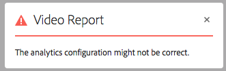

# Configurare Dynamic Media - Modalità ibrida {#configuring-dynamic-media-hybrid-mode}

Dynamic Media-Hybrid deve essere abilitato e configurato per l’uso. A seconda del caso d’uso, Dynamic Media dispone di diversi [configurazioni supportate](#supported-dynamic-media-configurations).

>[!NOTE]
>
>Se intendi configurare ed eseguire Dynamic Media in modalità di esecuzione Scene7, consulta [Configurare Dynamic Media - Modalità Scene7](/help/assets/config-dms7.md).
>
>Se desideri configurare ed eseguire Dynamic Media in modalità di esecuzione ibrida, segui le istruzioni riportate in questa pagina.

Ulteriori informazioni sull’utilizzo di [video](/help/assets/video.md) in Dynamic Media.

>[!NOTE]
>
>Se utilizzi Adobe Experience Manager configurato per ambienti diversi, ad esempio uno per lo sviluppo, la gestione temporanea e la produzione live, configura i Cloud Services Dynamic Media per ogni ambiente.

>[!NOTE]
>
>In caso di problemi con la configurazione di Dynamic Media, individua i file di registro specifici di Dynamic Media. Questi file vengono installati automaticamente quando si abilita Dynamic Media:
>
>* `s7access.log`
>* `ImageServing.log`
>
>Sono documentati in [Monitorare e mantenere l’istanza di Experience Manager](/help/sites-deploying/monitoring-and-maintaining.md).

La pubblicazione e la consegna ibrida è una funzione fondamentale dell’aggiunta di Dynamic Media ad Adobe Experience Manager. La pubblicazione ibrida consente di distribuire risorse Dynamic Media, come immagini, set e video, dal cloud invece che dai nodi di pubblicazione Experience Manager.

Altri contenuti, come visualizzatori Dynamic Media, pagine del sito e contenuto statico, continuano a essere serviti dai nodi di pubblicazione di Experience Manager.

Se sei un cliente di Dynamic Media, devi utilizzare la consegna ibrida come meccanismo di consegna per tutti i contenuti Dynamic Media.

## Architettura di pubblicazione ibrida per i video {#hybrid-publishing-architecture-for-videos}


## Architettura di pubblicazione ibrida per le immagini {#hybrid-publishing-architecture-for-images}


## Configurazioni Dynamic Media supportate {#supported-dynamic-media-configurations}

Le attività di configurazione seguenti fanno riferimento ai seguenti termini:

| **Termine** | **Dynamic Media abilitato** | **Descrizione** |
|---|---|---|
| Nodo autore di Experience Manager | Simbolo di spunta bianco in cerchio verde | Il nodo autore che distribuisci su On-Premise o tramite Managed Services. |
| Nodo di pubblicazione Experience Manager | &quot;X&quot; bianco in un quadrato rosso. | Il nodo di pubblicazione distribuito su On-Premise o tramite Managed Services. |
| Nodo di pubblicazione del servizio immagine | Segno di spunta bianco in cerchio verde. | Il nodo di pubblicazione eseguito sui data center gestiti da Adobe. Si riferisce all’URL del servizio immagine. |

È possibile scegliere di implementare Dynamic Media solo per l&#39;imaging, solo per il video o sia per l&#39;imaging che per il video. Per determinare i passaggi per la configurazione di Dynamic Media per lo scenario specifico, consultare la tabella seguente.

<table>
 <tbody>
  <tr>
   <td><strong>Scenario</strong></td>
   <td ><strong>Come funziona</strong></td>
   <td><strong>Passaggi di configurazione</strong></td>
  </tr>
  <tr>
   <td>Fornire SOLO immagini in produzione</td>
   <td>Le immagini vengono distribuite tramite server nei data center mondiali di Adobe e quindi memorizzate nella cache di una rete CDN per prestazioni scalabili e portata globale.</td>
   <td>
    <ol>
     <li>Experience Manager <strong>autore</strong> nodo, <a href="#enabling-dynamic-media">abilitare Dynamic Media</a>.</li>
     <li>Configurare l'immagine in <a href="#configuring-dynamic-media-cloud-services">Cloud Services Dynamic Media</a>.</li>
     <li><a href="#configuring-image-replication">Configurare la replica delle immagini</a>.</li>
     <li><a href="#replicating-catalog-settings">Replicare le impostazioni del catalogo</a>.</li>
     <li><a href="#replicating-viewer-presets">Replicare i predefiniti visualizzatore</a>.</li>
     <li><a href="#using-default-asset-filters-for-replication">Utilizzare filtri di risorse predefiniti per la replica</a>.</li>
     <li><a href="#configuring-dynamic-media-image-server-settings">Configurare le impostazioni di Dynamic Media Image Server</a>.</li>
     <li><a href="#delivering-assets">Fornire risorse</a>.</li>
    </ol> </td>
  </tr>
  <tr>
   <td>Fornire SOLO immagini in pre-produzione (sviluppo, QE, stage e così via).</td>
   <td>Le immagini vengono consegnate tramite il nodo di pubblicazione Experience Manager. In questo scenario, poiché il traffico è minimo, non è necessario consegnare immagini al data center di Adobe. Permette inoltre di visualizzare un'anteprima sicura dei contenuti prima del lancio della produzione.</td>
   <td>
    <ol>
     <li>Experience Manager <strong>autore</strong> nodo, <a href="#enabling-dynamic-media">abilitare Dynamic Media</a>.</li>
     <li>Experience Manager <strong>pubblicare</strong> nodo, <a href="#enabling-dynamic-media">abilitare Dynamic Media</a>.</li>
     <li><a href="#replicating-viewer-presets">Replicare i predefiniti visualizzatore</a>.</li>
     <li>Configurazione <a href="#setting-up-asset-filters-for-imaging-in-non-production-deployments">filtro risorse per immagini non di produzione</a>.</li>
     <li><a href="#configuring-dynamic-media-image-server-settings">Configura le impostazioni di Dynamic Media Image Server.</a></li>
     <li><a href="#delivering-assets">Fornire le risorse.</a></li>
    </ol> </td>
  </tr>
  <tr>
   <td>Fornire SOLO video in qualsiasi ambiente (produzione, sviluppo, QE, stage e così via)</td>
   <td>I video vengono consegnati e memorizzati nella cache da una rete CDN per prestazioni scalabili e portata globale. L’immagine poster del video (miniatura del video che mostra prima che la riproduzione venga avviata) viene distribuita dall’istanza di pubblicazione di Experience Manager.</td>
   <td>
    <ol>
     <li>Experience Manager <strong>autore</strong> nodo, <a href="#enabling-dynamic-media">abilitare Dynamic Media</a>.</li>
     <li>Experience Manager <strong>pubblicare</strong> nodo, <a href="#enabling-dynamic-media">abilitare Dynamic Media</a> (l’istanza di pubblicazione serve l’immagine poster video e fornisce metadati per la riproduzione video).</li>
     <li>Configurare video in <a href="#configuring-dynamic-media-cloud-services">Cloud Services Dynamic Media.</a></li>
     <li><a href="#replicating-viewer-presets">Replicare i predefiniti visualizzatore</a>.</li>
     <li>Configurazione <a href="#setting-up-asset-filters-for-video-only-deployments">filtro risorse per solo video</a>.</li>
     <li><a href="#delivering-assets">Fornire le risorse.</a></li>
    </ol> </td>
  </tr>
  <tr>
   <td>Fornire sia immagini che video in produzione</td>
   <td><p>I video vengono consegnati e memorizzati nella cache da una rete CDN per prestazioni scalabili e portata globale. Le immagini e le immagini dei poster video vengono distribuite tramite server nei data center mondiali di Adobe e quindi memorizzate nella cache di una rete CDN per prestazioni scalabili e portata globale.</p> <p>Consulta le sezioni precedenti per configurare immagini o video in pre-produzione. </p> </td>
   <td>
    <ol>
     <li>Experience Manager <strong>autore</strong> nodo, <a href="#enabling-dynamic-media">abilitare Dynamic Media</a>.</li>
     <li>Configurare video in <a href="#configuring-dynamic-media-cloud-services">Cloud Services Dynamic Media.</a></li>
     <li>Configurare l'immagine in <a href="#configuring-dynamic-media-cloud-services">Cloud Services Dynamic Media.</a></li>
     <li><a href="#configuring-image-replication">Configurare la replica delle immagini</a>.</li>
     <li><a href="#replicating-catalog-settings">Replicare le impostazioni del catalogo</a>.</li>
     <li><a href="#replicating-viewer-presets">Replicare i predefiniti visualizzatore</a>.</li>
     <li><a href="#using-default-asset-filters-for-replication">Utilizza i filtri risorse predefiniti per la replica.</a></li>
     <li><a href="#configuring-dynamic-media-image-server-settings">Configura le impostazioni di Dynamic Media Image Server.</a></li>
     <li><a href="#delivering-assets">Fornire le risorse.</a></li>
    </ol> </td>
  </tr>
 </tbody>
</table>

## Abilita Dynamic Media {#enabling-dynamic-media}

[Dynamic Media è disattivato per impostazione predefinita. ](https://business.adobe.com/products/experience-manager/assets/dynamic-media.html) Per sfruttare le funzionalità di Dynamic Media, è necessario abilitare Dynamic Media utilizzando il `dynamicmedia` modalità di esecuzione, ad esempio `publish` modalità di esecuzione. Prima di attivare, controlla [requisiti tecnici](/help/sites-deploying/technical-requirements.md#requirements-for-aem-dynamic-media-add-on).

>[!NOTE]
>
>L’abilitazione di Dynamic Media tramite la modalità di esecuzione sostituisce le funzionalità di Experience Manager 6.1 e Experience Manager 6.0 in cui è stato abilitato Dynamic Media impostando la variabile `dynamicMediaEnabled` flag to **[!UICONTROL true]**. Questo flag non ha funzionalità in Experience Manager 6.2 e versioni successive. Inoltre, non è necessario riavviare il quickstart per abilitare Dynamic Media.

Attivando Dynamic Media, le funzioni Dynamic Media sono disponibili nell’interfaccia utente e ogni risorsa immagine caricata riceve un *cqdam.pyramid.tiff* rendering utilizzato per la distribuzione rapida di rappresentazioni dinamiche delle immagini. Tali PTIFF presentano vantaggi significativi quali i seguenti:

* Possibilità di gestire una sola immagine sorgente primaria e generare al volo infinite rappresentazioni senza ulteriore spazio di archiviazione.
* Possibilità di utilizzare visualizzazioni interattive quali zoom, panoramica e rotazione.

Se desideri utilizzare Dynamic Media Classic in Experience Manager, non abilitare Dynamic Media a meno che non utilizzi un [scenario specifico](/help/sites-administering/scene7.md#aem-scene-integration-versus-dynamic-media). Dynamic Media è disattivato a meno che Dynamic Media non sia abilitato tramite la modalità di esecuzione.

Per abilitare Dynamic Media, è necessario abilitare la modalità di esecuzione Dynamic Media dalla riga di comando o dal nome del file quickstart.

**Per abilitare Dynamic Media:**

1. Nella riga di comando, quando si avvia l&#39;avvio rapido, procedi come segue:

   * Aggiungi `-r dynamicmedia` alla fine della riga di comando quando si avvia il file jar.

   ```shellsession {.line-numbers}
   java -Xmx4096m -Doak.queryLimitInMemory=500000 -Doak.queryLimitReads=500000 -jar cq-quickstart-6.5.0.jar -r dynamicmedia
   ```

   Se pubblichi su s7delivery, devi includere anche i seguenti argomenti di trustStore:

   ```shellsession {.line-numbers}
   -Djavax.net.ssl.trustStore=<absoluteFilePath>/customerTrustStoreFileName>
   
    -Djavax.net.ssl.trustStorePassword=<passwordForTrustStoreFile>
   ```

1. Richiesta `https://localhost:4502/is/image` e assicurati che Image Server sia in esecuzione.

   >[!NOTE]
   >
   >Per risolvere i problemi con Dynamic Media, vedi i seguenti registri nella `crx-quickstart/logs/` directory:
   >
   >* ImageServer-&lt;portid>-&lt;yyyy>&lt;mm>&lt;dd>.log - Il registro ImageServer fornisce statistiche e informazioni analitiche utilizzate per analizzare il comportamento del processo interno ImageServer.

   Esempio di nome di un file di registro di Image Server: `ImageServer-57346-2020-07-25.log`
   * s7access-&lt;yyyy>&lt;mm>&lt;dd>.log - Il registro s7access registra ogni richiesta effettuata a Dynamic Media tramite `/is/image` e `/is/content`.

   Questi registri vengono utilizzati solo quando Dynamic Media è abilitato. Non sono inclusi nella **Scarica** pacchetto generato dalla `system/console/status-Bundlelist` pagina; quando chiami l&#39;Assistenza clienti in caso di problemi con Dynamic Media, aggiungi entrambi i registri al problema.

### Se hai installato Experience Manager in una porta o un percorso contestuale diverso ... {#if-you-installed-aem-to-a-different-port-or-context-path}

Se distribuisci [Experience Manager a un server applicazioni](/help/sites-deploying/application-server-install.md) e aver abilitato Dynamic Media, devi configurare le **dominio autonomo** nell&#39;Externalizer. In caso contrario, la generazione di miniature per le risorse non funziona correttamente per le risorse Dynamic Media.

Inoltre, se esegui quickstart su una porta o un percorso contestuale diverso, devi anche modificare il **dominio autonomo**.

Quando Dynamic Media è abilitato, le rappresentazioni di miniature statiche per le risorse di immagini vengono generate utilizzando Dynamic Media. Affinché la generazione delle miniature funzioni correttamente per Dynamic Media, Experience Manager deve eseguire una richiesta URL a se stesso e deve conoscere sia il numero di porta che il percorso contestuale.

Experience Manager:

* La **dominio autonomo** in [Esternalizzatore](/help/sites-developing/externalizer.md) viene utilizzato per recuperare sia il numero di porta che il percorso contestuale.
* Se no **dominio autonomo** è configurato, il numero di porta e il percorso contestuale vengono recuperati dal servizio Jetty HTTP.

In un Experience Manager di distribuzione QuickStart WAR non è possibile derivare il numero di porta e il percorso del contesto, pertanto è necessario configurare un **dominio autonomo**. Vedi [Documentazione di Externalizer](/help/sites-developing/externalizer.md) su come configurare il **dominio autonomo**.

>[!NOTE]
In un [Experience Manager Distribuzione autonoma di Quickstart](/help/sites-deploying/deploy.md), **dominio autonomo** in genere non è necessario configurarlo perché il numero di porta e il percorso del contesto possono essere configurati automaticamente. Tuttavia, se tutte le interfacce di rete sono disattivate, è necessario configurare le **dominio autonomo**.

## Disattiva Dynamic Media  {#disabling-dynamic-media}

Dynamic Media non è abilitato per impostazione predefinita. Tuttavia, se Dynamic Media è già stato abilitato in precedenza, è possibile disattivarlo in un secondo momento.

Per disabilitare Dynamic Media dopo averlo abilitato, rimuovi `-r dynamicmedia` flag di modalità di esecuzione.

**Per disabilitare Dynamic Media:**

1. Nella riga di comando, quando si avvia l&#39;avvio rapido, è possibile effettuare una delle seguenti operazioni:

   * Non aggiungere `-r dynamicmedia` alla riga di comando quando si avvia il file jar.

   ```shellsession {.line-numbers}
   java -Xmx4096m -Doak.queryLimitInMemory=500000 -Doak.queryLimitReads=500000 -jar cq-quickstart-6.5.0.jar
   ```

1. Richiesta `https://localhost:4502/is/image`. Viene visualizzato un messaggio che informa che Dynamic Media è disattivato.

   >[!NOTE]
   Una volta disabilitata la modalità di esecuzione di Dynamic Media, il passaggio del flusso di lavoro che genera il `cqdam.pyramid.tiff` il rendering viene ignorato automaticamente. Disabilita anche il supporto del rendering dinamico e altre funzioni di Dynamic Media.
   Inoltre, quando la modalità di esecuzione di Dynamic Media viene disabilitata dopo la configurazione del server di Experience Manager, tutte le risorse caricate in tale modalità di esecuzione non sono più valide.

## (Facoltativo) Migrazione di predefiniti e configurazioni Dynamic Media da 6.3 a 6.5 Zero Downtime {#optional-migrating-dynamic-media-presets-and-configurations-from-to-zero-downtime}

Se stai eseguendo l’aggiornamento di Experience Manager - Dynamic Media dalla versione 6.3 alla versione 6.5 (che ora include la possibilità di eliminare le distribuzioni di inattività), devi eseguire il seguente comando curl. Il comando esegue la migrazione di tutti i predefiniti e le configurazioni da `/etc` a `/conf` in CRXDE Lite.

>[!NOTE]
Se esegui l’istanza di Experience Manager in modalità di compatibilità, ovvero se hai installato il pacchetto di compatibilità, non devi eseguire questi comandi.

Per tutti gli aggiornamenti, sia con che senza il pacchetto di compatibilità, puoi copiare i predefiniti predefiniti predefiniti per visualizzatori forniti originariamente con Dynamic Media eseguendo il seguente comando curl Linux®:

`curl -u admin:admin -X POST https://<server_address>:<server_port>/libs/settings/dam/dm/presets/viewer.pushviewerpresets.json`

Per migrare eventuali predefiniti e configurazioni di visualizzatore personalizzati creati da `/etc` a `/conf`, esegui il seguente comando curl Linux®:

`curl -u admin:admin -X POST https://<server_address>:<server_port>/libs/settings/dam/dm/presets.migratedmcontent.json`

## Configurare la replica delle immagini {#configuring-image-replication}

La distribuzione delle immagini Dynamic Media funziona pubblicando le risorse di immagini, incluse le miniature video, dall’istanza di authoring di Experience Manager e replicandole al servizio di replica on-demand di Adobe (l’URL del servizio di replica). Le risorse vengono quindi distribuite tramite il servizio di distribuzione delle immagini on-demand (l’URL del servizio immagini).

Effettua le seguenti operazioni:

1. [Configurare l’autenticazione](#setting-up-authentication).
1. [Configurare l’agente di replica](#configuring-the-replication-agent).

L’agente di replica pubblica risorse Dynamic Media come immagini, metadati video e set nel servizio immagini ospitato da Adobe. L&#39;agente di replica non è abilitato per impostazione predefinita.

Dopo aver configurato l&#39;agente di replica, è necessario [convalida e verifica che la configurazione sia stata completata](#validating-the-replication-agent-for-dynamic-media). Questa sezione descrive queste procedure.

>[!NOTE]
Il limite di memoria predefinito per la creazione PTIFF è di 3 GB per tutti i flussi di lavoro. Ad esempio, puoi elaborare un’immagine che richiede 3 GB di memoria mentre altri flussi di lavoro vengono messi in pausa oppure puoi elaborare 10 immagini in parallelo che richiedono 300 MB di memoria ciascuno.
Il limite di memoria è configurabile e si adatta alla disponibilità delle risorse di sistema e al tipo di contenuto immagine in fase di elaborazione. Se disponi di numerose risorse di grandi dimensioni e di memoria sufficiente sul sistema, puoi aumentare questo limite per garantire che le immagini vengano elaborate in parallelo.
Viene rifiutata un&#39;immagine che richiede più del limite massimo di memoria.
Per modificare il limite di memoria per la creazione PTIFF, passa a **[!UICONTROL Strumenti]** > **[!UICONTROL Operazioni]** > **[!UICONTROL Console web]** > **[!UICONTROL Adobe CQ Scene7 PTiffManager]** e modificare **[!UICONTROL maxMemory]** valore.

### Configurare l’autenticazione {#setting-up-authentication}

Imposta l’autenticazione della replica sull’autore in modo da poter replicare le immagini nel servizio di distribuzione delle immagini di Dynamic Media. Prima si ottiene un KeyStore e poi lo si salva sotto il **[!UICONTROL dynamic-media-replication]** e configuralo. L’amministratore dell’azienda ha ricevuto un messaggio e-mail di benvenuto con il file KeyStore e le credenziali necessarie durante il processo di provisioning. Se non hai ricevuto queste informazioni, contatta l’Assistenza clienti Adobe.

**Per impostare l’autenticazione:**

1. Contatta l’Assistenza clienti Adobe per conoscere il file e la password KeyStore se non hai già il file e la password. Queste informazioni sono una parte necessaria del provisioning. Associa le chiavi al tuo account.

1. In Experience Manager, seleziona il logo Experience Manager per accedere alla console di navigazione globale, quindi accedi a . **[!UICONTROL Strumenti]** > **[!UICONTROL Sicurezza]** > **[!UICONTROL Utenti]**.

1. Nella pagina Gestione utente , passa alla pagina **[!UICONTROL dynamic-media-replication]** , quindi seleziona per aprire.

   

1. Nella pagina Modifica impostazioni utente per la replica Dynamic-media, seleziona la **[!UICONTROL Keystore]** , quindi seleziona **[!UICONTROL Crea KeyStore]**.

   

1. Immetti una password e conferma la password nel **[!UICONTROL Imposta password di accesso a KeyStore]** finestra di dialogo.

   >[!NOTE]
   Ricordare la password perché è necessario immetterla nuovamente quando si configura l&#39;agente di replica in un secondo momento.

   

1. Sulla **[!UICONTROL Modifica impostazioni utente per la replica Dynamic-media]** , espandi **Aggiungi chiave privata dal file KeyStore** e aggiungi quanto segue (vedi le immagini che seguono):

   * In **[!UICONTROL Nuovo alias]** immettere il nome di un alias che si desidera utilizzare successivamente nella configurazione di replica. Ad esempio, puoi utilizzare `replication` come alias.
   * Seleziona **[!UICONTROL File KeyStore]**. Passa al file KeyStore fornito per Adobe, selezionalo, quindi seleziona **[!UICONTROL Apri]**.
   * In **[!UICONTROL Password file KeyStore]** immettere la password del file KeyStore. Questa password è **not** la password KeyStore che hai creato nel passaggio 5 ma è l&#39;Adobe della password del file KeyStore fornito nel messaggio e-mail di benvenuto che ti è stato inviato durante il provisioning. Se non hai ricevuto una password del file KeyStore, contatta l’Assistenza clienti di Adobe.
   * In **[!UICONTROL Password chiave privata]** immetti la password della chiave privata (può essere la stessa password della chiave privata fornita nel passaggio precedente). Adobe fornisce la password della chiave privata nell’e-mail di benvenuto inviata durante il provisioning. Se non hai ricevuto una password di chiave privata, contatta l’Assistenza clienti di Adobe.
   * In **[!UICONTROL Alias chiave privata]** immettere l&#39;alias della chiave privata. Esempio, `*companyname*-alias`. Adobe fornisce l’alias della chiave privata nell’e-mail di benvenuto inviata durante il provisioning. Se non hai ricevuto un alias di chiave privata, contatta l’Assistenza clienti di Adobe.

   

1. Seleziona **[!UICONTROL Salva e chiudi]** per salvare le modifiche apportate a questo utente.

   Successivamente, devi [configurare l&#39;agente di replica](#configuring-the-replication-agent).

### Configurare l’agente di replica {#configuring-the-replication-agent}

1. In Experience Manager, seleziona il logo Experience Manager per accedere alla console di navigazione globale, quindi accedi a . **[!UICONTROL Strumenti]** > **[!UICONTROL Distribuzione]** > **[!UICONTROL Replica]** > **[!UICONTROL Agenti sull&#39;autore]**.
1. Nella pagina Agenti dell’autore, seleziona **[!UICONTROL Replica ibrida dell’immagine di Dynamic Media (s7delivery)]**.
1. Seleziona **[!UICONTROL Modifica]**.
1. Seleziona la **[!UICONTROL Impostazioni]** , quindi immetti quanto segue:

   * **[!UICONTROL Abilitato]** - Selezionare questa casella di controllo per abilitare l&#39;agente di replica.
   * **[!UICONTROL Regione]** - Impostare l&#39;area appropriata: Nord America, Europa o Asia
   * **[!UICONTROL ID tenant]** - Questo valore è il nome della società/tenant che pubblica nel servizio di replica. Questo valore è l’ID tenant fornito in Adobe nell’e-mail di benvenuto inviata durante il provisioning. Se non hai ricevuto queste informazioni, contatta l’Assistenza clienti Adobe.
   * **[!UICONTROL Alias archivio chiavi]** - Questo valore è lo stesso del **Nuovo alias** impostato durante la generazione della chiave in [Configurazione dell&#39;autenticazione](#setting-up-authentication); ad esempio, `replication`. (Vedere il passaggio 7 in [Configurazione dell&#39;autenticazione](#setting-up-authentication).)
   * **[!UICONTROL Password dell&#39;archivio chiavi]** - Password KeyStore creata quando hai toccato **[!UICONTROL Crea KeyStore]**. Adobe non fornisce questa password. Vedi il passaggio 5 di [Impostazione dell&#39;autenticazione](#setting-up-authentication).

   L&#39;immagine seguente mostra l&#39;agente di replica con dati di esempio:

   

1. Seleziona **[!UICONTROL OK]**.

### Convalida l’agente di replica per Dynamic Media {#validating-the-replication-agent-for-dynamic-media}

Per convalidare l&#39;agente di replica per Dynamic Media, procedi come segue:

Seleziona **[!UICONTROL Prova connessione]**. Esempio di output:

```shell
11.03.2016 10:57:55 - Transferring content for ReplicationAction{type=TEST, path[0]='/content/dam', time=1457722675402, userId='admin', revision='null'}
11.03.2016 10:57:55 - * Auth User: replication-receiver
11.03.2016 10:57:55 - * HTTP Version: 1.1
11.03.2016 10:57:55 - * Using OAuth 2.0 Authorization Grants
11.03.2016 10:57:55 - * OAuth 2.0 User: dynamic-media-replication
11.03.2016 10:57:55 - * OAuth 2.0 Token: '*****' initialized
11.03.2016 10:57:55 - Publishing: POST[https://replicate-na.assetsadobe.com:8580/is-publish/publish-receiver?Cmd=Test&RootId=xfpuu-6613]
11.03.2016 10:57:55 - Publish response: OK[]
11.03.2016 10:57:55 - Transfer succeeded in 141 ms for ReplicationAction{type=TEST, path[0]='/content/dam', time=1457722675402, userId='admin', revision='null'}
-------------------------------------------------------------------------------------------------------------------------------
Replication test succeeded
```

>[!NOTE]
È inoltre possibile controllare eseguendo una delle operazioni seguenti:
* Controlla i registri di replica per assicurarti che la risorsa sia replicata.
* Pubblica un’immagine. Seleziona l’immagine e fai clic su **[!UICONTROL Visualizzatori]** nel menu a discesa , seleziona un predefinito visualizzatore. Seleziona **[!UICONTROL URL]**. Per verificare di poter visualizzare l’immagine, copia e incolla il percorso URL nel browser.
>


### Risolvere i problemi di autenticazione {#troubleshooting-authentication}

Quando configuri l’autenticazione, ecco alcuni problemi che puoi incontrare con le loro soluzioni. Prima di verificare questi problemi, assicurati di aver configurato la replica.

#### Problema: Codice di stato HTTP 401 con messaggio - Autorizzazione richiesta {#problem-http-status-code-with-message-authorization-required}

Questo problema può essere causato da un errore durante la configurazione di KeyStore per `dynamic-media-replication` utente.

```shell
Replication test to s7delivery:https://s7bern.macromedia.com:8580/is-publish/
17.06.2016 18:54:43 - Transferring content for ReplicationAction{type=TEST, path[0]='/content/dam', time=1466214883309, userId='admin', revision='null'}
17.06.2016 18:54:43 - * Auth User: replication-receiver
17.06.2016 18:54:43 - * HTTP Version: 1.1
17.06.2016 18:54:43 - * Using OAuth 2.0 Authorization Grants
17.06.2016 18:54:43 - * OAuth 2.0 User: dynamic-media-replication
17.06.2016 18:54:43 - No OAuth token available. OAuth not initialized
17.06.2016 18:54:43 - * Using Client Auth SSL alias - replication-alias *
17.06.2016 18:54:43 - Publishing: POST[https://<localhost>:8580/is-publish//publish-receiver?Cmd=Test&RootId=brough]
17.06.2016 18:54:43 - Transfer failed for ReplicationAction{type=TEST, path[0]='/content/dam', time=1466214883309, userId='admin', revision='null'}. java.io.IOException: Failed to execute request
'https://<localhost>:8580/is-publish//publish-receiver?Cmd=Test&RootId=brough':
 Server returned status code 401 with message: Authorization required.
17.06.2016 18:54:43 - Error while replicating: com.day.cq.replication.ReplicationException: Transfer failed for ReplicationAction{type=TEST, path[0]='/content/dam', time=1466214883309,
 userId='admin', revision='null'}. java.io.IOException: Failed to execute request
'https://<localhost>:8580/is-publish//publish-receiver?Cmd=Test&RootId=brough':
 Server returned status code 401 with message: Authorization required.
```

**Soluzione:**
Controlla che la `KeyStore` viene salvato in **dynamic-media-replication** e viene fornita con la password corretta.

#### Problema: Impossibile Decrittare La Chiave - Impossibile Decrittografare I Dati {#problem-could-not-decrypt-key-could-not-decrypt-data}

```xml
Replication test to s7delivery:https://<localhost>:8580/is-publish/
17.06.2016 19:00:16 - Transferring content for ReplicationAction{type=TEST, path[0]='/content/dam', time=1466215216662, userId='admin', revision='null'}
17.06.2016 19:00:16 - * Auth User: replication-receiver
17.06.2016 19:00:16 - * HTTP Version: 1.1
17.06.2016 19:00:16 - * Using OAuth 2.0 Authorization Grants
17.06.2016 19:00:16 - * OAuth 2.0 User: dynamic-media-replication
17.06.2016 19:00:16 - No OAuth token available. OAuth not initialized
17.06.2016 19:00:16 - * Using Client Auth SSL alias - replication-alias *
17.06.2016 19:00:16 - Transfer failed for ReplicationAction{type=TEST, path[0]='/content/dam', time=1466215216662, userId='admin', revision='null'}. java.lang.SecurityException: java.security.UnrecoverableKeyException: Could not decrypt key: Could not decrypt data.
```

**Soluzione:**
Controlla la password. La password salvata nell&#39;agente di replica non è la stessa password utilizzata per creare il keystore.

#### Problema: InvalidAlgorithmParameterException {#problem-invalidalgorithmparameterexception}

Questo problema è causato da un errore di configurazione nell’istanza di authoring di Experience Manager. Il processo Java™ sull&#39;autore non riceve la risposta corretta `javax.net.ssl.trustStore`. Questo errore viene visualizzato nel registro di replica:

```shell
14.04.2016 09:37:43 - Transfer failed for ReplicationAction{type=TEST, path[0]='/content/dam', time=1460651862089, userId='admin', revision='null'}. java.io.IOException: Failed to execute request 'https://<localhost>:8580/is-publish/publish-receiver?Cmd=Test&RootId=rbrough-osx2': java.lang.RuntimeException: Unexpected error: java.security.InvalidAlgorithmParameterException: the trustAnchors parameter must be non-empty
14.04.2016 09:37:43 - Error while replicating: com.day.cq.replication.ReplicationException: Transfer failed for ReplicationAction{type=TEST, path[0]='/content/dam', time=1460651862089, userId='admin', revision='null'}. java.io.IOException: Failed to execute request 'https://<localhost>:8580/is-publish/publish-receiver?Cmd=Test&RootId=rbrough-osx2': java.lang.RuntimeException: Unexpected error: java.security.InvalidAlgorithmParameterException: the trustAnchors parameter must be non-empty
```

Oppure il registro degli errori:

```shell
07.25.2019 12:00:59.893 *ERROR* [sling-threadpool-db2763bb-bc50-4bb5-bb64-10a09f432712-(apache-sling-job-thread-pool)-90-com_day_cq_replication_job_s7delivery(com/day/cq/replication/job/s7delivery)] com.day.cq.replication.Agent.s7delivery.queue Error during processing of replication.

java.io.IOException: Failed to execute request 'https://replicate-na.assetsadobe.com:8580/is-publish/publish-receiver?Cmd=Test&RootId=rbrough-osx': java.lang.RuntimeException: Unexpected error: java.security.InvalidAlgorithmParameterException: the trustAnchors parameter must be non-empty
        at com.scene7.is.catalog.service.publish.atomic.PublishingServiceHttp.executePost(PublishingServiceHttp.scala:195)
```

**Soluzione:**
Assicurati che il processo Java™ sull&#39;autore di Experienci Manager abbia la proprietà di sistema `-Djavax.net.ssl.trustStore=` impostato su un truststore valido.

#### Problema: KeyStore non configurato o non inizializzato {#problem-keystore-is-either-not-set-up-or-it-is-not-initialized}

Questo problema è probabilmente causato da un hotfix o da un feature pack che sovrascrive il nodo dynamic-media-user o keystore.

Esempio di registro di replica:

```shell
Replication test to s7delivery:https://replicate-na.assetsadobe.com/is-publish
02.08.2016 14:37:44 - Transferring content for ReplicationAction{type=TEST, path[0]='/content/dam', time=1470173864834, userId='admin', revision='null'}
02.08.2016 14:37:44 - * Auth User: replication-receiver
02.08.2016 14:37:44 - * HTTP Version: 1.1
02.08.2016 14:37:44 - * Using OAuth 2.0 Authorization Grants
02.08.2016 14:37:44 - * OAuth 2.0 User: dynamic-media-replication
02.08.2016 14:37:44 - Transfer failed for ReplicationAction{type=TEST, path[0]='/content/dam', time=1470173864834, userId='admin', revision='null'}. com.adobe.granite.keystore.KeyStoreNotInitialisedException: Uninitialised key store for user dynamic-media-replication
```

**Soluzione:**

1. Passa alla pagina Gestione utente :
   `localhost:4502/libs/granite/security/content/useradmin.html`
1. Nella pagina Gestione utente , passa alla pagina `dynamic-media-replication` , quindi seleziona per aprire.
1. Seleziona la **[!UICONTROL KeyStore]** scheda . Se la **[!UICONTROL Crea KeyStore]** viene visualizzato il pulsante , quindi è necessario ripristinare i passaggi in [Impostazione dell&#39;autenticazione](#setting-up-authentication) prima.
1. Se hai dovuto ripristinare la configurazione di KeyStore, devi farlo [Configurazione dell’agente di replica](/help/assets/config-dynamic.md#configuring-the-replication-agent) anche di nuovo.

   Riconfigura l’agente di replica s7delivery.
   `localhost:4502/etc/replication/agents.author/s7delivery.html`

1. Seleziona **[!UICONTROL Prova connessione]** per verificare che la configurazione sia valida.

#### Problema: L’agente di pubblicazione utilizza SSL invece di OAuth {#problem-publish-agent-is-using-ssl-instead-of-oauth}

Questo problema è probabilmente causato da un hotfix o da un feature pack che non è stato installato correttamente o ha sovrascritto le impostazioni.

Esempio di registro di replica:

```shell
01.08.2016 18:42:59 - Transferring content for ReplicationAction{type=TEST, path[0]='/content/dam', time=1470073379634, userId='admin', revision='null'}
01.08.2016 18:42:59 - * Auth User: replication-receiver
01.08.2016 18:42:59 - * HTTP Version: 1.1
01.08.2016 18:42:59 - * Using Client Auth SSL alias - replication-receiver *
01.08.2016 18:42:59 - Publishing: POST[https://replicate-eu.assetsadobe2.com:443/is-publish/publish-receiver?Cmd=Test&RootId=altayerstaging]
01.08.2016 18:42:59 - Transfer failed for ReplicationAction{type=TEST, path[0]='/content/dam', time=1470073379634, userId='admin', revision='null'}. java.io.IOException: Failed to execute request 'https://replicate-eu.assetsadobe2.com:443/is-publish/publish-receiver?Cmd=Test&RootId=rbroughstaging': Server returned status code 401 with message: Authorization required.
01.08.2016 18:42:59 - Error while replicating: com.day.cq.replication.ReplicationException: Transfer failed for ReplicationAction{type=TEST, path[0]='/content/dam', time=1470073379634, userId='admin', revision='null'}. java.io.IOException: Failed to execute request 'https://replicate-eu.assetsadobe2.com:443/is-publish/publish-receiver?Cmd=Test&RootId=rbroughstaging': Server returned status code 401 with message: Authorization required.
```

**Soluzione:**

1. Ad Experience Manager, passa a **[!UICONTROL Strumenti]** > **[!UICONTROL Generale]** > **[!UICONTROL CRXDE Lite]**.

   `localhost:4502/crx/de/index.jsp`

1. Passa al nodo s7delivery Replication Agent.
   `localhost:4502/crx/de/index.jsp#/etc/replication/agents.author/s7delivery/jcr:content`

1. Aggiungi questa impostazione all&#39;agente di replica (booleano con valore impostato su **[!UICONTROL True]**):

   `enableOauth=true`

1. Nell’angolo in alto a sinistra della pagina, seleziona **[!UICONTROL Salva tutto]**.

### Verifica la configurazione {#testing-your-configuration}

Adobe consiglia di eseguire un test end-to-end della configurazione.

Prima di iniziare il test, assicurati di aver già eseguito le operazioni seguenti:

* Sono stati aggiunti i predefiniti per immagini.
* Configura **[!UICONTROL Configurazione Dynamic Media (prima della versione 6.3)]** sotto Cloud Services. L’URL del servizio immagini è necessario per questo test

**Per verificare la configurazione:**

1. Carica una risorsa immagine. (In Risorse, passa a **[!UICONTROL Crea]** > **[!UICONTROL File]** e selezionare il file.)
1. Attendi il completamento del flusso di lavoro.
1. Pubblica la risorsa immagine. (Seleziona la risorsa e seleziona **[!UICONTROL Pubblicazione rapida]**.)
1. Per passare alle rappresentazioni dell’immagine, apri l’immagine e tocca **[!UICONTROL Rendering]**.

   

1. Seleziona un rendering dinamico.
1. Per ottenere l&#39;URL per la risorsa, seleziona **[!UICONTROL URL]**.
1. Passa all’URL selezionato e verifica se l’immagine si comporta come previsto.

Un altro modo per verificare che le risorse siano state consegnate è aggiungere req=exists al tuo URL.

## Configurare Cloud Services Dynamic Media {#configuring-dynamic-media-cloud-services}

Il Cloud Service Dynamic Media supporta tra l’altro la pubblicazione e la distribuzione ibride di immagini e video, analisi video e codifica video.

Come parte della configurazione, devi immettere un ID di registrazione, un URL del servizio video, un URL del servizio immagine, un URL del servizio di replica e configurare l’autenticazione. Queste informazioni sono state inviate tramite e-mail come parte del processo di provisioning dell&#39;account. Se non hai ricevuto queste informazioni, contatta l’amministratore Adobe Experience Manager o l’Assistenza clienti Adobe per ottenere le informazioni.

>[!NOTE]
Prima di configurare i Cloud Services Dynamic Media, assicurati di aver impostato l’istanza di pubblicazione. È inoltre necessario impostare la replica prima di configurare i Cloud Services Dynamic Media.

**Per configurare Cloud Services Dynamic Media:**

1. In Experience Manager, seleziona il logo Experience Manager per accedere alla console di navigazione globale, quindi accedi a . **[!UICONTROL Strumenti]** > **[!UICONTROL Cloud Services]** > **[!UICONTROL Configurazione Dynamic Media (pre-6.3)]**.
1. Nella pagina Browser configurazione Dynamic Media, seleziona nel riquadro a sinistra **[!UICONTROL globale]**, quindi seleziona **[!UICONTROL Crea]**.
1. In **[!UICONTROL Crea configurazione Dynamic Media]** nel campo Titolo digitare un titolo.
1. Se stai configurando Dynamic Media per i video,

   * In **[!UICONTROL ID registrazione]** campo , digita l&#39;ID di registrazione.
   * In **[!UICONTROL URL del servizio video]** , immetti l’URL del servizio video per Dynamic Media Gateway.

1. Se stai configurando Dynamic Media per l&#39;imaging, nella **[!UICONTROL URL del servizio immagine]** , immetti l’URL del servizio immagini per Dynamic Media Gateway.
1. Seleziona **[!UICONTROL Salva]** per tornare alla pagina Browser configurazione Dynamic Media.
1. Per accedere alla console di navigazione globale, seleziona il logo Experience Manager.

## Configurare il reporting video {#configuring-video-reporting}

È possibile configurare la generazione di rapporti video per più installazioni di Experienci Manager utilizzando Dynamic Media Hybrid.

**Quando utilizzare:** Al momento della configurazione di Dynamic Media Configuration (Pre 6.3), vengono avviate numerose funzioni, tra cui la generazione di rapporti video. La configurazione crea una suite di rapporti in una società Analytics regionale. Se configuri più nodi Autore, crea una suite di rapporti separata per ciascuno di essi. Di conseguenza, i dati di segnalazione sono incoerenti tra le installazioni. Inoltre, se ogni nodo Autore fa riferimento allo stesso server di pubblicazione ibrida, l’ultima installazione Autore modifica la suite di rapporti di destinazione per tutti i rapporti video. Questo problema sovraccarica il sistema Analytics con troppe suite di rapporti.

**Introduzione:** Configura il reporting per video completando le tre attività seguenti.

1. Crea un pacchetto predefinito di Video Analytics dopo aver configurato Dynamic Media Configuration (Pre 6.3) sul primo nodo Autore. Questa attività iniziale è importante perché consente a una nuova configurazione di continuare a utilizzare la stessa suite di rapporti.
1. Installa il pacchetto predefinito di Video Analytics su qualsiasi ***nuovo*** Nodo autore ***prima*** configura la configurazione Dynamic Media (prima della versione 6.3).
1. Verifica ed esegui il debug dell&#39;installazione del pacchetto.

### Crea un pacchetto predefinito di Video Analytics dopo aver configurato il primo nodo Autore {#creating-a-video-analytics-preset-package-after-configuring-the-first-author-node}

Al termine di questa attività, disponi di un file di pacchetto contenente i predefiniti di Video Analytics. Questi predefiniti contengono una suite di rapporti, il server di tracciamento, lo spazio dei nomi di tracciamento e l’ID organizzazione Experience Cloud, se disponibile.

1. Se non lo hai già fatto, configura la configurazione Dynamic Media (Pre 6.3).
1. (Facoltativo) Visualizza e copia l’ID suite di rapporti (devi disporre dell’accesso a JCR). Anche se non è necessario disporre dell’ID suite di rapporti, la convalida risulta più semplice.
1. Crea un pacchetto utilizzando Gestione pacchetti.
1. Modifica il pacchetto per includere un filtro.

   Experience Manager: `/conf/global/settings/dam/dm/presets/analytics/jcr:content/userdata`

1. Crea il pacchetto.
1. Scarica o condividi il pacchetto predefinito di Video Analytics in modo che possa essere condiviso con i nuovi nodi Autore successivi.

### Installa il pacchetto predefinito di Video Analytics prima di configurare altri nodi Author {#installing-the-video-analytics-preset-package-before-you-configure-additional-author-nodes}

Assicurati di completare questa attività ***prima*** configura la configurazione Dynamic Media (prima della versione 6.3). In caso contrario, verrà creata un’altra suite di rapporti non utilizzata. Inoltre, anche se il reporting video continua a funzionare correttamente, la raccolta dei dati non viene ottimizzata.

Assicurati che il pacchetto predefinito di Video Analytics dal primo nodo Autore sia accessibile sul nuovo nodo Autore.

1. Carica il pacchetto predefinito di Video Analytics che hai creato in precedenza in Gestione pacchetti.
1. Installa il pacchetto predefinito di Video Analytics.
1. Configurazione di Dynamic Media (prima della versione 6.3).

### Verifica ed esegui il debug dell&#39;installazione del pacchetto {#verifying-and-debugging-the-package-installation}

1. Esegui una delle seguenti operazioni per verificare e, se necessario, eseguire il debug dell&#39;installazione del pacchetto:

   * **Controlla il predefinito di Video Analytics tramite JCR**
Per controllare il predefinito Video Analytics tramite JCR, devi disporre dell’accesso ad CRXDE Lite.

      Experience Manager: in CRXDE Lite, passa a `/conf/global/settings/dam/dm/presets/analytics/jcr:content/userdata`

      Come in `https://localhost:4502/crx/de/index.jsp#/conf/global/settings/dam/dm/presets/analytics/jcr%3Acontent/userdata`

      Se non hai accesso ad CRXDE Lite sul nodo Autore, puoi controllare il predefinito tramite il server di pubblicazione.

   * **Controlla il predefinito Video Analytics attraverso il server di immagini**

      Puoi convalidare il predefinito di Video Analytics direttamente effettuando una richiesta Image Server req=userdata.
Ad esempio, per visualizzare il predefinito Analytics sul nodo Autore, puoi effettuare la seguente richiesta:

      `https://localhost:4502/is/image/conf/global/settings/dam/dm/presets/analytics?req=userdata`

      Per convalidare il predefinito sui server Publish, puoi effettuare una richiesta diretta simile al server Publish . Le risposte sono le stesse sui nodi Author e Publish . La risposta è simile alla seguente:

      ```
      marketingCloudOrgId=0FC4E86B573F99CC7F000101
       reportSuite=aemaem6397618-2018-05-23
       trackingNamespace=aemvideodal
       trackingServer=aemvideodal.d2.sc.omtrdc.net
      ```

   * **Controlla il predefinito Video Analytics tramite lo strumento Video Reporting (Reporting video) in Experience Manager**
Passa a **[!UICONTROL Strumenti]** > **[!UICONTROL Risorse]** > **[!UICONTROL Reporting sui video]**

      `https://localhost:4502/mnt/overlay/dam/gui/content/s7dam/videoreports/videoreport.html`

      Se viene visualizzato il seguente messaggio di errore, la suite di rapporti è disponibile ma non è compilata. Questo errore è corretto e desiderato in una nuova installazione prima che il sistema raccolga qualsiasi dato.
   

   Per generare dati di reporting, carica e pubblica un video. Utilizzo **[!UICONTROL Copia URL]** ed esegui il video almeno una volta.

   Possono essere necessarie fino a 12 ore prima che i dati di reporting vengano compilati a partire dall’utilizzo del visualizzatore video.

   Se si verifica un errore e la suite di rapporti non è impostata correttamente, viene visualizzato il seguente avviso.

   

   Questo errore viene visualizzato anche se Video Reporting viene eseguito prima di configurare i servizi Dynamic Media Configuration (Pre 6.3).

### Risolvere i problemi relativi alla configurazione del reporting video {#troubleshooting-the-video-reporting-configuration}

* Durante l’installazione, a volte le connessioni al server API di Analytics scadono. L&#39;installazione prova la connessione 20 volte, ma continua a non riuscire. Quando si verifica questa situazione, il file di registro registra più errori. Cerca `SiteCatalystReportService`.
* La mancata installazione del pacchetto Preset di Analytics può causare la creazione di una nuova suite di rapporti.
* L’aggiornamento da Experience Manager 6.3 a Experience Manager 6.4 o Experience Manager 6.4.1, quindi la configurazione della configurazione di Dynamic Media (prima di 6.3), crea ancora una suite di rapporti. Questo problema è noto e dovrebbe essere risolto per l’Experience Manager 6.4.2.

### Informazioni sul predefinito di Video Analytics {#about-the-video-analytics-preset}

Il predefinito di Video Analytics, talvolta noto semplicemente come predefinito di analisi, viene memorizzato accanto ai predefiniti visualizzatore in Dynamic Media. È sostanzialmente lo stesso di un predefinito per visualizzatori, ma con le informazioni utilizzate per configurare il reporting di AppMeasurement e Video Heartbeat.

Le proprietà del predefinito sono le seguenti:

* `reportSuite`
* `trackingServer`
* `trackingNamespace`
* `marketingCloudOrgId` (non presente nelle versioni precedenti di Experience Manager)

Experience Manager 6.4 e versioni successive salvano questo predefinito in `/conf/global/settings/dam/dm/presets/analytics/jcr:content/userdata`

## Replicare le impostazioni del catalogo {#replicating-catalog-settings}

Pubblica le impostazioni di catalogo predefinite come parte del processo di configurazione tramite JCR. Per replicare le impostazioni del catalogo:

1. In una finestra Terminal, eseguire quanto segue:

   `curl -u admin:admin localhost:4502/libs/settings/dam/dm/presets/viewer.pushviewerpresets`

1. Ad Experience Manager, accedi alla seguente posizione in CRXDE Lite (richiede privilegi di amministratore):

   `https://<*server*>:<*port*>/crx/de/index.jsp#/conf/global/settings/dam/dm/imageserver/`

1. Seleziona la **[!UICONTROL Replica]** scheda .
1. Seleziona **[!UICONTROL Replicare]**.

## Replicare i predefiniti visualizzatore {#replicating-viewer-presets}

Per fornire *una risorsa con un predefinito visualizzatore, devi replicare/pubblicare* il predefinito visualizzatore. (Tutti i predefiniti visualizzatore devono essere attivati) *e* replicato per ottenere l’URL o il codice di incorporamento per una risorsa.
Vedi [Pubblicare i predefiniti visualizzatore](/help/assets/managing-viewer-presets.md#publishing-viewer-presets) per ulteriori informazioni.

>[!NOTE]
Per impostazione predefinita, il sistema mostra diverse rappresentazioni quando selezioni **[!UICONTROL Rendering]** e vari predefiniti visualizzatore quando selezioni **[!UICONTROL Visualizzatori]** nella vista dettagliata della risorsa. È possibile aumentare o diminuire il numero visualizzato. Vedi [Aumenta il numero di predefiniti immagine visualizzati](/help/assets/managing-image-presets.md#increasing-or-decreasing-the-number-of-image-presets-that-display) o [Aumenta il numero di predefiniti visualizzatore visualizzati](/help/assets/managing-viewer-presets.md#increasing-the-number-of-viewer-presets-that-display).

## Filtrare le risorse per la replica {#filtering-assets-for-replication}

In implementazioni non Dynamic Media, puoi replicare *tutto* risorse (sia immagini che video) dall’ambiente di authoring di Experience Manager al nodo di pubblicazione di Experience Manager. Questo flusso di lavoro è necessario perché anche i server di pubblicazione Experience Manager distribuiscono le risorse.

Tuttavia, nelle implementazioni di Dynamic Media, poiché le risorse vengono distribuite tramite il cloud, non è necessario replicare le stesse risorse nei nodi di pubblicazione di Experience Manager. Questo flusso di lavoro &quot;pubblicazione ibrida&quot; evita costi di storage aggiuntivi e tempi di elaborazione più lunghi per la replica delle risorse. Altri contenuti, come visualizzatori Dynamic Media, pagine del sito e contenuto statico, continuano a essere serviti dai nodi di pubblicazione di Experience Manager.

Oltre a replicare le risorse, vengono replicate anche le seguenti non-risorse:

* Configurazione di Dynamic Media Delivery: `/conf/global/settings/dam/dm/imageserver/jcr:content`
* Predefiniti immagini: `/conf/global/settings/dam/dm/presets/macros`
* Predefiniti visualizzatore: `/conf/global/settings/dam/dm/presets/viewer`

I filtri forniscono un modo per *escludere* risorse dalla replica nel nodo di pubblicazione di Experience Manager.

### Utilizzare filtri di risorse predefiniti per la replica {#using-default-asset-filters-for-replication}

Se si utilizza Dynamic Media per l&#39;imaging (1) in produzione *o* (2) imaging e video, puoi utilizzare i filtri predefiniti forniti da Adobe così come sono. I seguenti filtri sono attivi per impostazione predefinita:

<table>
 <tbody>
  <tr>
   <td> </td>
   <td><strong>Filtro</strong></td>
   <td><strong>Tipo MIME</strong></td>
   <td><strong>Rappresentazioni</strong></td>
  </tr>
  <tr>
   <td>Consegna immagini Dynamic Media</td>
   <td><p>filter-images</p> <p>set di filtri</p> <p> </p> </td>
   <td><p>Inizia con <strong>immagine/</strong></p> <p>Contiene <strong>applicazione/</strong> e termina con <strong>set</strong>.</p> </td>
   <td>Le "immagini filtro" predefinite (applicabili alle risorse di immagini singole, comprese le immagini interattive) e i "set di filtri" (applicabili ai set 360 gradi, ai set di immagini, ai set di file multimediali diversi e ai set di caroselli) consentono di:
    <ul>
     <li>Includi immagini PTIFF e metadati per la replica (qualsiasi rendering che inizia con <strong>cqdam</strong>).</li>
     <li>Escludere dalla replica le rappresentazioni originali dell'immagine e dell'immagine statica.</li>
    </ul> </td>
  </tr>
  <tr>
   <td>Distribuzione video Dynamic Media</td>
   <td>filter-video</td>
   <td>Inizia con <strong>video/</strong></td>
   <td>Il "filtro-video" preconfigurato:
    <ul>
     <li>Includere rappresentazioni video proxy, miniature video/immagine poster, metadati (sia a rendering video padre che a rendering video) per la replica (qualsiasi rappresentazione che inizia con <strong>cqdam</strong>).</li>
     <li>Escludi dalla replica le rappresentazioni video originali e le miniature statiche.<br /> <br /> <strong>Nota:</strong> Le rappresentazioni video proxy non contengono binari, ma sono solo proprietà del nodo. Pertanto, non vi è alcun impatto sulla dimensione dell’archivio dell’editore.</li>
    </ul> </td>
  </tr>
  <tr>
   <td>Integrazione Dynamic Media Classic (Scene7)</td>
   <td><p>filter-images</p> <p>set di filtri</p> <p>filter-video</p> </td>
   <td><p>Inizia con <strong>immagine/</strong></p> <p>Contiene <strong>applicazione/</strong> e termina con <strong>set</strong>.</p> <p>Inizia con <strong>video/</strong></p> </td>
   <td><p>Puoi configurare l’URI di trasporto in modo che indirizzi al server di pubblicazione Experience Manager invece dell’URL del servizio Adobe Cloud Replication Service. L’impostazione di questo filtro consente a Dynamic Media Classic di distribuire le risorse invece dell’istanza di pubblicazione di Experience Manager.</p> <p>I filtri-immagine, i "set-filtri" e i "filtri-video" preconfigurati:</p>
    <ul>
     <li>Includi immagini PTIFF, rappresentazioni video proxy e metadati per la replica. Tuttavia, poiché non esistono nel JCR-per coloro che eseguono Experience Manager - l'integrazione Dynamic Media Classic-non fa nulla.</li>
     <li>Escludere dalla replica l'immagine originale, le rappresentazioni statiche dell'immagine, il video originale e le rappresentazioni statiche delle miniature. Al contrario, Dynamic Media Classic offre risorse di immagini e video.</li>
    </ul> </td>
  </tr>
 </tbody>
</table>

>[!NOTE]
I filtri si applicano ai tipi MIME e non possono essere specifici del percorso.

### Configurare i filtri delle risorse per le distribuzioni solo video {#setting-up-asset-filters-for-video-only-deployments}

Se utilizzi Dynamic Media solo per i video, segui questi passaggi per impostare i filtri delle risorse per la replica:

1. In Experience Manager, seleziona il logo Experience Manager per accedere alla console di navigazione globale, quindi accedi a . **[!UICONTROL Strumenti]** > **[!UICONTROL Distribuzione]** > **[!UICONTROL Replica]** > **[!UICONTROL Agenti sull&#39;autore]**.
1. Nella pagina Agenti dell’autore, seleziona **[!UICONTROL Agente predefinito (pubblicazione)]**.
1. Seleziona **[!UICONTROL Modifica]**.
1. In **[!UICONTROL Impostazioni agente]** nella finestra di dialogo **[!UICONTROL Impostazioni]** scheda, controllo **[!UICONTROL Abilitato]** per accendere l&#39;agente.
1. Seleziona **[!UICONTROL OK]**.
1. Ad Experience Manager, passa a **[!UICONTROL Strumenti]** > **[!UICONTROL Generale]** > **[!UICONTROL CRXDE Lite]**.
1. Nella struttura ad albero delle cartelle a sinistra, passa a `/etc/replication/agents.author/dynamic_media_replication/jcr:content/damRenditionFilters`
1. Individua **[!UICONTROL filter-video]**, fai clic con il pulsante destro del mouse e seleziona **[!UICONTROL Copia]**.
1. Nella struttura ad albero delle cartelle a sinistra, passa a `/etc/replication/agents.author/publish`
1. Individua `jcr:content`, fai clic con il pulsante destro del mouse e seleziona **[!UICONTROL Incolla]**.

Questi passaggi impostano l&#39;istanza di pubblicazione Experience Manager per distribuire l&#39;immagine poster video e i metadati video necessari per la riproduzione, mentre il video stesso viene distribuito dal Cloud Service Dynamic Media. Il filtro esclude anche dalla replica le rappresentazioni video originali e le miniature statiche, che non sono necessarie nell’istanza di pubblicazione.

### Configurare i filtri risorse per l’imaging in implementazioni non di produzione {#setting-up-asset-filters-for-imaging-in-non-production-deployments}

Se utilizzi Dynamic Media per l’imaging in implementazioni non di produzione, segui questi passaggi per configurare i filtri risorse per la replica:

1. In Experience Manager, seleziona il logo Experience Manager per accedere alla console di navigazione globale, quindi accedi a . **[!UICONTROL Strumenti]** > **[!UICONTROL Distribuzione]** > **[!UICONTROL Replica]** > **[!UICONTROL Agenti sull&#39;autore]**.
1. Nella pagina Agenti dell’autore, seleziona **[!UICONTROL Agente predefinito (pubblicazione)]**.
1. Seleziona **[!UICONTROL Modifica]**.
1. In **[!UICONTROL Impostazioni agente]** nella finestra di dialogo **[!UICONTROL Impostazioni]** scheda, controllo **[!UICONTROL Abilitato]** per accendere l&#39;agente.
1. Seleziona **[!UICONTROL OK]**.
1. Ad Experience Manager, passa a **[!UICONTROL Strumenti]** > **[!UICONTROL Generale]** > **[!UICONTROL CRXDE Lite]**.
1. Nella struttura ad albero delle cartelle a sinistra, passa a `/etc/replication/agents.author/dynamic_media_replication/jcr:content/damRenditionFilters`

   

1. Individua **[!UICONTROL filter-images]**, fai clic con il pulsante destro del mouse e seleziona **[!UICONTROL Copia]**.
1. Nella struttura ad albero delle cartelle a sinistra, passa a `/etc/replication/agents.author/publish`
1. Individua `jcr:content`, fai clic con il pulsante destro del mouse su di esso, quindi vai a **[!UICONTROL Crea]** > **[!UICONTROL Crea nodo]**. Immettere il nome `damRenditionFilters` di tipo `nt:unstructured`.
1. Individua `damRenditionFilters`, fai clic con il pulsante destro del mouse e seleziona **[!UICONTROL Incolla]**.

Questi passaggi impostano l’istanza di pubblicazione di Experience Manager per consegnare le immagini al tuo ambiente non di produzione. Il filtro esclude anche dalla replica l&#39;immagine originale e le rappresentazioni statiche, che non sono necessarie nell&#39;istanza di pubblicazione.

>[!NOTE]
Se in un autore sono presenti molti filtri diversi, a ogni agente deve essere assegnato un utente diverso. Il codice granite applica un filtro per modello utente. Disporre sempre di un utente diverso per ogni configurazione del filtro.
Utilizzi più filtri su un server? Ad esempio, un filtro per la replica da pubblicare e un secondo filtro per s7delivery. In tal caso, assicurati che questi due filtri abbiano un **userId** assegnati loro nella `jcr:content` nodo. Vedi l&#39;immagine che segue:


### Personalizzare i filtri delle risorse per la replica (facoltativo) {#customizing-asset-filters-for-replication}

1. In Experience Manager, seleziona il logo Experience Manager per accedere alla console di navigazione globale, quindi accedi a . **[!UICONTROL Strumenti]** > **[!UICONTROL Generale]** > **[!UICONTROL CRXDE Lite]**.
1. Nella struttura ad albero delle cartelle a sinistra, passa a `/etc/replication/agents.author/dynamic_media_replication/jcr:content/damRenditionFilters` per rivedere i filtri.

   

1. Per definire il tipo di MIME per il filtro, potete individuare il tipo di MIME come segue:

   Nella barra a sinistra, espandi `content > dam > <locate_your_asset> >  jcr:content > metadata` e poi nella tabella, individuare `dc:format`.

   L’immagine seguente è un esempio del percorso di una risorsa verso `dc:format`.

   

   Tieni presente che `dc:format` per la risorsa `Fiji Red.jpg` è `image/jpeg`.

   Per applicare questo filtro a tutte le immagini, indipendentemente dal formato, imposta il valore su `image/*` dove `*` è un&#39;espressione regolare applicata a tutte le immagini di qualsiasi formato.

   Affinché il filtro si applichi solo alle immagini del tipo JPEG, immetti un valore di `image/jpeg`.

1. Definisci quali rappresentazioni desideri includere o escludere dalla replica.

   I caratteri utilizzabili per filtrare la replica includono:

   | Carattere da utilizzare | Filtrare le risorse per la replica |
   | --- | --- |
   | `*` | Carattere jolly |
   | `+` | Include le risorse per la replica |
   | `-` | Esclude le risorse dalla replica |

   Accedi a `content/dam/<locate your asset>/jcr:content/renditions`.

   L’immagine seguente è un esempio delle rappresentazioni di una risorsa.

   

   Utilizzando l’esempio precedente, se si desidera replicare solo il PTIFF (TIFF piramidale), è necessario inserire `+cqdam,*` che include tutte le rappresentazioni che iniziano con `cqdam`. Nell’esempio, il rendering è `cqdam.pyramid.tiff`.

   Se si desidera replicare solo l&#39;originale, si immetterà `+original`.

## Configurazione delle impostazioni di Dynamic Media Image Server {#configuring-dynamic-media-image-server-settings}

La configurazione di Dynamic Media Image Server comporta la modifica del bundle Adobe CQ Scene7 ImageServer e del bundle Adobe CQ Scene7 PlatformServer.

>[!NOTE]
Dynamic Media è pronto all&#39;uso [dopo l’attivazione](#enabling-dynamic-media). Tuttavia, è possibile scegliere di perfezionare l&#39;installazione configurando Dynamic Media Image Server per soddisfare determinate specifiche o requisiti.

**Prerequisito** - *Prima* Se si configura Dynamic Media Image Server, assicurarsi che la VM di Windows® includa un&#39;installazione delle librerie Microsoft® Visual C++. Le librerie sono necessarie per eseguire Dynamic Media Image Server. È possibile [scarica il pacchetto ridistribuibile Microsoft® Visual C++ 2010 (x64) qui](https://www.microsoft.com/en-us/download/details.aspx?id=26999).

Per configurare le impostazioni di Dynamic Media Image Server:

1. Nell’angolo in alto a sinistra dell’Experience Manager, seleziona **[!UICONTROL Adobe Experience Manager]** per accedere alla console di navigazione globale, vai a **[!UICONTROL Strumenti]** > **[!UICONTROL Operazioni]** > **[!UICONTROL Console web]**.
1. Nella pagina Configurazione della console Web di Adobe Experience Manager, vai a **[!UICONTROL OSGi]** > **[!UICONTROL Configurazione]** per elencare tutti i bundle attualmente in esecuzione in Experience Manager.

   I server di consegna Dynamic Media si trovano sotto i seguenti nomi nell&#39;elenco:

   * `Adobe CQ Scene7 ImageServer`
   * `Adobe CQ Scene7 PlatformServer`

1. Nell’elenco dei bundle, a destra di Adobe CQ Scene7 ImageServer, seleziona la **[!UICONTROL Modifica]** icona.
1. Nella finestra di dialogo Adobe CQ Scene7 ImageServer, impostare i seguenti valori di configurazione:

   >[!NOTE]
   Di solito, non è necessario modificare i valori predefiniti. Tuttavia, se si modificano i valori predefiniti, è necessario riavviare il bundle per rendere effettive le modifiche.

   | Proprietà | Valore predefinito | Descrizione |
   | --- | --- | --- |
   | `TcpPort.name` | *`empty`* | Numero di porta da utilizzare per la comunicazione con il processo ImageServer. Per impostazione predefinita, la porta libera viene rilevata automaticamente. |
   | `AllowRemoteAccess.name` | *`empty`* | Consenti o disabilita l&#39;accesso remoto al processo ImageServer. Se false, il server di immagini ascolta solo localhost.<br> Le impostazioni Externalizer predefinite che puntano all&#39;host locale devono specificare il dominio o l&#39;indirizzo IP effettivo dell&#39;istanza VM specifica. Il motivo è che localhost punta al sistema padre della VM.<br>I domini o gli indirizzi IP della VM devono avere una voce di file host in modo che possa risolversi da soli. |
   | `MaxRenderRgnPixels` | 16 MP | Dimensione massima in megapixel di cui viene eseguito il rendering. |
   | `MaxMessageSize` | 16 MB | Dimensione massima del messaggio in megabyte consegnato. |
   | `RandomAccessUrlTimeout` | 20 | Valore di timeout per quanto tempo in secondi il server di immagini attende che il JCR risponda a una richiesta di riquadri variati. |
   | `WorkerThreads` | 10 | Numero di thread di lavoro. |

1. Seleziona **[!UICONTROL Salva]**.
1. Nell’elenco dei bundle, a destra di Adobe CQ Scene7 PlatformServer, seleziona la **[!UICONTROL Modifica]** icona.
1. Nella finestra di dialogo Adobe CQ Scene7 PlatformServer impostare le seguenti opzioni di valore predefinite:

   >[!NOTE]
   Dynamic Media Image Server utilizza la propria cache del disco per memorizzare in cache le risposte. Non è possibile utilizzare la cache HTTP Experience Manager e il Dispatcher per memorizzare in cache le risposte dal server immagini Dynamic Media.

   | Proprietà | Valore predefinito | Descrizione |
   |---|---|---|
   | Cache abilitata | Selezionato | Se la cache di risposta è abilitata |
   | Directory cache | cache | Uno o più percorsi delle cartelle della cache di risposta. I percorsi relativi vengono risolti rispetto alla cartella interna del bundle s7imaging . |
   | Dimensione massima cache | 200000000 | Dimensione massima della cache di risposta in byte. |
   | N. max cache | 100000 | Numero massimo di voci consentite nella cache. |

### Impostazioni Manifest predefinite {#default-manifest-settings}

Il manifesto predefinito ti consente di configurare i valori predefiniti utilizzati per generare le risposte di Dynamic Media Delivery. È possibile ottimizzare la qualità (qualità dei JPEG, risoluzione, modalità di ricampionamento), la memorizzazione in cache (scadenza) e impedire il rendering di immagini troppo grandi (valori predefiniti, defaultpicpix, maxpix).

La posizione della configurazione del manifesto predefinito viene presa dalla **[!UICONTROL Radice del catalogo]** valore predefinito del **[!UICONTROL Adobe CQ Scene7 PlatformServer]** pacchetto. Per impostazione predefinita, questo valore si trova nel seguente percorso **[!UICONTROL Strumenti]** > **[!UICONTROL Generale]** > **[!UICONTROL CRXDE Lite]**

`/conf/global/settings/dam/dm/imageserver/`


È possibile modificare i valori delle proprietà, come descritto nella tabella seguente, immettendo nuovi valori.

Al termine della modifica del manifesto predefinito, seleziona nell’angolo superiore sinistro della pagina **[!UICONTROL Salva tutto]**.

Assicurati di selezionare la **[!UICONTROL Controllo degli accessi]** a destra della scheda Proprietà , quindi imposta i privilegi del controllo di accesso su `jcr:read` per tutti gli utenti e dynamic-media-replication.


Tabella delle impostazioni Manifest e dei relativi valori predefiniti:

| Proprietà | Valore predefinito | Descrizione |
| --- | --- | --- |
| `bkgcolor` | `FFFFFF` | Colore di sfondo predefinito. Valore RGB utilizzato per compilare un&#39;area di un&#39;immagine di risposta che non contiene dati immagine effettivi. Vedi anche [BkgColor](https://experienceleague.adobe.com/docs/dynamic-media-developer-resources/image-serving-api/image-serving-api/attributes/r-bkgcolor.html#image-serving-api) nell’API di Image Serving. |
| `defaultpix` | `300,300` | Dimensioni vista predefinite. Il server vincola le immagini di risposta a non superare questa larghezza e altezza, se la richiesta non specifica esplicitamente la dimensione di visualizzazione utilizzando wid=, hei= o scl=.<br>Specificato come due numeri interi, pari a 0 o superiori, separati da una virgola. Larghezza e altezza in pixel. Entrambi i valori possono essere impostati su 0 per mantenerli non vincolati. Non si applica alle richieste nidificate/incorporate.<br>Vedi anche [DefaultPix](https://experienceleague.adobe.com/docs/dynamic-media-developer-resources/image-serving-api/image-serving-api/attributes/r-defaultpix.html#image-serving-api) nell’API di Image Serving.<br>Di solito, tuttavia, per distribuire la risorsa utilizzi un predefinito visualizzatore o un predefinito immagine. Defaultpix si applica solo a una risorsa che non utilizza un predefinito visualizzatore o un predefinito immagine. |
| `defaultthumbpix` | `100,100` | Dimensioni miniatura predefinite. Utilizzato al posto dell&#39;attributo::DefaultPix per le richieste di miniature (`req=tmb`).<br>Il server vincola le immagini di risposta a non superare questa larghezza e altezza. Questa azione è vera se una richiesta di miniatura (`req=tmb`) non specifica esplicitamente la dimensione e non specifica esplicitamente la dimensione della visualizzazione utilizzando `wid=`, `hei=`oppure `scl=`.<br>Specificato come due numeri interi, pari a 0 o superiori, separati da una virgola. Larghezza e altezza in pixel. Entrambi i valori possono essere impostati su 0 per mantenerli non vincolati.<br>Non si applica alle richieste nidificate/incorporate.<br>Vedi anche [DefaultThumbPix](https://experienceleague.adobe.com/docs/dynamic-media-developer-resources/image-serving-api/image-serving-api/attributes/r-defaultthumbpix.html#image-serving-api) nell’API di Image Serving. |
| `expiration` | `36000000` | Tempo predefinito della cache del client per la durata. Fornisce un intervallo di scadenza predefinito nel caso in cui un particolare record di catalogo non contenga un valore di catalogo valido::Expiration.<br>Numero reale, 0 o superiore. Numero di millisecondi fino alla scadenza dalla generazione dei dati di risposta. Imposta su 0 per far scadere sempre l&#39;immagine di risposta immediatamente, il che disabilita in modo efficace il caching del client. Per impostazione predefinita, questo valore è impostato su 10 ore, il che significa che se una nuova immagine viene pubblicata, occorrono 10 ore perché la vecchia immagine lasci la cache dell’utente. Contatta il supporto clienti se hai bisogno di cancellare la cache prima.<br>Vedi anche [Scadenza](https://experienceleague.adobe.com/docs/dynamic-media-developer-resources/image-serving-api/image-serving-api/attributes/r-expiration.html) nell’API di Image Serving. |
| `jpegquality` | `80` | Attributi di codifica predefiniti di JPEG. Specifica gli attributi predefiniti per le immagini di risposta di JPEG.<br>Numero intero e flag, separati da una virgola. Il primo valore è compreso nell&#39;intervallo 1.100 e definisce la qualità. Il secondo valore può essere 0 per il comportamento normale, o 1 per disabilitare il sottocampionamento della cromaticità RGB impiegato dagli encoder JPEG.<br>Vedi anche [JpegQuality](https://experienceleague.adobe.com/docs/dynamic-media-developer-resources/image-serving-api/image-serving-api/attributes/r-jpegquality.html#image-serving-api) nell’API di Image Serving. |
| `maxpix` | `2000,2000` | Limite dimensioni immagine di risposta. Larghezza e altezza massime dell&#39;immagine di risposta restituite al client.<br>Il server restituisce un errore se una richiesta causa un&#39;immagine di risposta la cui larghezza o altezza è maggiore dell&#39;attributo::MaxPix.<br>Vedi anche [MaxPix](https://experienceleague.adobe.com/docs/dynamic-media-developer-resources/image-serving-api/image-serving-api/attributes/r-maxpix.html#image-serving-api) nell’API di Image Serving. |
| `resmode` | `SHARP2` | Metodo di ricampionamento predefinito. Specifica gli attributi di ricampionamento e interpolazione predefiniti da utilizzare per il ridimensionamento dei dati immagine.<br>Utilizzato quando `resMode=` non è specificato in una richiesta.<br>I valori consentiti includono `BILIN`, `BICUB`oppure `SHARP2`.<br>Enum. Imposta su 2 per `bilin`, 3 per `bicub`o 4 per `sharp2` modalità di interpolazione. Utilizzo `sharp2` per risultati ottimali.<br>Vedi anche [ResMode](https://experienceleague.adobe.com/docs/dynamic-media-developer-resources/image-serving-api/image-serving-api/attributes/r-is-cat-resmode.html#image-serving-api) nell’API di Image Serving. |
| `resolution` | `72` | Risoluzione dell&#39;oggetto predefinita. Fornisce una risoluzione predefinita dell&#39;oggetto nel caso in cui un particolare record di catalogo non contenga un valore di catalogo valido::Resolution.<br>Numero reale, maggiore di 0. In genere espresso come pixel per pollice, ma può anche essere in altre unità, come i pixel per metro.<br>Vedi anche [Risoluzione](https://experienceleague.adobe.com/docs/dynamic-media-developer-resources/image-serving-api/image-serving-api/attributes/r-resolution.html#image-serving-api) nell’API di Image Serving. |
| `thumbnailtime` | `1%,11%,21%,31%,41%,51%,61%,71%,81%,91%` | Questi valori rappresentano un&#39;istantanea della riproduzione video e vengono passati a [encoding.com](https://www.encoding.com/). Vedi [Informazioni sulle miniature video](/help/assets/video.md#about-video-thumbnails-in-dynamic-media-hybrid-mode) per ulteriori informazioni. |

## Configurazione della gestione del colore Dynamic Media {#configuring-dynamic-media-color-management}

La gestione del colore di Dynamic Media consente di colorare le risorse corrette per l’anteprima.

Con la correzione del colore, le risorse acquisite mantengono lo spazio colore (RGB, CMYK, Grigio) e il profilo colore incorporato nel rendering generato di TIFF a piramide. Quando si richiede un rendering dinamico, il colore dell&#39;immagine viene corretto nello spazio colore di destinazione. Puoi configurare il profilo del colore di output nelle impostazioni di pubblicazione Dynamic Media in JCR.

La gestione del colore di Adobe utilizza profili ICC (International Color Consortium), un formato definito da ICC.

Puoi configurare la gestione del colore Dynamic Media e i predefiniti per immagini tramite CMYK, RGB o Grigio. Vedi [Configurazione dei predefiniti per immagini](/help/assets/managing-image-presets.md).

Casi d’uso avanzati possono utilizzare una configurazione manuale `icc=` modificatore per selezionare esplicitamente un profilo colore di output:

* `icc` - [https://experienceleague.adobe.com/docs/dynamic-media-developer-resources/image-serving-api/image-serving-api/http-protocol-reference/command-reference/r-icc.html](https://experienceleague.adobe.com/docs/dynamic-media-developer-resources/image-serving-api/image-serving-api/http-protocol-reference/command-reference/r-icc.html)

* `iccEmbed` - [https://experienceleague.adobe.com/docs/dynamic-media-developer-resources/image-serving-api/image-serving-api/http-protocol-reference/command-reference/r-iccembed.html](https://experienceleague.adobe.com/docs/dynamic-media-developer-resources/image-serving-api/image-serving-api/http-protocol-reference/command-reference/r-iccembed.html)

>[!NOTE]
Il set standard di profili colore di Adobe è disponibile solo se disponi di [Feature Pack 12445 della Distribuzione di software](https://experience.adobe.com/#/downloads/content/software-distribution/en/aem.html?package=/content/software-distribution/en/details.html/content/dam/aem/public/adobe/packages/cq630/featurepack/cq-6.3.0-featurepack-12445) installato. Tutti i pacchetti di funzioni e i service pack sono disponibili in [Distribuzione di software](https://experience.adobe.com/#/downloads/content/software-distribution/it/aem.html). Il Feature Pack 12445 fornisce profili di colore Adobe.


### Installazione del Feature Pack 12445 {#installing-feature-pack}

Per utilizzare le funzionalità di gestione del colore di Dynamic Media, installare feature pack 12445.

**Per installare feature pack 12445:**

1. Passa a [Distribuzione di software](https://experience.adobe.com/#/downloads/content/software-distribution/it/aem.html) e scaricare `cq-6.3.0-featurepack-12445`.

   Vedi [Come lavorare con i pacchetti](/help/sites-administering/package-manager.md) per ulteriori informazioni sull’utilizzo dei pacchetti in [!DNL Adobe Experience Manager].

1. Installare il feature pack.

### Configurazione dei profili di colore predefiniti {#configuring-the-default-color-profiles}

Dopo aver installato il feature pack, configura i profili di colore predefiniti appropriati per abilitare la correzione del colore durante la richiesta di dati immagine RGB o CMYK.

**Per configurare i profili colore predefiniti:**

1. In **[!UICONTROL Strumenti]** > **[!UICONTROL Generale]** > **[!UICONTROL CRXDE Lite]**, passa a `/conf/global/settings/dam/dm/imageserver/jcr:content` che contiene i profili Adobe Color predefiniti.

   

1. Aggiungi una proprietà di correzione del colore scorrendo nella parte inferiore del **[!UICONTROL Proprietà]** scheda . Immettere manualmente il nome, il tipo e il valore della proprietà, descritti nelle tabelle seguenti. Dopo aver inserito i valori, seleziona **[!UICONTROL Aggiungi]** e poi **[!UICONTROL Salva tutto]** per salvare i valori.

   Le proprietà di correzione del colore sono descritte nella sezione **Proprietà correzione colore** tabella. I valori che è possibile assegnare alle proprietà di correzione del colore sono **Profilo colore** tabella.

   Ad esempio, in **[!UICONTROL Nome]**, aggiungi `iccprofilecmyk`, seleziona **[!UICONTROL Tipo]** `String`e aggiungi `WebCoated` come **[!UICONTROL Valore]**. Quindi seleziona **[!UICONTROL Aggiungi]** e poi **[!UICONTROL Salva tutto]** per salvare i valori.

   

   **Tabella proprietà correzione colore**

<table>
 <tbody>
  <tr>
   <td><strong>Proprietà</strong></td>
   <td><strong>Tipo</strong></td>
   <td><strong>Predefiniti</strong></td>
   <td><strong>Descrizione</strong></td>
  </tr>
  <tr>
   <td><a href="https://experienceleague.adobe.com/docs/dynamic-media-developer-resources/image-serving-api/image-serving-api/attributes/r-iccprofilergb.html">iccprofilergb</a></td>
   <td>Stringa</td>
   <td>&lt;empty&gt;</td>
   <td>Nome del profilo colore predefinito di RGB.</td>
  </tr>
  <tr>
   <td><a href="https://experienceleague.adobe.com/docs/dynamic-media-developer-resources/image-serving-api/image-serving-api/attributes/r-iccprofilecmyk.html">iccprofilecmyk</a></td>
   <td>Stringa</td>
   <td>&lt;empty&gt;</td>
   <td>Nome del profilo colore CMYK predefinito.</td>
  </tr>
  <tr>
   <td><a href="https://experienceleague.adobe.com/docs/dynamic-media-developer-resources/image-serving-api/image-serving-api/attributes/r-iccprofilegray.html">iccprofilegray</a></td>
   <td>Stringa</td>
   <td>&lt;empty&gt;</td>
   <td>Nome del profilo colore grigio predefinito.</td>
  </tr>
  <tr>
   <td><a href="https://experienceleague.adobe.com/docs/dynamic-media-developer-resources/image-serving-api/image-serving-api/attributes/r-iccprofilesrcrgb.html">iccprofilesrcrgb</a></td>
   <td>Stringa</td>
   <td>&lt;empty&gt;</td>
   <td>Nome del profilo colore RGB predefinito utilizzato per le immagini RGB prive di un profilo colore incorporato</td>
  </tr>
  <tr>
   <td><a href="https://experienceleague.adobe.com/docs/dynamic-media-developer-resources/image-serving-api/image-serving-api/attributes/r-iccprofilesrccmyk.html">iccprofilesrccmyk</a></td>
   <td>Stringa</td>
   <td>&lt;empty&gt;</td>
   <td>Nome del profilo colore CMYK predefinito utilizzato per le immagini CMYK prive di un profilo colore incorporato.</td>
  </tr>
  <tr>
   <td><a href="https://experienceleague.adobe.com/docs/dynamic-media-developer-resources/image-serving-api/image-serving-api/attributes/r-iccprofilesrcgray.html">iccprofilesrcgrigio</a></td>
   <td>Stringa</td>
   <td>&lt;empty&gt;</td>
   <td>Nome del profilo colore grigio predefinito utilizzato per le immagini CMYK prive di un profilo colore incorporato.</td>
  </tr>
  <tr>
   <td><a href="https://experienceleague.adobe.com/docs/dynamic-media-developer-resources/image-serving-api/image-serving-api/attributes/r-iccblackpointcompensation.html">compensazione punto-croce</a></td>
   <td>Booleano</td>
   <td>Vero</td>
   <td>Specifica se la compensazione del punto nero viene effettuata durante la correzione del colore. L'Adobe consiglia di attivare questa impostazione.</td>
  </tr>
  <tr>
   <td><a href="https://experienceleague.adobe.com/docs/dynamic-media-developer-resources/image-serving-api/image-serving-api/attributes/r-iccdither.html">candista</a></td>
   <td>Booleano</td>
   <td>False</td>
   <td>Specifica se il dithering viene eseguito durante la correzione del colore.</td>
  </tr>
  <tr>
   <td><a href="https://experienceleague.adobe.com/docs/dynamic-media-developer-resources/image-serving-api/image-serving-api/attributes/r-iccrenderintent.html">iccrenderintento</a></td>
   <td>Stringa</td>
   <td>relativo</td>
   <td><p>Specifica l'intento di rendering. I valori accettabili sono: <strong>percettivo, relativo, saturazione, assoluto. </strong><i></i>L'Adobe raccomanda <strong>relativo </strong><i></i>come impostazione predefinita.</p> </td>
  </tr>
 </tbody>
</table>

>[!NOTE]
I nomi delle proprietà sono sensibili all’uso di maiuscole e minuscole e devono essere in lettere minuscole.

**Tabella dei profili di colore**

Sono installati i seguenti profili di colore:

<table>
 <tbody>
  <tr>
   <th><p>Nome</p> </th>
   <th><p>Spazio dei colori</p> </th>
   <th><p>Descrizione</p> </th>
  </tr>
  <tr>
   <td>Adobe RGB</td>
   <td>RGB</td>
   <td>Adobe RGB (1998)</td>
  </tr>
  <tr>
   <td>AppleRGB</td>
   <td>RGB</td>
   <td>Apple RGB</td>
  </tr>
  <tr>
   <td>CIERGB</td>
   <td>RGB</td>
   <td>RGB CIE</td>
  </tr>
  <tr>
   <td>CoatedFogra27</td>
   <td>CMYK</td>
   <td>Rivestito FOGRA27 (ISO 12647-2:2004)</td>
  </tr>
  <tr>
   <td>CoatedFogra39</td>
   <td>CMYK</td>
   <td>Rivestito FOGRA39 (ISO 12647-2:2004)</td>
  </tr>
  <tr>
   <td>ColGraCoated</td>
   <td>CMYK</td>
   <td>GRACoL 2006 rivestito (ISO 12647-2:2004)</td>
  </tr>
  <tr>
   <td>ColorMatchRGB</td>
   <td>RGB</td>
   <td>RGB ColorMatch</td>
  </tr>
  <tr>
   <td>EuropaISOCoated</td>
   <td>CMYK</td>
   <td>Europa ISO rivestito FOGRA27</td>
  </tr>
  <tr>
   <td>EuroscaleCoated</td>
   <td>CMYK</td>
   <td>Scala Euro V2</td>
  </tr>
  <tr>
   <td>EuroscaleNon rivestito</td>
   <td>CMYK</td>
   <td>Scala euro non rivestita v2</td>
  </tr>
  <tr>
   <td>JapanColorCoated</td>
   <td>CMYK</td>
   <td>Giappone Colore 2001 Rivestito</td>
  </tr>
  <tr>
   <td>JapanColorNewspaper</td>
   <td>CMYK</td>
   <td>Japan Color 2002 Newspaper</td>
  </tr>
  <tr>
   <td>JapanColorNon patinato</td>
   <td>CMYK</td>
   <td>Giappone Colore 2001 non patinato</td>
  </tr>
  <tr>
   <td>JapanColorWebCoated</td>
   <td>CMYK</td>
   <td>Japan Color 2003 Web Coated</td>
  </tr>
  <tr>
   <td>JapanWebCoated</td>
   <td>CMYK</td>
   <td>Japan Web Coated (Ad)</td>
  </tr>
  <tr>
   <td>NewsprintSNAP2007</td>
   <td>CMYK</td>
   <td>Newsprint USA (SNAP 2007)</td>
  </tr>
  <tr>
   <td>NTSC</td>
   <td>RGB</td>
   <td>NTSC (1953)</td>
  </tr>
  <tr>
   <td>PAL</td>
   <td>RGB</td>
   <td>PAL/SECAM</td>
  </tr>
  <tr>
   <td>ProPhoto</td>
   <td>RGB</td>
   <td>ProPhoto RGB</td>
  </tr>
  <tr>
   <td>PS4Default</td>
   <td>CMYK</td>
   <td>CMYK predefinito Photoshop 4</td>
  </tr>
  <tr>
   <td>PS5Default</td>
   <td>CMYK</td>
   <td>CMYK predefinito Photoshop 5</td>
  </tr>
  <tr>
   <td>Foglietto</td>
   <td>CMYK</td>
   <td>U.S. Sheetfed Coated v2</td>
  </tr>
  <tr>
   <td>FogliameNon rivestito</td>
   <td>CMYK</td>
   <td>U.S. Sheetfeed non rivestito v2</td>
  </tr>
  <tr>
   <td>SMPTE</td>
   <td>RGB</td>
   <td>SMPTE-C</td>
  </tr>
  <tr>
   <td>sRGB</td>
   <td>RGB</td>
   <td>sRGB IEC61966-2.1</td>
  </tr>
  <tr>
   <td>UncoatedFogra29</td>
   <td>CMYK</td>
   <td>FOGRA29 non rivestito (ISO 12647-2:2004)</td>
  </tr>
  <tr>
   <td>WebCoated</td>
   <td>CMYK</td>
   <td>U.S. Web Coated (SWOP) v2</td>
  </tr>
  <tr>
   <td>WebCoatedFogra28</td>
   <td>CMYK</td>
   <td>Web Coated FOGRA28 (ISO 12647-2:2004)</td>
  </tr>
  <tr>
   <td>WebCoatedGrade3</td>
   <td>CMYK</td>
   <td>Carta SWOP 2006 di grado 3 rivestita sul web</td>
  </tr>
  <tr>
   <td>WebCoatedGrade5</td>
   <td>CMYK</td>
   <td>Carta SWOP 2006 di grado 5 rivestita sul web</td>
  </tr>
  <tr>
   <td>WebNon rivestito</td>
   <td>CMYK</td>
   <td>U.S. Web non rivestito v2</td>
  </tr>
  <tr>
   <td>WideGamutRGB</td>
   <td>RGB</td>
   <td>RGB Wide Gamut</td>
  </tr>
 </tbody>
</table>

1. Seleziona **[!UICONTROL Salva tutto]**.

Ad esempio, puoi impostare il **[!UICONTROL iccprofilergb]** a `sRGB`e **[!UICONTROL iccprofilecmyk]** a **[!UICONTROL WebCoated]**.

In questo modo si effettua quanto segue:

* Abilita la correzione del colore per le immagini RGB e CMYK.
* Si presume che le immagini di RGB prive di un profilo colore siano presenti nel *sRGB* spazio colore.
* Si presume che le immagini CMYK prive di un profilo colore siano in *WebCoated* spazio colore.
* Rendering dinamici che restituiscono l&#39;uscita RGB, restituiscilo nello spazio colore *sRGB *s.
* Rendering dinamici che restituiscono l’output CMYK, restituiscilo nel *WebCoated* spazio colore.

## Distribuzione delle risorse {#delivering-assets}

Dopo aver completato tutte le attività di cui sopra, le risorse Dynamic Media attivate vengono servite da Image o Video Service. Ad Experience Manager, questa funzionalità si presenta in un **[!UICONTROL Copia URL immagine]**, **[!UICONTROL Copia URL visualizzatore]**, **[!UICONTROL Codice del visualizzatore di incorporamento]** e in WCM.

Vedi [Distribuzione di risorse Dynamic Media](/help/assets/delivering-dynamic-media-assets.md).

<table>
 <tbody>
  <tr>
   <td><strong>Quando...</strong></td>
   <td><strong>Risultato</strong></td>
  </tr>
  <tr>
   <td>Copiare un URL immagine</td>
   <td><p>Nella finestra di dialogo Copia URL viene visualizzato un URL simile al seguente (l’URL è solo a scopo dimostrativo):</p> <p><code>https://IMAGESERVICEPUBLISHNODE/is/image/content/dam/path/to/Image.jpg?$preset$</code></p> <p>Dove <code>IMAGESERVICEPUBLISHNODE</code> si riferisce all’URL del servizio immagini.</p> <p>Vedi anche <a href="/help/assets/delivering-dynamic-media-assets.md">Distribuzione di risorse Dynamic Media</a>.</p> </td>
  </tr>
  <tr>
   <td>Copiare un URL visualizzatore</td>
   <td><p>La finestra di dialogo Copia URL visualizza un URL simile al seguente (l’URL è a scopo dimostrativo):</p> <p><code>https://PUBLISHNODE/etc/dam/viewers/s7viewers/html5/BasicZoomViewer.html?asset=/content/dam/path/to/Image.jpg&amp;config=/conf/global/settings/dam/dm/presets/viewer/Zoom_dark&amp;serverUrl=https://IMAGESERVICEPUBLISHNODE/is/image/&amp;contentRoot=%2F</code></p> <p>Dove <code>PUBLISHNODE</code> fa riferimento al normale nodo di pubblicazione di Experience Manager e <code>IMAGESERVICEPUBLISHNODE</code> si riferisce all’URL del servizio immagini.</p> <p>Vedi anche <a href="/help/assets/delivering-dynamic-media-assets.md">Distribuzione di risorse Dynamic Media</a>.</p> </td>
  </tr>
  <tr>
   <td>Copia il codice di incorporamento di un visualizzatore</td>
   <td><p>La finestra di dialogo Copia codice di incorporamento visualizza uno snippet di codice simile al seguente (l'esempio di codice è solo a scopo dimostrativo):</p> <p><code class="code">&lt;style type="text/css"&gt;
       #s7basiczoom_div.s7basiczoomviewer{
       width:100%;
       height:auto;
       }
       &lt;/style&gt;
       &lt;script
       type="text/javascript" src="https://PUBLISHNODE/etc/dam/viewers/s7viewers/html5/js/BasicZoomViewer.js"&gt;&lt;/script&gt;
       &lt;div id="s7basiczoom_div"&gt;&lt;/div&gt;
       &lt;script type="text/javascript"&gt;
       var s7basiczoomviewer = new s7viewers.BasicZoomViewer({
       "containerId" : "s7basiczoom_div",
       "params" : {
       "serverurl" : "https://IMAGESERVICEPUBLISHNODE/is/image/",
       "contenturl" : "https://PUBLISHNODE/",
       "config" : "/conf/global/settings/dam/dm/presets/viewer/Zoom_dark",
       "asset" : "/content/dam/path/to/Image.jpg" }
       }).init();
       &lt;/script&gt;</code></p> <p>Dove <code>PUBLISHNODE</code> fa riferimento al normale nodo di pubblicazione di Experience Manager e <code>IMAGESERVICEPUBLISHNODE</code> si riferisce all’URL del servizio immagini.</p> <p>Vedi anche <a href="/help/assets/delivering-dynamic-media-assets.md">Distribuzione di risorse Dynamic Media</a>.</p> </td>
  </tr>
 </tbody>
</table>

### WCM Dynamic Media e componenti multimediali interattivi {#wcm-dynamic-media-and-interactive-media-components}

Le pagine WCM che fanno riferimento a componenti Dynamic Media e Interactive Media fanno riferimento al servizio di consegna.
