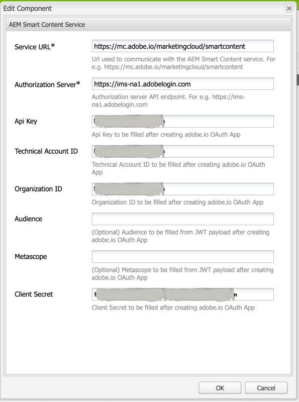
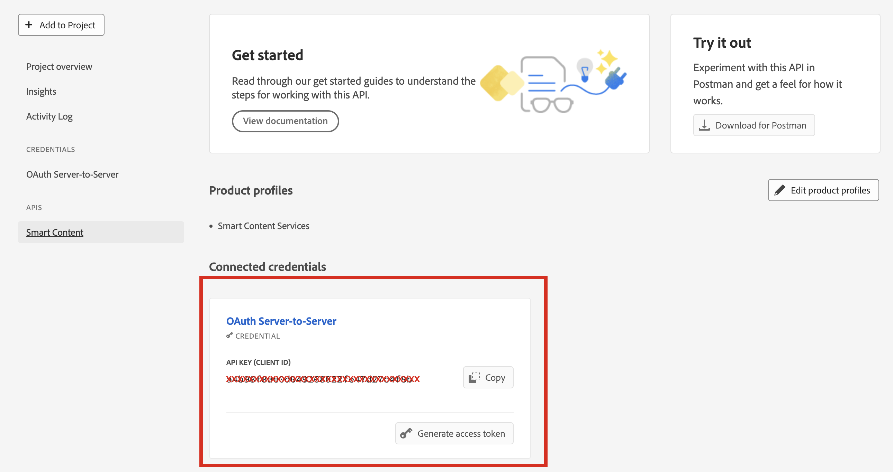

# Risoluzione dei problemi di smart tag per le credenziali OAuth {#oauth-config}

È necessaria una configurazione di autorizzazione aperta per adottare il consenso all&#39;applicazione [!DNL Adobe Experience Manager] per interagire con Smart Content Services in modo protetto.

>[!NOTE]
>
> Non puoi creare nuove credenziali JWT da giugno 2024 in poi. Da questo momento in poi, verranno create solo le credenziali server-to-server OAuth.
> L’integrazione JWT continua a funzionare fino a gennaio 2025 solo per gli utenti AMS e on-premise esistenti.

## Configurazione OAuth per i nuovi utenti AMS {#oauth-config-existing-ams-users}

Per la configurazione dei servizi OAuth per un nuovo utente, consulta [configurazione dei servizi di contenuti avanzati](#integrate-adobe-io). Al termine, segui questi [passaggi](#prereqs-config-oauth-onprem).

>[!NOTE]
>
>Se necessario, puoi inviare un ticket di supporto dopo il [processo di supporto](https://experienceleague.adobe.com/it?lang=it&support-tab=home#support).

## Configurazione OAuth per gli utenti AMS esistenti {#oauth-config-new-ams-users}

Prima di eseguire uno dei passaggi di questa metodologia, è necessario implementare quanto segue:

### Prerequisiti {#prereqs-config-oauth-onprem}

Una configurazione OAuth richiede i seguenti prerequisiti:

* Crea una nuova integrazione OAuth in [Developer Console](https://developer.adobe.com/console/user/servicesandapis). Utilizza `ClientID`, `ClientSecret`, `OrgID` e altre proprietà nei passaggi seguenti:
* I seguenti file si trovano in questo percorso `/apps/system/config in crx/de`:
   * `com.adobe.granite.auth.oauth.accesstoken.provider.<randomnumbers>.config`
   * `com.adobe.granite.auth.ims.impl.IMSAccessTokenRequestCustomizerImpl.<randomnumber>.config`

### Configurazione OAuth per gli utenti AMS esistenti e On-Prem {#steps-config-oauth-onprem}

I seguenti passaggi possono essere eseguiti dall&#39;amministratore di sistema in **CRXDE**. Il cliente AMS può contattare il rappresentante di Adobe o inviare un ticket di supporto dopo la [procedura di supporto](https://experienceleague.adobe.com/it?lang=it&support-tab=home#support).

1. Aggiungi o aggiorna le seguenti proprietà in `com.adobe.granite.auth.oauth.accesstoken.provider.<randomnumbers>.config`:

   * `auth.token.provider.authorization.grants="client_credentials"`
   * `auth.token.provider.orgId="<OrgID>"`
   * `auth.token.provider.default.claims=("\"iss\"\ :\ \"<OrgID>\"")`
   * `auth.token.provider.scope="read_pc.dma_smart_content,\ openid,\ AdobeID,\ additional_info.projectedProductContext"`

     `auth.token.validator.type="adobe-ims-similaritysearch"`
   * Aggiorna `auth.token.provider.client.id` con l&#39;ID client della nuova configurazione OAuth.
   * Aggiorna `auth.access.token.request` a `"https://ims-na1.adobelogin.com/ims/token/v3"`
1. Rinominare il file in `com.adobe.granite.auth.oauth.accesstoken.provider-<randomnumber>.config`.

   >[!IMPORTANT]
   >
   >Sostituire il punto (.) con il trattino (-) come prefisso di `<randomnumber>`.

1. Eseguire i passaggi seguenti in `com.adobe.granite.auth.ims.impl.IMSAccessTokenRequestCustomizerImpl.<randomnumber>.config`:
   * Aggiorna la proprietà auth.ims.client.secret con il segreto client dalla nuova integrazione OAuth.
   * Rinomina il file in `com.adobe.granite.auth.ims.impl.IMSAccessTokenRequestCustomizerImpl-<randomnumber>.config`
1. Salva tutte le modifiche nella console di sviluppo dell’archivio dei contenuti, ad esempio CRXDE.
<!--
1. Navigate to `/system/console/configMgr` and replace the OSGi configuration from `.<randomnumber>` to `-<randomnumber>`.
1. Delete the old OSGi configuration for `"Access Token provider name: adobe-ims-similaritysearch"` in `/system/console/configMgr`.
-->
1. In `System/console/configMgr` è possibile visualizzare sia file di configurazione precedenti che nuovi. Eliminare le configurazioni precedenti per `com.adobe.granite.auth.ims.impl.IMSAccessTokenRequestCustomizerImpl` e il nome del provider del token di accesso `adobe-ims-similaritysearch`. Verifica che sia attiva solo la configurazione aggiornata, anziché le configurazioni precedenti.
1. Riavvia la console.

## Convalidare la configurazione {#validate-the-configuration}

Dopo aver completato la configurazione, puoi utilizzare un MBean JMX per convalidarla. Per eseguire la convalida, effettua le seguenti operazioni.

1. Accedi al server di [!DNL Experience Manager] all’indirizzo `https://[aem_server]:[port]`.

1. Vai a **[!UICONTROL Strumenti]** > **[!UICONTROL Operazioni]** > **[!UICONTROL Console Web]** per aprire la console OSGi. Fai clic su **[!UICONTROL Principale] > [!UICONTROL JMX]**.

1. Fai clic su `com.day.cq.dam.similaritysearch.internal.impl`. Apre **[!UICONTROL Attività varie di SimilaritySearch]**.

1. Fai clic su `validateConfigs()`. Nella finestra di dialogo **[!UICONTROL Validate Configurations]** (Convalida configurazioni), fai clic su **[!UICONTROL Invoke]** (Richiama).

I risultati della convalida vengono visualizzati nella stessa finestra di dialogo.

>[!NOTE]
>
>Se si verifica l&#39;errore `unsupported_grant_type`, provare a installare l&#39;hotfix Granite. Consulta [migrazione da account di servizio (JWT) a credenziali server-to-server OAuth](https://experienceleague.adobe.com/it/docs/experience-cloud-kcs/kbarticles/ka-24660).

## Integrare con Adobe Developer Console {#integrate-adobe-io}

In qualità di nuovo utente, quando si esegue l&#39;integrazione con Adobe Developer Console, il server [!DNL Experience Manager] autentica le credenziali del servizio con il gateway di Adobe Developer Console prima di inoltrare la richiesta al Servizio di contenuti avanzati. Per l’integrazione, è necessario un account Adobe ID con privilegi di amministratore per l’organizzazione e una licenza del Servizio di contenuti avanzati acquistata e abilitata per la tua organizzazione.

Per configurare il Servizio di contenuti avanzati, segui questi passaggi di livello principale:

<!---->

1. Per generare una chiave pubblica, [crea una configurazione del Servizio di contenuti avanzati](#oauth-config) in [!DNL Experience Manager]. [Scarica un certificato pubblico](#oauth-config) per l&#39;integrazione OAuth.

1. *[Non applicabile se sei un utente esistente]* [crea un&#39;integrazione in Adobe Developer Console](#create-adobe-i-o-integration).

1. [Configura la distribuzione](#configure-smart-content-service) utilizzando la chiave API e altre credenziali di Adobe Developer Console.

1. [Verifica la configurazione](#validate-the-configuration).

## Scaricare un certificato pubblico creando la configurazione del Servizio di contenuti avanzati {#download-public-certificate}

Un certificato pubblico ti consente di autenticare il profilo su Adobe Developer Console.

1. Nell’interfaccia di [!DNL Experience Manager], accedi a **[!UICONTROL Strumenti]** > **[!UICONTROL Cloud Services]** > **[!UICONTROL Servizi cloud precedenti]**.

1. Nella pagina Cloud Service, fai clic su **[!UICONTROL Configura ora]** in **[!UICONTROL Tag avanzati di Assets]**.

1. Nella finestra di dialogo **[!UICONTROL Crea configurazione]**, specifica un titolo e un nome per la configurazione di tag avanzati. Fai clic su **[!UICONTROL Crea]**.

1. Nella finestra di dialogo **[!UICONTROL Servizio di contenuti avanzati AEM]**, usa i seguenti valori:

   **[!UICONTROL URL servizio]**: `https://smartcontent.adobe.io/<region where your Experience Manager author instance is hosted>`

   Ad esempio, `https://smartcontent.adobe.io/apac`. È possibile specificare `na`, `emea` o `apac` come aree in cui è ospitata l&#39;istanza Autore Experience Manager.

   >[!NOTE]
   >
   >Se il provisioning di Experience Manager Managed Service è stato eseguito prima del 1° settembre 2022, utilizza il seguente URL del servizio:
   >`https://mc.adobe.io/marketingcloud/smartcontent`

   **[!UICONTROL Server autorizzazioni]**: `https://ims-na1.adobelogin.com`

   Lascia vuoti gli altri campi per il momento (dovranno essere riempiti successivamente). Fai clic su **[!UICONTROL OK]**.

   

   *Figura: finestra di dialogo Servizio di contenuti avanzati per fornire l&#39;URL del servizio di contenuti*

   >[!NOTE]
   >
   >L&#39;URL fornito come [!UICONTROL URL servizio] non è accessibile tramite il browser e genera un errore 404. La configurazione funziona correttamente con lo stesso valore del parametro [!UICONTROL URL servizio]. Per informazioni sullo stato generale del servizio e sulla pianificazione della manutenzione, vedere [https://status.adobe.com](https://status.adobe.com).

1. Fai clic su **[!UICONTROL Scarica certificato pubblico per integrazione OAuth]** e scarica il file del certificato pubblico `AEM-SmartTags.crt`. Inoltre, non è più necessario caricare questo certificato nella console Adobe Developer.

   

   *Figura: impostazioni per il servizio di assegnazione tag avanzati.*

## Creare l’integrazione con Adobe Developer Console {#create-adobe-i-o-integration}

Per utilizzare le API del Servizio di contenuti avanzati, creare un&#39;integrazione in Adobe Developer Console per ottenere [!UICONTROL la chiave API] (generata nel campo [!UICONTROL ID CLIENT] dell&#39;integrazione Adobe Developer Console), [!UICONTROL ID ACCOUNT TECNICO], [!UICONTROL ID ORGANIZZAZIONE] e [!UICONTROL SEGRETO CLIENT] per [!UICONTROL Impostazioni del Servizio di tag avanzati Assets] della configurazione cloud in [!DNL Experience Manager].

1. Accedi a [https://developer.adobe.com/console/](https://developer.adobe.com/console/) in un browser. Seleziona l’account appropriato e verifica che il ruolo aziendale associato sia quello di amministratore di sistema.

1. Crea un progetto con il nome desiderato. Fai clic su **[!UICONTROL Aggiungi API]**.

1. Nella pagina **[!UICONTROL Aggiungi un’API]**, seleziona **[!UICONTROL Experience Cloud]** e **[!UICONTROL Contenuti avanzati]**. Fai clic su **[!UICONTROL Avanti]**.

1. Scegliere il metodo di autenticazione da server a server **[!UICONTROL OAuth]**.

1. Aggiungi/modifica **[!UICONTROL Nome credenziali]** come richiesto. Fai clic su **[!UICONTROL Avanti]**.

1. Selezionare il profilo di prodotto **[!UICONTROL Servizi di contenuti avanzati]**. Fare clic su **[!UICONTROL Salva API configurata]**. L’API OAuth viene aggiunta alle credenziali connesse per un ulteriore utilizzo. È possibile copiare la [!UICONTROL chiave API (ID client)] o [!UICONTROL generare il token di accesso] da essa.
<!--
1. On the **[!UICONTROL Select product profiles]** page, select **[!UICONTROL Smart Content Services]**. Click **[!UICONTROL Save configured API]**.

   A page displays more information about the configuration. Keep this page open to copy and add these values in [!UICONTROL Assets Smart Tagging Service Settings] of cloud configuration in [!DNL Experience Manager] to configure smart tags.

   

   *Figure: Details of integration in Adobe Developer Console*
-->

*Figura: configurazione di OAuth Server-to-Server in Adobe Developer Console*

## Configurare il Servizio di contenuti avanzati {#configure-smart-content-service}

Per configurare l&#39;integrazione, utilizzare i valori dei campi [!UICONTROL ID ACCOUNT TECNICO], [!UICONTROL ID ORGANIZZAZIONE], [!UICONTROL SEGRETO CLIENT] e [!UICONTROL ID CLIENT] dell&#39;integrazione Adobe Developer Console. La creazione di una configurazione cloud di tag avanzati consente l&#39;autenticazione delle richieste API dalla distribuzione [!DNL Experience Manager].

1. In [!DNL Experience Manager], passa a **[!UICONTROL Strumenti]** > **[!UICONTROL Cloud Service]** > **[!UICONTROL Cloud Services precedenti]** per aprire la console [!UICONTROL Cloud Services].

1. In **[!UICONTROL Tag avanzati risorse]**, apri la configurazione creata in precedenza. Nella pagina delle impostazioni del servizio, fai clic su **[!UICONTROL Modifica]**.

1. Nella finestra di dialogo **[!UICONTROL Servizio di contenuti avanzati AEM]**, utilizza i valori precompilati per i campi **[!UICONTROL URL servizio]** e **[!UICONTROL Server autorizzazioni]**.

1. Per i campi [!UICONTROL Chiave API], [!UICONTROL ID account tecnico], [!UICONTROL ID organizzazione] e [!UICONTROL Segreto client], copia e utilizza i seguenti valori generati nell&#39;[integrazione Adobe Developer Console](#create-adobe-i-o-integration).

   | [!UICONTROL Impostazioni del servizio di assegnazione tag avanzati di Assets] | [!DNL Adobe Developer Console] campi di integrazione |
   |--- |--- |
   | [!UICONTROL Chiave Api] | [!UICONTROL ID CLIENT] |
   | [!UICONTROL ID account tecnico] | [!UICONTROL ID ACCOUNT TECNICO] |
   | [!UICONTROL ID organizzazione] | [!UICONTROL ID ORGANIZZAZIONE] |
   | [!UICONTROL Segreto client] | [!UICONTROL SEGRETO CLIENT] |

>[!MORELIKETHIS]
>
>* [Panoramica e formazione dei tag avanzati](enhanced-smart-tags.md)
>* [Configura assegnazione tag avanzati](config-smart-tagging.md)
>* [Esercitazione video sugli smart tag](https://experienceleague.adobe.com/docs/experience-manager-learn/assets/metadata/image-smart-tags.html?lang=it)
