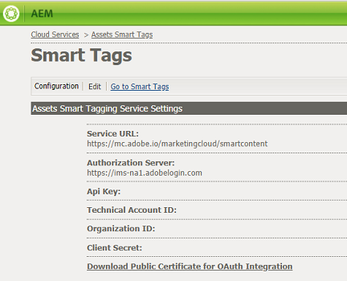

# Configurare i tag delle risorse tramite Smart Content Service {#configure-asset-tagging-using-the-smart-content-service}

Puoi integrare Adobe Experience Manager (AEM) con Smart Content Service tramite Adobe I/O. Utilizzate questa configurazione per accedere a Smart Content Service da AEM.

L&#39;articolo descrive le seguenti attività chiave necessarie per configurare Smart Content Service. Sul lato posteriore, il server AEM autentica le credenziali del servizio con il gateway Adobe IO prima di inoltrare la richiesta a Smart Content Service.

* Create una configurazione di Smart Content Service in AEM per generare una chiave pubblica. Ottenete un certificato pubblico per l&#39;integrazione OAuth.
* Create un&#39;integrazione in Adobe I/O e caricate la chiave pubblica generata.
* Configura l’istanza AEM utilizzando la chiave API e altre credenziali dall’I/O di Adobe.
* Se necessario, abilitate l’assegnazione automatica di tag al caricamento delle risorse.

## Prerequisiti {#prerequisites}

Prima di poter utilizzare Smart Content Service, accertatevi quanto segue per creare un&#39;integrazione su Adobe I/O:

* Un account Adobe ID con privilegi di amministratore per l’organizzazione.
* Il servizio Smart Content Service è abilitato per la vostra azienda.

## Ottenere il certificato pubblico {#obtain-public-certificate}

Un certificato pubblico consente di autenticare il profilo sull&#39;I/O di Adobe.

1. Dall’interfaccia utente di AEM, toccate il logo AEM e passate a **[!UICONTROL Strumenti > Servizi]** cloud > Servizi **** cloud precedenti.

1. Nella pagina Servizi cloud, tocca o fai clic su **[!UICONTROL Configura ora]** sotto Tag **[!UICONTROL avanzati]** risorse.
1. Nella finestra di dialogo **[!UICONTROL Crea configurazione]** , specificate un titolo e un nome per la configurazione Smart Tags. Tocca o fai clic su **[!UICONTROL Crea]**.
1. Nella finestra di dialogo **[!UICONTROL AEM Smart Content Service]** , usate i seguenti valori:

   **[!UICONTROL URL servizio]**: `https://mc.adobe.io/marketingcloud/smartcontent`

   **[!UICONTROL Server autorizzazioni]**: `https://ims-na1.adobelogin.com`

   Lasciate vuoti gli altri campi per ora (da fornire successivamente). Tap/click **[!UICONTROL OK]**.

   

1. Toccate/fate clic su **[!UICONTROL Scarica certificato pubblico per l&#39;integrazione]** OAuth e scaricate il file del certificato pubblico `AEM-SmartTags.crt`.

   

### Riconfigura alla scadenza di un certificato {#certrenew}

Alla scadenza del certificato non è più attendibile. Per aggiungere un nuovo certificato, attenetevi alla procedura seguente. Non è possibile rinnovare un certificato scaduto.

1. Accedete alla distribuzione AEM come amministratore. Fate clic su **[!UICONTROL Strumenti]** > **[!UICONTROL Protezione]** > **[!UICONTROL Utenti]**.

1. Individuate e fate clic su **[!UICONTROL dam-update-service]** user. Fate clic sulla scheda **[!UICONTROL Keystore]** .
1. Eliminate l&#39;archivio di chiavi di ricerca **[!UICONTROL per]** similarità esistente con il certificato scaduto. Fate clic su **[!UICONTROL Salva e chiudi]**.

   

   Per aggiungere un nuovo certificato di protezione, eliminate una voce di ricerca per similarità in Keystore

1. Vai a **[!UICONTROL Strumenti]** > Servizi **** Cloud > Servizi **[!UICONTROL cloud]** legacy. Fate clic su **[!UICONTROL Asset Smart Tags]** (Tag risorse) > **[!UICONTROL Show Configuration]** (Mostra configurazione) > **[!UICONTROL Available Configurations (Configurazioni]** disponibili). Fate clic sulla configurazione richiesta.

1. Per scaricare un certificato pubblico, fate clic su **[!UICONTROL Scarica certificato pubblico per l&#39;integrazione]** OAuth.
1. Accedete a [https://console.adobe.io](https://console.adobe.io) e andate a Smart Content Services nella pagina **[!UICONTROL Integrazioni]** . Caricate il nuovo certificato. Per ulteriori informazioni, consultate le istruzioni in [Creazione dell&#39;integrazione](#create-adobe-i-o-integration)I/O Adobe.

## Crea integrazione I/O Adobe {#create-adobe-i-o-integration}

Per utilizzare le API Smart Content Service, create un&#39;integrazione in Adobe I/O per generare la chiave API, l&#39;ID account tecnico, l&#39;ID organizzazione e il Segreto cliente.

1. Accedete a [https://console.adobe.io](https://console.adobe.io/).
1. Nella pagina **[!UICONTROL Integrazioni]** , selezionate l&#39;account appropriato e verificate che il ruolo organizzazione associato sia amministratore di sistema.
1. Toccate **[!UICONTROL Nuova integrazione]**.
1. Nella pagina **[!UICONTROL Crea nuova integrazione]** , selezionate **[!UICONTROL Accedi a un&#39;API]**. Toccate **[!UICONTROL Continua]**.
1. In **[!UICONTROL Experience Cloud]**, seleziona **[!UICONTROL Smart Content]**. Toccate **[!UICONTROL Continua]**.

   

1. Nella pagina successiva, selezionate **[!UICONTROL Nuova integrazione]**. Toccate o fate clic su **[!UICONTROL Continua]**.
1. Nella pagina **[!UICONTROL Dettagli]** integrazione, specificate un nome per il gateway di integrazione e aggiungete una descrizione.
1. Nei certificati delle chiavi **[!UICONTROL pubbliche]**, caricate il `AEM-SmartTags.crt` file scaricato in precedenza.
1. Tap/click **[!UICONTROL Create Integration]**.
1. Per visualizzare le informazioni sull&#39;integrazione, toccate o fate clic su **[!UICONTROL Continua per visualizzare i dettagli]**.

   

## Configurare Smart Content Service {#configure-smart-content-service}

Per configurare l&#39;integrazione, utilizzate i valori dei campi ID account tecnico, ID organizzazione, Segreto cliente, Server autorizzazioni e chiave API dall&#39;integrazione I/O di Adobe. La creazione di una configurazione cloud di Smart Tags consente l’autenticazione delle richieste API dall’istanza AEM.

1. Dall’interfaccia utente di AEM, toccate o fate clic sul logo AEM. Per aprire la console Servizi cloud, passa a **[!UICONTROL Strumenti > Servizi cloud > Servizi]** cloud legacy.
1. In Tag **[!UICONTROL avanzati]** risorse, apri la configurazione creata sopra. Nella pagina delle impostazioni del servizio, fate clic su **[!UICONTROL Modifica]**.
1. Nella finestra di dialogo **[!UICONTROL AEM Smart Content Service]** , utilizzate i valori precompilati per i campi URL **** servizio e **[!UICONTROL Server]** autorizzazioni.
1. Per i campi Chiave **** API, ID **[!UICONTROL account]** tecnico, ID **** organizzazione e Segreto **** cliente, utilizzate i valori generati sopra.

## Convalida della configurazione {#validate-the-configuration}

Dopo aver completato la configurazione, puoi usare un MBean JMX per convalidare la configurazione. Per eseguire la convalida, effettuare le seguenti operazioni.

1. Accedi al server AEM all&#39;indirizzo `https://[server]:[port]`.

1. Passate a **[!UICONTROL Strumenti > Operazioni > Console]** Web per aprire la console OSGi. Fate clic su **[!UICONTROL Principale > JMX]**.
1. Fate clic su **[!UICONTROL com.day.cq.dam.similaritysearch.internal.impl]**. Si apre **[!UICONTROL SimilaritySearch Attività varie.]**
1. Fare clic su **[!UICONTROL validateConfigs()]**. Nella finestra di dialogo **[!UICONTROL Convalida configurazioni]** , fare clic su **[!UICONTROL Richiama]**.

   Il risultato della convalida viene visualizzato nella stessa finestra di dialogo.

## Abilitare i tag avanzati nel flusso di lavoro Aggiorna risorsa (facoltativo) {#enable-smart-tagging-in-the-update-asset-workflow-optional}

1. Dall’interfaccia utente di AEM, toccate/fate clic sul logo AEM, quindi andate a **[!UICONTROL Strumenti > Flusso di lavoro > Modelli]**.
1. Nella pagina Modelli **[!UICONTROL di]** flusso di lavoro selezionare il modello di flusso di lavoro Aggiorna risorsa **** DAM.
1. Toccate o fate clic su **[!UICONTROL Modifica]** nella barra degli strumenti.
1. Espandete il pannello laterale per visualizzare i passaggi. Trascinate il passaggio **[!UICONTROL Smart Tag Asset]** disponibile nella sezione Flusso di lavoro DAM e inseritelo dopo il passaggio Miniature **** processo.

   

1. Aprite il passaggio in modalità di modifica. In Impostazioni **** avanzate, accertatevi che l&#39;opzione **[!UICONTROL Avanzamento]** gestore sia selezionata.

   

1. Nella scheda **[!UICONTROL Argomenti]** , selezionare **[!UICONTROL Ignora errori]** se si desidera che il flusso di lavoro venga completato anche se il passaggio di tag automatico non riesce.

   

   Per assegnare tag alle risorse quando vengono caricate, a prescindere dal fatto che l’assegnazione di tag avanzati sia abilitata o meno nelle cartelle, selezionate **[!UICONTROL Ignora contrassegno]** smart tag.

   

1. Toccate **[!UICONTROL OK]** per chiudere il passaggio del processo, quindi salvate il flusso di lavoro.

>[!MORELIKETHIS]
>
>* [Gestire i tag avanzati](managing-smart-tags.md)
>* [Panoramica e come formare i tag avanzati](enhanced-smart-tags.md)
>* [Linee guida e regole per la formazione di Smart Content Service](smart-tags-training-guidelines.md)
>* [Esercitazione video sulla configurazione degli smart tag](https://docs.adobe.com/content/help/en/experience-manager-learn/assets/metadata/smart-tags-technical-video-setup.html)

