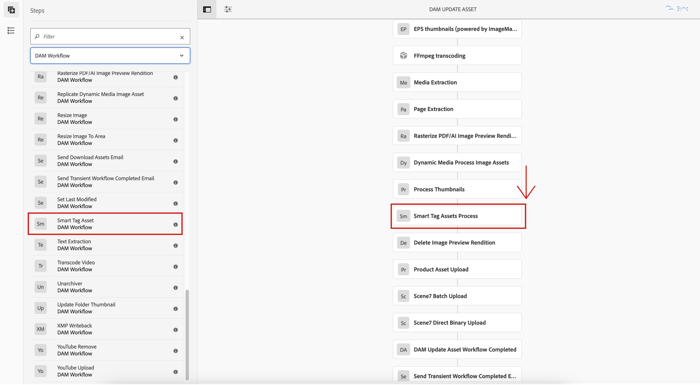

# Preparare [!DNL Assets] per assegnazione tag avanzati {#configure-asset-tagging-using-the-smart-content-service}

Prima di iniziare a assegnare tag alle risorse utilizzando Smart Content Services, è necessario integrare [!DNL Experience Manager Assets] con Adobe Developer Console per sfruttare il servizio intelligente di [!DNL Adobe Sensei]. Una volta configurato, assicurati di addestrare il servizio utilizzando alcune immagini e un tag.

>[!NOTE]
>
>* I servizi di contenuti avanzati non sono più disponibili per la nuova [!DNL Experience Manager Assets] Clienti on-premise. I clienti on-premise esistenti che dispongono già di questa funzionalità abilitata possono continuare a utilizzare i Servizi di contenuti avanzati.
>* Smart Content Services è disponibile per i servizi esistenti [!DNL Experience Manager Assets] Clienti Managed Services che dispongono già di questa funzionalità abilitata.
>* Nuovo [!DNL Experience Manager Assets] I clienti Managed Services possono seguire le istruzioni riportate in questo articolo per configurare i servizi per contenuti avanzati.

Prima di utilizzare il Servizio di contenuti avanzati, verifica quanto segue:

* [Integrare con Adobe Developer Console](#integrate-adobe-io).
* [Formazione del Servizio di contenuti avanzati](#training-the-smart-content-service).

* Installa la versione più recente [[!DNL Experience Manager] Service Pack](https://experienceleague.adobe.com/docs/experience-manager-release-information/aem-release-updates/aem-releases-updates.html?lang=it).

## Integrare con Adobe Developer Console {#integrate-adobe-io}

Quando ti integri con Adobe Developer Console, la [!DNL Experience Manager] prima di inoltrare la richiesta al Servizio di contenuti avanzati, il server autentica le credenziali del servizio con il gateway della console Adobe Developer. Per eseguire l’integrazione, è necessario un account Adobe ID con privilegi di amministratore per l’organizzazione e la licenza Servizio di contenuti avanzati acquistata e abilitata per l’organizzazione.

Per configurare il Servizio di contenuti avanzati, segui questi passaggi principali:

1. Per generare una chiave pubblica, [Creare un servizio di contenuti avanzati](#obtain-public-certificate) configurazione in [!DNL Experience Manager]. [Ottieni un certificato pubblico](#obtain-public-certificate) per l’integrazione di OAuth.

1. [Crea un’integrazione in Adobe Developer Console](#create-adobe-i-o-integration) e carica la chiave pubblica generata.

1. [Configurare la distribuzione](#configure-smart-content-service) utilizzando la chiave API e altre credenziali dalla console Adobe Developer.

1. [Verifica la configurazione](#validate-the-configuration).

1. Facoltativamente, [abilitare l’assegnazione tag automatica al caricamento delle risorse](#enable-smart-tagging-in-the-update-asset-workflow-optional).

### Ottenere un certificato pubblico creando la configurazione del Servizio di contenuti avanzati {#obtain-public-certificate}

Un certificato pubblico ti consente di autenticare il profilo su Adobe Developer Console.

1. Nell’interfaccia di [!DNL Experience Manager], accedi a **[!UICONTROL Strumenti]** > **[!UICONTROL Cloud Services]** > **[!UICONTROL Servizi cloud precedenti]**.

1. Nella pagina Cloud Services, fai clic su **[!UICONTROL Configura ora]** sotto **[!UICONTROL Tag avanzati risorse]**.

1. Nella finestra di dialogo **[!UICONTROL Crea configurazione]**, specifica un titolo e un nome per la configurazione di tag avanzati. Fai clic su **[!UICONTROL Crea]**.

1. Nella finestra di dialogo **[!UICONTROL Servizio di contenuti avanzati AEM]**, usa i seguenti valori:

   **[!UICONTROL URL servizio]**: `https://smartcontent.adobe.io/<region where your Experience Manager author instance is hosted>`

   Ad esempio, `https://smartcontent.adobe.io/apac`. Puoi specificare `na`, `emea`oppure `apac` come aree in cui è ospitata l’istanza di authoring di Experience Manager.

   >[!NOTE]
   >
   >Se il provisioning di Experience Manager Managed Service è precedente al 10 settembre 2022, utilizza il seguente URL di servizio:
   >`https://mc.adobe.io/marketingcloud/smartcontent`

   **[!UICONTROL Server autorizzazioni]**: `https://ims-na1.adobelogin.com`

   Lascia vuoti gli altri campi per il momento (dovranno essere riempiti successivamente). Fai clic su **[!UICONTROL OK]**.

   

   *Figura: Finestra di dialogo Servizio di contenuti avanzati per fornire l’URL del servizio di contenuti*

   >[!NOTE]
   >
   >L’URL fornito come [!UICONTROL URL servizio] non è accessibile tramite browser e genera un errore 404. La configurazione funziona correttamente con lo stesso valore del [!UICONTROL URL servizio] parametro . Per informazioni sullo stato generale del servizio e sul programma di manutenzione, consulta [https://status.adobe.com](https://status.adobe.com).

1. Fai clic su **[!UICONTROL Scarica certificato pubblico per integrazione OAuth]** e scarica il file del certificato pubblico `AEM-SmartTags.crt`.

   

   *Figura: Impostazioni per il servizio di assegnazione tag avanzati.*

#### Riconfigura alla scadenza del certificato {#certrenew}

Dopo la scadenza di un certificato, non è più attendibile. Non è possibile rinnovare un certificato scaduto. Per aggiungere un certificato, effettua le seguenti operazioni.

1. Accedi alla tua implementazione di [!DNL Experience Manager] come amministratore. Fai clic su **[!UICONTROL Strumenti]** > **[!UICONTROL Protezione]** > **[!UICONTROL Utenti]**.

1. Individua e fai clic sull’utente **[!UICONTROL dam-update-service]**. Fai clic su **[!UICONTROL Keystore]** scheda .

1. Elimina il registro chiavi esistente **[!UICONTROL similaritysearch]** con il certificato scaduto. Fai clic su **[!UICONTROL Salva e chiudi]**.

   

   *Figura: Elimina l&#39;esistente `similaritysearch` voce in Registro chiavi per aggiungere un certificato di sicurezza.*

1. Vai a **[!UICONTROL Strumenti]** > **[!UICONTROL Cloud Services]** > **[!UICONTROL Servizi cloud precedenti]**. Fai clic su **[!UICONTROL Tag avanzati risorse]** > **[!UICONTROL Mostra configurazioni]** > **[!UICONTROL Configurazioni disponibili]**. Seleziona la configurazione richiesta.

1. Per scaricare un certificato pubblico, fai clic su **[!UICONTROL Scarica certificato pubblico per integrazione OAuth]**.

1. Accedi a [https://console.adobe.io](https://console.adobe.io) e passa ai Servizi di contenuti avanzati esistenti nella pagina **[!UICONTROL Integrazioni]**. Carica il nuovo certificato. Per ulteriori informazioni, consulta le istruzioni in [Creare l’integrazione con la console Adobe Developer](#create-adobe-i-o-integration).

### Creare l’integrazione con la console Adobe Developer {#create-adobe-i-o-integration}

Per utilizzare le API del Servizio di contenuti avanzati, crea un’integrazione nella console Adobe Developer per ottenere [!UICONTROL Chiave API] (generato in [!UICONTROL ID CLIENT] campo dell’integrazione della console Adobe Developer), [!UICONTROL ID ACCOUNT TECNICO], [!UICONTROL ID ORGANIZZAZIONE]e [!UICONTROL SEGRETO CLIENT] per [!UICONTROL Impostazioni del servizio di assegnazione tag avanzati delle risorse] della configurazione cloud in [!DNL Experience Manager].

1. Accedi a [https://console.adobe.io](https://console.adobe.io/) in un browser. Seleziona l’account appropriato e verifica che il ruolo aziendale associato sia quello di amministratore di sistema.

1. Crea un progetto con il nome desiderato. Fai clic su **[!UICONTROL Aggiungi API]**.

1. Nella pagina **[!UICONTROL Aggiungi un’API]**, seleziona **[!UICONTROL Experience Cloud]** e **[!UICONTROL Contenuti avanzati]**. Fai clic su **[!UICONTROL Avanti]**.

1. Seleziona **[!UICONTROL Carica la chiave pubblica]**. Fornisci il file del certificato scaricato da [!DNL Experience Manager]. Viene visualizzato il messaggio [!UICONTROL Chiavi pubbliche caricate correttamente]. Fai clic su **[!UICONTROL Avanti]**.

   [!UICONTROL Creare una nuova credenziale dell’account di servizio (JWT)] visualizza la chiave pubblica per l’account del servizio.

1. Fai clic su **[!UICONTROL Avanti]**.

1. Nella pagina per la **[!UICONTROL selezione dei profili di prodotto]**, seleziona **[!UICONTROL Servizi di contenuti avanzati]**. Fai clic su **[!UICONTROL Salva API configurata]**.

   In una pagina vengono visualizzate ulteriori informazioni sulla configurazione. Tieni aperta questa pagina per copiare e aggiungere questi valori in [!UICONTROL Impostazioni del servizio di assegnazione tag avanzati delle risorse] della configurazione cloud in [!DNL Experience Manager] per configurare tag avanzati.

   

   *Figura: Dettagli dell’integrazione nella console Adobe Developer*

### Configurare il Servizio di contenuti avanzati {#configure-smart-content-service}

Per configurare l’integrazione, utilizza i valori di [!UICONTROL ID ACCOUNT TECNICO], [!UICONTROL ID ORGANIZZAZIONE], [!UICONTROL SEGRETO CLIENT]e [!UICONTROL ID CLIENT] campi dell’integrazione della console Adobe Developer. La creazione di una configurazione cloud di tag avanzati consente l’autenticazione delle richieste API da [!DNL Experience Manager] distribuzione.

1. In [!DNL Experience Manager], passa a **[!UICONTROL Strumenti]** > **[!UICONTROL Cloud Service]** > **[!UICONTROL Cloud Services legacy]** per aprire [!UICONTROL Cloud Services] console.

1. In **[!UICONTROL Tag avanzati risorse]**, apri la configurazione creata in precedenza. Nella pagina delle impostazioni del servizio, fai clic su **[!UICONTROL Modifica]**.

1. Nella finestra di dialogo **[!UICONTROL Servizio di contenuti avanzati AEM]**, utilizza i valori precompilati per i campi **[!UICONTROL URL servizio]** e **[!UICONTROL Server autorizzazioni]**.

1. Per i campi [!UICONTROL Chiave Api], [!UICONTROL ID account tecnico], [!UICONTROL ID organizzazione]e [!UICONTROL Segreto client], copia e utilizza i seguenti valori generati in [Integrazione con la console Adobe Developer](#create-adobe-i-o-integration).

   | [!UICONTROL Impostazioni servizio tag avanzati di Assets] | [!DNL Adobe Developer Console] campi di integrazione |
   |--- |--- |
   | [!UICONTROL Chiave API] | [!UICONTROL ID CLIENT] |
   | [!UICONTROL ID account tecnico] | [!UICONTROL ID ACCOUNT TECNICO] |
   | [!UICONTROL ID organizzazione] | [!UICONTROL ID ORGANIZZAZIONE] |
   | [!UICONTROL Segreto client] | [!UICONTROL SEGRETO CLIENT] |

### Convalidare la configurazione {#validate-the-configuration}

Dopo aver completato la configurazione, puoi utilizzare un MBean JMX per convalidare la configurazione. Per eseguire la convalida, effettua le seguenti operazioni.

1. Accedi al server di [!DNL Experience Manager] all’indirizzo `https://[aem_server]:[port]`.

1. Vai a **[!UICONTROL Strumenti]** > **[!UICONTROL Operazioni]** > **[!UICONTROL Console web]** per aprire la console OSGi. Fai clic su **[!UICONTROL Principale] > [!UICONTROL JMX]**.

1. Clic `com.day.cq.dam.similaritysearch.internal.impl`. Si apre **[!UICONTROL Attività varie SimilaritySearch]**.

1. Clic `validateConfigs()`. Nella finestra di dialogo **[!UICONTROL Validate Configurations]** (Convalida configurazioni), fai clic su **[!UICONTROL Invoke]** (Richiama).

I risultati della convalida vengono visualizzati nella stessa finestra di dialogo.

### Abilitare l’assegnazione tag avanzati nella [!UICONTROL Risorsa di aggiornamento DAM] workflow (facoltativo) {#enable-smart-tagging-in-the-update-asset-workflow-optional}

1. In [!DNL Experience Manager], vai a **[!UICONTROL Strumenti]** > **[!UICONTROL Flusso di lavoro]** > **[!UICONTROL Modelli]**.

1. Nella pagina **[!UICONTROL Modelli flusso di lavoro]**, seleziona il modello del flusso di lavoro **[!UICONTROL Risorsa di aggiornamento DAM]**.

1. Fai clic su **[!UICONTROL Modifica]** nella barra degli strumenti.

1. Per visualizzare i passaggi, espandi il pannello laterale. Trascina il passaggio **[!UICONTROL Risorsa di tag avanzati]** della sezione Flusso di lavoro DAM e inseriscilo dopo il passaggio **[!UICONTROL Elabora miniature]**.

   

   *Figura: Aggiungi il passaggio Risorsa di tag avanzati dopo il passaggio Elabora miniature nel flusso di lavoro Aggiorna risorsa DAM.*

1. Apri il passaggio in modalità di modifica. In **[!UICONTROL Impostazioni avanzate]**, accertati che sia selezionata l’opzione **[!UICONTROL Avanzamento gestore]**.

   

   *Figura: Configura il flusso di lavoro Aggiorna risorsa DAM e aggiungi il passaggio tag avanzati*

1. Nella scheda **[!UICONTROL Argomenti]**, seleziona **[!UICONTROL Ignora errori]** se vuoi che il flusso di lavoro venga completato anche con esito negativo del passaggio di assegnazione tag automatica.

   

   *Figura: Configura il flusso di lavoro Aggiorna risorsa DAM per aggiungere il passaggio tag avanzati e selezionare l&#39;avanzamento del gestore*

   Per assegnare i tag alle risorse quando vengono caricate, a prescindere dal fatto che l’assegnazione tag avanzati sia abilitata o meno per le cartelle, seleziona **[!UICONTROL Ignora flag di tag avanzati]**.

   

   *Figura: Configura il flusso di lavoro Aggiorna risorsa DAM per aggiungere il passaggio tag avanzati e seleziona ignora il flag Tag avanzati.*

1. Fai clic su **[!UICONTROL OK]** per chiudere il passaggio del processo, quindi salva il flusso di lavoro.

## Formazione del Servizio di contenuti avanzati {#training-the-smart-content-service}

Affinché il Servizio di contenuti avanzati riconosca la tassonomia aziendale, eseguilo su un set di risorse che già includono tag rilevanti per la tua azienda. Per assegnare efficacemente tag alle immagini del tuo marchio, il Servizio di contenuti avanzati richiede che le immagini di formazione siano conformi a determinate linee guida. Dopo la formazione, il servizio può applicare la stessa tassonomia su un set di risorse simile.

È possibile addestrare il servizio più volte per migliorarne la capacità di applicare tag pertinenti. Dopo ogni ciclo di formazione, esegui un flusso di lavoro di assegnazione tag e verifica se le risorse sono state contrassegnate in modo appropriato.

Puoi addestrare il Servizio di contenuti avanzati periodicamente o su richiesta.

>[!NOTE]
>
>Il flusso di lavoro di formazione viene eseguito solo sulle cartelle.

### Orientamenti per la formazione {#guidelines-for-training}

Per ottenere i migliori risultati, le immagini del set di formazione sono conformi alle seguenti linee guida:

**Quantity and size (Quantità e dimensioni)**: almeno 30 immagini per tag. Almeno 500 pixel sul lato più lungo.

**Coerenza**: Le immagini utilizzate per un tag specifico sono visivamente simili.

Ad esempio, non è consigliabile assegnare a tutte queste immagini il tag `my-party` (per la formazione) perché non sono visivamente simili.

**Copertura**: Utilizza una varietà sufficiente nelle immagini del corso di formazione. L&#39;idea è quella di fornire alcuni esempi, ma abbastanza diversi, in modo che l&#39;Experience Manager impari a concentrarsi sulle cose giuste. Se applichi lo stesso tag a immagini visivamente diverse, includi almeno cinque esempi di ogni tipo.

Ad esempio, per il tag *modello in giù*, includi più immagini di formazione simili all’immagine evidenziata qui sotto per consentire al servizio di identificare immagini simili con maggiore precisione durante l’assegnazione tag.

**Distrazione/ostruzione**: Il servizio si allena meglio sulle immagini che hanno meno distrazioni (sfondi ben visibili, accompagnamento indipendenti, come oggetti/persone con il soggetto principale).

Ad esempio, per il tag *scarpa casuale*, la seconda immagine non è un buon candidato per la formazione.

**Completeness (Completezza):** se un’immagine è idonea per più tag, aggiungi tutti i tag applicabili prima di includere l’immagine nella formazione. Ad esempio, per tag quali `raincoat` e `model-side-view`, aggiungi entrambi i tag alla risorsa idonea prima di includerla nella formazione.

>[!NOTE]
>
>La capacità del Servizio di contenuti avanzati di addestrare i tag e applicarli ad altre immagini dipende dalla qualità delle immagini utilizzate per la formazione. Per ottenere risultati ottimali, l’Adobe consiglia di utilizzare immagini visivamente simili per addestrare il servizio per ogni tag.

### Formazione periodica {#periodic-training}

Puoi abilitare il Servizio di contenuti avanzati per addestrare periodicamente le risorse e i tag associati all’interno di una cartella. Apri [!UICONTROL Proprietà] nella pagina della cartella risorse, seleziona **[!UICONTROL Abilita tag avanzati]** in **[!UICONTROL Dettagli]** e salva le modifiche.

Una volta selezionata questa opzione per una cartella, [!DNL Experience Manager] esegue automaticamente un flusso di lavoro di formazione per addestrare il Servizio di contenuti avanzati sulle risorse delle cartelle e sui relativi tag. Per impostazione predefinita, il flusso di lavoro di formazione viene eseguito settimanalmente alle 12:30 del sabato.

### Formazione on-demand {#on-demand-training}

Puoi addestrare il Servizio di contenuti avanzati tutte le volte che lo desideri dalla console Flusso di lavoro.

1. In [!DNL Experience Manager] interfaccia, vai a **[!UICONTROL Strumenti]** > **[!UICONTROL Flusso di lavoro]** > **[!UICONTROL Modelli]**.
1. Da **[!UICONTROL Modelli di flusso di lavoro]** , seleziona la **[!UICONTROL Formazione sui tag avanzati]** , quindi fai clic su **[!UICONTROL Avvia flusso di lavoro]** dalla barra degli strumenti.
1. In **[!UICONTROL Esegui flusso di lavoro]** , individua la cartella payload che include le risorse con tag per la formazione del servizio.
1. Specifica un titolo per il flusso di lavoro e aggiungi un commento. Quindi, fai clic su **[!UICONTROL Esegui]**. Le risorse e i tag vengono inviati per la formazione.

   

>[!NOTE]
>
>Una volta elaborate le risorse di una cartella per la formazione, solo le risorse modificate vengono elaborate nei cicli di formazione successivi.

### Visualizzare i rapporti di formazione {#viewing-training-reports}

Per verificare se il Servizio di contenuti avanzati è addestrato sui tag nel set di risorse di formazione, controlla il rapporto del flusso di lavoro di formazione dalla console Rapporti.

1. In [!DNL Experience Manager] interfaccia, vai a **[!UICONTROL Strumenti]** > **[!UICONTROL Risorse]** > **[!UICONTROL Rapporti]**.
1. In **[!UICONTROL Rapporti sulle risorse]** pagina, fai clic su **[!UICONTROL Crea]**.
1. Seleziona la **[!UICONTROL Formazione sui tag avanzati]** , quindi fai clic su **[!UICONTROL Successivo]** dalla barra degli strumenti.
1. Specifica un titolo e una descrizione per il rapporto. In **[!UICONTROL Pianifica rapporto]**, lascia selezionata l’opzione **[!UICONTROL Now (Ora)]**. Se vuoi pianificare il rapporto per un momento successivo, seleziona **[!UICONTROL Later (Più tardi)]** e specifica una data e un’ora. Quindi, fai clic su **[!UICONTROL Crea]** dalla barra degli strumenti.
1. Nella pagina **[!UICONTROL Rapporti su risorse]**, seleziona il rapporto generato. Per visualizzare il rapporto, fai clic su **[!UICONTROL Visualizza]** dalla barra degli strumenti.
1. Rivedi i dettagli del rapporto.

   Il rapporto mostra lo stato di formazione per i tag che hai appreso. La presenza del colore verde nella colonna **[!UICONTROL Training Status (Stato formazione)]** indica che per il tag è stato eseguito il training del servizio di contenuti avanzati. Se invece del verde è presente il colore giallo, il training del servizio di contenuti avanzati non è stato completato per un tag specifico. In questo caso, aggiungi altre immagini che contengono il tag in questione ed esegui il flusso di lavoro di formazione per completare il training del servizio per quel tag.

   Se i tag non vengono visualizzati in questo rapporto, esegui nuovamente il flusso di lavoro di formazione per questi tag.

1. Per scaricare il rapporto, selezionalo dall’elenco e fai clic su **[!UICONTROL Scarica]** dalla barra degli strumenti. Il rapporto viene scaricato come foglio di calcolo di Microsoft Excel.

## Limitazioni {#limitations}

* Gli smart tag migliorati si basano su modelli di apprendimento delle immagini e dei relativi tag. Questi modelli non sono sempre perfetti per identificare i tag. La versione corrente del Servizio di contenuti avanzati presenta le seguenti limitazioni:

   * Incapacità di riconoscere sottili differenze nelle immagini. Ad esempio, camicie sottili o regolari.
   * Incapacità di identificare i tag in base a piccoli pattern/parti di un’immagine. Ad esempio, i loghi sulle T-shirt.
   * L’assegnazione tag è supportata nelle impostazioni internazionali che [!DNL Experience Manager] è supportato in .

* Per cercare le risorse con tag avanzati (regolari o migliorati), utilizza la funzione [!DNL Assets] Omnisearch (ricerca full-text). Non esiste un predicato di ricerca separato per gli smart tag.

>[!MORELIKETHIS]
>
>* [Panoramica e modalità di formazione dei tag avanzati](enhanced-smart-tags.md)
>* [Esercitazione video sugli smart tag](https://experienceleague.adobe.com/docs/experience-manager-learn/assets/metadata/image-smart-tags.html)

