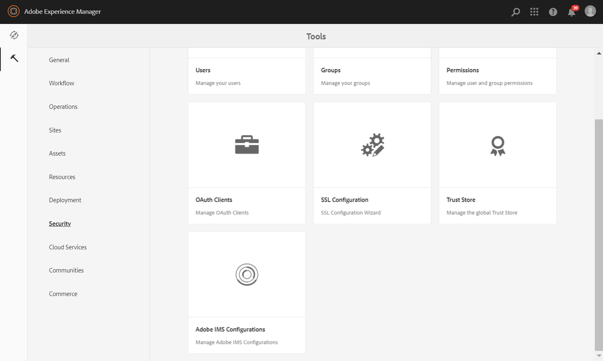

# Configurare AEM Assets con Brand Portal {#configure-integration-65}

Adobe Experience Manager (AEM) Assets è configurato con Portale marchio tramite  Developer Console di Adobe, che fornisce un token IMS per l’autorizzazione del tenant del Brand Portal.

>[!NOTE]
>
>La configurazione  AEM Assets con il portale del marchio tramite  console per sviluppatori di Adobi è supportata in AEM 6.5.4.0 e versioni successive.
>
>In precedenza, il Portale marchio era stato configurato tramite il gateway OAuth legacy, che utilizza lo scambio di token JWT per ottenere un token di accesso IMS per l&#39;autorizzazione.
>
>La configurazione tramite gateway OAuth legacy non è più supportata dal 6 aprile 2020 e viene modificata in  console per sviluppatori di Adobe.

>[!TIP]
>
>***Solo per i clienti esistenti***
>
>Si consiglia di continuare a utilizzare la configurazione gateway OAuth esistente. Se si verificano problemi con la configurazione del gateway OAuth legacy, eliminare la configurazione esistente e creare una nuova configurazione tramite  console sviluppatore di Adobe.

Questa guida descrive i due casi d’uso seguenti:
* [Nuova configurazione](#configure-new-integration-65): Se siete un nuovo utente del Brand Portal e desiderate configurare ’istanza di creazione di AEM Assets con Brand Portal, potete creare la configurazione in  Adobe Developer Console.
* [Configurazione](#upgrade-integration-65)aggiornamento: Se siete un utente esistente di Brand Portal con l’istanza di creazione  AEM Assets configurata con Brand Portal su OAuth Gateway legacy, eliminate la configurazione esistente e create una nuova configurazione  Adobe Developer Console.

Le informazioni fornite si basano sul presupposto che chiunque legga la presente Guida abbia familiarità con le seguenti tecnologie:

* Installazione, configurazione e amministrazione di pacchetti Adobe Experience Manager e AEM.

* Utilizzo di sistemi operativi Linux e Microsoft Windows.

## Prerequisiti {#prerequisites}

Per configurare AEM Assets con Brand Portal, è necessario quanto segue:

* Un’istanza di creazione di  AEM Assets con l’ultimo Service Pack.
* URL tenant del Brand Portal.
* Un utente con privilegi di amministratore di sistema nell’organizzazione IMS del tenant di Brand Portal.

[Download e installazione AEM 6.5](#aemquickstart)

[Download e installazione della versione più recente di AEM Service Pack](#servicepack)

### Download e installazione AEM 6.5 {#aemquickstart}

Si consiglia di AEM 6.5 per impostare un’istanza AEM di creazione. Se non disponete di AEM pronti, scaricatelo dalle seguenti posizioni:

* Se siete già clienti AEM, scaricate AEM 6.5 dal sito Web [delle licenze di](http://licensing.adobe.com)Adobe.

* Se siete un partner  Adobe, utilizzate [programma](https://adobe.allegiancetech.com/cgi-bin/qwebcorporate.dll?idx=82357Q) di formazione per i partner del Adobe per richiedere AEM 6.5.

Dopo aver scaricato AEM, per istruzioni su come impostare un’istanza AEM di creazione, consultate [Implementazione e manutenzione](https://docs.adobe.com/content/help/en/experience-manager-65/deploying/deploying/deploy.html#default-local-install).

### Download e installazione AEM Service Pack più recente {#servicepack}

Per istruzioni dettagliate, vedete

* [Note sulla versione di AEM 6.5 Service Pack](https://docs.adobe.com/content/help/en/experience-manager-65/release-notes/service-pack/sp-release-notes.html)

**Se non riesci a trovare il pacchetto di AEM o il Service Pack più recente, contatta l’Assistenza** clienti.

## Creare la configurazione {#configure-new-integration-65}

La configurazione di  AEM Assets con Brand Portal richiede configurazioni sia nell’istanza di creazione  AEM Assets che  Developer Console Adobe.

1. In  AEM Assets, create un account IMS e generate un certificato pubblico (chiave pubblica).
1. In  Adobe Developer Console, crea un progetto per il tenant del Brand Portal (organizzazione).
1. Nel progetto, configura un&#39;API utilizzando la chiave pubblica per creare una connessione a un account di servizio (JWT).
1. Ottenete le credenziali dell&#39;account del servizio e le informazioni sul payload JWT.
1. In  AEM Assets, configurate l&#39;account IMS utilizzando le credenziali dell&#39;account del servizio e il payload JWT.
1. In  AEM Assets, configurate il servizio cloud Brand Portal utilizzando l&#39;account IMS e l&#39;endpoint del Brand Portal (URL organizzazione).
1. Verificate la configurazione pubblicando una risorsa da  AEM Assets al Brand Portal.

>[!NOTE]
>
>Un’istanza di autore  AEM Assets può essere configurata solo con un tenant Brand Portal.

Effettuate i seguenti passaggi nella sequenza elencata se state configurando  AEM Assets con Brand Portal per la prima volta:
1. [Recuperare il certificato pubblico](#public-certificate)
1. [Creare una connessione account di servizio (JWT)](#createnewintegration)
1. [Configurare l&#39;account IMS](#create-ims-account-configuration)
1. [Configurare il servizio cloud](#configure-the-cloud-service)
1. [Verificare la configurazione](#test-integration)

### Creare la configurazione IMS {#create-ims-configuration}

La configurazione IMS autentica il tenant di Brand Portal con l’istanza di authoring di AEM Assets.

La configurazione IMS prevede due passaggi:

* [Recuperare il certificato pubblico](#public-certificate)
* [Configurare l&#39;account IMS](#create-ims-account-configuration)

### Recuperare il certificato pubblico {#public-certificate}

Il certificato pubblico consente di autenticare il profilo in  Adobe Developer Console.

1. Accedete all’istanza di creazione  AEM Assets. L’URL predefinito è
   `http://localhost:4502/aem/start.html`

1. From the **Tools**  panel, navigate to **[!UICONTROL Security]** > **[!UICONTROL Adobe IMS Configurations]**.

   

1. Nella pagina Configurazioni IMS  Adobe, fate clic su **[!UICONTROL Crea]**.

1. Viene nuovamente visualizzata la pagina Configurazione **[!UICONTROL account tecnico IMS del Adobe]** . By default, the **Certificate** tab opens.

   Selezionate la soluzione cloud **[!UICONTROL Portale]** marchio Adobe.

1. Mark the **[!UICONTROL Create new certificate]** checkbox and specify an **alias** for the certificate. L’alias funge da nome della finestra di dialogo.

1. Fai clic su **[!UICONTROL Crea certificato]**. Quindi, fate clic su **[!UICONTROL OK]** nella finestra di dialogo per generare il certificato pubblico.

   

1. Click **[!UICONTROL Download Public Key]** and save the certificate (.crt) file on your machine.

   Il file del certificato verrà utilizzato in seguito per configurare l&#39;API per il tenant del Brand Portal e generare le credenziali dell&#39;account di servizio in  Adobe Developer Console.

   

1. Fai clic su **[!UICONTROL Avanti]**.

   Nella scheda **Account** , viene creato l&#39;account IMS  Adobe, ma per tale scopo sarà necessario disporre delle credenziali dell&#39;account di servizio generate in  Adobe Developer Console. Per il momento tieni aperta questa pagina.

   Aprite una nuova scheda e [create una connessione account di servizio (JWT) in  Adobe Developer Console](#createnewintegration) per ottenere le credenziali e il payload JWT per configurare l&#39;account IMS.

### Creare una connessione account di servizio (JWT) {#createnewintegration}

In  Adobe Developer Console, i progetti e le API sono configurati a livello di tenant del Brand Portal (organizzazione). La configurazione di un&#39;API crea una connessione a un account di servizio (JWT) in  Adobe Developer Console. Esistono due metodi per configurare l&#39;API, generando una coppia di chiavi (chiavi private e pubbliche) o caricando una chiave pubblica. Per configurare  AEM Assets con Brand Portal, dovete generare un certificato pubblico (chiave pubblica) in  AEM Assets e creare le credenziali in  Developer Console caricando la chiave pubblica. Questa chiave pubblica viene utilizzata per configurare l&#39;API per il tenant del Portale marchio selezionato e genera le credenziali e il payload JWT per l&#39;account del servizio. Tali credenziali vengono ulteriormente utilizzate per configurare l&#39;account IMS in  AEM Assets. Una volta configurato l&#39;account IMS, potete configurare il servizio cloud Brand Portal in  AEM Assets.

Effettuate le seguenti operazioni per generare le credenziali dell&#39;account del servizio e il payload JWT:

1. Accedete a  console per sviluppatori di Adobe con privilegi di amministratore di sistema nell’organizzazione IMS (tenant Brand Portal). L’URL predefinito è

   [https://www.adobe.com/go/devs_console_ui](https://www.adobe.com/go/devs_console_ui)

   >[!NOTE]
   >
   >Accertatevi di aver selezionato l&#39;organizzazione IMS corretta (tenant Brand Portal) dall&#39;elenco a discesa (organizzazione) nell&#39;angolo superiore destro.

1. Click **[!UICONTROL Create new project]**. Viene creato un progetto vuoto per la vostra organizzazione.

   Fate clic su **[!UICONTROL Modifica progetto]** per aggiornare il Titolo **[!UICONTROL e la]** Descrizione **[!UICONTROL del]** progetto, quindi fate clic su **[!UICONTROL Salva]**.

   

1. Nella scheda Panoramica **** progetto, fate clic su **[!UICONTROL Aggiungi API]**.

   

1. Nella finestra **** Aggiungi un&#39;API, selezionate **[!UICONTROL AEM Brand Portal]** e fate clic su **[!UICONTROL Avanti]**.

   Assicuratevi di avere accesso al servizio AEM Brand Portal.

1. Nella finestra **[!UICONTROL Configura API]** , fate clic su **[!UICONTROL Carica la chiave]** pubblica. Quindi, fate clic su **[!UICONTROL Seleziona un file]** e caricate il certificato pubblico (file .crt) scaricato nella sezione [Ottieni certificato](#public-certificate) pubblico.

   Fai clic su **[!UICONTROL Avanti]**.

   

1. Verifica il certificato pubblico e fai clic su **[!UICONTROL Avanti]**.

1. Selezionate il profilo di prodotto predefinito **[!UICONTROL Assets Brand Portal]** e fate clic su **[!UICONTROL Salva API]** configurata.

   <!-- 
   In Brand Portal, a default profile is created for each organization. The Product Profiles are created in admin console for assigning users to groups (based on the roles and permissions). For configuration with Brand Portal, the OAuth token is created at organization level. Therefore, you must configure the default Product Profile for your organization. 
   -->

   

1. Con l&#39;API configurata, verrete reindirizzati alla panoramica dell&#39;API. Nel menu di navigazione a sinistra, in **[!UICONTROL Credenziali]**, fate clic su Account **[!UICONTROL servizio (JWT)]**.

   >[!NOTE]
   >
   >Potete visualizzare le credenziali ed eseguire altre azioni (generare token JWT, copiare i dettagli delle credenziali, recuperare il segreto client e così via) in base alle esigenze.

1. Dalla scheda Credenziali **** client, copiate l&#39;ID **** client.

   Click **[!UICONTROL Retrieve Client Secret]** and copy the **[!UICONTROL client secret]**.

   

1. Navigate to the **[!UICONTROL Generate JWT]** tab and copy the **[!UICONTROL JWT Payload]**.

Ora potete utilizzare l&#39;ID client (chiave API), il segreto client e il payload JWT per [configurare l&#39;account](#create-ims-account-configuration) IMS in  AEM Assets.

<!--
### Create Adobe I/O integration {#createnewintegration}

Adobe I/O integration generates API Key, Client Secret, and Payload (JWT) which is required in setting up the IMS Account configurations.

1. Login to Adobe I/O Console with system administrator privileges on the IMS organization of the Brand Portal tenant.

   Default URL: [https://console.adobe.io/](https://console.adobe.io/) 

1. Click **[!UICONTROL Create Integration]**.

1. Select **[!UICONTROL Access an API]**, and click **[!UICONTROL Continue]**.

   

1. Create a new integration page opens. 
   
   Select your organization from the drop-down list.

   In **[!UICONTROL Experience Cloud]**, Select **[!UICONTROL AEM Brand Portal]** and click **[!UICONTROL Continue]**. 

   If the Brand Portal option is disabled for you, ensure that you have selected correct organization from the drop-down box above the **[!UICONTROL Adobe Services]** option. If you do not know your organization, contact your administrator.

   

1. Specify a name and description for the integration. Click **[!UICONTROL Select a File from your computer]** and upload the `AEM-Adobe-IMS.crt` file downloaded in the [obtain public certificates](#public-certificate) section.

1. Select the profile of your organization. 

   Or, select the default profile **[!UICONTROL Assets Brand Portal]** and click **[!UICONTROL Create Integration]**. The integration is created.

1. Click **[!UICONTROL Continue to integration details]** to view the integration information. 

   Copy the **[!UICONTROL API Key]** 
   
   Click **[!UICONTROL Retrieve Client Secret]** and copy the Client Secret key.

   

1. Navigate to **[!UICONTROL JWT]** tab, and copy the **[!UICONTROL JWT payload]**.

   The API Key, Client Secret key, and JWT payload information will be used to create IMS account configuration.
-->

### Configurare l&#39;account IMS {#create-ims-account-configuration}

Verifica di aver eseguito i seguenti passaggi:

* [Recuperare il certificato pubblico](#public-certificate)
* [Creare una connessione account di servizio (JWT)](#createnewintegration)

Effettuate le seguenti operazioni per configurare l&#39;account IMS.

1. Aprite IMS Configuration (Configurazione IMS) e passate alla scheda **[!UICONTROL Account]** . La pagina è rimasta aperta durante il [recupero del certificato](#public-certificate)pubblico.

1. Specifica un **[!UICONTROL titolo]** per l’account IMS.

   In **[!UICONTROL Server autorizzazioni]**, immetti l’URL: [https://ims-na1.adobelogin.com/](https://ims-na1.adobelogin.com/)

   Incollate la chiave **** API (ID client), il segreto **** cliente e il payload **[!UICONTROL (payload JWT) che avete copiato durante la]** creazione della connessione dell&#39;account del servizio (JWT).

   Fai clic su **[!UICONTROL Crea]**.

   L&#39;account IMS è configurato.

   

1. Select the IMS account configuration and click **[!UICONTROL Check Health]**.

   Fare clic su **[!UICONTROL Controlla]** nella finestra di dialogo. Se la configurazione è stata completata, viene visualizzato un messaggio che informa che il *token è stato recuperato* correttamente.

   

>[!CAUTION]
>
>Puoi disporre di una sola configurazione IMS.
>
>Verifica che la configurazione IMS superi il controllo di integrità. Se la configurazione non supera questa verifica, non è valida. Dovrai quindi eliminarla e creare una nuova configurazione valida.

### Configurare il servizio cloud {#configure-the-cloud-service}

Per configurare il servizio cloud Brand Portal, effettuate le seguenti operazioni:

1. Accedete all’istanza di creazione  AEM Assets.

1. From the **Tools**  panel, navigate to **[!UICONTROL Cloud Services]** > **[!UICONTROL AEM Brand Portal]**.

1. Nella pagina Configurazioni Brand Portal, fate clic su **[!UICONTROL Crea]**.

1. Specifica un **[!UICONTROL titolo]** per la configurazione.

   Selezionate la configurazione IMS creata durante la [configurazione dell&#39;account](#create-ims-account-configuration)IMS.

   In the **[!UICONTROL Service URL]**, enter your Brand Portal tenant (organization URL).

   

1. Fai clic su **[!UICONTROL Salva e chiudi]**. Viene creata la configurazione cloud.

   L’istanza di creazione  AEM Assets ora è configurata con il tenant del Brand Portal.

### Verificare la configurazione {#test-integration}

Effettuate le seguenti operazioni per convalidare la configurazione:

1. Effettuate l&#39;accesso all&#39;istanza di AEM Assets cloud .

1. From the **Tools**  panel, navigate to **[!UICONTROL Deployment]** > **[!UICONTROL Replication]**.

   

1. Nella pagina Replica, fate clic su **[!UICONTROL Agenti sull’autore]**.

   

1. Per ciascun tenant vengono creati quattro agenti di replica.

   Individuate gli agenti di replica del tenant del Brand Portal.

   Fate clic sull&#39;URL dell&#39;agente di replica.

   

   >[!NOTE]
   >
   >Gli agenti di replica lavorano in parallelo e condividono la distribuzione dei processi in modo uniforme, aumentando così la velocità di pubblicazione di quattro volte la velocità originale. Una volta configurato il servizio cloud, non è richiesta ulteriore configurazione per abilitare gli agenti di replica attivati per impostazione predefinita per abilitare la pubblicazione parallela di più risorse.

1. Per verificare la connessione tra AEM Assets e Brand Portal, fai clic su **[!UICONTROL Prova connessione]**.

   

   Nella parte inferiore della pagina viene visualizzato un messaggio che informa che il pacchetto *test è stato consegnato correttamente.

   

1. Verificare i risultati del test su tutti e quattro gli agenti di replica.

   >[!NOTE]
   >
   >Evitate di disattivare qualsiasi agente di replica. Potrebbe causare il fallimento della replica di alcune delle risorse.

L’istanza di creazione di  AEM Assets è stata configurata correttamente con Brand Portal ed è ora possibile:

* [Pubblicare risorse da AEM Assets su Brand Portal](../assets/brand-portal-publish-assets.md)
* [Pubblicare cartelle da AEM Assets su Brand Portal](../assets/brand-portal-publish-folder.md)
* [Pubblicare raccolte da AEM Assets su Brand Portal](../assets/brand-portal-publish-collection.md)
* [Asset Sourcing in Brand Portal](https://docs.adobe.com/content/help/it-IT/experience-manager-brand-portal/using/asset-sourcing-in-brand-portal/brand-portal-asset-sourcing.html) - Pubblicare risorse da Brand Portal a  AEM Assets.

## Aggiornamento della configurazione {#upgrade-integration-65}

Per aggiornare le configurazioni esistenti, eseguite i seguenti passaggi nella sequenza elencata:
1. [Verificare i processi in esecuzione](#verify-jobs)
1. [Elimina configurazioni esistenti](#delete-existing-configuration)
1. [Creare la configurazione](#configure-new-integration-65)

### Verificare i processi in esecuzione {#verify-jobs}

Prima di apportare eventuali modifiche, verificate che nessun processo di pubblicazione sia in esecuzione nell’istanza di authoring  AEM Assets. A tal fine, è possibile verificare tutti e quattro gli agenti di replica e assicurarsi che le code siano inattive.

1. Accedete all’istanza di creazione  AEM Assets.

1. Dal pannello **Strumenti**  , accedi a **[!UICONTROL Distribuzione]** > Replica **** distribuzione.

1. Nella pagina Replica, fate clic su **[!UICONTROL Agenti sull’autore]**.

   

1. Individuate gli agenti di replica del tenant del Brand Portal.

   Verificate che la **coda sia inattiva** per tutti gli agenti di replica. Nessun processo di pubblicazione attivo.

   

### Elimina configurazioni esistenti {#delete-existing-configuration}

Durante l&#39;eliminazione delle configurazioni esistenti è necessario eseguire la seguente checklist.
* Elimina tutti e quattro gli agenti di replica
* Elimina servizio cloud Brand Portal
* Elimina utente MAC

1. Accedete all’istanza di creazione  AEM Assets e aprite CRX Lite come amministratore. L’URL predefinito è

   `http://localhost:4502/crx/de/index.jsp`

1. Individuate `/etc/replications/agents.author` ed eliminate tutti e quattro gli agenti di replica del tenant del Brand Portal in uso.

   

1. Individuate `/etc/cloudservices/mediaportal` ed eliminate la configurazione **del** Cloud Service.

   

1. Individuate `/home/users/mac` ed eliminate l&#39;utente **** MAC del tenant di Brand Portal.

   

È ora possibile [creare la configurazione](#configure-new-integration-65) tramite  Adobe Developer Console nell’istanza di creazione AEM 6.5.

<!--
   Comment Type: draft

   <li> </li>
   -->

<!--
   Comment Type: draft

   <li>Step text</li>
   -->

