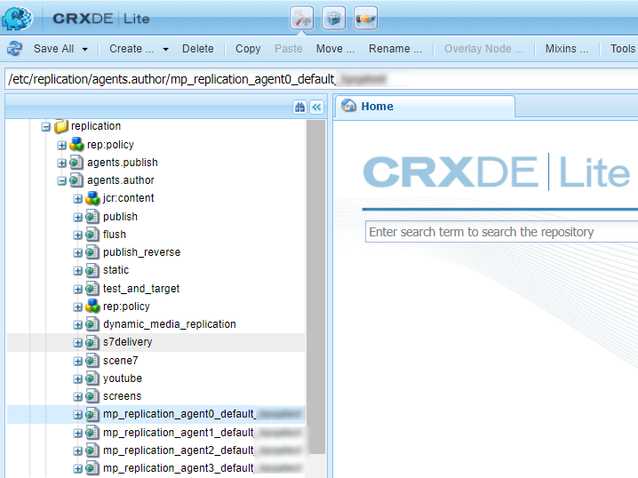

# Configurare AEM Assets con Brand Portal {#configure-integration-65}

| Versione | Collegamento articolo |
| -------- | ---------------------------- |
| AEM as a Cloud Service | [Fai clic qui](https://experienceleague.adobe.com/docs/experience-manager-cloud-service/content/assets/brand-portal/configure-aem-assets-with-brand-portal.html?lang=it) |
| AEM 6.5 | Questo articolo |

Adobe Experience Manager Assets Brand Portal consente di pubblicare in Brand Portal le risorse approvate per il marchio da Adobe Experience Manager Assets e distribuirle agli utenti di Brand Portal.

AEM Assets è configurato con Brand Portal tramite la console Adobe Developer, che fornisce un token di account Adobe Identity Management Services (IMS) per l’autorizzazione del tenant Brand Portal.

>[!NOTE]
>
>La configurazione di AEM Assets con Brand Portal tramite la console Adobe Developer è supportata su AEM 6.5.4.0 e versioni successive.
>
>In precedenza, Brand Portal era configurato tramite il precedente gateway OAuth, che utilizza lo scambio JSON Web Token (JWT) per ottenere un token di accesso IMS per l’autorizzazione.
>
>La configurazione tramite il gateway OAuth legacy non è più supportata a partire dal 6 aprile 2020 e viene modificata in Adobe Developer Console.

>[!TIP]
>
>***Solo per clienti esistenti***
>
>L’Adobe consiglia di continuare a utilizzare la configurazione legacy del gateway OAuth esistente. Se riscontri problemi con la configurazione legacy del gateway OAuth, elimina la configurazione esistente e crea una configurazione tramite la console Adobe Developer.

Questa guida descrive i due casi d’uso seguenti:

* [Nuova configurazione](#configure-new-integration-65): se sei un nuovo utente di Brand Portal e desideri configurare l’istanza di AEM Assets Author con Brand Portal, puoi creare una configurazione tramite la console Adobe Developer.
* [Configurazione aggiornamento](#upgrade-integration-65): se sei un utente Brand Portal esistente che dispone della configurazione sul gateway OAuth legacy, elimina la configurazione esistente e creane una tramite la console Adobe Developer.

Le informazioni fornite si basano sul presupposto che chiunque legga questa Guida conosca le seguenti tecnologie:

* Installazione, configurazione e amministrazione di pacchetti Adobe Experience Manager e AEM.

* Utilizzo dei sistemi operativi Linux® e Microsoft® Windows.

## Prerequisiti {#prerequisites}

Per configurare AEM Assets con Brand Portal, è necessario quanto segue:

* Un’istanza AEM Assets Author in esecuzione con il Service Pack più recente
* URL tenant Brand Portal
* Un utente con privilegi di amministratore di sistema nell’organizzazione IMS del tenant di Brand Portal

[Scaricare e installare AEM 6.5](#aemquickstart)

[Scarica e installa il Service Pack AEM più recente](#servicepack)

### Scaricare e installare AEM 6.5 {#aemquickstart}

Per impostare un’istanza Autore AEM, si consiglia di usare AEM 6.5. Se l&#39;AEM non è in funzione, scaricarlo dalle seguenti posizioni:

* Se sei già cliente AEM, scarica AEM 6.5 dal [Sito Web Adobe Licensing](https://licensing.adobe.com).

* Se sei un partner Adobe, utilizza [Programma di formazione per i partner Adobi](https://adobe.allegiancetech.com/cgi-bin/qwebcorporate.dll?idx=82357Q) per richiedere AEM 6.5.

Dopo aver scaricato l’AEM, per istruzioni su come impostare un’istanza di creazione dell’AEM, consulta [distribuzione e manutenzione](https://experienceleague.adobe.com/docs/experience-manager-65/deploying/deploying/deploy.html#default-local-install).

### Scarica e installa il Service Pack più recente per AEM {#servicepack}

Per istruzioni dettagliate, vedere la [Note sulla versione di AEM 6.5 Service Pack](https://experienceleague.adobe.com/docs/experience-manager-65/release-notes/release-notes.html?lang=it).

**Contatta l’Assistenza clienti Adobe** se non è possibile trovare il pacchetto AEM o il Service Pack più recente.

## Creare la configurazione {#configure-new-integration-65}

La configurazione di AEM Assets con Brand Portal richiede configurazioni sia nell’istanza di AEM Assets Author che nella console di Adobe Developer.

1. In AEM Assets, crea un account IMS e genera un certificato pubblico (chiave pubblica).
1. Nella console Adobe Developer, crea un progetto per il tenant Brand Portal (organizzazione).
1. Nel progetto, configura un’API utilizzando la chiave pubblica per creare una connessione a un account di servizio (JWT).
1. Ottieni le credenziali dell’account di servizio e le informazioni sul payload JWT.
1. In AEM Assets, configura l’account IMS utilizzando le credenziali dell’account di servizio e il payload JWT.
1. In AEM Assets, configura il servizio cloud Brand Portal utilizzando l’account IMS e l’endpoint Brand Portal (URL organizzazione).
1. Verifica la configurazione pubblicando una risorsa da AEM Assets a Brand Portal.

>[!NOTE]
>
>Un’istanza Autore AEM Assets può essere configurata con un solo tenant Brand Portal.

Se stai configurando AEM Assets con Brand Portal per la prima volta, effettua le seguenti operazioni nella sequenza elencata:

1. [Ottenere un certificato pubblico](#public-certificate)
1. [Creare la connessione dell’account di servizio (JWT)](#createnewintegration)
1. [Configurare un account IMS](#create-ims-account-configuration)
1. [Configurare il servizio cloud](#configure-the-cloud-service)
1. [Verificare la configurazione](#test-integration)

### Creare la configurazione IMS {#create-ims-configuration}

La configurazione IMS autentica l’istanza Autore AEM Assets con il tenant Brand Portal.

La configurazione IMS prevede due passaggi:

* [Ottenere un certificato pubblico](#public-certificate)
* [Configurare un account IMS](#create-ims-account-configuration)

### Recuperare il certificato pubblico {#public-certificate}

La chiave pubblica (certificato) autentica il profilo sulla console Adobe Developer.

1. Accedi all’istanza Autore di AEM Assets. L’URL predefinito è `http://localhost:4502/aem/start.html`.

1. Dalla sezione **Strumenti**  , passa a **[!UICONTROL Sicurezza]** > **[!UICONTROL Configurazioni Adobe IMS]**.

1. Nella pagina Configurazioni Adobe IMS, fai clic su **[!UICONTROL Crea]**. Viene reindirizzato al **[!UICONTROL Configurazione account tecnico Adobe IMS]** pagina. Per impostazione predefinita, il **Certificato** viene visualizzata la scheda.

1. Seleziona **[!UICONTROL Adobe Brand Portal]** nel **[!UICONTROL Soluzione cloud]** elenco a discesa.

1. Seleziona la **[!UICONTROL Crea nuovo certificato]** e specificare un **alias** per la chiave pubblica. L&#39;alias funge da nome della chiave pubblica.

1. Fai clic su **[!UICONTROL Crea certificato]**. Quindi, fai clic su **[!UICONTROL OK]** per generare la chiave pubblica.

   

1. Fai clic su **[!UICONTROL Scarica chiave pubblica]** e salvare il file della chiave pubblica (.crt) sul computer.

   La chiave pubblica viene utilizzata in seguito per configurare l’API per il tenant Brand Portal e generare le credenziali dell’account del servizio nella console Adobe Developer.

   

1. Fai clic su **[!UICONTROL Avanti]**.

   In **Account** , viene creato un account Adobe IMS che richiede le credenziali dell’account del servizio generate nella console di Adobe Developer. Per il momento tieni aperta questa pagina.

   Apri una nuova scheda e [creare una connessione dell’account di servizio (JWT) in Adobe Developer Console](#createnewintegration) in modo da poter ottenere le credenziali e il payload JWT per la configurazione dell’account IMS.

### Creare la connessione dell’account di servizio (JWT) {#createnewintegration}

Nella console Adobe Developer, i progetti e le API sono configurati a livello di tenant Brand Portal (organizzazione). La configurazione di un’API crea una connessione dell’account di servizio (JWT). Esistono due metodi per configurare l’API: generando una coppia di chiavi (chiavi privata e pubblica) o caricando una chiave pubblica. Per configurare AEM Assets con Brand Portal, devi generare una chiave pubblica (certificato) in AEM Assets e creare le credenziali nella console di Adobe Developer caricando la chiave pubblica. Queste credenziali sono necessarie per configurare l’account IMS in AEM Assets. Una volta configurato l’account IMS, puoi configurare il servizio cloud Brand Portal in AEM Assets.

Per creare le credenziali dell’account di servizio e il payload JWT, effettua le seguenti operazioni:

1. Accedi alla console Adobe Developer con i privilegi di amministratore di sistema nell’organizzazione IMS (tenant Brand Portal). L’URL predefinito è [https://www.adobe.com/go/devs_console_ui](https://www.adobe.com/go/devs_console_ui).

   >[!NOTE]
   >
   >Accertati di aver selezionato l’organizzazione IMS corretta (tenant Brand Portal) dall’elenco a discesa (organizzazione) nell’angolo in alto a destra.

1. Clic **[!UICONTROL Crea nuovo progetto]**. Per l’organizzazione viene creato un progetto vuoto con un nome generato dal sistema.

   Clic **[!UICONTROL Modifica progetto]** in modo da aggiornare **[!UICONTROL Titolo progetto]** e **[!UICONTROL Descrizione]** e fai clic su **[!UICONTROL Salva]**.

1. In **[!UICONTROL Panoramica del progetto]** , fare clic su **[!UICONTROL Aggiungi API]**.

1. In **[!UICONTROL Aggiungere una finestra API]**, seleziona **[!UICONTROL AEM Brand Portal]** e fai clic su **[!UICONTROL Successivo]**.

   Assicurati di avere accesso al servizio AEM Brand Portal.

1. In **[!UICONTROL Configurare API]** finestra, fai clic su **[!UICONTROL Carica la chiave pubblica]**. Quindi, fai clic su **[!UICONTROL Seleziona un file]** e carica la chiave pubblica (file .crt) scaricata in [ottenere un certificato pubblico](#public-certificate) sezione.

   Fai clic su **[!UICONTROL Avanti]**.

   

1. Verifica la chiave pubblica e fai clic su **[!UICONTROL Successivo]**.

1. Seleziona **[!UICONTROL Assets Brand Portal]** come profilo di prodotto predefinito e fai clic su **[!UICONTROL Salva API configurata]**.

   <!-- 
   In Brand Portal, a default profile is created for each organization. The Product Profiles are created in admin console for assigning users to groups (based on the roles and permissions). For configuration with Brand Portal, the OAuth token is created at organization level. Therefore, you must configure the default Product Profile for your organization. 
   -->

   

1. Una volta configurata l’API, vieni reindirizzato alla pagina di panoramica API. Dalla barra di navigazione a sinistra in **[!UICONTROL Credenziali]**, fare clic su **[!UICONTROL Account di servizio (JWT)]** opzione.

   >[!NOTE]
   >
   >Puoi visualizzare le credenziali ed eseguire azioni quali generare token JWT, copiare i dettagli delle credenziali e recuperare il segreto client.

1. Dalla sezione **[!UICONTROL Credenziali client]** , copia il **[!UICONTROL ID client]**.

   Clic **[!UICONTROL Recupera segreto client]** e copia **[!UICONTROL segreto client]**.

   

1. Accedi a **[!UICONTROL Genera JWT]** e copia il **[!UICONTROL Payload JWT]** informazioni.

Ora puoi utilizzare l’ID client (chiave API), il segreto client e il payload JWT per [configurare l’account IMS](#create-ims-account-configuration) in AEM Assets.

<!--
### Create Adobe I/O integration {#createnewintegration}

Adobe I/O integration generates API Key, Client Secret, and Payload (JWT) which is required in setting up the IMS Account configurations.

1. Login to Adobe I/O Console with system administrator privileges on the IMS organization of the Brand Portal tenant.

   Default URL: [https://console.adobe.io/](https://console.adobe.io/) 

1. Click **[!UICONTROL Create Integration]**.

1. Select **[!UICONTROL Access an API]**, and click **[!UICONTROL Continue]**.

   

1. Create a new integration page opens. 
   
   Select your organization from the drop-down list.

   In **[!UICONTROL Experience Cloud]**, Select **[!UICONTROL AEM Brand Portal]** and click **[!UICONTROL Continue]**. 

   If the Brand Portal option is disabled for you, ensure that you have selected correct organization from the drop-down box above the **[!UICONTROL Adobe Services]** option. If you do not know your organization, contact your administrator.

   

1. Specify a name and description for the integration. Click **[!UICONTROL Select a File from your computer]** and upload the `AEM-Adobe-IMS.crt` file downloaded in the [obtain public certificates](#public-certificate) section.

1. Select the profile of your organization. 

   Or, select the default profile **[!UICONTROL Assets Brand Portal]** and click **[!UICONTROL Create Integration]**. The integration is created.

1. Click **[!UICONTROL Continue to integration details]** to view the integration information. 

   Copy the **[!UICONTROL API Key]** 
   
   Click **[!UICONTROL Retrieve Client Secret]** and copy the Client Secret key.

   

1. Navigate to **[!UICONTROL JWT]** tab, and copy the **[!UICONTROL JWT payload]**.

   The API Key, Client Secret key, and JWT payload information will be used to create IMS account configuration.
-->

### Configurare l’account IMS {#create-ims-account-configuration}

Verifica di aver già eseguito i seguenti passaggi:

* [Ottenere un certificato pubblico](#public-certificate)
* [Creare la connessione dell’account di servizio (JWT)](#createnewintegration)

Per configurare l’account IMS:

1. Apri la configurazione IMS e passa a **[!UICONTROL Account]** scheda. La pagina è rimasta aperta [ottenimento del certificato pubblico](#public-certificate).

1. Specifica un **[!UICONTROL titolo]** per l’account IMS.

   In **[!UICONTROL Server autorizzazioni]** , specifica l’URL: [https://ims-na1.adobelogin.com/](https://ims-na1.adobelogin.com/).

   Specifica l’ID client in **[!UICONTROL Chiave API]** campo, **[!UICONTROL Segreto client]**, e **[!UICONTROL Payload]** (payload JWT) che hai copiato mentre [creazione della connessione dell’account di servizio (JWT)](#createnewintegration).

   Fai clic su **[!UICONTROL Crea]**.

   L’account IMS è configurato.

   

1. Seleziona la configurazione dell’account IMS e fai clic su **[!UICONTROL Verifica stato]**.

   Clic **[!UICONTROL Verifica]** nella finestra di dialogo. Una volta completata la configurazione, viene visualizzato un messaggio che informa che *Token recuperato correttamente*.

   

>[!CAUTION]
>
>Puoi disporre di una sola configurazione IMS.
>
>Verifica che la configurazione IMS superi il controllo di integrità. Se la configurazione non supera questa verifica, non è valida. Elimina e crea un’altra configurazione valida.

### Configurare il servizio cloud Brand Portal {#configure-the-cloud-service}

1. Accedi all’istanza Autore di AEM Assets.

1. Dalla sezione **Strumenti**  , passa a **[!UICONTROL Cloud Service]** > **[!UICONTROL AEM Brand Portal]**.

1. Nella pagina Configurazioni Brand Portal, fai clic su **[!UICONTROL Crea]**.

1. Specifica un **[!UICONTROL titolo]** per la configurazione.

   Seleziona la configurazione IMS creata durante [configurazione dell’account IMS](#create-ims-account-configuration).

   In **[!UICONTROL URL servizio]** , specifica l’URL del tenant Brand Portal (organizzazione).

   

1. Fai clic su **[!UICONTROL Salva e chiudi]**. Viene creata la configurazione cloud.

   L’istanza Autore AEM Assets è ora configurata con il tenant Brand Portal.

### Test e convalida della configurazione {#test-integration}

1. Accedi all’istanza cloud di AEM Assets.

1. Dalla sezione **Strumenti**  , passa a **[!UICONTROL Distribuzione]** > **[!UICONTROL Replica]**.

   

1. Nella pagina Replica, fai clic su **[!UICONTROL Agenti per creazione]**.

   

   Puoi vedere i quattro agenti di replica creati per il tenant Brand Portal.

   Individua gli agenti di replica del tenant Brand Portal e fai clic sull’URL dell’agente di replica.

   

   >[!NOTE]
   >
   >Gli agenti di replica lavorano in parallelo e condividono equamente la distribuzione dei processi, in modo da aumentare la velocità di pubblicazione di quattro volte la velocità originale. Dopo aver configurato il servizio cloud, non è necessaria una configurazione aggiuntiva per abilitare gli agenti di replica attivati per impostazione predefinita per abilitare la pubblicazione parallela di più risorse.

1. Per verificare la connessione tra AEM Assets e Brand Portal, fai clic sul pulsante **[!UICONTROL Verifica connessione]** icona.

   

   Viene visualizzato un messaggio che informa che *il pacchetto di prova è stato consegnato correttamente*.

   

1. Verifica i risultati del test per tutti e quattro gli agenti di replica.

   >[!NOTE]
   >
   >Evita di disabilitare gli agenti di replica, in quanto potrebbe impedire la replica delle risorse (in esecuzione nella coda).
   >
   >Assicurati che tutti e quattro gli agenti di replica siano configurati per evitare errori di timeout. Consulta [risoluzione dei problemi relativi alla pubblicazione parallela in Brand Portal](https://experienceleague.adobe.com/docs/experience-manager-brand-portal/using/publish/troubleshoot-parallel-publishing.html#connection-timeout).
   >
   >Non modificare le impostazioni generate automaticamente.

Ora puoi:

* [Pubblicare risorse da AEM Assets su Brand Portal](../assets/brand-portal-publish-assets.md)
* [Pubblicare risorse da Brand Portal su AEM Assets](https://experienceleague.adobe.com/docs/experience-manager-brand-portal/using/asset-sourcing-in-brand-portal/brand-portal-asset-sourcing.html?lang=it) - Asset Sourcing in Brand Portal
* [Pubblicare cartelle da AEM Assets su Brand Portal](../assets/brand-portal-publish-folder.md)
* [Pubblicare raccolte da AEM Assets su Brand Portal](../assets/brand-portal-publish-collection.md)
* [Pubblicare predefiniti, schemi e facet in Brand Portal](https://experienceleague.adobe.com/docs/experience-manager-brand-portal/using/publish/publish-schema-search-facets-presets.html)
* [Pubblicare tag in Brand Portal](https://experienceleague.adobe.com/docs/experience-manager-brand-portal/using/publish/brand-portal-publish-tags.html)

Consulta la [Documentazione di Brand Portal](https://experienceleague.adobe.com/docs/experience-manager-brand-portal/using/home.html) per ulteriori informazioni.

## Configurazione aggiornamento {#upgrade-integration-65}

Per aggiornare le configurazioni esistenti alla console Adobe Developer, effettua le seguenti operazioni, nella sequenza elencata:

1. [Verificare i processi in esecuzione](#verify-jobs)
1. [Elimina configurazioni esistenti](#delete-existing-configuration)
1. [Creare la configurazione](#configure-new-integration-65)

### Verificare i processi in esecuzione {#verify-jobs}

Prima di apportare qualsiasi modifica, assicurati che nell’istanza Autore AEM Assets non sia in esecuzione alcun processo di pubblicazione. A tale scopo, è possibile verificare lo stato dei processi attivi su tutti e quattro gli agenti di replica e assicurarsi che le code siano inattive.

1. Accedi all’istanza Autore di AEM Assets.

1. Dalla sezione **Strumenti**  , passa a **[!UICONTROL Distribuzione]** > **[!UICONTROL Replica della distribuzione]**.

1. Nella pagina Replica, fai clic su **[!UICONTROL Agenti per creazione]**.

   

1. Individua gli agenti di replica del tenant Brand Portal.

   Assicurati che **La coda è inattiva** per tutti gli agenti di replica e nessun processo di pubblicazione è attivo.

   

### Elimina configurazioni esistenti {#delete-existing-configuration}

Esegui il seguente elenco di controllo durante l’eliminazione delle configurazioni esistenti:

* Elimina tutti e quattro gli agenti di replica
* Elimina servizio cloud Brand Portal
* Elimina utente Mac

1. Accedi all’istanza Autore di AEM Assets e apri CRX Lite come amministratore. L’URL predefinito è `http://localhost:4502/crx/de/index.jsp`.

1. Accedi a `/etc/replications/agents.author` ed elimina tutti e quattro gli agenti di replica del tenant Brand Portal.

   

1. Accedi a `/etc/cloudservices/mediaportal` ed elimina la configurazione del servizio cloud Brand Portal.

   

1. Accedi a `/home/users/mac` ed elimina **Utente Mac** del tuo tenant Brand Portal.

   

Ora puoi [creare una configurazione](#configure-new-integration-65) tramite la console Adobe Developer nell’istanza Autore AEM 6.5.

<!--
   Comment Type: draft

   <li> </li>
   -->

<!--
   Comment Type: draft

   <li>Step text</li>
   -->
