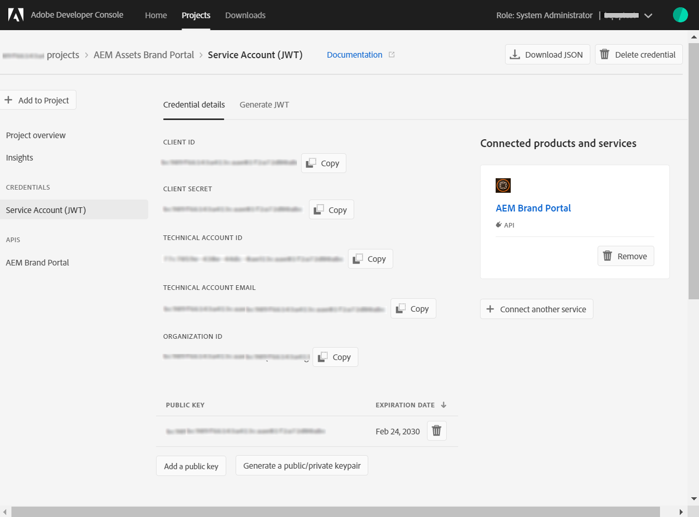
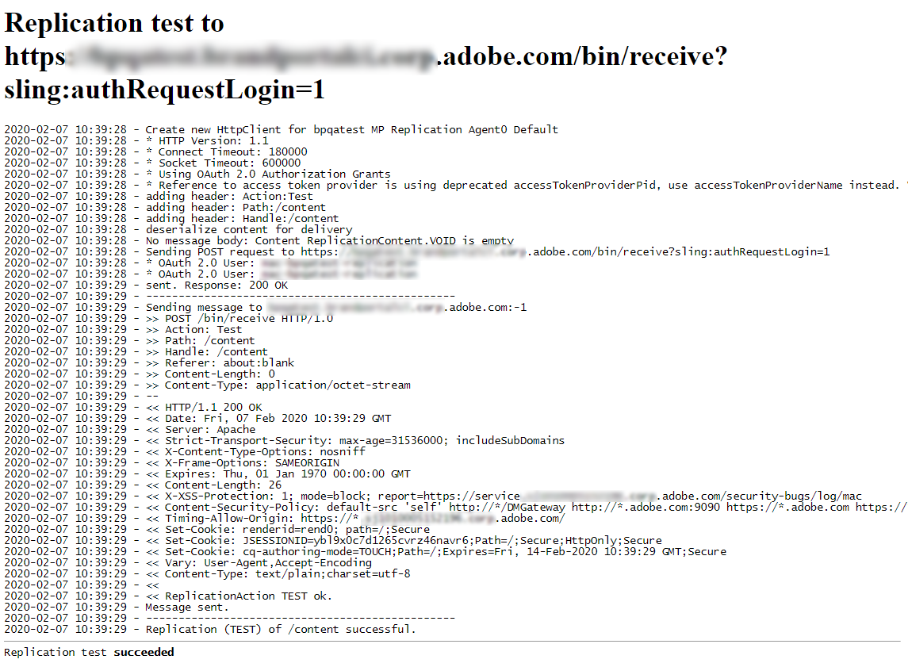

# Configurare AEM Assets con Brand Portal {#configure-integration-65}

Adobe Experience Manager Assets Brand Portal consente di pubblicare le risorse del marchio approvate da Adobe Experience Manager Assets al Brand Portal e distribuirle agli utenti del Brand Portal.

 AEM Assets è configurato con Portale marchio tramite  Developer Console di Adobe, che fornisce un token account  Adobe Identity Management Services (IMS) per l&#39;autorizzazione del tenant del Portale marchio.

>[!NOTE]
>
>La configurazione  AEM Assets con il portale del marchio tramite  console per sviluppatori di Adobi è supportata AEM 6.5.4.0 e versioni successive.
>
>In precedenza, il Portale marchio era stato configurato tramite il gateway OAuth legacy, che utilizza lo scambio JSON Token Web (JWT) per ottenere un token di accesso IMS per l&#39;autorizzazione.
>
>La configurazione tramite gateway OAuth legacy non è più supportata dal 6 aprile 2020 e viene modificata in  console per sviluppatori di Adobe.

>[!TIP]
>
>***Solo per i clienti esistenti***
>
>Si consiglia di continuare a utilizzare la configurazione gateway OAuth esistente. Se si verificano problemi con la configurazione del gateway OAuth legacy, eliminare la configurazione esistente e creare una nuova configurazione tramite  console sviluppatore di Adobe.

Questa guida descrive i due casi d’uso seguenti:
* [Nuova configurazione](#configure-new-integration-65): Se siete un nuovo utente del Brand Portal e desiderate configurare ’istanza di creazione AEM Assets con Brand Portal, potete creare la configurazione tramite  Adobe Developer Console.
* [Configurazione](#upgrade-integration-65)aggiornamento: Se siete già utenti di Brand Portal con una configurazione su gateway OAuth, eliminate la configurazione esistente e create una nuova configurazione tramite  console per sviluppatori di Adobe.

Le informazioni fornite si basano sul presupposto che chiunque legga la presente Guida abbia familiarità con le seguenti tecnologie:

* Installazione, configurazione e amministrazione di pacchetti Adobe Experience Manager e AEM.

* Utilizzo di sistemi operativi Linux e Microsoft Windows.

## Prerequisiti {#prerequisites}

Per configurare AEM Assets con Brand Portal, è necessario quanto segue:

* Un’istanza di creazione di  AEM Assets con l’ultimo Service Pack
* URL tenant del Brand Portal
* Un utente con privilegi di amministratore di sistema nell’organizzazione IMS del tenant di Brand Portal

[Download e installazione AEM 6.5](#aemquickstart)

[Download e installazione della versione più recente di AEM Service Pack](#servicepack)

### Download e installazione AEM 6.5 {#aemquickstart}

Si consiglia di AEM 6.5 per impostare un’istanza AEM di creazione. Se non disponete di AEM pronti, scaricatelo dalle seguenti posizioni:

* Se siete già clienti AEM, scaricate AEM 6.5 dal sito Web [delle licenze di](http://licensing.adobe.com)Adobe.

* Se siete un partner  Adobe, utilizzate [programma](https://adobe.allegiancetech.com/cgi-bin/qwebcorporate.dll?idx=82357Q) di formazione per i partner del Adobe per richiedere AEM 6.5.

Dopo aver scaricato AEM, per istruzioni su come impostare un’istanza AEM di creazione, consultate [Implementazione e manutenzione](https://docs.adobe.com/content/help/en/experience-manager-65/deploying/deploying/deploy.html#default-local-install).

### Download e installazione AEM Service Pack più recente {#servicepack}

Per istruzioni dettagliate, vedete

* [Note sulla versione di AEM 6.5 Service Pack](https://docs.adobe.com/content/help/en/experience-manager-65/release-notes/service-pack/sp-release-notes.html)

**Se non riuscite a trovare il pacchetto di AEM o il Service Pack più recente, contattate l&#39;Assistenza** clienti.

## Creare la configurazione {#configure-new-integration-65}

La configurazione di  AEM Assets con Brand Portal richiede configurazioni sia nell’istanza di creazione  AEM Assets che  Developer Console Adobe.

1. In  AEM Assets, create un account IMS e generate un certificato pubblico (chiave pubblica).
1. In  Adobe Developer Console, crea un progetto per il tenant del Brand Portal (organizzazione).
1. Nel progetto, configura un&#39;API utilizzando la chiave pubblica per creare una connessione a un account di servizio (JWT).
1. Ottenete le credenziali dell&#39;account del servizio e le informazioni sul payload JWT.
1. In  AEM Assets, configurate l&#39;account IMS utilizzando le credenziali dell&#39;account del servizio e il payload JWT.
1. In  AEM Assets, configurate il servizio cloud Brand Portal utilizzando l&#39;account IMS e l&#39;endpoint del Brand Portal (URL organizzazione).
1. Verificate la configurazione pubblicando una risorsa da  AEM Assets al Brand Portal.

>[!NOTE]
>
>Un’istanza di autore  AEM Assets può essere configurata solo con un tenant Brand Portal.

Effettuate i seguenti passaggi nella sequenza elencata se state configurando  AEM Assets con Brand Portal per la prima volta:
1. [Recuperare il certificato pubblico](#public-certificate)
1. [Creare una connessione account di servizio (JWT)](#createnewintegration)
1. [Configurare l&#39;account IMS](#create-ims-account-configuration)
1. [Configurare il servizio cloud](#configure-the-cloud-service)
1. [Verificare la configurazione](#test-integration)

### Creare la configurazione IMS {#create-ims-configuration}

La configurazione IMS autentica l’istanza di creazione  AEM Assets con il tenant del Brand Portal.

La configurazione IMS prevede due passaggi:

* [Recuperare il certificato pubblico](#public-certificate)
* [Configurare l&#39;account IMS](#create-ims-account-configuration)

### Recuperare il certificato pubblico {#public-certificate}

La chiave pubblica (certificato) autentica il tuo profilo in  Adobe Developer Console.

1. Accedete all’istanza di creazione  AEM Assets. L’URL predefinito è `http://localhost:4502/aem/start.html`.

1. From the **Tools**  panel, navigate to **[!UICONTROL Security]** > **[!UICONTROL Adobe IMS Configurations]**.

1. Nella pagina Configurazioni IMS  Adobe, fate clic su **[!UICONTROL Crea]**. It will redirect to the **[!UICONTROL Adobe IMS Technical Account Configuration]** page. By default, the **Certificate** tab opens.

1. Selezionate **[!UICONTROL Portale]** marchio Adobe nell&#39;elenco a discesa **[!UICONTROL Cloud Solution]** .

1. Selezionate la casella di controllo **[!UICONTROL Crea nuovo certificato]** e specificate un **alias** per la chiave pubblica. L&#39;alias funge da nome della chiave pubblica.

1. Fai clic su **[!UICONTROL Crea certificato]**. Then, click **[!UICONTROL OK]** to generate the public key.

   

1. Fate clic sull&#39;icona **[!UICONTROL Scarica chiave]** pubblica e salvate il file della chiave pubblica (.crt) sul computer.

   La chiave pubblica verrà utilizzata in seguito per configurare l&#39;API per il tenant del Brand Portal e generare le credenziali dell&#39;account di servizio in  Adobe Developer Console.

   

1. Fai clic su **[!UICONTROL Avanti]**.

   Nella scheda **Account** ,  Adobe viene creato un account IMS che richiede le credenziali dell&#39;account del servizio generate in  Adobe Developer Console. Per il momento tieni aperta questa pagina.

   Aprite una nuova scheda e [create una connessione account di servizio (JWT) in  Adobe Developer Console](#createnewintegration) per ottenere le credenziali e il payload JWT per configurare l&#39;account IMS.

### Creare una connessione account di servizio (JWT) {#createnewintegration}

In  Adobe Developer Console, i progetti e le API sono configurati a livello di tenant del Brand Portal (organizzazione). La configurazione di un&#39;API crea una connessione JWT (Service Account). Esistono due metodi per configurare l&#39;API, generando una coppia di chiavi (chiavi private e pubbliche) o caricando una chiave pubblica. Per configurare  AEM Assets con Brand Portal, dovete generare una chiave pubblica (certificato) in  AEM Assets e creare le credenziali in  console Sviluppatore Adobe caricando la chiave pubblica. Queste credenziali sono necessarie per configurare l&#39;account IMS in  AEM Assets. Una volta configurato l&#39;account IMS, potete configurare il servizio cloud Brand Portal in  AEM Assets.

Effettuate le seguenti operazioni per generare le credenziali dell&#39;account del servizio e il payload JWT:

1. Accedete a  console per sviluppatori di Adobe con privilegi di amministratore di sistema nell’organizzazione IMS (tenant Brand Portal). L’URL predefinito è [https://www.adobe.com/go/devs_console_ui](https://www.adobe.com/go/devs_console_ui).

   >[!NOTE]
   >
   >Accertatevi di aver selezionato l&#39;organizzazione IMS corretta (tenant Brand Portal) dall&#39;elenco a discesa (organizzazione) nell&#39;angolo superiore destro.

1. Click **[!UICONTROL Create new project]**. Per la vostra organizzazione viene creato un progetto vuoto con un nome generato dal sistema.

   Fate clic su **[!UICONTROL Modifica progetto]** per aggiornare il Titolo **[!UICONTROL e la]** Descrizione **[!UICONTROL del]** progetto, quindi fate clic su **[!UICONTROL Salva]**.

1. Nella scheda Panoramica **** progetto, fate clic su **[!UICONTROL Aggiungi API]**.

1. Nella finestra **** Aggiungi un&#39;API, selezionate **[!UICONTROL AEM Brand Portal]** e fate clic su **[!UICONTROL Avanti]**.

   Assicuratevi di avere accesso al servizio AEM Brand Portal.

1. Nella finestra **[!UICONTROL Configura API]** , fate clic su **[!UICONTROL Carica la chiave]** pubblica. Quindi, fate clic su **[!UICONTROL Seleziona un file]** e caricate la chiave pubblica (file .crt) che avete scaricato nella sezione [Ottieni certificato](#public-certificate) pubblico.

   Fai clic su **[!UICONTROL Avanti]**.

   

1. Verifica la chiave pubblica e fai clic su **[!UICONTROL Avanti]**.

1. Selezionate **[!UICONTROL Assets Brand Portal]** come profilo di prodotto predefinito, quindi fate clic su **[!UICONTROL Salva API]** configurata.

   <!-- 
   In Brand Portal, a default profile is created for each organization. The Product Profiles are created in admin console for assigning users to groups (based on the roles and permissions). For configuration with Brand Portal, the OAuth token is created at organization level. Therefore, you must configure the default Product Profile for your organization. 
   -->

   

1. Una volta configurata l&#39;API, verrete reindirizzati alla pagina di panoramica dell&#39;API. Nel menu di navigazione a sinistra in **[!UICONTROL Credenziali]**, fate clic sull&#39;opzione **[!UICONTROL Account servizio (JWT)]** .

   >[!NOTE]
   >
   >Potete visualizzare le credenziali ed eseguire azioni quali generare token JWT, copiare i dettagli delle credenziali, recuperare il segreto client e così via.

1. Dalla scheda Credenziali **** client, copiate l&#39;ID **** client.

   Click **[!UICONTROL Retrieve Client Secret]** and copy the **[!UICONTROL client secret]**.

   

1. Navigate to the **[!UICONTROL Generate JWT]** tab and copy the **[!UICONTROL JWT Payload]** information.

Ora potete utilizzare l&#39;ID client (chiave API), il segreto client e il payload JWT per [configurare l&#39;account](#create-ims-account-configuration) IMS in  AEM Assets.

<!--
### Create Adobe I/O integration {#createnewintegration}

Adobe I/O integration generates API Key, Client Secret, and Payload (JWT) which is required in setting up the IMS Account configurations.

1. Login to Adobe I/O Console with system administrator privileges on the IMS organization of the Brand Portal tenant.

   Default URL: [https://console.adobe.io/](https://console.adobe.io/) 

1. Click **[!UICONTROL Create Integration]**.

1. Select **[!UICONTROL Access an API]**, and click **[!UICONTROL Continue]**.

   

1. Create a new integration page opens. 
   
   Select your organization from the drop-down list.

   In **[!UICONTROL Experience Cloud]**, Select **[!UICONTROL AEM Brand Portal]** and click **[!UICONTROL Continue]**. 

   If the Brand Portal option is disabled for you, ensure that you have selected correct organization from the drop-down box above the **[!UICONTROL Adobe Services]** option. If you do not know your organization, contact your administrator.

   

1. Specify a name and description for the integration. Click **[!UICONTROL Select a File from your computer]** and upload the `AEM-Adobe-IMS.crt` file downloaded in the [obtain public certificates](#public-certificate) section.

1. Select the profile of your organization. 

   Or, select the default profile **[!UICONTROL Assets Brand Portal]** and click **[!UICONTROL Create Integration]**. The integration is created.

1. Click **[!UICONTROL Continue to integration details]** to view the integration information. 

   Copy the **[!UICONTROL API Key]** 
   
   Click **[!UICONTROL Retrieve Client Secret]** and copy the Client Secret key.

   

1. Navigate to **[!UICONTROL JWT]** tab, and copy the **[!UICONTROL JWT payload]**.

   The API Key, Client Secret key, and JWT payload information will be used to create IMS account configuration.
-->

### Configurare l&#39;account IMS {#create-ims-account-configuration}

Verifica di aver eseguito i seguenti passaggi:

* [Recuperare il certificato pubblico](#public-certificate)
* [Creare una connessione account di servizio (JWT)](#createnewintegration)

Effettuate le seguenti operazioni per configurare l&#39;account IMS.

1. Aprite IMS Configuration (Configurazione IMS) e passate alla scheda **[!UICONTROL Account]** . La pagina è rimasta aperta durante il [recupero del certificato](#public-certificate)pubblico.

1. Specifica un **[!UICONTROL titolo]** per l’account IMS.

   In the **[!UICONTROL Authorization Server]** field, specify the URL: [https://ims-na1.adobelogin.com/](https://ims-na1.adobelogin.com/).

   Specificate l&#39;ID client nel campo chiave **** API, Segreto **** cliente e **[!UICONTROL Payload]** (payload JWT) che avete copiato durante la [creazione della connessione](#createnewintegration)dell&#39;account del servizio (JWT).

   Fai clic su **[!UICONTROL Crea]**.

   L&#39;account IMS è configurato.

   

1. Select the IMS account configuration and click **[!UICONTROL Check Health]**.

   Fare clic su **[!UICONTROL Controlla]** nella finestra di dialogo. Se la configurazione è stata completata, viene visualizzato un messaggio che informa che il *token è stato recuperato* correttamente.

   

>[!CAUTION]
>
>Puoi disporre di una sola configurazione IMS.
>
>Verifica che la configurazione IMS superi il controllo di integrità. Se la configurazione non supera questa verifica, non è valida. Dovrai quindi eliminarla e creare una nuova configurazione valida.

### Configurare il servizio cloud {#configure-the-cloud-service}

Per configurare il servizio cloud Brand Portal, effettuate le seguenti operazioni:

1. Accedete all’istanza di creazione  AEM Assets.

1. From the **Tools**  panel, navigate to **[!UICONTROL Cloud Services]** > **[!UICONTROL AEM Brand Portal]**.

1. Nella pagina Configurazioni Brand Portal, fate clic su **[!UICONTROL Crea]**.

1. Specifica un **[!UICONTROL titolo]** per la configurazione.

   Selezionate la configurazione IMS creata durante la [configurazione dell&#39;account](#create-ims-account-configuration)IMS.

   Nel campo URL **** servizio, specificate l’URL tenant (organizzazione) del Portale marchio.

   

1. Fai clic su **[!UICONTROL Salva e chiudi]**. Viene creata la configurazione cloud.

   L’istanza di creazione  AEM Assets ora è configurata con il tenant del Brand Portal.

### Verificare la configurazione {#test-integration}

Effettuate le seguenti operazioni per convalidare la configurazione:

1. Effettuate l&#39;accesso all&#39;istanza di AEM Assets cloud .

1. From the **Tools**  panel, navigate to **[!UICONTROL Deployment]** > **[!UICONTROL Replication]**.

   

1. Nella pagina Replica, fate clic su **[!UICONTROL Agenti sull’autore]**.

   

   Potete visualizzare i quattro agenti di replica creati per il tenant del Brand Portal.

   Individuate gli agenti di replica del tenant del Brand Portal e fate clic sull&#39;URL dell&#39;agente di replica.

   

   >[!NOTE]
   >
   >Gli agenti di replica lavorano in parallelo e condividono la distribuzione dei processi in modo uniforme, aumentando così la velocità di pubblicazione di quattro volte la velocità originale. Una volta configurato il servizio cloud, non è richiesta ulteriore configurazione per abilitare gli agenti di replica attivati per impostazione predefinita per abilitare la pubblicazione parallela di più risorse.

1. To verify the connection between AEM Assets and Brand Portal, click on the **[!UICONTROL Test Connection]** icon.

   

   Viene visualizzato un messaggio che informa che il pacchetto di *test è stato consegnato* correttamente.

   

1. Verificare i risultati del test su tutti e quattro gli agenti di replica.

   >[!NOTE]
   >
   >Evitare di disattivare gli agenti di replica, in quanto potrebbe causare errori di replica delle risorse (in esecuzione nella coda).
   >
   >Verificate che tutti e quattro gli agenti di replica siano configurati in modo da evitare errori di timeout. See [troubleshoot issues in parallel publishing to Brand Portal](https://docs.adobe.com/content/help/en/experience-manager-brand-portal/using/publish/troubleshoot-parallel-publishing.html#connection-timeout).

Ora puoi:

* [Pubblicare risorse da AEM Assets su Brand Portal](../assets/brand-portal-publish-assets.md)
* [Pubblicare risorse da Brand Portal a  AEM Assets](https://docs.adobe.com/content/help/it-IT/experience-manager-brand-portal/using/asset-sourcing-in-brand-portal/brand-portal-asset-sourcing.html) - Asset Sourcing in Brand Portal
* [Pubblicare cartelle da AEM Assets su Brand Portal](../assets/brand-portal-publish-folder.md)
* [Pubblicare raccolte da AEM Assets su Brand Portal](../assets/brand-portal-publish-collection.md)
* [Pubblicare predefiniti, schemi e facet in Brand Portal](https://docs.adobe.com/content/help/it-IT/experience-manager-brand-portal/using/publish/publish-schema-search-facets-presets.html)
* [Pubblicare tag in Brand Portal](https://docs.adobe.com/content/help/it-IT/experience-manager-brand-portal/using/publish/brand-portal-publish-tags.html)

See [Brand Portal documentation](https://docs.adobe.com/content/help/it-IT/experience-manager-brand-portal/using/home.html) for more information.

## Aggiornamento della configurazione {#upgrade-integration-65}

Effettuate i seguenti passaggi nella sequenza elencata per aggiornare le configurazioni esistenti a  Adobe Developer Console:
1. [Verificare i processi in esecuzione](#verify-jobs)
1. [Elimina configurazioni esistenti](#delete-existing-configuration)
1. [Creare la configurazione](#configure-new-integration-65)

### Verificare i processi in esecuzione {#verify-jobs}

Prima di apportare eventuali modifiche, verificate che nessun processo di pubblicazione sia in esecuzione nell’istanza di authoring  AEM Assets. A tal fine, è possibile verificare lo stato dei processi attivi su tutti e quattro gli agenti di replica e assicurarsi che le code siano inattive.

1. Accedete all’istanza di creazione  AEM Assets.

1. Dal pannello **Strumenti**  , accedi a **[!UICONTROL Distribuzione]** > Replica **** distribuzione.

1. Nella pagina Replica, fate clic su **[!UICONTROL Agenti sull’autore]**.

   

1. Individuate gli agenti di replica del tenant del Brand Portal.

   Verificate che la **coda sia inattiva** per tutti gli agenti di replica. Nessun processo di pubblicazione attivo.

   

### Elimina configurazioni esistenti {#delete-existing-configuration}

Durante l&#39;eliminazione delle configurazioni esistenti è necessario eseguire la seguente checklist:
* Elimina tutti e quattro gli agenti di replica
* Elimina servizio cloud Brand Portal
* Elimina utente MAC

1. Accedete all’istanza di creazione  AEM Assets e aprite CRX Lite come amministratore. L’URL predefinito è `http://localhost:4502/crx/de/index.jsp`.

1. Individuate `/etc/replications/agents.author` ed eliminate tutti e quattro gli agenti di replica del tenant del Brand Portal in uso.

   

1. Andate a `/etc/cloudservices/mediaportal` ed eliminate la configurazione del servizio cloud Brand Portal.

   

1. Individuate `/home/users/mac` ed eliminate l&#39;utente **** MAC del tenant di Brand Portal.

   

È ora possibile [creare la configurazione](#configure-new-integration-65) tramite  Adobe Developer Console nell’istanza di creazione AEM 6.5.

<!--
   Comment Type: draft

   <li> </li>
   -->

<!--
   Comment Type: draft

   <li>Step text</li>
   -->

