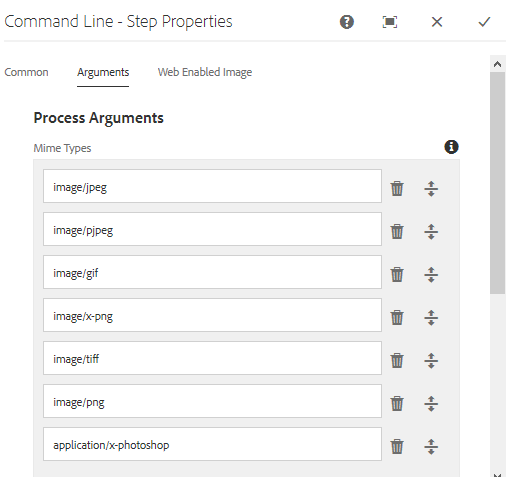

# Genera solo rappresentazioni per posizionamento per Adobe InDesign {#fpo-renditions}

| Versione | Collegamento articolo |
| -------- | ---------------------------- |
| AEM as a Cloud Service | [Fai clic qui](https://experienceleague.adobe.com/docs/experience-manager-cloud-service/content/assets/admin/configure-fpo-renditions.html?lang=it) |
| AEM 6.5 | Questo articolo |

Quando inserisci risorse di grandi dimensioni da Experience Manager nei documenti di Adobe InDesign, un professionista deve attendere molto tempo dopo aver [inserito una risorsa](https://helpx.adobe.com/it/indesign/using/placing-graphics.html). Nel frattempo, l’utente non può utilizzare InDesign. Questo interrompe il flusso creativo e influisce negativamente sull’esperienza utente. Adobe consente di inserire temporaneamente nei documenti di InDesign copie trasformate di piccole dimensioni. Quando è necessario l’output finale, ad esempio per i flussi di lavoro di stampa e pubblicazione, le risorse originali a risoluzione completa sostituiscono la rappresentazione temporanea in background. Questo aggiornamento asincrono in background accelera il processo di progettazione per aumentare la produttività e non ostacola il processo creativo.

In Adobe Experience Manager (AEM) sono disponibili copie trasformate utilizzate solo per il posizionamento (FPO). Queste copie trasformate FPO hanno dimensioni di file ridotte ma hanno le stesse proporzioni. Se per una risorsa non è disponibile una rappresentazione FPO, Adobe InDesign utilizza la risorsa originale. Questo meccanismo di fallback assicura che il flusso di lavoro creativo proceda senza interruzioni.

## Approccio per generare rappresentazioni FPO {#approach-to-generate-fpo-renditions}

Experience Manager consente di elaborare con molti metodi le immagini che possono essere utilizzate per generare le rappresentazioni FPO. I due metodi più comuni sono l’utilizzo di flussi di lavoro Experience Manager incorporati e l’utilizzo di ImageMagick. Utilizzando questi due metodi, puoi configurare la generazione del rendering delle risorse appena caricate e delle risorse esistenti in Experience Manager.

È possibile utilizzare ImageMagick per elaborare le immagini, anche per generare rappresentazioni FPO. Tali rappresentazioni vengono ricampionate verso il basso, ovvero le dimensioni in pixel della rappresentazione vengono ridotte proporzionalmente se l’immagine originale ha un valore PPI maggiore di 72. Consulta [installare e configurare ImageMagick per l&#39;utilizzo con Experience Manager Assets](best-practices-for-imagemagick.md).

|  | Utilizzo del flusso di lavoro integrato di Experience Manager | Utilizzo del flusso di lavoro ImageMagick | Osservazioni |
|--- |--- |---|--- |
| Per le nuove risorse | Abilita rappresentazione oggetto Criteri di gruppo ([guida](#generate-renditions-of-new-assets-using-aem-workflow)) | Aggiungi riga di comando ImageMagick nel flusso di lavoro di Experience Manager ([help](#generate-renditions-of-new-assets-using-imagemagick)) | Experience Manager esegue il flusso di lavoro DAM Update Assets per ogni caricamento. |
| Per le risorse esistenti | Abilita rappresentazione FPO in un nuovo flusso di lavoro Experience Manager dedicato ([guida](#generate-renditions-of-existing-assets-using-aem-workflow)) | Aggiungi la riga di comando ImageMagick in un nuovo flusso di lavoro Experience Manager dedicato ([help](#generate-renditions-of-existing-assets-using-imagemagick)) | Le rappresentazioni FPO delle risorse esistenti possono essere create su richiesta o in blocco. |

>[!CAUTION]
>
>Crea i flussi di lavoro per generare le rappresentazioni modificando una copia dei flussi di lavoro predefiniti. Impedisce la sovrascrittura delle modifiche quando Experience Manager viene aggiornato, ad esempio installando un nuovo service pack.

## Generare rappresentazioni di nuove risorse con il flusso di lavoro di Experience Manager {#generate-renditions-of-new-assets-using-aem-workflow}

Di seguito è descritta la procedura per configurare il modello di flusso di lavoro Risorsa di aggiornamento DAM per abilitare la generazione di rendering:

1. Fai clic su **[!UICONTROL Strumenti]** > **[!UICONTROL Flusso di lavoro]** > **[!UICONTROL Modelli]**. Seleziona il modello **[!UICONTROL Risorsa di aggiornamento DAM]** e fai clic su **[!UICONTROL Modifica]**.

1. Seleziona il passaggio **[!UICONTROL Elabora miniature]** e fai clic su **[!UICONTROL Configura]**.

1. Fare clic sulla scheda **[!UICONTROL Rappresentazione oggetto Criteri di gruppo]**. Selezionare **[!UICONTROL Abilita creazione rappresentazione oggetto Criteri di gruppo]**.

   

1. Regola **[!UICONTROL Qualità]** e aggiungi o modifica i valori **[!UICONTROL Elenco formati]** in base alle esigenze. Per impostazione predefinita, l&#39;elenco dei tipi MIME per generare la rappresentazione FPO è pjpeg, jpeg, jpg, gif, png, x-png e tiff. Fai clic su **[!UICONTROL Fine]**.

   >[!NOTE]
   >
   >La generazione di rappresentazioni è supportata per i tipi di file JPEG, GIF, PNG, TIFF, PSD e BMP.

1. Per attivare le modifiche, fare clic su **[!UICONTROL Sincronizza]**.

>[!NOTE]
>
>Le immagini di dimensioni superiori a 1280 pixel su un lato non mantengono le dimensioni pixel nella rappresentazione FPO.

## Generare rappresentazioni di nuove risorse tramite ImageMagick {#generate-renditions-of-new-assets-using-imagemagick}

In Experience Manager, il flusso di lavoro Aggiorna risorsa DAM viene eseguito quando viene caricata una nuova risorsa. Per utilizzare ImageMagick per elaborare le rappresentazioni delle risorse appena caricate, aggiungi un nuovo comando al modello di flusso di lavoro.

1. Fai clic su **[!UICONTROL Strumenti]** > **[!UICONTROL Flusso di lavoro]** > **[!UICONTROL Modelli]**.

1. Seleziona il modello **[!UICONTROL Risorsa di aggiornamento DAM]** e fai clic su **[!UICONTROL Modifica]**.

1. Fare clic su **[!UICONTROL Attiva/Disattiva pannello laterale]** nell&#39;angolo superiore sinistro e cercare il passaggio della riga di comando.

1. Trascinare il passaggio **[!UICONTROL Riga di comando]** e aggiungerlo prima del passaggio **[!UICONTROL Elabora miniature]**.

1. Selezionare il passaggio **[!UICONTROL Riga di comando]** e fare clic su **[!UICONTROL Configura]**.

1. Aggiungi le informazioni desiderate come **[!UICONTROL Titolo]** personalizzato e **[!UICONTROL Descrizione]**. Ad esempio, rappresentazione FPO (con tecnologia ImageMagick).

1. Nella scheda **[!UICONTROL Argomenti]**, aggiungi i **[!UICONTROL Tipi Mime]** pertinenti per fornire un elenco di formati di file a cui si applica il comando.

   

1. Nella scheda **[!UICONTROL Argomenti]**, nella sezione **[!UICONTROL Comandi]**, aggiungere un comando ImageMagick appropriato per generare le rappresentazioni dell&#39;oggetto Criteri di gruppo.

   Di seguito è riportato un comando di esempio che genera copie trasformate FPO in formato JPEG, ricampionate verso il basso a 72 PPI, con un&#39;impostazione di qualità del 10%, e gestisce i file Adobe Photoshop a più livelli appiattendo l&#39;output:

   `convert -quality 10% -units PixelsPerInch ${filename} -resample 72 -flatten cq5dam.fpo.jpeg`

1. Per attivare le modifiche, fare clic su **[!UICONTROL Sincronizza]**.

Per informazioni dettagliate sulle funzionalità della riga di comando di ImageMagick, visitare il sito Web `https://imagemagick.org`.

## Generare rappresentazioni di risorse esistenti tramite il flusso di lavoro di Experience Manager {#generate-renditions-of-existing-assets-using-aem-workflow}

Per utilizzare il flusso di lavoro di Experience Manager per generare la rappresentazione FPO delle risorse esistenti, crea un modello di flusso di lavoro dedicato che utilizza l’opzione di rappresentazione FPO incorporata.

1. Fai clic su **[!UICONTROL Strumenti]** > **[!UICONTROL Flusso di lavoro]** > **[!UICONTROL Modelli]**.

1. Per creare un modello, fare clic su **[!UICONTROL Crea]** > **[!UICONTROL Crea modello]**.

1. Aggiungi un **[!UICONTROL Titolo]** e un **[!UICONTROL Nome]** significativi.

1. Seleziona il modello e fai clic su **[!UICONTROL Modifica]**. Fai clic su **[!UICONTROL Informazioni pagina]** > **[!UICONTROL Apri proprietà]**, quindi seleziona **[!UICONTROL Flusso di lavoro transitorio]**. Ciò migliora scalabilità e prestazioni.

1. Fai clic su **[!UICONTROL Salva]** e **[!UICONTROL Chiudi]**.

1. Fare clic su **[!UICONTROL Attiva/Disattiva pannello laterale]** nell&#39;angolo superiore sinistro e cercare il passaggio della miniatura del processo.

1. Seleziona **[!UICONTROL Elabora miniature]** e fai clic su **[!UICONTROL Configura]**. Segui la [configurazione per generare il rendering delle nuove risorse utilizzando il flusso di lavoro di Experience Manager](#generate-renditions-of-new-assets-using-aem-workflow).

1. Per attivare le modifiche, fare clic su **[!UICONTROL Sincronizza]**.

## Generare rappresentazioni di risorse esistenti utilizzando ImageMagick {#generate-renditions-of-existing-assets-using-imagemagick}

Per utilizzare le funzionalità di elaborazione ImageMagick per generare una rappresentazione FPO delle risorse esistenti, crea un modello di flusso di lavoro dedicato che utilizza la riga di comando ImageMagick.

1. Segui i passaggi da 1 a 3 dalla configurazione [per generare il rendering delle risorse esistenti utilizzando la sezione Flusso di lavoro di Experience Manager](#generate-renditions-of-existing-assets-using-aem-workflow).

1. Segui il passaggio 4 al passaggio 8 dalla configurazione [per generare il rendering delle nuove risorse utilizzando la sezione ImageMagick](#generate-renditions-of-new-assets-using-imagemagick).

## Visualizza rappresentazioni FPO {#view-fpo-renditions}

Al termine del flusso di lavoro, è possibile controllare le rappresentazioni dell&#39;oggetto Criteri di gruppo generate. Nell’interfaccia utente di Experience Manager Assets, fai clic sulla risorsa per aprire un’anteprima di grandi dimensioni. Apri la barra a sinistra e seleziona Rappresentazioni. In alternativa, utilizzare la scelta rapida da tastiera `Alt + 3` quando l&#39;anteprima è aperta.

Fare clic su **[!UICONTROL Rendering FPO]** per caricarne l&#39;anteprima. Se necessario, è possibile fare clic con il pulsante destro del mouse sulla copia trasformata e salvarla nel file system.

## Suggerimenti e limitazioni {#tips-limitations}

* Per utilizzare la configurazione basata su ImageMagick, installa ImageMagick sullo stesso computer di Experience Manager.
* Per generare rappresentazioni FPO di molte risorse o dell’intero archivio, pianifica ed esegui i flussi di lavoro per una durata di traffico ridotto. La generazione di rendering FPO per un numero elevato di risorse è un&#39;attività che richiede molte risorse e i server Experience Manager devono disporre di potenza di elaborazione e memoria sufficienti.
* Per prestazioni e scalabilità, consulta [Ottimizzare ImageMagick](performance-tuning-guidelines.md).
* Per la gestione generica della riga di comando delle risorse, vedere [gestore della riga di comando per elaborare le risorse](media-handlers.md).
