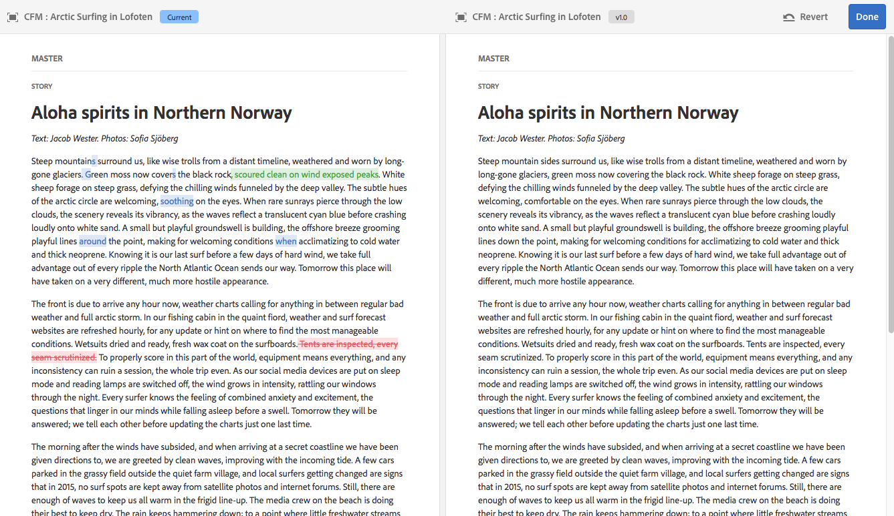

# Gestione dei frammenti di contenuto{#managing-content-fragments}

I frammenti di contenuto sono memorizzati come **Risorse**, pertanto vengono gestiti principalmente dalla console **Risorse**.

>[!NOTE]
>
>I frammenti di contenuto vengono quindi utilizzati con le pagine di authoring; consultate [Authoring delle pagine con frammenti di contenuto](/help/sites-authoring/content-fragments.md).

## Creazione di frammenti di contenuto {#creating-content-fragments}

### Creazione di un modello di contenuto {#creating-a-content-model}

[La ](/help/assets/content-fragments/content-fragments-models.md) modellizzazione dei frammenti di contenuto può essere abilitata e creata prima della creazione di frammenti di contenuto con contenuto strutturato.

>[!NOTE]
>
>Per ulteriori informazioni sui modelli, vedere [Sviluppo di frammenti di contenuto](/help/sites-developing/customizing-content-fragments.md); utilizzato per i frammenti di contenuto semplici.

### Creazione di un frammento di contenuto {#creating-a-content-fragment}

Il metodo di creazione di un frammento di contenuto è sostanzialmente lo stesso per i frammenti semplici e strutturati:

1. Passa alla cartella **Risorse** in cui desideri creare il frammento.
1. Per aprire la procedura guidata, seleziona **Crea**, quindi **Frammento di contenuto**.
1. Il primo passaggio della procedura guidata richiede di specificare la base del nuovo frammento.

   * Può trattarsi di:

      * [Modello](/help/sites-developing/content-fragment-templates.md) , ad esempio  **Frammento semplice**

      * [Modello](/help/assets/content-fragments/content-fragments-models.md) : utilizzato per creare un frammento che richiede contenuto strutturato; ad esempio, il modello  **** Airportmodel
   * Vengono visualizzati tutti i modelli disponibili.

   Dopo la selezione, utilizzare **Next** per continuare.

   

1. Nel passaggio **Proprietà** specifica:

   * **Base**

      * **Titolo**

         Titolo del frammento.

         Obbligatorio.

      * **Descrizione**

      * **Tag**
   * **Avanzate**

      * **Nome**

         il nome; verrà utilizzato per formare l&#39;URL.

         Obbligatorio; viene derivato automaticamente dal titolo, ma può essere aggiornato.

1. Seleziona **Crea** per completare l’azione, quindi **Apri** il frammento per la modifica oppure tornare alla console facendo clic su **Fine**.

## Azioni per un frammento di contenuto {#actions-for-a-content-fragment}

Nella console **Risorse** sono disponibili diverse azioni per i frammenti di contenuto:

* Dalla barra degli strumenti; dopo aver selezionato il frammento, sono disponibili tutte le azioni appropriate.
* Come [azioni rapide](/help/sites-authoring/basic-handling.md#quick-actions); un sottoinsieme di azioni disponibili per le singole schede frammento.

Selezionare il frammento per visualizzare la barra degli strumenti con le azioni applicabili:

* **Scarica**

   * Salvare il frammento come file ZIP; potete definire se includere elementi, varianti, metadati.

* **Crea**
* **Pagamento**
* **Proprietà**

   * Consente di visualizzare e/o modificare i metadati del frammento.

* **Modifica**

   * Consente di [aprire il frammento per la modifica di contenuto](/help/assets/content-fragments/content-fragments-variations.md) con i relativi elementi, varianti, contenuto associato e metadati.

* **Gestisci i tag**
* **Alla raccolta**

   * Aggiungere il frammento a una raccolta.
   * Questa operazione può essere eseguita anche quando [associando una raccolta al frammento](/help/assets/content-fragments/content-fragments-assoc-content.md#adding-associated-content).

* **Copia**/**Incolla**

* **Sposta**
* **Pubblicazione rapida**
* **Gestisci pubblicazione**
* **Elimina**

>[!NOTE]
>
>Molte di queste sono [azioni standard per Assets](/help/assets/manage-assets.md) e/o per l&#39;app desktop [AEM](https://docs.adobe.com/content/help/en/experience-manager-desktop-app/using/using.html).

## Apertura dell&#39;Editor frammento {#opening-the-fragment-editor}

Per aprire il frammento per la modifica:

>[!CAUTION]
>
>Per modificare un frammento di contenuto è necessario disporre di [le autorizzazioni appropriate](/help/sites-developing/customizing-content-fragments.md#asset-permissions). In caso di problemi, contattate l&#39;amministratore di sistema.

1. Utilizzate la console **Risorse** per individuare la posizione del frammento di contenuto.
1. Aprire il frammento per la modifica:

   * Toccando o facendo clic sul collegamento del frammento o del frammento (a seconda della vista della console).
   * Selezionare il frammento, quindi **Modifica** dalla barra degli strumenti.

   Viene aperto l’editor frammento:

   

   >[!NOTE]
   >
   >1. Viene visualizzato un messaggio se al frammento è già fatto riferimento in una pagina di contenuto.
   >2. Il pannello laterale può essere nascosto o visualizzato utilizzando l&#39;icona **Attiva/disattiva pannello laterale**.

1. Per spostarsi tra le tre modalità, usate le icone nel pannello laterale:

   * Variazioni: [Modifica dei contenuti](#editing-the-content-of-your-fragment) e [Gestione delle varianti](#creating-and-managing-variations-within-your-fragment)

   * [Annotazioni](/help/assets/content-fragments/content-fragments-variations.md#annotating-a-content-fragment)
   * [Contenuto associato](#associating-content-with-your-fragment)
   * [Metadati](#viewing-and-editing-the-metadata-properties-of-your-fragment)

   

1. Dopo aver apportato le modifiche, utilizzare **Save** o **Cancel** come necessario.

   >[!NOTE]
   >
   >Sia l’azione **Salva** che **Annulla** causeranno l’uscita dall’editor. Per informazioni complete sul funzionamento di entrambe le opzioni dei frammenti di contenuto, consulta la sezione [Salva, Annulla e Versioni](#save-cancel-and-versions).

## Salva, Annulla e Versioni {#save-cancel-and-versions}

>[!NOTE]
>
>È inoltre possibile creare [versioni, confrontarle e ripristinarle dalla Timeline](/help/assets/content-fragments/content-fragments-managing.md#timeline-for-content-fragments).

L&#39;editor dispone di due opzioni:

* **Salva**

   Salvare le modifiche più recenti e uscire dall&#39;editor.

   >[!CAUTION]
   >
   >Per modificare un frammento di contenuto è necessario disporre di [le autorizzazioni appropriate](/help/sites-developing/customizing-content-fragments.md#asset-permissions). In caso di problemi, contattate l&#39;amministratore di sistema.

   >[!NOTE]
   >
   >È possibile restare nell&#39;editor, apportando una serie di modifiche, prima di selezionare **Save**.

   >[!CAUTION]
   >
   >Oltre a salvare semplicemente le modifiche, **Save** aggiorna anche tutti i riferimenti e assicura che il dispatcher venga scaricato come necessario. L&#39;elaborazione di queste modifiche può richiedere del tempo. A causa di ciò, può verificarsi un impatto sulle prestazioni di un sistema di grandi dimensioni/complesso/pesantemente caricato.
   >
   >
   >Tenere presente questo aspetto quando si utilizza **Save** e quindi si reinserisce rapidamente nell&#39;editor frammenti per apportare e salvare ulteriori modifiche.

* **Annulla**

   Uscirà dall’editor senza salvare le modifiche più recenti.

Durante la modifica del frammento di contenuto AEM vengono create automaticamente delle versioni che garantiscono il ripristino del contenuto precedente in caso di **Annulla** modifiche:

1. Quando un frammento di contenuto viene aperto per la modifica AEM verifica l&#39;esistenza del token basato su cookie che indica se esiste una *sessione di modifica*:

   1. Se il token viene trovato, il frammento viene considerato parte della sessione di modifica esistente.
   2. Se il token è *not* disponibile e l&#39;utente avvia la modifica del contenuto, viene creata una versione e viene inviato un token per questa nuova sessione di modifica al client, dove viene salvato in un cookie.

2. In presenza di una sessione di modifica *attiva*, il contenuto in corso di modifica viene salvato automaticamente ogni 600 secondi (impostazione predefinita).

   >[!NOTE]
   >
   >L&#39;intervallo di salvataggio automatico è configurabile utilizzando il meccanismo `/conf`.
   >
   >
   >Valore predefinito, vedere:
   >
   >
   >`/libs/settings/dam/cfm/jcr:content/autoSaveInterval`

3. Se l&#39;utente seleziona l&#39;opzione **Annulla** per la modifica, la versione creata all&#39;inizio della sessione di modifica viene ripristinata e il token viene rimosso per terminare la sessione di modifica.
4. Se l&#39;utente seleziona **Salva** le modifiche, gli elementi/varianti aggiornati vengono memorizzati e il token viene rimosso per terminare la sessione di modifica.

## Modifica del contenuto del frammento {#editing-the-content-of-your-fragment}

Dopo aver aperto il frammento, è possibile utilizzare la scheda [Variazioni](/help/assets/content-fragments/content-fragments-variations.md) per creare il contenuto.

## Creazione e gestione di varianti all&#39;interno del frammento {#creating-and-managing-variations-within-your-fragment}

Dopo aver creato il contenuto principale, potete creare e gestire [Variazioni](/help/assets/content-fragments/content-fragments-variations.md) di tale contenuto.

## Associazione di contenuto al frammento {#associating-content-with-your-fragment}

È inoltre possibile associare [contenuto](/help/assets/content-fragments/content-fragments-assoc-content.md) a un frammento. Questa funzione consente una connessione in modo che le risorse (ad es. immagini) possano essere (facoltativamente) utilizzate con il frammento quando questo viene aggiunto a una pagina di contenuto.

## Visualizzazione e modifica dei metadati (proprietà) del frammento {#viewing-and-editing-the-metadata-properties-of-your-fragment}

È possibile visualizzare e modificare le proprietà di un frammento utilizzando la scheda [Metadati](/help/assets/content-fragments/content-fragments-metadata.md).

## Timeline per frammenti di contenuto {#timeline-for-content-fragments}

Oltre alle opzioni standard, [Timeline](/help/assets/manage-assets.md#timeline) fornisce informazioni e azioni specifiche per i frammenti di contenuto:

* Visualizzazione di informazioni su versioni, commenti e annotazioni
* Azioni per le versioni

   * **[Ripristina questa versione](#reverting-to-a-version)**  (selezionare un frammento esistente, quindi una versione specifica)

   * **[Confronta con corrente](#comparing-fragment-versions)**  (selezionare un frammento esistente, quindi una versione specifica)

   * Aggiungere un **Label** e/o un **Commento** (selezionare un frammento esistente, quindi una versione specifica)

   * **Salva come versione**  (selezionare un frammento esistente, quindi la freccia su nella parte inferiore della timeline)

* Azioni per le annotazioni

   * **Elimina**

>[!NOTE]
>
>I commenti sono:
>
>* Funzionalità standard per tutte le risorse
>* Realizzato nella timeline
>* Relativa alla risorsa frammento

>
>
Le annotazioni (per i frammenti di contenuto) sono:
>
>* Inserito nell’editor frammento
>* Specifica per un segmento di testo selezionato all&#39;interno del frammento

>

Esempio:

## Confronto delle versioni dei frammenti {#comparing-fragment-versions}

L&#39;azione **Confronta con corrente** è disponibile dalla [Timeline](/help/assets/content-fragments/content-fragments-managing.md#timeline-for-content-fragments) dopo aver selezionato una versione specifica.

Verrà aperto:

* la versione **Current** (più recente) (sinistra)

* la versione selezionata **v&lt;*x.y*>** (destra)

Vengono visualizzati affiancati, dove:

* Eventuali differenze sono evidenziate

   * Testo eliminato - rosso
   * Testo inserito - verde
   * Testo sostituito - blu

* L’icona a schermo intero consente di aprire una delle due versioni da sola; quindi tornate alla visualizzazione parallela
* È possibile **Ripristinare** la versione specifica
* **Ti** restituiranno la console

>[!NOTE]
>
>Non è possibile modificare il contenuto del frammento durante il confronto dei frammenti.

## Ripristino della versione {#reverting-to-a-version}

È possibile ripristinare una versione specifica del frammento:

* Direttamente dalla [Timeline](/help/assets/content-fragments/content-fragments-managing.md#timeline-for-content-fragments).

   Selezionate la versione richiesta, quindi l&#39;azione **Ripristina questa versione**.

* Mentre [confrontando una versione con la versione corrente](/help/assets/content-fragments/content-fragments-managing.md#comparing-fragment-versions) è possibile **Ripristinare** la versione selezionata.

## Pubblicazione e riferimento a un frammento {#publishing-and-referencing-a-fragment}

>[!CAUTION]
>
>Se il frammento è basato su un modello, verificare che il modello [sia stato pubblicato](/help/assets/content-fragments/content-fragments-models.md#publishing-a-content-fragment-model).
>
>Se si pubblica un frammento di contenuto per il quale il modello non è ancora stato pubblicato, verrà visualizzato un elenco di selezione e il modello verrà pubblicato insieme al frammento.

I frammenti di contenuto devono essere pubblicati per l’utilizzo nell’ambiente di pubblicazione. Possono essere pubblicati:

* Dopo la creazione; dalla console **Risorse**.
* Quando si [pubblica una pagina che utilizza il frammento](/help/sites-authoring/content-fragments.md#publishing); il frammento verrà elencato nei riferimenti di pagina.

>[!CAUTION]
>
>Dopo aver pubblicato e/o fatto riferimento a un frammento, AEM viene visualizzato un avviso quando un autore riapre il frammento per la modifica. In questo modo viene segnalato che le modifiche apportate al frammento avranno effetto anche sulle pagine di riferimento.

## Eliminazione di un frammento {#deleting-a-fragment}

Per eliminare un frammento:

1. Nella console **Risorse** individuate la posizione del frammento di contenuto.
2. Selezionare il frammento.

   >[!NOTE]
   >
   >L&#39;azione **Elimina** non è disponibile come azione rapida.

3. Selezionare **Elimina** dalla barra degli strumenti.
4. Confermare l&#39;azione **Elimina**.

   >[!CAUTION]
   >
   >Se in una pagina è già presente un riferimento al frammento, verrà visualizzato un messaggio di avviso e sarà necessario confermare che si desidera procedere con **Forza eliminazione**. Il frammento, insieme al relativo componente di frammento di contenuto, verrà eliminato da tutte le pagine di contenuto.

