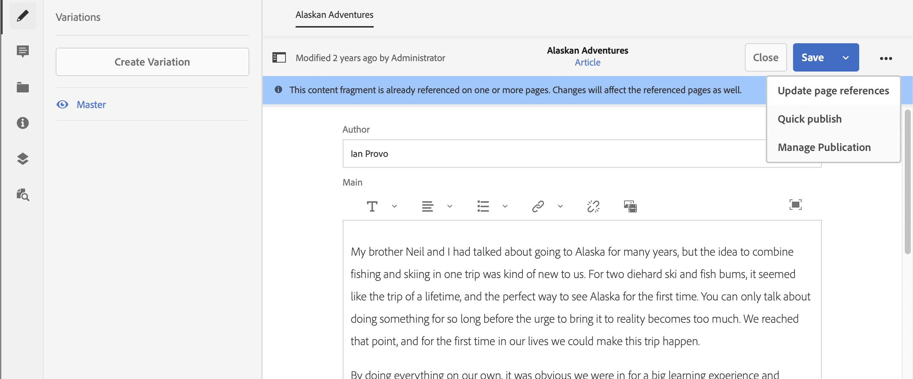

# Gestione dei frammenti di contenuto {#managing-content-fragments}

Scopri come utilizzare la console Risorse per gestire i frammenti di contenuto AEM, alla base dei contenuti headless.

Dopo aver definito i [Modelli di frammento di contenuto](#creating-a-content-model) puoi utilizzarli per [creare i frammenti di contenuto](#creating-a-content-fragment).

[Editor frammento di contenuto](#opening-the-fragment-editor) fornisce varie [modalità](#modes-in-the-content-fragment-editor) per consentire di:

* [Modificare il ](#editing-the-content-of-your-fragment) contenuto e  [gestire le varianti](#creating-and-managing-variations-within-your-fragment)
* [Annotare il frammento](/help/assets/content-fragments/content-fragments-variations.md#annotating-a-content-fragment)
* [Associa contenuto al frammento](#associating-content-with-your-fragment)
* [Configurare i metadati](#viewing-and-editing-the-metadata-properties-of-your-fragment)
* [Visualizza albero struttura](/help/assets/content-fragments/content-fragments-structure-tree.md)
* [Anteprima della rappresentazione JSON](/help/assets/content-fragments/content-fragments-json-preview.md)

>[!NOTE]
>
>I frammenti di contenuto possono essere utilizzati:
>
>* quando si creano pagine; consulta [Authoring delle pagine con frammenti di contenuto](/help/sites-authoring/content-fragments.md).
>* per [Distribuzione di contenuti headless tramite frammenti di contenuto con GraphQL](/help/assets/content-fragments/content-fragments-graphql.md).

>[!NOTE]
>
>I frammenti di contenuto sono memorizzati come **Risorse**, quindi vengono gestiti principalmente dalla console **Risorse**.

## Creazione di frammenti di contenuto {#creating-content-fragments}

### Creazione di un modello di contenuto {#creating-a-content-model}

[È possibile abilitare e creare ](/help/assets/content-fragments/content-fragments-models.md) modelli di frammento di contenuto prima di creare frammenti di contenuto con contenuto strutturato.

### Creazione di un frammento di contenuto {#creating-a-content-fragment}

Il metodo di creazione di un frammento di contenuto è:

1. Passa alla cartella **Risorse** in cui desideri creare il frammento.
1. Per aprire la procedura guidata, seleziona **Crea**, quindi **Frammento di contenuto**.
1. Il primo passaggio della procedura guidata richiede di specificare la base del nuovo frammento.

   * [Modello](/help/assets/content-fragments/content-fragments-models.md) : utilizzato per creare un frammento che richiede contenuto strutturato; ad esempio il modello  **** Avventuremodel

      * Vengono visualizzati tutti i modelli disponibili.

   Dopo la selezione, utilizza **Avanti** per continuare.

   

1. Nel passaggio **Proprietà** specifica:

   * **Base**

      * **Titolo**

         Titolo del frammento.

         Obbligatorio.

      * **Descrizione**

      * **Tag**
   * **Avanzate**

      * **Nome**

         il nome; verrà utilizzato per formare l’URL.

         Obbligatorio; viene derivato automaticamente dal titolo, ma può essere aggiornato.

1. Seleziona **Crea** per completare l’azione, quindi **Apri** il frammento per la modifica oppure tornare alla console facendo clic su **Fine**.

   >[!NOTE]
   >In modalità **Elenco** della console è possibile aggiornare **Visualizza impostazioni** per abilitare la colonna **Modello frammento di contenuto**.

## Azioni per un frammento di contenuto nella console Risorse {#actions-for-a-content-fragment-assets-console}

Nella console **Risorse** sono disponibili diverse azioni per i frammenti di contenuto:

* Dalla barra degli strumenti; dopo aver selezionato il frammento sono disponibili tutte le azioni appropriate.
* Come [azioni rapide](/help/sites-authoring/basic-handling.md#quick-actions); un sottoinsieme di azioni disponibili per le singole schede di frammento.

Seleziona il frammento per visualizzare la barra degli strumenti con le azioni applicabili:

* **Scarica**

   * Salvare il frammento come file ZIP; puoi definire se includere elementi, varianti, metadati.

* **Crea**
* **Pagamento**
* **Proprietà**

   * Consente di visualizzare e/o modificare i metadati del frammento.

* **Modifica**

   * Consente di [aprire il frammento per la modifica di contenuto](/help/assets/content-fragments/content-fragments-variations.md) insieme ai relativi elementi, varianti, contenuti e metadati associati.

* **Gestisci i tag**
* **Alla raccolta**
* **Copia**  (e  **Incolla**)
* **Sposta**
* **Pubblicazione rapida**
* **Gestisci pubblicazione**
* **Elimina**

>[!NOTE]
>
>Molte di queste sono azioni [standard per Assets](/help/assets/manage-assets.md) e/o l’ [AEM app desktop](https://experienceleague.adobe.com/docs/experience-manager-desktop-app/using/using.html?lang=it).

## Apertura dell’Editor frammento {#opening-the-fragment-editor}

Per aprire il frammento per la modifica:

>[!CAUTION]
>
>Per modificare un frammento di contenuto è necessario disporre delle [autorizzazioni appropriate](/help/sites-developing/customizing-content-fragments.md#asset-permissions). In caso di problemi, contatta l’amministratore di sistema.

>[!CAUTION]
>
>Per modificare un frammento di contenuto è necessario disporre delle autorizzazioni appropriate. In caso di problemi, contatta l’amministratore di sistema.

1. Utilizza la console **Risorse** per accedere alla posizione del frammento di contenuto.
1. Apri il frammento per la modifica:

   * Tocca o fai clic sul collegamento frammento o frammento (a seconda della vista della console).
   * Selezionando il frammento, quindi **Modifica** dalla barra degli strumenti.

1. Viene aperto l’editor frammenti. Apporta le modifiche necessarie:

   

1. Dopo aver apportato le modifiche, utilizza **Salva e chiudi**.

<!-- 
1. After making changes, use **Save**, **Save & close** or **Close** as required.

   >[!NOTE]
   >
   >**Save & close** is available via the **Save** dropdown.

   >[!NOTE]
   >
   >Both **Save & Close** and **Close** will exit the editor - see [Save, Close and Versions](#save-close-and-versions) for full information on how the various options operate for content fragments.
-->

## Modalità e azioni nell’Editor frammento di contenuto {#modes-actions-content-fragment-editor}

Sono disponibili varie modalità e azioni dall’Editor frammento di contenuto.

### Modalità nell’Editor frammento di contenuto {#modes-in-the-content-fragment-editor}

Naviga tra le varie modalità utilizzando le icone nel pannello laterale:

* Variazioni: [Modifica del contenuto](#editing-the-content-of-your-fragment) e [Gestione delle varianti](#creating-and-managing-variations-within-your-fragment)

* [Annotazioni](/help/assets/content-fragments/content-fragments-variations.md#annotating-a-content-fragment)
* [Contenuto associato](#associating-content-with-your-fragment)
* [Metadati](#viewing-and-editing-the-metadata-properties-of-your-fragment)
* [Albero struttura](/help/assets/content-fragments/content-fragments-structure-tree.md)
* [Anteprima](/help/assets/content-fragments/content-fragments-json-preview.md)

### Azioni barra degli strumenti nell’Editor frammento di contenuto {#toolbar-actions-in-the-content-fragment-editor}

Alcune funzioni nella barra degli strumenti superiore sono disponibili in diverse modalità:

<!-- screenshot changed from original text see commented out below -->

* Se in una pagina di contenuto è già presente un riferimento al frammento, viene visualizzato un messaggio. Puoi **Chiudere** il messaggio.

* Il pannello laterale può essere nascosto o visualizzato utilizzando l&#39;icona **Attiva/Disattiva pannello laterale** .

* Sotto il nome del frammento è possibile visualizzare il nome del [modello di frammento di contenuto](/help/assets/content-fragments/content-fragments-models.md) utilizzato per creare il frammento corrente:

   * Il nome è anche un collegamento che aprirà l&#39;editor modelli.

* Vedere lo stato del frammento; ad esempio, informazioni su quando è stato creato, modificato o pubblicato.

* **Salva e chiudi**

<!--
Some features in the top toolbar are available from multiple modes:

* A message will be shown when the fragment is already referenced on a content page. You can **Close** the message.

* The side panel can be hidden/shown using the **Toggle Side Panel** icon.

* Underneath the fragment name you can see the name of the [Content Fragment Model](/help/assets/content-fragments/content-fragments-models.md) used for creating the current fragment:

  * The name is also a link that will open the model editor.

* See the status of the fragment; for example, information about when it was created, modified or published. The status is also color-coded:

  * **New**: grey
  * **Draft**: blue
  * **Published**: green
  * **Modified**: orange
  * **Deactivated**: red

* **Save** provides access to the **Save & close** option.
  
* The three dots (**...**) drop-down provides access to additional actions:
  * **Update page references**
    * This updates any page references. 
  * **[Quick publish](#publishing-and-referencing-a-fragment)**
  * **[Manage Publication](#publishing-and-referencing-a-fragment)**
-->

<!--
This updates any page references and ensures that the Dispatcher is flushed as required. -->

<!--
## Save, Close and Versions {#save-close-and-versions}

>[!NOTE]
>
>Versions can also be [created, compared and reverted from the Timeline](/help/assets/content-fragments/content-fragments-managing.md#timeline-for-content-fragments).

The editor has various options:

* **Save** and **Save & close**

  * **Save** will save the latest changes and remain in the editor.
  * **Save & close** will save the latest changes and exit the editor.

  >[!CAUTION]
  >
  >To edit a content fragment you need [the appropriate permissions](/help/sites-developing/customizing-content-fragments.md#asset-permissions). Please contact your system administrator if you are experiencing issues. 

  >[!NOTE]
  >
  >It is possible to remain in the editor, making a series of changes, before saving.

  >[!CAUTION]
  >
  >In addition to simply saving your changes, the actions also update any references and ensures that the Dispatcher is flushed as required. These changes can take time to process. Due to this, there can be a performance impact on a large/complex/heavily-loaded system.
  >
  >Please bear this in mind when using **Save & close** and then quickly re-entering the fragment editor to make and save further changes.

* **Close**

  Will exit the editor without saving the latest changes (i.e made since the last **Save**).

While editing your content fragment AEM automatically creates versions to ensure that prior content can be restored if you cancel your changes (using **Close** without saving):

1. When a content fragment is opened for editing AEM checks for the existence of the cookie-based token that indicates whether an *editing session* exists:

   1. If the token is found, the fragment is considered to be part of the existing editing session.
   2. If the token is *not* available and the user starts editing content, a version is created and a token for this new editing session is sent to the client, where it is saved in a cookie.

2. While there is an *active* editing session, the content being edited is automatically saved every 600 seconds (default).

   >[!NOTE]
   >
   >The auto save interval is configurable using the `/conf` mechanism.
   >
   >Default value, see:
   >&nbsp;&nbsp;`/libs/settings/dam/cfm/jcr:content/autoSaveInterval`

3. If the user cancels the edit, the version created at the start of the editing session is restored and the token is removed to end the editing session.
4. If the user selects to **Save** the edits, the updated elements/variations are persisted and the token is removed to end the editing session.
-->

## Modifica del contenuto del frammento {#editing-the-content-of-your-fragment}

Dopo aver aperto il frammento, puoi utilizzare la scheda [Variazioni](/help/assets/content-fragments/content-fragments-variations.md) per creare i contenuti.

## Creazione e gestione di varianti all’interno del frammento {#creating-and-managing-variations-within-your-fragment}

Dopo aver creato il contenuto principale, puoi creare e gestire [Variazioni](/help/assets/content-fragments/content-fragments-variations.md) di tale contenuto.

## Associazione di contenuto al frammento {#associating-content-with-your-fragment}

È inoltre possibile [associare il contenuto](/help/assets/content-fragments/content-fragments-assoc-content.md) a un frammento. Questa funzione consente di collegare in modo che le risorse (ad esempio le immagini) possano essere (facoltativamente) utilizzate con il frammento quando viene aggiunto a una pagina di contenuto.

## Visualizzazione e modifica dei metadati (proprietà) del frammento {#viewing-and-editing-the-metadata-properties-of-your-fragment}

È possibile visualizzare e modificare le proprietà di un frammento utilizzando la scheda [Metadati](/help/assets/content-fragments/content-fragments-metadata.md) .

## Timeline per i frammenti di contenuto {#timeline-for-content-fragments}

Oltre alle opzioni standard, [Timeline](/help/assets/manage-assets.md#timeline) fornisce sia informazioni che azioni specifiche per i frammenti di contenuto:

* Visualizza informazioni su versioni, commenti e annotazioni
* Azioni per le versioni

   * **[Ripristina questa versione](#reverting-to-a-version)**  (seleziona un frammento esistente e quindi una versione specifica)

   * **[Confronta con corrente](#comparing-fragment-versions)**  (seleziona un frammento esistente, quindi una versione specifica)

   * Aggiungi un **Etichetta** e/o **Commento** (seleziona un frammento esistente, quindi una versione specifica)

   * **Salva come versione**  (seleziona un frammento esistente, quindi la freccia su nella parte inferiore della timeline)

* Azioni per le annotazioni

   * **Elimina**

>[!NOTE]
>
>I commenti sono:
>
>* Funzionalità standard per tutte le risorse
>* Made in Timeline
>* Correlato alla risorsa frammento

>
>Le annotazioni (per i frammenti di contenuto) sono:
>
>* Inserito nell’editor frammenti
>* Specifica per un segmento di testo selezionato all’interno del frammento

>

Esempio:

## Confronto delle versioni dei frammenti {#comparing-fragment-versions}

L&#39;azione **Confronta con corrente** è disponibile dalla [Timeline](/help/assets/content-fragments/content-fragments-managing.md#timeline-for-content-fragments) dopo aver selezionato una versione specifica.

Verrà aperto:

* la versione **Corrente** (più recente) (a sinistra)

* la versione selezionata **v&lt;*x.y*>** (a destra)

Vengono visualizzati affiancati, dove:

* Eventuali differenze sono evidenziate

   * Testo eliminato - rosso
   * Testo inserito - verde
   * Testo sostituito - blu

* L’icona a schermo intero consente di aprire una delle due versioni da sola; quindi torna alla vista parallela
* È possibile **Ripristinare** alla versione specifica
* **** Verrai reindirizzato alla console

>[!NOTE]
>
>Non è possibile modificare il contenuto del frammento quando si confrontano i frammenti.

## Ripristino di una versione  {#reverting-to-a-version}

È possibile ripristinare una versione specifica del frammento:

* Direttamente dalla [Timeline](/help/assets/content-fragments/content-fragments-managing.md#timeline-for-content-fragments).

   Seleziona la versione richiesta, quindi l&#39;azione **Ripristina questa versione** .

* Mentre [confronta una versione con la versione corrente](/help/assets/content-fragments/content-fragments-managing.md#comparing-fragment-versions) puoi **Ripristinare** la versione selezionata.

## Pubblicazione e riferimento a un frammento {#publishing-and-referencing-a-fragment}

>[!CAUTION]
>
>Se il frammento è basato su un modello, assicurati che il modello [sia stato pubblicato](/help/assets/content-fragments/content-fragments-models.md#publishing-a-content-fragment-model).
>
>Se pubblichi un frammento di contenuto per il quale il modello non è ancora stato pubblicato, un elenco di selezione lo indicherà e il modello verrà pubblicato con il frammento.

I frammenti di contenuto devono essere pubblicati per l’utilizzo nell’ambiente di pubblicazione. Possono essere pubblicati:

* Dopo la creazione; utilizzando le azioni [disponibili nella console Assets](#actions-for-a-content-fragment-assets-console).
* Dall’ [Editor frammento di contenuto](#toolbar-actions-in-the-content-fragment-editor).
* Quando si [pubblica una pagina che utilizza il frammento](/help/sites-authoring/content-fragments.md#publishing); il frammento viene elencato nei riferimenti di pagina.

>[!CAUTION]
>
>Dopo la pubblicazione e/o il riferimento a un frammento, AEM un avviso quando un autore riapre il frammento per la modifica. In questo modo si avverte che le modifiche al frammento avranno effetto anche sulle pagine a cui si fa riferimento.

## Eliminazione di un frammento {#deleting-a-fragment}

Per eliminare un frammento:

1. Nella console **Risorse** individua la posizione del frammento di contenuto.
2. Selezionare il frammento.

   >[!NOTE]
   >
   >L&#39;azione **Elimina** non è disponibile come azione rapida.

3. Seleziona **Elimina** dalla barra degli strumenti.
4. Conferma l’azione **Elimina**.

   >[!CAUTION]
   >
   >Se in una pagina è già presente un riferimento al frammento, verrà visualizzato un messaggio di avviso e sarà necessario confermare che si desidera procedere con **Forza eliminazione**. Il frammento, insieme al relativo componente di frammento di contenuto, verrà eliminato da tutte le pagine di contenuto.
