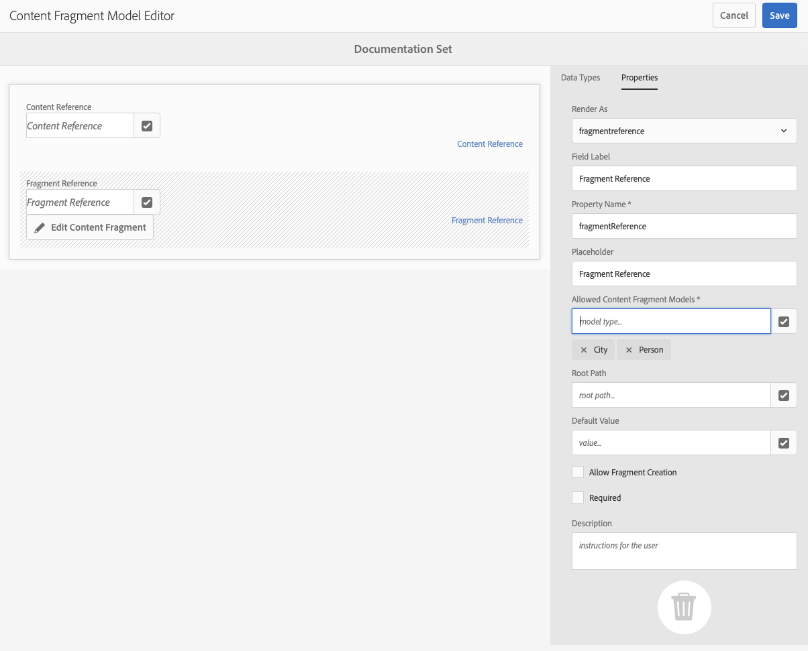
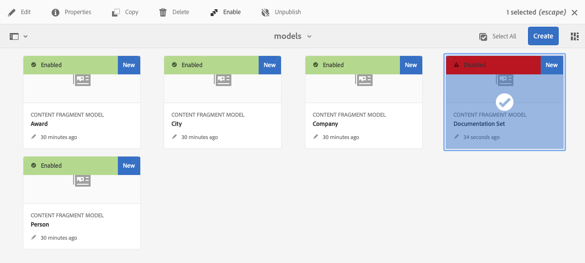

# Modelli per frammenti di contenuto {#content-fragment-models}

I modelli per frammenti di contenuto nell’AEM definiscono la struttura del contenuto per il [frammenti di contenuto,](/help/assets/content-fragments/content-fragments.md) fungere da base per i contenuti headless.

Per utilizzare i modelli di frammento di contenuto:

1. [Abilita la funzionalità modello Frammento di contenuto per un’istanza](/help/assets/content-fragments/content-fragments-configuration-browser.md)
1. [Crea](#creating-a-content-fragment-model) e [configura](#defining-your-content-fragment-model) i modelli per frammenti di contenuto
1. [Abilitare i modelli di frammenti di contenuto](#enabling-disabling-a-content-fragment-model) da utilizzare per la creazione di frammenti di contenuto
1. [Consenti modelli di frammento di contenuto nelle cartelle Risorse richieste](#allowing-content-fragment-models-assets-folder) configurando i **Criteri**.

## Creazione di un modello di frammento di contenuto {#creating-a-content-fragment-model}

1. Accedi a **Strumenti**, **Risorse**, quindi apri **Modelli per frammenti di contenuto**.
1. Passa alla cartella appropriata per [configurazione](/help/assets/content-fragments/content-fragments-configuration-browser.md).
1. Utilizza **Crea** per aprire la procedura guidata.

   >[!CAUTION]
   >
   >Se l’[utilizzo di modelli per frammenti di contenuto non è stato abilitato](/help/assets/content-fragments/content-fragments-configuration-browser.md), l’opzione **Crea** non sarà disponibile.

1. Specifica il **Titolo modello**. Puoi anche aggiungere **Tag**, **Descrizione** e, se necessario, selezionare **Abilita modello** per [abilitare il modello](#enabling-disabling-a-content-fragment-model).

   

1. Utilizza **Crea** per salvare il modello vuoto. Un messaggio indica il successo dell’azione: puoi selezionare **Apri** per modificare immediatamente il modello, oppure **Fine** per tornare alla console.

## Definizione del modello per frammenti di contenuto {#defining-your-content-fragment-model}

Il modello per frammenti di contenuto definisce efficacemente la struttura dei frammenti di contenuto risultanti utilizzando una selezione di **[Tipi di dati](#data-types)**. Utilizzando l’editor modelli è possibile aggiungere istanze dei tipi di dati, quindi configurarle per creare i campi richiesti:

>[!CAUTION]
>
>La modifica di un modello per frammento di contenuto esistente può avere un impatto sui frammenti dipendenti.

1. Accedi a **Strumenti**, **Risorse**, quindi apri **Modelli per frammenti di contenuto**.

1. Passa alla cartella contenente il modello per frammenti di contenuto.

1. Apri il modello che desideri **modificare** utilizzando l’azione rapida oppure selezionando il modello e quindi l’azione dalla barra degli strumenti.

   Una volta aperto, l’editor modelli mostra:

   * a sinistra: campi già definiti
   * a destra: **Tipi di dati** disponibili per la creazione di campi, oltre alle **Proprietà** da utilizzare dopo la creazione

   >[!NOTE]
   >
   >Quando un campo è **obbligatorio**, l’**Etichetta** indicata nel riquadro a sinistra sarà contrassegnata con un asterisco (**&#42;**).

   

1. **Per aggiungere un campo**

   * Trascina un tipo di dati obbligatorio nella posizione desiderata per un campo:

     

   * Una volta aggiunto un campo al modello, il pannello di destra visualizza le **Proprietà** che possono essere definite per quel particolare tipo di dati. Qui puoi definire ciò che è necessario per quel campo.

      * Molte proprietà sono auto-esplicative, per ulteriori dettagli vedi [Proprietà](#properties).
      * La digitazione di un’**Etichetta campo** completerà automaticamente il **Nome proprietà**. Se vuoto, può essere aggiornato manualmente in seguito.

        >[!CAUTION]
        >
        >Quando aggiorni manualmente la proprietà **Nome proprietà** per un tipo di dati, tieni presente che i nomi devono contenere solo caratteri A-Z, a-z, 0-9 e il carattere speciale di sottolineatura “_”.
        >
        >Se i modelli creati in versioni precedenti di AEM contengono caratteri non validi, rimuovi o aggiorna tali caratteri.

     Esempio:

     

1. **Per rimuovere un campo**

   Seleziona il campo richiesto, quindi tocca o fai clic sull’icona del cestino. Viene richiesto di confermare l’operazione.

   

1. Aggiungi tutti i campi obbligatori e definisci le relative proprietà in base alle esigenze. Esempio:

   

1. Seleziona **Salva** per mantenere la definizione.

## Tipi di dati {#data-types}

Per definire il modello è disponibile una selezione di tipi di dati:

* **Testo su riga singola**
   * Aggiungi uno o più campi di una singola riga di testo; la lunghezza massima può essere definita
* **Testo su più righe**
   * L’area di testo può essere RTF, Testo normale o Markdown
* **Numero**
   * Aggiungi uno o più campi numerici
* **Booleano**
   * Aggiungi una casella di controllo booleana
* **Data e ora**
   * Aggiungi una data e/o un’ora
* **Enumerazione**
   * Aggiungi un set di caselle di controllo, pulsanti di scelta o campi a discesa
* **Tag**
   * Consente agli autori di frammenti di accedere alle aree dei tag e di selezionarle
* **Riferimento contenuto**
   * I riferimenti ad altri contenuti di qualsiasi tipo possono essere utilizzati per [creare contenuto nidificato](#using-references-to-form-nested-content)
   * Se si fa riferimento a un’immagine, è possibile scegliere di mostrare una miniatura
* **Riferimento frammento**
   * I riferimenti ad altri frammenti di contenuto possono essere utilizzati per [creare contenuto nidificato](#using-references-to-form-nested-content)
   * Il tipo di dati può essere configurato in modo da consentire agli autori di frammenti di:
      * Modificare direttamente il frammento a cui si fa riferimento.
      * Creare un nuovo frammento di contenuto basato sul modello appropriato
* **Oggetto JSON**
   * Consente all’autore del frammento di contenuto di immettere la sintassi JSON negli elementi corrispondenti di un frammento.
      * Questo fa sì che AEM possa memorizzare direttamente JSON con copia e incolla da un altro servizio.
      * Il JSON verrà trasmesso e risulterà come JSON in GraphQL.
      * Include l’evidenziazione della sintassi JSON, il completamento automatico e l’evidenziazione degli errori nell’editor dei frammenti di contenuto.
* **Segnaposto scheda**
   * Consente l’introduzione di schede da utilizzare per la modifica del contenuto dei frammenti di contenuto.
Nell’editor modelli verrà mostrato come divisore che separa le sezioni dell’elenco dei tipi di dati di contenuto. Ogni istanza rappresenta l’inizio di una nuova scheda.
Nell’editor frammenti ogni istanza viene visualizzata come una scheda.
     >[!NOTE]
     >
     >Questo tipo di dati viene utilizzato esclusivamente per la formattazione e viene ignorato dallo schema GraphQL AEM.

## Proprietà {#properties}

Molte proprietà sono auto-esplicative, qui sotto ulteriori dettagli per alcune proprietà:


* **Nome proprietà**

  Quando aggiorni manualmente questa proprietà per un tipo di dati, tieni presente che i nomi **devono** contenere *solo* caratteri A-Z, a-z, 0-9 e il carattere speciale di sottolineatura “_“.

  >[!CAUTION]
  >
  >Se i modelli creati in versioni precedenti di AEM contengono caratteri non validi, rimuovi o aggiorna tali caratteri.

* **Rendering come** 
Consente varie opzioni per la realizzazione/il rendering del campo in un frammento. Spesso questo consente di definire se l’autore visualizzerà una singola istanza del campo o se potrà creare più istanze.

* **Etichetta campo** 
Se si inserisce un’**Etichetta campo** verrà generato automaticamente un **Nome proprietà** che, se necessario, potrà essere aggiornato manualmente.

* **Convalida**
La convalida di base è disponibile tramite meccanismi quali la proprietà **Obbligatorio**. Alcuni tipi di dati dispongono di campi di convalida aggiuntivi. Vedi [Convalida](#validation) per ulteriori dettagli.

* Per il tipo di dati **Testo su più righe** è possibile definire il **Tipo predefinito** come:

   * **Formato RTF**
   * **Markdown**
   * **Testo normale**

  Se non viene specificato diversamente, per questo campo viene utilizzato il valore predefinito **Rich Text**.

  La modifica del **Tipo predefinito** in un modello per frammenti di contenuto avrà effetto solo su un frammento esistente correlato, una volta che il frammento è stato aperto nell’editor e successivamente salvato.

* **Univoco**
Il contenuto (per il campo specifico) deve essere univoco in tutti i frammenti di contenuto creati dal modello corrente.

  Questo viene utilizzato per impedire agli autori di contenuti di ripetere contenuti già aggiunti in un altro frammento dello stesso modello.

  Ad esempio, un campo **Testo a riga singola** denominato `Country` nel modello per frammenti di contenuto non può avere il valore `Japan` in due frammenti di contenuto dipendenti. Viene visualizzato un avviso quando si tenta di eseguire la seconda istanza.

  >[!NOTE]
  >
  >L’unicità è assicurata da directory principale lingua.

  >[!NOTE]
  >
  >Le varianti possono avere lo stesso valore *unico* come varianti dello stesso frammento, ma non lo stesso valore utilizzato in qualsiasi variante di altri frammenti.

* Vedi **[Riferimento contenuto](#content-reference)** per ulteriori dettagli su quel tipo di dati specifico e sulle relative proprietà.

* Vedi **[Riferimento frammento (frammenti nidificati)](#fragment-reference-nested-fragments)** per ulteriori dettagli su quel tipo di dati specifico e sulle relative proprietà.

<!--
* **Translatable**
  Checking the **Translatable** checkbox on a field in the Content Fragment Model editor will:

  * Ensure the field's property name is added to the translation configuration, context `/content/dam/<sites-configuration>`, if not already present. 
  * For GraphQL: set a `<translatable>` property on the Content Fragment field to `yes`, to allow GraphQL query filter for JSON output with only translatable content.
-->

## Convalida {#validation}

Diversi tipi di dati includono ora la possibilità di definire requisiti di convalida per l’immissione di contenuto nel frammento risultante:

* **Testo su riga singola**
   * Confronta con un regex predefinito.
* **Numero**
   * Verifica la presenza di valori specifici.
* **Riferimento contenuto**
   * Controlla tipi specifici di contenuto.
   * È possibile fare riferimento solo alle risorse di dimensioni file specificate o inferiori.
   * È possibile fare riferimento solo alle immagini entro un intervallo di larghezza e/o altezza predefinito (in pixel).
* **Riferimento frammento**
   * Verifica un modello di frammento di contenuto specifico.

## Utilizzo di riferimenti per creare contenuti nidificati {#using-references-to-form-nested-content}

I frammenti di contenuto possono formare contenuto nidificato utilizzando uno dei seguenti tipi di dati:

* **[Riferimento contenuto](#content-reference)**
   * Fornisce un semplice riferimento ad altri contenuti; di qualsiasi tipo.
   * Può essere configurato per uno o più riferimenti (nel frammento risultante).

* **[Riferimento frammento](#fragment-reference-nested-fragments)** (frammenti nidificati)
   * Fa riferimento ad altri frammenti, a seconda dei modelli specifici indicati.
   * Consente di includere/recuperare dati strutturati.
     >[!NOTE]
     >
     >Questo metodo è particolarmente interessante in relazione alla [Distribuzione di contenuti headless tramite frammenti di contenuto con GraphQL](/help/assets/content-fragments/content-fragments-graphql.md).
   * Può essere configurato per uno o più riferimenti (nel frammento risultante).

>[!NOTE]
>
>AEM ha una protezione periodica per:
>
>* Riferimenti contenuto
>  Questo impedisce all’utente di aggiungere un riferimento al frammento corrente. Inoltre la finestra di dialogo selettore del riferimento frammento può risultare vuota.
>
>* Riferimenti frammento in GraphQL
>  Se crei una query approfondita che restituisce più frammenti di contenuto a cui fanno riferimento l’un l’altro, alla prima occorrenza restituirà null.

### Riferimento contenuto {#content-reference}

Il Riferimento contenuto consente di eseguire il rendering del contenuto da un’altra origine, ad esempio un frammento di immagine o di contenuto.

Oltre alle proprietà standard puoi specificare:

* Il **Percorso directory principale** per qualsiasi contenuto a cui si fa riferimento
* I tipi di contenuto a cui è possibile fare riferimento
* Le limitazioni per le dimensioni dei file
* Se si fa riferimento a un’immagine:
   * Mostra miniatura
   * Limiti di altezza e larghezza dell’immagine


### Riferimento frammento (frammenti nidificati) {#fragment-reference-nested-fragments}

Il Riferimento frammento fa riferimento a uno o più frammenti di contenuto. Questa funzione è particolarmente interessante per il recupero dei contenuti da utilizzare nell’app, in quanto consente di recuperare dati strutturati con più livelli.

Esempio:

* Un modello che definisce i dettagli di un dipendente, tra cui:
   * Un riferimento al modello che definisce il datore di lavoro (azienda)

```xml
type EmployeeModel {
    name: String
    firstName: String
    company: CompanyModel
}

type CompanyModel {
    name: String
    street: String
    city: String
}
```

>[!NOTE]
>
>Ciò è di particolare interesse in combinazione con [Distribuzione di contenuti headless tramite frammenti di contenuto con GraphQL](/help/assets/content-fragments/content-fragments-graphql.md).

Oltre alle proprietà standard puoi definire:

* **Rendering come**:

   * **multifield**: l’autore del frammento può creare più riferimenti individuali

   * **fragmentreference**: consente all’autore del frammento di selezionare un singolo riferimento a un frammento

* **Tipo di modello**
È possibile selezionare più modelli. Durante l’authoring del frammento di contenuto, tutti i frammenti a cui si fa riferimento devono essere stati creati utilizzando questi modelli.

* **Percorso radice**

Specifica un percorso radice per tutti i frammenti a cui si fa riferimento.

* **Consenti creazione di frammenti**

  In questo modo l’autore del frammento potrà creare un nuovo frammento basato sul modello appropriato.

   * **fragmentreferencecomposite**: consente all’autore del frammento di creare un elemento composito selezionando più frammenti

  

>[!NOTE]
>
>È presente un meccanismo di protezione per evitare le ricorrenze. Non consente all’utente di selezionare il frammento di contenuto corrente nel riferimento frammento. Inoltre la finestra di dialogo selettore del riferimento frammento può risultare vuota.
>
>In GraphQL è inoltre disponibile una protezione di ricorrenza per i riferimenti di frammenti. Se crei una query approfondita tra due frammenti di contenuto con riferimento l’uno all’altro, verrà restituito null.

## Abilitazione o disabilitazione di un modello per frammenti di contenuto {#enabling-disabling-a-content-fragment-model}

I modelli per frammenti di contenuto dispongono di uno stato che puoi impostare per avere il controllo completo del loro utilizzo.

### Abilitazione di un modello per frammenti di contenuto {#enabling-a-content-fragment-model}

Una volta creato un modello, sarà necessario abilitarlo per consentire quanto segue:

* Possibilità di selezionarlo quando si crea un nuovo frammento di contenuto
* Possibilità di utilizzarlo come riferimento all’interno di un modello per frammento di contenuto
* Possibilità di utilizzarlo in GraphQL, affinché venga generato lo schema

Per abilitare un modello contrassegnato come:

* **Bozza**: nuovo (mai abilitato)
* **Disabilitato**: che è stato specificamente disabilitato

puoi utilizzare l’opzione **Abilita** dalle seguenti aree:

* Dalla barra degli strumenti superiore, quando è selezionato il modello richiesto.
* Con l’azione rapida corrispondente (passando il mouse sul modello richiesto).



### Disabilitazione di un modello per frammenti di contenuto {#disabling-a-content-fragment-model}

Un modello può anche essere disabilitato, con i seguenti risultati:

* Il modello non sarà più disponibile come base per la creazione di *nuovi* frammenti di contenuto.
* Tuttavia:
   * Lo schema GraphQL continua a essere generato ed è ancora interrogabile (per evitare di influenzare l’API JSON).
   * È comunque possibile eseguire query su qualsiasi frammento di contenuto basato sul modello e restituirlo dall’endpoint GraphQL.
* Non è più possibile fare riferimento al modello, ma i riferimenti esistenti vengono mantenuti intatti e possono ancora essere interrogati e restituiti dall’endpoint GraphQL.

Per disattivare un modello contrassegnato come **Abilitato** si utilizza l’opzione **Disattiva** selezionabile:

* Dalla barra degli strumenti superiore, quando è selezionato il modello richiesto.
* Con l’azione rapida corrispondente (passando il mouse sul modello richiesto).


## Consentire modelli per frammenti di contenuto nella cartella delle risorse {#allowing-content-fragment-models-assets-folder}

Per implementare la governance dei contenuti, puoi configurare dei **Criteri** nella cartella Risorse per controllare quali modelli per frammenti di contenuto sono consentiti per la creazione di frammenti in tale cartella.

>[!NOTE]
>
>Il meccanismo è simile a [consentire modelli di pagina](/help/sites-authoring/templates.md#allowing-a-template-author) per una pagina e i relativi elementi secondari, nelle proprietà avanzate di una pagina.

Per configurare i **Criteri** dei **Modelli per frammenti di contenuto consentiti**:

1. Naviga e apri **Proprietà** per la cartella Risorse desiderata.

1. Apri la scheda **Criteri**, dove puoi configurare:

   * **Ereditato da`<folder>`**

     I criteri vengono ereditati automaticamente durante la creazione di nuove cartelle secondarie; il criterio può essere riconfigurato (interrompendo l’ereditarietà) se le sottocartelle devono consentire modelli diversi dalla cartella principale.

   * **Modelli per frammenti di contenuto consentiti per percorso**

     Possono essere consentiti più modelli.

   * **Modelli per frammenti di contenuto consentiti per tag**

     Possono essere consentiti più modelli.

   

1. **Salva** eventuali modifiche.

I modelli per frammenti di contenuto consentiti per una cartella vengono risolti come segue:
* I **Criteri** dei **Modelli per frammenti di contenuto consentiti**.
* Se vuoto, prova a determinare il criterio utilizzando le regole di ereditarietà.
* Se la catena di ereditarietà non fornisce un risultato, consulta la sezione Configurazione di **Servizi cloud** per quella cartella (anche prima direttamente e poi tramite ereditarietà).
* Se nessuno dei risultati di cui sopra fornisce risultati, allora non ci sono modelli consentiti per quella cartella.

## Eliminazione di un modello per frammenti di contenuto {#deleting-a-content-fragment-model}

>[!CAUTION]
>
>L’eliminazione di un modello per frammenti di contenuto può avere un impatto sui frammenti dipendenti.

Per eliminare un modello per frammenti di contenuto:

1. Accedi a **Strumenti**, **Risorse**, quindi apri **Modelli per frammenti di contenuto**.

1. Passa alla cartella contenente il modello per frammenti di contenuto.
1. Seleziona il modello e poi **Elimina** dalla barra degli strumenti.

   >[!NOTE]
   >
   >Se ci sono riferimenti al modello, viene visualizzato un avviso. Agisci di conseguenza.

## Pubblicazione di un modello per frammenti di contenuto {#publishing-a-content-fragment-model}

I modelli per frammenti di contenuto devono essere pubblicati quando/prima che vengano pubblicati eventuali frammenti di contenuto dipendenti.

Per pubblicare un modello per frammenti di contenuto:

1. Accedi a **Strumenti**, **Risorse**, quindi apri **Modelli per frammenti di contenuto**.

1. Passa alla cartella contenente il modello per frammenti di contenuto.
1. Seleziona il modello e poi **Pubblica** dalla barra degli strumenti.
Lo stato di pubblicazione sarà indicato nella console.

   >[!NOTE]
   >
   >Se pubblichi un frammento di contenuto per il quale il modello non è ancora stato pubblicato, questo sarà segnalato in un elenco di selezione e il modello verrà pubblicato con il frammento.

## Annullamento della pubblicazione di un modello per frammenti di contenuto {#unpublishing-a-content-fragment-model}

Si può annullare la pubblicazione di modelli per frammenti di contenuto che non sono referenziati da alcun frammento.

Per annullare la pubblicazione di un modello per frammenti di contenuto:

1. Accedi a **Strumenti**, **Risorse**, quindi apri **Modelli per frammenti di contenuto**.

1. Passa alla cartella contenente il modello per frammenti di contenuto.
1. Seleziona il modello e poi **Annulla pubblicazione** dalla barra degli strumenti.
Lo stato di pubblicazione sarà indicato nella console.

## Modello per frammenti di contenuto - Proprietà {#content-fragment-model-properties}

Puoi modificare le **Proprietà** di un modello per frammenti di contenuto:

* **Base**
   * **Titolo modello**
   * **Tag**
   * **Descrizione**
   * **Carica immagine**
