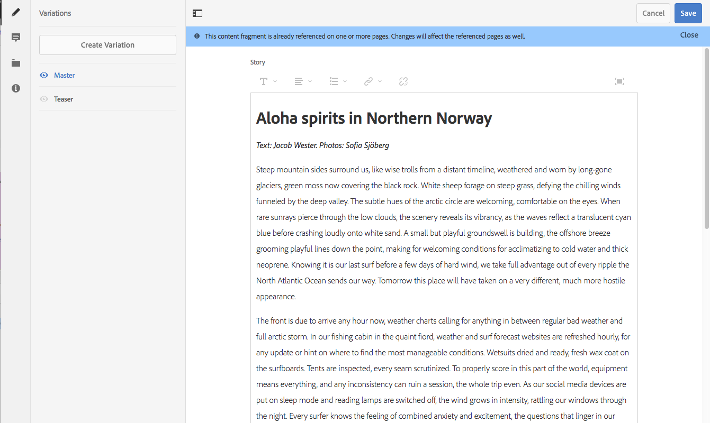

# Varianti - Authoring dei contenuti di frammenti{#variations-authoring-fragment-content}

[Le varianti](/help/assets/content-fragments/content-fragments.md#constituent-parts-of-a-content-fragment) sono una caratteristica importante dei frammenti di contenuto, in quanto consentono di creare e modificare copie del contenuto principale da utilizzare su canali e/o scenari specifici.

Dalla scheda **Variazioni** è possibile:

* [Immettere il contenuto](#authoring-your-content) del frammento
* [Creare e gestire le varianti](#managing-variations) del contenuto **principale**

Eseguire una serie di altre azioni in base al tipo di dati in corso di modifica; ad esempio:

* [Inserire risorse visive nel frammento](#inserting-assets-into-your-fragment) (immagini)
* Seleziona tra [RTF](#rich-text), [Testo](#plain-text) normale e [Marcatura](#markdown) per la modifica

* [Carica contenuto](#uploading-content)

* [Visualizzare le statistiche](#viewing-key-statistics) chiave (informazioni sul testo su più righe)
* [Testo riepilogo](#summarizing-text)

* [Sincronizzare le varianti con il contenuto principale](#synchronizing-with-master)

>[!CAUTION]
>
>Dopo aver pubblicato e/o fatto riferimento a un frammento, AEM viene visualizzato un avviso quando un autore riapre il frammento per la modifica. In questo modo viene segnalato che le modifiche apportate al frammento avranno effetto anche sulle pagine di riferimento.

## Authoring dei contenuti {#authoring-your-content}

Quando si apre il frammento di contenuto per la modifica, per impostazione predefinita viene aperta la scheda **Variazioni** . Qui potete creare il contenuto, per Master o qualsiasi altra variante disponibile. Operazioni disponibili:

* apportare modifiche direttamente nella scheda **Variazioni**
* aprire l’editor [a schermo](#full-screen-editor) intero su:

   * selezionare il [formato](#formats)
   * ulteriori opzioni di modifica (per il formato [RTF](#rich-text) )

   * accedere a una serie di [azioni](#actions)

Esempio:

* Modifica di un frammento semplice

   Un frammento semplice è composto da un campo di testo a più righe (è possibile aggiungere risorse visive dall’editor a schermo intero).

   

* Modifica di un frammento con contenuto strutturato

   Un frammento strutturato contiene vari campi, di vari tipi di dati, definiti nel modello di contenuto. Per tutti i campi con più righe è disponibile l’editor [a schermo](#full-screen-editor) intero.

   

### Editor a schermo intero {#full-screen-editor}

Quando si modifica un campo di testo a più righe, è possibile aprire l’editor a schermo intero:

L&#39;editor a schermo intero fornisce:

* Accesso a varie [azioni](#actions)
* A seconda del [formato](#formats), sono disponibili opzioni di formattazione aggiuntive ([RTF](#rich-text))

### Azioni {#actions}

Quando è aperto l’editor a schermo intero (ovvero testo su più righe) sono disponibili anche le azioni seguenti (per tutti i [formati](#formats)):

* Selezionare il [formato](#formats) ([RTF](#rich-text), testo [normale,](#plain-text) [Markdown](#markdown))

* [Mostra statistiche testo](#viewing-key-statistics)

* [Caricare il contenuto](#uploading-content)
* [Sincronizza con principale](#synchronizing-with-master) (durante la modifica di una variante)
* [Testo riepilogo](#summarizing-text)
* [Annotazione](/help/assets/content-fragments/content-fragments-variations.md#annotating-a-content-fragment) del testo

* [Inserire risorse visive nel frammento](#inserting-assets-into-your-fragment) (immagini)

### Formati {#formats}

Le opzioni per la modifica del testo su più righe dipendono dal formato selezionato:

* [Formato RTF](#rich-text)
* [Testo normale](#plain-text)
* [Markdown](#markdown)

Il formato può essere selezionato quando si utilizza l&#39;editor a schermo intero.

### Formato RTF {#rich-text}

La modifica RTF consente di formattare:

* Grassetto
* Corsivo
* Sottolineato
* Allineamento: sinistra, centro, destra
* Elenco puntato
* Elenco numerato
* Rientro: aumento, diminuzione
* Creare/interrompere collegamenti ipertestuali
* Aprite l’editor a schermo intero, in cui sono disponibili le seguenti opzioni di formattazione:

   * Incolla testo/da Word
   * Inserire una tabella
   * Stile paragrafo: Paragrafo, Intestazione 1/2/3
   * [Inserire risorse visive](#inserting-assets-into-your-fragment)
   * Ricerca
   * Trova/Sostituisci
   * Controllo ortografia
   * [Annotazioni](/help/assets/content-fragments/content-fragments-variations.md#annotating-a-content-fragment)

Le [azioni](#actions) sono accessibili anche dall’editor a schermo intero.

### Testo normale {#plain-text}

Testo semplice consente di inserire rapidamente il contenuto senza informazioni di formattazione o di marketing. Potete anche aprire l’editor a schermo intero per ulteriori [azioni](#actions).

>[!CAUTION]
>
>Se selezioni **Testo normale**, potresti perdere la formattazione, le marcature e/o le risorse inserite in **Rich Text** o **Markdown**.

### Markdown {#markdown}

>[!NOTE]
>
>Per informazioni complete, consulta la documentazione [Markdown](/help/assets/content-fragments/content-fragments-markdown.md) .

Questo consente di formattare il testo con la funzione di marketing. È possibile definire:

* Intestazioni
* Paragrafi e interruzioni di riga
* Collegamenti
* Immagini
* Virgolette a blocchi
* Elenchi
* Enfasi
* Blocchi di codice
* Estratti barra rovesciata

Potete anche aprire l’editor a schermo intero per ulteriori [azioni](#actions).

>[!CAUTION]
>
>Se passi da **Rich Text** a **Markdown**, potresti riscontrare effetti imprevisti con Block Quotes (Citazioni) e Code Blocks (Blocchi di codice), in quanto questi due formati possono presentare differenze nelle modalità di gestione.

### Visualizzazione delle statistiche chiave {#viewing-key-statistics}

Quando l’editor a schermo intero è aperto, l’azione **Statistiche testo** visualizzerà una serie di informazioni sul testo. Esempio:

### Caricamento del contenuto {#uploading-content}

Per semplificare la creazione di frammenti di contenuto, è possibile caricare il testo, prepararlo in un editor esterno e aggiungerlo direttamente al frammento.

### Riepilogo testo {#summarizing-text}

Il testo di riepilogo è progettato per consentire agli utenti di ridurre la lunghezza del testo a un numero predefinito di parole, mantenendo al contempo i punti chiave e il significato complessivo.

>[!NOTE]
>
>A livello più tecnico, il sistema mantiene le frasi che considera come fornire il *miglior rapporto di densità delle informazioni e di unicità* in base a specifici algoritmi.

>[!CAUTION]
>
>Il frammento di contenuto deve avere come antenato una cartella di lingua (codice ISO) valida; viene utilizzato per determinare il modello di lingua da utilizzare.
>
>Ad esempio, `en/` come nel seguente percorso:
>
>`/content/dam/my-brand/en/path-down/my-content-fragment`

>[!CAUTION]
>
>L&#39;inglese è disponibile out-of-the-box.
>
>Altre lingue sono disponibili come Pacchetti di modelli di linguaggio da Distribuzione software:
>
>* [Francese (fr) da distribuzione software](https://experience.adobe.com/#/downloads/content/software-distribution/en/aem.html?package=/content/software-distribution/en/details.html/content/dam/aem/public/adobe/packages/cq630/product/smartcontent-model-fr)
>* [Tedesco (de) dalla distribuzione del software](https://experience.adobe.com/#/downloads/content/software-distribution/en/aem.html?package=/content/software-distribution/en/details.html/content/dam/aem/public/adobe/packages/cq630/product/smartcontent-model-de)
>* [Italiano (it) da Distribuzione software](https://experience.adobe.com/#/downloads/content/software-distribution/en/aem.html?package=/content/software-distribution/en/details.html/content/dam/aem/public/adobe/packages/cq630/product/smartcontent-model-it)
>* [Spagnolo (es) da Distribuzione software](https://experience.adobe.com/#/downloads/content/software-distribution/en/aem.html?package=/content/software-distribution/en/details.html/content/dam/aem/public/adobe/packages/cq630/product/smartcontent-model-es)

>

1. Selezionare **Master** o la variante desiderata.
1. Aprite l’editor a schermo intero.

1. Selezionate **Riepiloga testo** dalla barra degli strumenti.

   

1. Specificate il numero di parole di destinazione e selezionate **Avvia**:
1. Il testo originale viene visualizzato uno accanto all’altro con il riepilogo proposto:

   * Tutte le frasi da eliminare sono evidenziate in rosso, con lo sciopero.
   * Fate clic su una frase evidenziata per mantenerla nel contenuto riepilogato.
   * Fate clic su una frase non evidenziata per eliminarla.

   

1. Selezionate **Riepiloga** per confermare le modifiche.

### Aggiunta di annotazioni a un frammento di contenuto {#annotating-a-content-fragment}

Per aggiungere annotazioni a un frammento:

1. Selezionare **Master** o la variante desiderata.
1. Aprite l’editor a schermo intero.
1. Selezionare del testo. L&#39;icona **Annota** diventa disponibile.

   

1. Viene aperta una finestra di dialogo. Consente di inserire l’annotazione.

1. Chiudere l&#39;editor a schermo intero e **salvare** il frammento.

### Visualizzazione, Modifica, Eliminazione Di Annotazioni {#viewing-editing-deleting-annotations}

Annotazioni:

* Sono indicate dall’evidenziazione sul testo, sia a schermo intero che in modalità normale dell’editor. I dettagli completi di un’annotazione possono essere visualizzati, modificati e/o eliminati facendo clic sul testo evidenziato, che riaprirà la finestra di dialogo.

   >[!NOTE]
   >
   >Se a un elemento di testo sono state applicate più annotazioni, viene fornito un selettore a discesa.

* Quando eliminate l’intero testo a cui è stata applicata l’annotazione, viene eliminata anche quest’ultima.

* Può essere elencato ed eliminato selezionando la scheda **Annotazioni** nell’editor frammento.

   

* Può essere visualizzato ed eliminato nella [Timeline](/help/assets/content-fragments/content-fragments-managing.md#timeline-for-content-fragments) per il frammento selezionato.

### Inserimento di risorse nel frammento {#inserting-assets-into-your-fragment}

Per semplificare la creazione di frammenti di contenuto, è possibile aggiungere [risorse](/help/assets/manage-assets.md) (immagini) direttamente al frammento.

Saranno aggiunti alla sequenza di paragrafi del frammento senza formattazione; è possibile formattare il [frammento utilizzando o facendo riferimento a una pagina](/help/sites-authoring/content-fragments.md).

>[!CAUTION]
>
>Queste risorse non possono essere spostate o eliminate in una pagina che contiene il riferimento, bensì nell’editor frammento.
>
>Tuttavia, la formattazione della risorsa (ad es. dimensione) deve essere effettuata nell’editor pagina. La rappresentazione della risorsa nell’editor frammento è destinata esclusivamente alla creazione del flusso di contenuto.

>[!NOTE]
>
>There are various methods of adding [images](/help/assets/content-fragments/content-fragments.md#fragments-with-visual-assets) to the fragment and/or page.

1. Posiziona il cursore nel punto in cui vuoi aggiungere l’immagine.
1. Per aprire la finestra di dialogo di ricerca, utilizza l’icona **Inserisci risorsa**.

   

1. Nella finestra di dialogo potete:

   * passa alla risorsa richiesta in DAM
   * cercare la risorsa in DAM

   Una volta individuata la risorsa desiderata, selezionatela facendo clic sulla miniatura.

1. Utilizza **Seleziona** per aggiungere la risorsa al sistema paragrafo del frammento di contenuto nella posizione corrente.

   >[!CAUTION]
   >
   >Se, dopo aver aggiunto una risorsa, ne cambi il formato in:
   >
   >* **Testo normale**: la risorsa verrà persa completamente dal frammento.
   >* **Markdown**: la risorsa non sarà visibile, ma lo tornerà a essere quando tornerai a **Rich Text**.

## Gestione delle varianti {#managing-variations}

### Creazione di una variante {#creating-a-variation}

Le varianti consentono di utilizzare il contenuto **principale** e di modificarlo in base allo scopo (se necessario).

Per creare una nuova variante:

1. Aprire il frammento e assicurarsi che il pannello laterale sia visibile.
1. Selezionate **Variazioni** dalla barra delle icone nel pannello laterale.
1. Selezionate **Crea variante**.
1. Viene aperta una finestra di dialogo in cui vengono specificati **Titolo** e **Descrizione** per la nuova variante.
1. Seleziona **Aggiungi**, il frammento **Master** verrà copiato nella nuova variante, che è ora aperta per la [modifica](#editing-a-variation).

   >[!NOTE]
   >
   >Quando create una nuova variante, viene sempre copiata la variante **principale** , non la variante attualmente aperta.

### Modifica di una variante {#editing-a-variation}

Puoi apportare modifiche al contenuto della variante dopo:

* [Creazione della variante](#creating-a-variation).
* Aprire un frammento esistente, quindi selezionare la variante desiderata dal pannello laterale.

### Ridenominazione di una variante {#renaming-a-variation}

Per rinominare una variante esistente:

1. Open your fragment and select **Variations** from the side panel.
1. Selezionate la variante desiderata.
1. Selezionate **Rinomina** dal menu a discesa **Azioni** .

1. Immetti il nuovo **Titolo** e/o **Descrizione** nella finestra di dialogo in questione.

1. Confermate l’azione **Rinomina** .

>[!NOTE]
>
>Questo incide solo sul **Titolo** della variante.

### Eliminazione di una variante {#deleting-a-variation}

Per eliminare una variante esistente:

1. Open your fragment and select **Variations** from the side panel.
1. Selezionate la variante desiderata.
1. Selezionate **Elimina** dal menu a discesa **Azioni** .

1. Confermate l’azione **Elimina** nella finestra di dialogo.

>[!NOTE]
>
>Non è possibile eliminare **Master**.

### Sincronizzazione con Master {#synchronizing-with-master}

**Master** è una parte integrante di un frammento di contenuto e, per definizione, contiene la copia master del contenuto, mentre le varianti contengono le singole versioni aggiornate e personalizzate di tale contenuto. Quando Master viene aggiornato, è possibile che tali modifiche siano pertinenti anche alle variazioni e, pertanto, debbano essere propagate ad esse.

Quando si modifica una variante, è possibile accedere all&#39;azione per sincronizzare l&#39;elemento corrente della variante con Master. Questo consente di copiare automaticamente le modifiche apportate alla variante desiderata in Master.

>[!CAUTION]
>
>La sincronizzazione è disponibile solo per copiare le modifiche *da **Master**alla variante*.
>
>Viene sincronizzato solo l’elemento corrente della variante.
>
>La sincronizzazione funziona solo sul tipo di dati **Testo su più righe**.
>
>Il trasferimento delle modifiche *da una variante a **Master*** non è disponibile come opzione.

1. Aprire il frammento di contenuto nell&#39;editor frammento. Verificare che la **Master** sia stata modificata.
1. Selezionate una variante specifica, quindi l’azione di sincronizzazione appropriata da:

   * selettore a discesa **Azioni** - **Sincronizza elemento corrente con principale**

   * la barra degli strumenti dell&#39;editor a schermo intero - **Sincronizza con principale**

1. Master e la variante verrà mostrata affiancata:

   * verde indica il contenuto aggiunto (alla variante)
   * il rosso indica che il contenuto è stato rimosso (dalla variante)

   

1. Selezionate **Sincronizza**. La variante verrà aggiornata e visualizzata.

