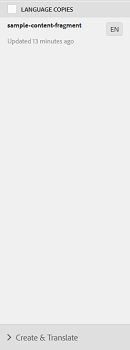

# Creazione di progetti di traduzione per i frammenti di contenuto {#creating-translation-projects-for-content-fragments}

Oltre alle risorse, Adobe Experience Manager (AEM) Assets supporta flussi di lavoro di copia lingua per [frammenti di contenuto](/help/assets/content-fragments/content-fragments.md) (comprese le varianti). Per eseguire flussi di lavoro di copia della lingua sui frammenti di contenuto non è richiesta alcuna ottimizzazione aggiuntiva. In ciascun flusso di lavoro, l’intero frammento di contenuto viene inviato per la traduzione.

I tipi di flussi di lavoro che è possibile eseguire sui frammenti di contenuto sono esattamente simili ai tipi di flusso di lavoro eseguiti per le risorse. Inoltre, le opzioni disponibili all’interno di ciascun tipo di flusso di lavoro corrispondono alle opzioni disponibili nei tipi di flussi di lavoro corrispondenti per le risorse.

Nei frammenti di contenuto è possibile eseguire i seguenti tipi di flussi di lavoro di copia lingua:

**Creare e tradurre**

In questo flusso di lavoro, i frammenti di contenuto da tradurre vengono copiati nella directory principale della lingua in cui si desidera tradurre. Inoltre, a seconda delle opzioni selezionate, nella console Progetti viene creato un progetto di traduzione per i frammenti di contenuto. A seconda delle impostazioni, il progetto di traduzione può essere avviato manualmente o può essere eseguito automaticamente non appena viene creato il progetto di traduzione.

**Aggiorna copie per lingua**

Quando il frammento di contenuto di origine viene aggiornato o modificato, è necessario tradurre nuovamente il frammento di contenuto specifico per lingua o lingua corrispondente. Il flusso di lavoro di copia della lingua di aggiornamento traduce un gruppo aggiuntivo di frammenti di contenuto e lo include in una copia della lingua per una lingua specifica. In questo caso, i frammenti di contenuto convertiti vengono aggiunti alla cartella di destinazione che contiene già frammenti di contenuto tradotti in precedenza.

## Crea e traduci flusso di lavoro {#create-and-translate-workflow}

Il flusso di lavoro Crea e traduci include le seguenti opzioni. Le fasi procedurali associate a ciascuna opzione sono simili a quelle associate all’opzione corrispondente per le attività.

* Crea solo struttura: Per le fasi della procedura, vedere [Creare una struttura solo per le risorse](translation-projects.md#create-structure-only).
* Crea un nuovo progetto di traduzione: Per le fasi della procedura, consultate [Creare un nuovo progetto di traduzione per le risorse](translation-projects.md#create-a-new-translation-project).
* Aggiungi al progetto di traduzione esistente: Per le fasi della procedura, vedere [Aggiungi al progetto di traduzione esistente per le risorse](translation-projects.md#add-to-existing-translation-project).

## Aggiorna flusso di lavoro copie lingua {#update-language-copies-workflow}

Il flusso di lavoro Copia lingua aggiornamento include le seguenti opzioni. Le fasi procedurali associate a ciascuna opzione sono simili a quelle associate all’opzione corrispondente per le attività.

* Crea un nuovo progetto di traduzione: Per le fasi della procedura, consultate [Creare un nuovo progetto di traduzione per le risorse](translation-projects.md#create-a-new-translation-project) (flusso di lavoro di aggiornamento).
* Aggiungi al progetto di traduzione esistente: Per le fasi della procedura, consultate [Aggiungi al progetto di traduzione esistente per le risorse](translation-projects.md#add-to-existing-translation-project) (flusso di lavoro di aggiornamento).

È inoltre possibile creare copie in lingua temporanea per i frammenti, in modo simile alle copie in lingua temporanea per le risorse. Per informazioni dettagliate, consultate [Creazione di copie in lingua temporanea per le risorse](translation-projects.md#creating-temporary-language-copies).

## Conversione di frammenti di supporti misti {#translating-mixed-media-fragments}

AEM consente di tradurre frammenti di contenuto che includono vari tipi di risorse multimediali e raccolte. Se traducete un frammento di contenuto che include risorse in linea, le copie tradotte di tali risorse vengono memorizzate nella directory principale della lingua di destinazione.

Se il frammento di contenuto include una raccolta, le risorse all&#39;interno della raccolta vengono convertite insieme al frammento di contenuto. Le copie tradotte delle risorse vengono memorizzate nella radice della lingua di destinazione appropriata in una posizione che corrisponde alla posizione fisica delle risorse di origine nella directory principale della lingua di origine.

Per poter tradurre frammenti di contenuto che includono supporti misti, modificate innanzitutto il framework di traduzione predefinito in modo da consentire la traduzione di risorse in linea e raccolte associate a frammenti di contenuto.

1. Tocca o fai clic sul logo AEM e passa a **[!UICONTROL Strumenti > Distribuzione > Cloud Services]**.
1. Individuare **[!UICONTROL Integrazione traduzione]** in **[!UICONTROL Adobe Marketing Cloud]**, quindi fare clic/toccare **[!UICONTROL Mostra configurazioni]**.

   

1. Nell&#39;elenco delle configurazioni disponibili, fare clic o toccare **[!UICONTROL Configurazione predefinita (configurazione integrazione conversione)]** per aprire la pagina **[!UICONTROL Configurazione predefinita]**.

   

1. Fare clic su **[!UICONTROL Modifica]** nella barra degli strumenti per visualizzare la finestra di dialogo **[!UICONTROL Configurazione traduzione]**.

   

1. Andate alla scheda **[!UICONTROL Risorse]** e scegliete **[!UICONTROL Risorse multimediali in linea e raccolte associate]** dall&#39;elenco **[!UICONTROL Traduci risorse frammento di contenuto]**. Tocca o fai clic su **[!UICONTROL OK]** per salvare le modifiche.

   

1. Aprire un frammento di contenuto dall’interno della cartella principale inglese.

   

1. Tocca o fai clic sull&#39;icona **[!UICONTROL Inserisci risorsa]**.

   

1. Inserire una risorsa nel frammento di contenuto.

   

1. Tocca o fai clic sull&#39;icona **[!UICONTROL Associa contenuto]**.

   

1. Tocca o fai clic su **[!UICONTROL Associa contenuto]**.

   

1. Selezionare una raccolta e includerla nel frammento di contenuto. Tocca o fai clic su **[!UICONTROL Salva]**.

   

1. Selezionate il frammento di contenuto e toccate o fate clic sull&#39;icona **[!UICONTROL GlobalNav]**.
1. Selezionare **[!UICONTROL References]** dal menu per visualizzare il riquadro **[!UICONTROL References]**.

   

1. Tocca o fai clic su **[!UICONTROL Copie lingua]** in **[!UICONTROL Copie]** per visualizzare le copie della lingua.

   

1. Toccate o fate clic su **[!UICONTROL Crea e traslazione]** nella parte inferiore del pannello per visualizzare la finestra di dialogo **[!UICONTROL Crea e traslazione]**.

   

1. Selezionare la lingua di destinazione dall&#39;elenco **[!UICONTROL Lingue di destinazione]**.

   

1. Selezionare il tipo di progetto di traduzione dall&#39;elenco **[!UICONTROL Progetto]**.

   

1. Specificate il titolo del progetto nella casella **[!UICONTROL Titolo progetto]**, quindi toccate o fate clic su **Crea**.

   

1. Andate alla console **[!UICONTROL Progetti]** e aprite la cartella del progetto per il progetto di traduzione creato.

   

1. Tocca o fai clic sulla sezione del progetto per aprire la pagina dei dettagli del progetto.

   

1. Dalla sezione Processo di traduzione, verificate il numero di risorse da convertire.
1. Dalla sezione **[!UICONTROL Processo di traduzione]**, avviate il processo di traduzione.

   

1. Fate clic sulle ellissi nella parte inferiore della sezione Processo di traduzione per visualizzare lo stato del processo di traduzione.

   

1. Tocca o fai clic sul frammento di contenuto per verificare il percorso delle risorse associate convertite.

   

1. Rivedete la copia della lingua per la raccolta nella console Raccolte.

   

   Si noti che solo il contenuto della raccolta è tradotto. La raccolta stessa non è tradotta.

1. Andate al percorso della risorsa associata convertita. Osservate che la risorsa convertita è memorizzata nella directory principale della lingua di destinazione.

   

1. Andate alle risorse all&#39;interno della raccolta che vengono convertite insieme al frammento di contenuto. Osservate che le copie tradotte delle risorse sono memorizzate nella radice della lingua di destinazione appropriata.

   

   >[!NOTE]
   >
   >Le procedure per aggiungere un frammento di contenuto a un progetto esistente o per eseguire flussi di lavoro di aggiornamento sono simili alle procedure corrispondenti per le risorse. Per indicazioni su tali procedure, fare riferimento alle procedure descritte per le attività.

