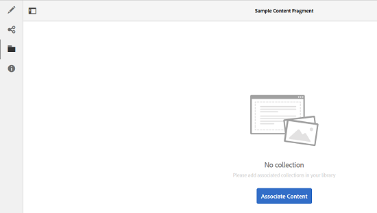

# Creazione di progetti di traduzione per frammenti di contenuto {#creating-translation-projects-for-content-fragments}

Oltre alle risorse, Adobe Experience Manager (AEM) Assets supporta i flussi di lavoro di copia lingua per [frammenti di contenuto](/help/assets/content-fragments/content-fragments.md) (comprese le varianti). Non è necessaria alcuna ottimizzazione aggiuntiva per eseguire flussi di lavoro di copia per lingua sui frammenti di contenuto. In ogni flusso di lavoro, l’intero frammento di contenuto viene inviato per la traduzione.

I tipi di flussi di lavoro che è possibile eseguire sui frammenti di contenuto sono esattamente simili ai tipi di flusso di lavoro eseguiti per le risorse. Inoltre, le opzioni disponibili all’interno di ciascun tipo di flusso di lavoro corrispondono a quelle disponibili nei corrispondenti tipi di flussi di lavoro per le risorse.

Sui frammenti di contenuto è possibile eseguire i seguenti tipi di flussi di lavoro per la copia in lingua:

**Crea e traduci**

In questo flusso di lavoro, i frammenti di contenuto da tradurre vengono copiati nella directory principale della lingua nella quale desideri tradurre. Inoltre, a seconda delle opzioni scelte, viene creato un progetto di traduzione per i frammenti di contenuto nella console Progetti. A seconda delle impostazioni, il progetto di traduzione può essere avviato manualmente o può essere eseguito automaticamente non appena viene creato.

**Aggiorna copie per lingua**

Quando il frammento di contenuto sorgente viene aggiornato o modificato, il frammento di contenuto corrispondente specifico per lingua/lingua richiede la riconversione. Il flusso di lavoro di aggiornamento delle copie per lingua traduce un ulteriore gruppo di frammenti di contenuto e lo include in una copia per lingua specifica per una specifica lingua. In questo caso, i frammenti di contenuto tradotti vengono aggiunti alla cartella di destinazione che contiene già frammenti di contenuto tradotti in precedenza.

## Creare e tradurre il flusso di lavoro {#create-and-translate-workflow}

Il flusso di lavoro Crea e traduci include le seguenti opzioni. Le fasi procedurali associate a ciascuna opzione sono simili a quelle associate all’opzione corrispondente per le risorse.

* Crea solo struttura: per i passaggi della procedura, vedi [Crea struttura solo per le risorse](translation-projects.md#create-structure-only).
* Creare un progetto di traduzione: per i passaggi della procedura, consulta [Creare un progetto di traduzione per le risorse](translation-projects.md#create-a-new-translation-project).
* Aggiungi al progetto di traduzione esistente: per i passaggi della procedura, consulta [Aggiungi al progetto di traduzione esistente per le risorse](translation-projects.md#add-to-existing-translation-project).

## Flusso di lavoro Aggiorna copie per lingua {#update-language-copies-workflow}

Il flusso di lavoro Aggiorna copie per lingua include le seguenti opzioni. Le fasi procedurali associate a ciascuna opzione sono simili a quelle associate all’opzione corrispondente per le risorse.

* Creare un progetto di traduzione: per i passaggi della procedura, consulta [Creare un progetto di traduzione per le risorse](translation-projects.md#create-a-new-translation-project) (aggiorna flusso di lavoro).
* Aggiungi al progetto di traduzione esistente: per i passaggi della procedura, consulta [Aggiungi al progetto di traduzione esistente per le risorse](translation-projects.md#add-to-existing-translation-project) (aggiorna flusso di lavoro).

Puoi anche creare copie temporanee per i frammenti in una lingua diversa, nello stesso modo in cui crei copie temporanee per le risorse. Per ulteriori informazioni, consulta [Creazione di copie in lingua temporanea delle risorse](translation-projects.md#creating-temporary-language-copies).

## Traduzione di frammenti multimediali diversi {#translating-mixed-media-fragments}

AEM consente di tradurre frammenti di contenuto che includono vari tipi di risorse multimediali e raccolte. Se traduci un frammento di contenuto che include risorse in linea, le copie tradotte di tali risorse vengono memorizzate nella directory principale della lingua di destinazione.

Se il frammento di contenuto include una raccolta, le risorse all’interno della raccolta vengono tradotte insieme al frammento di contenuto. Le copie tradotte delle risorse vengono memorizzate nella directory principale della lingua di destinazione appropriata in una posizione corrispondente alla posizione fisica delle risorse di origine nella directory principale della lingua di origine.

Per tradurre frammenti di contenuto che includono file multimediali diversi, modifica innanzitutto il framework di traduzione predefinito per abilitare la traduzione delle risorse e delle raccolte in linea associate ai frammenti di contenuto.

1. Tocca o fai clic sul logo AEM, quindi passa a **[!UICONTROL Strumenti > Implementazione > Cloud Service]**.
1. Individua **[!UICONTROL Integrazione traduzione]** in **[!UICONTROL Adobe Marketing Cloud]**, quindi tocca o fai clic su **[!UICONTROL Mostra configurazioni]**.

   

1. Dall’elenco delle configurazioni disponibili, tocca o fai clic su **[!UICONTROL Configurazione predefinita (configurazione dell’integrazione della traduzione)]** per aprire **[!UICONTROL Configurazione predefinita]** pagina.

   

1. Clic **[!UICONTROL Modifica]** dalla barra degli strumenti per visualizzare **[!UICONTROL Configurazione traduzione]** .

   

1. Accedi a **[!UICONTROL Risorse]** e scegliere **[!UICONTROL Risorse multimediali in linea e raccolte associate]** dal **[!UICONTROL Traduci risorse frammento di contenuto]** elenco. Tocca o fai clic su **[!UICONTROL OK]** per salvare le modifiche.

   

1. Dalla cartella principale inglese, apri un frammento di contenuto.

   

1. Tocca o fai clic sul pulsante **[!UICONTROL Inserisci risorsa]** icona.

   

1. Inserisci una risorsa nel frammento di contenuto.

   

1. Tocca o fai clic sul pulsante **[!UICONTROL Associa contenuto]** icona.

   

1. Tocca o fai clic su **[!UICONTROL Associa contenuto]**.

   

1. Seleziona una raccolta e includila nel frammento di contenuto. Tocca o fai clic su **[!UICONTROL Salva]**.

   

1. Seleziona il frammento di contenuto e tocca o fai clic sul pulsante **[!UICONTROL GlobalNav]** icona.
1. Seleziona **[!UICONTROL Riferimenti]** dal menu per visualizzare **[!UICONTROL Riferimenti]** riquadro.

   

1. Tocca o fai clic su **[!UICONTROL Copie per lingua]** in **[!UICONTROL Copie]** per visualizzare le copie per lingua.

   

1. Tocca o fai clic su **[!UICONTROL Crea e traduci]** dalla parte inferiore del pannello per visualizzare **[!UICONTROL Crea e traduci]** .

   

1. Seleziona la lingua di destinazione dalla **[!UICONTROL Lingue di destinazione]** elenco.

   

1. Seleziona il tipo di progetto di traduzione da **[!UICONTROL Progetto]** elenco.

   

1. Specifica il titolo del progetto in **[!UICONTROL Titolo progetto]** e quindi tocca o fai clic su **Crea**.

   

1. Accedi a **[!UICONTROL Progetti]** e apri la cartella del progetto di traduzione creato.

   

1. Tocca o fai clic sul riquadro del progetto per aprire la pagina dei dettagli del progetto.

   

1. Dal riquadro Lavoro di traduzione, verifica il numero di risorse da tradurre.
1. Dalla sezione **[!UICONTROL Lavoro di traduzione]** riquadro, avvia il processo di traduzione.

   

1. Fai clic sui puntini di sospensione nella parte inferiore del riquadro Lavoro di traduzione per visualizzare lo stato del lavoro di traduzione.

   

1. Tocca o fai clic sul frammento di contenuto per verificare il percorso delle risorse associate tradotte.

   

1. Esamina la copia per lingua della raccolta nella console Raccolte.

   

   Tieni presente che solo il contenuto della raccolta è tradotto. La raccolta stessa non è tradotta.

1. Passa al percorso della risorsa associata tradotta. Tieni presente che la risorsa tradotta viene memorizzata nella directory principale della lingua di destinazione.

   

1. Passa alle risorse all’interno della raccolta che vengono tradotte insieme al frammento di contenuto. Tieni presente che le copie tradotte delle risorse vengono memorizzate nella directory principale della lingua di destinazione appropriata.

   

   >[!NOTE]
   >
   >Le procedure per aggiungere un frammento di contenuto a un progetto esistente o per eseguire flussi di lavoro di aggiornamento sono simili alle procedure corrispondenti per le risorse. Per informazioni su queste procedure, vedere le procedure descritte per le risorse.
