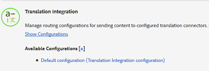
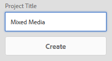

# Creazione di progetti di traduzione per frammenti di contenuto {#creating-translation-projects-for-content-fragments}

Oltre alle risorse, Adobe Experience Manager (AEM) Assets supporta i flussi di lavoro di copia per lingua per [frammenti di contenuto](/help/assets/content-fragments/content-fragments.md) (comprese le varianti). Non è necessaria alcuna ottimizzazione aggiuntiva per eseguire flussi di lavoro di copia della lingua sui frammenti di contenuto. In ogni flusso di lavoro, l’intero frammento di contenuto viene inviato per la traduzione.

I tipi di flussi di lavoro che puoi eseguire sui frammenti di contenuto sono esattamente simili ai tipi di flusso di lavoro che esegui per le risorse. Inoltre, le opzioni disponibili all’interno di ciascun tipo di flusso di lavoro corrispondono alle opzioni disponibili nei corrispondenti tipi di flussi di lavoro per le risorse.

Puoi eseguire i seguenti tipi di flussi di lavoro di copia per lingua sui frammenti di contenuto:

**Creare e tradurre**

In questo flusso di lavoro, i frammenti di contenuto da tradurre vengono copiati nella directory principale della lingua in cui si desidera tradurre. Inoltre, a seconda delle opzioni selezionate, nella console Progetti viene creato un progetto di traduzione per i frammenti di contenuto. A seconda delle impostazioni, il progetto di traduzione può essere avviato manualmente o può essere eseguito automaticamente non appena viene creato il progetto di traduzione.

**Aggiorna copie per lingua**

Quando il frammento di contenuto sorgente viene aggiornato o modificato, il frammento di contenuto specifico per le impostazioni internazionali o la lingua corrispondente deve essere riconvertito. Il flusso di lavoro per le copie in lingua aggiornata traduce un gruppo aggiuntivo di frammenti di contenuto e lo include in una copia in lingua per una specifica impostazione internazionale. In questo caso, i frammenti di contenuto tradotti vengono aggiunti alla cartella di destinazione che contiene già frammenti di contenuto tradotti in precedenza.

## Creare e tradurre un flusso di lavoro {#create-and-translate-workflow}

Il flusso di lavoro Crea e traduci include le seguenti opzioni. Le fasi procedurali associate a ciascuna opzione sono simili a quelle associate all’opzione corrispondente per le attività.

* Crea solo struttura: Per le fasi della procedura, consulta [Creare una struttura solo per le risorse](translation-projects.md#create-structure-only).
* Crea un nuovo progetto di traduzione: Per le fasi della procedura, consulta [Creare un nuovo progetto di traduzione per le risorse](translation-projects.md#create-a-new-translation-project).
* Aggiungi al progetto di traduzione esistente: Per le fasi della procedura, consulta [Aggiungi al progetto di traduzione esistente per le risorse](translation-projects.md#add-to-existing-translation-project).

## Aggiorna il flusso di lavoro delle copie in lingua {#update-language-copies-workflow}

Il flusso di lavoro per la copia in lingua di aggiornamento include le seguenti opzioni. Le fasi procedurali associate a ciascuna opzione sono simili a quelle associate all’opzione corrispondente per le attività.

* Crea un nuovo progetto di traduzione: Per le fasi della procedura, consulta [Creare un nuovo progetto di traduzione per le risorse](translation-projects.md#create-a-new-translation-project) (aggiornamento del flusso di lavoro).
* Aggiungi al progetto di traduzione esistente: Per le fasi della procedura, consulta [Aggiungi al progetto di traduzione esistente per le risorse](translation-projects.md#add-to-existing-translation-project) (aggiornamento del flusso di lavoro).

È inoltre possibile creare copie in lingua temporanea per i frammenti in modo analogo a come si creano copie temporanee per le risorse. Per informazioni dettagliate, consulta [Creazione di copie in lingua temporanea per le risorse](translation-projects.md#creating-temporary-language-copies).

## Traduzione di frammenti multimediali diversi {#translating-mixed-media-fragments}

AEM consente di tradurre frammenti di contenuto che includono vari tipi di risorse e raccolte multimediali. Se traduci un frammento di contenuto che include risorse in linea, le copie tradotte di tali risorse vengono memorizzate nella directory principale della lingua di destinazione.

Se il frammento di contenuto include una raccolta, le risorse all’interno della raccolta vengono tradotte insieme al frammento di contenuto. Le copie tradotte delle risorse vengono memorizzate nella directory principale della lingua di destinazione appropriata in una posizione che corrisponde alla posizione fisica delle risorse di origine nella directory principale della lingua di origine.

Per tradurre frammenti di contenuto che includono file multimediali diversi, modifica innanzitutto il framework di traduzione predefinito per abilitare la traduzione di risorse in linea e raccolte associate a frammenti di contenuto.

1. Tocca o fai clic sul logo AEM e passa a **[!UICONTROL Strumenti > Implementazione > Cloud Services]**.
1. Individua **[!UICONTROL Integrazione di traduzione]** in **[!UICONTROL Adobe Marketing Cloud]** e tocca o fai clic su **[!UICONTROL Mostra configurazioni]**.

   

1. Dall&#39;elenco delle configurazioni disponibili, tocca o fai clic su **[!UICONTROL Configurazione predefinita (configurazione integrazione traduzione)]** per aprire la pagina **[!UICONTROL Configurazione predefinita]**.

   

1. Fai clic su **[!UICONTROL Modifica]** nella barra degli strumenti per visualizzare la finestra di dialogo **[!UICONTROL Configurazione di traduzione]**.

   

1. Passa alla scheda **[!UICONTROL Risorse]** e scegli **[!UICONTROL Risorse multimediali in linea e raccolte associate]** dall’elenco **[!UICONTROL Traduci risorse frammento di contenuto]**. Tocca o fai clic su **[!UICONTROL OK]** per salvare le modifiche.

   

1. Apri un frammento di contenuto dall’interno della cartella principale inglese.

   

1. Tocca o fai clic sull’icona **[!UICONTROL Inserisci risorsa]** .

   

1. Inserisci una risorsa nel frammento di contenuto.

   

1. Tocca o fai clic sull’icona **[!UICONTROL Associa contenuto]** .

   

1. Tocca o fai clic su **[!UICONTROL Associa contenuto]**.

   

1. Seleziona una raccolta e includerla nel frammento di contenuto. Tocca o fai clic su **[!UICONTROL Salva]**.

   

1. Seleziona il frammento di contenuto e tocca o fai clic sull&#39;icona **[!UICONTROL GlobalNav]** .
1. Seleziona **[!UICONTROL Riferimenti]** dal menu per visualizzare il riquadro **[!UICONTROL Riferimenti]** .

   

1. Tocca o fai clic su **[!UICONTROL Copie per lingua]** in **[!UICONTROL Copie]** per visualizzare le copie per lingua.

   

1. Tocca o fai clic su **[!UICONTROL Crea e traduci]** nella parte inferiore del pannello per visualizzare la finestra di dialogo **[!UICONTROL Crea e traduci]** .

   

1. Seleziona la lingua di destinazione dall&#39;elenco **[!UICONTROL Lingue di destinazione]**.

   

1. Seleziona il tipo di progetto di traduzione dall&#39;elenco **[!UICONTROL Progetto]**.

   

1. Specifica il titolo del progetto nella casella **[!UICONTROL Titolo progetto]** , quindi tocca o fai clic su **Crea**.

   

1. Passa alla console **[!UICONTROL Progetti]** e apri la cartella del progetto di traduzione creato.

   

1. Tocca o fai clic sulla sezione del progetto per aprire la pagina dei dettagli del progetto.

   

1. Dalla sezione Processo di traduzione , verifica il numero di risorse da tradurre.
1. Dalla sezione **[!UICONTROL Processo di traduzione]** , avvia il lavoro di traduzione.

   

1. Fai clic sull’ellissi nella parte inferiore della sezione Processo di traduzione per visualizzare lo stato del lavoro di traduzione.

   

1. Tocca o fai clic sul frammento di contenuto per controllare il percorso delle risorse associate tradotte.

   

1. Nella console Raccolte , rivedi la copia per lingua della raccolta.

   

   Si noti che solo il contenuto della raccolta è tradotto. La raccolta stessa non è tradotta.

1. Passa al percorso della risorsa associata tradotta. Tieni presente che la risorsa tradotta è memorizzata nella directory principale della lingua di destinazione.

   

1. Passa alle risorse all’interno della raccolta che vengono tradotte insieme al frammento di contenuto. Tieni presente che le copie tradotte delle risorse sono memorizzate nella directory principale della lingua di destinazione appropriata.

   

   >[!NOTE]
   >
   >Le procedure per aggiungere un frammento di contenuto a un progetto esistente o per eseguire flussi di lavoro di aggiornamento sono simili alle procedure corrispondenti per le risorse. Per un orientamento su tali procedure, fare riferimento alle procedure descritte per le attività.

