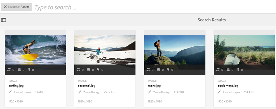
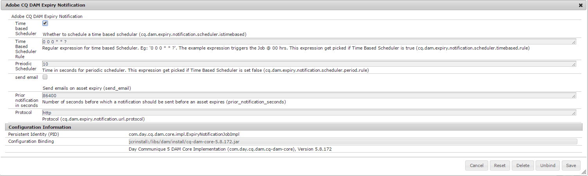

# Digital Rights Management for assets {#digital-rights-management-in-assets}

Le risorse digitali sono spesso associate a una licenza che specifica i termini e la durata dell&#39;utilizzo. Poiché [!DNL Adobe Experience Manager Assets] è completamente integrato con la [!DNL Experience Manager] piattaforma, potete gestire in modo efficiente le informazioni di scadenza delle risorse e gli stati delle risorse. Potete anche associare le informazioni sulla licenza alle risorse.

## Scadenza risorsa {#asset-expiration}

La scadenza delle risorse è un modo efficace per applicare i requisiti di licenza per le risorse. Garantisce che la risorsa pubblicata non venga pubblicata alla scadenza, evitando così la possibilità di eventuali violazioni della licenza. Un utente senza autorizzazioni di livello amministratore non può modificare, copiare, spostare, pubblicare e scaricare una risorsa scaduta.

Potete visualizzare lo stato di scadenza di una risorsa nella [!DNL Assets] console sia nelle viste scheda che in quelle elenco.

*Figura: Nella vista a schede, un flag sulla scheda indica la risorsa scaduta.*

*Figura: Nella vista a elenco, nella colonna[!UICONTROL Stato]viene visualizzato il banner[!UICONTROL Scaduto].*

Potete visualizzare lo stato di scadenza di una risorsa nella [!UICONTROL timeline] nella parte sinistra.

>[!NOTE]
>
>La data di scadenza di una risorsa viene visualizzata in modo diverso per gli utenti con orari diversi.

Potete inoltre visualizzare lo stato di scadenza delle risorse nella barra **[!UICONTROL Riferimenti]** . Gestisce gli stati di scadenza delle risorse e le relazioni tra le risorse composte e le risorse secondarie, le raccolte e i progetti a cui viene fatto riferimento.

1. Andate alla risorsa per la quale desiderate visualizzare il riferimento a pagine Web e risorse composte.
1. Selezionate la risorsa e fate clic sul [!DNL Experience Manager] logo.

1. Scegliete **[!UICONTROL Riferimenti]** dal menu.

   

   Per le risorse scadute, nella barra laterale Riferimenti viene visualizzato lo stato di scadenza **[!UICONTROL Risorsa scaduto]** nella parte superiore.

   

   Se la risorsa è scaduta, nella barra laterale Riferimenti viene visualizzato lo stato Risorse secondarie scadute per la **[!UICONTROL risorsa]**.

   

### Cercare le risorse scadute {#search-expired-assets}

Potete cercare le risorse scadute, comprese le risorse secondarie scadute, nel pannello Ricerca.

1. Nella [!DNL Assets] console, fate clic su **[!UICONTROL Cerca]** nella barra degli strumenti per visualizzare la casella di ricerca Omnico.

1. Con il cursore nella casella di ricerca Omnice, premere il tasto Invio per visualizzare la pagina dei risultati della ricerca.

   

1. Fate clic sul [!DNL Experience Manager] logo per visualizzare il pannello di ricerca.
1. Click the **[!UICONTROL Expiry Status]** option to expand it.

   

1. Scegliete **[!UICONTROL Scaduto]**. Le risorse scadute vengono visualizzate nei risultati della ricerca.

   

Quando scegliete l’opzione **[!UICONTROL Scaduto]** , nella [!DNL Assets] console vengono visualizzate solo le risorse e le risorse secondarie scadute a cui fanno riferimento le risorse composte. Le risorse composte che fanno riferimento a risorse secondarie scadute non vengono visualizzate subito dopo la scadenza delle risorse secondarie. Al contrario, vengono visualizzati dopo che [!DNL Experience Manager] rileva che fanno riferimento a risorse secondarie scadute al successivo esecuzione del programma.

Se modificate la data di scadenza di una risorsa pubblicata in una data precedente al ciclo di pianificazione corrente, la pianificazione rileva comunque la risorsa come una risorsa scaduta al successivo esecuzione e ne riflette lo stato di conseguenza.

Inoltre, se un problema o un errore impedisce al pianificatore di rilevare le risorse scadute nel ciclo corrente, il pianificatore riesamina tali risorse nel ciclo successivo e ne rileva lo stato scaduto.

To enable the [!DNL Assets] console to display the referencing compound assets along with the expired subassets, configure an **[!UICONTROL Adobe CQ DAM Expiry Notification]** workflow in [!DNL Experience Manager] Configuration Manager.

1. Aprite [!DNL Experience Manager] Configuration Manager.
1. Scegliete **[!UICONTROL notifica]** di scadenza Adobe CQ DAM. Per impostazione predefinita, è selezionata l’opzione Pianificatore **[!UICONTROL basato su]** tempo, che pianifica un processo per verificare in un momento specifico se una risorsa ha risorse secondarie scadute. Al termine del processo, le risorse con risorse secondarie scadute e risorse di riferimento vengono visualizzate come scadute nei risultati della ricerca.

   

1. Per eseguire il processo periodicamente, cancella il campo **[!UICONTROL Time Based Scheduler Rule (Regola modulo di pianificazione basato sul tempo)]** e modifica il tempo in secondi nel campo **[!UICONTROL Periodic Scheduler (Modulo di pianificazione periodica)]**. L’espressione di esempio ‘0 0 0 &amp;ast; &amp;ast; ?’ attiva il processo alle ore 00.
1. Selezionate **[!UICONTROL Invia e-mail]** per ricevere e-mail alla scadenza di una risorsa.

   >[!NOTE]
   >
   >Alla scadenza della risorsa viene inviato un messaggio e-mail solo al creatore della risorsa (la persona a cui viene caricata [!DNL Assets]). Consultate [come configurare la notifica](/help/sites-administering/notification.md) e-mail per ulteriori dettagli sulla configurazione delle notifiche e-mail a [!DNL Experience Manager] livello generale.

1. Nel campo Notifica **[!UICONTROL precedente in secondi]** , specificate l’ora in secondi prima della scadenza di una risorsa quando desiderate ricevere una notifica relativa alla scadenza. I creatori delle risorse ricevono un messaggio prima della scadenza della risorsa, in cui viene indicato che la risorsa sta per scadere dopo il tempo specificato. Dopo la scadenza della risorsa, riceverete un’altra notifica che conferma la scadenza. Inoltre, le risorse scadute sono disattivate.

1. Fai clic su **[!UICONTROL Salva]**.

## Stati risorsa {#asset-states}

La [!DNL Assets] console può visualizzare vari stati per le risorse. A seconda dello stato corrente di una particolare risorsa, nella vista a schede viene visualizzata un&#39;etichetta che ne descrive lo stato, ad esempio Scaduto, Pubblicato, Approvato, Rifiutato e così via.

1. Nell’interfaccia [!DNL Assets] utente, selezionate una risorsa.

   

1. Click **[!UICONTROL Publish]** from the toolbar. Se nella barra degli strumenti non è disponibile l’opzione **Pubblica** , fate clic su **[!UICONTROL Altro]** sulla barra degli strumenti e individuate l’opzione **** Pubblica  pubblicazione.
1. Scegliete **[!UICONTROL Pubblica]** dal menu, quindi chiudete la finestra di dialogo di conferma.
1. Esci dalla modalità di selezione. Lo stato di pubblicazione della risorsa viene visualizzato nella parte inferiore della miniatura della risorsa nella vista a schede. Nella vista a elenco, la colonna Pubblicato mostra l’ora in cui la risorsa è stata pubblicata.

   

1. Per visualizzare la pagina dei dettagli della risorsa, nell’ [!DNL Assets] interfaccia selezionate una risorsa e fate clic su **[!UICONTROL Proprietà]** per .

1. Nella scheda [!UICONTROL Avanzate] , imposta una data di scadenza per la risorsa dal campo **[!UICONTROL Scadenza]** .

   

   *Figura:[!UICONTROL scheda Avanzate]nella pagina[!UICONTROL Proprietà]risorsa per impostare la scadenza della risorsa.*

1. Fate clic su **[!UICONTROL Salva]** , quindi su **[!UICONTROL Chiudi]** per visualizzare la console Risorse.
1. Lo stato di pubblicazione della risorsa indica uno stato scaduto nella parte inferiore della miniatura della risorsa nella vista a schede. Nella vista a elenco, lo stato della risorsa viene visualizzato come **[!UICONTROL Scaduto]**.

   

1. Nella [!DNL Assets] console, selezionate una cartella e create un’attività di revisione sulla cartella.
1. Rivedete e approvate/rifiutate le risorse nell’attività di revisione e fate clic su **[!UICONTROL Completato]**.
1. Passate alla cartella per la quale avete creato l&#39;attività di revisione. Lo stato delle risorse approvate/rifiutate viene visualizzato nella parte inferiore della vista a schede. Nella vista a elenco, gli stati di approvazione e scadenza sono visualizzati nelle colonne appropriate.

   

1. Per cercare le risorse in base al loro stato, fate clic su **[!UICONTROL Cerca]**  di ricerca per visualizzare la barra di ricerca Omnico.
1. Premere Invio e fare clic [!DNL Experience Manager] per visualizzare il pannello di ricerca.
1. In the search panel, click **[!UICONTROL Publish Status]** and select **[!UICONTROL Published]** to search for published assets in [!DNL Assets].

   

1. Click **[!UICONTROL Approval Status]** and click the appropriate option to search for approved or rejected assets.

   

1. Per cercare le risorse in base al loro stato di scadenza, seleziona **[!UICONTROL Stato scadenza]** nel pannello di ricerca e scegli l’opzione appropriata.

   

1. Potete anche cercare le risorse in base a una combinazione di stati in vari facet di ricerca. Ad esempio, potete cercare le risorse pubblicate che sono state approvate in un’attività di revisione e che non sono ancora scadute selezionando le opzioni appropriate nei facet di ricerca.

   

## Digital Rights Management in [!DNL Assets] {#digital-rights-management-in-assets-1}

Questa funzione applica l’accettazione del contratto di licenza prima che possiate scaricare una risorsa con licenza da [!DNL Adobe Experience Manager Assets].

Se selezionate una risorsa protetta e fate clic su **[!UICONTROL Scarica]**, verrete reindirizzati a una pagina di licenza per accettare il contratto di licenza. Se non accettate il contratto di licenza, l&#39;opzione **[!UICONTROL Download]** non è disponibile.

Se la selezione contiene più risorse protette, selezionate una risorsa alla volta, accettate il contratto di licenza e continuate a scaricare la risorsa.

Una risorsa è considerata protetta se una delle seguenti condizioni è soddisfatta:

* La proprietà dei metadati della risorsa `xmpRights:WebStatement` indica il percorso della pagina che contiene il contratto di licenza per la risorsa.
* Il valore della proprietà di metadati della risorsa `adobe_dam:restrictions` è un codice HTML non elaborato che specifica il contratto di licenza.

>[!NOTE]
>
>Il percorso `/etc/dam/drm/licenses` utilizzato per memorizzare le licenze nelle versioni precedenti di [!DNL Experience Manager] è obsoleto.
>
>Se create o modificate le pagine delle licenze o le rimuovete dalle [!DNL Experience Manager] versioni precedenti,  Adobe consiglia di memorizzarle in `/apps/settings/dam/drm/licenses` o `/conf/&ast;/settings/dam/drm/licenses`.

### Scaricare risorse protette da DRM {#downloading-drm-assets}

1. Nella vista a schede, selezionate le risorse da scaricare e fate clic su **[!UICONTROL Scarica]**.
1. Nella pagina **[!UICONTROL Gestione copyright]**, seleziona dall’elenco la risorsa da scaricare.
1. Nel riquadro [!UICONTROL Licenza] , scegliete **[!UICONTROL Accetto]**. Accanto alla risorsa viene visualizzato un segno di spunta. Fate clic sull&#39;opzione **[!UICONTROL Scarica]** .

   >[!NOTE]
   >
   >The **[!UICONTROL Download]** option is enabled only when you choose to agree to the license agreement for a protected asset. However, if your selection comprises both protected and unprotected assets, only the protected assets are listed in the pane and the **[!UICONTROL Download]** option is enabled to download the unprotected assets. Per accettare in contemporanea i contratti di licenza per più risorse protette, seleziona le risorse dall’elenco e fai clic su **[!UICONTROL Accetto]**.

   

1. Nella finestra di dialogo, fate clic su **[!UICONTROL Scarica]** per scaricare la risorsa o le relative rappresentazioni.
