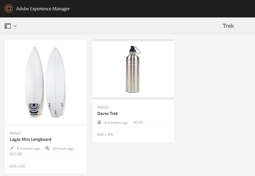
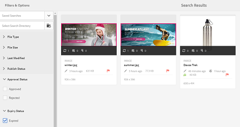

# Digital Rights Management per le risorse {#digital-rights-management-in-assets}

| Versione | Collegamento articolo |
| -------- | ---------------------------- |
| AEM as a Cloud Service | [Fai clic qui](https://experienceleague.adobe.com/docs/experience-manager-cloud-service/content/assets/manage/drm.html?lang=it) |
| AEM 6.5 | Questo articolo |

Le risorse digitali sono spesso associate a una licenza che specifica i termini e la durata di utilizzo. Poiché [!DNL Adobe Experience Manager Assets] è completamente integrato con la piattaforma [!DNL Experience Manager], è possibile gestire in modo efficiente le informazioni sulla scadenza delle risorse e gli stati delle risorse. È inoltre possibile associare le informazioni sulle licenze alle risorse.

## Scadenza risorsa {#asset-expiration}

La scadenza delle risorse è un modo efficace per applicare i requisiti di licenza per le risorse. In questo modo la risorsa pubblicata non verrà più pubblicata alla scadenza, evitando possibili violazioni della licenza. Un utente senza autorizzazioni di amministratore non può modificare, copiare, spostare, pubblicare e scaricare una risorsa scaduta.

È possibile visualizzare lo stato di scadenza di una risorsa nella console [!DNL Assets] sia nella vista a schede che in quella a elenco.

*Figura: nella vista a elenco, la colonna [!UICONTROL Stato] mostra il banner [!UICONTROL Scaduto].*

Puoi visualizzare lo stato di scadenza di una risorsa nella [!UICONTROL Timeline] nella barra a sinistra.

>[!NOTE]
>
>La data di scadenza di una risorsa viene visualizzata in modo diverso per gli utenti con fusi orari diversi.

Puoi anche visualizzare lo stato di scadenza delle risorse nella barra **[!UICONTROL Riferimenti]**. Gestisce gli stati di scadenza delle risorse e le relazioni tra le risorse composte e le risorse secondarie, le raccolte e i progetti di riferimento.

1. Passa alla risorsa per la quale desideri visualizzare le pagine web di riferimento e le risorse composte.
1. Seleziona la risorsa e apri **[!UICONTROL Riferimenti]** nella barra a sinistra. Per le risorse scadute, nella barra [!UICONTROL Riferimenti] viene visualizzato lo stato di scadenza **[!UICONTROL La risorsa è scaduta]** nella parte superiore.

   

   Se la risorsa è scaduta, nella barra [!UICONTROL Riferimenti] viene visualizzato lo stato **[!UICONTROL La risorsa è scaduta Sub-Assets]**.

   

### Cercare risorse scadute {#search-expired-assets}

Puoi cercare le risorse scadute, comprese le risorse secondarie scadute, nel pannello Ricerca.

1. Nella console [!DNL Assets], fare clic su **[!UICONTROL Cerca]** nella barra degli strumenti per visualizzare la casella Omnisearch.

1. Con il cursore nella casella Omnisearch, selezionare il tasto `Enter` per visualizzare la pagina dei risultati della ricerca.
1. Apri il pannello di ricerca nella barra a sinistra. Fai clic sull&#39;opzione **[!UICONTROL Stato scadenza]** per espanderla.

   

1. Scegli **[!UICONTROL Scaduto]**. Dopo aver filtrato i risultati della ricerca, vengono visualizzate solo le risorse scadute.

Quando scegli l&#39;opzione **[!UICONTROL Scaduto]**, nella console [!DNL Assets] vengono visualizzate solo le risorse e le risorse secondarie scadute a cui fanno riferimento le risorse composte. Le risorse composte che fanno riferimento a risorse secondarie scadute non vengono visualizzate immediatamente dopo la scadenza delle risorse secondarie. Vengono invece visualizzati dopo che [!DNL Experience Manager] ha rilevato che fanno riferimento a risorse secondarie scadute alla successiva esecuzione del modulo di pianificazione.

Se modifichi la data di scadenza di una risorsa pubblicata impostandola su una data precedente al ciclo di pianificazione corrente, la pianificazione rileva comunque la risorsa come scaduta alla successiva esecuzione e ne riflette lo stato di conseguenza.

Inoltre, se un problema o un errore impedisce al modulo di pianificazione di rilevare le risorse scadute nel ciclo corrente, il modulo di pianificazione le esamina nuovamente nel ciclo successivo e ne rileva lo stato di scadenza.

Per abilitare la console [!DNL Assets] per visualizzare le risorse composte di riferimento insieme alle risorse secondarie scadute, configura un flusso di lavoro **[!UICONTROL Adobe CQ DAM Expiry Notification]** in [!DNL Experience Manager] Configuration Manager.

1. Aprire [!DNL Experience Manager] Configuration Manager.
1. Scegli **[!UICONTROL Notifica di scadenza DAM Adobe CQ]**. Per impostazione predefinita, è selezionata l&#39;utilità di pianificazione **[!UICONTROL Time based]**, che pianifica un processo per verificare in un momento specifico se una risorsa è scaduta o meno. Al termine del processo, le risorse con risorse secondarie scadute e le risorse di riferimento vengono visualizzate come scadute nei risultati della ricerca.

1. Per eseguire il processo periodicamente, cancella il campo **[!UICONTROL Time Based Scheduler Rule (Regola modulo di pianificazione basato sul tempo)]** e modifica il tempo in secondi nel campo **[!UICONTROL Periodic Scheduler (Modulo di pianificazione periodica)]**. L&#39;espressione di esempio `0 0 0 * * ?`, ad esempio, attiva il processo alle ore 00.
1. Seleziona **[!UICONTROL Invia e-mail]** per ricevere e-mail alla scadenza di una risorsa.

   >[!NOTE]
   >
   >Solo il creatore della risorsa (la persona che carica una particolare risorsa in [!DNL Assets]) riceve un&#39;e-mail alla scadenza della risorsa. Per ulteriori informazioni sulla configurazione delle notifiche e-mail a livello generale di [!DNL Experience Manager], consulta [come configurare le notifiche e-mail](/help/sites-administering/notification.md).

1. Nel campo **[!UICONTROL Notifica preventiva in secondi]**, specifica il tempo in secondi precedente alla scadenza di una risorsa per ricevere una notifica relativa alla scadenza. I creatori delle risorse ricevono un messaggio prima della scadenza della risorsa che informa che la risorsa sta per scadere dopo il tempo specificato. Dopo la scadenza della risorsa, ricevi un’altra notifica che conferma la scadenza. Inoltre, le risorse scadute vengono disattivate.

1. Fai clic su **[!UICONTROL Salva]**.

## Stati risorse {#asset-states}

La console [!DNL Assets] può visualizzare vari stati per le risorse. A seconda dello stato corrente di una particolare risorsa, la relativa vista a schede mostra un’etichetta che ne descrive lo stato, ad esempio Scaduto, Pubblicato, Approvato, Rifiutato e così via.

1. Nell&#39;interfaccia utente [!DNL Assets], seleziona una risorsa.
1. Fare clic su **[!UICONTROL Publish]** nella barra degli strumenti. Se non trovi **Publish** sulla barra degli strumenti, fai clic su **[!UICONTROL Altro]** sulla barra degli strumenti e individua l&#39;opzione **[!UICONTROL Publish]** .
1. Scegliere **[!UICONTROL Publish]** dal menu, quindi chiudere la finestra di dialogo di conferma.
1. Esci dalla modalità di selezione. Lo stato di pubblicazione della risorsa viene visualizzato nella parte inferiore della miniatura nella vista a schede. Nella vista a elenco, la colonna Pubblicato mostra l’ora in cui la risorsa è stata pubblicata.

   

1. Per visualizzare la pagina dei dettagli della risorsa, nell&#39;interfaccia [!DNL Assets] selezionare una risorsa e fare clic su **[!UICONTROL Proprietà]** .

1. Nella scheda [!UICONTROL Avanzate], imposta una data di scadenza per la risorsa dal campo **[!UICONTROL Scade]**.

   

   *Figura: [!UICONTROL Scheda Avanzate] nella pagina delle [!UICONTROL Proprietà] della risorsa per impostare la scadenza della risorsa.*

1. Fai clic su **[!UICONTROL Salva]**, quindi su **[!UICONTROL Chiudi]** per visualizzare la console Risorse.
1. Lo stato di pubblicazione della risorsa indica uno stato scaduto nella parte inferiore della miniatura della risorsa nella vista a schede. Nella vista a elenco, lo stato della risorsa è **[!UICONTROL Scaduto]**.

   

1. Nella console [!DNL Assets], selezionare una cartella e creare un&#39;attività di revisione sulla cartella.
1. Rivedi e approva/rifiuta le risorse nell&#39;attività di revisione e fai clic su **[!UICONTROL Completa]**.
1. Passare alla cartella per la quale è stata creata l&#39;attività di revisione. Lo stato delle risorse approvate/rifiutate viene visualizzato nella parte inferiore della vista a schede. Nella vista a elenco, gli stati di approvazione e scadenza vengono visualizzati nelle colonne appropriate.

   

1. Per cercare le risorse in base al loro stato, fai clic su **[!UICONTROL Cerca]**  per visualizzare la barra di Omnisearch.
1. Selezionare `Return` e fare clic su [!DNL Experience Manager] per visualizzare il pannello di ricerca.
1. Nel pannello di ricerca, fai clic su **[!UICONTROL Stato Publish]** e seleziona **[!UICONTROL Pubblicato]** per cercare le risorse pubblicate in [!DNL Assets].

   

1. Fare clic su **[!UICONTROL Stato approvazione]** e selezionare l&#39;opzione appropriata per cercare le risorse approvate o rifiutate.

   

1. Per cercare le risorse in base al loro stato di scadenza, seleziona **[!UICONTROL Stato scadenza]** nel pannello di ricerca e scegli l’opzione appropriata.

   

1. Puoi anche cercare le risorse in base a una combinazione di stati in vari facet di ricerca. Ad esempio, per cercare le risorse pubblicate che sono state approvate in un’attività di revisione e non sono ancora scadute, seleziona le opzioni appropriate nei facet di ricerca.

   

## Digital Rights Management in [!DNL Assets] {#digital-rights-management-in-assets-1}

Questa funzione applica l&#39;accettazione del contratto di licenza prima di scaricare una risorsa concessa in licenza da [!DNL Adobe Experience Manager Assets].

Se selezioni una risorsa protetta e fai clic su **[!UICONTROL Scarica]**, verrai reindirizzato a una pagina di licenza per accettare il contratto di licenza. Se non si accetta il contratto di licenza, l&#39;opzione **[!UICONTROL Scarica]** non è disponibile.

Se la selezione contiene più risorse protette, seleziona una risorsa alla volta, accetta il contratto di licenza e procedi al download della risorsa.

Un bene è considerato protetto se è soddisfatta una delle seguenti condizioni:

* La proprietà dei metadati della risorsa `xmpRights:WebStatement` punta al percorso della pagina che contiene il contratto di licenza per la risorsa.
* Il valore della proprietà dei metadati della risorsa `adobe_dam:restrictions` è un HTML non elaborato che specifica il contratto di licenza.

>[!NOTE]
>
>Il percorso `/etc/dam/drm/licenses` utilizzato per l&#39;archiviazione delle licenze nelle versioni precedenti di [!DNL Experience Manager] è obsoleto.
>
>Se si creano o si modificano le pagine delle licenze o si eseguono il port dalle versioni precedenti di [!DNL Experience Manager], l&#39;Adobe consiglia di memorizzarle in `/apps/settings/dam/drm/licenses` o `/conf/&ast;/settings/dam/drm/licenses`.

### Scaricare risorse protette da DRM {#downloading-drm-assets}

1. Nella vista a schede, seleziona le risorse da scaricare e fai clic su **[!UICONTROL Scarica]**.
1. Nella pagina **[!UICONTROL Gestione copyright]**, seleziona dall’elenco la risorsa da scaricare.
1. Nel riquadro [!UICONTROL Licenza], scegliere **[!UICONTROL Accetto]**. Accanto alla risorsa viene visualizzato un segno di spunta. Fai clic sull&#39;opzione **[!UICONTROL Scarica]**.

   >[!NOTE]
   >
   >L&#39;opzione **[!UICONTROL Scarica]** è abilitata solo quando si sceglie di accettare il contratto di licenza per una risorsa protetta. Tuttavia, se la selezione include sia risorse protette che non protette, nel riquadro vengono elencate solo le risorse protette e l&#39;opzione **[!UICONTROL Scarica]** è abilitata per scaricare le risorse non protette. Per accettare in contemporanea i contratti di licenza per più risorse protette, seleziona le risorse dall’elenco e fai clic su **[!UICONTROL Accetto]**.

   

1. Nella finestra di dialogo, fai clic su **[!UICONTROL Scarica]** per scaricare la risorsa o le relative rappresentazioni.
