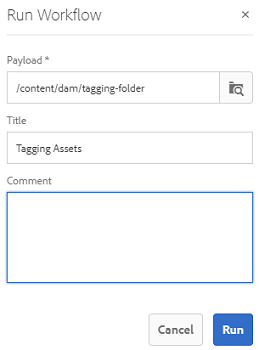

# Comprendere, applicare e curare i tag avanzati {#enhanced-smart-tags}

Le organizzazioni che si occupano di risorse digitali utilizzano sempre di più il vocabolario controllato dalla tassonomia nei metadati delle risorse. Comprende in sostanza un elenco di parole chiave utilizzate comunemente da dipendenti, partner e clienti per fare riferimento e cercare risorse digitali di una determinata classe. L’assegnazione di tag alle risorse con un vocabolario controllato dalla tassonomia garantisce che le risorse vengano identificate e recuperate con facilità.

Rispetto ai vocabolari di lingua naturale, l’assegnazione di tag alle risorse digitali in base alla tassonomia aziendale consente di allinearle al business di un’azienda e garantisce che le risorse più rilevanti vengano visualizzate nelle ricerche.

Ad esempio, un produttore di auto può assegnare tag alle immagini di un&#39;auto con nomi di modelli in modo che vengano visualizzate solo immagini rilevanti quando vengono ricercate immagini di vari modelli per progettare una campagna promozionale.

Affinché Smart Content Service possa applicare i tag giusti, è necessario addestrarlo per riconoscere la tassonomia. Per istruire il servizio, curate innanzitutto una serie di risorse e tag che meglio descrivano tali risorse. Applicate questi tag alle risorse ed eseguite un flusso di lavoro di formazione per facilitare l’apprendimento del servizio.

Una volta che un tag è stato preparato e pronto, il servizio ora può applicare questi tag alle risorse tramite un flusso di lavoro per l’assegnazione di tag.

In background, Smart Content Service utilizza  framework Adobe Sensei AI per formare il proprio algoritmo di riconoscimento delle immagini sulla struttura dei tag e la tassonomia aziendale. Questa funzione di content intelligence viene quindi utilizzata per applicare tag rilevanti a un altro set di risorse.

Smart Content Service è un servizio cloud ospitato su [!DNL Adobe Developer Console]. Per utilizzarlo in [!DNL Adobe Experience Manager], l&#39;amministratore di sistema deve integrare la distribuzione [!DNL Experience Manager] con [!DNL Adobe Developer Console].

Di seguito sono riportati i passaggi principali per utilizzare Smart Content Service:

* Onboarding
* Verifica di risorse e tag (definizione tassonomia)
* Formazione di Smart Content Service
* Assegnazione tag automatica

## Prerequisiti e formati supportati {#prerequisites}

Prima di poter utilizzare il Servizio di contenuti avanzati, verifica quanto segue per creare un’integrazione su [!DNL Adobe Developer Console]:

* Disponi di un account Adobe ID con privilegi di amministratore dell’organizzazione.
* Il Servizio di contenuti avanzati è abilitato per la tua organizzazione.
* È possibile aggiungere il pacchetto di base Smart Content Services solo a una distribuzione in cui sono stati concessi in licenza i componenti aggiuntivi [!DNL Adobe Experience Manager Sites] e [!DNL Assets].

I tag avanzati vengono applicati solo alle risorse con i seguenti tipi MIME:

* image/jpeg
* image/tiff
* image/png
* image/bmp
* image/gif
* image/pjpeg
* image/x-portatili-anymap
* image/x-portatili-bitmap
* immagine/x-portabile-grigio
* image/x-portatile-pixmap
* image/x-rgb
* image/x-xbitmap
* image/x-xpixmap
* image/x-icon
* image/photoshop
* image/x-photoshop
* image/psd
* image/vnd.adobe.photoshop

L&#39;assegnazione di tag avanzati alle rappresentazioni di risorse è supportata solo per i seguenti tipi MIME:

* image/jpeg
* image/pjpeg
* image/png

## Onboarding {#onboarding}

Il Servizio di contenuti avanzati è acquistabile come componente aggiuntivo per [!DNL Experience Manager]. Dopo l’acquisto, viene inviata un’e-mail all’amministratore dell’organizzazione con un collegamento ad [!DNL Adobe I/O].

L&#39;amministratore può seguire il collegamento per integrare Smart Content Service con [!DNL Experience Manager]. Per integrare il servizio con [!DNL Experience Manager Assets], vedere [Configurare i tag avanzati](config-smart-tagging.md).

Il processo di registrazione è completo quando l&#39;amministratore configura il servizio e aggiunge utenti in [!DNL Experience Manager].

>[!NOTE]
>
>Se utilizzate [!DNL Experience Manager] 6.3 o una versione precedente e necessitate di un servizio di tag per le risorse, consultate [Smart Tags](https://helpx.adobe.com/experience-manager/6-3/assets/using/touch-ui-smart-tags.html). I tag avanzati non utilizzano le funzionalità AI più recenti e sono quindi meno precisi del servizio avanzato di smart tag.

## Rivedere risorse e tag {#reviewing-assets-and-tags}

Dopo essere stati a bordo, la prima cosa da fare è identificare un insieme di tag che meglio descrivono queste immagini nel contesto della vostra attività.

Quindi, rivedete le immagini per identificare un set di immagini che meglio rappresentano il vostro prodotto per un particolare requisito aziendale. Assicurati che le risorse del set selezionato siano conformi alle [linee guida di formazione per Smart Content Service](/help/assets/config-smart-tagging.md#training-the-smart-content-service).

Aggiungete le risorse a una cartella e applicate i tag a ciascuna risorsa dalla pagina delle proprietà. Quindi, eseguite il flusso di lavoro di formazione su questa cartella. La serie di risorse selezionata consente a Smart Content Service di formare in modo efficace più risorse utilizzando le definizioni della tassonomia.

>[!NOTE]
>
>1. La formazione è un processo irrevocabile.  Adobe consiglia di rivedere i tag nel set di risorse curato prima di addestrare Smart Content Service sui tag.
>1. Prima di iniziare la formazione per un tag, consultate [Linee guida per la formazione sui servizi di contenuto avanzato](/help/assets/config-smart-tagging.md#training-the-smart-content-service).
>1. Quando formate Smart Content Service per la prima volta,  Adobe consiglia di addestrarlo su almeno due tag distinti.

## Comprendere i risultati della ricerca [!DNL Experience Manager] con gli smart tag {#understandsearch}

Per impostazione predefinita, la ricerca [!DNL Experience Manager] combina i termini di ricerca con una clausola `AND`. L&#39;utilizzo di smart tag non modifica questo comportamento predefinito. L&#39;utilizzo di smart tag aggiunge una clausola `OR` aggiuntiva per individuare i termini di ricerca relativi agli smart tag. Ad esempio, è consigliabile cercare `woman running`. Per impostazione predefinita, le risorse con una semplice parola chiave `woman` o semplicemente `running` nei metadati non vengono visualizzate nei risultati di ricerca. Tuttavia, in una query di ricerca di questo tipo viene visualizzata una risorsa con tag `woman` o `running` che utilizza gli smart tag. Quindi i risultati della ricerca sono una combinazione di:

* Risorse con `woman` e `running` parole chiave nei metadati.

* Risorse con tag avanzati a una delle parole chiave.

I risultati della ricerca che corrispondono a tutti i termini di ricerca nei campi di metadati vengono visualizzati per primi, seguiti dai risultati della ricerca che corrispondono a uno qualsiasi dei termini di ricerca negli smart tag. Nell&#39;esempio precedente, l&#39;ordine approssimativo di visualizzazione dei risultati della ricerca è:

1. Corrisponde a `woman running` nei vari campi di metadati.
1. Corrisponde a `woman running` negli smart tag.
1. Corrisponde a `woman` o `running` negli smart tag.

>[!CAUTION]
>
>Se l&#39;indicizzazione Lucene viene effettuata su [!DNL Adobe Experience Manager], la ricerca basata sugli smart tag non funziona come previsto.

## Assegnare automaticamente tag alle risorse {#tagging-assets-automatically}

Dopo aver creato Smart Content Service, potete attivare il flusso di lavoro dei tag per applicare automaticamente i tag appropriati a un altro set di risorse simili.

Potete eseguire il flusso di lavoro dei tag periodicamente o quando necessario.

>[!NOTE]
>
>Il flusso di lavoro dei tag viene eseguito sia sulle risorse che sulle cartelle.

### Assegnazione periodica di tag {#periodic-tagging}

Potete abilitare Smart Content Service per assegnare tag periodici alle risorse all’interno di una cartella. Aprite la pagina delle proprietà della cartella di risorse, selezionate **[!UICONTROL Abilita tag avanzati]** nella scheda **[!UICONTROL Dettagli]** e salvate le modifiche.

Quando questa opzione è selezionata per una cartella, Smart Content Service assegna automaticamente i tag alle risorse all’interno della cartella. Per impostazione predefinita, il flusso di lavoro dei tag viene eseguito ogni giorno alle 12:00.

### Assegnazione tag su richiesta {#on-demand-tagging}

Potete attivare il flusso di lavoro dei tag dalla console del flusso di lavoro o dalla timeline per assegnare tag istantanei alle risorse.

>[!NOTE]
>
>Se eseguite il flusso di lavoro dei tag dalla timeline, potete applicare tag a un massimo di 15 risorse alla volta.

#### Assegnare tag alle risorse dalla console del flusso di lavoro {#tagging-assets-from-the-workflow-console}

1. Nell&#39;interfaccia [!DNL Experience Manager], passare a **[!UICONTROL Strumenti]** > **[!UICONTROL Workflow]** > **[!UICONTROL Modelli]**.
1. Dalla pagina **[!UICONTROL Modelli di workflow]**, selezionare il flusso di lavoro **[!UICONTROL Risorse tag avanzati DAM]**, quindi fare clic su **[!UICONTROL Avvia flusso di lavoro]** dalla barra degli strumenti.

   

1. Nella finestra di dialogo **[!UICONTROL Esegui flusso di lavoro]**, individuate la cartella payload contenente le risorse sulle quali desiderate applicare automaticamente i tag.
1. Specificate un titolo per il flusso di lavoro e un commento facoltativo. Fare clic su **[!UICONTROL Esegui]**.

   

   Andate alla cartella delle risorse e controllate i tag per verificare se Smart Content Service ha applicato correttamente i tag alle risorse.

#### Assegnare tag alle risorse dalla timeline {#tagging-assets-from-the-timeline}

1. Dall&#39;interfaccia utente di [!DNL Assets], selezionate la cartella contenente le risorse o risorse specifiche a cui desiderate applicare gli smart tag.
1. Dall&#39;angolo superiore sinistro, aprire la **[!UICONTROL Timeline]**.
1. Aprite le azioni nella parte inferiore della barra laterale sinistra e fate clic su **[!UICONTROL Avvia flusso di lavoro]**.

   

1. Selezionate il flusso di lavoro **[!UICONTROL DAM Smart Tag Assets]** e specificate un titolo per il flusso di lavoro.
1. Fare clic su **[!UICONTROL Start]**. Il flusso di lavoro applica i tag alle risorse. Andate alla cartella delle risorse e controllate i tag per verificare se Smart Content Service ha applicato correttamente i tag alle risorse.

>[!NOTE]
>
>Nei successivi cicli di assegnazione dei tag, solo le risorse modificate vengono nuovamente etichettate con tag di nuova formazione. Tuttavia, vengono assegnati tag anche alle risorse inalterate se lo spazio tra l’ultimo ciclo di tag e quello corrente per il flusso di lavoro dei tag supera le 24 ore. Per flussi di lavoro con tag periodici, le risorse inalterate vengono contrassegnate con tag quando l’intervallo di tempo supera i sei mesi.

## Cura o moderazione degli smart tag applicati {#manage-smart-tags}

Potete curare i tag avanzati per rimuovere eventuali tag non accurati eventualmente assegnati alle immagini del vostro marchio, in modo da visualizzare solo i tag più rilevanti.

La moderazione degli smart tag consente inoltre di perfezionare le ricerche basate sui tag per le immagini, assicurando che l’immagine venga visualizzata nei risultati di ricerca per i tag più rilevanti. In sostanza, elimina la possibilità che immagini non collegate vengano visualizzate nei risultati della ricerca.

Potete anche assegnare un rango più alto a un tag per aumentarne la rilevanza rispetto a un’immagine. La promozione di un tag per un’immagine aumenta le probabilità che l’immagine venga visualizzata nei risultati di ricerca quando viene eseguita una ricerca in base al tag specifico.

1. Nella casella di ricerca Omnico, cercate le risorse in base a un tag.
1.  Inspect i risultati della ricerca per identificare un’immagine che non si trova rilevante ai fini della ricerca.
1. Selezionate l&#39;immagine e fate clic su **[!UICONTROL Gestisci tag]** nella barra degli strumenti.
1. Dalla pagina **[!UICONTROL Gestisci tag]**, ispezionare i tag. Se non desiderate che l&#39;immagine venga cercata in base a un tag specifico, selezionate il tag e fate clic su **[!UICONTROL Elimina]** nella barra degli strumenti. In alternativa, fate clic sul simbolo `x` visualizzato accanto a un tag.
1. Facoltativamente, per assegnare un rango più alto a un tag, selezionate il tag e fate clic su **[!UICONTROL Promote]** nella barra degli strumenti. Il tag promosso viene spostato nella sezione **[!UICONTROL Tag]**.
1. Fare clic su **[!UICONTROL Save]**, quindi fare clic su **[!UICONTROL OK]**
1. Passare alla pagina **[!UICONTROL Proprietà]** dell&#39;immagine. Osservate che al tag promosso viene assegnata maggiore rilevanza e che compare prima nei risultati della ricerca.

## Suggerimenti e limitazioni {#tips-best-practices-limitations}

* L&#39;utilizzo di Smart Content Services è limitato a 2 milioni di immagini con tag all&#39;anno. Qualsiasi immagine duplicata elaborata e con tag viene conteggiata come immagine con tag.
* Se eseguite il flusso di lavoro dei tag dalla timeline, potete applicare tag a un massimo di 15 risorse alla volta.
* I tag avanzati funzionano solo per i formati di immagine PNG e JPG. Le risorse supportate con rappresentazioni create in questi due formati vengono quindi etichettate con Smart Tags.
