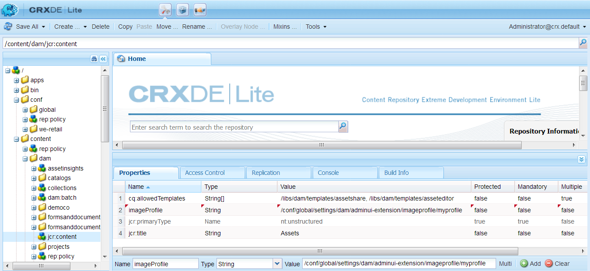
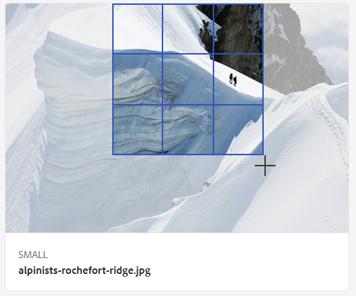

# Profili immagine di Dynamic Media {#image-profiles}

Durante il caricamento delle immagini, puoi ritagliarle automaticamente al momento del caricamento applicando un profilo immagine alla cartella.

>[!IMPORTANT]
>
>· Smart Crop è disponibile solo in modalità Dynamic Media - Scene7.
· I profili immagine non sono applicabili ai file PDF, animated GIF o INDD (Adobe InDesign).

## Opzioni di ritaglio {#crop-options}

Quando implementi il ritaglio avanzato sulle immagini, Adobe consiglia la procedura consigliata di seguito e applica il seguente limite:

| Tipo di limite | Best practice | Limite imposto |
| --- | --- | --- |
| Numero di ritagli avanzati per immagine | 5 | 100 |

Vedi anche [Limitazioni di Dynamic Media](/help/assets/limitations.md).

<!-- CQDOC-16069 for paragraph directly below -->

Le coordinate di ritaglio avanzato dipendono dalle proporzioni. Per le varie impostazioni di ritaglio avanzato in un profilo immagine, se le proporzioni sono le stesse per le dimensioni aggiunte nel profilo immagine, le stesse proporzioni vengono inviate a Dynamic Media. L’Adobe consiglia di utilizzare la stessa area di ritaglio. In questo modo si evita un impatto sulle diverse dimensioni utilizzate nel profilo immagine.

Ogni generazione di ritaglio avanzato creata richiede un’elaborazione aggiuntiva. Ad esempio, l’aggiunta di più di cinque proporzioni di ritaglio avanzato può causare un rallentamento del tasso di acquisizione delle risorse. Inoltre, causa un aumento del carico sui sistemi. Poiché puoi applicare lo strumento di ritaglio avanzato a livello di cartella, l’Adobe consiglia di utilizzarlo nelle cartelle *solo* dove è necessario.

**Linee guida per definire il ritaglio avanzato in un profilo immagine**
Per tenere sotto controllo l’utilizzo di Smart Crop e ottimizzarne il tempo di elaborazione e la conservazione, l’Adobe consiglia di seguire le linee guida e i suggerimenti seguenti:

* Evita di creare profili di ritaglio avanzato duplicati con gli stessi valori di larghezza e altezza.
* Denomina gli smart crop in base alle dimensioni di ritaglio, non all’utilizzo finale. In questo modo è possibile ottimizzare i duplicati in cui una singola dimensione viene utilizzata su più pagine.
* Crea profili immagine in base al tipo di pagina/risorsa per cartelle e sottocartelle specifiche, anziché un profilo di ritaglio avanzato comune applicato a tutte le cartelle o a tutte le risorse.
* Un profilo immagine applicato alle sottocartelle sostituisce un profilo immagine applicato alla cartella.
* Crea profili immagine in base al tipo di pagina/risorsa per cartelle e sottocartelle specifiche, anziché un profilo di ritaglio avanzato comune applicato a tutte le cartelle o a tutte le risorse.
* Un profilo immagine applicato alle sottocartelle sostituisce un profilo immagine applicato alla cartella.
* Idealmente, avere 10-15 ritagli intelligenti per immagine per ottimizzare i rapporti dello schermo e il tempo di elaborazione.

<!--
* Image assets that are going to have a smart crop applied to them must be a minimum of 50 x 50 pixels or larger. CQDOC-20087
* An Image Profile that contains duplicate smart crop dimensions is not permitted. CQDOC-20087
* Duplicate named Image Profiles that have smart crop options set are not permitted. CQDOC-20087
* Create page-wise/asset type-wise Image Profiles for specific folders and subfolders instead of a common smart crop profile that is applied to all folders or all assets.
* An Image Profile that you apply to subfolders overrides an Image Profile that is applied to the folder.
* Ideally, have 10-15 smart crops per image to optimize for screen ratios and processing time. -->
<!-- * Avoid creating duplicate smart crop profiles that have the same width and height values. 
* Name smart crops based on crop dimensions, not on end usage. Doing so helps to optimize for duplicates where a single dimension is used on multiple pages. -->

Puoi scegliere tra due opzioni di ritaglio dell’immagine: Ritaglio pixel o Ritaglio avanzato. Puoi anche scegliere di automatizzare la creazione di campioni di colore e immagini.

>[!IMPORTANT]
· L’Adobe consiglia di esaminare tutte le colture e i campioni generati per assicurarsi che siano appropriati e pertinenti per il marchio e i valori.
· Il formato immagine CMYK non è supportato con il ritaglio avanzato.

| Opzione | Quando utilizzare | Descrizione |
| --- | --- | --- |
| Ritaglio pixel | Ritaglia in blocco le immagini solo in base alle dimensioni. | Per utilizzare questa opzione, seleziona **[!UICONTROL Ritaglio pixel]** dall&#39;elenco a discesa Opzioni di ritaglio.  Per ritagliare dai lati di un&#39;immagine, immettere il numero di pixel da ritagliare da qualsiasi lato o da ogni lato dell&#39;immagine. La quantità di immagine ritagliata dipende dall&#39;impostazione ppi (pixel per pollice) nel file di immagine.  Il ritaglio di un pixel di un profilo immagine viene riprodotto nel modo seguente: · I valori sono Top, Bottom, Left e Right. · In alto a sinistra è considerato `0,0` e il ritaglio di pixel viene calcolato da lì. · Punto iniziale di ritaglio: X a sinistra e Y in alto · Calcolo orizzontale: dimensione orizzontale in pixel dell&#39;immagine originale meno Sinistra e quindi meno Destra. · Calcolo verticale: altezza verticale in pixel meno Superiore e quindi meno Inferiore.  Ad esempio, supponiamo di avere un&#39;immagine di 4000 x 3000 pixel. Si utilizzano i seguenti valori: Top=250, Bottom=500, Left=300, Right=700.  Dall&#39;alto a sinistra (300.250) ritaglia utilizzando lo spazio di riempimento di (4000-300-700, 3000-250-500 o 3000.2250). |
| Ritaglio avanzato | Ritaglia in blocco le immagini in base al loro punto focale visivo. | Smart Crop utilizza la potenza dell’intelligenza artificiale in Adobe Sensei per automatizzare rapidamente il ritaglio di immagini in blocco. Il ritaglio avanzato rileva automaticamente e ritaglia fino al punto focale di qualsiasi immagine per acquisire il punto di interesse desiderato, indipendentemente dalle dimensioni dello schermo.
 
Per utilizzare Ritaglio avanzato, seleziona **[!UICONTROL Ritaglio avanzato]** dall’elenco a discesa Opzioni di ritaglio, quindi a destra di Ritaglio immagine reattivo, abilita (attiva) la funzione.
 
Le dimensioni predefinite dei punti di interruzione Grandi, Medie e Piccole coprono in genere l&#39;intera gamma di dimensioni utilizzate dalla maggior parte delle immagini su dispositivi mobili e tablet, desktop e banner. Se lo si desidera, è possibile modificare i nomi predefiniti di Grande, Medio e Piccolo.
 
Per aggiungere altri punti di interruzione, seleziona **[!UICONTROL Aggiungi ritaglio]** per eliminare un ritaglio, seleziona l’icona Cestino. |
| Campione immagine e colore | Genera un campione di immagine per ogni immagine. | **Nota**: campione avanzato non supportato in Dynamic Media Classic.  Individua e genera automaticamente campioni di alta qualità da immagini di prodotti che mostrano colori o texture.  Per usare Campione colore e immagine, seleziona **[!UICONTROL Ritaglio avanzato]** dall&#39;elenco a discesa Opzioni di ritaglio, quindi a destra di Colore e campione immagine, attivare (attivare) la funzione. Immettere un valore in pixel nelle caselle di testo Larghezza e Altezza.  Mentre tutte le ritagli di immagini sono disponibili dalla barra Rappresentazioni, i campioni vengono utilizzati solo tramite la funzione Copia URL. Utilizza il tuo componente di visualizzazione per eseguire il rendering del campione sul tuo sito. (L&#39;eccezione a questa regola sono i banner a carosello. Dynamic Media fornisce il componente visualizzazione per il campione utilizzato nei banner carosello.)  **Utilizzo dei campioni immagine**  L&#39;URL per i campioni di immagine è semplice. È:  `/is/image/company/&lt;asset_name&gt;:Swatch` dove `:Swatch` viene aggiunto alla richiesta della risorsa.  **Utilizzo dei campioni colore**  Per utilizzare i campioni colore, è necessario effettuare una `req=userdata` richiede quanto segue: `/is/image/&lt;company_name&gt;/&lt;swatch_asset_name&gt;:Swatch?req=userdata`  Di seguito è riportato un esempio di risorsa campione in Dynamic Media Classic: `https://my.company.com:8080/is/image/DemoCo/Sleek:Swatch` ed ecco la risorsa campione corrispondente `req=userdata` URL: `https://my.company.com:8080/is/image/DemoCo/Sleek:Swatch?req=userdata`  Il `req=userdata` la risposta è la seguente: `SmartCropDef=Swatch SmartCropHeight=200.0` `SmartCropRect=0.421671,0.389815,0.0848564,0.0592593,200,200` `SmartCropType=Swatch` `SmartCropWidth=200.0` `SmartSwatchColor=0xA56DB2`  Puoi anche richiedere un `req=userdata` risposta in formato XML o JSON, come nei seguenti esempi URL rispettivi: `https://my.company.com:8080/is/image/DemoCo/Sleek:Swatch?req=userdata,json` `https://my.company.com:8080/is/image/DemoCo/Sleek:Swatch?req=userdata,xml`  **Nota:** Creare un componente WCM personalizzato per richiedere un campione di colore e analizzare `SmartSwatchColor` attributo, rappresentato da un valore esadecimale RGB a 24 bit.  Vedi anche [`userdata` nella Guida di riferimento visualizzatori](https://experienceleague.adobe.com/docs/dynamic-media-developer-resources/image-serving-api/image-serving-api/http-protocol-reference/command-reference/req/r-userdata.html). |

## Maschera di contrasto {#unsharp-mask}

Usa **[!UICONTROL Maschera definizione dettagli]** per regolare con precisione un effetto filtro di nitidezza sull’immagine ricampionata verso il basso finale. È possibile controllare l&#39;intensità dell&#39;effetto, il raggio in pixel e una soglia di contrasto ignorata. Questo effetto utilizza le stesse opzioni di Adobe Photoshop *Maschera definizione dettagli* filtro.

>[!NOTE]
La maschera di contrasto viene applicata solo alle rappresentazioni ridotte all&#39;interno del file PTIFF (piramide tiff) con ricampionamento verso il basso di oltre il 50%. Ciò significa che le rappresentazioni di dimensioni maggiori all’interno del file ptiff non sono influenzate da una maschera di contrasto, mentre le rappresentazioni di dimensioni più piccole, come le miniature, vengono alterate (e mostrano la maschera di contrasto).

In entrata **[!UICONTROL Maschera definizione dettagli]**, sono disponibili le seguenti opzioni di filtro:

| Opzione | Descrizione |
| --- | --- |
| Quantità | Controlla il contrasto applicato ai pixel del bordo. Il valore predefinito è 1,75. Per le immagini ad alta risoluzione, è possibile aumentarlo fino a 5. Considera Importo come una misura dell’intensità del filtro. L&#39;intervallo è 0-5. |
| Raggio | Determina quanti pixel attorno al bordo vengono interessati dalla nitidezza. Per le immagini ad alta risoluzione, inserite un valore da 1 a 2. Un valore basso agisce solo sui pixel del bordo; un valore più elevato agisce su una fascia più ampia di pixel. Il valore adatto dipende dalle dimensioni dell&#39;immagine. Il valore predefinito è 0,2. L&#39;intervallo è 0-250. |
| Soglia | Determina l&#39;intervallo di contrasto da ignorare quando si applica il filtro Maschera di contrasto. In altre parole, questa opzione determina quanto devono differire i pixel resi più nitidi dall’area circostante prima che vengano considerati pixel del bordo e resi più nitidi. Per evitare di introdurre disturbi, prova con valori compresi tra 0 e 255. |

La nitidezza è descritta in [Nitidezza delle immagini](/help/assets/assets/sharpening_images.pdf).

## Creare profili immagine Dynamic Media {#creating-image-profiles}

Per definire parametri di elaborazione avanzati per altri tipi di risorse, consulta [Configurazione dell’elaborazione delle risorse](config-dms7.md#configuring-asset-processing).

Consulta [Profili per l’elaborazione di metadati, immagini e video](processing-profiles.md).

Vedi anche [Best practice per organizzare le risorse digitali per l’utilizzo dei profili di elaborazione](/help/assets/organize-assets.md).

**Per creare profili immagine Dynamic Media:**

1. Seleziona il logo Adobe Experience Manager e passa a **[!UICONTROL Strumenti]** > **[!UICONTROL Risorse]** > **[!UICONTROL Profili immagine]**.
1. Seleziona **[!UICONTROL Crea]** in modo da poter aggiungere un profilo immagine.
1. Immettete il nome di un profilo e i valori per maschera di contrasto, ritaglio o campione o entrambi.

   Utilizza un nome di profilo specifico per lo scopo previsto. Ad esempio, se vuoi creare un profilo che generi solo campioni - ossia, Ritaglio avanzato è disabilitato (disattivato) e Campione colore e immagine è abilitato (attivato) - utilizza il nome di profilo &quot;Campioni avanzati&quot;.

   Consulta anche la sezione [Opzioni di ritaglio avanzato e campione avanzato](#crop-options) e [Maschera definizione dettagli](#unsharp-mask).

   

1. Seleziona **[!UICONTROL Salva]**. Il nuovo profilo creato viene visualizzato nell’elenco dei profili disponibili.

## Modificare o eliminare i profili immagine Dynamic Media {#editing-or-deleting-image-profiles}

1. Seleziona il logo di Experience Manager e passa a **[!UICONTROL Strumenti]** > **[!UICONTROL Risorse]** > **[!UICONTROL Profili immagine]**.
1. Seleziona il profilo immagine da modificare o rimuovere. Per modificarlo, seleziona **[!UICONTROL Modifica profilo immagine]**. Per rimuoverlo, seleziona **[!UICONTROL Elimina profilo immagine]**.

   

1. Se stai eseguendo una modifica, salva le modifiche. In caso di eliminazione, conferma di voler rimuovere il profilo.

## Applicare un profilo immagine Dynamic Media alle cartelle {#applying-an-image-profile-to-folders}

Quando si assegna un profilo immagine a una cartella, tutte le sottocartelle ereditano automaticamente il profilo dalla cartella principale. Questo flusso di lavoro consente di assegnare un solo profilo immagine a una cartella. Considera quindi con attenzione la struttura di cartelle in cui caricare, archiviare, utilizzare e archiviare le risorse.

Se hai assegnato un profilo immagine diverso a una cartella, il nuovo profilo sostituisce quello precedente. Le risorse della cartella esistenti in precedenza rimangono invariate. Il nuovo profilo viene applicato alle risorse che vengono aggiunte alla cartella in un secondo momento.

Le cartelle a cui è assegnato un profilo sono indicate nell’interfaccia utente utilizzando il nome del profilo visualizzato nella scheda.

<!-- When you add smart crop to an existing Image Profile, you need to re-trigger the [DAM Update Asset workflow](assets-workflow.md) if you want to generate crops for existing assets in your asset repository. -->

Puoi applicare i profili immagine a cartelle specifiche o a livello globale a tutte le risorse.

Puoi rielaborare le risorse in una cartella che dispone già di un profilo immagine modificato in seguito. Consulta [Rielaborazione delle risorse in una cartella dopo averne modificato il profilo di elaborazione](processing-profiles.md#reprocessing-assets).

### Applicare profili immagine Dynamic Media a cartelle specifiche {#applying-image-profiles-to-specific-folders}

È possibile applicare un profilo immagine a una cartella dall’interno di **[!UICONTROL Strumenti]** o se ti trovi nella cartella, da **[!UICONTROL Proprietà]**. Questa sezione descrive come applicare i profili immagine alle cartelle con entrambe le soluzioni.

Le cartelle a cui è già stato assegnato un profilo sono indicate dalla visualizzazione del nome del profilo che è posto direttamente sotto il nome della cartella.

Puoi rielaborare le risorse in una cartella che dispone già di un profilo video modificato in seguito. Consulta [Rielaborazione delle risorse in una cartella dopo averne modificato il profilo di elaborazione](processing-profiles.md#reprocessing-assets).

#### Applicazione dei profili immagine di Dynamic Media alle cartelle dall’interfaccia utente Profili {#applying-image-profiles-to-folders-from-profiles-user-interface}

1. Seleziona il logo di Experience Manager e passa a **[!UICONTROL Strumenti]** > **[!UICONTROL Risorse]** > **[!UICONTROL Profili immagine]**.
1. Seleziona il profilo immagine da applicare a una o più cartelle.

   

1. Seleziona **[!UICONTROL Applicare il profilo di elaborazione alle cartelle]** e seleziona la cartella o le cartelle da utilizzare per ricevere le risorse appena caricate, quindi fai clic su **[!UICONTROL Applica]**. Le cartelle a cui è già stato assegnato un profilo sono indicate dalla visualizzazione del nome del profilo che è posto direttamente sotto il nome della cartella.

#### Applicare profili immagine Dynamic Media alle cartelle da Proprietà {#applying-image-profiles-to-folders-from-properties}

1. Seleziona il logo di Experience League e passa a **[!UICONTROL Risorse]**. Quindi passa alla cartella principale della cartella a cui desideri applicare un profilo immagine.
1. Sulla cartella, seleziona il segno di spunta per selezionarla, quindi seleziona **[!UICONTROL Proprietà]**.
1. Seleziona la **[!UICONTROL Profili immagine]** scheda. Dalla sezione **[!UICONTROL Nome profilo]** , seleziona il profilo, quindi fai clic su **[!UICONTROL Salva e chiudi]**. Le cartelle a cui è già stato assegnato un profilo sono indicate dalla visualizzazione del nome del profilo che è posto direttamente sotto il nome della cartella.

   

### Applicare un profilo immagine Dynamic Media a livello globale {#applying-an-image-profile-globally}

Oltre ad applicare un profilo a una cartella, puoi applicarne uno a livello globale, in modo che il profilo selezionato venga applicato a qualsiasi contenuto caricato nelle risorse Experience Manager in qualsiasi cartella.

Puoi rielaborare le risorse in una cartella che dispone già di un profilo video modificato in seguito. Consulta [Rielaborazione delle risorse in una cartella dopo averne modificato il profilo di elaborazione](processing-profiles.md#reprocessing-assets).

**Per applicare un profilo immagine Dynamic Media a livello globale:**

1. Effettua una delle operazioni seguenti:

   * Accedi a `https://&lt;AEM server&gt;/mnt/overlay/dam/gui/content/assets/foldersharewizard.html/content/dam` e applica il profilo appropriato e seleziona **[!UICONTROL Salva]**.

      

   * Passa a CRXDE Lite al seguente nodo: `/content/dam/jcr:content`.

      Aggiungi la proprietà `imageProfile:/conf/global/settings/dam/adminui-extension/imageprofile/<name of image profile>` e seleziona **[!UICONTROL Salva tutto]**.

      

## Modificare il ritaglio o il campione avanzato di una singola immagine {#editing-the-smart-crop-or-smart-swatch-of-a-single-image}

>[!IMPORTANT]
· Smart crop è disponibile solo in modalità Dynamic Media - Scene7.

Puoi riallineare o ridimensionare manualmente la finestra di ritaglio avanzato di un’immagine per perfezionarne ulteriormente il punto focale.

Dopo aver modificato un ritaglio avanzato e aver salvato, la modifica viene propagata ovunque si utilizzi il ritaglio per le immagini specifiche.

Se necessario, puoi eseguire nuovamente il ritaglio avanzato per generare di nuovo i ritagli aggiuntivi.

Vedi anche [Modificare il ritaglio o il campione avanzato di più immagini](#editing-the-smart-crop-or-smart-swatch-of-multiple-images).

**Per modificare il ritaglio o il campione avanzato di una singola immagine:**

1. Seleziona il logo di Experience Manager e passa a **[!UICONTROL Risorse]**, quindi alla cartella a cui è applicato un profilo immagine di ritaglio o campione avanzato.

1. Seleziona la cartella in modo da poterne aprire il contenuto.
1. Seleziona l’immagine di cui desideri regolare il ritaglio o il campione avanzato.
1. Nella barra degli strumenti, seleziona **[!UICONTROL Ritaglio avanzato]**.

1. Effettua una delle seguenti operazioni:

   * Nell&#39;angolo superiore destro della pagina trascinare la barra di scorrimento verso sinistra o verso destra per aumentare o diminuire la visualizzazione dell&#39;immagine.
   * Sull’immagine, trascina una maniglia d’angolo per regolare le dimensioni dell’area visualizzabile del ritaglio o campione.
   * Sull’immagine, trascina il riquadro/campione in una nuova posizione. Potete modificare solo i campioni immagine; i campioni colore sono statici.
   * Sopra l&#39;immagine, seleziona  **[!UICONTROL Ripristina]** per annullare tutte le modifiche e ripristinare il ritaglio o il campione originale.

1. Nell’angolo superiore destro della pagina, seleziona **[!UICONTROL Salva]**, quindi seleziona **[!UICONTROL Chiudi]** per tornare alla cartella delle risorse.

## Modificare il ritaglio o il campione avanzato di più immagini {#editing-the-smart-crop-or-smart-swatch-of-multiple-images}

>[!IMPORTANT]
· Smart crop è disponibile solo in modalità Dynamic Media - Scene7.

Dopo aver applicato un profilo immagine contenente Ritaglio avanzato a una cartella, a tutte le immagini in tale cartella viene applicato un ritaglio. Se lo desideri, puoi *manualmente* riallineare o ridimensionare la finestra di ritaglio avanzato in più immagini per perfezionare ulteriormente il punto focale.

Dopo aver modificato un ritaglio avanzato e aver salvato, la modifica viene propagata ovunque si utilizzi il ritaglio per le immagini specifiche.

Se necessario, puoi eseguire nuovamente il ritaglio avanzato per generare di nuovo i ritagli aggiuntivi.

**Per modificare il ritaglio o il campione avanzato di più immagini:**

1. Seleziona il logo di Experience Manager e passa a **[!UICONTROL Risorse]**, quindi a una cartella a cui è applicato un profilo immagine di ritaglio o campione avanzato.
1. Nella cartella, seleziona la **[!UICONTROL Altre azioni]** (...) , quindi seleziona **[!UICONTROL Ritaglio avanzato]**.

1. Il giorno **[!UICONTROL Modifica ritagli avanzati]** eseguire una delle operazioni seguenti:

   * Regola le dimensioni di visualizzazione delle immagini sulla pagina.

      A destra dell&#39;elenco a discesa Nome punto di interruzione, trascinare la barra di scorrimento verso sinistra o verso destra per modificare le dimensioni della visualizzazione dell&#39;immagine visualizzabile.

      

   * Filtra l’elenco delle immagini visualizzabili in base ai nomi dei punti di interruzione. Nell’esempio seguente, le immagini vengono filtrate in base al nome del punto di interruzione &quot;Medium&quot;.

      Dall’elenco a discesa nell’angolo in alto a destra della pagina, seleziona un nome di punto di interruzione per filtrare in base alle immagini visualizzate. (Vedi l’immagine precedente).

      

   * Ridimensiona la casella di ritaglio avanzato. Effettua una delle seguenti operazioni:

      * Se l’immagine dispone solo di un ritaglio avanzato o di un campione avanzato, trascina la maniglia d’angolo della casella di ritaglio per regolare le dimensioni dell’area visualizzabile del ritaglio.
      * Se l’immagine presenta sia un ritaglio avanzato che un campione avanzato, trascina la maniglia d’angolo della casella di ritaglio per regolare le dimensioni dell’area visualizzabile del ritaglio. In alternativa, seleziona il campione avanzato sotto l’immagine (i campioni di colore sono statici), quindi trascina la maniglia d’angolo della casella di ritaglio per regolare le dimensioni dell’area visualizzabile del campione.

      

   * Spostare la casella di ritaglio avanzato. Effettua una delle seguenti operazioni:

      * Se l’immagine dispone solo di un ritaglio avanzato o di un campione avanzato, trascina la casella di ritaglio in una nuova posizione sull’immagine.
      * Se l’immagine dispone sia di un ritaglio avanzato che di un campione avanzato, trascina la casella di ritaglio avanzato in una nuova posizione. In alternativa, seleziona il campione avanzato sotto l’immagine (i campioni di colore sono statici), quindi trascina la casella di ritaglio del campione avanzato in una nuova posizione.

      

   * Annulla tutte le modifiche e ripristina il ritaglio avanzato o il campione avanzato originale (si applica solo alla sessione di modifica corrente).

      Seleziona **[!UICONTROL Ripristina]** sopra l&#39;immagine.

      

1. Nell’angolo superiore destro della pagina, seleziona **[!UICONTROL Salva]**, quindi seleziona **[!UICONTROL Chiudi]** per tornare alla cartella delle risorse.

## Rimuovere un profilo immagine Dynamic Media dalle cartelle {#removing-an-image-profile-from-folders}

Quando rimuovi un profilo immagine da una cartella, tutte le sottocartelle ereditano automaticamente la rimozione del profilo dalla relativa cartella principale. Tuttavia, qualsiasi elaborazione dei file che si è verificata all’interno delle cartelle rimane intatta.

È possibile rimuovere un profilo immagine da una cartella dall’interno di **[!UICONTROL Strumenti]** o se ti trovi nella cartella, da **[!UICONTROL Proprietà]**. Questa sezione descrive come rimuovere i profili immagine dalle cartelle con entrambe le soluzioni.

### Rimuovere i profili immagine di Dynamic Media dalle cartelle tramite l’interfaccia utente Profili {#removing-image-profiles-from-folders-via-profiles-user-interface}

1. Seleziona il logo di Experience Manager e passa a **[!UICONTROL Strumenti]** > **[!UICONTROL Risorse]** > **[!UICONTROL Profili immagine]**.
1. Seleziona il profilo immagine da rimuovere da una o più cartelle.
1. Seleziona **[!UICONTROL Rimuovi profilo elaborazione da cartelle]** e seleziona la cartella o le cartelle da cui vuoi rimuovere il profilo e fai clic su **[!UICONTROL Rimuovi]**.

   Puoi confermare che il profilo immagine non è più applicato a una cartella perché il nome non viene più visualizzato sotto il nome della cartella.

### Rimuovere i profili immagine di Dynamic Media dalle cartelle tramite Proprietà {#removing-image-profiles-from-folders-via-properties}

1. Seleziona il logo di Experience Manager e naviga **[!UICONTROL Risorse]** e quindi alla cartella da cui desideri rimuovere un profilo immagine.
1. Sulla cartella, seleziona il segno di spunta per selezionarla, quindi fai clic su **[!UICONTROL Proprietà]**.
1. Seleziona la **[!UICONTROL Profili immagine]** scheda.
1. Dalla sezione **[!UICONTROL Nome profilo]** elenco a discesa, seleziona **[!UICONTROL Nessuno]**, quindi seleziona **[!UICONTROL Salva e chiudi]**.

   Le cartelle a cui è già stato assegnato un profilo sono indicate dalla visualizzazione del nome del profilo che è posto direttamente sotto il nome della cartella.
