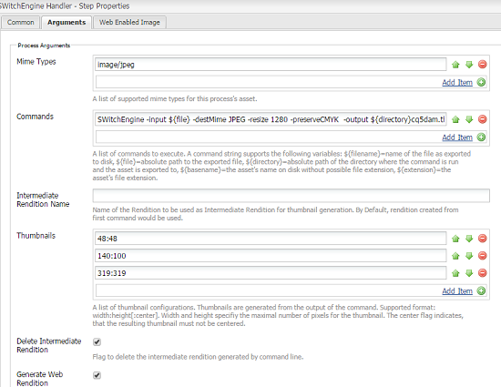

# Libreria di transcodifica delle immagini {#imaging-transcoding-library}

La libreria di transcodifica delle immagini di Adobe è una soluzione di elaborazione delle immagini proprietaria in grado di eseguire funzioni di base per la gestione delle immagini, tra cui:

* Codifica
* Transcodifica (conversione dei formati supportati)
* Ricampionamento delle immagini, utilizzando gli algoritmi PS e Intel IPP
* Conservazione della profondità dei bit e del profilo del colore
* Compressione della qualità JPEG
* Ridimensionamento dell&#39;immagine

La libreria di transcodifica delle immagini fornisce supporto CMYK e supporto alfa completo, ad eccezione di CMYK -Alpha.

Oltre a supportare un’ampia gamma di formati e profili di file, la libreria di transcodifica delle immagini presenta vantaggi significativi rispetto ad altre soluzioni di terze parti in termini di prestazioni, scalabilità e qualità. Di seguito sono riportati alcuni dei vantaggi principali dell’utilizzo della libreria di transcodifica delle immagini:

* **Scala con dimensioni o risoluzione** file crescenti: La scalabilità è ottenuta principalmente dalla capacità brevettata della libreria di transcodifica delle immagini di ridimensionare durante la decodifica dei file. Questa capacità assicura che l&#39;utilizzo della memoria di runtime sia sempre ottimale e non è una funzione quadratica di aumentare le dimensioni dei file o la risoluzione megapixel. La libreria di transcodifica delle immagini può elaborare file più grandi e ad alta risoluzione (contenenti megapixel più alti). Gli strumenti di terze parti, come ImageMagick, non sono in grado di gestire file di grandi dimensioni e arresti anomali durante l’elaborazione di tali file.
* **algoritmi** di compressione e ridimensionamento della qualità di Photoshop: Coerenza con lo standard industriale in termini di qualità del campionamento a discesa (morbido, nitido e automatico bicubico) e di qualità della compressione. La libreria di transcodifica delle immagini valuta ulteriormente il fattore di qualità dell&#39;immagine di input e utilizza in modo intelligente tabelle ottimali e impostazioni di qualità per l&#39;immagine di output. Questa capacità produce file di dimensioni ottimali senza compromettere la qualità visiva.
* **Elevata velocità effettiva:** il tempo di risposta è inferiore e la velocità effettiva è costantemente superiore a ImageMagick. Pertanto, la libreria di transcodifica delle immagini dovrebbe ridurre il tempo di attesa per gli utenti e il costo dell’hosting.
* **Scala migliore con il carico simultaneo:** la libreria di transcodifica per immagini funziona in modo ottimale in condizioni di carico simultanee. Offre un throughput elevato con prestazioni ottimali della CPU, utilizzo della memoria e tempi di risposta ridotti, il che contribuisce a ridurre i costi di hosting.

## Piattaforme supportate {#supported-platforms}

La libreria di transcodifica delle immagini è disponibile solo per le distribuzioni RHEL 7 e CentOS 7.

>[!NOTE]
>
>Mac OS e altre distribuzioni *nix (ad esempio Debian e Ubuntu) non sono supportate.

## Utilizzo {#usage}

Gli argomenti della riga di comando per la libreria di transcodifica delle immagini possono includere quanto segue:

```shell
 -destMime PNG/JPEG: Mime type of output rendition
 -BitDepth 8/16: Preserves Bit Depth. Bitdepth ‘4’ is automatically converted to ‘8’
 -preserveBitDepth: Downscales Bit Depth (No upscaling)
 -preserveCMYK: Preserves CMYK color space
 -jpegQuality: Provides jpeg quality parameter (0-12 , corresponding to Photoshop qualities)
 -ResamplingMethod BiCubic/Lanczos/PSBicubic: Provides resampling methods. PSBicubic is a Photoshop quality resampling method.
 -resize
```

Puoi configurare le seguenti opzioni per il parametro `-resize` :

* `X`: Funziona simile a  [!DNL Experience Manager]. Ad esempio -resize 319.
* `WxH`: Il rapporto di formato non viene mantenuto, ad esempio  `-resize 319x319`.
* `Wx`: Corregge la larghezza e calcola l&#39;altezza mantenendo le proporzioni. Esempio `-resize 319x`.
* `xH`: Corregge l&#39;altezza e calcola la larghezza mantenendo le proporzioni. Esempio `-resize x319`.

```shell
 -AllowUpsampling (Resizes smaller images)
 -input <fileName>
 -output <fileName>
```

## Configurare la libreria di transcodifica delle immagini {#configuring-imaging-transcoding-library}

Per configurare l’elaborazione ITL, crea un file di configurazione e aggiorna il flusso di lavoro per eseguirlo.

### Crea un file di configurazione per il bundle estratto {#create-conf-file}

Per configurare la libreria, crea un file CONF per indicare le librerie utilizzando i seguenti passaggi. Sono necessarie autorizzazioni di livello amministratore o radice.

1. Scarica il [pacchetto della libreria di transcodifica delle immagini da Distribuzione di software](https://experience.adobe.com/#/downloads/content/software-distribution/en/aem.html?package=/content/software-distribution/en/details.html/content/dam/aem/public/adobe/packages/aem630/product/assets/aem-assets-imaging-transcoding-library-pkg) e installalo utilizzando Gestione pacchetti. Il pacchetto è compatibile con [!DNL Experience Manager] 6.5.

1. Per conoscere un ID bundle per `com.day.cq.dam.cq-dam-switchengine`, accedi alla Console web e fai clic su **[!UICONTROL OSGi]** > **[!UICONTROL Bundle]**. In alternativa, per aprire la console dei bundle, accedi all&#39; URL `https://[aem_server:[port]/system/console/bundles/` . Individua il bundle `com.day.cq.dam.cq-dam-switchengine` e il relativo ID.

1. Assicurati che tutte le librerie richieste siano estratte, controllando la cartella utilizzando il comando `ls -la /aem65/author/crx-quickstart/launchpad/felix/bundle<id>/data/binaries/`, dove il nome della cartella viene costruito utilizzando l&#39;ID bundle. Ad esempio, il comando è `ls -la /aem65/author/crx-quickstart/launchpad/felix/bundle588/data/binaries/` se l&#39;id del bundle è `588`.

1. Crea un file `SWitchEngineLibs.conf` da collegare alla libreria.

   ```shell
   cd `/etc/ld.so.conf.d`
   touch SWitchEngineLibs.conf
   vi SWitchEngineLibs.conf
   ```

1. Aggiungi il percorso `/aem65/author/crx-quickstart/launchpad/felix/bundle<id>/data/binaries/` al file conf utilizzando il comando `cat SWitchEngineLibs.conf` .

1. Esegui il comando `ldconfig` per creare i collegamenti e la cache necessari.

1. Nell&#39;account utilizzato per avviare [!DNL Experience Manager], modifica il file `.bash_profile`. Aggiungi `LD_LIBRARY_PATH` aggiungendo quanto segue.

   ```shell
   LD_LIBRARY_PATH=.
   export LD_LIBRARY_PATH
   ```

1. Per assicurarsi che il valore del percorso sia impostato su `.`, utilizzare il comando `echo $LD_LIBRARY_PATH`. L&#39;output deve essere solo `.`. Se il valore non è impostato su `.`, riavviare la sessione.

### Configura il flusso di lavoro [!UICONTROL Aggiorna risorsa DAM] {#configure-dam-asset-update-workflow}

Aggiorna il flusso di lavoro [!UICONTROL Aggiorna risorsa DAM] per utilizzare la libreria per l&#39;elaborazione delle immagini.

1. Nell&#39;interfaccia utente [!DNL Experience Manager], seleziona **[!UICONTROL Strumenti]** > **[!UICONTROL Flusso di lavoro]** > **[!UICONTROL Modelli]**.

1. Dalla pagina **[!UICONTROL Modelli di flusso di lavoro]** , apri il modello di flusso di lavoro **[!UICONTROL Aggiorna risorsa DAM]** in modalità di modifica.

1. Apri il passaggio del processo del flusso di lavoro **[!UICONTROL Elabora miniature]** . Nella scheda **[!UICONTROL Miniature]** , aggiungi i tipi MIME per i quali desideri saltare il processo predefinito di generazione delle miniature nell’elenco **[!UICONTROL Skip Mime Types]** .
Ad esempio, se desideri creare miniature per un’immagine TIFF utilizzando la libreria di transcodifica delle immagini, specifica `image/tiff` nel campo **[!UICONTROL Skip Mime Types]** .

1. Nella scheda **[!UICONTROL Immagine abilitata per il web]** , aggiungi i tipi MIME per i quali desideri saltare il processo predefinito di generazione del rendering web in **[!UICONTROL Skip List]**. Ad esempio, se hai saltato il tipo MIME `image/tiff` nel passaggio precedente, aggiungi `image/tiff` all’elenco Salta.

1. Apri il passaggio **[!UICONTROL Miniature EPS (powered by ImageMagick)]** e passa alla scheda **[!UICONTROL Argomenti]** . Nell’elenco **[!UICONTROL Tipi di MIME]**, aggiungi i tipi MIME che desideri elaborare nella libreria di transcodifica delle immagini. Ad esempio, se hai saltato il tipo MIME `image/tiff` nel passaggio precedente, aggiungi `image/jpeg` all&#39;elenco **[!UICONTROL Tipi MIME]** .

1. Se esistono, rimuovere i comandi predefiniti.

1. Attiva il pannello laterale e dall&#39;elenco dei passaggi aggiungi **[!UICONTROL Gestore SWitchEngine]**.

1. Aggiungi i comandi al [!UICONTROL Gestore SwitchEngine] in base ai requisiti personalizzati. Regola i parametri dei comandi specificati per soddisfare le tue esigenze. Ad esempio, se desideri mantenere il profilo colore dell&#39;immagine JPEG, aggiungi i seguenti comandi all&#39;elenco **[!UICONTROL Comandi]**:

   * `SWitchEngine -input ${file} -destMime PNG -resize 48 -output ${directory}cq5dam.thumbnail.48.48.png`
   * `SWitchEngine -input ${file} -destMime PNG -resize 140x100 -output ${directory}cq5dam.thumbnail.140.100.png`
   * `SWitchEngine -input ${file} -destMime PNG -resize 319 -output ${directory}cq5dam.thumbnail.319.319.png`
   * `SWitchEngine -input ${file} -destMime JPEG -resize 1280 -preserveCMYK -output ${directory}cq5dam.web.1280.1280.jpeg`

   

1. (Facoltativo) Genera miniature da una rappresentazione intermedia utilizzando un singolo comando. Il rendering intermedio funge da origine per generare rappresentazioni statiche e web. Questo metodo è più veloce del metodo precedente. Tuttavia, non è possibile applicare parametri personalizzati alle miniature utilizzando questo metodo.

   

1. Per generare rappresentazioni web, configura i parametri nella scheda **[!UICONTROL Immagine abilitata per il web]** .

1. Sincronizza il modello di flusso di lavoro aggiornato [!UICONTROL DAM Update Asset] . Salva il flusso di lavoro.

Verifica la configurazione, carica un&#39;immagine TIFF e monitora il file error.log. Noterai i messaggi `INFO` con menzioni di `SwitchEngineHandlingProcess execute: executing command line`. I registri menzionano le rappresentazioni generate. Al termine del flusso di lavoro, puoi visualizzare le nuove rappresentazioni in [!DNL Experience Manager].

>[!MORELIKETHIS]
>
>* [Articolo sui tipi MIME supportati](assets-formats.md#supported-image-transcoding-library)

