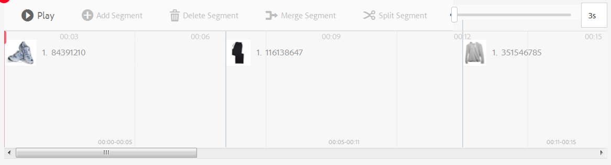
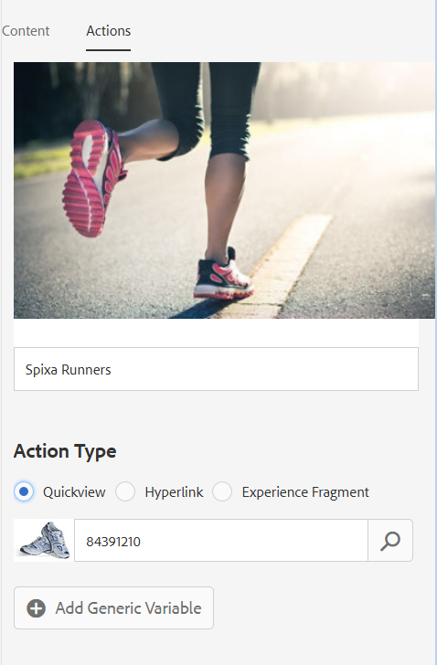

# Video interattivi{#interactive-videos}

Puoi creare facilmente video interattivi - noti anche come video acquistabili - che guidano la conversione direttamente dal video. Il coinvolgimento dei clienti con il video si svolge in un pannello accanto al lettore video, dove vengono visualizzate informazioni o miniature relative a servizi, prodotti in base alle funzioni presenti nel video. I clienti possono toccare la miniatura ed essere collegati direttamente al servizio oppure aggiungere l’articolo a un carrello per un acquisto immediato, oppure essere collegati a una pagina web per ulteriori informazioni.

Al termine del video, viene visualizzato un riepilogo visivo di tutte le offerte per attivare una chiamata all’azione. I clienti hanno un’altra opportunità di toccare l’elemento desiderato. Esperienze fruibili e specifiche, come queste, aumentano il coinvolgimento e le conversioni dei clienti.

Vedere anche [Immagini interattive](/help/assets/interactive-images.md).

## Video interattivo in azione {#interactive-video-in-action}

Per visualizzare un video interattivo e acquistabile in azione, fai clic su [Live Demos](https://landing.adobe.com/en/na/dynamic-media/ctir-2755/live-demos.html), scorri fino all&#39;intestazione **[!UICONTROL Shoppable Media]** nella pagina, quindi fai clic sul video acquistabile.

* Durante la riproduzione, quando i prodotti vengono utilizzati nel video, il prodotto identico viene visualizzato a destra come immagine in miniatura.

* Fai clic sulla miniatura per mettere in pausa il video e aprire la visualizzazione rapida del prodotto. Ad esempio, fai clic sull&#39;immagine della miniatura di KitchenAid nel video per visualizzare una visualizzazione a 360 gradi del mixer, oppure ingrandisci per vedere i dettagli del mixer.

<!-- There was a link here that showed the video frame of an interactive video and when the reader clicked the frame the video would play https://experienceleague.adobe.com/tools/dynamic-media-demo/shoppable-video/AXIS/index.html. This now needs to call a new interactive video-->

 *video interattivo e acquistabileUn fotogramma video da un video interattivo acquistabile.*

>[!NOTE]
>
>Se crei un video interattivo per avviare una pagina web quando un utente fa clic su un&#39;immagine in miniatura, alcuni dispositivi impediscono l&#39;apertura della pagina web a comparsa. In questi casi, è necessario modificare l&#39;impostazione di blocco dei popup sul dispositivo. Ad esempio, su un Apple iPhone 6, tocca **[!UICONTROL Impostazioni]** > **Safari** > **Blocca popup**, quindi sposta il controllo su **[!UICONTROL Disattivato]**. Ora, quando si riproduce un video interattivo e si fa clic su una miniatura, viene richiesto se si desidera aprire il pop-up. Se si accetta, viene visualizzata la pagina web.

### Guarda come vengono creati i video interattivi {#watch-how-interactive-videos-are-created}

Segui una procedura dettagliata su [come vengono creati i video interattivi](https://s7d5.scene7.com/s7viewers/html5/VideoViewer.html?videoserverurl=https://s7d5.scene7.com/is/content/&amp;emailurl=https://s7d5.scene7.com/s7/emailFriend&amp;serverUrl=https://s7d5.scene7.com/is/image/&amp;config=Scene7SharedAssets/Universal_HTML5_Video_social&amp;contenturl=https://s7d5.scene7.com/skins/&amp;asset=S7tutorials/InteractiveVideo) (7 minuti e 30 secondi).
Anche se la procedura dettagliata per i video è contrassegnata con il marchio Assets on Demand, i principi e i passaggi illustrati restano validi per i video interattivi in Adobe Experience Manager Assets.

### Adobe webinar sul successo del cliente {#adobe-customer-success-webinar}

Il webinar &quot;Utilizzo di video interattivi, condivisione collegamenti e condivisione YouTube in Experience Manager Assets&quot; illustra come utilizzare i video interattivi e altre funzioni per collegare gli eventi basati sulla conversione ai contenuti di marketing video.

>[!NOTE]
>
>[Utilizzo di video interattivi, condivisione dei collegamenti e condivisione YouTube in Experience Manager Assets](https://adobecustomersuccess.adobeconnect.com/p1yxzdo4aec/).

## Avvio rapido: Video interattivi {#quick-start-interactive-videos}

La seguente descrizione dettagliata del flusso di lavoro è stata progettata per aiutarti a iniziare rapidamente a usare i video interattivi in Dynamic Media.

Cerca l&#39;intestazione **Esempio** all&#39;interno di alcune delle attività di avvio rapido. Contiene una breve esercitazione basata su questa pagina web dimostrativa iniziale a cui *non* è ancora stata aggiunta l’interattività:

[https://experienceleague.adobe.com/tools/dynamic-media-demo/shoppable-video/john-lewis/landing-0.html](https://experienceleague.adobe.com/tools/dynamic-media-demo/shoppable-video/john-lewis/landing-0.html)

Gli **esempi** illustrano i passaggi necessari per integrare i video interattivi nel sito web.

Al termine dell’esercitazione nell’ultima sezione Esempio , la pagina Web demo finale con il video interattivo completamente integrato si presenta così:

[https://experienceleague.adobe.com/tools/dynamic-media-demo/shoppable-video/john-lewis/landing-3.html](https://experienceleague.adobe.com/tools/dynamic-media-demo/shoppable-video/john-lewis/landing-3.html)

Passaggi video interattivi:

1. **(Facoltativo) Identificazione delle variabili**  Quickview - Inizia identificando le variabili dinamiche utilizzate dall&#39;implementazione esistente di Quickview. Puoi utilizzare le variabili per mappare le miniature dei prodotti sulla visualizzazione rapida del prodotto corrispondente al momento della creazione del video interattivo. Consulta [(Facoltativo) Identificazione delle variabili Quickview](#optional-identifying-quickview-variables).
   *Questo passaggio è necessario solo se sono soddisfatte* tutte le seguenti condizioni: ・ Per aggiungere interattività al video, attiva le Quickview.
・ La tua implementazione di Experience Manager *non* utilizza un framework di integrazione eCommerce per estrarre i dati dei prodotti in Experience Manager da qualsiasi soluzione eCommerce come IBM® WebSphere® Commerce, Elastic Path, hybris o Intershop. Consulta [Concetti di eCommerce in Experience Manager Assets](/help/commerce/cif-classic/administering/concepts.md).

1. **(Facoltativo) Creazione di un predefinito**  visualizzatore video interattivo: personalizza l’aspetto e il comportamento di vari componenti che compongono il lettore, come lo scorrimento video e le miniature interattive.
La creazione di un proprio predefinito per visualizzatori video interattivi non è necessaria se invece desideri utilizzare i predefiniti per visualizzatori video interattivi `Shoppable_Video_Light` o `Shoppable_Video_Dark`.
Consulta [Creazione di un nuovo predefinito visualizzatore](/help/assets/managing-viewer-presets.md#creating-a-new-viewer-preset) (facoltativo) e [Considerazioni speciali per la creazione di un predefinito visualizzatore interattivo](/help/assets/managing-viewer-presets.md#special-considerations-for-creating-an-interactive-viewer-preset).

1. **Caricamento di un video e delle relative risorse di immagine**  associate - Caricamento di un video e delle immagini associate da rendere interattive.
Consulta [Caricamento di un video e delle relative miniature associate](#uploading-a-video-and-its-associated-thumbnail-assets).

1. **Aggiunta di interattività al video**  - Aggiungi uno o più segmenti di tempo al video. Quindi, associa le miniature delle immagini all’interno di tali segmenti di tempo. Assegna a ciascuna miniatura immagine un’azione come un collegamento ipertestuale, una visualizzazione rapida o un frammento esperienza.
Il metodo di collegamento basato su URL non è possibile se il contenuto interattivo include collegamenti con URL relativi, in particolare con le pagine di Experience Manager Sites.
Per terminare, pubblica le risorse video interattive. La pubblicazione crea il codice di incorporamento o l’URL da copiare e applicare alla pagina di destinazione del sito web. Consulta [Aggiunta di interattività al video](#adding-interactivity-to-your-video).
Consulta [Pubblicazione di risorse](/help/assets/publishing-dynamicmedia-assets.md).

1. **Aggiunta di un video interattivo al sito web o al sito web, ad Experience Manager** : se utilizzi Experience Manager Sites o e-commerce o entrambi, puoi aggiungere il video interattivo a una pagina web. Trascina il componente File multimediali interattivi sulla pagina nell’Experience Manager. Consulta [Aggiunta di risorse Dynamic Media alle pagine](/help/assets/adding-dynamic-media-assets-to-pages.md).
Utilizza il codice di incorporamento o l’URL per integrare il video interattivo con le esperienze del sito web. Consulta [Integrazione di un video interattivo con il sito web](#integrating-an-interactive-video-with-your-website).
Se utilizzi un WCM di terze parti (Web Content Manager), devi integrare il nuovo video interattivo con l’implementazione Quickview esistente utilizzata sul sito web. Consulta [Integrazione di un video interattivo con una visualizzazione rapida esistente](#integrating-an-interactive-video-with-an-existing-quickview).
   [Aggiunta di Risorse multimediali dinamiche alle pagine](/help/assets/adding-dynamic-media-assets-to-pages.md)

## (Facoltativo) Identificazione delle variabili Quickview {#optional-identifying-quickview-variables}

>[!NOTE]
>
>Questa attività è necessaria solo se sono soddisfatte le seguenti condizioni:
>
>* Per aggiungere interattività al video, attiva le Quickview.
>* La tua implementazione di Experience Manager *non* utilizza un framework di integrazione eCommerce per estrarre i dati dei prodotti in Experience Manager da qualsiasi soluzione eCommerce come IBM® WebSphere® Commerce, Elastic Path, hybris o Intershop. Consulta [Concetti di eCommerce in Experience Manager Assets](/help/commerce/cif-classic/administering/concepts.md).

>
>
Se l’implementazione di Experience Manager utilizza eCommerce, puoi saltare questa attività e passare all’attività successiva.

Per iniziare, identifica le variabili dinamiche utilizzate dall’implementazione di Quickview esistente in modo da poter mappare le miniature dei prodotti sul prodotto corrispondente Quickview durante il processo di creazione di video interattivo.

Quando aggiungi segmenti di tempo a un video, assegni un SKU (Stock Keeping Unit) e qualsiasi variabile aggiuntiva a ogni miniatura che aggiungi a un segmento. Tali variabili vengono utilizzate in seguito per visualizzare il prodotto Quickview corretto.

È importante identificare correttamente le variabili necessarie per attivare in modo univoco una visualizzazione rapida del prodotto.

A volte è sufficiente consultare gli specialisti IT responsabili dell&#39;implementazione di Quickview esistente. È probabile che conoscano il set minimo di dati per identificare Quickview nel sistema. Tuttavia, è anche possibile analizzare semplicemente il comportamento esistente del codice front-end.

La maggior parte delle implementazioni di Quickview utilizza il seguente paradigma:

* L’utente attiva un elemento dell’interfaccia utente sul sito web. Ad esempio, facendo clic su un pulsante &quot;Quickview&quot;.
* Il sito web invia una richiesta Ajax al backend per caricare i dati o il contenuto della visualizzazione rapida, se necessario.
* I dati Quickview vengono tradotti nel contenuto in preparazione al rendering sulla pagina web.
* Infine, il codice front-end esegue il rendering visivo di tali contenuti sullo schermo.

L’approccio, quindi, consiste nel visitare diverse aree del sito web esistente in cui è implementata Quickview, attivare la Quickview e acquisire l’URL Ajax inviato dalla pagina web per caricare i dati o il contenuto della Quickview.

Normalmente non è necessario utilizzare strumenti di debug specializzati. I browser web moderni dispongono di ispettori web che svolgono un lavoro adeguato. Di seguito sono riportati alcuni esempi di browser web che includono ispettori web:

* Per visualizzare tutte le richieste HTTP in uscita in Google Chrome, premi **F12** (Windows) o **Comando+Opzioni+I** (Mac) per aprire il pannello Strumenti per sviluppatori, quindi fai clic sulla scheda **Rete** .

* In Firefox, è possibile attivare il plug-in Firebug premendo **F12** (Windows) o **Comando+Opzione+I** (Mac) e utilizzando la relativa scheda **`[Net]`** oppure è possibile utilizzare lo strumento integrato Inspector e la relativa scheda Rete.

* In Internet Explorer, attivare lo strumento di debug premendo **F12**.

Quando il monitoraggio della rete è attivato nel browser, attiva la visualizzazione rapida nella pagina.

Ora trova l&#39;URL Ajax Quickview nel registro di rete e copia l&#39;URL registrato per analisi future. Di solito, quando si attiva la visualizzazione rapida, sono presenti numerose richieste inviate al server. In genere, l’URL Ajax Quickview è uno dei primi dell’elenco. Dispone di una porzione o di un percorso complesso della stringa di query e il relativo tipo MIME di risposta è `text/html`, `text/xml` o `text/javascript`.

Durante questo processo, è importante visitare diverse aree del sito web, con diverse categorie di prodotti e tipi. Il motivo è che gli URL Quickview possono avere parti comuni per una determinata categoria di siti web, ma possono essere modificati solo se visiti un’area diversa del sito web.

Nel caso più semplice, l’unica parte variabile nell’URL Quickview è lo SKU del prodotto. In questo caso, il valore SKU del prodotto è l’unico elemento dati necessario per aggiungere miniature a un segmento di tempo nel video interattivo di Experience Manager.

Tuttavia, in casi complessi, l’URL Quickview presenta diversi elementi diversi oltre all’SKU del prodotto, come ID categoria, codice colore e codice dimensione. In tali casi, ogni elemento di questo tipo diventa una variabile separata nella definizione dei dati delle miniature di Experience Manager.

Prendi in considerazione i seguenti esempi di URL di Quickview e le relative variabili di miniatura risultanti:

<table>
  <tbody>
  <tr>
    <td><p>SKU singolo, trovato nella stringa query.</p> </td>
    <td><p>Gli URL registrati di Quickview includono quanto segue:</p>
    <ul>
      <li><p><code>https://server/json?productId=866558&amp;source=100</code></p> </li>
      <li><p><code>https://server/json?productId=1196184&amp;source=100</code></p> </li>
      <li><p><code>https://server/json?productId=1081492&amp;source=100</code></p> </li>
      <li><p><code>https://server/json?productId=1898294&amp;source=100</code></p> </li>
    </ul> <p>L’unica parte variabile nell’URL è il valore del parametro della stringa di query <code>productId=</code> ed è chiaramente un valore SKU. Pertanto, le miniature devono essere compilate solo con campi SKU contenenti valori come <strong><code>866558</code></strong>, <strong><code>1196184</code></strong>, <strong><code>1081492</code></strong>, <strong><code>1898294</code></strong>.</p> </td>
  </tr>
  <tr>
    <td><p>SKU singolo, trovato nel percorso URL.</p> </td>
    <td><p>Gli URL registrati di Quickview includono quanto segue:</p>
    <ul>
      <li><p><code>https://server/product/6422350843</code></p> </li>
      <li><p><code>https://server/product/1607745002</code></p> </li>
      <li><p><code>https://server/product/0086724882</code></p> </li>
    </ul> <p>La parte variabile si trova nell’ultima parte del percorso e diventa il valore SKU delle miniature di Experience Manager: <strong><code>6422350843</code></strong>, <strong><code>1607745002</code></strong>, <strong><code>0086724882</code></strong>.</p> </td>
  </tr>
  <tr>
    <td><p>SKU e ID categoria nella stringa query.</p> </td>
    <td><p>Gli URL registrati di Quickview includono quanto segue:</p>
    <ul>
      <li><p><code>https://server/quickView/product/?category=1100004&amp;prodId=305466</code></p> </li>
      <li><p><code>https://server/quickView/product/?category=1100004&amp;prodId=310181</code></p> </li>
      <li><p><code>https://server/quickView/product/?category=1740148&amp;prodId=308706</code></p> </li>
    </ul> <p>In questo caso, l’URL contiene due parti diverse. Lo SKU viene memorizzato nel parametro <code>prodId</code> e l’ID categoria nel parametro <code>category=</code> .</p> <p>Di conseguenza, le definizioni delle miniature sono coppie. In altre parole, un valore SKU e una variabile aggiuntiva denominata <code>categoryId</code>. Le coppie risultanti sono le seguenti:</p>
    <ul>
      <li>SKU è <code>305466</code> e <code>categoryId</code> è <code>1100004</code></li>
      <li>SKU è <code>310181</code> e <code>categoryId</code> è <code>1100004</code></li>
      <li>SKU è <code>308706</code> e <code>categoryId</code> è <code>1740148</code></li>
    </ul> <p> </p> </td>
  </tr>
  </tbody>
</table>

**Esempio**

Quando l&#39;approccio di cui sopra viene applicato al sito web Example, hai una pagina web con diverse miniature di prodotto, ognuna con un pulsante &quot;SEE MORE&quot;:

[https://experienceleague.adobe.com/tools/dynamic-media-demo/shoppable-video/john-lewis/landing-0.html](https://experienceleague.adobe.com/tools/dynamic-media-demo/shoppable-video/john-lewis/landing-0.html)

Dopo aver attivato tutte le Quickview del prodotto disponibili sulla pagina, ottieni il seguente elenco di richieste Quickview effettuate al backend:

* datafeed/candles-233396346.json
* datafeed/candles-233978050.json
* datafeed/candles-234024346.json
* datafeed/candles-234024356.json
* datafeed/candles-234024359.json
* datafeed/cushions-233939848.json
* datafeed/cushions-234019477.json
* datafeed/cushions-234019483.json
* datafeed/furniture-231747479.json
* datafeed/furniture-232625621.json
* datafeed/furniture-232625626.json
* datafeed/furniture-233939810.json
* datafeed/furniture-233939825.json
* datafeed/furniture-233939828.json
* datafeed/furniture-233939853.json
* datafeed/furniture-233940334.json
* datafeed/glassware-000064007.json
* datafeed/glassware-230722193.json
* datafeed/glassware-233916550.json
* datafeed/glassware-233916597.json

Osservando le chiamate al server, puoi vedere che le informazioni specifiche per il prodotto sono presenti solo nel percorso della richiesta. Noterai inoltre che la stringa di query non viene utilizzata e che sono coinvolti due tipi distinti di elementi di dati:

* Il primo tipo è candele, cuscini, mobili e oggetti di vetro. Puoi chiamare questa &quot;categoria di prodotto&quot;.
* Il secondo tipo è il codice del prodotto, ad esempio 233916597. Si può presumere che sia &quot;SKU prodotto&quot;.

Considerate queste informazioni, l&#39;intero URL della visualizzazione rapida ha il seguente pattern:

`/datafeed/$categoryId$-$SKU$.json`

In base a tale analisi, si conclude che per le miniature è possibile utilizzare le due variabili seguenti: `categoryId` e `SKU`.

Ora puoi caricare un video e le relative risorse di miniatura associate.

## (Facoltativo) Creazione di un predefinito visualizzatore video interattivo {#optional-creating-an-interactive-video-viewer-preset}

Puoi saltare questa attività e passare all’attività successiva se intendi utilizzare uno dei tipi predefiniti predefiniti per visualizzatori video interattivi `Shoppable_Video_dark` o `Shoppable_Video_light` predefiniti.

Quando si fa clic su una miniatura nell’ambiente di authoring, viene visualizzata un’anteprima della finestra di dialogo Quickview.


Facoltativamente, puoi creare il tuo predefinito visualizzatore video interattivo personalizzato. È possibile determinare, tra l’altro, lo stile del lettore video, le miniature interattive e la vista a griglia delle miniature visualizzata alla fine del video.

Un predefinito per visualizzatori video interattivi esegue correttamente il rendering del video e di tutti i segmenti della timeline aggiunti. Utilizza anche un esempio di Quickview predefinito quando fai clic su una miniatura di prodotto in modalità Anteprima per verificarne l’interattività prima della pubblicazione.

Dopo aver salvato il predefinito visualizzatore, lo stato relativo viene impostato automaticamente su **On **nella pagina Predefiniti visualizzatore. Lo stato indica che è visibile nel componente Dynamic Media e ogni volta che lo si utilizza per visualizzare l’anteprima di un video. Accertati anche di pubblicare manualmente il nuovo predefinito visualizzatore.

Consulta [Creazione di un nuovo predefinito visualizzatore](/help/assets/managing-viewer-presets.md#creating-a-new-viewer-preset) per creare un proprio predefinito visualizzatore video interattivo.

## Caricamento delle risorse video e delle miniature associate {#uploading-a-video-and-its-associated-thumbnail-assets}

Se hai già caricato il video e le risorse miniature, procedi a [Aggiunta di interattività al video](#adding-interactivity-to-your-video).

Se hai caricato i video o le immagini errati o desideri eliminare i video o le immagini caricati di cui non hai più bisogno, consulta [Eliminazione delle risorse](/help/assets/manage-assets.md#deleting-assets).

Per caricare un video e le relative risorse di miniatura associate:

1. Carica il video e le relative miniature nella cartella o nelle cartelle desiderate.

   Consulta [Caricamento delle risorse](/help/assets/manage-assets.md).
Consulta [Caricamento delle risorse tramite la pianificazione dei processi FTP](/help/assets/manage-assets.md).

   Aggiungi ora l’interattività al video.

## Aggiunta di interattività al video {#adding-interactivity-to-your-video}

Puoi aggiungere segmenti della timeline a un video utilizzando l’editor visivo nella posizione nella pagina Crea video interattivo.

Dopo aver aggiunto i segmenti della timeline, aggiungi immagini in miniatura all’interno di ciascun segmento. Per ogni miniatura aggiunta, applichi un’azione ad essa. Ad esempio, puoi applicare una visualizzazione rapida alla miniatura, oppure assegnare un collegamento ipertestuale ad essa o un frammento esperienza.

Consulta [Frammenti esperienza](/help/sites-authoring/experience-fragments.md).

>[!NOTE]
>
>Gli strumenti di condivisione social media in Video interattivo non sono supportati quando si incorpora il visualizzatore in un frammento esperienza. Per risolvere questo problema, puoi utilizzare o creare predefiniti visualizzatore privi di strumenti di condivisione social media. Questi predefiniti per visualizzatori consentono di incorporarli correttamente nei Frammenti esperienza.

>[!NOTE]
>
>Il metodo di collegamento basato su URL non è possibile se il contenuto interattivo include collegamenti con URL relativi, in particolare con le pagine di Experience Manager Sites.

Le opzioni Annulla e Ripristina, situate nell’angolo superiore destro della pagina, sono supportate durante la sessione di creazione/modifica corrente.

Dopo aver salvato il video interattivo, il video viene immediatamente aperto in Anteprima. Da qui, puoi selezionare un predefinito visualizzatore video interattivo e riprodurre il video per vedere una rappresentazione approssimativa di come appare ai clienti.

**Per aggiungere interattività al video:**

1. Nella vista Risorse, individua il video caricato e vuoi renderlo interattivo.
1. Effettua una delle operazioni seguenti:

   * Passa il puntatore sull&#39;immagine, quindi tocca **[!UICONTROL Seleziona]** (icona a forma di segno di spunta). Sulla barra degli strumenti, tocca **[!UICONTROL Modifica]**.

   * Passa il puntatore sull&#39;immagine, quindi tocca **[!UICONTROL Altre azioni]** (icona a tre punti) **[!UICONTROL > Modifica]**.

   * Toccare l’immagine per aprirla nella pagina Vista dettagli. Sulla barra degli strumenti, tocca **[!UICONTROL Modifica]**.

1. Nella pagina Crea video interattivo, effettua una delle seguenti operazioni:

   * Per iniziare a riprodurre il video, tocca il pulsante **[!UICONTROL Play]** . Quando un particolare prodotto, servizio o dettaglio da evidenziare viene visualizzato, tocca **[!UICONTROL Aggiungi segmento]** sulla barra degli strumenti. Ripetere l&#39;operazione fino a quando non si raggiunge la fine del video.

      Per ogni segmento di tempo aggiunto, assegna una o più immagini in miniatura e quindi collega tali miniature alle pagine di prodotto Quickview da acquistare o alle pagine web per ulteriori informazioni.

   * Per iniziare a riprodurre il video, tocca il pulsante **[!UICONTROL Play]** . Quando un particolare prodotto, servizio o dettaglio da evidenziare viene visualizzato, toccare **[!UICONTROL Pausa]**. Tocca **[!UICONTROL Aggiungi segmento]**.

      Continua a riprodurre e mettere in pausa il video nei punti della timeline in cui desideri aggiungere un segmento fino alla fine del video.

1. (Facoltativo) Trascina la barra sul **[!UICONTROL Cursore scala timeline]** a sinistra per ingrandire o a destra per ridurre, in modo da controllare quanti dettagli vengono visualizzati sui segmenti aggiunti.

   

   A seconda della lunghezza del video, l’impostazione predefinita della Durata del segmento è la seguente:

   <table>
      <tbody>
        <tr>
        <td><strong>Se la lunghezza del video è...</strong></td>
        <td><strong>Per impostazione predefinita, l’impostazione Durata segmento è impostata su...</strong></td>
        </tr>
        <tr>
        <td>3 minuti o più</td>
        <td>60 secondi</td>
        </tr>
        <tr>
        <td>2-3 minuti</td>
        <td>30 secondi</td>
        </tr>
        <tr>
        <td>1-2 minuti</td>
        <td>20 secondi<br /> </td>
        </tr>
        <tr>
        <td>30-60 secondi</td>
        <td>10 secondi</td>
        </tr>
        <tr>
        <td>30 secondi o meno</td>
        <td>5 secondi</td>
        </tr>
      </tbody>
    </table>

   La timeline del video utilizza la stessa quantità di spazio disponibile sullo schermo. Di conseguenza, quando ridimensiona il browser, i segmenti aggiunti mantengono la larghezza corretta.

   Ad esempio, le tre schermate seguenti stanno utilizzando lo stesso video. La larghezza di ciascun segmento varia a seconda dell’impostazione Scala timeline.

   

   Schermata A

   La schermata A precedente mostra la visualizzazione predefinita di un video prodotto di 29 secondi. La scala timeline è impostata sul valore predefinito di 5 secondi.

   

   Schermata B

   Nella schermata B precedente, il cursore Scala timeline è stato trascinato dal valore predefinito di 5 secondi a 3 secondi. I singoli timestamp della scala timeline sono ora tutti impostati a intervalli di 3 secondi.

   

   Schermata C

   Nella schermata C precedente, l&#39;impostazione Scala timeline è stata spostata a 8 secondi. I segmenti che contengono miniature di prodotto si sono ridotti. Questa funzione è utile se si dispone di un video lungo e si desidera visualizzare una panoramica di più segmenti che normalmente si adattano alla larghezza della pagina.

1. (Facoltativo) Effettua una delle seguenti operazioni:

   * Per regolare l’ora di inizio e di fine di un segmento.

      Seleziona un segmento, quindi trascina l’ovale blu iniziale o finale per regolare rispettivamente l’ora di inizio e di fine. Il fotogramma video visualizzato si sposta al tempo appropriato nel video, in base alle tue regolazioni. Lo spostamento del segmento della timeline è limitato in base a eventuali segmenti adiacenti nella timeline. Il tempo minimo consentito per i segmenti è di un secondo.

      Utilizza le seguenti scelte rapide per la navigazione per controllare e ottimizzare rapidamente i segmenti video:

      * Per cercare il video direttamente all’inizio di quel segmento, tocca l’ovale blu iniziale.
      * Per cercare il video direttamente alla fine di quel segmento, tocca l’ovale blu finale.
      * Per ripristinare la riproduzione video all’inizio di quel segmento, tocca l’intero segmento.

   

   Riposizionamento della fine di un segmento della timeline

   * Eliminazione di un segmento

      Seleziona l’ultimo segmento nella timeline, quindi tocca **[!UICONTROL Elimina segmento]** sulla barra degli strumenti. Se sono selezionati due o più segmenti, la funzione Elimina segmento è disabilitata.

      Puoi eliminare solo l’ultimo segmento. Ad esempio, se desideri eliminare tutti i segmenti dalla timeline, devi sempre selezionare l’ultimo segmento, quindi toccare **[!UICONTROL Elimina segmento]**.


1. Seleziona un segmento di tempo a cui associare una o più immagini in miniatura.
1. A destra del video, tocca la scheda **[!UICONTROL Contenuto]** .
1. Nella scheda Contenuto, tocca **[!UICONTROL Seleziona risorse]**, quindi sfoglia e seleziona tutte le risorse di immagine che desideri utilizzare con il video. Le risorse selezionate vengono aggiunte al pannello Selettore risorse della scheda Contenuto .

1. Nel selettore delle risorse sotto la scheda Contenuto, effettua una delle seguenti operazioni:

   <table>
      <tbody>
        <tr>
        <td>Per associare una miniatura al segmento della timeline selezionato</td>
        <td><p>Tocca l’immagine nel pannello del selettore risorse a destra.</p> <p>Puoi aggiungere tutte le miniature desiderate in un segmento della timeline. Per ogni immagine selezionata, un segno di spunta compare sull’immagine nel selettore delle risorse.</p> </td>
        </tr>
        <tr>
        <td>Rimozione di una miniatura dal segmento della timeline selezionato</td>
        <td><p>Effettua una delle operazioni seguenti:</p>
          <ul>
          <li>Nel pannello del selettore delle risorse, tocca un’immagine con un segno di spunta per deselezionarla. La risorsa immagine viene rimossa dal segmento della timeline.<br /> </li>
          <li>Nel segmento della timeline selezionato, tocca un’immagine, quindi sulla barra degli strumenti, tocca <strong>Elimina prodotto</strong>.</li>
          </ul> </td>
        </tr>
      </tbody>
    </table>

   

   Toccando un’immagine nel pannello del selettore delle risorse, questa viene aggiunta al segmento della timeline selezionato.

1. Seleziona una singola miniatura all’interno di uno dei segmenti della timeline, quindi tocca la scheda **[!UICONTROL Azioni]** .
1. Effettua una delle operazioni seguenti:
   <table> 
    <tbody> 
      <tr> 
      <td>Per associare l’immagine di miniatura selezionata a una visualizzazione rapida</td> 
      <td><p>In Tipo azione, tocca <strong>Quickview</strong>.</p> <p>Se sei un cliente Experience Manager Sites ed e-commerce:</p> 
       <ul> 
       <li>Il campo di testo Valore SKU è precompilato con lo SKU (Stock Keeping Unit) del prodotto selezionato, che è un identificatore univoco per ogni prodotto o servizio distinto offerto. Questo valore viene popolato automaticamente quando l’immagine è associata a un prodotto in Experience Manager Commerce.</li> 
       <li>Se lo SKU prepopolato non è corretto, tocca o fai clic sull’icona Selettore prodotto (lente di ingrandimento) per aprire la pagina Seleziona prodotto . Tocca o fai clic sul prodotto che desideri utilizzare, quindi tocca il segno di spunta nell’angolo in alto a destra della pagina per tornare all’Editor video interattivo.</li> 
       </ul> <p> Se sei <em>non</em> un cliente Experience Manager Sites o Ecommerce</p> 
       <ul> 
       <li>Consulta <a href="/help/assets/carousel-banners.md#identifying-hotspot-and-image-map-variables">Identificazione delle variabili dei punti attivi</a>. Le variabili devono essere definite.  </li> 
       <li>Per impostazione predefinita, questo campo SKU utilizza il nome file della risorsa immagine senza estensione. Se segui una convenzione di denominazione standard per i file basati su SKU, in genere questo nome file non richiede alcuna modifica aggiuntiva. </li> 
       <li>In caso contrario, modifica il valore predefinito e inserisci il valore SKU corretto. Nel campo di testo Valore SKU digitare la SKU (Stock Keeping Unit) del prodotto, che è un identificatore univoco per ogni prodotto o servizio distinto offerto. Il valore SKU inserito popola automaticamente la parte variabile del modello Quickview in modo che il sistema sappia associare l’immagine mappata a una particolare visualizzazione rapida SKU.</li> 
       </ul> <p>(Facoltativo) Se all'interno di Quickview sono presenti altre variabili che è necessario utilizzare per identificare ulteriormente un prodotto, toccare <strong>Aggiungi variabile generica</strong>. Nel campo di testo, specifica una variabile aggiuntiva. Ad esempio, <code>category=Womens</code> è una variabile aggiunta.</p> <p> </p> </td> 
      </tr> 
      <tr> 
      <td>Per associare l’immagine di miniatura selezionata a un collegamento ipertestuale</td> 
      <td><p>In Tipo azione, tocca <strong>Collegamento ipertestuale</strong>, quindi effettua una delle seguenti operazioni:</p> 
       <ul> 
       <li>Se sei un cliente di Experience Manager Sites, tocca l’icona Selettore sito (cartella) per passare a una pagina web. Il metodo di collegamento basato su URL non è possibile se il contenuto interattivo include collegamenti con URL relativi, in particolare con le pagine di Experience Manager Sites.</li> 
       <li>Se si è un cliente Dynamic Media autonomo, nel campo di testo HREF specificare il percorso completo dell'URL di una pagina Web collegata.</li> 
       </ul> <p>Assicurati di specificare se aprire il collegamento in una nuova scheda del browser o nella scheda corrente.</p> </td> 
      </tr> 
      <tr> 
      <td>Per associare l’immagine in miniatura selezionata a un frammento esperienza</td> 
      <td><p>In Tipo azione, tocca <strong>Frammento esperienza</strong>, quindi procedi come segue:<p> 
       <ul> 
       <li>Se sei un cliente di Experience Manager Sites, tocca o fai clic sull’icona Ricerca (lente di ingrandimento) per aprire la pagina Frammento esperienza . Tocca o fai clic sul frammento esperienza che desideri utilizzare, quindi tocca <strong>Seleziona </strong>nell’angolo in alto a destra della pagina per tornare al pannello Azioni della pagina precedente.<br /> Consulta Frammenti  <a href="/help/sites-authoring/experience-fragments.md">esperienza</a>.</li> 
      </ul> 
       <ul> 
       <li>Specifica la larghezza e l’altezza del frammento esperienza come desideri che appaia sul video.</li>
       </ul><strong>Nota</strong>: Gli strumenti di condivisione social media in Video interattivo non sono supportati quando si incorpora il visualizzatore in un frammento esperienza. Per risolvere questo problema, puoi utilizzare o creare predefiniti visualizzatore privi di strumenti di condivisione social media. Questi predefiniti per visualizzatori consentono di incorporarli correttamente nei Frammenti esperienza.</p></tr>&lt;&gt; 
      <tr> 
      <td>Per modificare un’azione già assegnata a un’immagine miniatura</td> 
      <td>All’interno di un segmento della timeline, tocca un’immagine in miniatura con un collegamento a catena a destra dell’etichetta di testo. Il collegamento a catena indica che è stata assegnata un’azione. Tocca la scheda <strong>Azioni</strong> per apportare le modifiche desiderate.</td> 
      </tr> 
      <tr> 
      <td>Per modificare l’etichetta di testo di un’immagine miniatura</td> 
      <td><p>Per impostazione predefinita, l’etichetta di testo utilizza il campo di metadati <code>Title</code> dell’immagine miniatura. Se <code>Title</code> non è presente, viene utilizzato il nome del file dell'immagine miniatura, ma senza l'estensione.</p> <p>Per modificare l’etichetta di testo di un’immagine miniatura, nella scheda <strong>Azioni </strong>, direttamente sotto la risorsa immagine visualizzata, immetti il testo desiderato. Vedi la schermata sottostante.</p> <p>La nuova etichetta di testo viene utilizzata solo dal lettore video stesso e il testo in miniatura visualizzato nel segmento della timeline. La modifica dell’etichetta non influisce sul campo dei metadati Titolo dell’immagine miniatura né sul relativo nome file.</p> </td> 
      </tr> 
      <tr> 
      <td>Per ripristinare una modifica:</td> 
      <td>Vicino all’angolo superiore destro della pagina, tocca <strong>Annulla</strong> o <strong>Ripristina</strong>.</td> 
      </tr> 
    </tbody> 
   </table>

   

   All’immagine miniatura viene aggiunta una nuova etichetta di testo.

1. Effettua una delle operazioni seguenti:

   * Ripeti i passaggi 6-11 per aggiungere altre immagini in miniatura ai segmenti della timeline nel video.
   * Procedi al passaggio facoltativo 13.

1. (Facoltativo) Effettua una delle seguenti operazioni:

   * **[!UICONTROL Segmento di unione]** : puoi combinare due segmenti adiacenti (con o senza le miniature di prodotto ad essi assegnate) in un unico segmento.

      Nella timeline, tocca due o più segmenti contigui da unire in uno. Non ci sono maniglie di trascinamento ovali blu sui due segmenti selezionati nella schermata sottostante.

      Tocca **[!UICONTROL Unisci segmento]** sulla barra degli strumenti.
   

   Unione di due segmenti selezionati di cinque secondi in un segmento di dieci secondi.

   * **[!UICONTROL Segmento diviso]** : puoi dividere un singolo segmento in due segmenti con tempo uguale. Se al segmento sono già assegnate miniature di prodotto, queste vengono combinate nel segmento a sinistra.

      Nella timeline, tocca un segmento da dividere a metà, quindi tocca **[!UICONTROL Dividi segmento]** nella barra degli strumenti.

      Selezionando due o più segmenti, disattiva la funzione **[!UICONTROL Segmento diviso]** .
   

   Suddivisione di un segmento selezionato di dieci secondi in due segmenti di cinque secondi ciascuno.

1. Nell’angolo in alto a destra della pagina **[!UICONTROL Crea video interattivo]** viene visualizzato il nome del predefinito visualizzatore attualmente selezionato utilizzato con il video. Toccare il nome se si desidera selezionare un predefinito visualizzatore diverso.

   Ad esempio, il predefinito per visualizzatori `Shoppable_Video_light` consente di riprodurre il video con un’area di visualizzazione bianca accanto al video. L&#39;area di visualizzazione è quella in cui vengono visualizzate le miniature cliccabili durante la riproduzione. Il predefinito per visualizzatori `Shoppable_Video_dark` consente di riprodurre il video con un’area di visualizzazione nera accanto al video.

   Se hai creato il tuo predefinito per visualizzatori video interattivi, puoi visualizzarlo nell’elenco dei predefiniti tra i quali puoi scegliere.

   Al termine, tocca **[!UICONTROL Salva]**.

   >[!NOTE]
   >
   >Quando salvi il video interattivo, con esso viene salvato automaticamente un file associato `.vtt`. Il file `.vtt` viene salvato nella cartella `_VTT` nella directory principale di **[!UICONTROL Risorse]**. Il file e la cartella sono necessari affinché il video interattivo possa essere riprodotto correttamente sul sito web. Non spostare, modificare o eliminare la cartella `_VTT` o il relativo contenuto.

1. Pubblica il video interattivo. La pubblicazione crea il codice di incorporamento o l’URL da copiare e incollare nelle esperienze del sito web.

   Se hai aggiunto interattività con Quickview, utilizza solo il codice di incorporamento; se hai aggiunto l’interattività con le pagine web con collegamenti ipertestuali, puoi anche utilizzare l’URL pubblicato. Tuttavia, il metodo di collegamento basato su URL non è possibile se il contenuto interattivo include collegamenti con URL relativi, in particolare con le pagine di Experience Manager Sites.

   Consulta [Pubblicazione di risorse](publishing-dynamicmedia-assets.md).

   >[!NOTE]
   >
   >Per pubblicare un video acquistabile con Quickview, accertati anche di pubblicare separatamente dall’area di e-commerce ciascuna delle risorse immagine correlate al video.

   Dopo aver aggiunto i segmenti della timeline e pubblicato il video interattivo, puoi aggiungerlo alla pagina di destinazione del sito web esistente. Consulta [Integrazione di un video interattivo con il sito web](#integrating-an-interactive-video-with-your-website).

## Pubblicazione delle risorse video interattive {#publishing-interactive-video-assets}

Per informazioni dettagliate su come pubblicare le risorse video interattive, consulta [Pubblicazione delle risorse](/help/assets/publishing-dynamicmedia-assets.md) .

## Integrazione di un video interattivo con il sito web {#integrating-an-interactive-video-with-your-website}

Dopo aver caricato un video, aggiunto dei segmenti della timeline e pubblicato il video interattivo, puoi aggiungerlo al sito web esistente.

Se sei un cliente di Experience Manager Sites, puoi aggiungere il video interattivo trascinando il componente File multimediali interattivi nella pagina. Consulta [Aggiunta di risorse Dynamic Media alle pagine](/help/assets/adding-dynamic-media-assets-to-pages.md).

Se sei un cliente di Experience Manager Assets autonomo, puoi aggiungere manualmente il video interattivo al tuo sito web come descritto in questa sezione.

1. Copia il codice di incorporamento o l’URL del video interattivo pubblicato.
Consulta [Incorporamento del visualizzatore di video o immagini in una pagina Web](/help/assets/embed-code.md).
Se hai aggiunto interattività con Quickview, utilizza solo il codice di incorporamento; se hai aggiunto l’interattività con le pagine web con collegamenti ipertestuali, puoi anche utilizzare l’URL pubblicato. Tuttavia, il metodo di collegamento basato su URL non è possibile se il contenuto interattivo include collegamenti con URL relativi, in particolare con le pagine di Experience Manager Sites.

1. Nel codice della pagina web del target, identifica dove si trova il video statico.
1. Rimuovi il video statico e sostituisci il codice con il codice di incorporamento o l’URL copiato da Experience Manager Assets, così come è.
Il codice da incorporare copiato è impostato per un ambiente reattivo in modo che si adatti automaticamente all’area precedentemente occupata dal video statico.

>[!NOTE]
>
>A questo punto, se hai aggiunto l’interattività solo con pagine web collegate ipertestuale, puoi farlo.
>
>Tuttavia, se hai aggiunto interattività per attivare una visualizzazione rapida, le miniature accanto al video interattivo sono solo a scopo di visualizzazione; non sono ancora integrati con le visualizzazioni rapide esistenti. In questo caso, ora devi integrare il video interattivo con le Quickview esistenti sul sito web.

**Esempio**

Utilizzo del sito web demo come esempio:

[https://experienceleague.adobe.com/tools/dynamic-media-demo/shoppable-video/john-lewis/landing-0.html](https://experienceleague.adobe.com/tools/dynamic-media-demo/shoppable-video/john-lewis/landing-0.html)

Il codice di incorporamento è standard:

```xml
<style type="text/css">
 #s7video_div.s7videoviewer{
   width:100%;
   height:auto;
 }
</style>

<script type="text/javascript" src="https://demos-pub.assetsadobe.com/etc/dam/viewers/s7viewers/html5/js/VideoViewer.js"></script>
<div id="s7video_div"></div>
<script type="text/javascript">
 var s7videoviewer = new s7viewers.VideoViewer({
  "containerId" : "s7video_div",
  "params" : {
   "serverurl" : "https://adobedemo62-h.assetsadobe.com/is/image",
   "contenturl" : "https://demos-pub.assetsadobe.com/",
   "config" : "/etc/dam/presets/viewer/Video",
   "config2": "/etc/dam/presets/analytics",
   "videoserverurl": "https://gateway-na.assetsadobe.com/DMGateway/public/demoCo",
   "posterimage": "/content/dam/marketing/shoppable-video/john-lewis/shoppable-video-john-lewis-2014.mp4",
   "asset" : "/content/dam/marketing/shoppable-video/john-lewis/shoppable-video-john-lewis-2014.mp4" }
 }).init();
</script>
```

L&#39;integrazione è semplice come rimuovere il codice di incorporamento video e sostituirlo con il codice di incorporamento video interattivo da Experience Manager. Puoi vedere il risultato al seguente URL. Mentre mostra un video interattivo presente sulla pagina, non è ancora integrato con le Quickview esistenti:

[https://experienceleague.adobe.com/tools/dynamic-media-demo/shoppable-video/john-lewis/landing-1.html](https://experienceleague.adobe.com/tools/dynamic-media-demo/shoppable-video/john-lewis/landing-1.html)

## Integrazione di un video interattivo con una visualizzazione rapida esistente {#integrating-an-interactive-video-with-an-existing-quickview}

>[!NOTE]
>
>Questa attività si applica solo se sei un cliente di Experience Manager Assets autonomo.

L’ultimo passaggio di questo processo consiste nell’integrare il video interattivo con un’implementazione Quickview esistente utilizzata sul sito web. Non esiste una soluzione all’integrazione che funzioni per tutti i casi. Ogni implementazione di Quickview è univoca. Di conseguenza, è necessario un approccio specifico che implichi l&#39;assistenza di una persona IT front-end.

L&#39;implementazione di Quickview esistente rappresenta normalmente una catena di azioni correlate che avvengono sulla pagina web nel seguente ordine:

1. Un utente attiva un elemento nell’interfaccia utente del sito web.
1. Il codice front-end ottiene un URL Quickview basato sull’elemento dell’interfaccia utente attivato nel passaggio 1.
1. Il codice front-end invia una richiesta AJAX utilizzando l’URL ottenuto al passaggio 2.
1. La logica di back-end restituisce i dati o il contenuto Quickview corrispondenti al codice front-end.
1. Il codice front-end carica i dati o il contenuto di Quickview.
1. Facoltativamente, il codice front-end converte i dati Quickview caricati in una rappresentazione HTML.
1. Il codice front-end visualizza una finestra di dialogo o un pannello modale ed esegue il rendering del contenuto HTML sullo schermo per l’utente finale.

Queste chiamate non rappresentano chiamate API pubbliche indipendenti che possono essere richiamate dalla logica della pagina web da un passaggio arbitrario. Si tratta invece di una chiamata concatenata in cui ogni passaggio successivo viene nascosto nell’ultima fase (callback) del passaggio precedente.

Contemporaneamente alla sostituzione del passaggio 1 e in parte del passaggio 2, quando un utente fa clic su una miniatura all’interno del video interattivo, l’interazione dell’utente viene gestita dal visualizzatore. Il visualizzatore restituisce un evento alla pagina web che contiene tutti i dati delle miniature precedentemente aggiunti all’Experience Manager.

In un tale gestore di eventi il codice front-end effettua le seguenti operazioni:

* Ascolta un evento emesso dal video interattivo.
* Crea un URL Quickview basato sui dati delle miniature.
* Attiva il processo di caricamento della visualizzazione rapida dal back-end e di rendering sullo schermo per la visualizzazione.

Inoltre, il visualizzatore video interattivo supporta la modalità di funzionamento a schermo intero. L’utente finale attiva le visualizzazioni rapide facendo clic su una miniatura senza uscire dalla schermata completa. Per ottenere questa funzionalità, devi modificare il codice front-end in modo che la finestra di dialogo modale Quickview sia collegata al contenitore del visualizzatore. Non aggiungere il BODY del documento o altri elementi di pagina web non disponibili quando il visualizzatore è in modalità a schermo intero. Il codice che esegue questo lavoro deve ascoltare uno o più callback del visualizzatore inviati dopo il visualizzatore che viene caricato sulla pagina.

Il codice di incorporamento restituito da Experience Manager dispone già di un gestore eventi ready-to-use. Viene commentato come visto nel seguente frammento di codice evidenziato:

```xml
<style type="text/css">
 #s7interactivevideo_div.s7interactivevideoviewer{
   width:100%;
   height:auto;
 }
</style>
<script type="text/javascript" src="https://demos-pub.assetsadobe.com/etc/dam/viewers/s7viewers/html5/js/InteractiveVideoViewer.js"></script>

<div id="s7interactivevideo_div"></div>
<script type="text/javascript">
 var s7interactivevideoviewer = new s7viewers.InteractiveVideoViewer({
  "containerId" : "s7interactivevideo_div",
  "params" : {
   "serverurl" : "https://adobedemo62-h.assetsadobe.com/is/image",
   "contenturl" : "https://demos-pub.assetsadobe.com/",
   "config" : "/etc/dam/presets/viewer/Shoppable_Video_light",
   "config2": "/etc/dam/presets/analytics",
   "videoserverurl": "https://gateway-na.assetsadobe.com/DMGateway/public/demoCo",
   "interactivedata": "content/dam/_VTT/marketing/shoppable-video/john-lewis/shoppable-video-john-lewis-2014.mp4.svideo.vtt",
   "VideoPlayer.contenturl": "https://adobedemo62-h.assetsadobe.com/is/content",
   "asset" : "/content/dam/marketing/shoppable-video/john-lewis/shoppable-video-john-lewis-2014.mp4" }
 })
 /* // Example of interactive video event for quickview.
   s7interactivevideoviewer.setHandlers({
   "quickViewActivate": function(inData) {
     var sku=inData.sku; //SKU for product ID
    //To pass other parameter from the hotspot, you need to add custom parameter during the hotspot setup as parameterName=value
    loadQuickView(sku); //Replace this call with your quickview plugin
    //Please refer to your quickviewer plugin for the quickview call
    },
"initComplete":function() {
    //--- Attach quickview popup to viewer container so popup will work in fullscreen mode ---
    var popup = document.getElementById('quickview_div'); // get custom quickview container
    popup.parentNode.removeChild(popup); // remove it from current DOM
    var sdkContainerId = s7interactivevideoviewer.getComponent("container").getInnerContainerId(); // get viewer container component
    var inner_container = document.getElementById(sdkContainerId);
    inner_container.appendChild(popup); //Attach custom quickview container to viewer
    }
   });
 */
 s7interactivevideoviewer.init();
</script>
```

Pertanto, è solo necessario rimuovere il commento dallo snippet di codice evidenziato sopra e sostituire il corpo dei gestori fittizi con codice specifico per la particolare pagina web.

Nel codice di incorporamento standard sono presenti due gestori di callback predefiniti: `quickViewActivate` e `initComplete`. Il gestore `quickViewActivate` viene attivato quando si fa clic su una miniatura nel visualizzatore. Utilizzalo per integrare il visualizzatore con la logica di attivazione Quickview. Il gestore `initComplete` viene attivato solo una volta quando il visualizzatore viene caricato nella pagina. Questo gestore viene utilizzato per regolare la posizione della finestra di dialogo Quickview nel DOM della pagina Web.

Il processo di costruzione dell’URL di visualizzazione rapida è opposto al processo di identificazione delle variabili di miniatura descritte in precedenza in questo argomento. Utilizzando gli esempi di URL Quickview precedentemente identificati, puoi vedere come viene costruito l’URL Quickview in ogni caso:

<table>
  <tbody>
  <tr>
    <td><p>SKU singolo, trovato nella stringa query</p> </td>
    <td><code class="code">s7interactivevideoviewer.setHandlers({
      "quickViewActivate": function(inData) {
      var quickViewUrl = "https://server/json?productId=" + inData.sku + "&amp;source=100";
      },
      });</code></td>
  </tr>
  <tr>
    <td>SKU singolo, trovato nel percorso URL</td>
    <td><code class="code">s7interactivevideoviewer.setHandlers({
      "quickViewActivate": function(inData) {
      var quickViewUrl = "https://server/product/" + inData.sku;
      },
      });</code></td>
  </tr>
  <tr>
    <td><p>SKU e ID categoria nella stringa query</p> </td>
    <td><code class="code">s7interactivevideoviewer.setHandlers({
      "quickViewActivate": function(inData) {
      var quickViewUrl = "https://server/quickView/product/?category=" + inData.categoryId + "&amp;prodId=" + inData.sku;
      },
      });</code></td>
  </tr>
  </tbody>
</table>

L&#39;ultimo passaggio per attivare l&#39;URL Quickview e attivare il pannello Quickview richiede molto probabilmente l&#39;assistenza di un esperto IT front-end del reparto IT. Hanno la conoscenza di sapere come attivare con precisione l&#39;implementazione di Quickview dal passaggio appropriato, avendo un URL di Quickview pronto all&#39;uso.

Puoi vedere come questi passaggi vengono applicati al sito web dimostrativo per integrare completamente un video interattivo con il codice Quickview. In precedenza, in questo argomento, la struttura dell’URL di visualizzazione rapida era identificata come segue:

```xml
/datafeed/$CategoryId$-$SKU$.json
```

È facile ricostruire questo URL all&#39;interno del gestore `quickViewActivate` utilizzando i campi `categoryId` e `sku` disponibili nell&#39;oggetto `inData` passato al gestore tramite il codice del visualizzatore come illustrato di seguito:

```xml
var sku=inData.sku;
var categoryId=inData.categoryId;
var quickViewUrl = "datafeed/" + categoryId + "-" + sku + ".json";
```

Il sito Web demo sta attivando la finestra di dialogo Quickview utilizzando una semplice chiamata di funzione `loadQuickView()`. Questa funzione accetta un solo argomento, ovvero l’URL dei dati Quickview. Quindi l&#39;ultimo passo per integrare il video interattivo è quello di aggiungere la seguente riga di codice al gestore `quickViewActivate`:

```xml
loadQuickView(quickViewUrl);
```

Infine, accertati che la finestra di dialogo Quickview sia associata all’elemento contenitore del visualizzatore. Il codice di incorporamento predefinito fornisce alcuni passaggi di esempio per ottenere questa funzionalità. Per ottenere un riferimento all’elemento contenitore del visualizzatore, puoi utilizzare le seguenti righe di codice:

```xml
var sdkContainerId = s7interactivevideoviewer.getComponent("container").getInnerContainerId(); // get viewer container component
var inner_container = document.getElementById(sdkContainerId);
```

Dove `inner_container` è un riferimento a un elemento `DIV` gestito dal visualizzatore. La finestra di dialogo deve essere un elemento secondario di tale elemento `DIV`.

I passaggi per individuare effettivamente l’elemento della finestra di dialogo modale e allegarlo al contenitore di cui sopra sono specifici per casi specifici. Anche in questo caso, puoi chiedere aiuto allo sviluppatore front-end che abbia familiarità con l’implementazione Quickview necessaria.

Nel caso del sito web di esempio, la finestra di dialogo modale Quickview viene implementata come `DIV` con l’ID quickview-modale allegato direttamente al documento `BODY`. Pertanto, il codice per spostare tale finestra di dialogo nel contenitore del visualizzatore è altrettanto semplice:

```xml
var sdkContainerId = s7interactivevideoviewer.getComponent("container").getInnerContainerId(); // get viewer container component
var inner_container = document.getElementById(sdkContainerId);
inner_container.appendChild(document.getElementById("quickview-modal"));
```

Il codice sorgente completo è il seguente:

```xml
<style type="text/css">
 #s7interactivevideo_div.s7interactivevideoviewer{
   width:100%;
   height:auto;
 }
</style>
<script type="text/javascript" src="https://demos-pub.assetsadobe.com/etc/dam/viewers/s7viewers/html5/js/InteractiveVideoViewer.js"></script>

<div id="s7interactivevideo_div"></div>
<script type="text/javascript">
 var s7interactivevideoviewer = new s7viewers.InteractiveVideoViewer({
  "containerId" : "s7interactivevideo_div",
  "params" : {
   "serverurl" : "https://adobedemo62-h.assetsadobe.com/is/image",
   "contenturl" : "https://demos-pub.assetsadobe.com/",
   "config" : "/etc/dam/presets/viewer/Shoppable_Video_light",
   "videoserverurl": "https://gateway-na.assetsadobe.com/DMGateway/public/demoCo",
   "interactivedata": "content/dam/_VTT/marketing/shoppable-video/john-lewis/shoppable-video-john-lewis-2014.mp4.svideo.vtt",
   "VideoPlayer.contenturl": "https://adobedemo62-h.assetsadobe.com/is/content",
   "asset" : "/content/dam/marketing/shoppable-video/john-lewis/shoppable-video-john-lewis-2014.mp4" }
 })
 // Example of interactive video event for quickview.
   s7interactivevideoviewer.setHandlers({
   "quickViewActivate": function(inData) {
     var sku=inData.sku; //SKU for product ID
     var categoryId=inData.categoryId; //categoryId
    var quickViewUrl = "datafeed/" + categoryId + "-" + sku + ".json";
    loadQuickView(quickViewUrl);
    },
   "initComplete":function() {
    //--- Attach quickview popup to viewer container so popup will work in fullscreen mode ---
    var sdkContainerId = s7interactivevideoviewer.getComponent("container").getInnerContainerId(); // get viewer container component
    var inner_container = document.getElementById(sdkContainerId);
    inner_container.appendChild(document.getElementById("quickview-modal"));
    }
   });
 s7interactivevideoviewer.init();
</script>
```

Il sito web demo finale con il video interattivo completamente integrato si presenta così:

[https://experienceleague.adobe.com/tools/dynamic-media-demo/shoppable-video/john-lewis/landing-3.html](https://experienceleague.adobe.com/tools/dynamic-media-demo/shoppable-video/john-lewis/landing-3.html)

## Crea pop-up personalizzati utilizzando Quickview {#using-quickviews-to-create-custom-pop-ups}

Consulta [Creare pop-up personalizzati utilizzando Quickview](/help/assets/custom-pop-ups.md).
