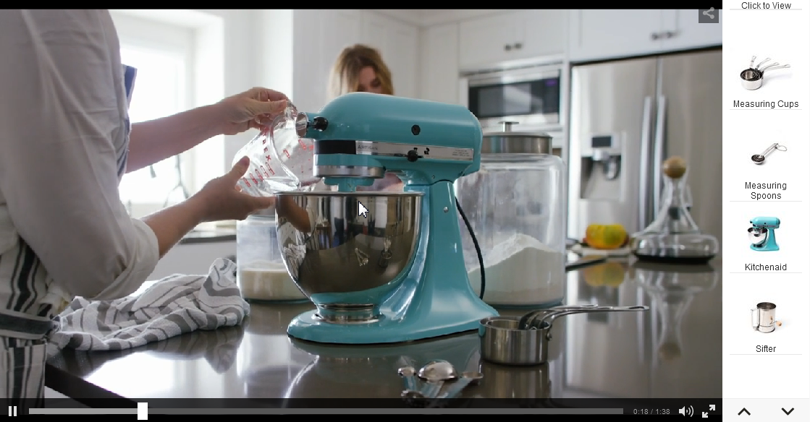
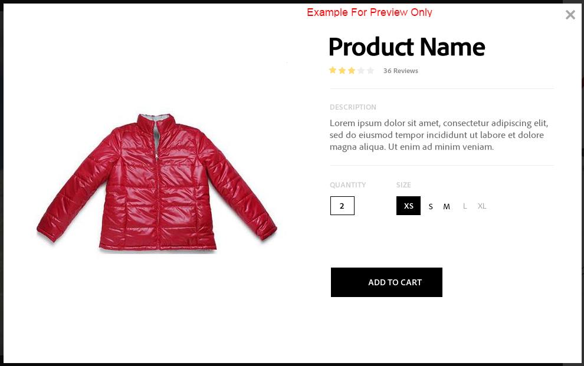

# Video interattivi{#interactive-videos}

Puoi creare facilmente video interattivi, noti anche come video acquistabili, che guidano la conversione direttamente dal video. Il coinvolgimento del cliente con il video si svolge in un pannello accanto al lettore video, in cui vengono scorsi i servizi correlati, le informazioni o le miniature dei prodotti in base a ciò che viene visualizzato nel video. I clienti possono selezionare la miniatura ed essere collegati direttamente al servizio, o aggiungere l’articolo al carrello per un acquisto immediato, o essere collegati a una pagina web per ulteriori informazioni.

Al termine del video, viene visualizzato un riepilogo visivo di tutte le offerte per guidare un call to action. I clienti hanno un&#39;altra opportunità per selezionare l&#39;elemento desiderato. Esperienze utilizzabili e specifiche come queste aumentano il coinvolgimento e le conversioni dei clienti.

Vedi anche [Immagini interattive](/help/assets/interactive-images.md).

## Video interattivo in azione {#interactive-video-in-action}

Per visualizzare un video interattivo e shoppable in azione, seleziona [Demo live](https://landing.adobe.com/en/na/dynamic-media/ctir-2755/live-demos.html), scorri fino all&#39;intestazione **[!UICONTROL File multimediali acquistabili]** nella pagina, quindi seleziona il video acquistabile.

* Durante la riproduzione, man mano che i prodotti vengono utilizzati nel video, il prodotto identico appare sulla destra come un&#39;immagine in miniatura.

* Seleziona la miniatura se desideri mettere in pausa il video e aprire la visualizzazione rapida del prodotto. Ad esempio, seleziona l’immagine della miniatura di KitchenAid nel video per avere una rotazione di 360 gradi del mixer, oppure ingrandisci per vedere i dettagli del mixer.

<!-- There was a link here that showed the video frame of an interactive video and when the reader selected the frame the video would play https://experienceleague.adobe.com/tools/dynamic-media-demo/shoppable-video/AXIS/index.html. This now needs to call a new interactive video-->

 *Un fotogramma video acquisito da un video interattivo e shoppable.*

>[!NOTE]
>
>Se crei un video interattivo per avviare una pagina web quando un utente seleziona una miniatura, alcuni dispositivi bloccano l’apertura della pagina web pop-up. In questi casi, è necessario modificare l&#39;impostazione del blocco dei popup sul dispositivo. In un Apple iPhone 6, ad esempio, passa a **[!UICONTROL Impostazioni]** > **Safari** > **Blocca popup**, quindi fai scorrere il controllo su **[!UICONTROL Disattivato]**. Ora, quando si riproduce un video interattivo e si seleziona una miniatura, viene richiesto se si desidera aprire il pop-up. Se accetti, viene visualizzata la pagina web.

### Guarda come vengono creati i video interattivi {#watch-how-interactive-videos-are-created}

Riproduci una procedura dettagliata sulla [creazione di video interattivi](https://s7d5.scene7.com/s7viewers/html5/VideoViewer.html?videoserverurl=https://s7d5.scene7.com/is/content/&emailurl=https://s7d5.scene7.com/s7/emailFriend&serverUrl=https://s7d5.scene7.com/is/image/&config=Scene7SharedAssets/Universal_HTML5_Video_social&contenturl=https://s7d5.scene7.com/skins/&asset=S7tutorials/InteractiveVideo) (7 minuti e 30 secondi).
Anche se la procedura dettagliata per i video è contrassegnata con Assets on Demand, i principi e i passaggi illustrati restano validi per i video interattivi in Adobe Experience Manager Assets.

### Webinar sulle soluzioni per i clienti di Adobe {#adobe-customer-success-webinar}

Il webinar &quot;Using Interactive Video, Link Sharing, and YouTube sharing in Experience Manager Assets&quot; (Utilizzo di video interattivi, condivisione di collegamenti e condivisione di in) illustra come utilizzare i video interattivi e altre funzioni per collegare eventi basati sulla conversione nei contenuti di video marketing.

<!-- NOT FOUND; FIND REPLACEMENT
>[!NOTE]
>
>[Using Interactive Video, Link Sharing, and YouTube sharing in Experience Manager Assets](https://adobecustomersuccess.adobeconnect.com/p1yxzdo4aec/). 
-->

## Guida introduttiva: Video interattivi {#quick-start-interactive-videos}

La seguente descrizione dettagliata del flusso di lavoro è progettata per aiutarti a iniziare rapidamente a utilizzare i video interattivi in Dynamic Media.

Cerca l&#39;intestazione **Esempio** all&#39;interno di alcune delle attività di avvio rapido. Contiene una breve esercitazione basata su questa pagina Web di dimostrazione iniziale a cui *non* è ancora stata aggiunta l&#39;interattività:

[https://experienceleague.adobe.com/tools/dynamic-media-demo/shoppable-video/john-lewis/landing-0.html](https://experienceleague.adobe.com/tools/dynamic-media-demo/shoppable-video/john-lewis/landing-0.html)

Gli **esempi** illustrano i passaggi necessari per integrare i video interattivi nel sito web.

Dopo aver completato l’esercitazione nell’ultima sezione di esempio, la pagina web demo finale con il video interattivo completamente integrato si presenta come segue:

[https://experienceleague.adobe.com/tools/dynamic-media-demo/shoppable-video/john-lewis/landing-3.html](https://experienceleague.adobe.com/tools/dynamic-media-demo/shoppable-video/john-lewis/landing-3.html)

Passaggi video interattivi:

1. **(Facoltativo) Identifica le variabili Quickview**. Per iniziare, identifica le variabili dinamiche utilizzate dall&#39;implementazione Quickview esistente. Le variabili vengono utilizzate per mappare le miniature del prodotto su Quickview corrispondente al momento della creazione del video interattivo. Vedere [(facoltativo) Identificare le variabili Quickview](#optional-identifying-quickview-variables).
   *Questo passaggio è necessario solo se sono soddisfatte tutte le condizioni seguenti*:
   * Per aggiungere interattività al video, attiva Quickview.
   * L&#39;implementazione di Experience Manager *non* utilizza un framework di integrazione eCommerce per estrarre i dati di prodotto in Experience Manager da qualsiasi soluzione di eCommerce come IBM® WebSphere® Commerce, Elastic Path, Hybris o Intershop. Consulta [Concetti di eCommerce in Experience Manager Assets](/help/commerce/cif-classic/administering/concepts.md).

1. **(Facoltativo) Crea un predefinito visualizzatore video interattivo**. Personalizza l&#39;aspetto e il comportamento dei vari componenti che compongono il lettore, ad esempio lo scorrimento video e le miniature interattive.
Non è necessario creare un predefinito visualizzatore video interattivo personalizzato se intendi utilizzare i predefiniti visualizzatore video interattivo predefiniti `Shoppable_Video_Light` o `Shoppable_Video_Dark`.
Consulta [Creare un predefinito visualizzatore](/help/assets/managing-viewer-presets.md#creating-a-new-viewer-preset) (facoltativo) e [Considerazioni speciali per la creazione di un predefinito visualizzatore interattivo](/help/assets/managing-viewer-presets.md#special-considerations-for-creating-an-interactive-viewer-preset).

1. **Carica un video e le risorse immagine associate**. Carica un video e le immagini associate da rendere interattivi.
Vedi [Caricare un video e le relative risorse miniature associate](#uploading-a-video-and-its-associated-thumbnail-assets).

   >[!NOTE]
   >
   >Il formato video MXF non è ancora supportato per l’utilizzo con video interattivi in Dynamic Media.

1. **Aggiungi interattività al video** - Aggiungi uno o più segmenti di tempo al video. Quindi, associa le miniature delle immagini all’interno di tali segmenti di tempo. Assegna ogni miniatura di immagine a un’azione come un collegamento ipertestuale, una visualizzazione rapida o un frammento di esperienza.
Il metodo di collegamento basato su URL non è possibile se il contenuto interattivo presenta collegamenti con URL relativi, in particolare collegamenti a pagine Experience Manager Sites.
Per terminare, pubblica le risorse video interattive. La pubblicazione crea il codice o l’URL da incorporare che alla fine copierai e applicherai alla pagina di destinazione del tuo sito web. Vedi [Aggiungi interattività al tuo video](#adding-interactivity-to-your-video).
Consulta [Pubblicare Assets](/help/assets/publishing-dynamicmedia-assets.md).

1. **Aggiungi un video interattivo al tuo sito Web o al tuo sito Web in Experience Manager**. Se usi Experience Manager Sites, eCommerce o entrambi, puoi aggiungere il video interattivo a una pagina Web. Trascina il componente File multimediali interattivi sulla pagina in Experience Manager. Consulta [Aggiungere Dynamic Media Assets alle pagine](/help/assets/adding-dynamic-media-assets-to-pages.md).
Utilizza il codice o l’URL da incorporare per integrare il video interattivo con le esperienze del sito web. Vedi [Integrare un video interattivo con il tuo sito Web](#integrating-an-interactive-video-with-your-website).
Se utilizzi una soluzione WCM (Web Content Manager) di terze parti, devi integrare il nuovo video interattivo con l’implementazione Quickview esistente utilizzata sul tuo sito web. Vedi [Integrare un video interattivo con un Quickview esistente](#integrating-an-interactive-video-with-an-existing-quickview).
   [Aggiungi Dynamic Media Assets alle pagine](/help/assets/adding-dynamic-media-assets-to-pages.md)

## (Facoltativo) Identificare le variabili Quickview {#optional-identifying-quickview-variables}

>[!NOTE]
>
>Questa attività è necessaria solo se:
>
>* Per aggiungere interattività al video, attiva Quickview.
>* L&#39;implementazione di Experience Manager *non* utilizza un framework di integrazione eCommerce per estrarre i dati di prodotto in Experience Manager da qualsiasi soluzione di eCommerce come IBM® WebSphere® Commerce, Elastic Path, Hybris o Intershop. Consulta [Concetti di eCommerce in Experience Manager Assets](/help/commerce/cif-classic/administering/concepts.md).
>
>Se l’implementazione di Experience Manager utilizza l’eCommerce, puoi saltare questa attività e passare a quella successiva.

Per iniziare, identifica le variabili dinamiche utilizzate dall’implementazione Quickview esistente in modo da poter mappare le miniature dei prodotti su Quickview corrispondente durante il processo di creazione video interattiva.

Quando aggiungi segmenti temporali a un video, assegni uno SKU (Stock Keeping Unit) ed eventuali variabili aggiuntive a ciascuna miniatura aggiunta a un segmento. Tali variabili vengono utilizzate successivamente per visualizzare il prodotto Quickview corretto.

È importante identificare correttamente le variabili necessarie per attivare in modo univoco Quickview di un prodotto.

A volte è sufficiente consultare gli specialisti IT responsabili dell&#39;implementazione Quickview esistente. È probabile che conoscano il set minimo di dati per identificare Quickview nel sistema. Tuttavia, è anche possibile semplicemente analizzare il comportamento esistente del codice front-end.

La maggior parte delle implementazioni Quickview utilizza il seguente paradigma:

* L’utente attiva un elemento dell’interfaccia utente sul sito web. Ad esempio, selezionando un pulsante &quot;Quickview&quot;.
* Il sito web invia una richiesta Ajax al backend per caricare i dati o il contenuto Quickview, se necessario.
* I dati Quickview vengono tradotti nel contenuto in preparazione al rendering sulla pagina web.
* Infine, il codice front-end riproduce visivamente tali contenuti sullo schermo.

L&#39;approccio, pertanto, consiste nel visitare diverse aree del sito Web esistente in cui è implementato Quickview, attivarlo e acquisire l&#39;URL Ajax inviato dalla pagina Web per il caricamento dei dati o del contenuto Quickview.

In genere non è necessario utilizzare strumenti di debug specifici. I browser web moderni dispongono di web inspector che svolgono un lavoro adeguato. Di seguito sono riportati alcuni esempi di browser Web che includono i controlli Web:

* Per visualizzare tutte le richieste HTTP in uscita in Google Chrome, premere **F12** (Windows) o **Comando+Opzioni+I** (Mac) per aprire il pannello Strumenti per sviluppatori, quindi selezionare la scheda **Rete**.

* In Firefox, è possibile attivare il plug-in Firebug premendo **F12** (Windows) o **Comando+Opzione+I** (Mac) e utilizzando la relativa scheda **`[Net]`**, oppure è possibile utilizzare lo strumento integrato Inspector e la relativa scheda Rete.

* In Internet Explorer, attivare lo strumento di debug premendo **F12**.

Quando il monitoraggio della rete è attivato nel browser, attiva Quickview sulla pagina.

Ora trova l’URL Ajax di Quickview nel registro di rete e copia l’URL registrato per l’analisi futura. Di solito, quando si attiva Quickview, ci sono numerose richieste inviate al server. In genere, l’URL Ajax di Quickview è uno dei primi dell’elenco. Ha una porzione o un percorso di stringa di query complesso e il relativo tipo MIME di risposta è `text/html`, `text/xml` o `text/javascript`.

Durante questo processo, è importante visitare diverse aree del sito web, con diverse categorie e tipi di prodotti. Il motivo è che gli URL Quickview possono avere parti comuni per una determinata categoria di siti Web, ma possono essere modificati solo se si visita un&#39;area diversa del sito Web.

Nel caso più semplice, l’unica parte variabile nell’URL di Quickview è lo SKU del prodotto. In questo caso, il valore SKU del prodotto è l’unico dato necessario per aggiungere le miniature a un segmento di tempo nel video interattivo in Experience Manager.

Tuttavia, in casi complessi, oltre allo SKU del prodotto, l’URL di Quickview presenta diversi elementi quali ID categoria, codice colore e codice di dimensione. In questi casi, ogni elemento di questo tipo diventa una variabile separata nella definizione dei dati delle miniature in Experience Manager.

Prendi in considerazione i seguenti esempi di URL Quickview e le variabili di miniatura risultanti:

<table>
  <tbody>
  <tr>
    <td><p>Singolo SKU, trovato nella stringa di query.</p> </td>
    <td><p>Gli URL registrati di Quickview includono:</p>
    <ul>
      <li><p><code>https://server/json?productId=866558&source=100</code></p> </li>
      <li><p><code>https://server/json?productId=1196184&source=100</code></p> </li>
      <li><p><code>https://server/json?productId=1081492&source=100</code></p> </li>
      <li><p><code>https://server/json?productId=1898294&source=100</code></p> </li>
    </ul> <p>L'unica parte variabile nell'URL è il valore del parametro della stringa di query <code>productId=</code> ed è chiaramente un valore SKU. Pertanto, le miniature richiedono solo campi SKU compilati con valori come <strong><code>866558</code></strong>, <strong><code>1196184</code></strong>, <strong><code>1081492</code></strong>, <strong><code>1898294</code></strong>.</p> </td>
  </tr>
  <tr>
    <td><p>Singolo SKU, trovato nel percorso URL.</p> </td>
    <td><p>Gli URL registrati di Quickview includono:</p>
    <ul>
      <li><p><code>https://server/product/6422350843</code></p> </li>
      <li><p><code>https://server/product/1607745002</code></p> </li>
      <li><p><code>https://server/product/0086724882</code></p> </li>
    </ul> <p>La parte variabile si trova nell'ultima parte del percorso e diventa il valore SKU delle miniature Experience Manager: <strong><code>6422350843</code></strong>, <strong><code>1607745002</code></strong>, <strong><code>0086724882</code></strong>.</p> </td>
  </tr>
  <tr>
    <td><p>SKU e ID categoria nella stringa query.</p> </td>
    <td><p>Gli URL registrati di Quickview includono:</p>
    <ul>
      <li><p><code>https://server/quickView/product/?category=1100004&prodId=305466</code></p> </li>
      <li><p><code>https://server/quickView/product/?category=1100004&prodId=310181</code></p> </li>
      <li><p><code>https://server/quickView/product/?category=1740148&prodId=308706</code></p> </li>
    </ul> <p>In questo caso, l’URL contiene due parti diverse. Lo SKU è archiviato nel parametro <code>prodId</code> e l'ID di categoria nel parametro <code>category=</code>.</p> <p>Di conseguenza, le definizioni delle miniature sono coppie. ovvero un valore SKU e una variabile aggiuntiva denominata <code>categoryId</code>. Le coppie risultanti sono le seguenti:</p>
    <ul>
      <li>Lo SKU è <code>305466</code> e <code>categoryId</code> è <code>1100004</code></li>
      <li>Lo SKU è <code>310181</code> e <code>categoryId</code> è <code>1100004</code></li>
      <li>Lo SKU è <code>308706</code> e <code>categoryId</code> è <code>1740148</code></li>
    </ul> <p> </p> </td>
  </tr>
  </tbody>
</table>

**Esempio**

Quando l’approccio di cui sopra viene applicato al sito web di esempio, hai una pagina web con diverse miniature di prodotto, ciascuna con un pulsante &quot;SEE MORE&quot; (VEDI ALTRO):

[https://experienceleague.adobe.com/tools/dynamic-media-demo/shoppable-video/john-lewis/landing-0.html](https://experienceleague.adobe.com/tools/dynamic-media-demo/shoppable-video/john-lewis/landing-0.html)

Dopo aver attivato tutti i prodotti Quickview disponibili nella pagina, si ottiene il seguente elenco di richieste Quickview effettuate al backend:

* datafeed/candles-233396346.json
* datafeed/candles-233978050.json
* datafeed/candles-234024346.json
* datafeed/candles-234024356.json
* datafeed/candles-234024359.json
* datafeed/cushions-233939848.json
* datafeed/cushions-234019477.json
* datafeed/cushions-234019483.json
* datafeed/furniture-231747479.json
* datafeed/furniture-232625621.json
* datafeed/furniture-232625626.json
* datafeed/furniture-233939810.json
* datafeed/furniture-233939825.json
* datafeed/furniture-233939828.json
* datafeed/furniture-233939853.json
* datafeed/furniture-233940334.json
* datafeed/glassware-000064007.json
* datafeed/glassware-230722193.json
* datafeed/glassware-233916550.json
* datafeed/glassware-233916597.json

Osservando le chiamate al server, puoi vedere che le informazioni specifiche per il prodotto sono presenti solo nel percorso della richiesta. Noterai inoltre che la stringa di query non viene utilizzata e che sono coinvolti due tipi distinti di parti di dati:

* Il primo tipo è candele, cuscini, mobili e oggetti in vetro. Puoi chiamare questa &quot;categoria di prodotto&quot;.
* Il secondo tipo è il codice del prodotto, ad esempio 233916597. Si può supporre che sia &quot;product SKU&quot;.

Considerate queste informazioni, l&#39;intero URL Quickview ha il seguente pattern:

`/datafeed/$categoryId$-$SKU$.json`

In base a tale analisi, si può concludere che è possibile utilizzare le due variabili seguenti per le miniature: `categoryId` e `SKU`.

Ora puoi caricare un video e le relative risorse miniature associate.

## (Facoltativo) Crea un predefinito visualizzatore video interattivo {#optional-creating-an-interactive-video-viewer-preset}

È possibile saltare questa attività e continuare con quella successiva se si intende utilizzare uno dei tipi predefiniti predefiniti di visualizzatore video interattivo predefiniti `Shoppable_Video_dark` o `Shoppable_Video_light`.

Quando si seleziona una miniatura nell&#39;ambiente di creazione, viene visualizzata un&#39;anteprima della finestra di dialogo Quickview.



Facoltativamente, puoi creare un predefinito visualizzatore video interattivo personalizzato. È possibile determinare, tra le altre cose, lo stile del lettore video, le miniature interattive e la visualizzazione griglia delle miniature visualizzata alla fine del video.

Un predefinito visualizzatore video interattivo esegue correttamente il rendering del video e di tutti i segmenti della timeline aggiunti. Utilizza anche un esempio di visualizzazione rapida predefinita quando selezioni una miniatura di prodotto in modalità Anteprima, in modo da verificarne l’interattività prima di pubblicarla.

Dopo aver salvato il predefinito visualizzatore, lo stato viene impostato automaticamente su **Il** nella pagina Predefiniti visualizzatore. Lo stato indica che è visibile nel componente Dynamic Media e ogni volta che lo si utilizza per visualizzare l’anteprima di un video. Accertati anche di pubblicare manualmente il nuovo predefinito visualizzatore.

Consulta [Creare un nuovo predefinito visualizzatore](/help/assets/managing-viewer-presets.md#creating-a-new-viewer-preset) per creare un predefinito visualizzatore video interattivo personalizzato.

## Caricare un video e le risorse miniatura associate {#uploading-a-video-and-its-associated-thumbnail-assets}

Se hai già caricato le risorse video e delle miniature, passa a [Aggiungi interattività al tuo video](#adding-interactivity-to-your-video).

>[!NOTE]
>
>Il formato video MXF non è ancora supportato per l’utilizzo con video interattivi in Dynamic Media.

Se hai caricato video o immagini errati o desideri eliminare video o immagini caricati di cui non hai più bisogno, consulta [Elimina risorse](/help/assets/manage-assets.md#deleting-assets).

Per caricare un video e le risorse miniatura associate:

1. Carica il video e le risorse miniature associate nella cartella o nelle cartelle desiderate.

   Consulta [Caricare risorse](/help/assets/manage-assets.md).
Consulta [Caricare risorse utilizzando la pianificazione dei processi FTP](/help/assets/manage-assets.md).

   Ora aggiungi l’interattività al video.

## Aggiungi interattività al video {#adding-interactivity-to-your-video}

I segmenti della timeline vengono aggiunti a un video mediante l’editor visivo locale nella pagina Crea video interattivo.

Dopo aver aggiunto i segmenti della timeline, puoi aggiungere miniature all’interno di ciascun segmento. A ogni miniatura aggiunta viene applicata un&#39;azione. Ad esempio, puoi applicare una visualizzazione rapida alla miniatura, assegnare un collegamento ipertestuale alla miniatura o un frammento di esperienza.

Vedi [Frammenti esperienza](/help/sites-authoring/experience-fragments.md).

>[!NOTE]
>
>Gli strumenti per la condivisione di social media nei video interattivi non sono supportati quando si incorpora il visualizzatore in un frammento di esperienza. Per risolvere questo problema, puoi utilizzare o creare predefiniti visualizzatore che non dispongono di strumenti per la condivisione sui social media. Tali predefiniti visualizzatore consentono di incorporarli correttamente in Frammenti esperienza.

>[!NOTE]
>
>Il metodo di collegamento basato su URL non è possibile se il contenuto interattivo presenta collegamenti con URL relativi, in particolare collegamenti a pagine Experience Manager Sites.

Le opzioni Annulla e Ripristina, posizionate nell&#39;angolo superiore destro della pagina, sono supportate durante la sessione di creazione/modifica corrente.

Dopo aver salvato il video interattivo, questo viene aperto immediatamente in Anteprima. Da qui, puoi selezionare un predefinito visualizzatore video interattivo e riprodurre il video per vedere una rappresentazione approssimativa di come appare ai clienti.

**Per aggiungere interattività al video:**

1. Nella vista Assets, individua il video caricato e vuoi renderlo interattivo.
1. Effettua una delle seguenti operazioni:

   * Passa il mouse sull&#39;immagine, quindi seleziona **[!UICONTROL Seleziona]** (icona a forma di segno di spunta). Sulla barra degli strumenti, selezionare **[!UICONTROL Modifica]**.

   * Passa il mouse sull&#39;immagine, quindi seleziona **[!UICONTROL Altre azioni]** (icona a tre punti) **[!UICONTROL > Modifica]**.

   * Selezionare l&#39;immagine in modo da poterla aprire nella pagina Visualizzazione dettagli. Sulla barra degli strumenti, selezionare **[!UICONTROL Modifica]**.

1. Nella pagina Crea video interattivo eseguire una delle operazioni seguenti:

   * Per iniziare a riprodurre il video, seleziona il pulsante **[!UICONTROL Riproduci]**. Quando un particolare prodotto, servizio o dettaglio che desideri evidenziare viene visualizzato, seleziona **[!UICONTROL Aggiungi segmento]** nella barra degli strumenti. Ripeti l’operazione fino al raggiungimento della fine del video.

     Per ogni segmento aggiunto, assegnare una o più miniature e collegarle alle pagine dei prodotti Quickview per consentire ai clienti di acquistare o alle pagine Web per ulteriori informazioni.

   * Per iniziare a riprodurre il video, seleziona il pulsante **[!UICONTROL Riproduci]**. Quando viene visualizzato un particolare prodotto, servizio o dettaglio che si desidera evidenziare, selezionare **[!UICONTROL Pausa]**. Seleziona **[!UICONTROL Aggiungi segmento]**.

     Continua a riprodurre e a mettere in pausa il video in corrispondenza dei punti lungo la timeline in cui desideri aggiungere un segmento fino a raggiungere la fine del video.

1. (Facoltativo) Trascina la barra sul dispositivo di scorrimento **[!UICONTROL Scala timeline]** a sinistra per ingrandire o a destra per ridurre, in modo da controllare il livello di dettagli visualizzati dei segmenti aggiunti.

   

   A seconda della lunghezza del video, il valore predefinito per Durata segmento è i seguenti:

   <table>
      <tbody>
        <tr>
        <td><strong>Se la lunghezza del video è...</strong></td>
        <td><strong>L’impostazione predefinita della Durata del segmento è...</strong></td>
        </tr>
        <tr>
        <td>3 minuti o più</td>
        <td>60 secondi</td>
        </tr>
        <tr>
        <td>2-3 minuti</td>
        <td>30 secondi</td>
        </tr>
        <tr>
        <td>1-2 minuti</td>
        <td>20 secondi<br /> </td>
        </tr>
        <tr>
        <td>30-60 secondi</td>
        <td>10 secondi</td>
        </tr>
        <tr>
        <td>30 secondi o meno</td>
        <td>5 secondi</td>
        </tr>
      </tbody>
    </table>

   La timeline del video utilizza tanto spazio sullo schermo quanto ciò che viene reso disponibile. Di conseguenza, i segmenti aggiunti mantengono la larghezza corretta quando il browser viene ridimensionato.

   Ad esempio, le tre schermate seguenti utilizzano lo stesso video. La larghezza di ciascun segmento varia a seconda dell&#39;impostazione Scala timeline.

   

   Schermata A

   La schermata A precedente mostra la visualizzazione predefinita di un video di prodotto di 29 secondi. La scala timeline è impostata sul valore predefinito di 5 secondi.

   

   Schermata B

   Nella schermata B precedente, il cursore Scala timeline veniva trascinato dal valore predefinito di 5 secondi a 3 secondi. I singoli timestamp della scala timeline ora sono tutti impostati a intervalli di 3 secondi.

   

   Schermata C

   Nella schermata C precedente, l’impostazione Scala timeline è stata spostata a 8 secondi. Nota come si sono ridotti i segmenti che contengono le miniature dei prodotti. Questa modalità di zoom out è utile quando si dispone di un video lungo e si desidera avere una panoramica di più segmenti che normalmente rientrano nella larghezza della pagina.

1. (Facoltativo) Effettua una delle seguenti operazioni:

   * Per regolare l’ora di inizio e di fine di un segmento.

     Seleziona un segmento, quindi trascina l’ovale blu iniziale o finale per regolare rispettivamente l’ora di inizio o di fine. Il fotogramma video visualizzato si sposta nel tempo appropriato nel video, in base alle regolazioni. Il movimento del segmento della timeline è limitato in base a qualsiasi segmento adiacente nella timeline. Il tempo minimo consentito per il segmento è di un secondo.

     Utilizza i seguenti tasti di scelta rapida per verificare e perfezionare rapidamente i segmenti video:

      * Per cercare il video direttamente all’inizio di quel segmento, seleziona l’ovale blu iniziale.
      * Per cercare il video direttamente alla fine di quel segmento, selezionate l&#39;ovale blu finale.
      * Per riportare la riproduzione video all’inizio di quel segmento, seleziona l’intero segmento.

   

   Riposizionamento della fine di un segmento della timeline

   * Per eliminare un segmento

     Seleziona l&#39;ultimo segmento presente nella timeline, quindi sulla barra degli strumenti seleziona **[!UICONTROL Elimina segmento]**. Se sono selezionati due o più segmenti, **[!UICONTROL Elimina segmento]** è disabilitato.

     Puoi eliminare solo l’ultimo segmento. Ad esempio, se desideri eliminare tutti i segmenti sulla timeline, seleziona sempre l&#39;ultimo, quindi seleziona **[!UICONTROL Elimina segmento]**.

1. Selezionare un segmento di tempo a cui si desidera associare una o più immagini in miniatura.
1. A destra del video, seleziona la scheda **[!UICONTROL Contenuto]**.
1. Nella scheda Contenuto, seleziona **[!UICONTROL Seleziona Assets]**, quindi sfoglia e seleziona tutte le risorse di immagini che desideri utilizzare con il video. Le risorse selezionate vengono aggiunte al pannello Selettore risorse nella scheda Contenuto.

1. Nel selettore delle risorse sotto la scheda Contenuto, effettua una delle seguenti operazioni:

   <table>
      <tbody>
        <tr>
        <td>Per associare una miniatura al segmento della timeline selezionato</td>
        <td><p>Seleziona l’immagine nel pannello del selettore risorse a destra.</p> <p>Puoi aggiungere tutte le miniature che desideri a un segmento della timeline. Per ogni immagine selezionata, viene visualizzato un segno di spunta sopra l’immagine nel selettore delle risorse.</p> </td>
        </tr>
        <tr>
        <td>Per rimuovere una miniatura dal segmento della timeline selezionato</td>
        <td><p>Effettua una delle seguenti operazioni:</p>
          <ul>
          <li>Nel pannello del selettore delle risorse, seleziona un’immagine con un segno di spunta per deselezionarla. La risorsa immagine è stata rimossa dal segmento della timeline.<br /> </li>
          <li>Nel segmento della timeline selezionato, seleziona un'immagine, quindi sulla barra degli strumenti seleziona <strong>Elimina prodotto</strong>.</li>
          </ul> </td>
        </tr>
      </tbody>
    </table>

   

   Selezionando un’immagine nel pannello di selezione delle risorse, questa viene aggiunta al segmento della timeline selezionato.

1. Seleziona una singola miniatura in uno dei segmenti della timeline, quindi seleziona la scheda **[!UICONTROL Azioni]**.
1. Effettua una delle seguenti operazioni:
   <table> 
    <tbody> 
      <tr> 
      <td>Per associare l'immagine miniatura selezionata a una visualizzazione rapida</td> 
      <td><p>In Tipo azione, selezionare <strong>Quickview</strong>.</p> <p>Se sei un cliente Experience Manager Sites ed e-commerce:</p> 
       <ul> 
       <li>Il campo di testo Valore SKU è precompilato con lo SKU (Stock Keeping Unit) del prodotto selezionato, che è un identificatore univoco per ogni prodotto o servizio specifico offerto. Questo valore viene popolato automaticamente quando l’immagine è associata a un prodotto in Experience Manager Commerce.</li> 
       <li>Se lo SKU precompilato non è corretto, seleziona l’icona del selettore prodotti (lente di ingrandimento) per aprire la pagina Seleziona prodotto. Seleziona il prodotto da utilizzare, quindi fai clic sul segno di spunta nell’angolo superiore destro della pagina per tornare all’Editor video interattivo.</li> 
       </ul> <p> Se sei <em>not</em> un cliente Experience Manager Sites o e-commerce</p> 
       <ul> 
       <li>Vedere <a href="/help/assets/carousel-banners.md#identifying-hotspot-and-image-map-variables">Identificazione delle variabili hotspot</a>. Le variabili devono essere definite.  </li> 
       <li>Per impostazione predefinita, questo campo SKU utilizza il nome del file della risorsa immagine senza l’estensione. Se segui una convenzione di denominazione standard per i file basati sullo SKU, in genere questo nome di file non richiede ulteriori modifiche. </li> 
       <li>In caso contrario, modificate il valore predefinito e immettete il valore SKU corretto. Nel campo di testo Valore SKU digitare la SKU (Stock Keeping Unit) del prodotto, che rappresenta un identificatore univoco per ogni prodotto o servizio specifico offerto. Il valore SKU immesso popola automaticamente la parte variabile del modello Quickview in modo che il sistema sappia associare l'immagine selezionata alla Quickview di una particolare SKU.</li> 
       </ul> <p>(Facoltativo) Se in Quickview sono presenti altre variabili che è necessario utilizzare per identificare ulteriormente un prodotto, selezionare <strong>Aggiungi variabile generica</strong>. Nel campo di testo, specifica una variabile aggiuntiva. <code>category=Womens</code> è ad esempio una variabile aggiunta.</p> <p> </p> </td> 
      </tr> 
      <tr> 
      <td>Per associare la miniatura selezionata a un collegamento ipertestuale</td> 
      <td><p>In Tipo azione, selezionare <strong>Collegamento ipertestuale</strong>, quindi eseguire una delle operazioni seguenti:</p> 
       <ul> 
       <li>Se sei un cliente di Experience Manager Sites, seleziona l’icona Selettore sito (cartella) per passare a una pagina web. Il metodo di collegamento basato su URL non è possibile se il contenuto interattivo presenta collegamenti con URL relativi, in particolare collegamenti a pagine Experience Manager Sites.</li> 
       <li>Se sei un cliente Dynamic Media indipendente, specifica il percorso URL completo di una pagina web collegata nel campo di testo HREF.</li> 
       </ul> <p>Assicurati di specificare se aprire il collegamento in una nuova scheda del browser o nella scheda corrente.</p> </td> 
      </tr> 
      <tr> 
      <td>Per associare l'immagine miniatura selezionata a un frammento esperienza</td> 
      <td><p>In Tipo azione, seleziona <strong>Frammento esperienza</strong>, quindi effettua le seguenti operazioni:<p> 
       <ul> 
       <li>Se sei un cliente di Experience Manager Sites, seleziona l’icona Ricerca (lente di ingrandimento) per aprire la pagina Frammento esperienza. Seleziona il frammento di esperienza da utilizzare, quindi seleziona <strong>Seleziona </strong> nell'angolo superiore destro della pagina per tornare al pannello Azioni nella pagina precedente.<br /> Vedi <a href="/help/sites-authoring/experience-fragments.md">Frammenti esperienza</a>.</li> 
      </ul> 
       <ul> 
       <li>Specifica la larghezza e l’altezza del frammento di esperienza da visualizzare nel video.</li>
       </ul><strong>Nota</strong>: gli strumenti per la condivisione di social media nel video interattivo non sono supportati quando si incorpora il visualizzatore in un frammento di esperienza. Per risolvere questo problema, puoi utilizzare o creare predefiniti visualizzatore che non dispongono di strumenti per la condivisione sui social media. Tali predefiniti visualizzatore consentono di incorporarli correttamente in Frammenti esperienza.</p></tr>&lt; 
      <tr> 
      <td>Per modificare un'azione già assegnata a un'immagine di miniatura</td> 
      <td>All'interno di un segmento della timeline, selezionate un'immagine di miniatura con un collegamento a catena a destra dell'etichetta di testo. Il collegamento a catena indica che è stata assegnata un'azione. Seleziona la scheda <strong>Azioni</strong> per apportare le modifiche.</td> 
      </tr> 
      <tr> 
      <td>Per modificare l'etichetta di testo di un'immagine miniatura</td> 
      <td><p>Per impostazione predefinita, l'etichetta di testo utilizza il campo di metadati <code>Title</code> dell'immagine miniatura. Se <code>Title</code> non è presente, viene utilizzato il nome file dell'immagine miniatura, ma senza l'estensione.</p> <p>Per modificare l'etichetta di testo di un'immagine miniatura, nella scheda <strong>Azioni </strong>, sotto la risorsa immagine visualizzata, immettere il testo desiderato. Vedi la schermata seguente.</p> <p>La nuova etichetta di testo viene utilizzata solo dal lettore video stesso e dal testo della miniatura visualizzato nel segmento della timeline. La modifica dell’etichetta non influisce sul campo di metadati Titolo dell’immagine miniatura né sul suo nome file.</p> </td> 
      </tr> 
      <tr> 
      <td>Per ripristinare una modifica:</td> 
      <td>Nell'angolo superiore destro della pagina, selezionare <strong>Annulla</strong> o <strong>Ripristina</strong>.</td> 
      </tr> 
    </tbody> 
   </table>

   

   All&#39;immagine di anteprima viene aggiunta una nuova etichetta di testo.

1. Effettua una delle seguenti operazioni:

   * Ripeti i passaggi 6-11 per aggiungere altre immagini in miniatura ai segmenti della timeline nel video.
   * Continuare con il passaggio facoltativo 13.

1. (Facoltativo) Effettuate una delle seguenti operazioni:

   * **[!UICONTROL Unisci segmento]** - Puoi combinare due segmenti adiacenti (con o senza miniature di prodotto assegnate) in un unico segmento.

     Nella timeline, seleziona due o più segmenti contigui da unire in uno. Non sono presenti maniglie di trascinamento ovali blu sui due segmenti selezionati nella schermata seguente.

     Seleziona **[!UICONTROL Unisci segmento]** nella barra degli strumenti.

   

   Unione di due segmenti selezionati di cinque secondi in un segmento di dieci secondi.

   * **[!UICONTROL Dividi segmento]** - Puoi dividere un singolo segmento in due segmenti di tempo uguali. Se al segmento sono già state assegnate delle miniature di prodotto, queste vengono combinate nel segmento sinistro.

     Nella timeline, seleziona un segmento da dividere a metà, quindi seleziona **[!UICONTROL Dividi segmento]** sulla barra degli strumenti.

     Selezionando due o più segmenti si disabilita la funzionalità **[!UICONTROL Dividi segmento]**.

   

   Dividere un segmento selezionato di dieci secondi in due segmenti di cinque secondi ciascuno.

1. Nell&#39;angolo superiore destro della pagina **[!UICONTROL Crea video interattivo]** viene visualizzato il nome del predefinito visualizzatore attualmente selezionato utilizzato con il video. Se desideri selezionare un predefinito visualizzatore diverso, seleziona il nome.

   Ad esempio, il predefinito visualizzatore `Shoppable_Video_light` consente di riprodurre il video con un&#39;area di visualizzazione bianca accanto al video. Nell&#39;area di visualizzazione vengono visualizzate le miniature selezionabili durante la riproduzione. Il predefinito visualizzatore `Shoppable_Video_dark` consente di riprodurre il video con un&#39;area di visualizzazione nera accanto al video.

   Se hai creato un predefinito visualizzatore video interattivo, questo viene visualizzato nell’elenco dei predefiniti tra cui puoi scegliere.

   Al termine, selezionare **[!UICONTROL Salva]**.

   >[!NOTE]
   >
   >Quando salvi il video interattivo, con esso viene salvato automaticamente un file associato `.vtt`. Il file `.vtt` è stato salvato nella cartella `_VTT` nella radice di **[!UICONTROL Assets]**. Il file e la cartella sono necessari affinché il video interattivo possa essere riprodotto correttamente sul sito web. Non spostare, modificare o eliminare la cartella `_VTT` o il relativo contenuto.

1. Pubblica il video interattivo. La pubblicazione crea il codice o l’URL da incorporare che alla fine copierai e incollerai nelle esperienze del sito web.

   Se è stata aggiunta l&#39;interattività con Quickview, utilizzare solo il codice di incorporamento; se è stata aggiunta l&#39;interattività con pagine Web con collegamenti ipertestuali, è possibile utilizzare anche l&#39;URL pubblicato. Tuttavia, il metodo di collegamento basato su URL non è possibile se il contenuto interattivo presenta collegamenti con URL relativi, in particolare collegamenti a pagine Experience Manager Sites.

   Consulta [Pubblicare risorse](publishing-dynamicmedia-assets.md).

   >[!NOTE]
   >
   >Per pubblicare un video acquistabile con Quickview, assicurati anche di pubblicare separatamente ciascuna delle risorse immagine correlate del video dalla tua area di e-commerce.

   Dopo aver aggiunto i segmenti della timeline e pubblicato il video interattivo, puoi aggiungerlo alla pagina di destinazione del sito web esistente. Vedi [Integrare un video interattivo con il tuo sito Web](#integrating-an-interactive-video-with-your-website).

## Pubblicare risorse video interattive {#publishing-interactive-video-assets}

Consulta [Pubblicare risorse](/help/assets/publishing-dynamicmedia-assets.md) per informazioni dettagliate su come pubblicare risorse video interattive.

## Integrare un video interattivo con il sito Web {#integrating-an-interactive-video-with-your-website}

Dopo aver caricato un video, aggiunto segmenti di timeline e pubblicato il video interattivo, puoi aggiungerlo al sito web esistente.

I clienti di Experience Manager Sites possono aggiungere il video interattivo trascinando il componente File multimediali interattivi nella pagina. Consulta [Aggiungere risorse Dynamic Media alle pagine](/help/assets/adding-dynamic-media-assets-to-pages.md).

Se sei un cliente Experience Manager Assets indipendente, puoi aggiungere manualmente il video interattivo al sito web come descritto in questa sezione.

1. Copia il codice di incorporamento o l&#39;URL del video interattivo pubblicato.
Vedi [Incorporare il visualizzatore di video o immagini in una pagina Web](/help/assets/embed-code.md).
Se è stata aggiunta l&#39;interattività con Quickview, utilizzare solo il codice di incorporamento; se è stata aggiunta l&#39;interattività con pagine Web con collegamenti ipertestuali, è possibile utilizzare anche l&#39;URL pubblicato. Tuttavia, il metodo di collegamento basato su URL non è possibile se il contenuto interattivo presenta collegamenti con URL relativi, in particolare collegamenti a pagine Experience Manager Sites.

1. Nel codice della pagina web di destinazione, identifica dove si trova il video statico.
1. Rimuovi il video statico e sostituisci il codice con il codice o l&#39;URL da incorporare copiato da Experience Manager Assets, così come è.
Il codice di incorporamento copiato è impostato per un ambiente reattivo e si adatta automaticamente all’area precedentemente occupata dal video statico.

>[!NOTE]
>
>A questo punto, se hai aggiunto interattività solo con pagine web con collegamenti ipertestuali, hai chiuso.
>
>Tuttavia, se avete aggiunto un&#39;interattività per attivare una Quickview, le miniature accanto al video interattivo sono solo a scopo di visualizzazione e non sono ancora integrate con la Quickview esistente. In questi casi, è necessario integrare il video interattivo con Quickview esistente sul sito Web.

**Esempio**

Utilizzando il sito web demo come esempio:

[https://experienceleague.adobe.com/tools/dynamic-media-demo/shoppable-video/john-lewis/landing-0.html](https://experienceleague.adobe.com/tools/dynamic-media-demo/shoppable-video/john-lewis/landing-0.html)

Il codice di incorporamento è standard:

```xml
<style type="text/css">
 #s7video_div.s7videoviewer{
   width:100%;
   height:auto;
 }
</style>

<script type="text/javascript" src="https://demos-pub.assetsadobe.com/etc/dam/viewers/s7viewers/html5/js/VideoViewer.js"></script>
<div id="s7video_div"></div>
<script type="text/javascript">
 var s7videoviewer = new s7viewers.VideoViewer({
  "containerId" : "s7video_div",
  "params" : {
   "serverurl" : "https://adobedemo62-h.assetsadobe.com/is/image",
   "contenturl" : "https://demos-pub.assetsadobe.com/",
   "config" : "/etc/dam/presets/viewer/Video",
   "config2": "/etc/dam/presets/analytics",
   "videoserverurl": "https://gateway-na.assetsadobe.com/DMGateway/public/demoCo",
   "posterimage": "/content/dam/marketing/shoppable-video/john-lewis/shoppable-video-john-lewis-2014.mp4",
   "asset" : "/content/dam/marketing/shoppable-video/john-lewis/shoppable-video-john-lewis-2014.mp4" }
 }).init();
</script>
```

L’integrazione è semplice come rimuovere il codice di incorporamento video e sostituirlo con il codice di incorporamento video interattivo da Experience Manager. I risultati sono disponibili al seguente URL. Anche se mostra un video interattivo presente nella pagina, non è ancora integrato con la Quickview esistente:

[https://experienceleague.adobe.com/tools/dynamic-media-demo/shoppable-video/john-lewis/landing-1.html](https://experienceleague.adobe.com/tools/dynamic-media-demo/shoppable-video/john-lewis/landing-1.html)

## Integrare un video interattivo con un Quickview esistente {#integrating-an-interactive-video-with-an-existing-quickview}

>[!NOTE]
>
>Questa attività si applica solo se sei un cliente Experience Manager Assets autonomo.

L’ultimo passaggio di questo processo consiste nell’integrare il video interattivo con un’implementazione Quickview esistente utilizzata sul sito web. Non esiste una soluzione all’integrazione che funzioni per tutti i casi. Ogni implementazione Quickview è univoca. Di conseguenza, è necessario un approccio specifico che coinvolga l’assistenza di una persona IT front-end.

L’implementazione Quickview esistente rappresenta in genere una catena di azioni correlate che si verificano sulla pagina web nell’ordine seguente:

1. Un utente attiva un elemento nell’interfaccia utente del sito web.
1. Il codice front-end ottiene un URL Quickview basato sull’elemento dell’interfaccia utente attivato nel passaggio 1.
1. Il codice front-end invia una richiesta AJAX utilizzando l’URL ottenuto nel passaggio 2.
1. La logica di back-end restituisce i dati o il contenuto Quickview corrispondenti al codice front-end.
1. Il codice front-end carica i dati o il contenuto Quickview.
1. Facoltativamente, il codice front-end converte i dati Quickview caricati in una rappresentazione HTML.
1. Il codice front-end visualizza una finestra di dialogo o un pannello modale ed esegue il rendering del contenuto HTML sullo schermo per l’utente finale.

Queste chiamate non rappresentano chiamate API pubbliche indipendenti che possono essere chiamate dalla logica della pagina web da un passaggio arbitrario. Si tratta invece di una chiamata concatenata in cui ogni passaggio successivo è nascosto nell’ultima fase (callback) del passaggio precedente.

Allo stesso tempo in cui il video interattivo sostituisce il passaggio 1 e parzialmente il passaggio 2, quando un utente seleziona una miniatura all’interno del video interattivo, tale interazione viene gestita dal visualizzatore. Il visualizzatore restituisce alla pagina web un evento contenente tutti i dati delle miniature precedentemente aggiunti ad Experience Manager.

In un gestore eventi di questo tipo il codice front-end esegue le seguenti operazioni:

* Ascolta un evento emesso dal video interattivo.
* Costruisce un URL Quickview in base ai dati delle miniature.
* Attiva il processo di caricamento di Quickview dal backend e di rendering sullo schermo per la visualizzazione.

Inoltre, il visualizzatore video interattivo supporta la modalità di funzionamento a schermo intero. L’utente finale attiva Quickview selezionando una miniatura senza uscire dallo schermo intero. Per ottenere questa funzionalità, modificate il codice front-end in modo che la finestra di dialogo modale Quickview sia collegata al contenitore del visualizzatore. Non aggiungere il BODY del documento o altri elementi della pagina web che non sono disponibili quando il visualizzatore è in modalità a schermo intero. Il codice che esegue questo processo deve ascoltare uno o più callback del visualizzatore inviati dopo il visualizzatore che viene caricato sulla pagina.

Il codice di incorporamento restituito da Experience Manager dispone già di un gestore eventi pronto all’uso. Viene commentato come mostrato nel seguente snippet di codice evidenziato:

```xml
<style type="text/css">
 #s7interactivevideo_div.s7interactivevideoviewer{
   width:100%;
   height:auto;
 }
</style>
<script type="text/javascript" src="https://demos-pub.assetsadobe.com/etc/dam/viewers/s7viewers/html5/js/InteractiveVideoViewer.js"></script>

<div id="s7interactivevideo_div"></div>
<script type="text/javascript">
 var s7interactivevideoviewer = new s7viewers.InteractiveVideoViewer({
  "containerId" : "s7interactivevideo_div",
  "params" : {
   "serverurl" : "https://adobedemo62-h.assetsadobe.com/is/image",
   "contenturl" : "https://demos-pub.assetsadobe.com/",
   "config" : "/etc/dam/presets/viewer/Shoppable_Video_light",
   "config2": "/etc/dam/presets/analytics",
   "videoserverurl": "https://gateway-na.assetsadobe.com/DMGateway/public/demoCo",
   "interactivedata": "content/dam/_VTT/marketing/shoppable-video/john-lewis/shoppable-video-john-lewis-2014.mp4.svideo.vtt",
   "VideoPlayer.contenturl": "https://adobedemo62-h.assetsadobe.com/is/content",
   "asset" : "/content/dam/marketing/shoppable-video/john-lewis/shoppable-video-john-lewis-2014.mp4" }
 })
 /* // Example of interactive video event for quickview.
   s7interactivevideoviewer.setHandlers({
   "quickViewActivate": function(inData) {
     var sku=inData.sku; //SKU for product ID
    //To pass other parameter from the hotspot, you need to add custom parameter during the hotspot setup as parameterName=value
    loadQuickView(sku); //Replace this call with your quickview plugin
    //See your quickviewer plugin for the quickview call
    },
"initComplete":function() {
    //--- Attach quickview popup to viewer container so popup will work in fullscreen mode ---
    var popup = document.getElementById('quickview_div'); // get custom quickview container
    popup.parentNode.removeChild(popup); // remove it from current DOM
    var sdkContainerId = s7interactivevideoviewer.getComponent("container").getInnerContainerId(); // get viewer container component
    var inner_container = document.getElementById(sdkContainerId);
    inner_container.appendChild(popup); //Attach custom quickview container to viewer
    }
   });
 */
 s7interactivevideoviewer.init();
</script>
```

Pertanto, è sufficiente rimuovere il commento dal frammento di codice evidenziato e sostituire il corpo dei gestori fittizi con codice specifico per la pagina web in questione.

Nel codice di incorporamento standard sono presenti due gestori di callback predefiniti: `quickViewActivate` e `initComplete`. Il gestore `quickViewActivate` viene attivato quando si seleziona una miniatura nel visualizzatore. Utilizzala per integrare il visualizzatore con la logica di attivazione Quickview. Il gestore `initComplete` viene attivato una sola volta quando il visualizzatore viene caricato nella pagina. Questo gestore viene utilizzato per regolare la posizione della finestra di dialogo Quickview nel DOM della pagina Web.

Il processo di costruzione dell’URL Quickview è opposto al processo di identificazione delle variabili di miniatura descritto in precedenza in questo argomento. Utilizzando gli esempi di URL di Quickview identificati in precedenza, puoi vedere come viene costruito l’URL di Quickview in ogni caso:

<table>
  <tbody>
  <tr>
    <td><p>SKU singola, trovata nella stringa di query</p> </td>
    <td><code class="code">s7interactivevideoviewer.setHandlers(&lbrace;
      "quickViewActivate": function(inData) &lbrace;
      var quickViewUrl = "https://server/json?productId=" + inData.sku + "&amp;source=100";
      &rbrace;,
      &rbrace;);</code></td>
  </tr>
  <tr>
    <td>SKU singola, trovata nel percorso URL</td>
    <td><code class="code">s7interactivevideoviewer.setHandlers(&lbrace;
      "quickViewActivate": function(inData) &lbrace;
      var quickViewUrl = "https://server/product/" + inData.sku;
      &rbrace;,
      &rbrace;);</code></td>
  </tr>
  <tr>
    <td><p>SKU e ID categoria nella stringa query</p> </td>
    <td><code class="code">s7interactivevideoviewer.setHandlers(&lbrace;
      "quickViewActivate": function(inData) &lbrace;
      var quickViewUrl = "https://server/quickView/product/?category=" + inData.categoryId + "&amp;prodId=" + inData.sku;
      &rbrace;,
      &rbrace;);</code></td>
  </tr>
  </tbody>
</table>

L’ultimo passaggio per attivare l’URL Quickview e il pannello Quickview richiede probabilmente l’assistenza di un responsabile IT front-end del reparto IT. Possiedono le conoscenze necessarie per sapere come attivare con precisione l’implementazione Quickview dal passaggio corretto, avendo un URL Quickview pronto all’uso.

Puoi vedere come questi passaggi vengono applicati al sito web demo per integrare completamente un video interattivo con il codice Quickview. In precedenza, in questo argomento, la struttura dell’URL Quickview era identificata come segue:

```xml
/datafeed/$CategoryId$-$SKU$.json
```

È facile ricostruire questo URL all&#39;interno del gestore `quickViewActivate` utilizzando i campi `categoryId` e `sku` disponibili nell&#39;oggetto `inData` passato al gestore tramite il codice del visualizzatore come indicato di seguito:

```xml
var sku=inData.sku;
var categoryId=inData.categoryId;
var quickViewUrl = "datafeed/" + categoryId + "-" + sku + ".json";
```

Il sito Web demo sta attivando la finestra di dialogo Quickview utilizzando una semplice chiamata alla funzione `loadQuickView()`. Questa funzione accetta un solo argomento, ovvero l’URL dati Quickview. Pertanto, l&#39;ultimo passaggio per integrare il video interattivo consiste nell&#39;aggiungere la seguente riga di codice al gestore `quickViewActivate`:

```xml
loadQuickView(quickViewUrl);
```

Infine, assicurarsi che la finestra di dialogo Quickview sia collegata all&#39;elemento contenitore del visualizzatore. Il codice incorporato fornisce passaggi di esempio per ottenere questa funzionalità. Per ottenere un riferimento all’elemento contenitore del visualizzatore, puoi utilizzare le seguenti righe di codice:

```xml
var sdkContainerId = s7interactivevideoviewer.getComponent("container").getInnerContainerId(); // get viewer container component
var inner_container = document.getElementById(sdkContainerId);
```

Dove `inner_container` è un riferimento a un elemento `DIV` gestito dal visualizzatore. Si desidera che la finestra di dialogo sia figlio di `DIV`.

I passaggi per individuare effettivamente l’elemento della finestra di dialogo modale e allegarlo al contenitore di cui sopra sono specifici per maiuscole e minuscole. Anche in questo caso, puoi chiedere aiuto allo sviluppatore front-end che ha familiarità con l’implementazione Quickview necessaria.

Se si utilizza il sito Web di esempio, la finestra di dialogo modale Quickview viene implementata come `DIV` con l&#39;ID modale quickview collegato direttamente al documento `BODY`. Pertanto, il codice per spostare tale finestra di dialogo nel contenitore del visualizzatore è semplice come il seguente:

```xml
var sdkContainerId = s7interactivevideoviewer.getComponent("container").getInnerContainerId(); // get viewer container component
var inner_container = document.getElementById(sdkContainerId);
inner_container.appendChild(document.getElementById("quickview-modal"));
```

Il codice sorgente completo è il seguente:

```xml
<style type="text/css">
 #s7interactivevideo_div.s7interactivevideoviewer{
   width:100%;
   height:auto;
 }
</style>
<script type="text/javascript" src="https://demos-pub.assetsadobe.com/etc/dam/viewers/s7viewers/html5/js/InteractiveVideoViewer.js"></script>

<div id="s7interactivevideo_div"></div>
<script type="text/javascript">
 var s7interactivevideoviewer = new s7viewers.InteractiveVideoViewer({
  "containerId" : "s7interactivevideo_div",
  "params" : {
   "serverurl" : "https://adobedemo62-h.assetsadobe.com/is/image",
   "contenturl" : "https://demos-pub.assetsadobe.com/",
   "config" : "/etc/dam/presets/viewer/Shoppable_Video_light",
   "videoserverurl": "https://gateway-na.assetsadobe.com/DMGateway/public/demoCo",
   "interactivedata": "content/dam/_VTT/marketing/shoppable-video/john-lewis/shoppable-video-john-lewis-2014.mp4.svideo.vtt",
   "VideoPlayer.contenturl": "https://adobedemo62-h.assetsadobe.com/is/content",
   "asset" : "/content/dam/marketing/shoppable-video/john-lewis/shoppable-video-john-lewis-2014.mp4" }
 })
 // Example of interactive video event for quickview.
   s7interactivevideoviewer.setHandlers({
   "quickViewActivate": function(inData) {
     var sku=inData.sku; //SKU for product ID
     var categoryId=inData.categoryId; //categoryId
    var quickViewUrl = "datafeed/" + categoryId + "-" + sku + ".json";
    loadQuickView(quickViewUrl);
    },
   "initComplete":function() {
    //--- Attach quickview popup to viewer container so popup will work in fullscreen mode ---
    var sdkContainerId = s7interactivevideoviewer.getComponent("container").getInnerContainerId(); // get viewer container component
    var inner_container = document.getElementById(sdkContainerId);
    inner_container.appendChild(document.getElementById("quickview-modal"));
    }
   });
 s7interactivevideoviewer.init();
</script>
```

Il sito web di dimostrazione finale con il video interattivo completamente integrato è simile al seguente:

[https://experienceleague.adobe.com/tools/dynamic-media-demo/shoppable-video/john-lewis/landing-3.html](https://experienceleague.adobe.com/tools/dynamic-media-demo/shoppable-video/john-lewis/landing-3.html)

## Creare pop-up personalizzati utilizzando Quickview {#using-quickviews-to-create-custom-pop-ups}

Vedi [Creare pop-up personalizzati utilizzando Quickview](/help/assets/custom-pop-ups.md).
