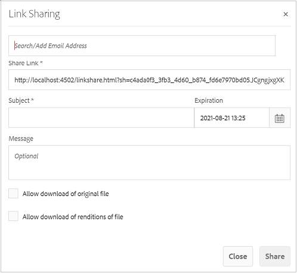
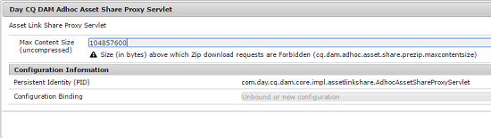

# Condivisione di risorse come collegamento {#asset-link-sharing}

| Versione | Collegamento articolo |
| -------- | ---------------------------- |
| AEM as a Cloud Service | [Fai clic qui](https://experienceleague.adobe.com/docs/experience-manager-cloud-service/content/assets/manage/share-assets.html?lang=en) |
| AEM 6.5 | Questo articolo |
| AEM 6.4 | [Fai clic qui](https://experienceleague.adobe.com/docs/experience-manager-64/assets/administer/link-sharing.html?lang=en) |

[!DNL Adobe Experience Manager Assets] consente di condividere risorse, cartelle e raccolte come URL con i membri dell’organizzazione ed entità esterne, inclusi partner e fornitori. La condivisione delle risorse tramite un collegamento è un modo pratico per rendere le risorse disponibili a soggetti esterni senza che debbano prima accedere a [!DNL Assets].

>[!PREREQUISITES]
>
>* Richiedi `Edit ACL` sulla cartella o sulla risorsa che desideri condividere come collegamento.
>* Per inviare e-mail agli utenti, configura i dettagli del server SMTP in [Servizio e-mail Day CQ](#configmailservice).

## Condividere le risorse {#share-assets}

Per generare l’URL per le risorse che desideri condividere con gli utenti, utilizza [!UICONTROL Condivisione collegamenti] finestra di dialogo.

* Gli utenti con privilegi di amministratore o con autorizzazioni di lettura in `/var/dam/share` la posizione può visualizzare i collegamenti condivisi con loro.
* Gli utenti che dispongono di autorizzazioni di lettura in `/var/dam/jobs/download` La posizione può scaricare risorse dal collegamento condiviso.

1. In [!DNL Assets] interfaccia utente, seleziona la risorsa da condividere come collegamento.

1. Dalla barra degli strumenti, fai clic sul pulsante **[!UICONTROL Condividi collegamento]** . Collegamento che verrà creato dopo aver fatto clic su **[!UICONTROL Condividi]** viene visualizzato in anticipo nel [!UICONTROL Condividi collegamento] campo . Il collegamento non viene creato finché non selezioni **[!UICONTROL Invia]**.

   

   *Figura: Finestra di dialogo per condividere le risorse come collegamento.*

1. Nella casella dell’indirizzo e-mail della finestra di dialogo **[!UICONTROL Condivisione collegamenti]**, digita l’ID e-mail dell’utente con cui vuoi condividere il collegamento. Puoi aggiungere uno o più utenti.

   >[!NOTE]
   >
   >Se immetti un ID e-mail di un utente che non è membro dell’organizzazione, le parole [!UICONTROL Utente esterno] hanno il prefisso e-mail ID dell’utente.

1. In **[!UICONTROL Oggetto]** Inserisci un oggetto per la risorsa da condividere.

1. In **[!UICONTROL Messaggio]** immettere un messaggio facoltativo.

1. In **[!UICONTROL Scadenza]** specifica una data e un’ora di scadenza per il collegamento che smette di funzionare. Il tempo di scadenza predefinito per il collegamento è un giorno.

   

1. Per consentire agli utenti di scaricare la risorsa originale, seleziona **[!UICONTROL Consenti download del file originale]**. Per consentire agli utenti di scaricare solo i rendering delle risorse condivise, seleziona **[!UICONTROL Consenti download di rappresentazioni di file]**.

1. Fate clic su **[!UICONTROL Condividi]**. Un messaggio conferma che il collegamento è condiviso con gli utenti tramite e-mail.

1. Per visualizzare la risorsa condivisa, fai clic sul collegamento presente nell’e-mail inviata all’utente. Per generare un’anteprima della risorsa, fai clic sulla risorsa condivisa. Per chiudere l&#39;anteprima, fai clic su **[!UICONTROL Indietro]**. Se hai condiviso una cartella, fai clic su **[!UICONTROL Cartella padre]** per tornare alla cartella principale.

   

   >[!NOTE]
   >
   >[!DNL Experience Manager] supporta la generazione dell’anteprima solo delle risorse di [i tipi di file supportati](/help/assets/assets-formats.md). Se sono condivisi altri tipi MIME, puoi solo scaricare le risorse e non visualizzare l’anteprima.

1. Per scaricare la risorsa condivisa, fai clic su **[!UICONTROL Seleziona]** dalla barra degli strumenti, fai clic sulla risorsa, quindi fai clic su **[!UICONTROL Scarica]** dalla barra degli strumenti.

   

1. Per visualizzare le risorse condivise come collegamenti, passa alla pagina [!DNL Assets] l&#39;interfaccia utente e fai clic sul pulsante [!DNL Experience Manager] logo. Scegli **[!UICONTROL Navigazione]**. Nel riquadro di navigazione, scegli **[!UICONTROL Collegamenti condivisi]** per visualizzare un elenco delle risorse condivise.

1. Per annullare la condivisione di una risorsa, selezionala e fai clic su **[!UICONTROL Annulla condivisione]** dalla barra degli strumenti. Segue un messaggio di conferma. La voce della risorsa viene rimossa dall’elenco.

## Configura il servizio di posta Day CQ {#configure-day-cq-mail-service}

1. Sulla [!DNL Experience Manager] home page, passare a **[!UICONTROL Strumenti]** > **[!UICONTROL Operazioni]** > **[!UICONTROL Console web]**.
1. Dall’elenco dei servizi, individua **[!UICONTROL Servizio e-mail Day CQ]**.
1. Fai clic su **[!UICONTROL Modifica]** accanto al servizio e configura i seguenti parametri per **[!UICONTROL Servizio e-mail Day CQ]** con i dettagli indicati con i loro nomi:

   * Nome host server SMTP: nome host server e-mail
   * Porta server SMTP: porta server e-mail
   * Utente SMTP: nome utente server e-mail
   * Password SMTP: password del server e-mail

   

1. Fai clic su **[!UICONTROL Salva]**.

## Configura la dimensione massima dei dati {#configure-maximum-data-size}

Quando scarichi le risorse dal collegamento condiviso utilizzando la funzione Condivisione collegamenti , [!DNL Experience Manager] comprime la gerarchia delle risorse dall&#39;archivio e quindi restituisce la risorsa in un file ZIP. Tuttavia, in assenza di limiti alla quantità di dati che possono essere compressi in un file ZIP, enormi quantità di dati sono soggetti a compressione, che causa errori di memoria esaurita in JVM. Per proteggere il sistema da un potenziale attacco di negazione del servizio a causa di questa situazione, configura la dimensione massima utilizzando **[!UICONTROL Dimensione massima del contenuto (non compresso)]** parametro per **[!UICONTROL Servizio proxy condivisione risorse ad hoc Day CQ DAM]** in Configuration Manager. Se la dimensione non compressa della risorsa supera il valore configurato, le richieste di download delle risorse vengono rifiutate. Il valore predefinito è 100 MB.

1. Fai clic sul pulsante [!DNL Experience Manager] logo e poi andare a **[!UICONTROL Strumenti]** > **[!UICONTROL Operazioni]** > **[!UICONTROL Console web]**.
1. Dalla console Web, individua il **[!UICONTROL Servizio proxy condivisione risorse ad hoc Day CQ DAM]** configurazione.
1. Apri la configurazione **[!UICONTROL Day CQ DAM Adhoc Asset Share Proxy Servlet]** in modalità di modifica e cambia il valore del parametro in **[!UICONTROL Max Content Size (uncompressed)]**.

   

1. Salva le modifiche.

## Procedure consigliate e risoluzione dei problemi {#best-practices-and-troubleshooting}

* Le cartelle o le raccolte di risorse che contengono uno spazio vuoto nel loro nome potrebbero non essere condivise.
* Se gli utenti non possono scaricare le risorse condivise, controlla con il tuo [!DNL Experience Manager] l&#39;amministratore [limiti di download](#configure-maximum-data-size) sono.
* Se non puoi inviare e-mail con collegamenti a risorse condivise o se gli altri utenti non possono ricevere il tuo messaggio e-mail, controlla con il tuo [!DNL Experience Manager] amministratore se [servizio e-mail](#configure-day-cq-mail-service) è configurato o meno.
* Se non puoi condividere risorse utilizzando la funzionalità di condivisione dei collegamenti, assicurati di disporre delle autorizzazioni appropriate. Vedi [condividere risorse](#share-assets).
* Se una risorsa condivisa viene spostata in una posizione diversa, il relativo collegamento smette di funzionare. Ricrea il collegamento e condividi nuovamente con gli utenti.

* Per condividere i collegamenti dai [!DNL Experience Manager] Distribuzione dell’autore a entità esterne, accertati di esporre solo i seguenti URL utilizzati per la condivisione dei collegamenti, per `GET` solo richieste. Blocca altri URL per motivi di sicurezza.

   * `http://[aem_server]:[port]/linkshare.html`
   * `http://[aem_server]:[port]/linksharepreview.html`
   * `http://[aem_server]:[port]/linkexpired.html`
   In [!DNL Experience Manager] interfaccia, accesso **[!UICONTROL Strumenti]** > **[!UICONTROL Operazioni]** > **[!UICONTROL Console web]**. Apri **[!UICONTROL Day CQ Link Externalizer]** configurare e modificare le seguenti proprietà nel **[!UICONTROL Domini]** campo con i valori indicati a fronte `local`, `author`e `publish`. Per `local` e `author` , forniscono l&#39;URL rispettivamente per le istanze locali e Autore . Se esegui un singolo [!DNL Experience Manager] Istanza autore, utilizza lo stesso valore per `local` e `author` proprietà. Per le istanze Publish , fornisci l’URL della [!DNL Experience Manager] Pubblica l&#39;istanza.
