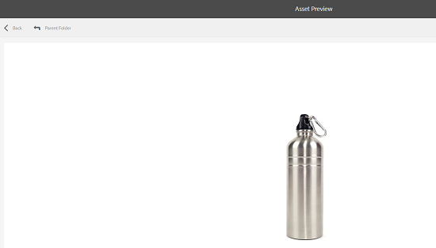

# Condividere le risorse tramite un collegamento {#asset-link-sharing}

[!DNL Adobe Experience Manager Assets] consente di condividere risorse, cartelle e raccolte come URL con i membri dell’organizzazione ed entità esterne, inclusi partner e fornitori. La condivisione di risorse tramite un collegamento è un modo conveniente per rendere le risorse disponibili a soggetti esterni senza che debbano prima accedere a [!DNL Assets].

>[!PREREQUISITES]
>
>* È necessaria l&#39;autorizzazione Modifica ACL sulla cartella o sulla risorsa che si desidera condividere come collegamento.
>* Per inviare e-mail agli utenti, configura i dettagli del server SMTP in [Day CQ Mail Service](#configmailservice).

## Condividere le risorse {#share-assets}

Per generare l’URL per le risorse che desideri condividere con gli utenti, utilizza la finestra di dialogo Condivisione collegamenti . Gli utenti con privilegi di amministratore o con autorizzazioni di lettura nel percorso `/var/dam/share` possono visualizzare i collegamenti condivisi con loro.

1. Nell’interfaccia utente di [!DNL Assets] , seleziona la risorsa da condividere come collegamento.
1. Dalla barra degli strumenti, fai clic sull&#39;icona **[!UICONTROL Condividi collegamento]** . Il collegamento che verrà creato dopo aver fatto clic su **[!UICONTROL Condividi]** viene visualizzato in anticipo nel campo [!UICONTROL Condividi collegamento] . Il collegamento non viene ancora creato finché non si fa clic su **[!UICONTROL Invia]**.

   

   *Figura: Finestra di dialogo per condividere le risorse come collegamento.*

1. Nella casella dell’indirizzo e-mail della finestra di dialogo **[!UICONTROL Condivisione collegamenti]**, digita l’ID e-mail dell’utente con cui vuoi condividere il collegamento. Puoi aggiungere uno o più utenti.

   

   *Figura: Condividi i collegamenti alle risorse direttamente dalla finestra di dialogo  [!UICONTROL Collegamento ] condivisione.*

   >[!NOTE]
   >
   >Se immetti un ID e-mail di un utente che non è membro dell’organizzazione, le parole [!UICONTROL Utente esterno] hanno il prefisso e-mail ID dell’utente.

1. Nella casella **[!UICONTROL Oggetto]**, immetti un oggetto per la risorsa da condividere.

1. Nella casella **[!UICONTROL Messaggio]**, immetti un messaggio facoltativo.

1. Nel campo **[!UICONTROL Scadenza]** , specifica una data e un&#39;ora di scadenza affinché il collegamento smetta di funzionare. Il tempo di scadenza predefinito per il collegamento è un giorno.

   

1. Per consentire agli utenti di scaricare la risorsa originale insieme alle rappresentazioni, seleziona **[!UICONTROL Consenti download del file originale]**. Per impostazione predefinita, gli utenti possono scaricare solo le rappresentazioni della risorsa che condividi come collegamento.

1. Fate clic su **[!UICONTROL Condividi]**. Un messaggio conferma che il collegamento è condiviso con gli utenti tramite e-mail.

1. Per visualizzare la risorsa condivisa, fai clic sul collegamento presente nell’e-mail inviata all’utente. Per generare un’anteprima della risorsa, fai clic sulla risorsa condivisa. Per chiudere l&#39;anteprima, fai clic su **[!UICONTROL Indietro]**. Se hai condiviso una cartella, fai clic su **[!UICONTROL Cartella padre]** per tornare alla cartella principale.

   

   >[!NOTE]
   >
   >[!DNL Experience Manager] supporta la generazione dell’anteprima delle risorse solo per  [i tipi](/help/assets/assets-formats.md) di file supportati. Se sono condivisi altri tipi MIME, puoi solo scaricare le risorse e non visualizzare l’anteprima.

1. Per scaricare la risorsa condivisa, fai clic su **[!UICONTROL Seleziona]** nella barra degli strumenti, quindi fai clic su **[!UICONTROL Scarica]** nella barra degli strumenti.

   

1. Per visualizzare le risorse condivise come collegamenti, passa all’interfaccia utente [!DNL Assets] e fai clic sul logo [!DNL Experience Manager] . Scegli **[!UICONTROL Navigazione]**. Nel riquadro di navigazione, scegli **[!UICONTROL Collegamenti condivisi]** per visualizzare un elenco delle risorse condivise.

1. Per non condividere una risorsa, selezionala e fai clic su **[!UICONTROL Annulla condivisione]** nella barra degli strumenti. Segue un messaggio di conferma. La voce della risorsa viene rimossa dall’elenco.

## Configura il servizio di posta Day CQ {#configure-day-cq-mail-service}

1. Nella home page di [!DNL Experience Manager], passa a **[!UICONTROL Strumenti]** > **[!UICONTROL Operazioni]** > **[!UICONTROL Console web]**.
1. Dall&#39;elenco dei servizi, individua **[!UICONTROL Day CQ Mail Service]**.
1. Fai clic su **[!UICONTROL Modifica]** accanto al servizio e configura i seguenti parametri per **[!UICONTROL Day CQ Mail Service]** con i dettagli indicati con i relativi nomi:

   * Nome host server SMTP: nome host server e-mail
   * Porta server SMTP: porta server e-mail
   * Utente SMTP: nome utente server e-mail
   * Password SMTP: password del server e-mail

   

1. Fai clic su **[!UICONTROL Salva]**.

## Configura la dimensione massima dei dati {#configure-maximum-data-size}

Quando scarichi le risorse dal collegamento condiviso utilizzando la funzione Condivisione collegamenti , [!DNL Experience Manager] comprime la gerarchia delle risorse dall’archivio e quindi restituisce la risorsa in un file ZIP. Tuttavia, in assenza di limiti alla quantità di dati che possono essere compressi in un file ZIP, enormi quantità di dati sono soggetti a compressione, che causa errori di memoria esaurita in JVM. Per proteggere il sistema da un potenziale attacco di rifiuto del servizio a causa di questa situazione, configura la dimensione massima utilizzando il parametro **[!UICONTROL Dimensione massima del contenuto (non compresso)]** per **[!UICONTROL Day CQ DAM Adhoc Asset Share Proxy Servlet]** in Configuration Manager. Se la dimensione non compressa della risorsa supera il valore configurato, le richieste di download delle risorse vengono rifiutate. Il valore predefinito è 100 MB.

1. Fai clic sul logo [!DNL Experience Manager], quindi vai a **[!UICONTROL Strumenti]** > **[!UICONTROL Operazioni]** > **[!UICONTROL Console web]**.
1. Dalla console Web, individua la configurazione **[!UICONTROL Day CQ DAM Adhoc Asset Share Proxy Servlet]** .
1. Apri la configurazione **[!UICONTROL Day CQ DAM Adhoc Asset Share Proxy Servlet]** in modalità di modifica e cambia il valore del parametro in **[!UICONTROL Max Content Size (uncompressed)]**.

   

1. Salva le modifiche.

## Procedure consigliate e risoluzione dei problemi {#best-practices-and-troubleshooting}

* Le cartelle o le raccolte di risorse che contengono uno spazio vuoto nel loro nome potrebbero non essere condivise.
* Se gli utenti non possono scaricare le risorse condivise, verifica con il tuo [!DNL Experience Manager] amministratore quali sono i [limiti di download](#configure-maximum-data-size).
* Se non è possibile inviare e-mail con collegamenti a risorse condivise o se gli altri utenti non possono ricevere l&#39;e-mail, controlla con il tuo [!DNL Experience Manager] amministratore se il [servizio e-mail](#configure-day-cq-mail-service) è configurato o meno.
* Se non puoi condividere risorse utilizzando la funzionalità di condivisione dei collegamenti, assicurati di disporre delle autorizzazioni appropriate. Consulta [condividere risorse](#share-assets).
* Se una risorsa condivisa viene spostata in una posizione diversa, il relativo collegamento smette di funzionare. Ricrea il collegamento e condividi nuovamente con gli utenti.

* Se desideri condividere i collegamenti dalla distribuzione [!DNL Experience Manager] Autore a entità esterne, assicurati di esporre solo i seguenti URL utilizzati per la condivisione dei collegamenti, solo per le richieste `GET`. Blocca altri URL per motivi di sicurezza.

   * `http://[aem_server]:[port]/linkshare.html`
   * `http://[aem_server]:[port]/linksharepreview.html`
   * `http://[aem_server]:[port]/linkexpired.html`
   Nell&#39;interfaccia [!DNL Experience Manager], accedi a **[!UICONTROL Strumenti]** > **[!UICONTROL Operazioni]** > **[!UICONTROL Console web]**. Apri la configurazione **[!UICONTROL Day CQ Link Externalizer]** e modifica le seguenti proprietà nel campo **[!UICONTROL Domains]** con i valori indicati nei campi `local`, `author` e `publish`. Per le proprietà `local` e `author` , specifica l’URL delle istanze locali e Autore, rispettivamente. Se esegui una singola istanza di authoring [!DNL Experience Manager], utilizza lo stesso valore per le proprietà `local` e `author`. Per le istanze Publish , specifica l’URL dell’ [!DNL Experience Manager] istanza Publish .
