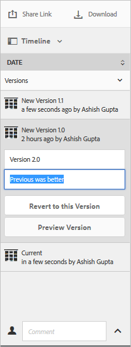

# Gestire le risorse digitali {#manage-digital-assets}

| Versione | Collegamento articolo |
| -------- | ---------------------------- |
| AEM as a Cloud Service | [Fai clic qui](https://experienceleague.adobe.com/docs/experience-manager-cloud-service/content/assets/manage/manage-digital-assets.html?lang=en) |
| AEM 6.5 | Questo articolo |

In [!DNL Adobe Experience Manager Assets], puoi fare di più che archiviare e gestire le risorse. [!DNL Experience Manager] offre funzionalità di gestione delle risorse di livello enterprise. Puoi modificare e condividere le risorse, eseguire ricerche avanzate e creare più rappresentazioni di decine di formati di file supportati. Puoi anche gestire versioni e diritti digitali, automatizzare l’elaborazione delle risorse, gestire e gestire i metadati, collaborare utilizzando le annotazioni e molto altro.

Questo articolo descrive le attività di base per la gestione delle risorse, come creare o caricare; aggiornamenti dei metadati; copiare, spostare ed eliminare; pubblicare, annullare la pubblicazione e cercare le risorse. Per informazioni sull&#39;interfaccia utente, vedere [Introduzione all&#39;interfaccia utente delle risorse](/help/sites-authoring/basic-handling.md). Per gestire i frammenti di contenuto, consulta [gestire i frammenti di contenuto](/help/assets/content-fragments/content-fragments-managing.md) risorse.

## Creare cartelle {#creating-folders}

Quando si organizza una raccolta di risorse, ad esempio tutte le immagini `Nature`, è possibile creare cartelle per mantenerle unite. Puoi utilizzare le cartelle per categorizzare e organizzare le risorse. [!DNL Experience Manager Assets] non richiede di organizzare le risorse in cartelle per funzionare meglio.

>[!NOTE]
>
>* La condivisione di una cartella [!DNL Assets] di tipo `sling:OrderedFolder` non è supportata quando si condivide con Experience Cloud. Se desideri condividere una cartella, non selezionare [!UICONTROL Ordinato] durante la creazione di una cartella.
>* [!DNL Experience Manager] non consente di utilizzare `subassets` parola come nome di una cartella. Si tratta di una parola chiave riservata a un nodo che contiene risorse secondarie per le risorse composte.

1. Passa alla posizione nella cartella delle risorse digitali in cui desideri creare una cartella. Scegliere **[!UICONTROL Crea]** dal menu. Seleziona **[!UICONTROL Nuova cartella]**.
1. Nel campo **[!UICONTROL Titolo]**, fornisci un nome di cartella. Per impostazione predefinita, DAM utilizza il titolo fornito come nome della cartella. Una volta creata la cartella, puoi sovrascrivere l’impostazione predefinita e specificare un altro nome di cartella.
1. Fai clic su **[!UICONTROL Crea]**. La cartella viene visualizzata nella cartella delle risorse digitali.

I seguenti caratteri (separati da spazi) non sono supportati:

* Il nome di un file di risorse non può contenere i seguenti caratteri: `* / : [ \\ ] | # % { } ? &`
* Il nome di una cartella di risorse non può contenere i seguenti caratteri: `* / : [ \\ ] | # % { } ? \" . ^ ; + & \t`

Non includere caratteri speciali nelle estensioni dei nomi di file delle risorse.

## Caricare le risorse {#uploading-assets}

<!-- TBD the following:
Move this section into a new article. CQDOC-14874 ticket is created for this.
In this complete article, replace emphasis with UICONTROL where appropriate.
-->

È possibile caricare vari tipi di risorse (tra cui immagini, file PDF, file RAW e così via) dalla cartella locale o da un&#39;unità di rete in [!DNL Experience Manager Assets].

>[!NOTE]
>
>In modalità Dynamic Medie - Scene7, la dimensione predefinita del file di caricamento delle risorse è pari o inferiore a 2 GB. Per configurare il caricamento di risorse di dimensioni superiori a 2 GB e fino a 15 GB, vedere [(Facoltativo) Configurare la modalità Dynamic Medie - Scene7 per il caricamento di risorse di dimensioni superiori a 2 GB](/help/assets/config-dms7.md#optional-config-dms7-assets-larger-than-2gb).

>[!IMPORTANT]
>
>Assets caricati in Experience Manager che hanno un nome file superiore a 100 caratteri, hanno un nome abbreviato quando vengono utilizzati in Dynamic Medie.
>
>I primi 100 caratteri nel nome del file vengono utilizzati così come sono; tutti i caratteri rimanenti vengono sostituiti da una stringa alfanumerica. Questo metodo di ridenominazione garantisce un nome univoco quando la risorsa viene utilizzata in Dynamic Medie. Inoltre, deve contenere la lunghezza massima consentita per il nome del file di risorse in Dynamic Medie.

Puoi scegliere di caricare le risorse nelle cartelle con o senza un profilo di elaborazione assegnato.

Per le cartelle a cui è assegnato un profilo di elaborazione, il nome del profilo viene visualizzato sulla miniatura nella vista a schede. Nella vista a elenco, il nome del profilo viene visualizzato nella colonna **Profilo di elaborazione**. Vedi [Profili di elaborazione](/help/assets/processing-profiles.md).

Prima di caricare una risorsa, assicurati che sia in un [formato](/help/assets/assets-formats.md) supportato da [!DNL Experience Manager Assets].

1. Nell&#39;interfaccia utente di [!DNL Assets], passa alla posizione in cui desideri aggiungere risorse digitali.
1. Per caricare le risorse, effettua una delle seguenti operazioni:

   * Sulla barra degli strumenti fare clic su **[!UICONTROL Crea]**. Scegliere quindi **[!UICONTROL File]** dal menu. Se necessario, puoi rinominare il file nella finestra di dialogo visualizzata.
   * In un browser che supporta HTML5, trascina le risorse direttamente sull&#39;interfaccia utente [!DNL Assets]. La finestra di dialogo per rinominare il file non viene visualizzata.

   

   Per selezionare più file, seleziona la chiave `Ctrl` o `Command` e seleziona le risorse nella finestra di dialogo del selettore file. Quando si utilizza un iPad, è possibile selezionare un solo file alla volta.

   Puoi sospendere il caricamento di risorse di grandi dimensioni (superiori a 500 MB) e riprenderle in un secondo momento dalla stessa pagina. Fai clic su **[!UICONTROL Pausa]** accanto alla barra di avanzamento che viene visualizzata all&#39;avvio di un caricamento.

   

È possibile configurare la dimensione al di sopra della quale una risorsa è considerata di grandi dimensioni. Ad esempio, puoi configurare il sistema in modo che consideri le risorse superiori a 1000 MB (anziché 500 MB) come risorse di grandi dimensioni. In questo caso, **[!UICONTROL Pausa]** viene visualizzato sulla barra di avanzamento quando vengono caricate risorse di dimensioni superiori a 1000 MB.

L&#39;opzione [!UICONTROL Pausa] non indica se un file di dimensioni superiori a 1000 MB è stato caricato con un file inferiore a 1000 MB. Tuttavia, se annulli il caricamento di un file di dimensioni inferiori a 1000 MB, viene visualizzata l&#39;opzione **[!UICONTROL Pausa]**.

Per modificare il limite di dimensione, configurare la proprietà `chunkUploadMinFileSize` del nodo `fileupload` nell&#39;archivio CRX disponibile in `/apps/dam/gui/content/assets/jcr:content/actions/secondary/create/items/fileupload`.

Quando fai clic su **[!UICONTROL Pausa]**, viene attivata l&#39;opzione **[!UICONTROL Riproduci]**. Per riprendere il caricamento, fai clic su **[!UICONTROL Riproduci]**.

Per annullare un caricamento in corso, fare clic su Chiudi (`X`) accanto alla barra di avanzamento. Quando si annulla l&#39;operazione di caricamento, [!DNL Assets] elimina la parte parzialmente caricata della risorsa.

La possibilità di riprendere il caricamento è particolarmente utile in scenari di larghezza di banda ridotta e problemi di rete, in cui il caricamento di una risorsa di grandi dimensioni richiede molto tempo. Puoi mettere in pausa l’operazione di caricamento e continuare in un secondo momento, quando la situazione migliorerà. Quando riprendi, il caricamento inizia dal punto in cui l’hai messo in pausa.

Durante l&#39;operazione di caricamento, [!DNL Experience Manager] salva le parti della risorsa caricate come blocchi di dati nell&#39;archivio CRX. Al termine del caricamento, [!DNL Experience Manager] consolida questi blocchi in un unico blocco di dati nell&#39;archivio.

Per configurare l&#39;attività di pulizia per i processi di caricamento blocchi non completati, passare a `https://[aem_server]:[port]/system/console/configMgr/org.apache.sling.servlets.post.impl.helper.ChunkCleanUpTask`.

>[!CAUTION]
>
>Il caricamento dei blocchi viene attivato quando il valore predefinito è 500 MB e la dimensione dei blocchi è 50 MB. Se modifichi [Apache Jackrabbit Oak TokenConfiguration](https://experienceleague.adobe.com/docs/experience-cloud-kcs/kbarticles/KA-16464.html) e imposti `timeout configuration` su un tempo inferiore a quello necessario per caricare una risorsa, si verifica una situazione di timeout della sessione mentre è in corso il caricamento della risorsa. Pertanto, modificare `chunkUploadMinFileSize` e `chunksize` in modo che ogni richiesta di blocco aggiorni la sessione.
>
>Dato il timeout di scadenza delle credenziali, la latenza, la larghezza di banda e i caricamenti simultanei previsti, il valore più alto che consente di garantire che venga scelto quanto segue:
>
>* Per assicurarsi che il caricamento dei blocchi sia abilitato per i file le cui dimensioni potrebbero causare la scadenza delle credenziali durante il caricamento.
>
>* Assicurarsi che ogni blocco termini prima della scadenza delle credenziali.

Se carichi una risorsa con lo stesso nome di una risorsa già disponibile nel percorso in cui la stai caricando, viene visualizzata una finestra di avviso.

Puoi scegliere di sostituire una risorsa esistente, creare un’altra versione o mantenere entrambe rinominando la nuova risorsa caricata. Se sostituisci una risorsa esistente, i metadati della risorsa ed eventuali modifiche precedenti (ad esempio, Annota o Ritaglia) apportate alla risorsa esistente vengono eliminati. Se scegli di mantenere entrambe le risorse, la nuova risorsa viene rinominata con il numero `1` aggiunto al suo nome.


>[!NOTE]
>
>Quando selezioni **[!UICONTROL Sostituisci]** nella finestra di dialogo [!UICONTROL Conflitto nome], l&#39;ID della risorsa viene rigenerato per la nuova risorsa. Questo ID è diverso da quello della risorsa precedente.
>
>Se Assets Insights è abilitato per tenere traccia di impression o clic con [!DNL Adobe Analytics], l&#39;ID risorsa rigenerato invalida i dati acquisiti per la risorsa in [!DNL Analytics].

Se la risorsa caricata esiste in [!DNL Assets], la finestra di dialogo **[!UICONTROL Duplicati rilevati]** avvisa che si sta tentando di caricare una risorsa duplicata. La finestra di dialogo viene visualizzata solo se il valore di checksum `SHA 1` del binario della risorsa esistente corrisponde al valore di checksum della risorsa caricata. In questo caso, i nomi delle risorse non hanno importanza.

>[!NOTE]
>
>La finestra di dialogo [!UICONTROL Duplicati rilevati] viene visualizzata solo quando la funzionalità di rilevamento duplicati è abilitata. Per abilitare la funzionalità di rilevamento duplicati, vedere [Abilita rilevamento duplicati](/help/assets/duplicate-detection.md).


Per mantenere la risorsa duplicata in [!DNL Assets], fai clic su **[!UICONTROL Mantieni]**. Per eliminare la risorsa duplicata caricata, fai clic su **[!UICONTROL Elimina]**.

[!DNL Experience Manager Assets] impedisce di caricare risorse con i caratteri non consentiti nei nomi dei file. Se tenti di caricare una risorsa il cui nome file contiene un carattere non consentito o più, [!DNL Assets] visualizza un messaggio di avviso e interrompe il caricamento finché non rimuovi questi caratteri o non carichi con un nome consentito.

Per adattarsi a specifiche convenzioni di denominazione dei file per l&#39;organizzazione, la finestra di dialogo [!UICONTROL Carica Assets] consente di specificare nomi lunghi per i file caricati.

Tuttavia, i seguenti caratteri (separati da spazi) non sono supportati:

* il nome del file di risorse non può contenere `* / : [ \\ ] | # % { } ? &`
* il nome della cartella risorse non può contenere `* / : [ \\ ] | # % { } ? \" . ^ ; + & \t`

Non includere caratteri speciali nelle estensioni dei nomi di file delle risorse.


Inoltre, nell&#39;interfaccia utente di [!DNL Assets] viene visualizzata la risorsa più recente caricata o la cartella creata per prima.

Se si annulla l&#39;operazione di caricamento prima che i file vengano caricati, [!DNL Assets] interrompe il caricamento del file corrente e aggiorna il contenuto. Tuttavia, i file già caricati non vengono eliminati.

La finestra di dialogo di avanzamento del caricamento in [!DNL Assets] visualizza il numero di file caricati correttamente e i file che non è stato possibile caricare.

### Caricamenti seriali {#serialuploads}

Il caricamento in massa di numerose risorse comporta un consumo significativo di risorse di I/O, con possibile impatto negativo sulle prestazioni dell&#39;implementazione di [!DNL Assets]. In particolare, se la connessione a Internet è lenta, il tempo di caricamento aumenta drasticamente a causa di un picco nell&#39;I/O del disco. Inoltre, il browser Web potrebbe introdurre ulteriori restrizioni al numero di richieste di POST che [!DNL Assets] può gestire per il caricamento simultaneo di risorse. Di conseguenza, l’operazione di caricamento non riesce o viene terminata prematuramente. In altre parole, [!DNL Experience Manager Assets] potrebbe perdere alcuni file durante l&#39;acquisizione di una serie di file o non acquisire alcun file.

Per superare questa situazione, [!DNL Assets] acquisisce una risorsa alla volta (caricamento seriale) durante un&#39;operazione di caricamento in blocco, invece di acquisire contemporaneamente tutte le risorse.

Il caricamento seriale delle risorse è abilitato per impostazione predefinita. Per disabilitare la funzione e consentire il caricamento simultaneo, sovrapporre il nodo `fileupload` in Crx-de e impostare il valore della proprietà `parallelUploads` su `true`.

### Caricare le risorse tramite FTP {#uploading-assets-using-ftp}

Dynamic Medie consente il caricamento in batch delle risorse tramite il server FTP. Se desideri caricare risorse di grandi dimensioni (>1 GB) o intere cartelle e sottocartelle, utilizza l’FTP. Puoi anche impostare il caricamento FTP su base pianificata ricorrente.

>[!NOTE]
>
>In modalità Dynamic Medie - Scene7, la dimensione predefinita del file di caricamento delle risorse è pari o inferiore a 2 GB. Per configurare il caricamento di risorse di dimensioni superiori a 2 GB e fino a 15 GB, vedere [(Facoltativo) Configurare la modalità Dynamic Medie - Scene7 per il caricamento di risorse di dimensioni superiori a 2 GB](/help/assets/config-dms7.md#optional-config-dms7-assets-larger-than-2gb).

>[!NOTE]
>
>Per caricare le risorse tramite FTP in modalità Dynamic Medie - Scene7, installa il Feature Pack 18912 nelle istanze di authoring [!DNL Experience Manager]. Contatta l&#39;[Assistenza clienti Adobe](https://experienceleague.adobe.com/i?support-solution=General#support) per accedere a FP-18912 e completare la configurazione del tuo account FTP. Per ulteriori informazioni, consulta [Installare la 18912 del feature pack per la migrazione in blocco delle risorse](/help/assets/bulk-ingest-migrate.md).
>
>Se si utilizza l&#39;FTP per caricare le risorse, le impostazioni di caricamento specificate in [!DNL Experience Manager] vengono ignorate. Vengono invece utilizzate le regole di elaborazione dei file definite in Dynamic Media Classic.

**Per caricare le risorse tramite FTP**

1. Utilizzando il client FTP scelto, accedi al server FTP utilizzando il nome utente e la password FTP ricevuti dall&#39;e-mail di provisioning. Nel client FTP, carica file o cartelle sul server FTP.

1. Apri l&#39;[applicazione desktop Dynamic Media Classic](https://experienceleague.adobe.com/docs/dynamic-media-classic/using/intro/dynamic-media-classic-desktop-app.html#system-requirements-dmc-app), quindi accedi al tuo account.

   Le credenziali e l’accesso sono stati forniti da Adobe al momento del provisioning. Se non disponi di queste informazioni, contatta l’Assistenza clienti Adobe.

1. Sulla barra di navigazione globale, fare clic su **[!UICONTROL Carica]**.
1. Nella pagina Carica, nell&#39;angolo superiore sinistro, fare clic sulla scheda **[!UICONTROL Via FTP]**.
1. Sul lato sinistro della pagina, scegliere una cartella FTP da cui caricare i file; sul lato destro della pagina, scegliere una cartella di destinazione.
1. Fai clic su **[!UICONTROL Opzioni processo]** nell&#39;angolo inferiore destro della pagina, quindi imposta le opzioni desiderate in base alle risorse nella cartella selezionata.

   Consulta [Opzioni processo di caricamento](#upload-job-options).

   >[!NOTE]
   >
   >Quando si caricano le risorse tramite FTP, le opzioni del processo di caricamento impostate in Dynamic Media Classic (S7) hanno la precedenza sui parametri di elaborazione delle risorse impostati in [!DNL Experience Manager].

1. Nell&#39;angolo inferiore destro della finestra di dialogo Opzioni processo di caricamento fare clic su **[!UICONTROL Salva]**.
1. Nell&#39;angolo inferiore destro della pagina Carica, fare clic su **[!UICONTROL Invia caricamento]**.

   Per visualizzare l&#39;avanzamento del caricamento, nella barra di navigazione globale fare clic su **[!UICONTROL Processi]**. Nella pagina Processi viene visualizzato l’avanzamento del caricamento. È possibile continuare a lavorare in [!DNL Experience Manager] e tornare alla pagina Processi in Dynamic Media Classic in qualsiasi momento per rivedere un processo in corso.
Per annullare un processo di caricamento in corso, fai clic su **[!UICONTROL Annulla]** accanto alla Durata.

#### Opzioni processo di caricamento {#upload-job-options}

| Opzione di caricamento | Sottoopzione | Descrizione |
|---|---|---|
| Nome processo | | Il nome predefinito che viene precompilato nel campo di testo include la parte del nome immessa dall&#39;utente e l&#39;indicatore di data e ora. Puoi utilizzare il nome predefinito o immettere un nome di creazione per questo processo di caricamento. <br>Il processo e gli altri processi di caricamento e pubblicazione vengono registrati nella pagina Processi, in cui è possibile controllare lo stato dei processi. |
| Publish dopo il caricamento | | Pubblica automaticamente le risorse caricate. |
| Sovrascrivi in qualsiasi cartella, nome come risorsa base, ignora estensione | | Selezionare questa opzione se si desidera che i file caricati sostituiscano i file esistenti con gli stessi nomi. Il nome di questa opzione potrebbe essere diverso, a seconda delle impostazioni in **[!UICONTROL Configurazione applicazione]** > **[!UICONTROL Impostazioni generali]** > **[!UICONTROL Carica nell&#39;applicazione]** > **[!UICONTROL Sovrascrivi immagini]**. |
| Decomprimi file Zip o Tar al caricamento | | |
| Opzioni processo | | Fai clic su **[!UICONTROL Opzioni processo]** per aprire la finestra di dialogo [!UICONTROL Opzioni processo di caricamento] e scegliere le opzioni che influiscono sull&#39;intero processo di caricamento. Queste opzioni sono le stesse per tutti i tipi di file.<br>È possibile scegliere le opzioni predefinite per il caricamento dei file a partire dalla pagina Impostazioni generali applicazione. Per aprire questa pagina, scegliere **[!UICONTROL Configurazione]** > **[!UICONTROL Configurazione applicazione]**. Selezionare l&#39;opzione **[!UICONTROL Opzioni di caricamento predefinite]** per aprire la finestra di dialogo [!UICONTROL Opzioni processo di caricamento]. |
| | Quando   | Selezionare Una tantum o Ricorrente. Per impostare un processo ricorrente, scegliete l&#39;opzione Ripeti (Giornaliero, Settimanale, Mensile o Personalizzato) per specificare quando il processo di caricamento FTP deve essere ripetuto. Quindi specifica le opzioni di pianificazione in base alle esigenze. |
| | Includi sottocartelle | Carica tutte le sottocartelle nella cartella che intendi caricare. I nomi della cartella e delle relative sottocartelle caricate vengono immessi automaticamente in [!DNL Experience Manager Assets]. |
| | Opzioni di ritaglio | Per ritagliare manualmente i lati di un&#39;immagine, selezionate il menu Ritaglia e scegliete Manuale. Quindi immettete il numero di pixel da ritagliare da un lato o da ciascun lato dell&#39;immagine. La quantità di immagine ritagliata dipende dall&#39;impostazione ppi (pixel per pollice) nel file di immagine. Ad esempio, se l&#39;immagine visualizza 150 ppi e si immette 75 nelle caselle di testo Superiore, Destra, Inferiore e Sinistra, verrà ritagliato un centimetro da ciascun lato.<br> Per ritagliare automaticamente i pixel dello spazio bianco da un&#39;immagine, aprire il menu Ritaglia, scegliere Manuale e immettere le misure dei pixel nei campi Superiore, Destro, Inferiore e Sinistro per ritagliare i pixel dai lati. È inoltre possibile scegliere Rifila dal menu Ritaglia e scegliere le seguenti opzioni:<br> **Rifila in base a** <ul><li>**Colore** - Scegliere l&#39;opzione Colore. Selezionate quindi il menu Angolo (Corner) e scegliete l&#39;angolo dell&#39;immagine con il colore che meglio rappresenta lo spazio bianco da ritagliare.</li><li>**Trasparenza** - Scegliere l&#39;opzione Trasparenza.<br> **Tolleranza** - Trascinare il dispositivo di scorrimento per specificare una tolleranza da 0 a 1. Per il ritaglio basato sul colore, specificare 0 per ritagliare i pixel solo se corrispondono esattamente al colore selezionato nell&#39;angolo dell&#39;immagine. I numeri più vicini a 1 consentono una maggiore differenza di colore.<br>Per il ritaglio basato sulla trasparenza, specificare 0 per ritagliare i pixel solo se sono trasparenti. I numeri più vicini a 1 consentono una maggiore trasparenza.</li></ul><br>Queste opzioni di ritaglio non sono distruttive. |
| | Opzioni profilo colore | Scegli una conversione colore quando crei file ottimizzati utilizzati per la consegna:<ul><li>Mantenimento colore predefinito: mantiene i colori dell&#39;immagine di origine ogni volta che le immagini contengono informazioni sullo spazio colore; non vi è alcuna conversione colore. Quasi tutte le immagini oggi hanno il profilo colore appropriato già incorporato. Tuttavia, se un&#39;immagine sorgente CMYK non contiene un profilo colore incorporato, i colori vengono convertiti in spazio colore sRGB (rosso verde standard). sRGB è lo spazio colore consigliato per la visualizzazione delle immagini nelle pagine Web.</li><li>Mantieni spazio colore originale: mantiene i colori originali senza alcuna conversione di colore nel punto. Per le immagini senza un profilo colore incorporato, qualsiasi conversione di colore viene eseguita utilizzando i profili colore predefiniti configurati nelle impostazioni di Publish. I profili colore potrebbero non essere allineati con il colore nei file creati con questa opzione. Pertanto, si consiglia di utilizzare l&#39;opzione Default Color Preservation (Conservazione colore predefinita).</li><li>Personalizza da > A<br> Apre i menu in modo da poter scegliere uno spazio colore Converti da e Converti in. Questa opzione avanzata sostituisce tutte le informazioni sui colori incorporate nel file di origine. Selezionare questa opzione se tutte le immagini inviate contengono dati di profilo colore errati o mancanti.</li></ul> |
| | Opzioni di modifica delle immagini | Potete conservare le maschere di ritaglio nelle immagini e scegliere un profilo colore.<br> Consulta [Impostazione delle opzioni per le modifiche di immagini al caricamento](#setting-image-editing-options-at-upload). |
| | Opzioni PostScript | Potete rasterizzare i file di PostScript®, ritagliare i file, mantenere sfondi trasparenti, scegliere una risoluzione e scegliere uno spazio colore.<br> Consulta [Impostazione delle opzioni di caricamento di PostScript e Illustrator](#setting-postscript-and-illustrator-upload-options). |
| | Opzioni Photoshop | Potete creare modelli da file Adobe® Photoshop®, gestire i livelli, specificare il nome dei livelli, estrarre il testo e specificare come le immagini vengono ancorate ai modelli.<br> modelli non supportati in [!DNL Experience Manager].<br> Consulta [Impostazione delle opzioni di caricamento di Photoshop](#setting-photoshop-upload-options). |
| | Opzioni PDF | È possibile rasterizzare i file, estrarre parole di ricerca e collegamenti, generare automaticamente un eCatalog, impostare la risoluzione e scegliere uno spazio colore.<br>eCatalog non supportati in [!DNL Experience Manager]. <br> Consulta [Impostazione delle opzioni di caricamento di PDF](#setting-pdf-upload-options).<br>**Nota**: il numero massimo di pagine da considerare per un PDF per l&#39;estrazione è 5000 per i nuovi caricamenti. Questo limite verrà modificato in 100 pagine (per tutti i PDF) il 31 dicembre 2022. Vedi anche [Limitazioni di Dynamic Medie](/help/assets/limitations.md). |
| | Opzioni Illustrator | Potete rasterizzare i file Adobe Illustrator®, mantenere sfondi trasparenti, scegliere una risoluzione e scegliere uno spazio colore.<br> Consulta [Impostazione delle opzioni di caricamento di PostScript e Illustrator](#setting-postscript-and-illustrator-upload-options). |
| | Opzioni eVideo | Potete trascodificare un file video scegliendo un predefinito video.<br> Consulta [Impostazione delle opzioni di caricamento di eVideo](#setting-evideo-upload-options). |
| | Predefiniti set di batch | Per creare un set di immagini o un set 360 gradi dai file caricati, fai clic sulla colonna Attivo per il predefinito che desideri utilizzare. È possibile selezionare più predefiniti. I predefiniti vengono creati nella pagina Impostazione applicazione/Predefiniti set di batch di Dynamic Media Classic.<br> Per ulteriori informazioni sulla creazione di predefiniti per set di batch, consulta [Configurazione dei predefiniti per set di batch per generare automaticamente set di immagini e set 360 gradi](config-dms7.md#creating-batch-set-presets-to-auto-generate-image-sets-and-spin-sets).<br> Vedi [Impostazione dei predefiniti per set di batch al caricamento](#setting-batch-set-presets-at-upload). |

#### Imposta le opzioni per le modifiche immagine al caricamento {#setting-image-editing-options-at-upload}

Durante il caricamento di file di immagine, inclusi file AI, EPS e PSD, è possibile eseguire le azioni di modifica seguenti nella finestra di dialogo [!UICONTROL Opzioni processo di caricamento]:

* Ritaglia uno spazio vuoto dal bordo delle immagini (vedi la descrizione nella tabella precedente).
* Ritaglia manualmente dai lati delle immagini (vedi la descrizione nella tabella precedente).
* Scegliere un profilo colore (vedere la descrizione dell&#39;opzione nella tabella precedente).
* Creare una maschera da un tracciato di ritaglio.
* Immagini più nitide con opzioni di maschera di contrasto
* Foratura sfondo

<!--
| Option | Sub-option | Description |
|---|---|---|
| Create Mask From Clipping Path | | Create a mask for the image based on its clipping path information. This option applies to images created with image-editing applications in which a clipping path was created. |
| Unsharp Masking | | Lets you fine-tune a sharpening filter effect on the final downsampled image, controlling the intensity of the effect, the radius of the effect (as measured in pixels), and a threshold of contrast that is ignored.<br> This effect uses the same options as Photoshop's Unsharp Mask filter. Contrary to what the name suggests, Unsharp Mask is a sharpening filter. Under Unsharp Masking, set the options you want. Setting options are described in the following: |
| | Amount | Controls the amount of contrast that is applied to edge pixels.<br> Think of it as the intensity of the effect. The main difference between the amount values of Unsharp Mask in Dynamic Media and the amount values in Adobe Photoshop, is that Photoshop has an amount range of 1% to 500%. Whereas, in Dynamic Media, the value range is 0.0 to 5.0. A value of 5.0 is the rough equivalent of 500% in Photoshop; a value of 0.9 is the equivalent of 90%, and so on. |
| | Radius | Controls the radius of the effect. The value range is 0-250.<br> The effect is run on all pixels in an image and radiates out from all pixels in all directions. The radius is measured in pixels. For example, to get a similar sharpening effect for a 2000 x 2000 pixel image and 500 x 500 pixel image, you would set a radius of two pixels on the 2000 x 2000 pixel image and a radius value of one pixel on the 500 x 500 pixel image. A larger value is used for an image that has more pixels. |
| | Threshold | Threshold is a range of contrast that is ignored when the Unsharp Mask filter is applied. It is important so that no "noise" is introduced to an image when this filter is used. The value range is 0-255, which is the number of brightness steps in a grayscale image. 0=black, 128=50% gray and 255=white.<br> For example, a threshold value of 12 ignores slight variations is skin tone brightness to avoid adding noise, but still add edge contrast to areas such as where eyelashes meet skin.<br> For example, if you have a photo of someone's face, the Unsharp Mask affects the parts of the image, such as where eyelashes and skin meet to create an obvious area of contrast, and the smooth skin itself. Even the smoothest skin exhibits subtle changes in brightness values. If you do not use a threshold value, the filter accentuates these subtle changes in skin pixels. In turn, a noisy and undesirable effect is created while contrast on the eyelashes is increased, enhancing sharpness.<br> To avoid this issue, a threshold value is introduced that tells the filter to ignore pixels that do not change contrast dramatically, like smooth skin.<br> In the zipper graphic shown earlier, notice the texture next to the zippers. Image noise is exhibited because the threshold values were too low to suppress the noise. |
| | Monochrome | Select to unsharp-mask image brightness (intensity).<br> Deselect to unsharp-mask each color component separately. |
| Knockout Background | | Automatically removes the background of an image when you upload it. This technique is useful to draw attention to a particular object and make it stand out from a busy background. Select to enable or "turn on" the Knockout Background feature and the following sub-options: |
| | Corner | Required.<br> The corner of the image that is used to define the background color to knockout.<br> You can choose from **Upper Left**, **Bottom Left**, **Upper Right**, or **Bottom Right**. |
| | Fill Method | Required.<br> Controls pixel transparency from the Corner location that you set.<br> You can choose from the following fill methods: <ul><li>**Flood Fill** - turns all pixels transparent that match the Corner that you have specified and are connected to it.</li><li>**Match Pixel** - turns all matching pixels transparent, regardless of their location on the image.</li></ul> |
| | Tolerance | Optional.<br> Controls the allowable amount of variation in pixel color matching based on the Corner location that you set.<br> Use a value of 0.0 to match pixel colors exactly or, use a value of 1.0 to allow for the greatest variation. |
-->

#### Impostare le opzioni di caricamento di PostScript e Illustrator {#setting-postscript-and-illustrator-upload-options}

Quando carichi i file immagine PostScript (EPS) o Illustrator (AI), puoi formattarli in vari modi. Potete rasterizzare i file, mantenere lo sfondo trasparente, scegliere una risoluzione e scegliere uno spazio colore. Le opzioni per la formattazione dei file PostScript e Illustrator sono disponibili nella finestra di dialogo [!UICONTROL Opzioni processo di caricamento] in [!UICONTROL Opzioni PostScript] e [!UICONTROL Opzioni Illustrator].

| Opzione | Sottoopzione | Descrizione |
|---|---|---|
| Elaborazione | | Scegliere **[!UICONTROL Rasterizza]** per convertire gli elementi grafici vettoriali nel file nel formato bitmap. |
| Mantieni sfondo trasparente nell&#39;immagine di rendering | | Mantieni la trasparenza di sfondo del file. |
| Risoluzione | | Determina l&#39;impostazione della risoluzione. Questa impostazione determina il numero di pixel visualizzati per pollice nel file. |
| Spazio colore | | Selezionate il menu Spazio colore e scegliete una delle seguenti opzioni di spazio colore: |
| | Rileva automaticamente | Mantiene lo spazio colore del file. |
| | Forza come RGB | Converte in spazio colore RGB. |
| | Forza come CMYK | Converte in spazio colore CMYK. |
| | Forza come gradazioni di grigio | Converte lo spazio colore in scala di grigio. |

#### Imposta opzioni di caricamento Photoshop {#setting-photoshop-upload-options}

I file di Photoshop Document (PSD) vengono utilizzati in genere per la creazione di modelli di immagine. Quando carichi un file PSD, puoi creare automaticamente un modello di immagine dal file (seleziona l&#39;opzione [!UICONTROL Crea modello] nella schermata Carica).

Dynamic Medie crea più immagini da un file PSD con livelli se utilizzate il file per creare un modello; crea un&#39;immagine per ogni livello.

Utilizza le [!UICONTROL opzioni di ritaglio] e le [!UICONTROL opzioni di profilo colore], descritte in precedenza, con le opzioni di caricamento di Photoshop.

>[!NOTE]
>
>I modelli non sono supportati in [!DNL Experience Manager].

| Opzione | Sottoopzione | Descrizione |
|---|---|---|
| Mantieni livelli | | Ripete i livelli nel PSD, se presenti, in singole risorse. I livelli di risorsa rimangono associati al PSD. Potete visualizzarli aprendo il file PSD nella vista Dettaglio e selezionando il pannello dei livelli. |
| Crea modello | | Crea un modello dai livelli nel file PSD. |
| Estrai testo | | Estrae il testo in modo che gli utenti possano cercare il testo in un visualizzatore. |
| Estendi livelli a dimensione sfondo | | Estende le dimensioni dei livelli immagine strappati alle dimensioni del livello di sfondo. |
| Denominazione livelli | | I livelli nel file PSD vengono caricati come immagini separate. |
| | Nome livello | Assegna alle immagini il nome del livello nel file PSD. Ad esempio, un livello denominato Tag prezzo nel file PSD originale diventa un&#39;immagine denominata Tag prezzo. Tuttavia, se i nomi dei livelli nel file PSD sono nomi di livello predefiniti di Photoshop (Sfondo, Livello 1, Livello 2 e così via), le immagini vengono denominate in base ai numeri dei livelli nel file PSD. Non vengono denominati in base ai nomi dei livelli di default. |
| | Photoshop e numero livello | Assegna alle immagini un nome dopo i relativi numeri di livello nel file PSD, ignorando i nomi di livello originali. Le immagini sono denominate con il nome del file Photoshop e un numero di livello aggiunto. Ad esempio, il secondo livello di un file denominato Spring Ad.psd è denominato Spring Ad_2 anche se in Photoshop aveva un nome non predefinito. |
| | Photoshop e nome livello | Denomina le immagini dopo il file PSD seguito dal nome o dal numero del livello. Il numero di livello viene utilizzato se i nomi di livello nel file PSD sono nomi di livello predefiniti di Photoshop. Ad esempio, un livello denominato Price Tag in un file PSD denominato SpringAd è denominato Spring Ad_Price Tag. Un livello con il nome di default Livello 2 (Layer 2) è denominato Primavera Ad_2. |
| Ancoraggio | | Specificate il modo in cui le immagini vengono ancorate nei modelli generati dalla composizione a livelli prodotta dal file PSD. Per impostazione predefinita, l&#39;ancoraggio è il centro. Un ancoraggio centrale consente alle immagini di sostituzione di occupare al meglio lo stesso spazio, indipendentemente dalle proporzioni dell&#39;immagine di sostituzione. Le immagini con un aspetto diverso che sostituiscono questa immagine, quando si fa riferimento al modello e si utilizza la sostituzione dei parametri, occupano di fatto lo stesso spazio. Impostate un&#39;impostazione diversa se l&#39;applicazione richiede le immagini sostitutive per riempire lo spazio allocato nel modello. |

#### Imposta opzioni di caricamento PDF {#setting-pdf-upload-options}

Quando carichi un file PDF, puoi formattarlo in vari modi. Ritagliate le pagine, estraete le parole di ricerca, immettete una risoluzione in pixel per pollice e scegliete uno spazio colore. I file PDF spesso contengono un margine di ritaglio, indicatori di ritaglio, indicatori di registrazione e altri indicatori della stampante. È possibile ritagliare questi segni dai lati delle pagine durante il caricamento di un file PDF.

Il numero massimo di pagine da considerare per un PDF per l’estrazione è 5000 per i nuovi caricamenti. Questo limite verrà modificato in 100 pagine (per tutti i PDF) il 31 dicembre 2022. Vedi anche [Limitazioni di Dynamic Medie](/help/assets/limitations.md).

>[!NOTE]
>
>eCatalog non supportati in [!DNL Experience Manager].

Scegli una delle seguenti opzioni:

| Opzione | Sottoopzione | Descrizione |
|---|---|---|
| Elaborazione | Rasterizza | Impostazione predefinita. Ripete le pagine nel file PDF e converte gli elementi grafici vettoriali in immagini bitmap. Scegliere questa opzione se si desidera creare un eCatalog. |
| Estrai | Cerca parole | Estrae parole dal file PDF in modo che sia possibile eseguire ricerche per parola chiave in un visualizzatore eCatalog. |
| | Collegamenti | Estrae i collegamenti dai file PDF e li converte in mappe immagine utilizzate in un visualizzatore eCatalog. |
| Genera automaticamente eCatalog da più PDF di pagine | | Crea automaticamente un eCatalog dal file PDF. L’eCatalog prende il nome dal file PDF caricato. Questa opzione è disponibile solo se rasterizzate il file PDF durante il caricamento. |
| Risoluzione | | Determina l&#39;impostazione della risoluzione. Questa impostazione determina il numero di pixel visualizzati per pollice nel file PDF. Il valore predefinito è 150. |
| Spazio colore | | Selezionate il menu Spazio colore e scegliete uno spazio colore per il file PDF. La maggior parte dei file PDF contiene immagini a colori RGB e CMYK. Lo spazio colore RGB è preferibile per la visualizzazione online. |
| | Rileva automaticamente | Mantiene lo spazio colore del file PDF. |
| | Converti in RGB | Converte in spazio colore RGB. |
| | Converti in CMYK | Converte in spazio colore CMYK. |
| | Converti in scala di grigio | Converte lo spazio colore in scala di grigio. |

#### Imposta opzioni di caricamento eVideo {#setting-evideo-upload-options}

Per trascodificare un file video scegliendo tra vari predefiniti video.

| Opzione | Sottoopzione | Descrizione |
|---|---|---|
| Video adattivo | | Un singolo predefinito di codifica che funziona con qualsiasi proporzione per creare video da distribuire su dispositivi mobili, tablet e desktop. I video sorgente caricati che sono codificati con questo predefinito sono impostati con un’altezza fissa. Tuttavia, la larghezza viene ridimensionata automaticamente per mantenere le proporzioni del video. <br>È consigliabile utilizzare la codifica video adattiva. |
| Predefiniti codifica singola | Ordina predefiniti codifica | Selezionare **[!UICONTROL Nome]** o **[!UICONTROL Dimensione]** se si desidera ordinare i predefiniti di codifica elencati in Desktop, Dispositivi mobili e Tablet per nome o per dimensione di risoluzione. |
| | Desktop | Creare un file MP4 per offrire ai computer desktop un&#39;esperienza video in streaming o progressiva. Seleziona uno o più rapporti di formato con le dimensioni di risoluzione e la velocità dati di destinazione desiderate. |
| | Mobile | Crea un file MP4 da distribuire su dispositivi mobili iPhone o Android™. Seleziona uno o più rapporti di formato con le dimensioni di risoluzione e la velocità dati di destinazione desiderate. |
| | Tablet | Crea un file MP4 da distribuire su dispositivi tablet iPad o Android™. Seleziona uno o più rapporti di formato con le dimensioni di risoluzione e la velocità dati di destinazione desiderate. |

#### Imposta predefiniti set di batch al caricamento {#setting-batch-set-presets-at-upload}

Se desideri creare automaticamente un set di immagini o un set 360 gradi dalle immagini caricate, fai clic sulla colonna Attivo per il predefinito che desideri utilizzare. È possibile selezionare più predefiniti.

Per ulteriori informazioni sulla creazione di predefiniti per set di batch, vedere [Configurazione dei predefiniti per set di batch per la generazione automatica di set di immagini e set 360 gradi](/help/assets/config-dms7.md#creating-batch-set-presets-to-auto-generate-image-sets-and-spin-sets).

### Caricamenti in streaming {#streamed-uploads}

Se carichi molte risorse in Adobe Experience Manager, le richieste di I/O al server aumentano drasticamente, riducendo l’efficienza di caricamento e causando anche il timeout di alcune attività di caricamento. [!DNL Experience Manager Assets] supporta il caricamento in streaming delle risorse. Il caricamento in streaming riduce l&#39;I/O del disco durante l&#39;operazione di caricamento evitando l&#39;archiviazione delle risorse in una cartella temporanea sul server prima di copiarlo nell&#39;archivio. Al contrario, i dati vengono trasferiti direttamente all’archivio. In questo modo, si riduce il tempo di caricamento di risorse di grandi dimensioni e la possibilità di timeout. Il caricamento in streaming è abilitato per impostazione predefinita in [!DNL Assets].

>[!NOTE]
>
>Il caricamento in streaming è disabilitato per Adobe Experience Manager in esecuzione sul server JEE con una versione servlet-api inferiore alla 3.1.

### Estrai archivio ZIP contenente risorse {#extractzip}

Puoi caricare gli archivi ZIP come qualsiasi altra risorsa supportata. Ai file ZIP si applicano le stesse regole per il nome file. [!DNL Experience Manager] consente di estrarre un archivio ZIP in una posizione DAM. Se i file di archivio non contengono ZIP come estensione, abilita il rilevamento del tipo di file utilizzando il contenuto.

Selezionare un archivio ZIP alla volta, fare clic su **[!UICONTROL Estrai archivio]** e selezionare una cartella di destinazione. Seleziona un’opzione per la gestione dei conflitti, se presente. Se le risorse nel file ZIP si trovano nella cartella di destinazione, puoi selezionare una delle seguenti opzioni: ignora l’estrazione, sostituisci i file esistenti, mantieni entrambe le risorse rinominandole o crea una versione.

Al termine dell&#39;estrazione, [!DNL Experience Manager] ti avvisa nell&#39;area di notifica. Mentre [!DNL Experience Manager] estrae il file ZIP, puoi tornare al tuo lavoro senza interrompere l&#39;estrazione.


Alcune limitazioni della funzione sono:

* Se nella destinazione esiste una cartella con lo stesso nome, le risorse del file ZIP vengono estratte nella cartella esistente.
* Se annulli l’estrazione, le risorse già estratte non vengono eliminate.
* Non è possibile selezionare due file ZIP contemporaneamente ed estrarli. Puoi estrarre un solo archivio ZIP alla volta.
* Durante il caricamento di un archivio ZIP, se nella finestra di dialogo di caricamento viene visualizzato un errore del server 500, riprovare dopo l&#39;installazione di [Service Pack più recente](/help/release-notes/release-notes.md).

## Visualizzare l’anteprima delle risorse {#previewing-assets}

Per visualizzare in anteprima una risorsa, segui la procedura riportata di seguito.

1. Dall&#39;interfaccia utente [!DNL Assets], passare al percorso della risorsa da visualizzare in anteprima.
1. Fai clic sulla risorsa desiderata in modo da poterla aprire.

1. In modalità anteprima sono disponibili opzioni di zoom per [tipi di immagini supportati](/help/assets/assets-formats.md#supported-raster-image-formats) (con modifica interattiva).

   Per ingrandire una risorsa, fai clic su `+` (o sulla lente di ingrandimento della risorsa). Per ridurre, fare clic su `-`. Quando si esegue lo zoom avanti, è possibile esaminare attentamente qualsiasi area dell&#39;immagine eseguendo una panoramica. La freccia di ripristino consente di tornare alla visualizzazione originale. Per ripristinare le dimensioni originali della visualizzazione, fare clic su **[!UICONTROL Reimposta]** .

**Visualizzare in anteprima le risorse utilizzando solo i tasti di tastiera**

Per visualizzare in anteprima una risorsa tramite tastiera, effettua le seguenti operazioni:

1. Dall&#39;interfaccia utente [!DNL Assets], passare alla risorsa desiderata utilizzando `Tab` e i tasti freccia.

1. Premi il tasto `Enter` sulla risorsa desiderata in modo da poterla aprire. Puoi ingrandire le risorse in modalità anteprima.

1. Per ingrandire la risorsa:
   1. Usa il tasto `Tab` per spostare lo stato attivo sull&#39;opzione di zoom avanti.
   1. Usa il tasto `Enter` per ingrandire l&#39;immagine.

   Per ridurre, utilizzare il tasto `Tab` per attivare l&#39;opzione di riduzione e premere `Enter`.

1. Utilizza i tasti `Shift` + `Tab` per spostare di nuovo lo stato attivo sull&#39;immagine.

1. Utilizza i tasti freccia per spostarti attorno all’immagine ingrandita.

>[!MORELIKETHIS]
>
>* [Anteprima Assets di Dynamic Medie](/help/assets/previewing-assets.md).
>* [Visualizza risorse secondarie](managing-linked-subassets.md#viewing-subassets).

## Modificare proprietà e metadati {#editing-properties}

1. Passa alla posizione della risorsa di cui desideri modificare i metadati.

1. Seleziona la risorsa, quindi dalla barra degli strumenti seleziona **[!UICONTROL Proprietà]** per visualizzarne le proprietà. In alternativa, scegli l&#39;azione rapida **[!UICONTROL Proprietà]** sulla scheda della risorsa.

   

1. Nella pagina [!UICONTROL Proprietà], modifica le proprietà dei metadati in varie schede. Ad esempio, nella scheda **[!UICONTROL Base]**, modifica il titolo e la descrizione.

   >[!NOTE]
   >
   >Il layout della pagina [!UICONTROL Proprietà] e le proprietà dei metadati disponibili dipendono dallo schema metadati sottostante. Per informazioni su come modificare il layout della pagina [!UICONTROL Proprietà], vedere [Schemi metadati](/help/assets/metadata-schemas.md).

1. Per pianificare una data/ora specifica per l’attivazione della risorsa, utilizza il selettore data posto accanto al campo **[!UICONTROL On Time (All’ora)]**.

   

   *Figura: utilizzare il selettore data per pianificare l&#39;attivazione delle risorse.*

1. Selezionare l&#39;opzione **[!UICONTROL Ora di attivazione/disattivazione raggiunta]** se si desidera aggiornare i trigger dell&#39;agente di replica nelle proprietà dei metadati.
   

1. Per disattivare la risorsa dopo una determinata durata, scegli la data/ora di disattivazione dalla selezione della data accanto al campo **[!UICONTROL Ora di disattivazione]**. La data di disattivazione deve essere successiva alla data di attivazione di una risorsa. Dopo [!UICONTROL Ora di disattivazione], una risorsa e le relative rappresentazioni non sono disponibili tramite l&#39;interfaccia Web [!DNL Assets] o tramite l&#39;API HTTP.

1. Nel campo **[!UICONTROL Tag]**, seleziona uno o più tag. Per aggiungere un tag personalizzato, digitare il nome del tag nella casella e selezionare `Enter`. Il nuovo tag viene salvato in [!DNL Experience Manager]. [!DNL YouTube] richiede tag per la pubblicazione. Vedi [pubblicare video in YouTube](video.md#publishing-videos-to-youtube).

   >[!NOTE]
   >
   >Per creare i tag, è necessario disporre dell&#39;autorizzazione di scrittura in `/content/cq:tags/default` nell&#39;archivio CRX.

1. Per assegnare una valutazione alla risorsa, fai clic sulla scheda **[!UICONTROL Avanzate]**, quindi sulla stella appropriata per assegnare la valutazione desiderata.

   

   Il punteggio di valutazione assegnato alla risorsa viene visualizzato in **[!UICONTROL Classificazioni]**. Il punteggio medio ricevuto dalla risorsa dagli utenti che hanno valutato la risorsa viene visualizzato in **[!UICONTROL Valutazione]**. Inoltre, la suddivisione dei punteggi di valutazione che contribuiscono al punteggio di valutazione medio viene visualizzata in **[!UICONTROL Suddivisione valutazione]**. Puoi cercare le risorse in base alla media dei punteggi di valutazione.

1. Per visualizzare le statistiche di utilizzo della risorsa, fai clic sulla scheda **[!UICONTROL Informazioni]**.

   Le statistiche di utilizzo includono:

   * Numero di volte in cui la risorsa è stata visualizzata o scaricata
   * Canali/dispositivi tramite i quali è stata utilizzata la risorsa
   * Soluzioni creative in cui la risorsa è stata utilizzata di recente

   Per ulteriori dettagli, vedi [Informazioni su Assets](/help/assets/asset-insights.md).

1. Fai clic su **[!UICONTROL Salva e chiudi]**.
1. Passare all&#39;interfaccia utente [!DNL Assets]. Le proprietà dei metadati modificati, tra cui titolo, descrizione, valutazioni e così via, vengono visualizzate nella scheda delle risorse nella vista a schede e nelle colonne pertinenti nella vista a elenco.

## Copiare le risorse {#copying-assets}

Quando copi una risorsa o una cartella, viene copiata l’intera risorsa o cartella, insieme alla relativa struttura del contenuto. Una risorsa o una cartella copiata viene duplicata nel percorso di destinazione. La risorsa nel percorso di origine non viene modificata.

Alcuni attributi univoci di una particolare copia di una risorsa non vengono riportati. Alcuni esempi sono:

* ID risorsa, data e ora di creazione, versioni e cronologia delle versioni. Alcune di queste proprietà sono indicate dalle proprietà `jcr:uuid`, `jcr:created` e `cq:name`.

* Il tempo di creazione e i percorsi di riferimento sono univoci per ogni risorsa e per ogni relativa rappresentazione.

Le altre proprietà e le informazioni sui metadati vengono conservate. Una copia parziale non viene creata durante la copia di una risorsa.

1. Nell&#39;interfaccia [!DNL Assets], selezionare una o più risorse e fare clic su **[!UICONTROL Copia]** nella barra degli strumenti. In alternativa, seleziona l&#39;opzione **[!UICONTROL Copia]**  azione rapida dalla scheda delle risorse.

   >[!NOTE]
   >
   >Se utilizzi l&#39;azione rapida [!UICONTROL Copia], puoi copiare una sola risorsa alla volta.

1. Passa alla posizione in cui desideri copiare le risorse.

   >[!NOTE]
   >
   >Se copi una risorsa nella stessa posizione, [!DNL Experience Manager] genera automaticamente una variante del nome. Ad esempio, se copi una risorsa con titolo `Square`, [!DNL Experience Manager] genera automaticamente il titolo della relativa copia come `Square1`.

1. Fare clic sull&#39;opzione **[!UICONTROL Incolla]**  nella barra degli strumenti. Assets viene quindi copiato in questa posizione.

   >[!NOTE]
   >
   >L&#39;opzione **[!UICONTROL Incolla]** è disponibile nella barra degli strumenti fino al completamento dell&#39;operazione Incolla.

## Spostare e rinominare le risorse {#moving-or-renaming-assets}

Quando sposti le risorse (o le cartelle) in un’altra posizione, le risorse (o cartelle) non vengono duplicate, a differenza di quando copi la risorsa. Le risorse (o le cartelle) vengono posizionate nel percorso di destinazione e rimosse dal percorso di origine. Puoi anche rinominare la risorsa quando la sposti nella nuova posizione.
Se stai spostando una risorsa pubblicata in una posizione diversa, puoi facoltativamente ripubblicare la risorsa. Per impostazione predefinita, l’operazione Sposta su una risorsa pubblicata ne annulla automaticamente la pubblicazione. Una risorsa spostata viene ripubblicata se l&#39;autore seleziona l&#39;opzione [!UICONTROL Ripubblica] durante lo spostamento.


Per spostare risorse o cartelle:

1. Passa alla posizione della risorsa da spostare.

1. Seleziona la risorsa e fai clic sull&#39;opzione **[!UICONTROL Sposta]** nella barra degli strumenti.
   

1. Nella procedura guidata [!UICONTROL Sposta Assets] eseguire una delle operazioni seguenti:

   * Specifica il nome della risorsa dopo lo spostamento. Quindi fare clic su **[!UICONTROL Avanti]** per continuare.

   * Fare clic su **[!UICONTROL Annulla]** per interrompere il processo.

   >[!NOTE]
   >
   >* Se nella nuova posizione non è presente alcuna risorsa con lo stesso nome, è possibile specificare lo stesso nome per la risorsa. Tuttavia, se sposti la risorsa in una posizione in cui esiste già una risorsa con lo stesso nome, utilizza un nome diverso. Se utilizzate lo stesso nome, il sistema genera automaticamente una variante del nome. Ad esempio, se la risorsa è denominata Square, il sistema genera il nome Square1 per la relativa copia.
   >* Durante la ridenominazione, il nome del file non può contenere spazi.

1. Nella finestra di dialogo **[!UICONTROL Seleziona destinazione]** eseguire una delle operazioni seguenti:

   * Passare alla nuova posizione per le risorse, quindi fare clic su **[!UICONTROL Avanti]** per continuare.

   * Fai clic su **[!UICONTROL Indietro]** per tornare alla schermata **[!UICONTROL Rinomina]**.

1. Se le risorse da spostare hanno pagine, risorse o raccolte di riferimento, accanto alla scheda **[!UICONTROL Seleziona destinazione]** viene visualizzata la scheda **[!UICONTROL Regola riferimenti]**.

   Effettua una delle seguenti operazioni nella schermata **[!UICONTROL Regola riferimenti]**:

   * Specificare i riferimenti da modificare in base ai nuovi dettagli, quindi fare clic su **[!UICONTROL Sposta]** per continuare.

   * Dalla colonna **[!UICONTROL Regola]**, seleziona/deseleziona i riferimenti alle risorse.
   * Fai clic su **[!UICONTROL Indietro]** per tornare alla schermata **[!UICONTROL Seleziona destinazione]**.

   * Fare clic su **[!UICONTROL Annulla]** per interrompere l&#39;operazione di spostamento.

   Se non aggiorni i riferimenti, questi continuano a puntare al percorso precedente della risorsa. Se regoli i riferimenti, questi vengono aggiornati al nuovo percorso della risorsa.

### Spostare le risorse mediante trascinamento {#move-using-drag}

È possibile spostare risorse (o cartelle) in una cartella di pari livello trascinandole nel percorso di destinazione, anziché utilizzare l&#39;opzione [!UICONTROL Sposta] nell&#39;interfaccia utente. Tuttavia, questa operazione è possibile solo nella vista a elenco.

Se si spostano le risorse trascinandole, non si apre la procedura guidata [!UICONTROL Sposta risorsa], pertanto non è possibile rinominare le risorse durante lo spostamento. Inoltre, le risorse già pubblicate vengono ripubblicate quando vengono spostate trascinandole, senza richiedere l’approvazione dell’utente per ripubblicarle.


## Gestire le rappresentazioni {#managing-renditions}

1. Puoi aggiungere o rimuovere rappresentazioni per una risorsa, ad eccezione dell’originale. Passa alla posizione della risorsa per la quale desideri aggiungere o rimuovere rappresentazioni.

1. Fai clic sulla risorsa per aprirne la pagina.
1. Nell&#39;interfaccia di Experience Manager, selezionare **[!UICONTROL Rappresentazioni]** dall&#39;elenco.
1. Nel pannello **[!UICONTROL Rappresentazioni]**, visualizza l&#39;elenco delle rappresentazioni generate per la risorsa.

   

   >[!NOTE]
   >
   >Per impostazione predefinita, [!DNL Assets] non visualizza la rappresentazione originale della risorsa in modalità anteprima. Se sei un amministratore, puoi utilizzare le sovrapposizioni per configurare [!DNL Assets] per visualizzare le rappresentazioni originali in modalità anteprima.

1. Selezionare una copia trasformata per visualizzarla o eliminarla.

   **Eliminare una rappresentazione**

   Selezionare una copia trasformata dal pannello **[!UICONTROL Copie trasformate]**, quindi fare clic sull&#39;opzione **[!UICONTROL Elimina copia trasformata]**  dalla barra degli strumenti. Non è possibile eliminare le rappresentazioni in blocco al termine dell’elaborazione delle risorse. Per le singole risorse, puoi rimuovere manualmente le rappresentazioni dall’interfaccia utente. Per più risorse, puoi personalizzare l’Experience Manager per eliminare rappresentazioni specifiche o per eliminare le risorse e ricaricarle.

   **Carica una nuova rappresentazione**

   Passa alla pagina dei dettagli della risorsa, quindi fai clic sull&#39;opzione **[!UICONTROL Aggiungi rappresentazione]**  nella barra degli strumenti e caricare una nuova rappresentazione per la risorsa.

   >[!NOTE]
   >
   >Se selezioni un rendering dal pannello **[!UICONTROL Rendering]**, la barra degli strumenti cambia contesto, visualizzando solo le azioni del rendering specifico. Le opzioni, ad esempio l&#39;opzione [!UICONTROL Carica rappresentazione], non sono visualizzate. Per visualizzare queste opzioni nella barra degli strumenti, vai alla pagina dei dettagli della risorsa.

   Puoi configurare le dimensioni per la rappresentazione da visualizzare nella pagina dei dettagli di un’immagine o di una risorsa video. In base alle dimensioni specificate, [!DNL Assets] visualizza la rappresentazione con le dimensioni esatte o più vicine.

   Per configurare le dimensioni di rendering di un’immagine a livello di dettaglio della risorsa, sovrapponi il nodo `renditionpicker` (`libs/dam/gui/content/assets/assetpage/jcr:content/body/content/content/items/assetdetail/items/col1/items/assetview/renditionpicker`) e configura il valore della proprietà larghezza. Configura la proprietà **[!UICONTROL size (Long) in KB]** al posto della larghezza in modo da poter personalizzare il rendering sulla pagina dei dettagli della risorsa in base alle dimensioni dell&#39;immagine. Per la personalizzazione basata sulle dimensioni, la proprietà `preferOriginal` assegna le preferenze all’originale se la dimensione del rendering corrispondente è maggiore.

   Allo stesso modo, è possibile personalizzare l&#39;immagine della pagina Annotation sovrapponendo `libs/dam/gui/content/assets/annotate/jcr:content/body/content/content/items/content/renditionpicker`.

   

   Per configurare le dimensioni di rendering per una risorsa video, passa al nodo `videopicker` nell&#39;archivio CRX nel percorso `/libs/dam/gui/content/assets/assetpage/jcr:content/body/content/content/items/assetdetail/items/col1/items/assetview/videopicker`, sovrapponi il nodo e quindi modifica la proprietà appropriata.

   >[!NOTE]
   >
   >Le annotazioni video sono supportate solo nei browser con formati video compatibili con HTML5. Inoltre, a seconda del browser, sono supportati diversi formati video. Tuttavia, il formato video MXF non è ancora supportato con le annotazioni video.

Per ulteriori informazioni sulla generazione e la visualizzazione delle risorse secondarie, vedere [Gestione delle risorse secondarie](managing-linked-subassets.md#generate-subassets).

## Eliminare risorse {#deleting-assets}

Per eliminare le risorse, un utente deve disporre delle autorizzazioni di eliminazione per `dam/asset`. Se disponi solo delle autorizzazioni di modifica, puoi modificare solo i metadati della risorsa e aggiungere annotazioni alla risorsa. Tuttavia, non puoi eliminare la risorsa o i relativi metadati.

Per risolvere o rimuovere i riferimenti in entrata da altre pagine, aggiorna i riferimenti rilevanti prima di eliminare una risorsa. Per impedire agli utenti di eliminare le risorse di riferimento e lasciare i collegamenti interrotti, disabilita l’opzione Forza eliminazione utilizzando una sovrapposizione.

Per eliminare una risorsa o una cartella contenente una risorsa:

1. Passa alla posizione della risorsa o della cartella da eliminare.

1. Seleziona la risorsa o la cartella e fai clic su **[!UICONTROL Elimina]**  nella barra degli strumenti.

   Una volta confermata l’eliminazione:

   * Se la risorsa non ha riferimenti, viene eliminata.

   * Se la risorsa contiene riferimenti, un messaggio di errore informa che **Si fa riferimento a una o più risorse**. È possibile selezionare **[!UICONTROL Forza eliminazione]** o **[!UICONTROL Annulla]**.

   >[!NOTE]
   >
   >* Per risolvere o rimuovere i riferimenti in entrata da altre pagine, aggiorna i riferimenti rilevanti prima di eliminare una risorsa. Inoltre, disattiva l’opzione Forza eliminazione utilizzando una sovrapposizione, per impedire agli utenti di eliminare le risorse di riferimento e lasciare i collegamenti interrotti.
   >* È possibile eliminare una *cartella* contenente file di risorse estratti. Prima di eliminare una cartella, accertati che gli utenti non estraggano risorse digitali.

>[!NOTE]
>
>Se elimini una cartella utilizzando il metodo descritto sopra dall’interfaccia utente, vengono eliminati anche i gruppi di utenti associati.
>
>Tuttavia, i gruppi di utenti ridondanti, inutilizzati e generati automaticamente possono essere eliminati dall&#39;archivio utilizzando il metodo `clean` in JMX nell&#39;istanza di authoring (`https://[server]:[port]/system/console/jmx/com.day.cq.dam.core.impl.team%3Atype%3DClean+redundant+groups+for+Assets`).

## Scaricare le risorse {#downloading-assets}

Vedi [Scarica risorse da Experience Manager](/help/assets/download-assets-from-aem.md).

## Publish o annullare la pubblicazione delle risorse {#publish-assets}

Dopo aver caricato, elaborato o modificato le risorse nell&#39;istanza di authoring [!DNL Experience Manager], la risorsa viene pubblicata nel server di pubblicazione. La pubblicazione rende la risorsa disponibile pubblicamente. L’azione di annullamento della pubblicazione ha rimosso la risorsa dal server di pubblicazione ma non dal server di authoring.

Per informazioni specifiche di [!DNL Dynamic Media], consulta [publishing [!DNL Dynamic Media] assets](/help/assets/publishing-dynamicmedia-assets.md).

1. Passa alla posizione della risorsa o della cartella di risorse da pubblicare o da rimuovere dall’ambiente di pubblicazione (annulla pubblicazione).

1. Seleziona la risorsa o la cartella di cui vuoi annullare la pubblicazione e fai clic sull&#39;opzione **[!UICONTROL Gestisci pubblicazione]**  nella barra degli strumenti. In alternativa, per pubblicare rapidamente, selezionare l&#39;opzione **[!UICONTROL Publish rapido]** nella barra degli strumenti. Se la cartella da pubblicare include una cartella vuota, questa non viene pubblicata.

1. Seleziona l&#39;opzione **[!UICONTROL Publish]** o **[!UICONTROL Annulla pubblicazione]** come richiesto.

   
   *Figura: opzioni Publish e Annulla pubblicazione e l&#39;opzione di pianificazione.*

1. Seleziona **[!UICONTROL Ora]** per agire immediatamente sulla risorsa oppure seleziona **[!UICONTROL Più tardi]** per pianificare l&#39;azione. Selezionare una data e un&#39;ora se si sceglie l&#39;opzione **[!UICONTROL Più tardi]**. Fai clic su **[!UICONTROL Avanti]**.

1. Durante la pubblicazione, se una risorsa fa riferimento ad altre risorse, i relativi riferimenti sono elencati nella procedura guidata. Vengono visualizzati solo i riferimenti non pubblicati o modificati dall&#39;ultima pubblicazione. Scegliete i riferimenti da pubblicare.

1. Quando annulli la pubblicazione, se una risorsa fa riferimento ad altre risorse, scegli i riferimenti da annullare la pubblicazione. Fai clic su **[!UICONTROL Annulla pubblicazione]**. Nella finestra di dialogo di conferma, fai clic su **[!UICONTROL Annulla]** per interrompere l&#39;azione o su **[!UICONTROL Annulla pubblicazione]** per confermare che la pubblicazione delle risorse verrà annullata alla data specificata.

Scopri le limitazioni e i suggerimenti seguenti relativi alla pubblicazione o all’annullamento della pubblicazione di risorse o cartelle:

* L&#39;opzione per [!UICONTROL Gestisci pubblicazione] è disponibile solo per gli account utente che dispongono di autorizzazioni di replica.
* Durante l’annullamento della pubblicazione di una risorsa complessa, annulla solo la pubblicazione della risorsa. Evita di annullare la pubblicazione dei riferimenti, poiché altre risorse pubblicate potrebbero farvi riferimento.
* Le cartelle vuote non vengono pubblicate.
* Se pubblichi una risorsa in fase di elaborazione, viene pubblicato solo il contenuto originale. Mancano le rappresentazioni. Attendi il completamento dell’elaborazione, quindi pubblica o ripubblica la risorsa al termine dell’elaborazione.

## Gruppo utenti chiuso {#closed-user-group}

Un gruppo utenti chiuso viene utilizzato per limitare l&#39;accesso a cartelle di risorse specifiche pubblicate da [!DNL Experience Manager]. Se si crea un gruppo utenti chiusi (CUG) per una cartella, l&#39;accesso alla cartella (incluse le risorse e le sottocartelle della cartella) è limitato solo ai membri o ai gruppi assegnati. Per accedere alla cartella, devono accedere utilizzando le credenziali di sicurezza.

I CUG sono un modo aggiuntivo per limitare l’accesso alle risorse. Puoi anche configurare una pagina di accesso per la cartella.

1. Selezionare una cartella dall&#39;interfaccia [!DNL Assets] e fare clic sull&#39;opzione [!UICONTROL Proprietà] nella barra degli strumenti per visualizzare la pagina delle proprietà.
1. Dalla scheda **[!UICONTROL Autorizzazioni]**, aggiungere membri o gruppi in **[!UICONTROL Gruppo utenti chiuso]**.

   

1. Per visualizzare una schermata di accesso quando gli utenti accedono alla cartella, selezionare l&#39;opzione **[!UICONTROL Abilita]**. Quindi, selezionare il percorso di una pagina di accesso in [!DNL Experience Manager] e salvare le modifiche.

   

   >[!NOTE]
   >
   >Se non si specifica il percorso di una pagina di accesso, [!DNL Experience Manager] visualizza la pagina di accesso predefinita nell&#39;istanza di pubblicazione.

1. Publish la cartella, quindi prova ad accedervi dall’istanza di pubblicazione. Viene visualizzata una schermata di accesso.
1. Se si è un membro del gruppo utenti chiusi, immettere le credenziali di sicurezza. La cartella viene visualizzata dopo l&#39;autenticazione di [!DNL Experience Manager].

## Cerca risorse {#assetsearch}

La ricerca delle risorse è fondamentale per l’utilizzo di un sistema di gestione delle risorse digitali. Questa funzionalità è importante per i creativi, per la solida gestione delle risorse da parte di utenti aziendali e addetti al marketing o per l’amministrazione da parte degli amministratori DAM.

Per ricerche semplici, avanzate e personalizzate per individuare e utilizzare le risorse più appropriate, consulta [cercare le risorse nell&#39;Experience Manager](search-assets.md).

## Azioni rapide {#quick-actions}

Le icone di azione rapida sono disponibili per una singola risorsa alla volta. A seconda del dispositivo in uso, eseguire le azioni seguenti per visualizzare le icone delle azioni rapide:

* Dispositivi touch: toccare e tenere premuto. In un’iPad, ad esempio, puoi selezionare e mantenere una risorsa in modo che vengano visualizzate le azioni rapide.
* Dispositivi non touch: puntatore del mouse. Ad esempio, su un dispositivo desktop, se passi il puntatore del mouse sulla miniatura della risorsa, viene visualizzata la barra di azione rapida.

### Navigare e selezionare le risorse {#navigating-and-selecting-assets}

Puoi visualizzare, navigare e selezionare le risorse con una qualsiasi delle visualizzazioni disponibili (Scheda, Colonna ed Elenco) utilizzando l&#39;opzione **[!UICONTROL Seleziona]**.

Nella vista a elenco e nella vista a colonne, l&#39;opzione **[!UICONTROL Seleziona]** viene visualizzata quando si passa il puntatore sulla miniatura della risorsa.

Nella vista a schede, l&#39;opzione **[!UICONTROL Seleziona]** viene visualizzata come azione rapida.

Quando esplori una cartella o una raccolta nell&#39;interfaccia utente di [!DNL Assets] in un browser, puoi selezionare tutte le risorse visualizzate o caricate utilizzando l&#39;opzione [!UICONTROL Seleziona tutto] nell&#39;angolo superiore destro. Inizialmente, solo 100 risorse vengono caricate nella vista a schede e 200 nella vista a elenco. Nella vista vengono caricate più risorse mentre scorri la pagina dei risultati della ricerca. L&#39;opzione [!UICONTROL Seleziona tutto] seleziona solo le risorse caricate.

Per ulteriori informazioni, vedere [visualizzare e selezionare le risorse](/help/sites-authoring/basic-handling.md#viewing-and-selecting-resources).

## Modificare le immagini {#editing-images}

Gli strumenti di modifica nell&#39;interfaccia [!DNL Assets] consentono di eseguire piccoli processi di modifica sulle risorse immagine. È possibile ritagliare, ruotare, capovolgere ed eseguire altri processi di modifica sulle immagini. Puoi anche aggiungere mappe immagine alle risorse.

>[!NOTE]
>
>Per alcuni componenti, la modalità a tutto schermo dispone di opzioni aggiuntive.

1. Per aprire una risorsa in modalità di modifica, effettua una delle seguenti operazioni:

   * Seleziona la risorsa e fai clic su **[!UICONTROL Modifica]** nella barra degli strumenti.
   * Fai clic sull&#39;opzione **[!UICONTROL Modifica]** che viene visualizzata su una risorsa nella vista a schede.
   * Fare clic su **[!UICONTROL Modifica]** nella barra degli strumenti .

1. Per ritagliare l&#39;immagine, fare clic su **[!UICONTROL Ritaglia]** .

1. Seleziona l’opzione desiderata dall’elenco. L’area di ritaglio viene visualizzata sull’immagine in base all’opzione scelta. L’opzione **Mano libera** consente di ritagliare l’immagine senza limitazioni di proporzioni.

1. Selezionate l&#39;area da ritagliare e ridimensionate o riposizionate l&#39;area sull&#39;immagine.

1. Utilizza le opzioni **[!UICONTROL Annulla]**  e **[!UICONTROL Ripristina]**  per ripristinare l&#39;immagine non ritagliata o mantenere l&#39;immagine ritagliata, rispettivamente.
1. Fare clic sull&#39;opzione **[!UICONTROL Ruota]** appropriata per ruotare l&#39;immagine in senso orario o antiorario.

   

1. Fare clic sulle opzioni **[!UICONTROL Riflessione]** appropriate se si desidera capovolgere l&#39;immagine orizzontalmente  o verticalmente .

1. Per completare la modifica dell&#39;immagine, fare clic su **[!UICONTROL Fine]** . Facendo clic su **Fine** viene avviata anche la rigenerazione delle rappresentazioni.

>[!NOTE]
>
>La modifica delle immagini è supportata per i formati di file BMP, GIF, PNG e JPEG.

Puoi anche aggiungere mappe immagine utilizzando l’editor di immagini. Per ulteriori dettagli, vedere [Aggiunta di mappe immagine](/help/assets/image-maps.md).

>[!NOTE]
>
>Per modificare un file TXT, impostare **Day CQ Link Externalizer** da Configuration Manager.

## Timeline {#timeline}

La timeline consente di visualizzare vari eventi per un elemento selezionato, ad esempio flussi di lavoro attivi per una risorsa, commenti/annotazioni, registri attività e versioni.


*Figura: ordinare le voci della sequenza temporale per una risorsa.*

>[!NOTE]
>
>Nella console [Raccolte](/help/assets/manage-collections.md#navigating-the-collections-console), l&#39;elenco **[!UICONTROL Mostra tutti]** fornisce le opzioni per visualizzare solo i commenti e i flussi di lavoro. Inoltre, la timeline viene visualizzata solo per le raccolte di livello superiore elencate nella console. Non viene visualizzato se ti sposti all’interno di una delle raccolte.

>[!NOTE]
>
>La timeline contiene diverse [opzioni specifiche per i frammenti di contenuto](/help/assets/content-fragments/content-fragments-managing.md#timeline-for-content-fragments).

## Annotare risorse {#annotating}

Le annotazioni sono commenti o note esplicative aggiunti a immagini o video. Le annotazioni consentono agli addetti al marketing di collaborare e lasciare un feedback sulle risorse.

Le annotazioni video sono supportate solo nei browser con formati video compatibili con HTML5. I formati video supportati da [!DNL Assets] dipendono dal browser. Tuttavia, il formato video MXF non è ancora supportato con le annotazioni video.

>[!NOTE]
>
>Per i frammenti di contenuto, [le annotazioni vengono create nell&#39;editor frammenti](/help/assets/content-fragments/content-fragments-variations.md#annotating-a-content-fragment).

1. Passa alla posizione della risorsa a cui desideri aggiungere annotazioni.
1. Fare clic sull&#39;opzione **[!UICONTROL Annota]** tra le opzioni seguenti:

   * [Azioni rapide](/help/assets/manage-assets.md#quick-actions)
   * Dalla barra degli strumenti, dopo aver selezionato la risorsa o essere passato alla pagina della risorsa.

1. Aggiungi un commento nella casella **[!UICONTROL Commento]** posta nella parte inferiore della timeline. In alternativa, contrassegna un’area sull’immagine e aggiungi un’annotazione nella finestra di dialogo **[!UICONTROL Aggiungi annotazione]**.

1. Per notificare un’annotazione a un utente, specifica l’indirizzo e-mail dell’utente e aggiungi il commento. Ad esempio, per notificare un’annotazione ad Aaron MacDonald, immetti @aa. Gli hint per tutti gli utenti corrispondenti vengono visualizzati in un elenco. Seleziona l’indirizzo e-mail di Aaron dall’elenco, in modo da poter assegnare alla persona il tag con il commento. Allo stesso modo, puoi assegnare tag a più utenti ovunque all’interno dell’annotazione o prima o dopo di essa.

   

   >[!NOTE]
   >
   >Per un utente non amministratore, i suggerimenti vengono visualizzati solo se l&#39;utente dispone delle autorizzazioni di lettura nel percorso `/home` in CRXDE.

1. Dopo aver aggiunto l&#39;annotazione, fare clic su **[!UICONTROL Aggiungi]** per salvarla. Viene inviata una notifica per l’annotazione ad Aaron.

   >[!NOTE]
   >
   >È possibile aggiungere più annotazioni prima di salvarle.

1. Fare clic su **[!UICONTROL Chiudi]** per uscire dalla modalità Annotazione.
1. Per visualizzare la notifica, accedi a [!DNL Assets] con le credenziali di Aaron MacDonald e fai clic sull&#39;opzione **[!UICONTROL Notifiche]** per visualizzare la notifica.

   >[!NOTE]
   >
   >È inoltre possibile aggiungere annotazioni alle risorse video. Durante l’annotazione dei video, il lettore si interrompe per consentire l’annotazione su un fotogramma. Per informazioni dettagliate, consulta [gestione delle risorse video](/help/assets/managing-video-assets.md). Il formato video MXF non è ancora supportato con le annotazioni video.

1. Per scegliere un colore diverso in modo da poter distinguere gli utenti, fare clic sull&#39;opzione Profilo e fare clic su **[!UICONTROL Preferenze]**.

   

   Specificare il colore desiderato nella casella **[!UICONTROL Colore annotazione]**, quindi fare clic su **[!UICONTROL Accetta]**.

   

>[!NOTE]
>
>Puoi anche aggiungere annotazioni a una raccolta. Tuttavia, se una raccolta contiene raccolte secondarie, è possibile aggiungere annotazioni o commenti solo alla raccolta principale. L’opzione Annota non è disponibile per le raccolte secondarie.

### Visualizzare le annotazioni salvate {#viewing-saved-annotations}

È possibile visualizzare una sola annotazione alla volta.

>[!NOTE]
>
>Se selezioni più annotazioni, l’ultima annotazione è visibile nell’interfaccia utente.
>
>La selezione multipla è supportata solo per la stampa della risorsa annotata come PDF.

**Per visualizzare le annotazioni salvate per una risorsa:**

1. Vai alla posizione della risorsa e apri la pagina della risorsa.

1. Nell&#39;interfaccia di Experience Manager scegliere **[!UICONTROL Timeline]**.
1. Dall’elenco **[!UICONTROL Mostra tutti]** nella timeline, seleziona **[!UICONTROL Commenti]** per filtrare i risultati in base alle annotazioni.

   Se desideri visualizzare l&#39;annotazione corrispondente nell&#39;immagine, fai clic su un commento nel pannello **[!UICONTROL Timeline]**.

   

   Fare clic su **[!UICONTROL Elimina]** per eliminare un commento specifico.

### Stampa annotazioni {#printing-annotations}

Se una risorsa contiene annotazioni o è stata soggetta a un flusso di lavoro di revisione, puoi stampare la risorsa insieme alle annotazioni e rivederne lo stato come file PDF per la revisione offline.

È inoltre possibile scegliere di stampare solo le annotazioni o lo stato di revisione.

>[!NOTE]
>
>È possibile selezionare più annotazioni durante la stampa della risorsa annotata come PDF.

Per stampare le annotazioni e controllare lo stato, fare clic su **[!UICONTROL Stampa]** e seguire le istruzioni della procedura guidata. L&#39;opzione **[!UICONTROL Stampa]** viene visualizzata nella barra degli strumenti solo quando alla risorsa è assegnato almeno uno stato di annotazione o revisione.

1. Dall&#39;interfaccia [!DNL Assets], apri la pagina di anteprima di una risorsa.
1. Effettua una delle operazioni seguenti:

   * Per stampare tutte le annotazioni e lo stato di revisione, saltare il passaggio 3 e passare direttamente al passaggio 4.
   * Per stampare annotazioni specifiche e rivedere lo stato, aprire la [timeline](/help/assets/manage-assets.md#timeline), quindi passare al passaggio 3.

1. Per stampare annotazioni specifiche, selezionarle dalla timeline.

   

   Per stampare solo lo stato di revisione, selezionarlo dalla timeline.

1. Fare clic su **[!UICONTROL Stampa]** nella barra degli strumenti.

1. Nella finestra di dialogo Stampa, scegliere la posizione in cui si desidera visualizzare lo stato di annotazioni/revisioni sul PDF. Se ad esempio si desidera stampare le annotazioni o lo stato in alto a destra della pagina contenente l&#39;immagine stampata, utilizzare l&#39;impostazione **In alto a sinistra**. È selezionata per impostazione predefinita.

   È possibile scegliere altre impostazioni, a seconda della posizione in cui si desidera visualizzare le annotazioni o lo stato nel PDF stampato. Se vuoi che le annotazioni o lo stato vengano visualizzati in una pagina separata dalla risorsa stampata, scegli **[!UICONTROL Pagina successiva]**.

1. Fare clic su **[!UICONTROL Stampa]**. A seconda dell’opzione scelta al passaggio 2, il PDF generato visualizza annotazioni/stato nella posizione specificata. Ad esempio, se scegli di stampare sia le annotazioni che lo stato di revisione utilizzando l’impostazione **In alto a sinistra**, l’output generato sarà simile al file PDF qui riportato.

   

1. Scarica  o stampa  PDF utilizzando le opzioni in alto a destra.

   >[!NOTE]
   >
   >Se la risorsa contiene risorse secondarie, puoi stampare tutte le risorse secondarie insieme alle relative annotazioni specifiche in base alla pagina.

   Per modificare l&#39;aspetto del file di PDF sottoposto a rendering, ad esempio il colore, la dimensione e lo stile del carattere, aprire la **[!UICONTROL configurazione di Annotation PDF]** da Configuration Manager e modificare le opzioni desiderate. Ad esempio, per modificare il colore di visualizzazione dello stato approvato, modifica il codice del colore nel campo corrispondente. Per informazioni sulla modifica del colore del carattere delle annotazioni, vedere [Annotazione](/help/assets/manage-assets.md#annotating).

   

   Tornate al file PDF sottoposto a rendering e aggiornatelo. Il PDF aggiornato riflette le modifiche apportate.

Se una risorsa include annotazioni in lingue straniere, in particolare lingue non latine, è necessario configurare il servizio Gestione caratteri CQ-DAM-Handler-Gibson sul server [!DNL Experience Manager] per poter stampare tali annotazioni. Durante la configurazione del servizio CQ-DAM-Handler-Gibson Font Manager, specificate il percorso in cui si trovano i font per le lingue desiderate.

1. Aprire la pagina di configurazione del servizio CQ-DAM-Handler-Gibson Font Manager dall&#39;URL `https://[aem_server]:[port]/system/console/configMgr/com.day.cq.dam.handler.gibson.fontmanager.impl.FontManagerServiceImpl`.
1. Per configurare il servizio CQ-DAM-Handler-Gibson Font Manager, effettuare una delle seguenti operazioni:

   * Nell&#39;opzione di directory Caratteri di sistema, specificate il percorso completo della directory dei caratteri sul sistema. Se ad esempio si è un utente di Mac, è possibile specificare il percorso come */Library/Fonts* nell&#39;opzione di directory System Fonts. [!DNL Experience Manager] recupera i font da questa directory.
   * Creare una directory denominata `fonts` nella cartella `crx-quickstart`. Il servizio Gestione caratteri CQ-DAM-Handler-Gibson recupera automaticamente i font nel percorso `crx-quickstart/fonts`. È possibile ignorare questo percorso predefinito dall&#39;interno dell&#39;opzione di directory Adobe Server Fonts.

   * Creare una cartella per i tipi di carattere nel sistema e archiviare i tipi di carattere desiderati nella cartella. Quindi, specificate il percorso completo della cartella nell&#39;opzione di directory Customer Fonts.

1. Accedere alla configurazione di Annotation PDF dall&#39;URL `https://[aem_server]:[4502]/system/console/configMgr/com.day.cq.dam.core.impl.annotation.pdf.AnnotationPdfConfig`.
1. Configura il PDF Annotation con il set corretto di font-family come segue:

   * Includere la stringa `<font_family_name_of_custom_font, sans-serif>` nell&#39;opzione font-family. Ad esempio, se desideri stampare le annotazioni in CJK (cinese, giapponese e coreano), includi la stringa `Arial Unicode MS, Noto Sans, Noto Sans CJK JP, sans-serif` nell’opzione font-family. Per stampare le annotazioni in hindi, scaricate il font appropriato e configurate la famiglia di font come Arial® Unicode MS®, Noto Sans, Noto Sans CJK JP, Noto Sans Devanagari, sans-serif.

1. Riavviare la distribuzione di [!DNL Experience Manager].

Ecco un esempio di come configurare [!DNL Experience Manager] per stampare le annotazioni in CJK (cinese, giapponese e coreano):

1. Scaricare i tipi di carattere Google Noto CJK dai collegamenti seguenti e memorizzarli nella directory dei tipi di carattere configurata nel servizio Gestione tipi di carattere.

   * Font Super CJK All In One: [https://fonts.google.com/noto/use](https://fonts.google.com/noto/use)
   * Noto Sans (per le lingue europee): [https://fonts.google.com/noto](https://fonts.google.com/noto)
   * Nessun carattere per una lingua scelta: [https://fonts.google.com/noto](https://fonts.google.com/noto)

1. Configurare il file PDF dell&#39;annotazione impostando il parametro font-family su `Arial Unicode MS, Noto Sans, Noto Sans CJK JP, sans-serif`. Questa configurazione è disponibile per impostazione predefinita e funziona per tutte le lingue europee e CJK.
1. Se la lingua scelta è diversa da quelle indicate nel passaggio 2, aggiungere una voce appropriata (separata da virgole) alla famiglia di caratteri predefinita.

## Creare, gestire, visualizzare in anteprima e ripristinare le versioni delle risorse {#asset-versioning}

Il controllo delle versioni crea un’istantanea delle risorse digitali in un determinato momento. Il controllo delle versioni consente di ripristinare in un secondo momento le risorse a uno stato precedente. Ad esempio, per annullare una modifica apportata a una risorsa, ripristina la versione non modificata della risorsa. In [!DNL Experience Manager] è possibile creare una versione, visualizzare la revisione corrente, visualizzare le differenze affiancate tra due versioni delle immagini e ripristinare una risorsa alla versione precedente.

È possibile creare versioni in [!DNL Experience Manager] nei seguenti scenari:

* Carica una risorsa con lo stesso nome file che esiste nella stessa posizione. Può trattarsi di una nuova risorsa o di una versione modificata della stessa risorsa.
* Modificare un&#39;immagine in [!DNL Experience Manager] e salvare le modifiche.
* Modifica i metadati di una risorsa.
* Utilizza l&#39;app desktop [!DNL Experience Manager] per estrarre una risorsa esistente, modificarla e [caricare le modifiche](https://experienceleague.adobe.com/docs/experience-manager-desktop-app/using/using.html#edit-assets-upload-updated-assets).

È inoltre possibile abilitare il controllo automatico delle versioni tramite un flusso di lavoro. Quando crei una versione per una risorsa, i metadati e le rappresentazioni vengono salvati insieme alla versione. Le rappresentazioni sono rappresentazioni alternative delle stesse immagini, ad esempio una rappresentazione PNG di un file JPEG caricato.

1. Passa alla posizione della risorsa per la quale desideri creare una versione e fai clic su di essa per aprirne l’anteprima. Dall&#39;angolo superiore sinistro della pagina, apri il menu e seleziona **[!UICONTROL Timeline]**.

   

   *Figura: Aprire il menu dall&#39;area superiore sinistra della pagina e selezionare l&#39;opzione [!UICONTROL Timeline].*

1. Per creare una versione della risorsa:

   * Fai clic sulle **[!UICONTROL Azioni]** in basso.
   * Fai clic su **[!UICONTROL Salva come versione]** per creare una versione per la risorsa. Se necessario, aggiungi un’etichetta e un commento.
   * Fai clic su **[!UICONTROL Crea]** per creare una versione.

     

     *Figura: crea una versione di una risorsa dalla barra laterale sinistra [!UICONTROL Timeline].*

1. Per visualizzare una versione di una risorsa:

   * Fai clic su **[!UICONTROL Mostra tutto]** in [!UICONTROL Timeline].
   * Fare clic su **[!UICONTROL Versioni]**. Tutte le versioni create per una risorsa sono elencate nella barra laterale a sinistra.

   * Selezionare una versione specifica della risorsa e fare clic su **[!UICONTROL Anteprima versione]**.

1. Per ripristinare una versione precedente della risorsa, effettua le seguenti operazioni. Dopo il ripristino, questa versione viene visualizzata nell&#39;interfaccia [!DNL Assets] ed è disponibile per l&#39;utilizzo.

   * Fai clic su una versione della risorsa. Se necessario, aggiungi un’etichetta e un commento.
   * Fai clic su **[!UICONTROL Ripristina questa versione]**.

     

     *Figura: selezionare una versione e ripristinarla. Diventa la versione corrente, quindi disponibile per gli utenti DAM.*

1. Per confrontare due versioni di un’immagine, effettua le seguenti operazioni:
   * Fai clic sulla versione da confrontare con la versione corrente.
   * Trascina il cursore a sinistra per sovrapporre questa versione alla versione corrente e confrontare.

   

   *Figura: usa il cursore per confrontare facilmente le versioni selezionate di una risorsa con la versione corrente.*

### Avviare un flusso di lavoro su una risorsa {#starting-a-workflow-on-an-asset}

Per applicare un flusso di lavoro per elaborare una risorsa, consulta [avviare il flusso di lavoro su una risorsa](/help/assets/assets-workflow.md#apply-a-workflow-to-an-asset).

## Raccolte {#collections}

Una raccolta è un set ordinato di risorse. Utilizza le raccolte per condividere le risorse correlate tra utenti o per raggruppare risorse simili in modo da semplificarne l’individuazione.

* Una raccolta può includere risorse da posizioni diverse, perché contengono solo riferimenti a tali risorse. Ogni raccolta mantiene l’integrità referenziale delle risorse.
* Puoi condividere raccolte con più utenti con diversi livelli di privilegi, ad esempio per modificare, visualizzare e così via.

Per informazioni dettagliate sulla gestione della raccolta, consulta [Gestire le raccolte di risorse digitali](/help/assets/manage-collections.md).

## Nascondere le risorse scadute durante la visualizzazione delle risorse nell’app desktop o nel collegamento di risorse Adobe {#hide-expired-assets-via-acp-api}

L&#39;app desktop [!DNL Experience Manager] consente di accedere all&#39;archivio DAM dal desktop di Windows o Mac. Adobe Asset Link consente di accedere alle risorse dalle applicazioni desktop [!DNL Creative Cloud] supportate.

Quando si esplorano le risorse dall&#39;interfaccia utente di [!DNL Experience Manager], le risorse scadute non vengono visualizzate. Per evitare di visualizzare, cercare e recuperare le risorse scadute durante la navigazione dall’app desktop e da Asset Link, gli amministratori possono effettuare la seguente configurazione. La configurazione funziona per tutti gli utenti, indipendentemente dal privilegio di amministratore.

Eseguite il seguente comando CURL. Assicurati l&#39;accesso in lettura su `/conf/global/settings/dam/acpapi/` per gli utenti che accedono alle risorse. Per impostazione predefinita, gli utenti che fanno parte del gruppo `dam-user` dispongono dell&#39;autorizzazione.

```curl
curl -v -u admin:admin --location --request POST 'http://localhost:4502/conf/global/settings/dam/acpapi/configuration/_jcr_content' \
--header 'Content-Type: application/x-www-form-urlencoded' \
--data-urlencode 'jcr:title=acpapiconfig' \
--data-urlencode 'hideExpiredAssets=true' \
--data-urlencode 'hideExpiredAssets@TypeHint=Boolean' \
--data-urlencode 'jcr:primaryType=nt:unstructured' \
--data-urlencode '../../jcr:primaryType=sling:Folder'
```

Per ulteriori informazioni, consulta come [sfogliare le risorse DAM utilizzando l&#39;app desktop](https://experienceleague.adobe.com/docs/experience-manager-desktop-app/using/using.html#browse-search-preview-assets) e [come utilizzare Adobe Asset Link](https://helpx.adobe.com/it/enterprise/using/manage-assets-using-adobe-asset-link.html).
