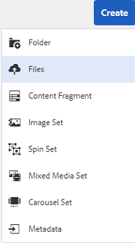
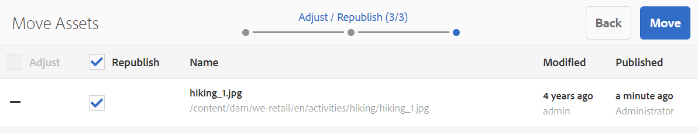
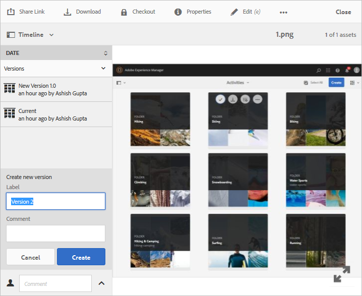

# Gestire le risorse digitali {#manage-digital-assets}

In [!DNL Adobe Experience Manager Assets], puoi fare di più che archiviare e gestire le risorse. [!DNL Experience Manager] offre funzionalità di gestione delle risorse di livello enterprise. Puoi modificare e condividere le risorse, eseguire ricerche avanzate e creare più rappresentazioni di decine di formati di file supportati. Puoi anche gestire versioni e diritti digitali, automatizzare l’elaborazione delle risorse, gestire e gestire i metadati, collaborare con le annotazioni e molto altro.

Il presente articolo descrive le attività di base per la gestione delle risorse, come creare o caricare; aggiornamenti dei metadati; copiare, spostare ed eliminare; pubblicare, annullare la pubblicazione ed eseguire ricerche nelle risorse. Per comprendere l’interfaccia utente, vedi [guida introduttiva all’interfaccia utente delle risorse](/help/sites-authoring/basic-handling.md). Per gestire i frammenti di contenuto, consulta [gestire frammenti di contenuto](/help/assets/content-fragments/content-fragments-managing.md) risorse.

## Creare cartelle {#creating-folders}

Quando si organizza una raccolta di risorse, ad esempio, tutte le `Nature` immagini, puoi creare cartelle per mantenerle unite. Puoi utilizzare le cartelle per suddividere in categorie e organizzare le risorse. [!DNL Experience Manager Assets] non richiede di organizzare meglio le risorse nelle cartelle.

>[!NOTE]
>
>* Condivisione di un [!DNL Assets] cartella del tipo `sling:OrderedFolder` non è supportato quando si condivide con Experience Cloud. Se desideri condividere una cartella, non selezionare [!UICONTROL Ordinato] durante la creazione di una cartella.
>* [!DNL Experience Manager] non consente di utilizzare `subassets` parola come nome di una cartella. È una parola chiave riservata a un nodo che contiene risorse secondarie per le risorse composte.


1. Passa alla posizione nella cartella delle risorse digitali in cui desideri creare una cartella. Nel menu , fai clic su **[!UICONTROL Crea]**. Seleziona **[!UICONTROL Nuova cartella]**.
1. In **[!UICONTROL Titolo]** specificare un nome di cartella. Per impostazione predefinita, DAM utilizza il titolo fornito come nome della cartella. Una volta creata la cartella, è possibile sostituire l’impostazione predefinita e specificare un altro nome di cartella.
1. Fai clic su **[!UICONTROL Crea]**. La cartella viene visualizzata nella cartella delle risorse digitali.

I seguenti caratteri (elenco separato da spazi) non sono supportati:

* Il nome di un file di risorsa non può contenere i seguenti caratteri: `* / : [ \\ ] | # % { } ? &`
* Il nome di una cartella di risorse non può contenere i seguenti caratteri: `* / : [ \\ ] | # % { } ? \" . ^ ; + & \t`

Non includere caratteri speciali nelle estensioni dei nomi dei file delle risorse.

## Caricare le risorse {#uploading-assets}

<!-- TBD the following:
Move this section into a new article. CQDOC-14874 ticket is created for this.
In this complete article, replace emphasis with UICONTROL where appropriate.
-->

Puoi caricare vari tipi di risorse (immagini, file PDF, file RAW e così via) dalla cartella locale o da un&#39;unità di rete in [!DNL Experience Manager Assets].

>[!NOTE]
>
>In modalità Dynamic Media - Scene7, la dimensione predefinita del file di caricamento delle risorse è inferiore o uguale a 2 GB. Per configurare il caricamento di risorse superiori a 2 GB fino a 15 GB, consulta [(Facoltativo) Configura Dynamic Media - Modalità Scene7 per il caricamento di risorse superiori a 2 GB](/help/assets/config-dms7.md#optional-config-dms7-assets-larger-than-2gb).

Puoi scegliere di caricare le risorse nelle cartelle con o senza un profilo di elaborazione ad esse assegnato.

Per le cartelle a cui è assegnato un profilo di elaborazione, il nome del profilo viene visualizzato sulla miniatura nella vista a schede. Nella vista a elenco, il nome del profilo viene visualizzato nella **Profilo di elaborazione** colonna. Vedi [Profili di elaborazione](/help/assets/processing-profiles.md).

Prima di caricare una risorsa, accertati che si trovi in una [format](/help/assets/assets-formats.md) che [!DNL Experience Manager Assets] supporta.

1. In [!DNL Assets] nell’interfaccia utente, individua il percorso in cui desideri aggiungere risorse digitali.
1. Per caricare le risorse, effettua una delle seguenti operazioni:

   * Sulla barra degli strumenti, fai clic su **[!UICONTROL Crea]**. Quindi scegliere dal menu **[!UICONTROL File]**. Se necessario, rinomina il file nella finestra di dialogo visualizzata.
   * In un browser che supporta HTML5, trascina le risorse direttamente sul [!DNL Assets] interfaccia utente. La finestra di dialogo per rinominare il file non viene visualizzata.

   

   Per selezionare più file, seleziona la `Ctrl` o `Command` e seleziona le risorse nella finestra di dialogo del selettore file. Quando utilizzi un iPad, puoi selezionare un solo file alla volta.

   Puoi sospendere il caricamento di risorse di grandi dimensioni (superiori a 500 MB) e riprenderlo più tardi dalla stessa pagina. Fai clic su **[!UICONTROL Pausa]** accanto alla barra di avanzamento visualizzata all’avvio di un caricamento.

   

È possibile configurare la dimensione sopra la quale una risorsa viene considerata una risorsa di grandi dimensioni. Ad esempio, puoi configurare il sistema in modo che consideri le risorse superiori a 1000 MB (anziché 500 MB) come risorse di grandi dimensioni. In questo caso, **[!UICONTROL Pausa]** viene visualizzata sulla barra di avanzamento quando vengono caricate risorse di dimensioni superiori a 1000 MB.

La [!UICONTROL Pausa] non mostra se un file superiore a 1000 MB viene caricato con un file inferiore a 1000 MB. Tuttavia, se si annulla il caricamento di file inferiori a 1000 MB, il **[!UICONTROL Pausa]** viene visualizzata l&#39;opzione .

Per modificare il limite di dimensione, configura il `chunkUploadMinFileSize` proprietà `fileupload` nel repository CRX.

Quando fai clic su **[!UICONTROL Pausa]**, passa alla **[!UICONTROL Play]** opzione . Per riprendere il caricamento, fai clic su **[!UICONTROL Play]**.

Per annullare un caricamento in corso, fai clic su chiudi (`X`) accanto alla barra di avanzamento. Quando si annulla l&#39;operazione di caricamento, [!DNL Assets] elimina la parte parzialmente caricata della risorsa.

La possibilità di riprendere il caricamento è particolarmente utile in scenari con scarsa larghezza di banda e problemi di rete, in cui il caricamento di una risorsa di grandi dimensioni richiede molto tempo. Puoi sospendere l’operazione di caricamento e continuare in un secondo momento quando la situazione migliora. Quando riprendi, il caricamento inizia dal punto in cui l&#39;hai messo in pausa.

Durante l&#39;operazione di caricamento, [!DNL Experience Manager] salva le parti della risorsa caricata come blocchi di dati nell’archivio CRX. Al termine del caricamento, [!DNL Experience Manager] consolida questi blocchi in un singolo blocco di dati nel repository.

Per configurare l’attività di pulizia per i processi di caricamento dei blocchi non completati, vai a `https://[aem_server]:[port]/system/console/configMgr/org.apache.sling.servlets.post.impl.helper.ChunkCleanUpTask`.

>[!CAUTION]
>
>Il caricamento dei blocchi viene attivato quando il valore predefinito è 500 MB e la dimensione del blocco è 50 MB. Se si modifica [Configurazione token Oak Apache Jackrabbit](https://experienceleague.adobe.com/docs/experience-cloud-kcs/kbarticles/KA-16464.html) e imposta `timeout configuration` a meno del tempo necessario al caricamento di una risorsa, si verifica una situazione di timeout della sessione mentre il caricamento della risorsa è in corso. Pertanto, modifica il `chunkUploadMinFileSize` e `chunksize` in modo che ogni richiesta di blocco aggiorni la sessione.
>
>Dato il timeout della scadenza delle credenziali, la latenza, la larghezza di banda e i caricamenti simultanei previsti, il valore più alto che consente di assicurarsi che venga selezionato quanto segue:
>
>* Per garantire che il caricamento dei chunk sia abilitato per i file con dimensioni che potrebbero causare la scadenza delle credenziali durante il caricamento.
>
>* Per garantire il completamento di ogni blocco prima della scadenza delle credenziali.


Se carichi una risorsa con lo stesso nome di una già disponibile nel percorso in cui stai caricando la risorsa, viene visualizzata una finestra di avviso.

Puoi scegliere di sostituire una risorsa esistente, crearne un’altra versione o mantenere entrambe rinominando la nuova risorsa caricata. Se sostituisci una risorsa esistente, i metadati della risorsa e le eventuali modifiche precedenti (ad esempio, annota o ritaglia) apportate alla risorsa esistente vengono eliminati. Se scegli di mantenere entrambe le risorse, la nuova risorsa viene rinominata con numero `1` aggiunto al nome.


>[!NOTE]
>
>Quando selezioni **[!UICONTROL Sostituisci]** in [!UICONTROL Conflitto tra nomi] L’ID della risorsa viene rigenerato per la nuova risorsa. Questo ID è diverso dall’ID della risorsa precedente.
>
>Se Assets Insights è abilitato per tracciare impression o clic con [!DNL Adobe Analytics], l’ID risorsa rigenerato invalida i dati acquisiti per la risorsa su [!DNL Analytics].

Se la risorsa caricata esiste in [!DNL Assets], **[!UICONTROL Duplicati rilevati]** La finestra di dialogo avverte che stai tentando di caricare una risorsa duplicata. La finestra di dialogo viene visualizzata solo se la `SHA 1` il valore di checksum del binario della risorsa esistente corrisponde al valore di checksum della risorsa caricata. In questo caso, i nomi delle risorse non hanno importanza.

>[!NOTE]
>
>La [!UICONTROL Duplicati rilevati] viene visualizzata solo quando la funzione di rilevamento duplicati è abilitata. Per abilitare la funzione di rilevamento duplicati, vedi [Abilita rilevamento duplicati](/help/assets/duplicate-detection.md).


Per mantenere la risorsa duplicata in [!DNL Assets], fai clic su **[!UICONTROL Mantieni]**. Per eliminare la risorsa duplicata caricata, fai clic su **[!UICONTROL Elimina]**.

[!DNL Experience Manager Assets] impedisce il caricamento di risorse con i caratteri non consentiti nei nomi dei file. Se tenti di caricare una risorsa con un nome file contenente un carattere non consentito o più, [!DNL Assets] visualizza un messaggio di avviso e interrompe il caricamento finché non rimuovi questi caratteri o li carichi con un nome consentito.

Per soddisfare convenzioni specifiche di denominazione dei file per la tua organizzazione, la [!UICONTROL Caricare risorse] La finestra di dialogo consente di specificare nomi lunghi per i file caricati.

Tuttavia, i seguenti caratteri (elenco separato da spazi) non sono supportati:

* il nome del file risorsa non deve contenere `* / : [ \\ ] | # % { } ? &`
* il nome della cartella di risorse non deve contenere `* / : [ \\ ] | # % { } ? \" . ^ ; + & \t`

Non includere caratteri speciali nelle estensioni dei nomi dei file delle risorse.


Inoltre, il [!DNL Assets] l’interfaccia utente visualizza la risorsa più recente caricata o la cartella creata per prima.

Se annulli l’operazione di caricamento prima che i file vengano caricati, [!DNL Assets] interrompe il caricamento del file corrente e aggiorna il contenuto. Tuttavia, i file già caricati non vengono eliminati.

Finestra di dialogo di avanzamento del caricamento in [!DNL Assets] visualizza il numero di file caricati correttamente e i file che non sono stati caricati.

### Caricamenti seriali {#serialuploads}

Il caricamento di numerose risorse in blocco consuma notevoli risorse di I/O, il che potrebbe influire negativamente sulle prestazioni delle [!DNL Assets] distribuzione. In particolare, se si dispone di una connessione Internet lenta, il tempo per il caricamento aumenta drasticamente a causa di un picco di I/O del disco. Inoltre, il browser web può introdurre ulteriori restrizioni al numero di richieste POST [!DNL Assets] può gestire il caricamento di risorse simultanee. Di conseguenza, l’operazione di caricamento non riesce o termina prematuramente. In altre parole, [!DNL Experience Manager Assets] potrebbero perdere alcuni file durante l&#39;acquisizione di una serie di file o nel complesso non riuscire a acquisire alcun file.

Per superare questa situazione, [!DNL Assets] Assegna una risorsa alla volta (caricamento seriale) durante un’operazione di caricamento in blocco, invece di acquisire contemporaneamente tutte le risorse.

Il caricamento seriale delle risorse è abilitato per impostazione predefinita. Per disattivare la funzione e consentire il caricamento simultaneo, sovrapponi la `fileupload` in Crx-de e imposta il valore del `parallelUploads` proprietà di `true`.

### Caricare risorse tramite FTP {#uploading-assets-using-ftp}

Dynamic Media consente il caricamento batch delle risorse tramite server FTP. Se vuoi caricare risorse di grandi dimensioni (>1 GB) o caricare intere cartelle e sottocartelle, devi utilizzare l&#39;FTP. Puoi anche impostare il caricamento FTP in modo che si verifichi su base ricorrente pianificata.

>[!NOTE]
>
>In modalità Dynamic Media - Scene7, la dimensione predefinita del file di caricamento delle risorse è inferiore o uguale a 2 GB. Per configurare il caricamento di risorse superiori a 2 GB fino a 15 GB, consulta [(Facoltativo) Configura Dynamic Media - Modalità Scene7 per il caricamento di risorse superiori a 2 GB](/help/assets/config-dms7.md#optional-config-dms7-assets-larger-than-2gb).

>[!NOTE]
>
>Per caricare le risorse tramite FTP in modalità Dynamic Media - Scene7, installa Feature Pack 18912 nel [!DNL Experience Manager] istanze di authoring. Contatto [Adobe Assistenza clienti](https://experienceleague.adobe.com/?support-solution=General#support) per accedere a FP-18912 e completare la configurazione del tuo account FTP. Per ulteriori informazioni, consulta [Installa feature pack 18912 per la migrazione di massa delle risorse](/help/assets/bulk-ingest-migrate.md).
>
>Se utilizzi l’FTP per caricare le risorse, le impostazioni di caricamento specificate in [!DNL Experience Manager] vengono ignorati. Vengono invece utilizzate le regole di elaborazione dei file definite in Dynamic Media Classic.

**Per caricare le risorse tramite FTP**

1. Utilizzando il client FTP desiderato, accedi al server FTP utilizzando il nome utente e la password FTP ricevuti dall&#39;e-mail di provisioning. Nel client FTP, carica file o cartelle sul server FTP.

1. Apri [applicazione desktop Dynamic Media Classic](https://experienceleague.adobe.com/docs/dynamic-media-classic/using/intro/dynamic-media-classic-desktop-app.html#system-requirements-dmc-app), quindi accedi al tuo account.

   Le credenziali e l&#39;accesso sono stati forniti da Adobe al momento del provisioning. Se non disponi di tali informazioni, contatta l’Assistenza clienti Adobe.

1. Nella barra di navigazione globale, fai clic su **[!UICONTROL Carica]**.
1. Nella pagina Carica , fai clic sul pulsante **[!UICONTROL Tramite FTP]** scheda .
1. Sul lato sinistro della pagina, scegli una cartella FTP da cui caricare i file; sul lato destro della pagina, scegli una cartella di destinazione.
1. Fai clic su nell’angolo in basso a destra della pagina **[!UICONTROL Opzioni processo]** quindi impostate le opzioni desiderate in base alle risorse nella cartella selezionata.

   Vedi [Opzioni processo di caricamento](#upload-job-options).

   >[!NOTE]
   >
   >Quando carichi le risorse tramite FTP, le opzioni del processo di caricamento impostate in Dynamic Media Classic (S7) hanno un precedente sui parametri di elaborazione delle risorse impostati in [!DNL Experience Manager].

1. Nell’angolo inferiore destro della finestra di dialogo Opzioni processo di caricamento , fai clic su **[!UICONTROL Salva]**.
1. Nell’angolo in basso a destra della pagina Carica, fai clic su **[!UICONTROL Invia caricamento]**.

   Per visualizzare l&#39;avanzamento del caricamento, nella barra di navigazione globale fai clic su **[!UICONTROL Processi]**. Nella pagina Processi viene visualizzato l’avanzamento del caricamento. Puoi continuare a lavorare in [!DNL Experience Manager] e tornare alla pagina Processi in Dynamic Media Classic in qualsiasi momento per esaminare un processo in corso.
Per annullare un processo di caricamento in corso, fai clic su **[!UICONTROL Annulla]** accanto all&#39;ora di durata.

#### Opzioni processo di caricamento {#upload-job-options}

| Opzione Carica | Suboption | Descrizione |
|---|---|---|
| Nome processo |  | Il nome predefinito precompilato nel campo di testo include la parte del nome inserita dall’utente e la data e l’ora. Puoi utilizzare il nome predefinito o immettere un nome della tua creazione per questo processo di caricamento. <br>Il processo e gli altri processi di caricamento e pubblicazione vengono registrati nella pagina Processi , dove puoi controllare lo stato dei processi. |
| Pubblica dopo il caricamento |  | Pubblica automaticamente le risorse caricate. |
| Sovrascrivi in qualsiasi cartella, nome come risorsa base, ignora estensione |  | Seleziona questa opzione se desideri che i file caricati sostituiscano quelli esistenti con gli stessi nomi. Il nome di questa opzione potrebbe essere diverso, a seconda delle impostazioni in **[!UICONTROL Impostazione applicazione]** > **[!UICONTROL Impostazioni generali]** > **[!UICONTROL Carica nell’applicazione]** > **[!UICONTROL Sovrascrivi immagini]**. |
| Decomprimi file Zip o Tar durante il caricamento |  |  |
| Opzioni processo |  | Fai clic su **[!UICONTROL Opzioni processo]** in modo da poter aprire [!UICONTROL Opzioni processo di caricamento] e scegli le opzioni che interessano l’intero processo di caricamento. Queste opzioni sono le stesse per tutti i tipi di file.<br>Puoi scegliere le opzioni predefinite per il caricamento dei file a partire dalla pagina Impostazioni generali applicazione. Per aprire la pagina, scegli **[!UICONTROL Configurazione]** > **[!UICONTROL Impostazione applicazione]**. Seleziona la **[!UICONTROL Opzioni di caricamento predefinite]** per aprire [!UICONTROL Opzioni processo di caricamento] finestra di dialogo. |
|  | Quando   | Selezionare Una tantum o Ricorrente. Per impostare un lavoro ricorrente, scegli un’opzione Ripeti (Giornaliero, Settimanale, Mensile o Personalizzato) per specificare quando vuoi che il processo di caricamento FTP si ripeta. Quindi specifica le opzioni di pianificazione in base alle esigenze. |
|  | Includi sottocartelle | Carica tutte le sottocartelle all’interno della cartella che desideri caricare. I nomi della cartella e delle relative sottocartelle caricate vengono inseriti automaticamente in [!DNL Experience Manager Assets]. |
|  | Opzioni di ritaglio | Per ritagliare manualmente i lati di un’immagine, selezionate il menu Ritaglio e scegliete Manuale. Quindi immetti il numero di pixel da ritagliare da qualsiasi lato o lato dell’immagine. La quantità di immagine ritagliata dipende dall’impostazione ppi (pixel per pollice) nel file di immagine. Ad esempio, se l’immagine viene visualizzata a 150 ppi e immetti 75 nelle caselle di testo In alto, A destra, In basso e A sinistra, viene ritagliato mezzo pollice da ciascun lato.<br> Per ritagliare automaticamente i pixel dello spazio bianco da un’immagine, aprite il menu Ritaglio, scegliete Manuale e immettete le misurazioni dei pixel nei campi In alto, A destra, In basso e A sinistra per ritagliare dai lati. Potete anche scegliere Rifila dal menu Ritaglia e scegliere le seguenti opzioni:<br> **Rifila in base a** <ul><li>**Colore** - Scegliere l&#39;opzione Colore. Selezionate quindi il menu Angolo (Corner) e scegliete l’angolo dell’immagine con il colore che rappresenta meglio lo spazio bianco da ritagliare.</li><li>**Trasparenza** - Scegliere l&#39;opzione Trasparenza.<br> **Tolleranza** - Trascinate il cursore per specificare una tolleranza da 0 a 1.Per il ritaglio in base al colore, specificate 0 per ritagliare i pixel solo se corrispondono esattamente al colore selezionato nell’angolo dell’immagine. I numeri più vicini a 1 consentono una maggiore differenza di colore.<br>Per il ritaglio in base alla trasparenza, specificare 0 per ritagliare i pixel solo se sono trasparenti. I numeri più vicini a 1 consentono una maggiore trasparenza.</li></ul><br>Queste opzioni di ritaglio non sono distruttive. |
|  | Opzioni del profilo colore | Scegli una conversione del colore quando crei file ottimizzati utilizzati per la distribuzione:<ul><li>Conservazione colore predefinita: mantiene i colori dell&#39;immagine sorgente ogni volta che le immagini contengono informazioni sullo spazio colore; non vi è alcuna conversione del colore. Quasi tutte le immagini oggi hanno il profilo colore appropriato già incorporato. Tuttavia, se un&#39;immagine sorgente CMYK non contiene un profilo colore incorporato, i colori vengono convertiti in spazio colore sRGB (standard Rosso Verde Blu). sRGB è lo spazio colore consigliato per la visualizzazione di immagini su pagine web.</li><li>Mantieni spazio colore originale: Mantiene i colori originali senza alcuna conversione al punto. Per le immagini prive di un profilo colore incorporato, qualsiasi conversione di colore viene effettuata utilizzando i profili colore predefiniti configurati nelle impostazioni di pubblicazione. I profili colore potrebbero non essere allineati al colore nei file creati con questa opzione. Pertanto, si consiglia di utilizzare l&#39;opzione Conservazione colore predefinita.</li><li>Personalizzato Da > A<br> Apre i menu in modo da poter scegliere uno spazio colore Converti da e Converti in. Questa opzione avanzata sostituisce tutte le informazioni sui colori incorporate nel file di origine. Selezionare questa opzione quando tutte le immagini che si stanno inviando contengono dati di profilo colore errati o mancanti.</li></ul> |
|  | Opzioni di modifica delle immagini | È possibile mantenere le maschere di ritaglio nelle immagini e scegliere un profilo colore.<br> Vedi [Opzioni di impostazione per le modifiche alle immagini al momento del caricamento](#setting-image-editing-options-at-upload). |
|  | Opzioni Postscript | È possibile rasterizzare file di PostScript®, ritagliare file, mantenere sfondi trasparenti, scegliere una risoluzione e scegliere uno spazio colore.<br> Vedi [Impostazione delle opzioni di caricamento PostScript e Illustrator](#setting-postscript-and-illustrator-upload-options). |
|  | Opzioni Photoshop | È possibile creare modelli da file Adobe® Photoshop®, mantenere i livelli, specificare il nome dei livelli, estrarre il testo e specificare il modo in cui le immagini vengono ancorate ai modelli.<br> I modelli non sono supportati in [!DNL Experience Manager].<br> Vedi [Impostazione delle opzioni di caricamento di Photoshop](#setting-photoshop-upload-options). |
|  | Opzioni di PDF | È possibile rasterizzare i file, estrarre parole di ricerca e collegamenti, generare automaticamente un eCatalog, impostare la risoluzione e scegliere uno spazio colore.<br>Gli eCatalog non sono supportati in [!DNL Experience Manager]. <br> Vedi [Impostazione delle opzioni di caricamento di PDF](#setting-pdf-upload-options). |
|  | Opzioni Illustrator | È possibile rasterizzare i file Adobe Illustrator®, mantenere sfondi trasparenti, scegliere una risoluzione e scegliere uno spazio colore.<br> Vedi [Impostazione delle opzioni di caricamento PostScript e Illustrator](#setting-postscript-and-illustrator-upload-options). |
|  | Opzioni eVideo | È possibile transcodificare un file video scegliendo un predefinito per video.<br> Vedi [Impostazione delle opzioni di caricamento di eVideo](#setting-evideo-upload-options). |
|  | Predefiniti set di batch | Per creare un set di immagini o un set 360 gradi dai file caricati, fai clic sulla colonna Attivo per il predefinito da utilizzare. Puoi selezionare più di un predefinito. Puoi creare i predefiniti nella pagina Impostazione applicazione/Predefiniti set di batch di Dynamic Media Classic.<br> Vedi [Configurazione dei predefiniti per set di batch per generare automaticamente set di immagini e set 360 gradi](config-dms7.md#creating-batch-set-presets-to-auto-generate-image-sets-and-spin-sets) per ulteriori informazioni sulla creazione di predefiniti per set di batch.<br> Vedi [Impostazione dei predefiniti per set di batch al caricamento](#setting-batch-set-presets-at-upload). |

#### Imposta le opzioni per le modifiche alle immagini al momento del caricamento {#setting-image-editing-options-at-upload}

Durante il caricamento di file di immagine, inclusi i file AI, EPS e PSD, puoi effettuare le seguenti azioni di modifica in [!UICONTROL Opzioni processo di caricamento] finestra di dialogo:

* Ritaglia lo spazio bianco dal bordo delle immagini (vedi descrizione nella tabella precedente).
* Ritaglia manualmente dai lati delle immagini (vedi descrizione nella tabella precedente).
* Scegli un profilo colore (consulta la descrizione dell’opzione nella tabella precedente).
* Create una maschera da un tracciato di ritaglio.
* Nitidezza delle immagini con opzioni di mascheramento definite
* Sfondo Knockout

<!--
| Option | Sub-option | Description |
|---|---|---|
| Create Mask From Clipping Path | | Create a mask for the image based on its clipping path information. This option applies to images created with image-editing applications in which a clipping path was created. |
| Unsharp Masking | | Lets you fine-tune a sharpening filter effect on the final downsampled image, controlling the intensity of the effect, the radius of the effect (as measured in pixels), and a threshold of contrast that is ignored.<br> This effect uses the same options as Photoshop’s Unsharp Mask filter. Contrary to what the name suggests, Unsharp Mask is a sharpening filter. Under Unsharp Masking, set the options you want. Setting options are described in the following: |
| | Amount | Controls the amount of contrast that is applied to edge pixels.<br> Think of it as the intensity of the effect. The main difference between the amount values of Unsharp Mask in Dynamic Media and the amount values in Adobe Photoshop, is that Photoshop has an amount range of 1% to 500%. Whereas, in Dynamic Media, the value range is 0.0 to 5.0. A value of 5.0 is the rough equivalent of 500% in Photoshop; a value of 0.9 is the equivalent of 90%, and so on. |
| | Radius | Controls the radius of the effect. The value range is 0-250.<br> The effect is run on all pixels in an image and radiates out from all pixels in all directions. The radius is measured in pixels. For example, to get a similar sharpening effect for a 2000 x 2000 pixel image and 500 x 500 pixel image, you would set a radius of two pixels on the 2000 x 2000 pixel image and a radius value of one pixel on the 500 x 500 pixel image. A larger value is used for an image that has more pixels. |
| | Threshold | Threshold is a range of contrast that is ignored when the Unsharp Mask filter is applied. It is important so that no "noise" is introduced to an image when this filter is used. The value range is 0-255, which is the number of brightness steps in a grayscale image. 0=black, 128=50% gray and 255=white.<br> For example, a threshold value of 12 ignores slight variations is skin tone brightness to avoid adding noise, but still add edge contrast to areas such as where eyelashes meet skin.<br> For example, if you have a photo of someone’s face, the Unsharp Mask affects the parts of the image, such as where eyelashes and skin meet to create an obvious area of contrast, and the smooth skin itself. Even the smoothest skin exhibits subtle changes in brightness values. If you do not use a threshold value, the filter accentuates these subtle changes in skin pixels. In turn, a noisy and undesirable effect is created while contrast on the eyelashes is increased, enhancing sharpness.<br> To avoid this issue, a threshold value is introduced that tells the filter to ignore pixels that do not change contrast dramatically, like smooth skin.<br> In the zipper graphic shown earlier, notice the texture next to the zippers. Image noise is exhibited because the threshold values were too low to suppress the noise. |
| | Monochrome | Select to unsharp-mask image brightness (intensity).<br> Deselect to unsharp-mask each color component separately. |
| Knockout Background | | Automatically removes the background of an image when you upload it. This technique is useful to draw attention to a particular object and make it stand out from a busy background. Select to enable or “turn on” the Knockout Background feature and the following sub-options: |
| | Corner | Required.<br> The corner of the image that is used to define the background color to knockout.<br> You can choose from **Upper Left**, **Bottom Left**, **Upper Right**, or **Bottom Right**. |
| | Fill Method | Required.<br> Controls pixel transparency from the Corner location that you set.<br> You can choose from the following fill methods: <ul><li>**Flood Fill** - turns all pixels transparent that match the Corner that you have specified and are connected to it.</li><li>**Match Pixel** - turns all matching pixels transparent, regardless of their location on the image.</li></ul> |
| | Tolerance | Optional.<br> Controls the allowable amount of variation in pixel color matching based on the Corner location that you set.<br> Use a value of 0.0 to match pixel colors exactly or, use a value of 1.0 to allow for the greatest variation. |
-->

#### Impostare le opzioni di caricamento PostScript e Illustrator {#setting-postscript-and-illustrator-upload-options}

Quando carichi i file immagine PostScript (EPS) o Illustrator (AI), puoi formattarli in vari modi. È possibile rasterizzare i file, mantenere lo sfondo trasparente, scegliere una risoluzione e scegliere uno spazio colore. Le opzioni per la formattazione dei file PostScript e Illustrator sono disponibili nella sezione [!UICONTROL Opzioni processo di caricamento] finestra di dialogo in [!UICONTROL Opzioni PostScript] e [!UICONTROL Opzioni Illustrator].

| Opzione | Suboption | Descrizione |
|---|---|---|
| Elaborazione |  | Scegli **[!UICONTROL Rasterizza]** per convertire la grafica vettoriale nel file in formato bitmap. |
| Mantenere lo sfondo trasparente nell&#39;immagine renderizzata |  | Mantenere la trasparenza in background del file. |
| Risoluzione |  | Determina l&#39;impostazione della risoluzione. Questa impostazione determina quanti pixel vengono visualizzati per pollice nel file. |
| Spazio colore |  | Selezionare il menu Spazio colore e scegliere tra le seguenti opzioni di spazio colore: |
|  | Rileva automaticamente | Mantiene lo spazio colore del file. |
|  | Forza come RGB | Si converte nello spazio colore di RGB. |
|  | Forza come CMYK | Si converte nello spazio colore CMYK. |
|  | Forza come scala di grigi | Converte lo spazio colore in scala di grigi. |

#### Impostare le opzioni di caricamento di Photoshop {#setting-photoshop-upload-options}

I file Photoshop Document (PSD) vengono utilizzati più spesso per creare modelli di immagine. Quando carichi un file PSD, puoi creare automaticamente un modello di immagine dal file (seleziona il [!UICONTROL Crea modello] nella schermata Carica).

Dynamic Media crea più immagini da un file PSD con livelli se utilizzi il file per creare un modello; crea un&#39;immagine per ogni livello.

Utilizza la [!UICONTROL Opzioni di ritaglio] e [!UICONTROL Opzioni del profilo colore], descritto in precedenza, con le opzioni di caricamento di Photoshop.

>[!NOTE]
>
>I modelli non sono supportati in [!DNL Experience Manager].

| Opzione | Suboption | Descrizione |
|---|---|---|
| Gestisci livelli |  | Racchiude gli eventuali livelli di PSD in singole risorse. I livelli delle risorse rimangono associati al PSD. Per visualizzarli, aprite il file PSD in visualizzazione Dettagli e selezionate il pannello dei livelli. |
| Crea modello |  | Crea un modello dai livelli nel file PSD. |
| Estrai testo |  | Estrae il testo in modo che gli utenti possano cercare il testo in un visualizzatore. |
| Estendi livelli a dimensione sfondo |  | Estende le dimensioni dei livelli immagine ritagliati alle dimensioni del livello di sfondo. |
| Denominazione dei livelli |  | I livelli nel file PSD vengono caricati come immagini separate. |
|  | Nome livello | Assegna un nome alle immagini dopo i relativi nomi di livello nel file PSD. Ad esempio, un livello denominato Tag prezzo nel file PSD originale diventa un’immagine denominata Tag prezzo . Tuttavia, se i nomi dei livelli nel file PSD sono nomi di livello Photoshop predefiniti (Sfondo, Livello 1, Livello 2 e così via), le immagini vengono denominate in base ai numeri dei rispettivi livelli nel file PSD. I nomi dei livelli predefiniti non vengono denominati. |
|  | Photoshop e numero di livelli | Assegna un nome alle immagini dopo i relativi numeri di livello nel file PSD, ignorando i nomi dei livelli originali. Le immagini vengono denominate con il nome del file Photoshop e un numero di livello aggiunto. Ad esempio, il secondo livello di un file denominato Spring Ad.psd si chiama Spring Ad_2 anche se in Photoshop era presente un nome non predefinito. |
|  | Photoshop e nome livello | Assegna un nome alle immagini dopo il file PSD seguito dal nome del livello o dal numero del livello. Il numero del livello viene utilizzato se i nomi dei livelli nel file PSD sono nomi di livello Photoshop predefiniti. Ad esempio, un livello denominato Tag prezzo in un file PSD denominato SpringAd è denominato Tag Ad_Price di primavera. Un livello con il nome predefinito Layer 2 si chiama Spring Ad_2. |
| Ancoraggio |  | Specifica il modo in cui le immagini vengono ancorate nei modelli generati dalla composizione a livelli prodotta dal file PSD. Per impostazione predefinita, l’ancoraggio è al centro. Un ancoraggio centrale consente alle immagini sostitutive di riempire al meglio lo stesso spazio, indipendentemente dalle proporzioni dell&#39;immagine sostitutiva. Le immagini con un aspetto diverso che sostituiscono questa immagine, quando fanno riferimento al modello e utilizzano la sostituzione di parametri, occupano effettivamente lo stesso spazio. Passa a un’impostazione diversa se l’applicazione richiede le immagini sostitutive per riempire lo spazio allocato nel modello. |

#### Impostare le opzioni di caricamento di PDF {#setting-pdf-upload-options}

Quando carichi un file PDF, puoi formattarlo in vari modi. Ritagliate le pagine, estraete le parole di ricerca, immettete una risoluzione pixel per pollice e scegliete uno spazio colore. I file PDF contengono spesso un margine di taglio, indicatori di ritaglio, segni di registrazione e altri segni della stampante. È possibile ritagliare questi segni dai lati delle pagine durante il caricamento di un file PDF.

>[!NOTE]
>
>Gli eCatalog non sono supportati in [!DNL Experience Manager].

Scegli tra le seguenti opzioni:

| Opzione | Suboption | Descrizione |
|---|---|---|
| Elaborazione | Rasterizza | (Impostazione predefinita) Esegue l’striping delle pagine nel file PDF e converte la grafica vettoriale in immagini bitmap. Scegli questa opzione se desideri creare un eCatalog. |
| Estrai | Cerca parole | Estrae le parole dal file PDF in modo che la ricerca nel file possa essere eseguita per parola chiave in un visualizzatore di eCatalog. |
|  | Collegamenti | Estrae i collegamenti dai file PDF e li converte in mappe immagine utilizzate in un visualizzatore di eCatalog. |
| Genera automaticamente eCatalog da più PDF di pagina |  | Crea automaticamente un eCatalog dal file PDF. L’eCatalog prende il nome dal file PDF caricato. Questa opzione è disponibile solo se il file PDF viene rasterizzato durante il caricamento. |
| Risoluzione |  | Determina l&#39;impostazione della risoluzione. Questa impostazione determina quanti pixel vengono visualizzati per pollice nel file PDF. Il valore predefinito è 150. |
| Spazio colore |  | Selezionare il menu Spazio colore e scegliere uno spazio colore per il file PDF. La maggior parte dei file PDF dispone sia di immagini a colori RGB che CMYK. Lo spazio colore RGB è preferibile per la visualizzazione online. |
|  | Rileva automaticamente | Mantiene lo spazio colore del file PDF. |
|  | Converti in RGB | Si converte nello spazio colore di RGB. |
|  | Converti in CMYK | Si converte nello spazio colore CMYK. |
|  | Converti in scala di grigio | Converte lo spazio colore in scala di grigi. |

#### Impostare le opzioni di caricamento di eVideo {#setting-evideo-upload-options}

Per transcodificare un file video scegliendo tra vari predefiniti video.

| Opzione | Suboption | Descrizione |
|---|---|---|
| Video adattivo |  | Un singolo predefinito di codifica che funziona con qualsiasi proporzione per creare video da distribuire a dispositivi mobili, tablet e desktop. I video sorgente caricati codificati con questo predefinito sono impostati con un’altezza fissa. Tuttavia, la larghezza viene ridimensionata automaticamente per mantenere le proporzioni del video. <br>Si consiglia di utilizzare la codifica video adattiva. |
| Predefiniti di codifica singoli | Ordina predefiniti di codifica | Seleziona **[!UICONTROL Nome]** o **[!UICONTROL Dimensione]** se desideri ordinare i predefiniti di codifica elencati in Desktop, Mobile e Tablet per nome o per dimensione della risoluzione. |
|  | Desktop | Crea un file MP4 per fornire un&#39;esperienza video in streaming o progressiva ai computer desktop. Seleziona una o più proporzioni con la dimensione di risoluzione e la velocità dati di destinazione desiderati. |
|  | Mobile | Crea un file MP4 da consegnare su dispositivi mobili iPhone o Android™. Seleziona una o più proporzioni con la dimensione di risoluzione e la velocità dati di destinazione desiderati. |
|  | Tablet | Crea un file MP4 da consegnare su dispositivi tablet iPad o Android™. Seleziona una o più proporzioni con la dimensione di risoluzione e la velocità dati di destinazione desiderati. |

#### Imposta predefiniti set di batch al caricamento {#setting-batch-set-presets-at-upload}

Se desideri creare automaticamente un set di immagini o un set 360 gradi dalle immagini caricate, fai clic sulla colonna Attivo per il predefinito da utilizzare. Puoi selezionare più di un predefinito.

Vedi [Configurazione dei predefiniti per set di batch per generare automaticamente set di immagini e set 360 gradi](/help/assets/config-dms7.md#creating-batch-set-presets-to-auto-generate-image-sets-and-spin-sets) per ulteriori informazioni sulla creazione di predefiniti per set di batch.

### Caricamenti in streaming {#streamed-uploads}

Se carichi molte risorse in Adobe Experience Manager, le richieste di I/O sul server aumentano drasticamente, riducendo l’efficienza di caricamento e causando anche il timeout di alcune attività di caricamento. [!DNL Experience Manager Assets] supporta il caricamento in streaming delle risorse. Il caricamento in streaming riduce l’I/O del disco durante l’operazione di caricamento, evitando l’archiviazione delle risorse in una cartella temporanea sul server prima di copiarlo nell’archivio. Al contrario, i dati vengono trasferiti direttamente nell’archivio. In questo modo, il tempo necessario per caricare risorse di grandi dimensioni e la possibilità di timeout viene ridotto. Il caricamento in streaming è abilitato per impostazione predefinita in [!DNL Assets].

>[!NOTE]
>
>Il caricamento in streaming è disattivato per Adobe Experience Manager in esecuzione su server JEE con versione servlet-api inferiore alla 3.1.

### Estrai archivio ZIP contenente risorse {#extractzip}

Puoi caricare gli archivi ZIP come qualsiasi altra risorsa supportata. Le stesse regole del nome file si applicano ai file ZIP. [!DNL Experience Manager] consente di estrarre un archivio ZIP in una posizione DAM. Se i file di archivio non contengono ZIP come estensione, abilita il rilevamento del tipo di file utilizzando il contenuto.

Seleziona un archivio ZIP alla volta, fai clic su **[!UICONTROL Extract Archive]**, quindi seleziona una cartella di destinazione. Selezionare un&#39;opzione che si desidera gestire i conflitti, se presenti. Se le risorse nel file ZIP sono presenti nella cartella di destinazione, puoi selezionare una delle seguenti opzioni: salta l’estrazione, sostituisci i file esistenti, mantieni entrambe le risorse rinominando o crea una versione.

Al termine dell’estrazione, [!DNL Experience Manager] notifica nell’area di notifica. Quando [!DNL Experience Manager] estrae il file ZIP, puoi tornare al tuo lavoro senza interrompere l’estrazione.


Alcune limitazioni della funzione sono:

* Se nella destinazione esiste una cartella con lo stesso nome, le risorse del file ZIP vengono estratte nella cartella esistente.
* Se annulli l’estrazione, le risorse già estratte non vengono eliminate.
* Non è possibile selezionare due file ZIP contemporaneamente ed estrarli. Puoi estrarre un solo archivio ZIP alla volta.
* Quando si carica un archivio ZIP, se nella finestra di dialogo di caricamento viene visualizzato un errore del server 500, riprovare dopo l&#39;installazione [l&#39;ultimo Service Pack](/help/release-notes/release-notes.md).

## Anteprima delle risorse {#previewing-assets}

Per visualizzare l’anteprima di una risorsa, effettua le seguenti operazioni.

1. Da [!DNL Assets] nell’interfaccia utente, individua il percorso della risorsa da visualizzare in anteprima.
1. Fai clic sulla risorsa desiderata per aprirla.

1. Nella modalità di anteprima sono disponibili le opzioni di zoom per [Tipi di immagini supportati](/help/assets/assets-formats.md#supported-raster-image-formats) (con modifica interattiva).

   Per ingrandire una risorsa, fai clic su `+` (oppure fai clic sulla lente di ingrandimento sulla risorsa). Per ridurre lo zoom, fai clic su `-`. Quando ingrandisci, puoi osservare da vicino qualsiasi area dell&#39;immagine tramite panoramica. La freccia di reimpostazione dello zoom consente di tornare alla visualizzazione originale. Per ripristinare le dimensioni originali della visualizzazione, fare clic su **[!UICONTROL Reimposta]** .

**Visualizzare in anteprima le risorse utilizzando solo i tasti di scelta rapida**

Per visualizzare in anteprima una risorsa utilizzando la tastiera, effettua le seguenti operazioni:

1. Da [!DNL Assets] interfaccia utente, passa alla risorsa desiderata utilizzando `Tab` e i tasti freccia.

1. Press `Enter` seleziona la risorsa desiderata per aprirla. Potete effettuare lo zoom delle risorse in modalità anteprima.

1. Per ingrandire la risorsa:
   1. Utilizzo `Tab` per spostare la messa a fuoco all&#39;opzione di zoom in.
   1. Utilizzo `Enter` per ingrandire l&#39;immagine.

   Per ridurre, utilizza la funzione `Tab` per attivare l&#39;opzione di zoom out e premere `Enter`.

1. Utilizzo `Shift` + `Tab` tasti per spostare lo stato attivo sull&#39;immagine.

1. Utilizza i tasti freccia per spostarsi intorno all&#39;immagine ingrandita.

>[!MORELIKETHIS]
>
>* [Anteprima risorse Dynamic Media](/help/assets/previewing-assets.md).
>* [Visualizzare le risorse secondarie](managing-linked-subassets.md#viewing-subassets).


## Modifica di proprietà e metadati {#editing-properties}

1. Andate alla posizione della risorsa di cui desiderate modificare i metadati.

1. Seleziona la risorsa, quindi dalla barra degli strumenti seleziona **[!UICONTROL Proprietà]** in modo da visualizzare le proprietà della risorsa. In alternativa, scegli la **[!UICONTROL Proprietà]** azione rapida sulla scheda delle risorse.

   

1. In [!UICONTROL Proprietà] , modifica le proprietà dei metadati in varie schede. Ad esempio, sotto il **[!UICONTROL Base]** , modifica il titolo e la descrizione.

   >[!NOTE]
   >
   >Il layout del [!UICONTROL Proprietà] le proprietà di pagina e metadati disponibili dipendono dallo schema di metadati sottostante. Per scoprire come modificare il layout del [!UICONTROL Proprietà] pagina, vedi [Schemi metadati](/help/assets/metadata-schemas.md).

1. Per pianificare una data/ora specifica per l’attivazione della risorsa, utilizza il selettore data posto accanto al campo **[!UICONTROL On Time (All’ora)]**.

   

   *Figura: Utilizza il selettore data per pianificare l’attivazione delle risorse.*

1. Per disattivare la risorsa dopo una determinata durata, scegli la data/ora di disattivazione dal selettore data accanto al **[!UICONTROL Ora di disattivazione]** campo . La data di disattivazione deve essere successiva alla data di attivazione di una risorsa. Dopo la [!UICONTROL Ora di disattivazione], una risorsa e i relativi rendering non sono disponibili tramite [!DNL Assets] interfaccia web o tramite l’API HTTP.

1. In **[!UICONTROL Tag]** selezionare uno o più tag. Per aggiungere un tag personalizzato, digita il nome del tag nella casella e seleziona `Enter`. Il nuovo tag viene salvato in [!DNL Experience Manager]. [!DNL YouTube] richiede tag per la pubblicazione. Vedi [pubblicare video in YouTube](video.md#publishing-videos-to-youtube).

   >[!NOTE]
   >
   >Per creare i tag, è necessario disporre di un&#39;autorizzazione di scrittura in `/content/cq:tags/default` nell’archivio CRX.

1. Per assegnare una valutazione alla risorsa, fai clic sul pulsante **[!UICONTROL Avanzate]** quindi fai clic sulla stella nella posizione appropriata per assegnare la valutazione desiderata.

   

   Il punteggio di valutazione assegnato alla risorsa viene visualizzato in **[!UICONTROL Valutazioni]**. Il punteggio medio di valutazione della risorsa ricevuto dagli utenti che hanno valutato la risorsa viene visualizzato in **[!UICONTROL Valutazione]**. Inoltre, viene visualizzata la suddivisione dei punteggi di rating che contribuiscono al punteggio medio in **[!UICONTROL Suddivisione dei rating]**. Puoi cercare le risorse in base ai punteggi di valutazione medi.

1. Per visualizzare le statistiche di utilizzo della risorsa, fai clic sul pulsante **[!UICONTROL Informazioni approfondite]** scheda .

   Le statistiche di utilizzo includono:

   * Numero di volte in cui la risorsa è stata visualizzata o scaricata
   * Canali/dispositivi attraverso i quali è stata utilizzata la risorsa
   * Soluzioni creative in cui la risorsa è stata recentemente utilizzata

   Per ulteriori dettagli, consulta [Informazioni sulle risorse](/help/assets/asset-insights.md).

1. Fai clic su **[!UICONTROL Salva e chiudi]**.
1. Passa a [!DNL Assets] interfaccia utente. Le proprietà dei metadati modificati, quali titolo, descrizione, valutazioni e così via, vengono visualizzate sulla scheda delle risorse nella vista Scheda e nelle colonne pertinenti nella vista Elenco.

## Copiare le risorse {#copying-assets}

Quando copi una risorsa o una cartella, viene copiata l’intera risorsa o la cartella insieme alla relativa struttura del contenuto. Una risorsa o una cartella copiata viene duplicata nel percorso di destinazione. La risorsa nella posizione di origine non viene modificata.

Alcuni attributi univoci per una particolare copia di una risorsa non vengono riportati in avanti. Alcuni esempi sono:

* ID risorsa, data e ora di creazione, versioni e cronologia delle versioni. Alcune di queste proprietà sono indicate dalle proprietà `jcr:uuid`, `jcr:created`e `cq:name`.

* L’ora di creazione e i percorsi di riferimento sono univoci per ogni risorsa e per ogni suo rendering.

Le altre proprietà e informazioni sui metadati vengono mantenute. Non viene creata una copia parziale durante la copia di una risorsa.

1. In [!DNL Assets] , seleziona una o più risorse e fai clic su **[!UICONTROL Copia]** dalla barra degli strumenti. In alternativa, seleziona la **[!UICONTROL Copia]**  azione rapida dalla scheda delle risorse.

   >[!NOTE]
   >
   >Se utilizzi [!UICONTROL Copia] azione rapida, puoi copiare una sola risorsa alla volta.

1. Andate alla posizione in cui desiderate copiare le risorse.

   >[!NOTE]
   >
   >Se copi una risorsa nella stessa posizione, [!DNL Experience Manager] genera automaticamente una variante del nome. Ad esempio, se copi una risorsa con titolo `Square`, [!DNL Experience Manager] genera automaticamente il titolo per la relativa copia come `Square1`.

1. Fai clic sul pulsante **[!UICONTROL Incolla]**  opzione risorsa dalla barra degli strumenti. Le risorse vengono quindi copiate in questa posizione.

   >[!NOTE]
   >
   >La **[!UICONTROL Incolla]** è disponibile nella barra degli strumenti fino al completamento dell’operazione Incolla.

## Spostare e rinominare le risorse {#moving-or-renaming-assets}

Quando sposti le risorse (o le cartelle) in un altro percorso, le risorse (o le cartelle) non vengono duplicate come durante la copia della risorsa. Le risorse (o le cartelle) vengono posizionate nel percorso di destinazione e rimosse dal percorso di origine. È inoltre possibile rinominare la risorsa quando la si sposta nella nuova posizione.
Se sposti una risorsa pubblicata in un percorso diverso, puoi anche ripubblicare la risorsa. Per impostazione predefinita, l’operazione di spostamento su una risorsa pubblicata la annulla automaticamente. Una risorsa spostata viene ripubblicata se l’autore seleziona la [!UICONTROL Ripubblica] quando si sposta la risorsa.



Per spostare risorse o cartelle:

1. Andate alla posizione della risorsa da spostare.

1. Seleziona la risorsa e fai clic su **[!UICONTROL Sposta]** dalla barra degli strumenti.
   

1. In [!UICONTROL Sposta risorse] eseguire una delle operazioni seguenti:

   * Specifica il nome della risorsa dopo averlo spostata. Quindi fai clic su **[!UICONTROL Successivo]** per procedere.

   * Fai clic su **[!UICONTROL Annulla]** per interrompere il processo.
   >[!NOTE]
   >
   >* Potete specificare lo stesso nome per la risorsa se nella nuova posizione non è presente alcuna risorsa con tale nome. Tuttavia, se sposti la risorsa in una posizione in cui esiste una risorsa con lo stesso nome, utilizza un nome diverso. Se utilizzi lo stesso nome, il sistema genera automaticamente una variante del nome. Ad esempio, se la risorsa ha il nome Square, il sistema genera il nome Square1 per la relativa copia.
   >* Durante la ridenominazione, lo spazio vuoto non è consentito nel nome del file.


1. Sulla **[!UICONTROL Seleziona destinazione]** eseguire una delle operazioni seguenti:

   * Passa alla nuova posizione delle risorse, quindi fai clic su **[!UICONTROL Successivo]** per procedere.

   * Fai clic su **[!UICONTROL Indietro]** per tornare al **[!UICONTROL Rinomina]** schermo.

1. Se le risorse che stai spostando dispongono di pagine, risorse o raccolte di riferimento, la **[!UICONTROL Regolare i riferimenti]** accanto alla scheda **[!UICONTROL Seleziona destinazione]** scheda .

   Effettua una delle seguenti operazioni nel **[!UICONTROL Regolare i riferimenti]** schermo:

   * Specificare i riferimenti da modificare in base ai nuovi dettagli, quindi fare clic su **[!UICONTROL Sposta]** per procedere.

   * Da **[!UICONTROL Regola]** , seleziona o deseleziona i riferimenti alle risorse.
   * Fai clic su **[!UICONTROL Indietro]** per tornare al **[!UICONTROL Seleziona destinazione]** schermo.

   * Fai clic su **[!UICONTROL Annulla]** per interrompere l&#39;operazione di spostamento.

   Se non aggiorni i riferimenti, continuano a indicare il percorso precedente della risorsa. Se regoli i riferimenti, vengono aggiornati al nuovo percorso della risorsa.

### Spostare le risorse tramite trascinamento {#move-using-drag}

È possibile spostare le risorse (o le cartelle) in una cartella di pari livello trascinandole nella posizione di destinazione, anziché utilizzare [!UICONTROL Sposta] nell’interfaccia utente di . Tuttavia, questa operazione è possibile solo nella vista a elenco.

Lo spostamento delle risorse trascinandole non si apre [!UICONTROL Sposta risorsa] non è quindi possibile rinominare le risorse durante lo spostamento. Inoltre, le risorse già pubblicate vengono ripubblicate trascinandole per spostarle, senza richiedere l&#39;approvazione dell&#39;utente per ripubblicare.


## Gestire le rappresentazioni {#managing-renditions}

1. Puoi aggiungere o rimuovere rappresentazioni per una risorsa, tranne l’originale. Passa alla posizione della risorsa per la quale desideri aggiungere o rimuovere rappresentazioni.

1. Fai clic sulla risorsa in modo che la relativa pagina venga aperta.
1. Nell’interfaccia di Experience Manager, seleziona **[!UICONTROL Rendering]** dall&#39;elenco.
1. In **[!UICONTROL Rendering]** Visualizza l’elenco delle rappresentazioni generate per la risorsa.

   

   >[!NOTE]
   >
   >Per impostazione predefinita, [!DNL Assets] non visualizza il rendering originale della risorsa in modalità anteprima. Gli amministratori possono utilizzare le sovrapposizioni per configurare [!DNL Assets] per visualizzare le rappresentazioni originali in modalità anteprima.

1. Selezionare un rendering per visualizzare o eliminare il rendering.

   **Eliminare un rendering**

   Selezionare un rendering dal **[!UICONTROL Rendering]** , quindi fai clic sul **[!UICONTROL Elimina rappresentazione]**  dalla barra degli strumenti. Le rappresentazioni non possono essere eliminate in blocco al termine dell’elaborazione delle risorse. Per le singole risorse, puoi rimuovere manualmente i rendering dall’interfaccia utente. Per più risorse, puoi personalizzare l’Experience Manager per eliminare rappresentazioni specifiche o eliminare le risorse e ricaricare le risorse eliminate.

   **Caricare un nuovo rendering**

   Passa alla pagina dei dettagli della risorsa e fai clic sul pulsante **[!UICONTROL Aggiungi rappresentazione]**  nella barra degli strumenti per caricare una nuova rappresentazione della risorsa.

   >[!NOTE]
   >
   >Se selezioni un rendering dal pannello **[!UICONTROL Rendering]**, la barra degli strumenti cambia contesto, visualizzando solo le azioni del rendering specifico. Opzioni, ad esempio [!UICONTROL Carica rappresentazione] non viene visualizzata. Per visualizzare queste opzioni nella barra degli strumenti, vai alla pagina dei dettagli della risorsa.

   Puoi configurare le dimensioni per il rendering da visualizzare nella pagina dei dettagli di un’immagine o di una risorsa video. In base alle dimensioni specificate, [!DNL Assets] visualizza il rendering con le dimensioni esatte o più vicine.

   Per configurare le dimensioni di rendering di un’immagine a livello di dettaglio della risorsa, sovrapponi il nodo `renditionpicker` (`libs/dam/gui/content/assets/assetpage/jcr:content/body/content/content/items/assetdetail/items/col1/items/assetview/renditionpicker`) e configura il valore della proprietà larghezza. Configura la proprietà **[!UICONTROL dimensioni (lunghe) in KB]** al posto della larghezza per personalizzare il rendering sulla pagina dei dettagli della risorsa in base alle dimensioni dell’immagine. Per la personalizzazione basata sulle dimensioni, la proprietà `preferOriginal` assegna le preferenze all’originale se la dimensione del rendering corrispondente è maggiore.

   Allo stesso modo, è possibile personalizzare l&#39;immagine della pagina Annotazione sovrapponendo `libs/dam/gui/content/assets/annotate/jcr:content/body/content/content/items/content/renditionpicker`.

   

   Per configurare le dimensioni di rendering per una risorsa video, passa alla `videopicker` nodo nell&#39;archivio CRX nella posizione `/libs/dam/gui/content/assets/assetpage/jcr:content/body/content/content/items/assetdetail/items/col1/items/assetview/videopicker`, sovrapponi il nodo e quindi modifica la proprietà appropriata.

   >[!NOTE]
   >
   >Le annotazioni video sono supportate solo sui browser con formati video compatibili con HTML5. Inoltre, a seconda del browser, sono supportati diversi formati video. Tuttavia, il formato video MXF non è ancora supportato con le annotazioni video.

Per ulteriori informazioni sulla generazione e la visualizzazione delle risorse secondarie, consulta [gestire le risorse secondarie](managing-linked-subassets.md#generate-subassets).

## Eliminare le risorse {#deleting-assets}

Per eliminare le risorse, un utente deve disporre delle autorizzazioni di eliminazione per `dam/asset`. Se disponi solo di autorizzazioni di modifica, puoi modificare solo i metadati della risorsa e aggiungere annotazioni alla risorsa. Tuttavia, non puoi eliminare la risorsa o i relativi metadati.

Per risolvere o rimuovere i riferimenti in entrata da altre pagine, aggiorna i riferimenti rilevanti prima di eliminare una risorsa. Per impedire agli utenti di eliminare le risorse di riferimento e di lasciare i collegamenti interrotti, disattiva l’opzione di eliminazione forzata utilizzando una sovrapposizione.

Per eliminare una risorsa o una cartella contenente una risorsa:

1. Passa alla posizione della risorsa o alla cartella da eliminare.

1. Seleziona la risorsa o la cartella e fai clic su **[!UICONTROL Elimina]**  dalla barra degli strumenti.

   Dopo aver confermato l’eliminazione:

   * Se la risorsa non ha riferimenti, viene eliminata.

   * Se la risorsa dispone di riferimenti, un messaggio di errore segnala che **Riferimento a una o più risorse**. Potete selezionare **[!UICONTROL Forza eliminazione]** o **[!UICONTROL Annulla]**.
   >[!NOTE]
   >
   >* Per risolvere o rimuovere i riferimenti in entrata da altre pagine, aggiorna i riferimenti rilevanti prima di eliminare una risorsa. Inoltre, disattiva l&#39;opzione force delete utilizzando una sovrapposizione, per impedire agli utenti di eliminare le risorse di riferimento e di lasciare i collegamenti interrotti.
   >* È possibile eliminare un *cartella* che contiene file di risorse estratti. Prima di eliminare una cartella, accertati che gli utenti non abbiano estratto risorse digitali.


>[!NOTE]
>
>Se elimini una cartella utilizzando il metodo precedente dall&#39;interfaccia utente, vengono eliminati anche i gruppi di utenti associati.
>
>Tuttavia, i gruppi di utenti ridondanti, inutilizzati e generati automaticamente possono essere eliminati dall&#39;archivio utilizzando `clean` metodo in JMX nella tua istanza di authoring (`http://[server]:[port]/system/console/jmx/com.day.cq.dam.core.impl.team%3Atype%3DClean+redundant+groups+for+Assets`).

## Scaricare le risorse {#downloading-assets}

Vedi [Scaricare risorse da Experience Manager](/help/assets/download-assets-from-aem.md).

## Pubblicare o annullare la pubblicazione delle risorse {#publish-assets}

Dopo aver caricato, elaborato o modificato le risorse su [!DNL Experience Manager] autore, pubblichi la risorsa sul server di pubblicazione. La pubblicazione rende la risorsa disponibile pubblicamente. L’annullamento della pubblicazione ha rimosso la risorsa dal server di pubblicazione ma non dal server di authoring.

Per informazioni specifiche su [!DNL Dynamic Media], vedi [pubblicazione [!DNL Dynamic Media] assets](/help/assets/publishing-dynamicmedia-assets.md).

1. Passa alla posizione della risorsa o della cartella di risorse che desideri pubblicare o che desideri rimuovere dall’ambiente di pubblicazione (Annulla pubblicazione).

1. Seleziona la risorsa o la cartella di cui vuoi annullare la pubblicazione e fai clic su **[!UICONTROL Gestisci pubblicazione]**  dalla barra degli strumenti. In alternativa, per pubblicare rapidamente, seleziona la **[!UICONTROL Pubblicazione rapida]** dalla barra degli strumenti. Se la cartella da pubblicare include una cartella vuota, questa non verrà pubblicata.

1. Seleziona la **[!UICONTROL Pubblica]** o **[!UICONTROL Annulla pubblicazione]** se necessario.

   
   *Figura: Opzioni di pubblicazione e annullamento della pubblicazione e opzione di pianificazione.*

1. Seleziona **[!UICONTROL Ora]** per agire immediatamente sulla risorsa o seleziona **[!UICONTROL Più tardi]** per pianificare l’azione. Seleziona una data e un’ora se scegli la **[!UICONTROL Più tardi]** opzione . Fai clic su **[!UICONTROL Avanti]**.

1. Durante la pubblicazione, se una risorsa fa riferimento ad altre risorse, i relativi riferimenti sono elencati nella procedura guidata. Vengono visualizzati solo i riferimenti, che vengono annullati o modificati dall’ultima pubblicazione. Scegli i riferimenti da pubblicare.

1. Quando si annulla la pubblicazione, se una risorsa fa riferimento ad altre risorse, scegliete i riferimenti di cui desiderate annullare la pubblicazione. Fai clic su **[!UICONTROL Annulla pubblicazione]**. Nella finestra di dialogo di conferma, fai clic su **[!UICONTROL Annulla]** per interrompere l’azione o fare clic su **[!UICONTROL Annulla pubblicazione]** per confermare l’annullamento della pubblicazione delle risorse alla data specificata.

Scopri i seguenti limiti e suggerimenti relativi alla pubblicazione o all’annullamento della pubblicazione di risorse o cartelle:

* L’opzione [!UICONTROL Gestisci pubblicazione] è disponibile solo per gli account utente che dispongono di autorizzazioni di replica.
* Quando si annulla la pubblicazione di una risorsa complessa, è necessario annullare la pubblicazione solo della risorsa. Evita di annullare la pubblicazione dei riferimenti perché altri contenuti pubblicati potrebbero farvi riferimento.
* Le cartelle vuote non vengono pubblicate.
* Se pubblichi una risorsa in fase di elaborazione, viene pubblicato solo il contenuto originale. Mancano i rendering. Attendi il completamento dell’elaborazione, quindi pubblica o ripubblica la risorsa al termine dell’elaborazione.

## Gruppo utenti chiuso {#closed-user-group}

Un gruppo utenti chiuso (CUG) viene utilizzato per limitare l’accesso a specifiche cartelle di risorse pubblicate da [!DNL Experience Manager]. Se si crea un CUG per una cartella, l’accesso alla cartella (incluse le risorse della cartella e le sottocartelle) è limitato solo ai membri o ai gruppi assegnati. Per accedere alla cartella, è necessario che accedano utilizzando le proprie credenziali di sicurezza.

I gruppi di utenti chiusi rappresentano un modo aggiuntivo per limitare l’accesso alle risorse. Puoi anche configurare una pagina di accesso per la cartella.

1. Seleziona una cartella dal [!DNL Assets] e fai clic su [!UICONTROL Proprietà] dalla barra degli strumenti per visualizzare la pagina delle proprietà.
1. Da **[!UICONTROL Autorizzazioni]** scheda aggiungi membri o gruppi in **[!UICONTROL Gruppo utenti chiuso]**.

   

1. Per visualizzare una schermata di accesso quando gli utenti accedono alla cartella, seleziona la **[!UICONTROL Abilita]** opzione . Quindi, seleziona il percorso di una pagina di accesso in [!DNL Experience Manager]e salva le modifiche.

   

   >[!NOTE]
   >
   >Se non si specifica il percorso di una pagina di accesso, [!DNL Experience Manager] visualizza la pagina di accesso predefinita nell’istanza di pubblicazione.

1. Pubblica la cartella e prova ad accedervi dall&#39;istanza di pubblicazione. Viene visualizzata una schermata di accesso.
1. Se sei un membro CUG, immetti le tue credenziali di sicurezza. La cartella viene visualizzata dopo [!DNL Experience Manager] ti autentica.

## Cercare risorse {#assetsearch}

La ricerca delle risorse è fondamentale per l’utilizzo di un sistema di gestione delle risorse digitali. Questa funzionalità è importante per i creativi, per una gestione affidabile delle risorse da parte degli utenti aziendali e degli addetti al marketing o per l’amministrazione da parte degli amministratori DAM.

Per ricerche semplici, avanzate e personalizzate per scoprire e utilizzare le risorse più appropriate, consulta [cercare risorse in Experience Manager](search-assets.md).

## Azioni rapide {#quick-actions}

Le icone delle azioni rapide sono disponibili per una singola risorsa alla volta. A seconda del dispositivo, esegui le seguenti azioni per visualizzare le icone delle azioni rapide:

* Dispositivi touch: Toccare e tenere premuto. Ad esempio, in un iPad, puoi toccare e tenere premuto una risorsa per visualizzare le azioni rapide.
* Dispositivi non touch: Puntatore al passaggio del mouse. Ad esempio, su un dispositivo desktop, se passi il puntatore sulla miniatura della risorsa viene visualizzata la barra delle azioni rapide.

### Navigare e selezionare le risorse {#navigating-and-selecting-assets}

Puoi visualizzare, navigare e selezionare le risorse con una qualsiasi delle viste disponibili (A schede, Colonna ed Elenco) utilizzando l’ **[!UICONTROL Seleziona]** opzione .

Nella vista a elenco e nella vista a colonne, la **[!UICONTROL Seleziona]** quando passi il puntatore sulla miniatura della risorsa viene visualizzata l’opzione .

Nella vista a schede, la **[!UICONTROL Seleziona]** viene visualizzata come azione rapida.

Quando esplori una cartella o una raccolta nel [!DNL Assets] in un browser, puoi selezionare tutte le risorse visualizzate o caricate utilizzando la [!UICONTROL Seleziona tutto] dall&#39;angolo in alto a destra. Inizialmente, solo 100 risorse vengono caricate nella vista a schede e 200 nella vista a elenco. Mentre scorri la pagina dei risultati di ricerca, vengono caricate altre risorse. La [!UICONTROL Seleziona tutto] seleziona solo le risorse caricate.

Per ulteriori informazioni, consulta [visualizzare e selezionare le risorse](/help/sites-authoring/basic-handling.md#viewing-and-selecting-resources).

## Modificare le immagini {#editing-images}

Gli strumenti di modifica [!DNL Assets] L’interfaccia ti consente di eseguire piccoli processi di modifica sulle risorse di immagini. È possibile ritagliare, ruotare, capovolgere ed eseguire altri lavori di modifica sulle immagini. Puoi anche aggiungere mappe immagine alle risorse.

>[!NOTE]
>
>Per alcuni componenti, la modalità a tutto schermo dispone di opzioni aggiuntive.

1. Effettua una delle seguenti operazioni per aprire una risorsa in modalità di modifica:

   * Seleziona la risorsa e fai clic su **[!UICONTROL Modifica]** nella barra degli strumenti.
   * Fai clic su **[!UICONTROL Modifica]** che viene visualizzata su una risorsa nella vista a schede.
   * Fai clic su **[!UICONTROL Modifica]** dalla barra degli strumenti .

1. Per ritagliare l’immagine, fai clic su **[!UICONTROL Ritaglio]** .

1. Seleziona l’opzione desiderata dall’elenco. L’area di ritaglio viene visualizzata sull’immagine in base all’opzione scelta. L’opzione **Mano libera** consente di ritagliare l’immagine senza limitazioni di proporzioni.

1. Selezionate l&#39;area da ritagliare e ridimensionatela o riposizionatela sull&#39;immagine.

1. Utilizza la **[!UICONTROL Annulla]**  e **[!UICONTROL Ripeti]**  per ripristinare l&#39;immagine non ritagliata o mantenere l&#39;immagine ritagliata, rispettivamente.
1. Fai clic sul pulsante appropriato **[!UICONTROL Ruota]** per ruotare l&#39;immagine in senso orario o antiorario.

   

1. Fai clic sul pulsante appropriato **[!UICONTROL Capovolgimento]** per capovolgere l&#39;immagine orizzontalmente  o verticalmente .

1. Per completare la modifica delle immagini, fai clic su **[!UICONTROL Fine]** . Clic **Fine** avvia anche la rigenerazione delle rappresentazioni.

>[!NOTE]
>
>La modifica delle immagini è supportata per i formati di file BMP, GIF, PNG e JPEG.

Puoi anche aggiungere mappe immagine utilizzando l’editor di immagini. Per maggiori dettagli, vedi [Aggiunta di mappe immagine](/help/assets/image-maps.md).

>[!NOTE]
>
>Per modificare un file TXT, imposta **Day CQ Link Externalizer** da Configuration Manager.

## Timeline  {#timeline}

La timeline consente di visualizzare vari eventi per un elemento selezionato, ad esempio flussi di lavoro attivi per una risorsa, commenti/annotazioni, registri attività e versioni.


*Figura: Ordina le voci della timeline di una risorsa.*

>[!NOTE]
>
>In [Console Raccolte](/help/assets/manage-collections.md#navigating-the-collections-console), **[!UICONTROL Mostra tutto]** fornisce opzioni per visualizzare solo i commenti e i flussi di lavoro. Inoltre, la timeline viene visualizzata solo per le raccolte di primo livello elencate nella console. Non viene visualizzato se vi spostate all’interno di una qualsiasi delle raccolte.

>[!NOTE]
>
>La timeline contiene diversi [opzioni specifiche per i frammenti di contenuto](/help/assets/content-fragments/content-fragments-managing.md#timeline-for-content-fragments).

## Annotare risorse {#annotating}

Le annotazioni sono commenti o note esplicative aggiunte a immagini o video. Le annotazioni consentono agli addetti al marketing di collaborare e lasciare un feedback sulle risorse.

Le annotazioni video sono supportate solo sui browser con formati video compatibili con HTML5. Formati video [!DNL Assets] dipende dal browser. Tuttavia, il formato video MXF non è ancora supportato con le annotazioni video.

>[!NOTE]
>
>Per i frammenti di contenuto, [le annotazioni vengono create nell’editor frammenti](/help/assets/content-fragments/content-fragments-variations.md#annotating-a-content-fragment).

1. Andate alla posizione della risorsa alla quale desiderate aggiungere annotazioni.
1. Fai clic sul pulsante **[!UICONTROL Annota]** da una delle seguenti opzioni:

   * [Azioni rapide](/help/assets/manage-assets.md#quick-actions)
   * Dalla barra degli strumenti dopo aver selezionato la risorsa o essere passato alla pagina della risorsa.

1. Aggiungi un commento nella casella **[!UICONTROL Commento]** posta nella parte inferiore della timeline. In alternativa, contrassegna un’area sull’immagine e aggiungi un’annotazione nella finestra di dialogo **[!UICONTROL Aggiungi annotazione]**.

1. Per inviare un’annotazione a un utente, specifica l’indirizzo e-mail dell’utente e aggiungi il commento. Ad esempio, per notificare ad Aaron MacDonald un’annotazione, immetti @aa. Gli suggerimenti per tutti gli utenti corrispondenti vengono visualizzati in un elenco. Seleziona l’indirizzo e-mail di Aaron dall’elenco in modo da poter assegnare un tag alla persona con il commento. Allo stesso modo, è possibile assegnare tag a più utenti in qualsiasi punto dell’annotazione, prima o dopo.

   

   >[!NOTE]
   >
   >Per un utente non amministratore, i suggerimenti vengono visualizzati solo se l&#39;utente dispone di autorizzazioni di lettura in `/home` in CRXDE.

1. Dopo aver aggiunto l’annotazione, fai clic su **[!UICONTROL Aggiungi]** per salvarlo. Ad Aaron viene inviata una notifica relativa all’annotazione.

   >[!NOTE]
   >
   >È possibile aggiungere più annotazioni prima di salvarle.

1. Fai clic su **[!UICONTROL Chiudi]** per uscire dalla modalità Annotazione.
1. Per visualizzare la notifica, accedi a [!DNL Assets] con le credenziali di Aaron MacDonald e clicca sul **[!UICONTROL Notifiche]** per visualizzare la notifica.

   >[!NOTE]
   >
   >Le annotazioni possono essere aggiunte anche alle risorse video. Durante l&#39;annotazione dei video, il lettore si mette in pausa per consentirvi di annotare un fotogramma. Per maggiori dettagli, vedi [gestione delle risorse video](/help/assets/managing-video-assets.md). Il formato video MXF non è ancora supportato con annotazioni video.

1. Per scegliere un colore diverso per differenziare gli utenti, fai clic sull’opzione Profilo e fai clic su **[!UICONTROL Preferenze]**.

   

   Specifica il colore desiderato nella **[!UICONTROL Colore annotazione]** e quindi fai clic su **[!UICONTROL Accetta]**.

   

>[!NOTE]
>
>È inoltre possibile aggiungere annotazioni a una raccolta. Tuttavia, se una raccolta contiene raccolte figlie, è possibile aggiungere annotazioni/commenti solo alla raccolta principale. L’opzione Annota non è disponibile per le raccolte figlio.

### Visualizzare le annotazioni salvate {#viewing-saved-annotations}

È possibile visualizzare una sola annotazione alla volta.

>[!NOTE]
>
>Se selezioni più annotazioni, l’ultima annotazione è visibile nell’interfaccia utente di .
>
>La selezione multipla è supportata solo per la stampa della risorsa annotata come PDF.

**Per visualizzare le annotazioni salvate per una risorsa:**

1. Vai alla posizione della risorsa e apri la pagina della risorsa.

1. Nell’interfaccia di Experience Manager, scegli **[!UICONTROL Timeline]**.
1. Dall’elenco **[!UICONTROL Mostra tutti]** nella timeline, seleziona **[!UICONTROL Commenti]** per filtrare i risultati in base alle annotazioni.

   Fai clic su un commento in **[!UICONTROL Timeline]** per visualizzare l’annotazione corrispondente sull’immagine.

   

   Fai clic su **[!UICONTROL Elimina]**, per eliminare un particolare commento.

### Stampa annotazioni {#printing-annotations}

Se una risorsa dispone di annotazioni o è stata sottoposta a un flusso di lavoro di revisione, puoi stampare la risorsa insieme a annotazioni e rivederne lo stato come file PDF per la revisione offline.

È inoltre possibile scegliere di stampare solo le annotazioni o lo stato di revisione.

>[!NOTE]
>
>È possibile selezionare più annotazioni durante la stampa della risorsa annotata come PDF.

Per stampare le annotazioni e controllare lo stato, fare clic su **[!UICONTROL Stampa]** e segui le istruzioni della procedura guidata. La **[!UICONTROL Stampa]** nella barra degli strumenti viene visualizzata solo quando alla risorsa è assegnata almeno un’annotazione o uno stato di revisione.

1. Da [!DNL Assets] , apri la pagina di anteprima per una risorsa.
1. Effettua una delle operazioni seguenti:

   * Per stampare tutte le annotazioni e lo stato di revisione, saltare il passaggio 3 e passare direttamente al passaggio 4.
   * Per stampare annotazioni specifiche e controllare lo stato, aprire [timeline](/help/assets/manage-assets.md#timeline) e poi andare al punto 3.

1. Per stampare annotazioni specifiche, selezionate le annotazioni nella timeline.

   

   Per stampare solo lo stato di revisione, selezionarlo dalla timeline.

1. Fai clic su **[!UICONTROL Stampa]** dalla barra degli strumenti.

1. Nella finestra di dialogo Stampa, scegliere la posizione in cui visualizzare le annotazioni o lo stato di revisione in PDF. Ad esempio, se desideri che le annotazioni o lo stato vengano stampati in alto a destra della pagina contenente l’immagine stampata, utilizza l’ **In alto a sinistra** impostazione. È selezionata per impostazione predefinita.

   È possibile scegliere altre impostazioni, a seconda della posizione in cui si desidera visualizzare le annotazioni o lo stato nel PDF stampato. Se vuoi che le annotazioni o lo stato vengano visualizzati in una pagina separata dalla risorsa stampata, scegli **[!UICONTROL Pagina successiva]**.

1. Fai clic su **[!UICONTROL Stampa]**. A seconda dell’opzione scelta al passaggio 2, il PDF generato visualizza annotazioni/stato nella posizione specificata. Ad esempio, se scegli di stampare sia le annotazioni che lo stato di revisione utilizzando l’impostazione **In alto a sinistra**, l’output generato sarà simile al file PDF qui riportato.

   

1. Scarica  o stampa  PDF utilizzando le opzioni in alto a destra.

   >[!NOTE]
   >
   >Se la risorsa dispone di risorse secondarie, puoi stampare tutte le risorse secondarie insieme alle relative annotazioni specifiche a livello di pagina.

   Per modificare l’aspetto del file PDF renderizzato, ad esempio il colore, la dimensione e lo stile del font, aprire il **[!UICONTROL Configurazione di Annotation PDF]** da Configuration Manager e modifica le opzioni desiderate. Ad esempio, per modificare il colore di visualizzazione dello stato approvato, modificare il codice del colore nel campo corrispondente. Per informazioni sulla modifica del colore del font delle annotazioni, consultare [Annotazione](/help/assets/manage-assets.md#annotating).

   

   Torna al file PDF renderizzato e aggiornalo. Il PDF aggiornato riflette le modifiche apportate.

Se una risorsa include annotazioni in lingue straniere (in particolare lingue non latine), devi prima configurare il servizio di gestione dei font CQ-DAM-Handler-Gibson sul [!DNL Experience Manager] per poter stampare queste annotazioni. Quando si configura CQ-DAM-Handler-Gibson Font Manager Service, fornisci il percorso in cui si trovano i font per le lingue desiderate.

1. Apri la pagina di configurazione del servizio CQ-DAM-Handler-Gibson Font Manager dall&#39;URL `https://[aem_server]:[port]/system/console/configMgr/com.day.cq.dam.handler.gibson.fontmanager.impl.FontManagerServiceImpl`.
1. Per configurare CQ-DAM-Handler-Gibson Font Manager Service, effettua una delle seguenti operazioni:

   * Nell&#39;opzione della directory dei font di sistema, specifica il percorso completo della directory dei font sul sistema. Ad esempio, se sei un utente di Mac, puoi specificare il percorso come */Library/Fonts* nell&#39;opzione della directory System Fonts. [!DNL Experience Manager] recupera i font da questa directory.
   * Crea una directory denominata `fonts` all&#39;interno del `crx-quickstart` cartella. CQ-DAM-Handler-Gibson Font Manager Service recupera automaticamente i font nella posizione `crx-quickstart/fonts`. È possibile ignorare questo percorso predefinito dall&#39;interno dell&#39;opzione di directory Font di Adobe Server.

   * Crea una cartella per i font nel sistema e archivia i font desiderati nella cartella. Quindi, specifica il percorso completo di tale cartella nell&#39;opzione di directory Font del cliente.

1. Accedere alla configurazione di Annotation PDF dall’URL `https://[aem_server]:[4502]/system/console/configMgr/com.day.cq.dam.core.impl.annotation.pdf.AnnotationPdfConfig`.
1. Configura il PDF Annotation con il set corretto di font-family come segue:

   * Includi la stringa `<font_family_name_of_custom_font, sans-serif>` all’interno dell’opzione font-family (famiglia di font). Ad esempio, se desideri stampare annotazioni in CJK (cinese, giapponese e coreano), includi la stringa `Arial Unicode MS, Noto Sans, Noto Sans CJK JP, sans-serif` nell’opzione font-family (famiglia di font). Se si desidera stampare le annotazioni in hindi, scaricare il font appropriato e configurare la famiglia di font come Arial® Unicode MS®, Noto Sans, Noto Sans CJK JP, Noto Sans Devanagari, sans-serif.

1. Riavvia [!DNL Experience Manager] distribuzione.

Ecco un esempio di come configurare [!DNL Experience Manager] per stampare annotazioni in CJK (cinese, giapponese e coreano):

1. Scarica i font Google Noto CJK dai seguenti collegamenti e memorizzali nella directory dei font configurata in Font Manager Service.

   * Carattere All In One Super CJK: [https://www.google.com/get/noto/help/cjk/](https://www.google.com/get/noto/help/cjk/)
   * Noto Sans (per le lingue europee): [https://www.google.com/get/noto/](https://www.google.com/get/noto/)
   * Nessun carattere per una lingua scelta: [https://www.google.com/get/noto/](https://www.google.com/get/noto/)

1. Configura il file PDF di annotazione impostando il parametro font-family su `Arial Unicode MS, Noto Sans, Noto Sans CJK JP, sans-serif`. Questa configurazione è disponibile per impostazione predefinita e funziona per tutte le lingue europee e CJK.
1. Se la lingua scelta è diversa dalle lingue menzionate al punto 2, aggiungi una voce appropriata (separata da virgole) alla famiglia di font predefinita.

## Creare, gestire, visualizzare in anteprima e ripristinare le versioni delle risorse {#asset-versioning}

Il controllo delle versioni crea un’istantanea delle risorse digitali in un momento preciso. Il controllo delle versioni consente di ripristinare le risorse a uno stato precedente in un secondo momento. Ad esempio, per annullare una modifica apportata a una risorsa, ripristina la versione non modificata della risorsa. In [!DNL Experience Manager], puoi creare una versione, visualizzare la revisione corrente, visualizzare le differenze affiancate tra due versioni di immagini e ripristinare la versione precedente di una risorsa.

Puoi creare versioni in [!DNL Experience Manager] nei seguenti scenari:

* Carica una risorsa con lo stesso nome file esistente nella stessa posizione. Può trattarsi di una nuova risorsa o di una versione modificata della stessa risorsa.
* Modificare un’immagine in [!DNL Experience Manager] e salva le modifiche.
* Modifica i metadati di una risorsa.
* Utilizzo [!DNL Experience Manager] app desktop per estrarre una risorsa esistente, modificarla e [carica le modifiche](https://experienceleague.adobe.com/docs/experience-manager-desktop-app/using/using.html#edit-assets-upload-updated-assets).

È inoltre possibile abilitare il controllo delle versioni automatico tramite un flusso di lavoro. Quando crei una versione per una risorsa, i metadati e le rappresentazioni vengono salvati insieme alla versione. Le rappresentazioni sono alternative di rendering delle stesse immagini, ad esempio, una rappresentazione PNG di un file JPEG caricato.

1. Andate alla posizione della risorsa per la quale desiderate creare una versione e fate clic su di essa per aprire la relativa anteprima. Dall’angolo in alto a sinistra della pagina, apri il menu e seleziona **[!UICONTROL Timeline]**.

   

   *Figura: Apri il menu dall’area in alto a sinistra della pagina e seleziona [!UICONTROL Timeline] opzione .*

1. Per creare una versione della risorsa:

   * Fai clic sul pulsante **[!UICONTROL Azioni]** in basso.
   * Fai clic su **[!UICONTROL Salva come versione]** così puoi creare una versione per la risorsa. Facoltativamente, aggiungi un’etichetta e un commento.
   * Fai clic su **[!UICONTROL Crea]** per creare una versione.

      

      *Figura: Creare una versione di una risorsa dal [!UICONTROL Timeline] barra laterale sinistra.*

1. Per visualizzare una versione di una risorsa:

   * Fai clic su **[!UICONTROL Mostra tutto]** in [!UICONTROL Timeline].
   * Fai clic su **[!UICONTROL Versioni]**. Tutte le versioni create per una risorsa sono elencate nella barra laterale sinistra.

   * Seleziona una versione specifica della risorsa e fai clic su **[!UICONTROL Anteprima versione]**.

1. Per ripristinare una versione precedente della risorsa, procedi come segue. Dopo il ripristino, questa versione viene visualizzata nella [!DNL Assets] ed è disponibile per l’utilizzo.

   * Fai clic su una versione della risorsa. Facoltativamente, aggiungi un’etichetta e un commento.
   * Fai clic su **[!UICONTROL Ripristina questa versione]**.

      

      *Figura: Seleziona una versione e ripristinala. Diventa la versione corrente che è quindi disponibile per gli utenti DAM.*

1. Per confrontare due versioni di un’immagine, effettua le seguenti operazioni:
   * Fare clic sulla versione da confrontare con la versione corrente.
   * Trascina il cursore a sinistra per sovrapporre questa versione alla versione corrente e confrontare.

   

   *Figura: Usa il cursore per confrontare facilmente le versioni selezionate di una risorsa con la versione corrente.*

### Avviare un flusso di lavoro su una risorsa {#starting-a-workflow-on-an-asset}

Per applicare un flusso di lavoro per elaborare una risorsa, vedi [avviare un flusso di lavoro su una risorsa](/help/assets/assets-workflow.md#apply-a-workflow-to-an-asset).

## Raccolte {#collections}

Una raccolta è un set ordinato di risorse. Utilizza le raccolte per condividere risorse correlate tra utenti o per raggruppare risorse simili per una facile individuazione.

* Una raccolta può includere risorse provenienti da posizioni diverse, poiché contiene solo riferimenti a tali risorse. Ogni raccolta mantiene l’integrità referenziale delle risorse.
* Puoi condividere raccolte con più utenti con diversi livelli di privilegi, ad esempio per la modifica, la visualizzazione e così via.

Per informazioni dettagliate sulla gestione delle raccolte, consulta [gestire le raccolte](/help/assets/manage-collections.md).

## Nascondere le risorse scadute durante la visualizzazione delle risorse nell’app desktop o in Adobe Asset Link {#hide-expired-assets-via-acp-api}

[!DNL Experience Manager] l’app desktop consente l’accesso all’archivio DAM da desktop Windows o Mac. Adobe Asset Link consente di accedere alle risorse dall’interno del supporto [!DNL Creative Cloud] applicazioni desktop.

Quando esplori risorse da [!DNL Experience Manager] interfaccia utente, le risorse scadute non vengono visualizzate. Per impedire la visualizzazione, la ricerca e il recupero delle risorse scadute durante la navigazione dalle app desktop e da Asset Link, gli amministratori possono effettuare le seguenti operazioni di configurazione. La configurazione funziona per tutti gli utenti, indipendentemente dal privilegio di amministratore.

Esegui il seguente comando CURL. Accesso in lettura attivato `/conf/global/settings/dam/acpapi/` per gli utenti che accedono alle risorse. Utenti che fanno parte di `dam-user` per impostazione predefinita, il gruppo dispone dell&#39;autorizzazione .

```curl
curl -v -u admin:admin --location --request POST 'http://localhost:4502/conf/global/settings/dam/acpapi/configuration/_jcr_content' \
--header 'Content-Type: application/x-www-form-urlencoded' \
--data-urlencode 'jcr:title=acpapiconfig' \
--data-urlencode 'hideExpiredAssets=true' \
--data-urlencode 'hideExpiredAssets@TypeHint=Boolean' \
--data-urlencode 'jcr:primaryType=nt:unstructured' \
--data-urlencode '../../jcr:primaryType=sling:Folder'
```

Per saperne di più, vedi come [sfogliare le risorse DAM utilizzando l’app desktop](https://experienceleague.adobe.com/docs/experience-manager-desktop-app/using/using.html#browse-search-preview-assets) e [come utilizzare Adobe Asset Link](https://helpx.adobe.com/enterprise/admin-guide.html/enterprise/using/manage-assets-using-adobe-asset-link.ug.html).
