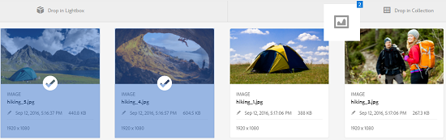
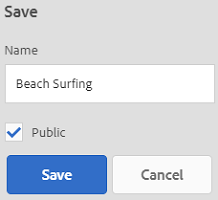
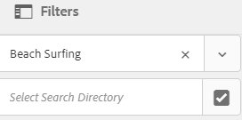

# Manage collections {#managing-collections}

Una raccolta è un set di risorse all&#39;interno di Risorse Adobe Experience Manager (AEM). Utilizzate le raccolte per condividere le risorse tra gli utenti.

* Una raccolta può includere risorse da posizioni diverse.
* Potete condividere le raccolte con vari utenti a cui sono stati assegnati diversi livelli di privilegi, inclusi la visualizzazione, la modifica e così via.

Potete condividere più raccolte con un utente. Ogni raccolta contiene riferimenti alle risorse. L&#39;integrità referenziale delle risorse viene mantenuta tra le raccolte.

Le raccolte sono dei tipi seguenti, in base al modo in cui vengono raccolte le risorse:

* Una raccolta che contiene un elenco di riferimento statico di risorse, cartelle e altre raccolte

* Una raccolta avanzata che include dinamicamente risorse basate su criteri di ricerca

## Navigare nella console delle raccolte {#navigating-the-collections-console}

Per aprire la console **[!UICONTROL Raccolte]** :

1. Toccate o fate clic sul logo AEM.
1. Dalla pagina di navigazione, passate a **[!UICONTROL Risorse]** > **[!UICONTROL Raccolte]**. Viene visualizzata la console **[!UICONTROL Raccolte]** .

## Creare una raccolta {#creating-a-collection}

Potete creare una raccolta con riferimenti  statici o basati su un filtro [basato su criteri di](#creating-a-smart-collection)ricerca. Potete anche creare una raccolta da una scatola luminosa.

### Creare una raccolta con riferimenti statici {#creating-a-collection-with-static-references}

Potete creare una raccolta con riferimenti statici, ad esempio una raccolta con riferimenti a risorse, cartelle, raccolte, set 360 gradi e set di immagini.

1. Passate alla console **[!UICONTROL Raccolte]** .
1. Dalla barra degli strumenti, toccate o fate clic su **[!UICONTROL Crea]**.
1. Nella pagina **[!UICONTROL Crea raccolta]** , immettete un titolo e una descrizione facoltativa per la raccolta.
1. Aggiungete i membri alla raccolta e assegnate le autorizzazioni appropriate. In alternativa, selezionate Raccolta **** pubblica per consentire a tutti gli utenti di accedere alla raccolta.

   >[!NOTE]
   >
   >Per consentire ai membri di condividere le raccolte con altri utenti, fornite al `dam-users` gruppo le autorizzazioni di lettura nel percorso `home/users`. Consentite agli utenti di `/content/dam/collections` utilizzare la propria posizione per consentire loro di visualizzare le raccolte negli elenchi a comparsa. In alternativa, rendete l’utente parte del `dam-users` gruppo.

1. (Facoltativo) Aggiungete una miniatura per la raccolta.
1. Toccate o fate clic su **[!UICONTROL Crea]**, quindi toccate o fate clic su **[!UICONTROL OK]** per chiudere la finestra di dialogo. Una raccolta con il titolo e le proprietà specificati viene aperta nella console Raccolte.

   >[!NOTE]
   >
   >Risorse AEM consente di creare attività di revisione per una raccolta, in modo simile a come si creano le attività di revisione per una cartella di risorse.

   Per aggiungere risorse alla raccolta, passate all&#39;interfaccia utente Risorse. Per informazioni dettagliate, consultate [Aggiunta di risorse a una raccolta](/help/assets/managing-collections-touch-ui.md#adding-assets-to-a-collection).

### Creazione di raccolte tramite dropzone {#create-collections-using-dropzone}

Potete trascinare le risorse dall&#39;interfaccia utente delle risorse a una raccolta. Potete anche creare una copia di una raccolta e trascinarvi le risorse.

1. Nell&#39;interfaccia utente Risorse, selezionate le risorse da aggiungere a una raccolta.
1. Trascinate le risorse nell&#39;area **[!UICONTROL Rilascia nella raccolta]** .

   

   Rilasciare il pulsante del mouse quando il Dropzone diventa attivo e la relativa etichetta diventa **[!UICONTROL Rilascia per aggiungere]**.

   

   In alternativa, toccate o fate clic sull&#39;icona **[!UICONTROL Alla raccolta]** dalla barra degli strumenti.

   

1. Nella pagina **[!UICONTROL Aggiungi alla raccolta]** , toccate o fate clic sull&#39;icona **[!UICONTROL Crea raccolta]** dalla barra degli strumenti.

   Se desiderate aggiungere le risorse a una raccolta esistente, selezionatela dalla pagina, quindi toccate o fate clic su **[!UICONTROL Aggiungi]**. Per impostazione predefinita, è selezionata la raccolta aggiornata più di recente.

1. Nella finestra di dialogo **[!UICONTROL Crea nuova raccolta]** , specificate un nome per la raccolta. Se desiderate che la raccolta sia accessibile a tutti gli utenti, selezionate Raccolta **** pubblica.
1. Toccate/fate clic su **[!UICONTROL Continua]** per creare la raccolta.

### Creare una raccolta dinamica {#creating-a-smart-collection}

Una raccolta avanzata utilizza un criterio di ricerca per compilare in modo dinamico le risorse. Potete creare una raccolta avanzata utilizzando solo i file e non le cartelle o i file e le cartelle.

1. Passa all’interfaccia utente delle risorse e tocca o fai clic sull’icona **[!UICONTROL Ricerca]** .
1. Digitate la parola chiave search nella casella corrispondente e premete Invio. Toccate/fate clic sull’icona Navigazione globale per visualizzare il pannello Filtri e applicare un filtro di ricerca dal pannello Ricerca.
1. Dall’elenco **[!UICONTROL File e cartelle]** , selezionare **[!UICONTROL File]**.

   

1. Toccate o fate clic su **[!UICONTROL Salva raccolta]** avanzata.
1. Specificate un nome per la raccolta. Selezionate **[!UICONTROL Pubblico]** per aggiungere il gruppo Utenti DAM con il ruolo Visualizzatore alla raccolta avanzata.

   

   >[!NOTE]
   >
   >Se selezionate **[!UICONTROL Pubblico]**, la raccolta smart diventa disponibile per tutti gli utenti con il ruolo Proprietario dopo averlo creato.
   >
   >
   >Se deselezionate l&#39;opzione **[!UICONTROL Pubblica]** , il gruppo di utenti DAM non è più associato alla raccolta avanzata.

1. Toccate/fate clic su **[!UICONTROL Salva]** per creare la raccolta dinamica, quindi chiudete la finestra di messaggio per completare il processo.

   La nuova raccolta avanzata viene aggiunta anche all&#39;elenco Ricerche **[!UICONTROL salvate]** .

   

   L’etichetta del pulsante **[!UICONTROL Crea selezione]** avanzata diventa **[!UICONTROL Modifica selezione]** avanzata. Per modificare le impostazioni della raccolta dinamica, selezionate **[!UICONTROL File]** dall&#39;elenco **[!UICONTROL File e cartelle]** . Quindi toccate o fate clic sul pulsante **[!UICONTROL Modifica selezione]** avanzata.

   

## Aggiunta di risorse a una raccolta {#adding-assets-to-a-collection}

Potete aggiungere risorse a una raccolta contenente un elenco di risorse o cartelle a cui viene fatto riferimento.

>[!NOTE]
>
>Le raccolte dinamiche utilizzano una query di ricerca per compilare le risorse. Pertanto, non è possibile applicare riferimenti statici a risorse e cartelle.

1. Nell&#39;interfaccia utente Risorse, andate alla posizione della risorsa che desiderate aggiungere a una raccolta.
1. Selezionate la risorsa e toccate o fate clic sull&#39;icona **[!UICONTROL Alla raccolta]** dalla barra degli strumenti.

   

   In alternativa, potete trascinare la risorsa nell’area **[!UICONTROL Rilascia nella raccolta]** . Rilasciare il pulsante del mouse quando la zona di rilascio diventa attiva e l&#39;etichetta diventa **[!UICONTROL Rilascia per aggiungere]**.

1. Nella pagina **[!UICONTROL Aggiungi alla raccolta]** , selezionate la raccolta alla quale desiderate aggiungere la risorsa.
1. Toccate/fate clic su **[!UICONTROL Aggiungi]**, quindi chiudete il messaggio di conferma. La risorsa viene aggiunta alla raccolta.

## Modificare una raccolta smart {#editing-a-smart-collection}

Le raccolte intelligenti vengono create salvando una ricerca in modo da modificarne il contenuto modificando i parametri di ricerca della ricerca salvata.

1. Nell’interfaccia utente Risorse, tocca o fai clic sull’icona **[!UICONTROL Ricerca]** nella barra degli strumenti.

   

1. Con il cursore nella casella Omnisearch, premere il tasto Invio.
1. Toccate o fate clic sull&#39;icona GlobalNav per visualizzare il pannello Filtri.
1. Dall&#39;elenco Ricerche **** salvate, selezionate la raccolta dinamica da modificare. Nel pannello Ricerca sono visualizzati i filtri configurati per la ricerca salvata.

   

1. Dall’elenco **[!UICONTROL File e cartelle]** , selezionare **[!UICONTROL File]**.
1. Modificate uno o più filtri, a seconda delle necessità. Toccate o fate clic su **[!UICONTROL Modifica raccolta]** avanzata.

   Potete anche modificare il nome della raccolta dinamica.

   

1. Tap/click **[!UICONTROL Save]**. Viene visualizzata la finestra di dialogo **[!UICONTROL Modifica raccolta]** avanzata.
1. Toccate/fate clic su **[!UICONTROL Sovrascrivi]** per sostituire la raccolta avanzata originale con la raccolta modificata. In alternativa, selezionate **[!UICONTROL Salva con nome]** per salvare separatamente la raccolta modificata.
1. Nella finestra di dialogo di conferma, toccate o fate clic su **[!UICONTROL Salva]** per completare il processo.

## Visualizzare e modificare i metadati della raccolta {#viewing-and-editing-collection-metadata}

I metadati della raccolta includono i dati sulla raccolta, compresi eventuali tag aggiunti.

1. Dalla console Raccolte, selezionate una raccolta e toccate o fate clic sull&#39;icona **[!UICONTROL Proprietà]** nella barra degli strumenti.
1. Nella pagina Metadati **** raccolta, visualizzate i metadati della raccolta dalle schede **[!UICONTROL Base]** e **Avanzate** .
1. Modificate i metadati, se necessario, quindi toccate o fate clic su **[!UICONTROL Salva e chiudi]** nella barra degli strumenti per salvare le modifiche.

### Modificare i metadati della raccolta in blocco {#editing-collection-metadata-in-bulk}

Potete modificare i metadati di più raccolte contemporaneamente. Questa funzionalità consente di replicare rapidamente i metadati comuni in più raccolte.

1. Nella console Raccolte, selezionate due o più raccolte per le quali desiderate modificare i metadati.
1. Dalla barra degli strumenti, toccate o fate clic sull’icona **[!UICONTROL Proprietà]** .
1. Nella pagina Metadati **** raccolta, modificate i metadati nelle schede **[!UICONTROL Base]** e **[!UICONTROL Avanzate]** , a seconda delle necessità.
1. Toccate/fate clic su **[!UICONTROL Salva e chiudi]** nella barra degli strumenti, quindi chiudete la finestra di dialogo di conferma per completare il processo.
1. Per aggiungere i nuovi metadati ai metadati esistenti, selezionate **[!UICONTROL Aggiungi modalità]**. Se non selezionate questa opzione, i nuovi metadati sostituiranno quelli esistenti nei campi. Toccate o fate clic su **[!UICONTROL Invia]**.

   >[!NOTE]
   >
   >La modalità Aggiungi funziona solo per i campi che possono contenere più valori. Per i campi che possono contenere un solo valore, i nuovi metadati non vengono aggiunti al valore esistente nel campo anche se selezionate la modalità **** Aggiungi.

## Cerca raccolte {#searching-collections}

Potete cercare le raccolte dalla console Raccolte. Quando eseguite una ricerca con le parole chiave nella casella di ricerca Omniture, Risorse AEM cerca i nomi delle raccolte, i metadati e i tag aggiunti alle raccolte.

Se cercate raccolte dal livello principale, nei risultati della ricerca vengono restituite solo singole raccolte. Le risorse o le cartelle all&#39;interno delle raccolte sono escluse. In tutti gli altri casi (ad esempio, all&#39;interno di una singola raccolta o in una gerarchia di cartelle), vengono restituite tutte le risorse, le cartelle e le raccolte pertinenti.

## Cerca nelle raccolte {#searching-within-collections}

Nella console Raccolte, toccate o fate clic su una raccolta per aprirla.

All&#39;interno di una raccolta, la ricerca di Risorse AEM è limitata alle risorse (e ai relativi tag e metadati) all&#39;interno della raccolta che state visualizzando. Quando eseguite una ricerca all’interno di una cartella, vengono restituite tutte le risorse e le cartelle figlie corrispondenti all’interno della cartella corrente. Quando eseguite una ricerca all&#39;interno di una raccolta, vengono restituite solo le risorse, le cartelle e altre raccolte corrispondenti a membri diretti della raccolta.

## Modifica delle impostazioni della raccolta {#editing-collection-settings}

Potete modificare le impostazioni della raccolta, ad esempio titolo e descrizione, o aggiungere membri a una raccolta.

1. Selezionate una raccolta, quindi toccate o fate clic sull&#39;icona **[!UICONTROL Impostazioni]** nella barra degli strumenti. In alternativa, utilizzate l&#39;azione rapida **[!UICONTROL Impostazioni]** dalla miniatura della raccolta.
1. Modificate le impostazioni della raccolta nella pagina Impostazioni **** raccolta. Ad esempio, modificate il titolo della raccolta, le descrizioni, i membri e le autorizzazioni come descritto in [Aggiunta di raccolte](#creating-a-collection).

1. Tap/click **[!UICONTROL Save]** to save the changes.

## Eliminare una raccolta {#deleting-a-collection}

1. Dalla console Raccolte, selezionate una o più raccolte e toccate o fate clic sull&#39;icona Elimina nella barra degli strumenti.

   

1. Nella finestra di dialogo, toccate o fate clic su **[!UICONTROL Elimina]** per confermare l’eliminazione.

   >[!NOTE]
   >
   >Potete inoltre identificare le raccolte avanzate [eliminando le ricerche](#deleting-saved-searches)salvate.

## Scaricare una raccolta {#downloading-a-collection}

Quando scaricate una raccolta, viene scaricata l&#39;intera gerarchia di risorse all&#39;interno della raccolta, comprese le cartelle e le raccolte figlie.

1. Dalla console Raccolte, selezionate una o più raccolte da scaricare.
1. Dalla barra degli strumenti, toccate o fate clic sull&#39;icona di download.
1. Nella finestra di dialogo **[!UICONTROL Scarica]** , toccate o fate clic su **[!UICONTROL Scarica]**. Se desiderate scaricare i rendering delle risorse all&#39;interno della raccolta, selezionate **[!UICONTROL Rendering]**. Selezionate l&#39;opzione **[!UICONTROL E-mail]** per inviare una notifica e-mail al proprietario della raccolta.

   Quando selezionate una raccolta da scaricare, viene scaricata l&#39;intera gerarchia di cartelle sotto la raccolta. Per includere ciascuna raccolta scaricata (comprese le risorse nelle raccolte figlie nidificate sotto la raccolta principale) in una singola cartella, selezionate **[!UICONTROL Crea cartella separata per ciascuna risorsa]**.

## Creare raccolte nidificate {#creating-nested-collections}

Potete aggiungere una raccolta a un&#39;altra raccolta, creando in tal modo una raccolta nidificata.

1. Dalla console Raccolte, selezionate la raccolta o il gruppo di raccolte desiderato, quindi toccate o fate clic sull&#39;icona **[!UICONTROL A raccolta]** nella barra degli strumenti.

   

1. Dalla pagina **[!UICONTROL Aggiungi alla raccolta]** , selezionate la raccolta in cui aggiungere la raccolta.

   >[!NOTE]
   >
   >La raccolta aggiornata più di recente è selezionata per impostazione predefinita nella pagina **[!UICONTROL Aggiungi alla raccolta]** .

1. Toccate o fate clic su **[!UICONTROL Aggiungi]**. Un messaggio conferma che la raccolta viene aggiunta alla raccolta di destinazione nella pagina **[!UICONTROL Seleziona destinazione]** . Chiudi il messaggio per completare il processo.

>[!NOTE]
>
>Le raccolte avanzate non possono essere nidificate. In altre parole, le raccolte avanzate non possono contenere altre raccolte.

## Saved searches {#saved-searches}

Nell’interfaccia utente delle risorse, puoi cercare o filtrare le risorse in base a determinate regole, criteri di ricerca o facet di ricerca personalizzati. Se salvate queste ricerche come Ricerche **** salvate, potete accedervi in un secondo momento dall’elenco Ricerche **** salvate nel pannello Filtro. La creazione di una ricerca salvata crea anche una raccolta dinamica.

### Creare ricerche salvate {#creating-saved-searches}

Le ricerche salvate vengono create quando create una raccolta avanzata. Le raccolte avanzate vengono aggiunte automaticamente all&#39;elenco Ricerche **** salvate. La query delle ricerche salvate per la raccolta viene salvata nella `dam:query` proprietà in corrispondenza della posizione relativa `/content/dam/collections/`.

>[!NOTE]
>
>Potete condividere le raccolte smart nello stesso modo in cui condividete le raccolte statiche.

### Modificare le ricerche salvate {#editing-saved-searches}

La modifica delle ricerche salvate equivale alla modifica delle raccolte avanzate. Per informazioni dettagliate, consultate [Modifica di una raccolta](/help/assets/managing-collections-touch-ui.md#editing-a-smart-collection)dinamica.

### Eliminare le ricerche salvate {#deleting-saved-searches}

1. Passa all’interfaccia utente delle risorse e tocca o fai clic sull’icona Ricerca nella barra degli strumenti.

   

1. Con il cursore nella casella Ricerca Omni, premere il tasto Invio.
1. Tocca o fai clic sull’icona GlobalNav per visualizzare il pannello Filtri.

1. Nell&#39;elenco Ricerche **** salvate, toccate **[!UICONTROL Elimina]** accanto alla raccolta avanzata da eliminare.

   

1. Nella finestra di dialogo, toccate **[!UICONTROL Elimina]** per eliminare la ricerca salvata.

## Esecuzione di un flusso di lavoro su una raccolta {#running-a-workflow-on-a-collection}

Potete eseguire un flusso di lavoro per le risorse all&#39;interno di una raccolta. Se la raccolta contiene raccolte nidificate, il flusso di lavoro viene eseguito anche sulle risorse all&#39;interno delle raccolte nidificate. Tuttavia, se la raccolta e la raccolta nidificata contengono risorse duplicate, il flusso di lavoro viene eseguito una sola volta per tali risorse.

1. Dalla console Raccolte, selezionate una raccolta in cui desiderate eseguire un flusso di lavoro.
1. Toccate o fate clic sull&#39;icona GlobalNav, quindi scegliete **[!UICONTROL Timeline]** dall&#39;elenco.
1. Dalla timeline, tocca o fai clic sull’icona Carrello in basso, quindi tocca **[!UICONTROL Avvia flusso di lavoro]**.

   

1. Nella sezione **[!UICONTROL Avvia flusso di lavoro]** , selezionare un modello di workflow dall&#39;elenco. Ad esempio, selezionate il modello **[!UICONTROL DAM Update Asset (Aggiorna risorsa]** DAM).
1. Immettete un titolo per il flusso di lavoro e toccate o fate clic su **[!UICONTROL Avvia]**.
1. Nella finestra di dialogo, toccate/fate clic su **[!UICONTROL Procedi]**. Il flusso di lavoro viene eseguito su tutte le risorse della raccolta.

>[!MORELIKETHIS]
>
>* [Configurare le notifiche e-mail di AEM Assets](/help/sites-administering/notification.md#assetsconfig)
>* [Modificare le proprietà dei metadati di più raccolte](/help/assets/managing-multiple-assets.md)
>* [Creazione di un&#39;attività di revisione per le raccolte](/help/assets/bulk-approval.md)

