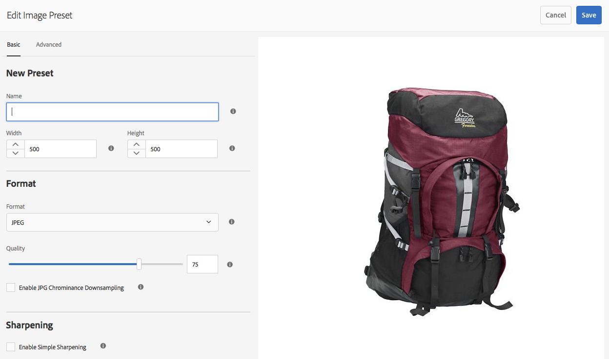

# Gestione dei predefiniti per le immagini Dynamic Medie{#managing-image-presets}

I predefiniti per immagini consentono ad Adobe Experience Manager Assets di distribuire dinamicamente immagini di diverse dimensioni, in diversi formati o con altre proprietà dell’immagine generate dinamicamente. Ogni predefinito immagine rappresenta una raccolta predefinita di comandi di ridimensionamento e formattazione per la visualizzazione delle immagini. Quando crei un predefinito immagine, scegli una dimensione per la consegna delle immagini. È inoltre possibile scegliere i comandi di formattazione in modo che l&#39;aspetto dell&#39;immagine venga ottimizzato quando l&#39;immagine viene distribuita per la visualizzazione.

Gli amministratori possono creare predefiniti per esportare le risorse. Gli utenti possono scegliere un predefinito al momento dell&#39;esportazione delle immagini, che consente anche di riformattarle in base alle specifiche specificate dall&#39;amministratore.

Puoi anche creare predefiniti per immagini reattivi. Se applichi un predefinito immagine reattivo alle risorse, queste cambiano a seconda del dispositivo o delle dimensioni dello schermo su cui vengono visualizzate. Potete configurare i predefiniti immagine in modo che utilizzino CMYK nello spazio colore oltre a RGB o Grigio.

Questa sezione descrive come creare, modificare e in genere gestire predefiniti per immagini. Potete applicare un predefinito immagine a un&#39;immagine in qualsiasi momento. Vedere [Applicazione dei predefiniti immagine](/help/assets/image-presets.md).

>[!NOTE]
>
>L&#39;imaging avanzato funziona con i predefiniti immagine esistenti e utilizza l&#39;intelligenza all&#39;ultimo millisecondo di consegna per ridurre ulteriormente le dimensioni del file immagine in base alla velocità di connessione del browser o della rete. Per ulteriori informazioni, vedere [Smart Imaging](/help/assets/imaging-faq.md).

## Informazioni sui predefiniti per immagini Dynamic Medie {#understanding-image-presets}

Analogamente a una macro, un predefinito immagine è un insieme predefinito di comandi di ridimensionamento e formattazione salvati con un nome. Per capire come funzionano i predefiniti per immagini, supponiamo che il sito web richieda che ogni immagine del prodotto sia visualizzata in dimensioni e formati diversi e con tassi di compressione diversi per la distribuzione desktop e mobile.

>[!NOTE]
>
>In modalità Dynamic Medie - Scene7, i predefiniti per immagini sono supportati solo per le risorse immagini.

Potete creare due immagini preimpostate: una con 500 x 500 pixel per la versione desktop e 150 x 150 pixel per la versione mobile. Si creano due predefiniti immagine, uno denominato `Enlarge` per visualizzare immagini a 500x500 pixel e uno denominato `Thumbnail` per visualizzare immagini a 150 x 150 pixel. Per distribuire immagini con le dimensioni `Enlarge` e `Thumbnail`, Experience Manager cerca la definizione del predefinito per ingrandire l&#39;immagine e del predefinito per miniature. Experience Manager genera quindi un’immagine in modo dinamico in base alle dimensioni e alle specifiche di formattazione di ciascun predefinito immagine.

Le immagini di dimensioni ridotte, quando vengono distribuite in modo dinamico, possono perdere nitidezza e dettagli. Per questo motivo, ogni predefinito immagine contiene controlli di formattazione per ottimizzare un’immagine quando viene distribuita con una dimensione specifica. Questi controlli garantiscono che le immagini siano nitide e chiare quando vengono inviate al sito Web o all&#39;applicazione.

Gli amministratori possono creare predefiniti per immagini. Per creare un predefinito immagine, puoi iniziare da zero oppure da uno esistente e salvarlo con un nuovo nome.

## Gestione dei predefiniti per le immagini Dynamic Medie {#managing-image-presets-1}

Per gestire i predefiniti immagine in Experience Manager, tocca o fai clic sul logo di Experience Manager per accedere alla console di navigazione globale, quindi tocca o fai clic sull&#39;icona Strumenti e vai a **[!UICONTROL Assets > Predefiniti immagine]**.


>[!NOTE]
>
>Tutti i predefiniti immagine creati sono disponibili anche come rappresentazioni dinamiche quando visualizzi l’anteprima o distribuisci le risorse.
>
>In *Dynamic Medie - modalità Scene7*, *non* è necessario pubblicare i predefiniti immagine poiché i predefiniti immagine vengono pubblicati automaticamente.
>
>In *Dynamic Medie - modalità ibrida*, è necessario pubblicare manualmente i predefiniti immagine.
>
>Consulta [Pubblicazione dei predefiniti immagine](#publishing-image-presets).

>[!NOTE]
>
>Il sistema mostra varie rappresentazioni quando si selezionano **[!UICONTROL Rappresentazioni]** nella visualizzazione Dettagli di una risorsa. Potete aumentare o diminuire il numero di predefiniti immagine da visualizzare. Vedere [Aumento del numero di predefiniti immagine visualizzati](#increasing-or-decreasing-the-number-of-image-presets-that-display).

### Ritagli avanzati, Adobe Illustrator (AI), Postscript (EPS) e formati di file PDF {#adobe-illustrator-ai-postscript-eps-and-pdf-file-formats}

>[!NOTE]
>
>Questo argomento è applicabile solo a Dynamic Medie in modalità ibrida.

Se desideri supportare l’acquisizione di file AI, EPS e PDF in modo da poter generare rappresentazioni dinamiche di questi formati di file, controlla le informazioni seguenti prima di creare predefiniti per immagini.

Il formato di file di Adobe Illustrator è una variante di PDF. Le principali differenze nel contesto di Experience Manager Assets sono le seguenti:

* I documenti Adobe Illustrator sono costituiti da una singola pagina con più livelli. Ogni livello viene estratto come risorsa secondaria PNG sotto la risorsa Illustrator principale.
* I documenti PDF sono costituiti da una o più pagine. Ogni pagina viene estratta come risorsa PDF di una singola pagina sotto il documento PDF principale con più pagine.

Le risorse secondarie vengono create dal componente `Create Sub Asset process` all&#39;interno del flusso di lavoro complessivo di `DAM Update Asset`. Per visualizzare questo componente di processo nel flusso di lavoro, seleziona **[!UICONTROL Strumenti]** > **[!UICONTROL Flusso di lavoro]** > **[!UICONTROL Modelli]** > **[!UICONTROL Risorsa di aggiornamento DAM]** > **[!UICONTROL Modifica]**.

Vedi anche [Visualizzazione di pagine di un file con più pagine](/help/assets/managing-linked-subassets.md#view-pages-of-a-multi-page-file).

Puoi visualizzare le risorse secondarie o le pagine quando apri la risorsa, seleziona il menu Contenuto e seleziona **[!UICONTROL Risorse secondarie]** o **[!UICONTROL Pagine]**. Le risorse secondarie sono risorse reali. In altre parole, le pagine PDF vengono estratte dal componente del flusso di lavoro `Create Sub Asset`. Vengono quindi archiviati come `page1.pdf`, `page2.pdf` e così via, sotto la risorsa principale. Una volta archiviati, il flusso di lavoro `DAM Update Asset` li elabora.

Per utilizzare Dynamic Medie per visualizzare in anteprima e generare rappresentazioni dinamiche di file AI, EPS o PDF, sono necessari i seguenti passaggi di elaborazione:

1. Nel flusso di lavoro `DAM Update Asset`, il componente di processo `Rasterize PDF/AI Image Preview Rendition` rasterizza la prima pagina della risorsa originale, utilizzando la risoluzione configurata, in una rappresentazione `cqdam.preview.png`.

1. Il rendering `cqdam.preview.png` viene quindi ottimizzato in un file PTIFF dal componente di processo `Dynamic Media Process Image Assets` all&#39;interno del flusso di lavoro.

>[!NOTE]
>
>Nel flusso di lavoro [!UICONTROL Risorsa di aggiornamento DAM], il passaggio **[!UICONTROL Miniature EPS]** genera le miniature per i file EPS.

#### Proprietà metadati risorse PDF/AI/EPS {#pdf-ai-eps-asset-metadata-properties}

| **Proprietà metadati** | **Descrizione** |
|---|---|
| `dam:Physicalwidthininches` | Larghezza del documento in pollici. |
| `dam:Physicalheightininches` | Altezza documento in pollici. |

È possibile accedere alle opzioni del componente di processo `Rasterize PDF/AI Image Preview Rendition` tramite il flusso di lavoro `DAM Update Asset`.

Nell&#39;angolo in alto a sinistra, seleziona Adobe Experience Manager, passa a **[!UICONTROL Strumenti]** > **[!UICONTROL Flusso di lavoro]** > **[!UICONTROL Modelli]**. Nella pagina Modelli flusso di lavoro, seleziona **[!UICONTROL Risorsa di aggiornamento DAM]**, quindi nella barra degli strumenti seleziona **[!UICONTROL Modifica]**. Nella pagina del flusso di lavoro [!UICONTROL Risorsa di aggiornamento DAM], selezionare due volte il componente di processo `Rasterize PDF/AI Image Preview Rendition` per aprire la finestra di dialogo Proprietà passaggio.

#### Rasterizza opzioni di rendering anteprima immagine PDF/AI {#rasterize-pdf-ai-image-preview-rendition-options}


Argomenti per rasterizzare il flusso di lavoro di PDF o AI

<table>
 <tbody>
  <tr>
   <td><strong>Argomento processo</strong></td>
   <td><strong>Impostazione predefinita</strong></td>
   <td><strong>Descrizione</strong></td>
  </tr>
  <tr>
   <td>Tipi mime</td>
   <td><p>application/pdf</p> <p>application/postscript</p> <p>applicazione/illustratore<br /> </p> </td>
   <td>Elenco di tipi MIME di documenti considerati documenti PDF o Illustrator.<br /> </td>
  </tr>
  <tr>
   <td>Larghezza max</td>
   <td>2048</td>
   <td>Larghezza massima in pixel del rendering di anteprima generato.<br /> </td>
  </tr>
  <tr>
   <td>Altezza max</td>
   <td>2048</td>
   <td>Altezza massima della rappresentazione di anteprima generata, in pixel.<br /> </td>
  </tr>
  <tr>
   <td>Risoluzione</td>
   <td>72</td>
   <td>Risoluzione per la rasterizzazione della prima pagina, in pixel per pollice.</td>
  </tr>
 </tbody>
</table>

Utilizzando gli argomenti predefiniti, la prima pagina di un documento PDF/AI viene rasterizzata a 72 ppi e l&#39;immagine di anteprima generata viene ridimensionata a 2048 x 2048 pixel. Per una distribuzione tipica, è possibile aumentare la risoluzione a un minimo di 150 ppi o più. Ad esempio, un documento con dimensioni lettera USA di 300 ppi richiede rispettivamente una larghezza e un&#39;altezza massime di 2550 x 3300 pixel.

Le opzioni Larghezza massima (Max Width) e Altezza massima (Max Height) limitano la risoluzione alla quale eseguire la rasterizzazione. Ad esempio, se i valori massimi sono invariati e l&#39;opzione Risoluzione è impostata su 300 ppi, un documento Lettera USA viene rasterizzato a 186 ppi. In altre parole, il documento è di 1581 x 2046 pixel.

Per il componente di processo `Rasterize PDF/AI Image Preview Rendition` è stato definito un valore massimo per garantire che non vengano create immagini troppo grandi in memoria. Immagini di tali dimensioni possono sovraccaricare la memoria fornita alla JVM (Java™ Virtual Machine). È necessario prestare attenzione a fornire alla JVM memoria sufficiente per gestire il numero configurato di flussi di lavoro paralleli, ognuno dei quali può creare un’immagine alla dimensione massima configurata.

### Formato file InDesign (INDD) {#indesign-indd-file-format}

Se intendete supportare l&#39;acquisizione di file INDD in modo da poter generare una rappresentazione dinamica di questo formato di file, prima di creare predefiniti immagine potete rivedere le seguenti informazioni.

Per i file InDesign, le risorse secondarie vengono estratte solo se Adobe InDesign Server è integrato con Experience Manager. Le risorse a cui si fa riferimento sono collegate in base ai relativi metadati. L’InDesign Server non è richiesto per il collegamento. Tuttavia, le risorse a cui si fa riferimento devono essere presenti in Experience Manager prima che i file InDesign vengano elaborati per i collegamenti da creare tra i file InDesign e le risorse a cui si fa riferimento.

Vedi [Integrazione di Experience Manager Assets con InDesign Server](/help/assets/indesign.md).

Il componente del processo Estrazione file multimediali nel flusso di lavoro `DAM Update Asset` esegue diversi script di estensione preconfigurati per elaborare i file InDesign.


Percorsi ExtendScript negli argomenti del componente del processo Estrazione file multimediali nel flusso di lavoro [!UICONTROL Risorsa di aggiornamento DAM].

Gli script seguenti vengono utilizzati dall’integrazione di Dynamic Medie:

<table>
 <tbody>
  <tr>
   <td><strong>Nome ExtendScript</strong></td>
   <td><strong>Predefiniti</strong></td>
   <td><strong>Descrizione</strong></td>
  </tr>
  <tr>
   <td>ThumbnailExport.jsx</td>
   <td>Sì</td>
   <td>Genera un rendering <code>thumbnail.jpg</code> da 300 ppi ottimizzato e trasformato in un rendering PTIFF da <code>Dynamic Media Process Image Assets</code> componente di processo.<br /> </td>
  </tr>
  <tr>
   <td>JPEGPagesExport.jsx</td>
   <td>Sì</td>
   <td>Genera una risorsa secondaria JPEG di 300 PPI per ogni pagina. La risorsa secondaria JPEG è una risorsa reale memorizzata nella risorsa InDesign. Viene inoltre ottimizzato e trasformato in un file PTIFF dal flusso di lavoro <code>DAM Update Asset</code>.<br /> </td>
  </tr>
  <tr>
   <td>PDFPagesExport.jsx</td>
   <td>No</td>
   <td>Genera una risorsa secondaria PDF per ogni pagina. La risorsa secondaria PDF viene elaborata come descritto in precedenza. Poiché il PDF contiene una sola pagina, non vengono generate risorse secondarie.<br /> </td>
  </tr>
 </tbody>
</table>

## Configurazione delle dimensioni delle miniature {#configuring-image-thumbnail-size}

Puoi configurare le dimensioni delle miniature configurandole nel flusso di lavoro **[!UICONTROL Risorsa di aggiornamento DAM]**. Il flusso di lavoro prevede due passaggi per configurare le dimensioni delle miniature delle risorse immagine. Anche se (**[!UICONTROL Assets]** per l&#39;immagine di processo di Dynamic Medie è utilizzato per le risorse di immagini dinamiche e (**[!UICONTROL Miniature di processo]**) è per la generazione di miniature statiche o quando tutti gli altri processi non generano miniature, *entrambi* devono avere le stesse impostazioni.

Con il passaggio **[!UICONTROL Risorse di immagine di processo di elementi multimediali dinamici]**, le miniature vengono generate da Image Server e questa configurazione è indipendente da quella applicata al passaggio **[!UICONTROL Elabora miniature]**. La generazione delle miniature tramite il passaggio **[!UICONTROL Elabora miniature]** rappresenta il modo più lento e laborioso di creare le miniature, in termini di utilizzo della memoria.

Il dimensionamento delle miniature è definito nel seguente formato: **`width:height:center`**, ad esempio `80:80:false`. La larghezza e l’altezza determinano le dimensioni in pixel della miniatura. Il valore centrale è falso o true e se impostato su true, indica che l&#39;immagine miniatura ha esattamente le dimensioni specificate nella configurazione. Se l&#39;immagine ridimensionata è più piccola, viene centrata all&#39;interno della miniatura.

>[!NOTE]
>
>* Le dimensioni delle miniature per i file EPS sono configurate nel passaggio **[!UICONTROL Miniature EPS]**, nella scheda **[!UICONTROL Argomenti]** in Miniature.
>
>* Le dimensioni delle miniature per i video sono configurate nel passaggio **[!UICONTROL Miniature FFmpeg]**, nella scheda **[!UICONTROL Elabora]** in **[!UICONTROL Argomenti]**.
>

**Per configurare le dimensioni delle miniature:**

1. Seleziona **[!UICONTROL Strumenti]** > **[!UICONTROL Flusso di lavoro]** > **[!UICONTROL Modelli]** > **[!UICONTROL Risorsa di aggiornamento DAM]** > **[!UICONTROL Modifica]**.
1. Seleziona il passaggio **[!UICONTROL Assets]** dell&#39;immagine di processo di Dynamic Medie e fai clic sulla scheda **[!UICONTROL Miniature]**. Modificare le dimensioni delle miniature in base alle esigenze, quindi selezionare **[!UICONTROL OK]**.

   

1. Seleziona il passaggio **[!UICONTROL Elabora miniature]**, quindi seleziona la scheda **[!UICONTROL Miniature]**. Modificare le dimensioni delle miniature in base alle esigenze, quindi selezionare **[!UICONTROL OK]**.

   >[!NOTE]
   >
   >I valori nell’argomento miniature del passaggio **[!UICONTROL Elabora miniature]** devono corrispondere all’argomento miniature nel passaggio **[!UICONTROL Risorse di immagine di processo di elementi multimediali dinamici]**.

1. Seleziona **[!UICONTROL Salva]** per salvare le modifiche al flusso di lavoro.

### Aumento o riduzione del numero di predefiniti immagine Dynamic Medie da visualizzare {#increasing-or-decreasing-the-number-of-image-presets-that-display}

I predefiniti immagine creati sono disponibili come rappresentazioni dinamiche quando visualizzi l’anteprima delle risorse. L&#39;Experience Manager mostra varie rappresentazioni dinamiche quando si visualizza una risorsa da **[!UICONTROL Vista dettagli > Rappresentazioni]**. Puoi aumentare o diminuire il limite delle rappresentazioni visualizzate.

**Aumenta o diminuisce il numero di predefiniti immagine Dynamic Medie visualizzati:**

1. Passa a CRXDE Lite ([https://localhost:4502/crx/de](https://localhost:4502/crx/de)).
1. Passa al nodo elenco predefiniti immagine in `/libs/dam/gui/coral/content/commons/sidepanels/imagepresetsdetail/imgagepresetslist`

   

1. Nella proprietà **[!UICONTROL limit]**, modifica **[!UICONTROL Valore]**, che corrisponde a 15 per impostazione predefinita, inserendo un numero a piacere.
1. Passa all&#39;origine dati del predefinito immagine in `/libs/dam/gui/coral/content/commons/sidepanels/imagepresetsdetail/imgagepresetslist/datasource`

   

1. Nella proprietà limit, modifica il numero impostando il numero desiderato, ad esempio `{empty requestPathInfo.selectors[1] ? "20" : requestPathInfo.selectors[1]}`
1. Seleziona **[!UICONTROL Salva tutto]**.

## Creazione di un predefinito immagine Dynamic Medie {#creating-image-presets}

La creazione di un predefinito immagine Dynamic Medie consente di applicare tali impostazioni a qualsiasi immagine durante la visualizzazione in anteprima o la pubblicazione.

>[!NOTE]
>
>Se si utilizza Internet Explorer 9, la creazione di un predefinito non viene visualizzata nell&#39;elenco dei predefiniti subito dopo il salvataggio. Per risolvere il problema, disabilita la cache per IE9.

Se desideri supportare l’acquisizione di file AI, PDF e EPS in modo da poter generare una rappresentazione dinamica di questi formati di file, controlla le informazioni seguenti prima di creare predefiniti per immagini.
Consulta [Formati di file Adobe Illustrator (AI), Postscript (EPS) e PDF](#adobe-illustrator-ai-postscript-eps-and-pdf-file-formats).

Se intendete supportare l&#39;acquisizione di file INDD in modo da poter generare una rappresentazione dinamica di questo formato di file, prima di creare predefiniti immagine potete rivedere le seguenti informazioni.
Vedere [formato di file InDesign (INDD)](#indesign-indd-file-format).

>[!NOTE]
>
>Per creare predefiniti immagine Dynamic Medie, è necessario disporre dei privilegi di amministratore come amministratore di Experience Manager o amministratore di Admin Console.

**Per creare un predefinito immagine Dynamic Medie:**

1. In Experience Manager, seleziona il logo di Experience Manager per accedere alla console di navigazione globale, quindi seleziona **[!UICONTROL Strumenti]** > **[!UICONTROL Assets]** > **[!UICONTROL Predefiniti immagine]**.
1. Fai clic su **[!UICONTROL Crea]**. Viene visualizzata la finestra **[!UICONTROL Modifica predefinito immagine]**.

   

   >[!NOTE]
   >
   >Per rendere dinamico questo predefinito immagine, cancella i valori nei campi **[!UICONTROL larghezza]** e **[!UICONTROL altezza]**, lasciandoli vuoti.

1. Immetti i valori desiderati nelle schede **[!UICONTROL Base]** e **[!UICONTROL Avanzate]**, compreso un nome. Le opzioni sono descritte in [Opzioni predefinito immagine](#image-preset-options). I predefiniti vengono visualizzati nel riquadro a sinistra e possono essere usati all’istante con altre risorse.

   

1. Fai clic su **[!UICONTROL Salva]**.

## Creazione di un predefinito immagine reattivo {#creating-a-responsive-image-preset}

Per creare un predefinito immagine reattivo, esegui i passaggi descritti in [Creazione di predefiniti immagine](#creating-image-presets). Quando immetti l&#39;altezza e la larghezza nella finestra **[!UICONTROL Modifica predefinito immagine]**, cancella i valori e lasciali vuoti.

Experience Manager Se non specificate alcun valore, questo predefinito immagine è dinamico. È possibile regolare gli altri valori in modo appropriato.


>[!NOTE]
>
>Per visualizzare i pulsanti **[!UICONTROL URL]** e **[!UICONTROL RESS]** quando applichi un predefinito immagine a una risorsa, essa deve essere pubblicata.
>
>
>
>In modalità Dynamic Medie - Scene7, i predefiniti immagine e le risorse immagine vengono pubblicati automaticamente.
>
>In modalità Dynamic Medie - Ibrido, devi pubblicare manualmente i predefiniti immagine e le risorse immagine.

### Opzioni predefinito immagine {#image-preset-options}

Quando crei o modifichi i predefiniti immagine, disponi delle opzioni descritte in questa sezione. Inoltre, Adobe consiglia di avviare le seguenti opzioni di &quot;best practice&quot;:

* **[!UICONTROL Formato]** (**[!UICONTROL Base]** scheda) - Seleziona **[!UICONTROL JPEG]** o un altro formato che soddisfa i tuoi requisiti. Tutti i browser web supportano il formato immagine JPEG, in quanto offre un buon compromesso tra dimensioni ridotte dei file e qualità delle immagini. Tuttavia, le immagini in formato JPEG usano uno schema di compressione che causa la perdita di dati, con possibile introduzione di artefatti di immagine indesiderati, qualora l’impostazione di compressione sia troppo bassa. Per questo motivo, Adobe consiglia di impostare la qualità di compressione su 75. Questa impostazione offre un buon compromesso tra la qualità delle immagini e le dimensioni ridotte dei file.

* **[!UICONTROL Attiva nitidezza semplice]**: non selezionare **[!UICONTROL Attiva nitidezza semplice]** (il filtro di nitidezza offre un controllo inferiore rispetto alle impostazioni Maschera definizione dettagli).

* **[!UICONTROL Nitidezza: Metodo Ricampionamento]** - Selezionare **[!UICONTROL Nitidezza2]**.

#### Opzioni di base delle schede {#basic-tab-options}

<table>
 <tbody>
  <tr>
   <td><strong>Campo</strong></td>
   <td><strong>Descrizione</strong></td>
  </tr>
  <tr>
   <td><strong>Nome</strong></td>
   <td>Inserisci un nome descrittivo senza spazi vuoti. Includi nel nome le dimensioni immagine, in modo che gli utenti possano identificare questo predefinito immagine.</td>
  </tr>
  <tr>
   <td><strong>Larghezza e altezza</strong></td>
   <td>Immettete la dimensione in pixel dell'immagine trasmessa. Larghezza e altezza devono essere maggiori di 0 pixel. Se uno dei due valori è 0, non viene creato alcun predefinito. Se entrambi i valori sono vuoti, viene creato un predefinito immagine reattivo.</td>
  </tr>
  <tr>
   <td><strong>Formato</strong></td>
   <td><p>Scegliete un formato dal menu.</p> <p>La scelta di <strong>JPEG</strong> offre le seguenti opzioni aggiuntive:</p>
    <ul>
     <li><strong>Qualità</strong> - Controlla il livello di compressione JPEG. Questa impostazione influisce sia sulle dimensioni che sulla qualità dell'immagine. La scala di qualità JPEG è 1-100. La scala è visibile quando si trascina il dispositivo di scorrimento.</li>
     <li><strong>Abilita downsampling crominanza JPG</strong> - Poiché l'occhio è meno sensibile alle informazioni di colore ad alta frequenza rispetto alla luminanza ad alta frequenza, le immagini JPEG dividono le informazioni dell'immagine in componenti di luminanza e colore. Quando un'immagine JPEG viene compressa, il componente luminanza viene lasciato a risoluzione massima, mentre i componenti colore vengono ricampionati verso il basso calcolando la media di gruppi di pixel. Il downsampling riduce il volume dei dati della metà o di un terzo senza alcun impatto sulla qualità percepita. Il downsampling non è applicabile alle immagini in scala di grigio. Questa tecnica riduce la quantità di compressione utile per le immagini con contrasto elevato (ad esempio, immagini con testo sovrapposto).</li>
    </ul>
    <div>
      Scelta
     <strong>GIF</strong> o
     <strong>GIF con alfa</strong> fornisce questi ulteriori
     <strong>Quantizzazione colori GIF</strong> opzioni:
    </div>
    <ul>
     <li><strong>Tipo </strong>- Selezionare <strong>Adattivo</strong> (impostazione predefinita), <strong>Web</strong> o <strong>Macintosh</strong>. Se si seleziona <strong>GIF con Alpha</strong>, l'opzione Macintosh non è disponibile.</li>
     <li><strong>Dithering</strong> - Selezionare <strong>Diffuse</strong> o <strong>Off</strong>.</li>
     <li><strong>Numero di colori </strong>- Immettere un numero compreso tra 2 e 256.</li>
     <li><strong>Elenco colori</strong> - Immettere un elenco separato da virgole. Ad esempio, per bianco, grigio e nero, immettere <code>000000,888888,ffffff</code>.</li>
    </ul>
    <div>
      Scelta
     <strong>PDF</strong>,
     <strong>TIFF</strong>, oppure
     <strong>TIFF con alfa</strong> fornisce questa opzione aggiuntiva:
    </div>
    <ul>
     <li><strong>Compressione</strong> - Selezionare un algoritmo di compressione. Le opzioni dell'algoritmo per PDF sono <strong>None</strong>, <strong>Zip</strong> e <strong>Jpeg</strong>; per TIFF le opzioni sono <strong>None</strong>, <strong>LZW</strong>, <strong>Jpeg</strong> e <strong>Zip</strong>; per TIFF con Alpha sono <strong>None</strong>, <strong>LZW</strong> e <strong>Zip</strong>.</li>
    </ul> <p>La scelta di <strong>PNG</strong>, <strong>PNG con Alpha,</strong> o <strong>EPS</strong> non fornisce opzioni aggiuntive.</p> </td>
  </tr>
  <tr>
   <td><strong>Nitidezza</strong></td>
   <td>Selezionare l'opzione <strong>Attiva nitidezza semplice</strong> per applicare un filtro di nitidezza di base all'immagine dopo il ridimensionamento. La nitidezza può aiutare a compensare la sfocatura che può verificarsi quando si visualizza un'immagine a dimensioni diverse. </td>
  </tr>
 </tbody>
</table>

#### Opzioni scheda avanzate {#advanced-tab-options}

<table>
 <tbody>
  <tr>
   <td><strong>Campo</strong></td>
   <td><strong>Descrizione</strong></td>
  </tr>
  <tr>
   <td><strong>Spazio colore</strong></td>
   <td>Selezionare <strong>RGB, CMYK,</strong> o <strong>Gradazioni di grigio</strong> per lo spazio colore.</td>
  </tr>
  <tr>
   <td><strong>Profilo colore</strong></td>
   <td>Seleziona il profilo dello spazio colore di output in cui convertire la risorsa, se diverso dal profilo di lavoro.</td>
  </tr>
  <tr>
   <td><strong>Intento di rendering</strong></td>
   <td>È possibile ignorare l'intento di rendering predefinito. Gli intenti di rendering determinano cosa accade ai colori che non possono essere riprodotti nel profilo colore di destinazione (fuori gamma). L'intento di rendering viene ignorato se non è compatibile con il profilo ICC.
    <ul>
     <li>Selezionare <strong>Percettivo</strong> per comprimere la gamma totale da uno spazio colore in un altro quando uno o più colori nell'immagine originale non rientrano nella gamma dello spazio colore di destinazione.</li>
     <li>Selezionare <strong>Colorimetrico relativo</strong> quando un colore nello spazio colore corrente non rientra nella gamma dello spazio colore di destinazione. Inoltre, si desidera mappare il colore al colore più vicino possibile all'interno della gamma dello spazio colore di destinazione senza influire sugli altri colori. </li>
     <li>Selezionare <strong>Saturazione</strong> per riprodurre la saturazione del colore dell'immagine originale durante la conversione nello spazio colore di destinazione. </li>
     <li>Selezionare <strong>Colorimetrico assoluto</strong> per far corrispondere i colori esattamente senza alcuna regolazione per il punto bianco o nero che modificherebbe la luminosità dell'immagine.</li>
    </ul> </td>
  </tr>
  <tr>
   <td><strong>Compensazione punto nero</strong></td>
   <td>Selezionate questa opzione se il profilo di output supporta questa funzione. La compensazione del punto nero viene ignorata se non è compatibile con il profilo ICC specificato.</td>
  </tr>
  <tr>
   <td><strong>Dithering</strong></td>
   <td>Selezionate questa opzione per evitare o ridurre gli artefatti di striature di colore. </td>
  </tr>
  <tr>
   <td><strong>Tipo di nitidezza</strong></td>
   <td><p>Selezionare <strong>Nessuna</strong>, <strong>Nitidezza</strong> o <strong>Maschera definizione dettagli</strong>. </p>
    <ul>
     <li>Selezionare <strong>Nessuno</strong> se si desidera disattivare la nitidezza.</li>
     <li>Selezionare <strong>Contrasta</strong> se si desidera applicare un filtro di nitidezza di base all'immagine dopo il ridimensionamento. La nitidezza può aiutare a compensare la sfocatura che può verificarsi quando si visualizza un'immagine a dimensioni diverse. </li>
     <li>Selezionare <strong> Maschera definizione dettagli</strong> se si desidera ottimizzare un effetto filtro di nitidezza sull'immagine ricampionata verso il basso finale. È possibile controllare l'intensità dell'effetto, il raggio in pixel e una soglia di contrasto ignorata. Questo effetto utilizza le stesse opzioni del filtro "Maschera definizione dettagli" di Photoshop.</li>
    </ul> <p>In <strong>Maschera definizione dettagli</strong> sono disponibili le seguenti opzioni:</p>
    <ul>
     <li><strong>Importo</strong> - Controlla la quantità di contrasto applicata ai pixel del bordo. Il valore numerico reale predefinito è 1,0. Per le immagini ad alta risoluzione, è possibile aumentarlo fino a 5.0. Considera Importo come una misura dell’intensità del filtro.</li>
     <li><strong>Raggio</strong> - Determina il numero di pixel attorno ai pixel del bordo che influiscono sulla nitidezza. Per le immagini ad alta risoluzione, immettere un numero reale compreso tra 1 e 2. Un valore basso agisce solo sui pixel del bordo; un valore alto agisce su una banda più ampia di pixel. Il valore corretto dipende dalle dimensioni dell'immagine.</li>
     <li><strong>Soglia</strong> - Determina l'intervallo di contrasto da ignorare quando viene applicato il filtro Maschera di contrasto. In altre parole, questa opzione determina quanto devono differire i pixel resi più nitidi dall’area circostante prima che vengano considerati pixel del bordo e resi più nitidi. Per evitare di introdurre disturbi, prova con valori interi compresi tra 2 e 20. </li>
     <li><strong>Applica a</strong> - Determina se l'annullamento della nitidezza viene applicato a ogni colore o luminosità.</li>
    </ul>
    <div>
      La nitidezza è descritta in
     <a href="https://experienceleague.adobe.com/docs/experience-manager-65/assets/sharpening_images.pdf">Immagini nitide</a>.
    </div> </td>
  </tr>
  <tr>
   <td><strong>Modalità ricampionamento</strong></td>
   <td>Selezionare un'opzione <strong>Ricampionamento modalità</strong>. Queste opzioni migliorano la nitidezza dell'immagine ricampionata verso il basso:
    <ul>
     <li><strong>Bilineare</strong> - Il metodo di ricampionamento più veloce. Alcuni artefatti di alias sono visibili.</li>
     <li><strong>Bicubico</strong> - Aumenta l'utilizzo della CPU ma genera immagini più nitide con artefatti di aliasing meno evidenti.</li>
     <li><strong>Nitido2</strong> - Può produrre risultati leggermente più nitidi rispetto a Bicubico, ma a un costo CPU ancora più elevato.</li>
     <li><strong>Bi-Sharp</strong> - Seleziona il ricampionatore predefinito di Photoshop per ridurre le dimensioni dell'immagine, denominato <strong>bicubic sharper</strong> in Adobe Photoshop.</li>
     <li><strong>Ogni colore</strong> e <strong>Luminosità</strong> - ogni metodo può essere basato sul colore o sulla luminosità. Per impostazione predefinita, è selezionato <strong>Ogni colore</strong>.</li>
    </ul> </td>
  </tr>
  <tr>
   <td><strong>Risoluzione di stampa</strong></td>
   <td>Selezionare una risoluzione per la stampa dell'immagine. Il valore predefinito è 72 pixel.</td>
  </tr>
  <tr>
   <td><strong>Modificatore immagine</strong></td>
   <td><p>Oltre alle comuni impostazioni per le immagini disponibili nell'interfaccia utente, Dynamic Medie supporta numerose modifiche avanzate alle immagini che puoi specificare nel campo <strong>Modificatori immagine</strong>. Questi parametri sono definiti nel riferimento del comando <a href="https://experienceleague.adobe.com/docs/dynamic-media-developer-resources/image-serving-api/image-serving-api/http-protocol-reference/command-reference/c-command-reference.html#image-serving-api">Image Server Protocol</a>.</p> <p>Importante: le seguenti funzionalità elencate nell’API non sono supportate:</p>
    <ul>
     <li>Comandi di base per la creazione di modelli e il rendering del testo: <code>text= textAngle= textAttr= textFlowPath= textFlowXPath= textPath=</code> e <code>textPs=</code></li>
     <li>Comandi di localizzazione: <code>locale=</code> e <code>req=xlate</code></li>
     <li><code>req=set</code> non è disponibile per l’utilizzo generale.</li>
     <li><code>req=mbrset</code></li>
     <li><code>req=saveToFile</code></li>
     <li><code>req=targets</code></li>
     <li><code>template=</code></li>
     <li>Servizi Dynamic Medie non core: SVG, Image Rendering e Web-to-Print</li>
    </ul> </td>
  </tr>
 </tbody>
</table>

## Definizione delle opzioni dei predefiniti immagine con i modificatori immagine {#defining-image-preset-options-with-image-modifiers}

Oltre alle opzioni disponibili nelle schede Base e Avanzate, puoi definire modificatori di immagini per avere più opzioni quando definisci i predefiniti per le immagini. Image Rendering si basa sull&#39;API di rendering delle immagini definita in dettaglio nella [Guida di riferimento al protocollo HTTP](https://experienceleague.adobe.com/docs/dynamic-media-developer-resources/image-serving-api/image-serving-api/http-protocol-reference/command-reference/c-command-reference.html#image-serving-api).

Di seguito sono riportati alcuni esempi di base delle operazioni che è possibile eseguire con i modificatori di immagini.

>[!NOTE]
>
>Alcuni modificatori di immagini [ non possono essere utilizzati in Experience Manager](#advanced-tab-options).

* [op_invert](https://experienceleague.adobe.com/docs/dynamic-media-developer-resources/image-serving-api/image-serving-api/http-protocol-reference/command-reference/r-op-invert.html#image-serving-api) - Inverte ogni componente di colore per ottenere un effetto immagine negativo.

  ```xml
  &op_invert=1
  ```

  

* [op_blur](https://experienceleague.adobe.com/docs/dynamic-media-developer-resources/image-serving-api/image-serving-api/http-protocol-reference/command-reference/r-op-blur.html#image-serving-api) - Applica un filtro di sfocatura all&#39;immagine.

  ```xml
  &op_blur=7
  ```

  

* Comandi combinati - op_blur e op-invert

  ```xml
  &op_invert=1&op_blur=7
  ```

  

* [op_brightness](https://experienceleague.adobe.com/docs/dynamic-media-developer-resources/image-serving-api/image-serving-api/http-protocol-reference/command-reference/r-op-brightness.html#image-serving-api) - Diminuisce o aumenta la luminosità.

  ```xml
  &op_brightness=58
  ```

  

* [opac](https://experienceleague.adobe.com/docs/dynamic-media-developer-resources/image-serving-api/image-serving-api/http-protocol-reference/command-reference/r-opac.html#image-serving-api) - Regola l&#39;opacità dell&#39;immagine. Consente di ridurre l&#39;opacità in primo piano.

  ```xml
  opac=29
  ```

  

## Modifica dei predefiniti immagine {#modifying-image-presets}

1. In Experience Manager, seleziona il logo di Experience Manager per accedere alla console di navigazione globale, quindi seleziona **[!UICONTROL Strumenti]** > **[!UICONTROL Assets]** > **[!UICONTROL Predefiniti immagine]**.

   

1. Selezionare un predefinito e quindi fare clic su **[!UICONTROL Modifica]**. Viene visualizzata la finestra **[!UICONTROL Modifica predefinito immagine]**.
1. Apporta le modifiche e fai clic su **[!UICONTROL Salva]** per salvarle o su **[!UICONTROL Annulla]** per annullare le modifiche.

## Pubblicazione dei predefiniti per le immagini Dynamic Medie {#publishing-image-presets}

Se esegui Dynamic Medie in modalità ibrida, devi pubblicare manualmente i predefiniti immagine.

(Se si esegue la modalità Dynamic Medie - Scene7, i predefiniti immagine vengono pubblicati automaticamente; non è necessario completare questi passaggi).

**Per pubblicare i predefiniti immagine in Dynamic Medie - Modalità ibrida:**

1. In Experience Manager, fai clic sul logo dell&#39;Experience Manager per accedere alla console di navigazione globale, fai clic sull&#39;icona Strumenti e passa a **[!UICONTROL Assets]** > **[!UICONTROL Predefiniti immagine]**.
1. Selezionare il predefinito immagine o più predefiniti immagine dall&#39;elenco dei predefiniti immagine e fare clic su **[!UICONTROL Publish]**.
1. Dopo la pubblicazione del predefinito immagine, lo stato cambia da Non pubblicato a Pubblicato.

   

## Eliminazione dei predefiniti immagine Dynamic Medie {#deleting-image-presets}

1. In Experience Manager, fai clic sul logo dell’Experience Manager per accedere alla console di navigazione globale.
1. Seleziona l&#39;icona **[!UICONTROL Strumenti]**, quindi passa a **[!UICONTROL Assets]** > **[!UICONTROL Predefiniti immagine]**.
1. Selezionare un predefinito e quindi fare clic su **[!UICONTROL Elimina]**. Dynamic Medie conferma che desideri eliminarlo. Seleziona **[!UICONTROL Elimina]** per eliminare o seleziona **[!UICONTROL Annulla]** per interrompere.
